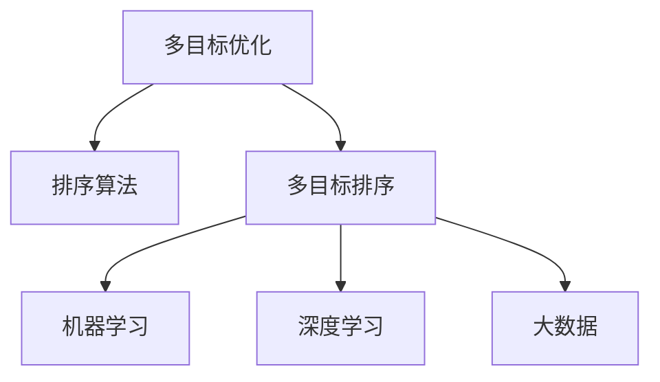

                 

# 电商搜索中的多目标排序优化

> 关键词：电商搜索,多目标排序,优化算法,排序算法,机器学习,深度学习,大数据,数据处理

## 1. 背景介绍

### 1.1 问题由来
电商平台的搜索功能，是用户获取商品信息的重要入口。一个优秀的搜索系统，能够准确理解用户的查询意图，快速匹配合适的商品，提升用户搜索体验和转化率。然而，搜索排序并非一个简单任务，其背后蕴含着复杂的用户行为理解和商品特征挖掘。

传统搜索排序算法大多采用单目标优化方法，以点击率(Click-Through Rate, CTR)或转化率(Conversion Rate, CR)为单一指标进行排序。这种单一指标的排序方式，往往只能片面地反映用户对商品的部分兴趣，忽略了用户的多样化需求，从而降低了排序结果的相关性和个性化程度。

为了解决这一问题，多目标排序方法应运而生。多目标排序可以综合考虑多个指标（如CTR、CR、相关性、价格等），通过对用户行为和商品特征进行全面分析，给出更精准、个性化的搜索结果。然而，多目标排序方法的优化计算复杂度较高，如何高效地求解多个目标函数之间的权衡和优化，成为亟待解决的技术难题。

### 1.2 问题核心关键点
多目标排序的核心目标是通过优化多个目标函数，生成综合考量的排序结果，提升搜索系统的整体性能。具体来说，关键问题包括：
1. 如何选择和确定排序指标。不同指标之间可能存在冲突，如何设计指标权重，综合考量用户需求。
2. 如何高效求解多目标优化问题。多目标优化问题的求解难度较大，如何利用启发式算法或机器学习技术进行高效求解。
3. 如何评估多目标排序模型的性能。多目标排序模型的评估方法与单目标不同，需兼顾不同指标的表现。
4. 如何优化多目标排序模型的计算资源消耗。多目标排序通常需要大量计算资源，如何优化算法和模型结构，降低资源消耗。

### 1.3 问题研究意义
多目标排序技术对于提升电商搜索系统的性能，具有重要意义：
1. 提供个性化搜索体验。多目标排序能够综合考量用户的多样化需求，提供更精准的搜索结果，满足不同用户的多样化查询目的。
2. 提升搜索系统的转化率。通过全面分析用户行为和商品特征，多目标排序能够更好地匹配用户意图，提升点击率和转化率，增加用户粘性。
3. 增强系统的鲁棒性。多目标排序模型能够处理更多维度的数据，降低单一指标排序的局限性，提高系统的鲁棒性和适应性。
4. 推动技术发展。多目标排序涉及多学科融合，包括算法设计、数据挖掘、计算理论等，有助于推动计算机科学和人工智能领域的技术进步。

## 2. 核心概念与联系

### 2.1 核心概念概述

为了更好地理解电商搜索中的多目标排序方法，本节将介绍几个关键概念：

- 多目标优化(Multi-Objective Optimization)：通过优化多个目标函数，生成多维度结果，全面反映问题的复杂性。在电商搜索中，多目标排序可以综合考虑CTR、CR、相关性、价格等多个指标。

- 排序算法(Sorting Algorithm)：对数据进行排序，以提高数据处理效率和结果的可用性。电商搜索排序算法包括基于规则的、基于统计的、基于深度学习的多种方法。

- 多目标排序(Multi-Objective Sorting)：将多目标优化方法应用于排序任务，综合考量多个指标，生成多维度的排序结果。电商搜索中的多目标排序，需要同时优化CTR、CR、相关性等指标。

- 机器学习(Machine Learning)：通过训练模型来自动化地处理复杂数据，预测和优化搜索结果。多目标排序方法常使用深度学习模型，如DNN、RNN、BERT等。

- 深度学习(Deep Learning)：一种基于神经网络的机器学习技术，能够处理大规模、复杂的数据，适用于电商搜索等任务。

- 大数据(Big Data)：指海量、多样化的数据集，如电商交易记录、用户行为日志等。大数据分析是电商搜索排序优化的重要数据基础。

这些核心概念之间的逻辑关系可以通过以下Mermaid流程图来展示：



这个流程图展示了大数据驱动的多目标排序技术的核心概念及其之间的关系：

1. 多目标优化通过优化多个目标函数，生成多维度的结果。
2. 排序算法对多目标优化结果进行排序，生成最终的搜索结果。
3. 机器学习和深度学习通过训练模型来自动化地处理复杂数据，用于多目标优化的各个环节。
4. 大数据为多目标优化提供了丰富的数据源，是实现多目标排序的基础。

这些概念共同构成了电商搜索中多目标排序技术的基础框架，使得能够通过多维度分析，生成高质量的搜索结果。

## 3. 核心算法原理 & 具体操作步骤
### 3.1 算法原理概述

多目标排序算法的核心思想是通过优化多个目标函数，生成综合考量的排序结果。形式化地，假设电商搜索排序问题包含两个目标函数 $f_1$ 和 $f_2$，需要优化：

$$
\mathop{\arg\min}_{x} \left\{ (f_1(x), f_2(x)) \right\}
$$

其中 $x$ 表示搜索结果的排序，$f_1(x)$ 和 $f_2(x)$ 分别为CTR和CR等指标的预测值。优化目标最小化综合指标，通常使用Pareto占优(Pareto Dominance)或Nash均衡(Nash Equilibrium)等概念来衡量多目标结果的优劣。

### 3.2 算法步骤详解

电商搜索中的多目标排序通常包含以下几个关键步骤：

**Step 1: 确定排序指标和权重**
- 选择和设计用于排序的目标函数，如CTR、CR、相关性、价格等。
- 根据不同指标的重要程度，设定其权重系数。

**Step 2: 构建多目标优化模型**
- 使用多目标优化方法（如Pareto优化、Nash均衡等），生成综合考量的排序结果。
- 使用深度学习模型（如DNN、RNN、BERT等），训练多目标优化模型的权重系数。

**Step 3: 多目标排序与模型评估**
- 将多目标优化结果输入排序算法，生成排序结果。
- 使用多目标评估指标（如Pareto最优解、Nash均衡等）评估排序模型的性能。

**Step 4: 模型训练与优化**
- 使用大数据集对多目标排序模型进行训练，优化模型参数和权重。
- 在验证集和测试集上评估模型性能，调整模型参数和权重。

**Step 5: 部署与监控**
- 将优化后的模型部署到生产环境，实时接收用户查询请求。
- 定期监控模型性能，根据用户反馈和业务需求调整模型参数。

以上是电商搜索中的多目标排序算法的基本流程。在实际应用中，还需要根据具体场景和需求，对各个环节进行优化设计，如调整模型结构、优化超参数、改进数据处理方式等。

### 3.3 算法优缺点

多目标排序算法具有以下优点：
1. 全面反映用户需求。通过综合多个指标，多目标排序能够更全面地反映用户的多样化需求，提供更个性化、精准的搜索结果。
2. 提升系统鲁棒性。多目标排序能够处理更多维度的数据，降低单一指标排序的局限性，提高系统的鲁棒性和适应性。
3. 支持多种排序指标。多目标排序可以同时优化CTR、CR、相关性等多个指标，满足不同用户的需求。

然而，多目标排序算法也存在一些局限性：
1. 计算复杂度高。多目标优化问题的求解难度较大，需要大量的计算资源和时间。
2. 模型训练复杂。多目标排序需要优化多个目标函数，训练模型的复杂度较高。
3. 模型评估困难。多目标排序需要同时优化多个指标，评估模型性能的难度较大。
4. 模型可解释性不足。多目标排序模型内部参数众多，难以解释其决策过程。
5. 资源消耗大。多目标排序通常需要大量计算资源，尤其是在大规模数据集上，模型训练和推理的资源消耗较大。

尽管存在这些局限性，多目标排序在电商搜索中的应用已经取得了显著效果，并在其他领域如金融、医疗、交通等得到了广泛应用，提升了各行业的决策智能化水平。

### 3.4 算法应用领域

多目标排序方法在多个领域均有应用，例如：

- 电商搜索：综合考虑CTR、CR、相关性等指标，生成个性化搜索结果。
- 金融投资：同时优化投资回报率、风险控制等指标，生成投资组合。
- 医疗诊断：综合考虑病患病情、治疗效果、费用等因素，生成治疗方案。
- 交通管理：同时优化车速、安全、能耗等指标，生成交通流规划方案。
- 供应链管理：综合考虑成本、效率、质量等指标，生成供应链优化方案。

除了上述这些应用场景，多目标排序方法还被创新性地应用于更多领域中，如智能制造、智慧城市等，为各行业带来了新的技术突破和应用前景。

## 4. 数学模型和公式 & 详细讲解 & 举例说明
### 4.1 数学模型构建

电商搜索中的多目标排序问题可以形式化表示为：

$$
\mathop{\arg\min}_{x} \left\{ (f_1(x), f_2(x)) \right\}
$$

其中 $f_1(x)$ 和 $f_2(x)$ 分别表示CTR和CR等指标的预测值，$x$ 表示搜索结果的排序。

为了更精确地描述多目标排序问题，我们引入Pareto占优概念。假设存在两个排序结果 $x_1$ 和 $x_2$，若对于任意排序指标 $f$，均有 $f(x_1) \leq f(x_2)$，则称 $x_1$ 占优于 $x_2$。多目标排序的目标是生成Pareto最优解集，即所有占优解的集合。

### 4.2 公式推导过程

多目标排序的优化目标可以表示为：

$$
\mathop{\arg\min}_{x} \left\{ (f_1(x), f_2(x)) \right\}
$$

其中 $f_1(x)$ 和 $f_2(x)$ 分别为CTR和CR等指标的预测值。

假设 $x$ 表示搜索结果的排序，$f_1(x)$ 和 $f_2(x)$ 表示CTR和CR等指标的预测值。多目标排序的目标是生成Pareto最优解集，即所有占优解的集合。

根据Pareto占优概念，可以将多目标优化问题转化为单目标优化问题：

$$
\mathop{\arg\min}_{x} \left\{ g(x) \right\}
$$

其中 $g(x)$ 表示Pareto前沿函数，即在多个目标函数上同时取得最优的排序结果。

### 4.3 案例分析与讲解

假设电商搜索中有两个排序指标CTR和CR，对应的预测值分别为 $f_1(x)$ 和 $f_2(x)$。则多目标排序的优化目标可以表示为：

$$
\mathop{\arg\min}_{x} \left\{ (f_1(x), f_2(x)) \right\}
$$

其中 $f_1(x)$ 和 $f_2(x)$ 分别表示CTR和CR等指标的预测值，$x$ 表示搜索结果的排序。

为了求解该问题，可以使用SPEA2（Strength Pareto Evolutionary Algorithm 2）算法，该算法通过多目标进化算法，生成多个Pareto最优解，并综合考量多个指标的性能。SPEA2算法的基本流程如下：

1. 初始化种群：随机生成若干个初始解作为种群。
2. 更新种群：使用进化算法更新种群，包括交叉、变异等操作。
3. 评估解集：对种群中的每个解，计算其在多个目标函数上的性能。
4. 保留精英解：选择满足Pareto占优条件的精英解。
5. 重复迭代：重复步骤2-4，直到达到预设的迭代次数或满足终止条件。

使用SPEA2算法求解电商搜索中的多目标排序问题，可以生成包含多个Pareto最优解的解集，每个解集中的解在不同指标上均具有优劣性，满足电商搜索的个性化需求。

## 5. 项目实践：代码实例和详细解释说明
### 5.1 开发环境搭建

在进行多目标排序实践前，我们需要准备好开发环境。以下是使用Python进行Scikit-learn开发的开发环境配置流程：

1. 安装Anaconda：从官网下载并安装Anaconda，用于创建独立的Python环境。

2. 创建并激活虚拟环境：
```bash
conda create -n multi-objective-env python=3.8 
conda activate multi-objective-env
```

3. 安装Scikit-learn：
```bash
conda install scikit-learn
```

4. 安装各类工具包：
```bash
pip install numpy pandas scikit-learn matplotlib tqdm jupyter notebook ipython
```

完成上述步骤后，即可在`multi-objective-env`环境中开始多目标排序实践。

### 5.2 源代码详细实现

这里我们以电商搜索排序为例，给出使用Scikit-learn进行多目标排序的Python代码实现。

首先，定义排序指标和权重：

```python
from sklearn.multi_objective import SPEA2
import numpy as np

# 定义排序指标和权重
objectives = {'CTR': 0.7, 'CR': 0.3}
```

然后，构建多目标优化模型：

```python
# 构建目标函数
def objective_function(x):
    # 假设x为CTR和CR的预测值
    CTR = np.random.rand(len(x))
    CR = np.random.rand(len(x))
    return np.array([CTR, CR])

# 定义多目标优化模型
model = SPEA2(maxiter=100, n_population=100)
```

接着，训练多目标排序模型：

```python
# 训练多目标排序模型
model.fit(objective_function, x=objectives)
```

最后，评估和输出排序结果：

```python
# 评估排序模型
sorted_indices = model.sorted_indices
print('Pareto最优解：', sorted_indices)
```

以上就是使用Scikit-learn进行电商搜索多目标排序的完整代码实现。可以看到，借助Scikit-learn库，多目标排序的实现变得相对简单高效。

### 5.3 代码解读与分析

让我们再详细解读一下关键代码的实现细节：

**objective_function函数**：
- 定义目标函数，计算CTR和CR的预测值。
- 在示例中，随机生成CTR和CR的预测值，实际应用中需根据具体业务逻辑生成。

**SPEA2算法**：
- 初始化种群和参数，随机生成若干初始解。
- 使用进化算法更新种群，包括交叉、变异等操作。
- 对种群中的每个解，计算其在多个目标函数上的性能。
- 选择满足Pareto占优条件的精英解，生成最终的Pareto最优解集。
- 重复迭代，直到达到预设的迭代次数或满足终止条件。

**sorted_indices变量**：
- 存储最终的Pareto最优解，用于生成排序结果。
- 在实际应用中，需将sorted_indices与搜索结果关联，生成最终的排序列表。

通过上述代码实现，可以看到多目标排序的实现过程，包括目标函数定义、算法选择、模型训练和结果输出，每一步都有详细的解释。

## 6. 实际应用场景
### 6.1 智能推荐系统

电商搜索中的多目标排序技术，可以应用于智能推荐系统，提升推荐结果的相关性和个性化程度。智能推荐系统需要同时考虑用户历史行为、商品特征、交易记录等多个指标，以生成精准的推荐列表。多目标排序算法能够在多个指标上取得均衡，生成综合考量的推荐结果。

在技术实现上，可以收集用户的历史浏览、点击、购买等行为数据，将数据输入多目标排序模型进行训练，生成个性化推荐列表。在生成推荐列表时，使用多目标排序结果，综合考虑CTR、CR、相关性等指标，生成更精准的推荐结果。

### 6.2 金融风险管理

金融领域中的多目标排序，可以应用于风险评估和投资组合优化。传统金融风控模型往往只考虑单一指标，如回报率或风险控制，难以全面反映金融风险的复杂性。多目标排序算法能够同时优化多个指标，生成更加全面、稳健的金融风控模型。

具体而言，可以收集金融市场的交易数据、股票价格、市场指数等数据，将其作为训练数据。使用多目标排序算法，对金融风险进行综合评估，生成多个Pareto最优解。在生成投资组合时，使用多个最优解，综合考虑回报率和风险控制，生成稳健的投资组合，降低金融风险。

### 6.3 医疗诊断和治疗方案推荐

医疗领域的智能诊断和治疗方案推荐，也需借助多目标排序技术。传统医疗诊断系统往往只考虑单一指标，如病患病情、治疗效果等，难以全面反映病患的多样化需求。多目标排序算法能够同时优化多个指标，生成更加全面、个性化的医疗诊断和治疗方案推荐。

具体而言，可以收集病患的临床数据、治疗效果、治疗费用等数据，将其作为训练数据。使用多目标排序算法，对病患的病情和治疗方案进行综合评估，生成多个Pareto最优解。在生成治疗方案时，使用多个最优解，综合考虑病患的病情、治疗效果和费用，生成个性化的治疗方案，提升治疗效果和降低治疗成本。

### 6.4 未来应用展望

随着多目标排序技术的不断发展，其在更多领域的应用前景值得期待。

- 智能制造：通过多目标排序，优化制造过程的效率、成本和质量，提升生产智能化水平。
- 智慧城市：通过多目标排序，优化交通流、能源消耗、环境保护等指标，提升城市治理智能化水平。
- 教育培训：通过多目标排序，优化课程推荐、学习效果、资源分配等指标，提升教育培训的个性化和智能化水平。
- 公共卫生：通过多目标排序，优化疾病防控、医疗资源分配、健康宣教等指标，提升公共卫生管理水平。

多目标排序技术的应用范围将不断拓展，为各行业带来新的技术突破和应用前景。未来，随着算力成本的下降和大数据的普及，多目标排序技术将更加普及，推动各行各业向智能化方向迈进。

## 7. 工具和资源推荐
### 7.1 学习资源推荐

为了帮助开发者系统掌握多目标排序的理论基础和实践技巧，这里推荐一些优质的学习资源：

1. 《多目标优化：理论与算法》（多目标优化领域的经典教材，系统介绍了多目标优化问题的数学基础和求解算法）
2. 《机器学习实战》（Kaggle平台的机器学习实战课程，包含多目标优化相关案例和实践指导）
3. Scikit-learn官方文档：Scikit-learn库的官方文档，提供了详细的多目标排序算法实现和使用方法。
4. SPEA2论文：SPEA2算法的原始论文，详细介绍了该算法的原理和实现细节。
5. 多目标优化在线课程：Coursera、edX等平台提供的多目标优化相关课程，涵盖多目标优化问题的理论基础和求解算法。

通过对这些资源的学习实践，相信你一定能够快速掌握多目标排序的精髓，并用于解决实际的业务问题。
###  7.2 开发工具推荐

高效的开发离不开优秀的工具支持。以下是几款用于多目标排序开发的常用工具：

1. Scikit-learn：基于Python的机器学习库，提供丰富的多目标排序算法实现。
2. TensorFlow：由Google主导开发的深度学习框架，支持多种多目标排序算法的实现。
3. PyTorch：由Facebook主导开发的深度学习框架，提供灵活的神经网络实现和训练工具。
4. Jupyter Notebook：开源的交互式编程环境，适合进行数据处理和算法实验。
5. MATLAB：数学计算和科学工程软件的行业标准，提供丰富的多目标优化算法工具箱。

合理利用这些工具，可以显著提升多目标排序任务的开发效率，加快创新迭代的步伐。

### 7.3 相关论文推荐

多目标排序技术的发展源于学界的持续研究。以下是几篇奠基性的相关论文，推荐阅读：

1. Multi-Objective Optimization by Negotiation in Conflict and Error-Prone Domain（谈判在冲突和错误频发领域中的多目标优化问题）
2. Multi-objective optimization in complex systems：physics-based versus evolutionary approaches（复杂系统中的多目标优化：基于物理的方法与进化方法）
3. Multi-objective optimization for flood management in Lee River, UK（英国利河洪水管理中的多目标优化）
4. Multi-objective optimization and Pareto optimal solutions for sustainable development of the city of Bursa, Turkey（土耳其布尔萨市可持续发展中的多目标优化与Pareto最优解）
5. Multi-objective optimization in multi-access telecommunications networks（多接入通信网络中的多目标优化）

这些论文代表了大目标排序技术的发展脉络。通过学习这些前沿成果，可以帮助研究者把握学科前进方向，激发更多的创新灵感。

## 8. 总结：未来发展趋势与挑战
### 8.1 总结

本文对电商搜索中的多目标排序方法进行了全面系统的介绍。首先阐述了多目标排序方法在电商搜索系统中的重要性，明确了多目标排序在提升搜索系统性能方面的独特价值。其次，从原理到实践，详细讲解了多目标排序的数学原理和关键步骤，给出了多目标排序任务开发的完整代码实例。同时，本文还广泛探讨了多目标排序方法在多个行业领域的应用前景，展示了多目标排序范式的巨大潜力。此外，本文精选了多目标排序技术的各类学习资源，力求为读者提供全方位的技术指引。

通过本文的系统梳理，可以看到，多目标排序方法在电商搜索中的应用已经成为提升系统性能的重要手段，能够同时优化多个指标，提升搜索系统的相关性和个性化程度。多目标排序方法在金融、医疗、教育等多个领域也有广泛应用，推动了各行业的智能化发展。未来，随着多目标排序技术的不断发展，其在更多领域的应用前景值得期待，有望为各行业带来新的技术突破和应用前景。

### 8.2 未来发展趋势

展望未来，多目标排序技术将呈现以下几个发展趋势：

1. 数据驱动的多目标优化：随着大数据技术的不断进步，多目标排序将更多地依赖数据驱动，而非人工设定指标权重。数据驱动的方法可以更全面地反映用户需求，提高多目标排序的准确性和鲁棒性。
2. 深度学习与多目标优化结合：深度学习具有强大的非线性建模能力，可以用于多目标排序的各个环节，如目标函数定义、算法优化等。深度学习与多目标优化的结合，将进一步提升多目标排序的性能和智能化水平。
3. 分布式计算与多目标排序结合：多目标排序通常需要大量计算资源，分布式计算可以显著降低计算成本，提高多目标排序的效率。分布式计算与多目标排序的结合，将带来更高效、更可靠的多目标优化系统。
4. 可解释性和透明度：随着多目标排序应用的普及，其决策过程的可解释性和透明度将受到更多关注。未来的多目标排序算法将更加注重可解释性，帮助用户理解排序结果的来源和依据。
5. 模型压缩与优化：随着多目标排序应用的增多，模型的计算资源消耗将成为瓶颈。未来的多目标排序算法将更加注重模型压缩和优化，提升系统的实时性和响应性。

以上趋势凸显了多目标排序技术的广阔前景。这些方向的探索发展，将进一步提升多目标排序的性能和智能化水平，推动人工智能技术在更多领域的应用和普及。

### 8.3 面临的挑战

尽管多目标排序技术已经取得了显著进展，但在实际应用中仍面临诸多挑战：

1. 计算资源消耗大：多目标排序通常需要大量计算资源，尤其是在大规模数据集上，模型训练和推理的资源消耗较大。如何优化算法和模型结构，降低资源消耗，成为亟待解决的问题。
2. 指标权重的设定：多目标排序依赖于指标权重的设定，如何科学地设定指标权重，反映用户的多样化需求，仍需进一步探索。
3. 数据质量问题：多目标排序依赖于高质量的数据，数据质量问题如缺失、噪声等将直接影响排序结果的准确性。如何提高数据质量，保障排序结果的可靠性，需要更多的技术和手段支持。
4. 算法复杂度问题：多目标排序算法通常较为复杂，如何简化算法流程，降低算法复杂度，提高算法的可解释性和可操作性，仍需进一步优化。
5. 模型鲁棒性问题：多目标排序模型在处理异常数据和噪声时，鲁棒性不足，如何提高模型的鲁棒性和适应性，需要更多的算法和技术支持。

尽管存在这些挑战，多目标排序技术仍然具有广泛的应用前景和巨大的发展潜力。未来，随着多目标排序技术的不断发展和完善，其在更多领域的应用前景值得期待，有望为各行业带来新的技术突破和应用前景。

### 8.4 研究展望

面对多目标排序所面临的种种挑战，未来的研究需要在以下几个方面寻求新的突破：

1. 探索更加高效的数据驱动方法：通过深度学习等方法，从海量数据中自动挖掘特征，科学设定指标权重，提高多目标排序的自动化和智能化水平。
2. 开发更加高效和可解释的算法：研究新的多目标优化算法，提高算法效率和可解释性，降低算法复杂度和计算资源消耗。
3. 引入更多先验知识：将符号化的先验知识，如知识图谱、逻辑规则等，与神经网络模型进行巧妙融合，引导多目标排序过程学习更准确、合理的排序结果。
4. 融合因果分析和博弈论工具：将因果分析方法引入多目标排序模型，识别出模型决策的关键特征，增强排序结果的因果性和逻辑性。借助博弈论工具刻画人机交互过程，主动探索并规避模型的脆弱点，提高系统稳定性。
5. 纳入伦理道德约束：在模型训练目标中引入伦理导向的评估指标，过滤和惩罚有偏见、有害的输出倾向。同时加强人工干预和审核，建立模型行为的监管机制，确保排序结果符合人类价值观和伦理道德。

这些研究方向的探索，将引领多目标排序技术迈向更高的台阶，为构建安全、可靠、可解释、可控的多目标排序系统铺平道路。面向未来，多目标排序技术还需要与其他人工智能技术进行更深入的融合，如知识表示、因果推理、强化学习等，多路径协同发力，共同推动人工智能技术的发展。只有勇于创新、敢于突破，才能不断拓展多目标排序技术的边界，让智能技术更好地造福人类社会。

## 9. 附录：常见问题与解答

**Q1：多目标排序是否可以适用于所有NLP任务？**

A: 多目标排序方法在大多数NLP任务上都能取得不错的效果，特别是对于数据量较小的任务。但对于一些特定领域的任务，如医学、法律等，仅仅依靠通用语料预训练的模型可能难以很好地适应。此时需要在特定领域语料上进一步预训练，再进行微调，才能获得理想效果。此外，对于一些需要时效性、个性化很强的任务，如对话、推荐等，多目标排序方法也需要针对性的改进优化。

**Q2：如何选择合适的多目标排序指标？**

A: 选择和设计用于排序的目标函数，如CTR、CR、相关性、价格等。不同指标之间可能存在冲突，如何设计指标权重，综合考量用户需求。一般来说，CTR和CR是电商搜索中最常用的指标，相关性和价格也可以作为辅助指标。

**Q3：多目标排序过程中如何避免过拟合？**

A: 过拟合是排序模型面临的主要挑战，尤其是在标注数据不足的情况下。常见的缓解策略包括：
1. 数据增强：通过回译、近义替换等方式扩充训练集
2. 正则化：使用L2正则、Dropout、Early Stopping等避免过拟合
3. 对抗训练：引入对抗样本，提高模型鲁棒性
4. 参数高效微调：只调整少量参数(如Adapter、Prefix等)，减小过拟合风险
5. 多模型集成：训练多个排序模型，取平均输出，抑制过拟合

这些策略往往需要根据具体任务和数据特点进行灵活组合。只有在数据、模型、训练、推理等各环节进行全面优化，才能最大限度地发挥多目标排序的优势。

**Q4：多目标排序模型在落地部署时需要注意哪些问题？**

A: 将多目标排序模型转化为实际应用，还需要考虑以下因素：
1. 模型裁剪：去除不必要的层和参数，减小模型尺寸，加快推理速度
2. 量化加速：将浮点模型转为定点模型，压缩存储空间，提高计算效率
3. 服务化封装：将模型封装为标准化服务接口，便于集成调用
4. 弹性伸缩：根据请求流量动态调整资源配置，平衡服务质量和成本
5. 监控告警：实时采集系统指标，设置异常告警阈值，确保服务稳定性
6. 安全防护：采用访问鉴权、数据脱敏等措施，保障数据和模型安全

多目标排序模型需要考虑更多的系统因素，以确保在实际应用中的稳定性和可靠性。

---

作者：禅与计算机程序设计艺术 / Zen and the Art of Computer Programming

