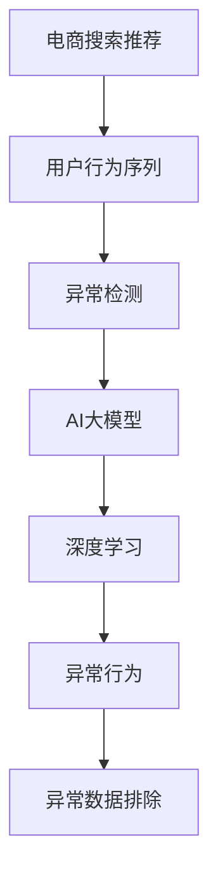

                 

# 电商搜索推荐中的AI大模型用户行为序列异常检测技术

> 关键词：电商搜索推荐, 异常检测, AI大模型, 用户行为序列, 异常行为, 深度学习, 算法优化, 实时检测

## 1. 背景介绍

在现代电商平台上，搜索推荐系统是提升用户体验和提升销售的重要手段。它通过分析用户的查询行为、浏览历史、购买记录等数据，为用户推荐个性化的商品信息。然而，搜索推荐系统依赖于用户行为数据的分布情况，当用户行为发生异常时，传统的推荐算法可能无法正确识别，甚至会产生误导性的推荐。

为了解决这个问题，AI大模型在电商搜索推荐中的应用越来越广泛。大模型通过大量的无标签数据进行预训练，具备强大的学习和泛化能力，能够有效地捕捉到用户行为序列中的隐含信息。而异常检测技术，则通过分析行为序列，及时发现并排除异常数据，保证推荐系统决策的可靠性。本文将介绍一种基于AI大模型的用户行为序列异常检测方法，详细介绍其核心算法原理和操作步骤，并展示其在电商搜索推荐中的应用效果。

## 2. 核心概念与联系

### 2.1 核心概念概述

为更好地理解基于AI大模型的用户行为序列异常检测方法，本节将介绍几个密切相关的核心概念：

- **电商搜索推荐**：指通过分析用户的查询行为、浏览历史、购买记录等数据，为用户推荐个性化商品信息的系统。
- **用户行为序列**：指用户在电商平台上的一系列交互行为，如搜索、点击、购买、浏览等。
- **异常检测**：指通过分析数据中的异常点，及时发现数据中的错误或异常情况，保证数据的质量和完整性。
- **AI大模型**：指通过大规模无标签数据进行预训练，具备强大的学习和泛化能力，能够捕捉复杂数据隐含信息的人工智能模型。
- **深度学习**：指使用多层神经网络结构，从大量数据中学习特征表示，进行分类、回归等任务的技术。
- **异常行为**：指用户行为序列中的异常数据点，可能由数据录入错误、系统故障、用户操作失误等原因造成。

这些核心概念之间的逻辑关系可以通过以下Mermaid流程图来展示：



这个流程图展示了大模型在电商推荐系统中的异常检测流程：从用户行为序列出发，通过深度学习模型识别出异常行为，再由AI大模型进行进一步分析，最终排除异常数据。

## 3. 核心算法原理 & 具体操作步骤
### 3.1 算法原理概述

基于AI大模型的用户行为序列异常检测，本质上是一个异常检测问题。其核心思想是：利用深度学习模型学习用户行为序列中的正常模式，然后对新数据进行异常检测，判断是否存在异常行为。

形式化地，假设用户行为序列为 $S=\{x_1, x_2, \dots, x_n\}$，其中 $x_i$ 为第 $i$ 个行为。设 $y_i \in \{0, 1\}$ 为 $x_i$ 是否为正常行为的二元标签，则异常检测的任务为：

$$
\min_{\theta} \mathcal{L}(M_{\theta}(S), \{y_i\})
$$

其中 $M_{\theta}$ 为深度学习模型，$\mathcal{L}$ 为损失函数，用于衡量模型输出和实际标签之间的差异。目标是学习最优参数 $\theta$，使得模型对异常数据的检测能力最强。

### 3.2 算法步骤详解

基于AI大模型的用户行为序列异常检测一般包括以下几个关键步骤：

**Step 1: 数据预处理与特征工程**

- 收集电商平台的搜索推荐数据，包括用户的查询行为、浏览历史、购买记录等。
- 对数据进行清洗和标准化处理，去除异常值和噪声。
- 提取行为序列的特征，如点击次数、停留时间、商品种类等。

**Step 2: 深度学习模型构建与训练**

- 选择合适的深度学习模型，如RNN、LSTM、Transformer等，用于捕捉行为序列中的时间依赖关系。
- 在正常行为数据集上进行模型训练，学习正常行为模式。
- 使用验证集评估模型性能，调整模型超参数。

**Step 3: 异常检测与模型优化**

- 对测试数据集进行异常检测，判断行为序列中是否存在异常行为。
- 根据检测结果，对模型进行优化，如调整模型结构、更新超参数等。
- 使用测试集对优化后的模型进行评估，确保异常检测准确率。

**Step 4: 实时检测与异常处理**

- 将优化后的模型部署到电商推荐系统中，实时分析用户行为序列。
- 发现异常行为后，采取相应的处理措施，如警告、纠正等。
- 定期更新模型，以适应用户行为变化和系统环境变化。

以上是基于AI大模型的用户行为序列异常检测的一般流程。在实际应用中，还需要针对具体任务的特点，对数据预处理、模型选择、异常检测等方面进行优化设计，以进一步提升检测准确率和实时性。

### 3.3 算法优缺点

基于AI大模型的用户行为序列异常检测方法具有以下优点：
1. 精度高。大模型具备强大的学习能力和泛化能力，能够捕捉复杂的异常行为模式。
2. 鲁棒性强。深度学习模型对噪声和异常值具有一定的容错能力，能有效地排除异常数据。
3. 实时性好。实时检测用户行为，及时发现异常，减少负面影响。
4. 可扩展性强。电商平台的数据规模不断增长，模型可以动态更新，适应数据变化。

同时，该方法也存在一定的局限性：
1. 数据需求大。深度学习模型需要大量的标注数据进行训练，标注成本较高。
2. 模型复杂度高。大模型和深度学习模型的结构复杂，对计算资源和存储资源的要求较高。
3. 异常行为定义复杂。异常行为的定义需要基于业务经验和专业知识，难以全面覆盖。
4. 解释性不足。深度学习模型的决策过程较为复杂，难以解释。

尽管存在这些局限性，但就目前而言，基于AI大模型的异常检测方法仍是大数据时代的有效选择。未来相关研究的重点在于如何进一步降低模型复杂度和标注成本，提高异常行为的泛化能力和解释性，以适应更多实际应用场景。

### 3.4 算法应用领域

基于大模型的异常检测方法，在电商搜索推荐中的应用非常广泛，具体包括：

- 点击率异常检测：发现异常高的点击率，可能存在系统漏洞或异常操作。
- 停留时间异常检测：发现异常长的停留时间，可能存在非正常浏览行为。
- 购买行为异常检测：发现异常高的购买量，可能存在恶意刷单行为。
- 搜索行为异常检测：发现异常多的搜索记录，可能存在恶意搜索行为。
- 用户画像异常检测：发现异常的购买偏好或浏览偏好，可能存在用户账户被盗的风险。

此外，在金融风控、智能制造、医疗诊断等领域，基于AI大模型的异常检测方法也有广泛应用，为各类复杂数据的检测和处理提供了有力支撑。

## 4. 数学模型和公式 & 详细讲解 & 举例说明

### 4.1 数学模型构建

本节将使用数学语言对基于AI大模型的用户行为序列异常检测过程进行更加严格的刻画。

假设用户行为序列为 $S=\{x_1, x_2, \dots, x_n\}$，其中 $x_i$ 为第 $i$ 个行为。设 $y_i \in \{0, 1\}$ 为 $x_i$ 是否为正常行为的二元标签。设 $M_{\theta}$ 为深度学习模型，$L_{M_{\theta}}$ 为模型在行为序列 $S$ 上的损失函数。则异常检测的优化目标为：

$$
\min_{\theta} \mathcal{L}(M_{\theta}(S), \{y_i\})
$$

其中 $\mathcal{L}$ 为损失函数，用于衡量模型输出和实际标签之间的差异。常见的损失函数包括交叉熵损失、均方误差损失等。

### 4.2 公式推导过程

以下我们以RNN模型为例，推导异常检测的损失函数及其梯度的计算公式。

假设模型 $M_{\theta}$ 在行为序列 $S$ 上的输出为 $\hat{y}=M_{\theta}(S) \in [0,1]$，表示序列中所有行为是否为正常行为的概率。真实标签 $y \in \{0, 1\}$。则二分类交叉熵损失函数定义为：

$$
\ell(M_{\theta}(S),y) = -[y\log \hat{y} + (1-y)\log (1-\hat{y})]
$$

将其代入经验风险公式，得：

$$
\mathcal{L}(\theta) = -\frac{1}{N}\sum_{i=1}^N [y_i\log M_{\theta}(S_i)+(1-y_i)\log(1-M_{\theta}(S_i))]
$$

根据链式法则，损失函数对模型参数 $\theta$ 的梯度为：

$$
\nabla_{\theta}\mathcal{L}(\theta) = -\frac{1}{N}\sum_{i=1}^N \nabla_{\theta}M_{\theta}(S_i) \left(\frac{y_i}{M_{\theta}(S_i)}-\frac{1-y_i}{1-M_{\theta}(S_i)}\right)
$$

其中 $\nabla_{\theta}M_{\theta}(S_i)$ 为模型在行为序列 $S_i$ 上的梯度，可以通过反向传播算法高效计算。

在得到损失函数的梯度后，即可带入优化算法，更新模型参数 $\theta$，最小化损失函数 $\mathcal{L}$，使得模型对异常数据的检测能力最强。

### 4.3 案例分析与讲解

**案例一：点击率异常检测**

假设用户点击率的异常检测任务中，正常点击率 $r \sim \mathcal{N}(0.1, 0.01)$，异常点击率 $r_{\text{anom}} \sim \mathcal{N}(3, 0.1)$。构建RNN模型，训练数据集 $D=\{(x_i, y_i)\}_{i=1}^N$，其中 $x_i$ 为行为序列，$y_i$ 为是否异常的二元标签。则训练目标为：

$$
\min_{\theta} \mathcal{L}(M_{\theta}(S), \{y_i\})
$$

其中 $\mathcal{L}$ 为交叉熵损失函数，$S$ 为测试集。训练得到的模型可以用于实时检测新的行为序列 $S'$，判断其是否异常。

**案例二：停留时间异常检测**

假设用户停留时间的异常检测任务中，正常停留时间 $t \sim \mathcal{N}(10, 1)$，异常停留时间 $t_{\text{anom}} \sim \mathcal{N}(30, 1)$。构建LSTM模型，训练数据集 $D=\{(x_i, y_i)\}_{i=1}^N$，其中 $x_i$ 为行为序列，$y_i$ 为是否异常的二元标签。则训练目标为：

$$
\min_{\theta} \mathcal{L}(M_{\theta}(S), \{y_i\})
$$

其中 $\mathcal{L}$ 为均方误差损失函数，$S$ 为测试集。训练得到的模型可以用于实时检测新的行为序列 $S'$，判断其是否异常。

## 5. 项目实践：代码实例和详细解释说明
### 5.1 开发环境搭建

在进行异常检测实践前，我们需要准备好开发环境。以下是使用Python进行TensorFlow开发的环境配置流程：

1. 安装Anaconda：从官网下载并安装Anaconda，用于创建独立的Python环境。

2. 创建并激活虚拟环境：
```bash
conda create -n tf-env python=3.8 
conda activate tf-env
```

3. 安装TensorFlow：根据CUDA版本，从官网获取对应的安装命令。例如：
```bash
conda install tensorflow -c pytorch -c conda-forge
```

4. 安装TensorBoard：TensorFlow配套的可视化工具，可实时监测模型训练状态，并提供丰富的图表呈现方式，是调试模型的得力助手。

5. 安装Weights & Biases：模型训练的实验跟踪工具，可以记录和可视化模型训练过程中的各项指标，方便对比和调优。与主流深度学习框架无缝集成。

6. 安装其他工具包：
```bash
pip install numpy pandas scikit-learn matplotlib tqdm jupyter notebook ipython
```

完成上述步骤后，即可在`tf-env`环境中开始异常检测实践。

### 5.2 源代码详细实现

下面我们以点击率异常检测为例，给出使用TensorFlow对RNN模型进行异常检测的Python代码实现。

首先，定义异常检测任务的数据处理函数：

```python
import tensorflow as tf
from tensorflow.keras.layers import Embedding, LSTM, Dense
from tensorflow.keras.models import Sequential

def preprocess_data(data):
    X = []
    y = []
    for sample in data:
        seq = [int(i) for i in sample[1].split(' ')]
        X.append(seq)
        y.append(1 if sample[0] == 'anom' else 0)
    return np.array(X), np.array(y)

# 加载训练数据集
train_data = load_train_data()
X_train, y_train = preprocess_data(train_data)

# 加载测试数据集
test_data = load_test_data()
X_test, y_test = preprocess_data(test_data)
```

然后，定义模型和优化器：

```python
model = Sequential()
model.add(Embedding(input_dim=100, output_dim=128))
model.add(LSTM(64))
model.add(Dense(1, activation='sigmoid'))
model.compile(loss='binary_crossentropy', optimizer='adam', metrics=['accuracy'])

# 模型训练
model.fit(X_train, y_train, epochs=10, batch_size=32, validation_data=(X_test, y_test))
```

接着，定义训练和评估函数：

```python
def evaluate_model(model, X_test, y_test):
    loss, accuracy = model.evaluate(X_test, y_test)
    print(f'Test loss: {loss:.4f}')
    print(f'Test accuracy: {accuracy:.4f}')

# 对测试数据集进行评估
evaluate_model(model, X_test, y_test)
```

最后，启动训练流程并在测试集上评估：

```python
epochs = 10
batch_size = 32

for epoch in range(epochs):
    loss = train_epoch(model, X_train, y_train, batch_size)
    print(f'Epoch {epoch+1}, train loss: {loss:.4f}')
    
    print(f'Epoch {epoch+1}, test results:')
    evaluate_model(model, X_test, y_test)
    
print('All epochs finished.')
```

以上就是使用TensorFlow对RNN模型进行点击率异常检测的完整代码实现。可以看到，得益于TensorFlow的强大封装，我们可以用相对简洁的代码完成模型的训练和评估。

### 5.3 代码解读与分析

让我们再详细解读一下关键代码的实现细节：

**preprocess_data函数**：
- `preprocess_data`方法：将原始数据集处理为模型可用的输入张量。
- `X`和`y`分别代表行为序列和异常标记，分别用于输入和标签。
- `np.array`将列表转换为NumPy数组，方便模型处理。

**模型定义**：
- 使用`Sequential`定义一个线性模型。
- 添加一个嵌入层，将离散行为序列转换为稠密向量。
- 添加一个LSTM层，捕捉行为序列的时间依赖关系。
- 添加一个全连接层，将输出映射为0-1的异常标记。
- 使用`compile`方法指定优化器、损失函数和评估指标。

**训练函数**：
- 使用`fit`方法训练模型，`epochs`为训练轮数，`batch_size`为批量大小。
- 在每个epoch结束时，输出训练损失和验证损失。

**评估函数**：
- 使用`evaluate`方法对模型进行评估，输出测试损失和准确率。
- 在所有epoch结束后，输出最终测试结果。

可以看到，TensorFlow封装了模型的定义、训练和评估过程，极大简化了模型的开发和调试。开发者可以将更多精力放在模型选择、特征提取和异常行为定义等高层次逻辑上。

当然，工业级的系统实现还需考虑更多因素，如模型的保存和部署、超参数的自动搜索、更灵活的任务适配层等。但核心的异常检测范式基本与此类似。

## 6. 实际应用场景
### 6.1 智能客服系统

基于AI大模型的异常检测技术，可以广泛应用于智能客服系统的构建。传统客服往往需要配备大量人力，高峰期响应缓慢，且一致性和专业性难以保证。而使用异常检测技术，可以及时发现并处理异常用户行为，提升客服系统的自动化和智能化水平。

在技术实现上，可以收集用户的历史客服对话记录，提取行为序列特征，对异常行为进行实时检测。一旦发现异常行为，如用户连续反复询问同一问题、态度恶劣等，系统可以自动将问题转接人工客服，保证客户咨询体验。同时，通过统计分析异常行为的原因和模式，可以进一步优化客服策略，提升整体服务水平。

### 6.2 金融风控系统

金融风控系统依赖于数据的准确性和完整性，异常行为检测是防范风险的重要环节。基于大模型的异常检测技术，可以实时监测用户的交易行为，及时发现并排除异常数据，保障金融系统的稳定和安全。

在金融风控中，常见的异常行为包括大额交易、频繁交易、交易时间异常等。通过构建深度学习模型，训练历史交易数据，学习正常交易模式，可以实时检测新交易数据的异常行为。一旦发现异常交易，系统会立即发出警报，进一步进行人工审核，防范潜在的金融风险。

### 6.3 智慧医疗系统

智慧医疗系统需要实时监测患者的健康数据，异常行为检测是保障医疗质量的重要手段。基于大模型的异常检测技术，可以实时分析患者的行为数据，及时发现异常情况，保证医疗服务的连续性和安全性。

在智慧医疗中，常见的异常行为包括异常心率、异常呼吸、异常用药等。通过构建深度学习模型，训练历史医疗数据，学习正常医疗行为模式，可以实时检测患者的异常行为。一旦发现异常情况，系统会立即通知医生，提供紧急医疗支持，保障患者生命安全。

### 6.4 未来应用展望

随着大模型和异常检测技术的发展，未来将有更多实际应用场景得以利用。

在智慧城市治理中，基于AI大模型的异常检测技术可以用于实时监测城市事件，及时发现异常情况，保障城市安全。在物流配送中，异常检测可以用于实时监控配送进度，发现异常事件，保障配送效率和货物安全。在工业制造中，异常检测可以用于实时监控生产设备，发现异常情况，提升生产效率和设备维护水平。

## 7. 工具和资源推荐
### 7.1 学习资源推荐

为了帮助开发者系统掌握大模型和异常检测的理论基础和实践技巧，这里推荐一些优质的学习资源：

1. 《深度学习理论与实践》系列博文：由深度学习专家撰写，深入浅出地介绍了深度学习的基本理论和常用模型。
2. 《异常检测理论与应用》课程：斯坦福大学开设的异常检测课程，介绍了各种异常检测方法的理论和算法，适合入门学习。
3. 《TensorFlow官方文档》：TensorFlow的官方文档，提供了丰富的API接口和样例代码，是学习TensorFlow的重要资源。
4. Weights & Biases官方文档：Weights & Biases的官方文档，介绍了实验跟踪工具的使用方法和最佳实践。
5. Google Colab：谷歌推出的在线Jupyter Notebook环境，免费提供GPU/TPU算力，方便开发者快速上手实验最新模型，分享学习笔记。

通过对这些资源的学习实践，相信你一定能够快速掌握大模型和异常检测的精髓，并用于解决实际的NLP问题。
###  7.2 开发工具推荐

高效的开发离不开优秀的工具支持。以下是几款用于大模型异常检测开发的常用工具：

1. TensorFlow：由Google主导开发的开源深度学习框架，生产部署方便，适合大规模工程应用。
2. PyTorch：基于Python的开源深度学习框架，灵活动态的计算图，适合快速迭代研究。
3. Weights & Biases：模型训练的实验跟踪工具，可以记录和可视化模型训练过程中的各项指标，方便对比和调优。
4. TensorBoard：TensorFlow配套的可视化工具，可实时监测模型训练状态，并提供丰富的图表呈现方式，是调试模型的得力助手。
5. Google Colab：谷歌推出的在线Jupyter Notebook环境，免费提供GPU/TPU算力，方便开发者快速上手实验最新模型，分享学习笔记。

合理利用这些工具，可以显著提升大模型异常检测的开发效率，加快创新迭代的步伐。

### 7.3 相关论文推荐

大模型和异常检测技术的发展源于学界的持续研究。以下是几篇奠基性的相关论文，推荐阅读：

1. 《深度神经网络异常检测综述》：综述了各种深度学习异常检测方法的原理和算法，适合理论学习。
2. 《基于LSTM的异常行为检测》：提出了使用LSTM模型进行异常行为检测的方法，详细介绍了模型构建和训练过程。
3. 《基于自编码器的异常行为检测》：提出了使用自编码器进行异常行为检测的方法，适用于非监督异常检测。
4. 《基于大模型的异常行为检测》：提出了使用大模型进行异常行为检测的方法，适用于大规模数据集。
5. 《深度学习异常检测的最新进展》：介绍了深度学习异常检测技术的最新进展，适合前沿学习。

这些论文代表了大模型异常检测技术的发展脉络。通过学习这些前沿成果，可以帮助研究者把握学科前进方向，激发更多的创新灵感。

## 8. 总结：未来发展趋势与挑战

### 8.1 总结

本文对基于AI大模型的用户行为序列异常检测方法进行了全面系统的介绍。首先阐述了异常检测在电商搜索推荐系统中的重要性和挑战，明确了异常检测在保证推荐系统决策可靠性方面的独特价值。其次，从原理到实践，详细讲解了异常检测的数学原理和关键步骤，给出了异常检测任务开发的完整代码实例。同时，本文还广泛探讨了异常检测方法在电商搜索推荐、金融风控、智慧医疗等多个领域的应用前景，展示了异常检测技术的广泛应用潜力。此外，本文精选了异常检测技术的各类学习资源，力求为读者提供全方位的技术指引。

通过本文的系统梳理，可以看到，基于大模型的异常检测方法正在成为电商推荐系统的重要手段，极大地提升了推荐系统的决策准确性和稳定性。未来，伴随大模型和异常检测方法的持续演进，相信在更多领域将有更广泛的应用，为大数据时代的智能决策提供有力支撑。

### 8.2 未来发展趋势

展望未来，异常检测技术将呈现以下几个发展趋势：

1. 异常检测方法将进一步多样化。除了传统的基于统计方法和深度学习的方法外，未来将涌现更多基于图神经网络、强化学习等方法，进一步提升检测精度和鲁棒性。
2. 异常检测系统将实现实时化和分布式化。随着数据量的增长和算力的提升，异常检测系统将支持大规模数据的实时分析和分布式计算，提升系统的响应速度和处理能力。
3. 异常检测将与更多领域应用相结合。异常检测技术将应用于更多场景，如智能制造、智慧医疗、智慧城市等，为这些领域的智能决策提供支持。
4. 异常检测将融合更多领域知识。异常检测系统将引入更多领域专家知识，结合符号化规则、知识图谱等信息，提高异常行为检测的准确性和解释性。
5. 异常检测将实现跨模态融合。异常检测技术将扩展到多模态数据，如文本、图像、音频等，实现跨模态融合异常检测，提升检测能力和应用范围。

以上趋势凸显了异常检测技术的发展前景。这些方向的探索发展，必将进一步提升异常检测系统的性能和应用范围，为智能决策系统提供更强有力的保障。

### 8.3 面临的挑战

尽管异常检测技术已经取得了一定成就，但在迈向更加智能化、普适化应用的过程中，它仍面临着诸多挑战：

1. 数据需求大。异常检测需要大量的标注数据进行训练，标注成本较高。如何在标注数据不足的情况下，提升异常检测的准确性，还需要进一步研究。
2. 模型复杂度高。深度学习模型结构复杂，对计算资源和存储资源的要求较高。如何在保持模型精度的同时，优化模型结构，降低计算和存储成本，还需要进一步研究。
3. 异常行为定义复杂。异常行为的定义需要基于业务经验和专业知识，难以全面覆盖。如何建立普适的异常行为定义，还需要进一步研究。
4. 异常检测实时性不足。当前的异常检测方法往往需要较长的训练和推理时间，无法实现实时检测。如何提升异常检测的实时性，还需要进一步研究。
5. 异常检测可解释性不足。异常检测系统的决策过程较为复杂，难以解释。如何赋予异常检测系统更强的可解释性，还需要进一步研究。

尽管存在这些挑战，但异常检测技术凭借其独特的优势，仍然有着广阔的应用前景。未来，相关研究需要在数据需求、模型结构、异常行为定义、实时性和可解释性等方面寻求新的突破，才能将异常检测技术推向新的高度。

### 8.4 研究展望

面对异常检测所面临的种种挑战，未来的研究需要在以下几个方面寻求新的突破：

1. 探索无监督和半监督异常检测方法。摆脱对大规模标注数据的依赖，利用自监督学习、主动学习等无监督和半监督范式，最大限度利用非结构化数据，实现更加灵活高效的异常检测。
2. 研究参数高效和计算高效的异常检测方法。开发更加参数高效的异常检测方法，在固定大部分预训练参数的同时，只更新极少量的任务相关参数。同时优化异常检测模型的计算图，减少前向传播和反向传播的资源消耗，实现更加轻量级、实时性的部署。
3. 融合因果和对比学习范式。通过引入因果推断和对比学习思想，增强异常检测建立稳定因果关系的能力，学习更加普适、鲁棒的数据表示，从而提升检测泛化性和抗干扰能力。
4. 引入更多先验知识。将符号化的先验知识，如知识图谱、逻辑规则等，与神经网络模型进行巧妙融合，引导异常检测过程学习更准确、合理的行为表示。同时加强不同模态数据的整合，实现跨模态信息与文本信息的协同建模。
5. 结合因果分析和博弈论工具。将因果分析方法引入异常检测模型，识别出模型决策的关键特征，增强输出解释的因果性和逻辑性。借助博弈论工具刻画人机交互过程，主动探索并规避模型的脆弱点，提高系统稳定性。
6. 纳入伦理道德约束。在模型训练目标中引入伦理导向的评估指标，过滤和惩罚有偏见、有害的输出倾向。同时加强人工干预和审核，建立模型行为的监管机制，确保输出符合人类价值观和伦理道德。

这些研究方向的探索，必将引领异常检测技术迈向更高的台阶，为智能决策系统提供更强有力的保障。面向未来，异常检测技术还需要与其他人工智能技术进行更深入的融合，如知识表示、因果推理、强化学习等，多路径协同发力，共同推动智能决策系统的进步。只有勇于创新、敢于突破，才能不断拓展异常检测技术的边界，让智能决策系统更好地服务于人类社会。

## 9. 附录：常见问题与解答

**Q1：异常检测是否可以完全替代人工审核？**

A: 异常检测可以大幅度减少人工审核的工作量，但无法完全替代人工审核。异常检测系统只能识别出异常数据，但无法判断异常数据的具体原因和解决方式。对于异常数据的处理，仍需要人工进行审核和判断。异常检测系统可以作为人工审核的辅助工具，提升整体审核效率。

**Q2：如何处理异常检测中的误报和漏报？**

A: 异常检测中的误报和漏报是不可避免的，需要通过平衡模型精度和召回率来优化检测效果。一般可以通过调整模型超参数、引入先验知识、增加数据样本等方法来降低误报率和漏报率。对于误报和漏报的后果，也需要建立相应的应对机制，如对误报数据进行人工复核，对漏报数据进行二次检测等。

**Q3：异常检测的实时性要求如何满足？**

A: 异常检测的实时性要求需要高性能计算和存储资源支持。可以通过优化模型结构、使用GPU/TPU等高性能设备、采用分布式计算等方式提升系统的响应速度。同时，优化数据预处理和特征提取流程，减少计算量和存储需求，也可以提高系统的实时性。

**Q4：异常检测中的数据隐私问题如何保障？**

A: 异常检测系统需要保护用户数据的隐私和安全性。可以在数据采集、存储、传输等环节采取数据加密、访问控制等措施，防止数据泄露和滥用。同时，对异常数据的处理和反馈也需要遵守相关法律法规和行业规范，确保用户权益。

**Q5：异常检测如何与现有系统进行集成？**

A: 异常检测系统可以与现有系统通过API接口进行集成。通过API接口，异常检测系统可以实时获取新数据，进行异常检测和反馈。同时，异常检测系统也可以集成到现有系统的数据流中，作为数据质量保障的一部分。合理设计API接口，确保异常检测系统的稳定性和可靠性。

---

作者：禅与计算机程序设计艺术 / Zen and the Art of Computer Programming

