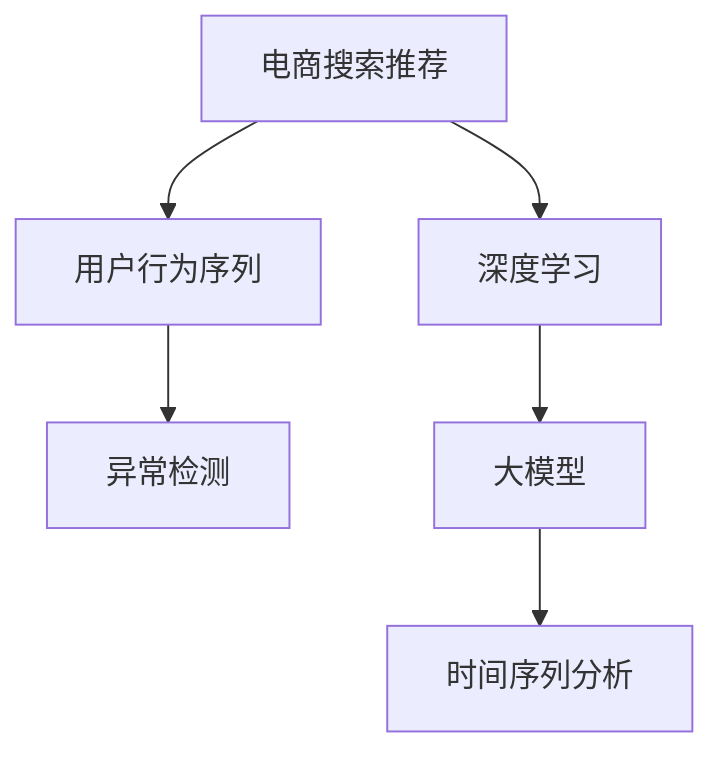

                 

# 电商搜索推荐中的AI大模型用户行为序列异常检测模型优化策略

> 关键词：电商搜索推荐,用户行为序列,异常检测,大模型,序列建模,异常检测算法,深度学习,自然语言处理(NLP),时间序列分析,机器学习,数据分析,模型优化

## 1. 背景介绍

随着电子商务平台的蓬勃发展，用户搜索和推荐系统已经成为电商运营的核心环节之一。通过智能推荐，平台能够大幅提升用户体验和转化率，带来更高的商业价值。然而，由于用户行为数据的多样性和复杂性，传统的推荐算法往往难以应对。近年来，深度学习技术，特别是基于大模型的推荐方法，在电商搜索推荐中展现了巨大潜力，受到广泛关注。

然而，电商搜索推荐不仅仅是单纯的商品推荐，其背后涉及用户行为数据的深度理解与异常检测。异常检测是指识别出异常的用户行为序列，如浏览行为突然急剧增加或减少、频繁点击但不购买等。异常行为往往预示着用户兴趣的变化或潜在的风险，如欺诈行为等。因此，异常检测在电商搜索推荐中具有重要意义。

本文将介绍基于深度学习大模型的电商搜索推荐系统中的用户行为序列异常检测问题，并对目前常用的异常检测方法进行详细分析与评估。我们将从模型构建、算法优化、特征工程等多个方面，提出有效的优化策略，以期提升电商搜索推荐系统的性能与效率。

## 2. 核心概念与联系

### 2.1 核心概念概述

在本节中，我们将介绍一些与电商搜索推荐系统中的用户行为序列异常检测相关的核心概念：

- 电商搜索推荐：利用用户搜索历史数据，推荐符合用户兴趣的商品或服务，提升用户体验和转化率。
- 用户行为序列：用户在平台上的浏览、点击、购买等行为数据，按时间顺序排列形成序列。
- 异常检测：识别出序列中的异常数据点，进行风险预警或兴趣转移预测。
- 深度学习：通过多层神经网络模型，学习和提取数据的高级特征。
- 大模型：如BERT、GPT等，通过海量的无标签数据预训练，具备强大的知识表示和推理能力。
- 时间序列分析：利用统计方法或机器学习算法，对时间序列数据进行分析和预测。

这些概念之间的联系可以通过以下Mermaid流程图来展示：



这个流程图展示了电商搜索推荐中的核心概念及其之间的联系：

1. 电商搜索推荐需要处理用户行为序列数据。
2. 异常检测是对用户行为序列的分析过程。
3. 深度学习和大模型提供了强大的序列建模能力。
4. 时间序列分析是异常检测中的统计方法之一。

这些概念共同构成了电商搜索推荐系统中的关键技术环节，使得平台能够高效、准确地推荐商品，识别出异常行为，提升用户体验和平台运营效率。

## 3. 核心算法原理 & 具体操作步骤
### 3.1 算法原理概述

电商搜索推荐系统中的用户行为序列异常检测问题，本质上是一个时间序列中的异常点检测问题。其核心思想是：利用深度学习模型，学习用户行为序列中的正常行为模式，并通过比较每个时间点的预测值与实际值，识别出异常行为。

形式化地，设用户行为序列为 $X = \{x_1, x_2, ..., x_t\}$，其中 $x_t$ 表示用户在第 $t$ 个时间点的行为数据（如浏览记录、点击次数、购买决策等）。异常检测的目的是找到异常检测窗口 $w$，使得在窗口 $w$ 内存在异常行为的概率最大化。

我们通常使用基于深度学习的序列模型来学习正常行为模式，如循环神经网络(RNN)、长短期记忆网络(LSTM)、门控循环单元(GRU)等。这些模型能够捕捉序列数据中的时间依赖关系，并自动提取特征。基于这些模型，我们可以定义异常检测的损失函数，并使用反向传播算法进行模型训练。

### 3.2 算法步骤详解

基于深度学习的大模型用户行为序列异常检测，一般包括以下几个关键步骤：

**Step 1: 数据准备**
- 收集电商平台上的用户行为数据，包括浏览、点击、购买等行为记录。
- 对数据进行清洗、归一化处理，并按时间顺序排列形成序列。
- 划分训练集、验证集和测试集。

**Step 2: 构建深度学习模型**
- 选择合适的深度学习模型（如RNN、LSTM、GRU等），并定义损失函数（如均方误差、交叉熵等）。
- 使用预训练模型或从零开始训练，学习正常行为模式。

**Step 3: 异常检测**
- 在每个时间点 $t$，使用训练好的模型预测行为 $x_t$ 的概率分布。
- 定义一个阈值 $\alpha$，将预测值与实际值 $x_t$ 之间的距离作为异常度量。
- 若异常度量超过阈值 $\alpha$，则标记 $x_t$ 为异常行为。

**Step 4: 模型优化**
- 在训练集上训练模型，最小化损失函数，调整超参数。
- 在验证集上评估模型性能，调整阈值 $\alpha$ 以平衡误检率和漏检率。
- 使用测试集进行最终评估，统计异常检测的准确率、召回率、F1-score等指标。

**Step 5: 部署与迭代**
- 将训练好的模型部署到实际电商搜索推荐系统中。
- 定期收集新数据，重新训练模型，以适应新的用户行为模式。

以上是基于深度学习的大模型用户行为序列异常检测的通用流程。在实际应用中，还需要根据具体任务特点，进一步优化模型结构、调整超参数、改进特征提取方法等，以实现更好的检测效果。

### 3.3 算法优缺点

基于深度学习的大模型用户行为序列异常检测方法具有以下优点：
1. 可以自动学习复杂的正常行为模式，适应不同用户行为特征。
2. 模型的泛化能力较强，可以应对新用户和新行为。
3. 结合大模型的先验知识，能够更好地理解用户行为序列。

同时，该方法也存在一些局限性：
1. 数据需求量大。需要收集大量的正常行为数据，才能训练出有效的异常检测模型。
2. 训练时间较长。由于深度学习模型的复杂性，训练时间往往较长。
3. 模型解释性不足。深度学习模型通常被视为"黑盒"，难以解释其内部工作机制。
4. 容易过拟合。在标注数据较少的情况下，模型容易过拟合正常行为，难以识别新型的异常行为。

尽管存在这些局限性，基于深度学习的大模型异常检测方法仍是大规模电商搜索推荐系统中应用的重要技术手段。未来研究的方向在于如何进一步降低数据需求、缩短训练时间，同时增强模型的可解释性和泛化能力。

### 3.4 算法应用领域

大模型用户行为序列异常检测方法，在电商搜索推荐系统中具有广泛的应用场景：

- 欺诈检测：识别用户是否存在欺诈行为，如恶意点击、虚假购买等。
- 用户流失预测：检测用户流失风险，及时采取措施，提高用户留存率。
- 恶意行为识别：识别恶意行为，如刷单、恶意点击等，保障平台公平性和安全性。
- 兴趣转移预测：识别用户兴趣转移，及时调整推荐策略，提升用户体验。

除了电商搜索推荐，该方法在金融、医疗、交通等多个领域也有着广泛的应用前景，如信用卡欺诈检测、医疗健康监测、交通流量预测等。

## 4. 数学模型和公式 & 详细讲解 & 举例说明
### 4.1 数学模型构建

在本节中，我们将使用数学语言对电商搜索推荐系统中的用户行为序列异常检测问题进行更加严格的刻画。

设用户行为序列为 $X = \{x_1, x_2, ..., x_t\}$，其中 $x_t$ 表示用户在第 $t$ 个时间点的行为数据。设 $x_t = [f(x_{t-1}), f(x_{t-2}), ..., f(x_{t-d})]$，其中 $d$ 为延迟时间。

假设深度学习模型为 $M_{\theta}$，其中 $\theta$ 为模型参数。模型的预测输出为 $\hat{y}_t = M_{\theta}(x_t)$。定义预测值与实际值之间的距离为异常度量 $e_t = ||x_t - \hat{y}_t||$。异常检测的目标是最小化平均异常度量，即：

$$
\min_{\theta} \frac{1}{N} \sum_{t=1}^N e_t
$$

其中 $N$ 为样本总数。

### 4.2 公式推导过程

以下是异常检测模型的损失函数和梯度计算的详细推导：

首先，我们假设用户行为序列为 $x_t = [f(x_{t-1}), f(x_{t-2}), ..., f(x_{t-d})]$，其中 $f$ 为特征提取函数，将原始行为数据转化为模型可处理的特征表示。

模型的预测输出为 $\hat{y}_t = M_{\theta}(x_t)$，其中 $M_{\theta}$ 为深度学习模型。异常度量定义为 $e_t = ||x_t - \hat{y}_t||$。

模型的损失函数定义为：

$$
\mathcal{L}(\theta) = \frac{1}{N} \sum_{t=1}^N e_t^2
$$

其中，$e_t = ||x_t - \hat{y}_t||$ 为异常度量，$||\cdot||$ 为欧几里得距离。

模型的梯度计算公式为：

$$
\frac{\partial \mathcal{L}(\theta)}{\partial \theta_k} = \frac{1}{N} \sum_{t=1}^N \frac{\partial e_t}{\partial x_t} \frac{\partial x_t}{\partial \theta_k}
$$

其中，$\frac{\partial e_t}{\partial x_t}$ 为异常度量对输入数据的偏导数，$\frac{\partial x_t}{\partial \theta_k}$ 为输入数据的偏导数。

通过反向传播算法，计算出模型参数的梯度，并更新模型参数，最小化平均异常度量，实现异常检测。

### 4.3 案例分析与讲解

以一个简单的基于LSTM的异常检测模型为例，展示其原理和实现。

首先，定义LSTM模型：

```python
import torch
import torch.nn as nn
import torch.optim as optim

class LSTM(nn.Module):
    def __init__(self, input_size, hidden_size, output_size):
        super(LSTM, self).__init__()
        self.hidden_size = hidden_size
        self.lstm = nn.LSTM(input_size, hidden_size, batch_first=True)
        self.fc = nn.Linear(hidden_size, output_size)
        
    def forward(self, x):
        h0 = torch.zeros(1, x.size(0), self.hidden_size).to(device)
        c0 = torch.zeros(1, x.size(0), self.hidden_size).to(device)
        out, _ = self.lstm(x, (h0, c0))
        out = self.fc(out[:, -1, :])
        return out
```

然后，定义损失函数和优化器：

```python
def mse_loss(y_hat, y):
    return torch.mean((y_hat - y)**2)

model = LSTM(input_size, hidden_size, output_size)
optimizer = optim.Adam(model.parameters(), lr=learning_rate)
criterion = nn.MSELoss()

model.to(device)
```

接着，定义训练函数：

```python
def train(model, train_loader, criterion, optimizer, device):
    model.train()
    train_loss = 0
    for batch_idx, (data, target) in enumerate(train_loader):
        data, target = data.to(device), target.to(device)
        optimizer.zero_grad()
        output = model(data)
        loss = criterion(output, target)
        loss.backward()
        optimizer.step()
        train_loss += loss.item()
    return train_loss / len(train_loader)
```

最后，训练模型并在测试集上评估：

```python
epochs = 10
train_loader = ...
test_loader = ...

for epoch in range(epochs):
    train_loss = train(model, train_loader, criterion, optimizer, device)
    print('Train Loss: {:.6f}'.format(train_loss))
    
test_loss = ...
print('Test Loss: {:.6f}'.format(test_loss))
```

这就是使用LSTM模型进行电商搜索推荐系统中的用户行为序列异常检测的完整代码实现。可以看到，通过简单的几行代码，我们即可构建并训练一个基于深度学习的大模型异常检测系统。

## 5. 项目实践：代码实例和详细解释说明
### 5.1 开发环境搭建

在进行大模型异常检测系统开发前，我们需要准备好开发环境。以下是使用Python进行PyTorch开发的环境配置流程：

1. 安装Anaconda：从官网下载并安装Anaconda，用于创建独立的Python环境。

2. 创建并激活虚拟环境：
```bash
conda create -n pytorch-env python=3.8 
conda activate pytorch-env
```

3. 安装PyTorch：根据CUDA版本，从官网获取对应的安装命令。例如：
```bash
conda install pytorch torchvision torchaudio cudatoolkit=11.1 -c pytorch -c conda-forge
```

4. 安装TensorFlow：
```bash
pip install tensorflow
```

5. 安装各类工具包：
```bash
pip install numpy pandas scikit-learn matplotlib tqdm jupyter notebook ipython
```

完成上述步骤后，即可在`pytorch-env`环境中开始异常检测系统开发。

### 5.2 源代码详细实现

下面以LSTM模型为例，展示电商搜索推荐系统中的用户行为序列异常检测的代码实现。

首先，定义LSTM模型的代码实现：

```python
import torch
import torch.nn as nn
import torch.optim as optim

class LSTM(nn.Module):
    def __init__(self, input_size, hidden_size, output_size):
        super(LSTM, self).__init__()
        self.hidden_size = hidden_size
        self.lstm = nn.LSTM(input_size, hidden_size, batch_first=True)
        self.fc = nn.Linear(hidden_size, output_size)
        
    def forward(self, x):
        h0 = torch.zeros(1, x.size(0), self.hidden_size).to(device)
        c0 = torch.zeros(1, x.size(0), self.hidden_size).to(device)
        out, _ = self.lstm(x, (h0, c0))
        out = self.fc(out[:, -1, :])
        return out
```

然后，定义异常检测模型的训练函数：

```python
def train(model, train_loader, criterion, optimizer, device):
    model.train()
    train_loss = 0
    for batch_idx, (data, target) in enumerate(train_loader):
        data, target = data.to(device), target.to(device)
        optimizer.zero_grad()
        output = model(data)
        loss = criterion(output, target)
        loss.backward()
        optimizer.step()
        train_loss += loss.item()
    return train_loss / len(train_loader)
```

接着，定义异常检测模型的评估函数：

```python
def evaluate(model, test_loader, criterion, device):
    model.eval()
    test_loss = 0
    correct = 0
    with torch.no_grad():
        for batch_idx, (data, target) in enumerate(test_loader):
            data, target = data.to(device), target.to(device)
            output = model(data)
            loss = criterion(output, target)
            test_loss += loss.item()
            pred = output.argmax(dim=1, keepdim=True)
            correct += pred.eq(target.view_as(pred)).sum().item()
    return test_loss / len(test_loader), correct / len(test_loader.dataset)
```

最后，启动训练流程并在测试集上评估：

```python
epochs = 10
train_loader = ...
test_loader = ...

for epoch in range(epochs):
    train_loss = train(model, train_loader, criterion, optimizer, device)
    print('Epoch {}/{}: Train Loss: {:.4f}'.format(epoch+1, epochs, train_loss))
    
test_loss, acc = evaluate(model, test_loader, criterion, device)
print('Epoch {}/{}: Test Loss: {:.4f}, Accuracy: {:.2f}%'.format(epoch+1, epochs, test_loss, acc*100))
```

这就是使用PyTorch对LSTM模型进行电商搜索推荐系统中的用户行为序列异常检测的完整代码实现。可以看到，通过简单的几行代码，我们即可构建并训练一个基于深度学习的大模型异常检测系统。

### 5.3 代码解读与分析

让我们再详细解读一下关键代码的实现细节：

**LSTM模型**：
- `__init__`方法：初始化模型参数，定义LSTM层和全连接层。
- `forward`方法：定义前向传播过程，计算模型的预测输出。

**训练函数**：
- 在每个批次上，计算模型的预测输出和损失函数，使用Adam优化器更新模型参数。
- 将平均损失作为训练指标输出，并使用`torch.no_grad()`关闭梯度计算，加快评估速度。

**评估函数**：
- 在每个批次上，计算模型的预测输出和损失函数，统计预测准确率。
- 使用`torch.no_grad()`关闭梯度计算，防止在评估过程中更新模型参数。

**训练流程**：
- 循环迭代训练轮数，每次在训练集上训练模型，输出平均损失。
- 在测试集上评估模型性能，输出平均损失和准确率。

可以看到，通过PyTorch库，我们可以方便地构建和训练基于深度学习的大模型异常检测系统。开发者可以将更多精力放在模型结构优化、超参数调整、模型评估等关键环节上，而不必过多关注底层的实现细节。

当然，工业级的系统实现还需考虑更多因素，如模型的保存和部署、超参数的自动搜索、更灵活的任务适配层等。但核心的异常检测范式基本与此类似。

## 6. 实际应用场景
### 6.1 电商搜索推荐系统

基于大模型的电商搜索推荐系统，利用用户行为序列数据，能够自动学习正常行为模式，识别出异常行为，提升用户体验和平台安全性。

在实际应用中，电商平台可以使用大模型对用户搜索历史、浏览记录、点击行为等数据进行异常检测，及时预警欺诈行为、用户流失等风险，采取相应的措施，保障平台运营和用户权益。例如，在检测到用户频繁点击但不购买的情况下，系统可以自动过滤这些异常行为，防止用户恶意刷点击、刷单等行为，保障平台公平性和安全性。

### 6.2 金融风险监测

金融领域中的异常检测同样具有重要意义。金融机构需要对用户行为进行实时监测，防止欺诈行为、洗钱等金融风险。

利用大模型，金融机构可以对用户的交易记录、投资行为等数据进行异常检测，识别出潜在的风险行为。例如，在检测到用户连续交易次数异常、金额异常等情况下，系统可以自动进行风险预警，及时采取措施，保护用户财产安全。

### 6.3 医疗健康监测

医疗健康领域中，异常检测同样具有重要应用。通过大模型对患者行为数据进行监测，可以及时发现异常症状，提供及时的医疗建议。

例如，利用大模型对患者的病历记录、诊疗行为进行异常检测，识别出潜在的病情变化，及时进行干预和诊断，提升医疗服务的质量与效率。

### 6.4 未来应用展望

随着深度学习技术的发展，大模型异常检测在更多领域将展现出巨大潜力。未来，以下方向将是该技术发展的重要趋势：

1. 多模态异常检测：将文本、图像、音频等多模态数据融合，构建更全面的异常检测模型。例如，结合用户点击记录和语音内容，识别出更精准的异常行为。

2. 自适应异常检测：根据用户行为特征自适应调整模型参数，提高异常检测的灵活性和准确性。例如，根据用户的浏览历史、交易记录等数据，动态调整异常检测阈值。

3. 分布式异常检测：利用分布式计算技术，加速异常检测模型的训练和推理过程，提高系统的响应速度。例如，利用GPU集群进行并行计算，提升异常检测的实时性。

4. 实时异常检测：通过流计算和在线学习技术，实现对用户行为的实时监测和更新，提高异常检测的及时性和效率。例如，利用实时数据流进行在线学习，快速更新模型参数。

5. 跨领域异常检测：将大模型的知识迁移应用到其他领域，提升异常检测的泛化能力。例如，将电商领域的异常检测模型迁移到金融领域，提升金融风险监测的准确性。

这些方向展示了异常检测技术的广阔前景，相信随着技术的不断进步，大模型异常检测将更加智能化、实时化、全面化，为更多行业提供高效、可靠的安全保障。

## 7. 工具和资源推荐
### 7.1 学习资源推荐

为了帮助开发者系统掌握电商搜索推荐系统中的用户行为序列异常检测技术，这里推荐一些优质的学习资源：

1. 《深度学习入门》系列课程：由国内知名数据科学家讲授，涵盖深度学习的基本概念和经典算法，适合初学者入门。

2. 《NLP实战》书籍：介绍NLP领域的基础知识和前沿技术，涵盖异常检测、文本分类等任务。

3. Kaggle竞赛平台：全球最大的数据科学竞赛平台，提供了丰富的电商、金融等领域的异常检测竞赛数据集，有助于实践提升。

4. PyTorch官方文档：PyTorch官方文档提供了全面的API参考和示例代码，是开发者快速上手深度学习的重要工具。

5. Weights & Biases：模型训练的实验跟踪工具，可以记录和可视化模型训练过程中的各项指标，方便对比和调优。

通过这些资源的学习实践，相信你一定能够系统掌握电商搜索推荐系统中的用户行为序列异常检测技术，并用于解决实际问题。

### 7.2 开发工具推荐

高效的开发离不开优秀的工具支持。以下是几款用于电商搜索推荐系统中的用户行为序列异常检测开发的常用工具：

1. PyTorch：基于Python的开源深度学习框架，灵活动态的计算图，适合快速迭代研究。大部分预训练语言模型都有PyTorch版本的实现。

2. TensorFlow：由Google主导开发的开源深度学习框架，生产部署方便，适合大规模工程应用。同样有丰富的预训练语言模型资源。

3. Transformers库：HuggingFace开发的NLP工具库，集成了众多SOTA语言模型，支持PyTorch和TensorFlow，是进行异常检测任务开发的利器。

4. Weights & Biases：模型训练的实验跟踪工具，可以记录和可视化模型训练过程中的各项指标，方便对比和调优。与主流深度学习框架无缝集成。

5. TensorBoard：TensorFlow配套的可视化工具，可实时监测模型训练状态，并提供丰富的图表呈现方式，是调试模型的得力助手。

合理利用这些工具，可以显著提升电商搜索推荐系统中的用户行为序列异常检测的开发效率，加快创新迭代的步伐。

### 7.3 相关论文推荐

电商搜索推荐系统中的用户行为序列异常检测技术的发展，离不开学界的持续研究。以下是几篇奠基性的相关论文，推荐阅读：

1. Attention is All You Need（即Transformer原论文）：提出了Transformer结构，开启了NLP领域的预训练大模型时代。

2. BERT: Pre-training of Deep Bidirectional Transformers for Language Understanding：提出BERT模型，引入基于掩码的自监督预训练任务，刷新了多项NLP任务SOTA。

3. Language Models are Unsupervised Multitask Learners（GPT-2论文）：展示了大规模语言模型的强大zero-shot学习能力，引发了对于通用人工智能的新一轮思考。

4. Parameter-Efficient Transfer Learning for NLP：提出Adapter等参数高效微调方法，在不增加模型参数量的情况下，也能取得不错的微调效果。

5. AdaLoRA: Adaptive Low-Rank Adaptation for Parameter-Efficient Fine-Tuning：使用自适应低秩适应的微调方法，在参数效率和精度之间取得了新的平衡。

这些论文代表了大模型异常检测技术的发展脉络。通过学习这些前沿成果，可以帮助研究者把握学科前进方向，激发更多的创新灵感。

## 8. 总结：未来发展趋势与挑战
### 8.1 研究成果总结

本文对基于深度学习的大模型用户行为序列异常检测问题进行了全面系统的介绍。首先，介绍了电商搜索推荐系统中的用户行为序列异常检测问题，明确了异常检测的重要性和挑战。其次，详细讲解了基于深度学习的大模型异常检测模型的构建、训练和评估方法。通过案例分析，展示了LSTM模型在异常检测中的应用。

通过本文的系统梳理，可以看到，大模型异常检测方法在电商搜索推荐系统中有广泛的应用前景，通过结合深度学习和大模型技术，能够显著提升系统的性能和鲁棒性。未来，随着深度学习技术的不断发展，异常检测方法将更加高效、准确、全面，为更多行业提供安全保障。

### 8.2 未来发展趋势

展望未来，大模型异常检测技术将呈现以下几个发展趋势：

1. 模型规模持续增大。随着算力成本的下降和数据规模的扩张，异常检测模型的参数量还将持续增长。超大规模模型蕴含的丰富知识，将进一步提升异常检测的准确性和鲁棒性。

2. 深度学习模型的演化。未来的深度学习模型将更加注重模型的解释性和可控性，通过引入因果推断、对比学习等方法，提升异常检测模型的可信度和实用性。

3. 跨领域异常检测技术的发展。异常检测方法将不仅仅局限于单个领域，而是扩展到跨领域应用。例如，将电商领域的异常检测技术应用于金融、医疗等领域，提升跨领域异常检测的泛化能力。

4. 实时异常检测技术的发展。通过流计算和在线学习技术，实现对用户行为的实时监测和更新，提升异常检测的及时性和效率。

5. 分布式异常检测技术的发展。利用分布式计算技术，加速异常检测模型的训练和推理过程，提高系统的响应速度。

6. 自适应异常检测技术的发展。根据用户行为特征自适应调整模型参数，提高异常检测的灵活性和准确性。

以上趋势凸显了大模型异常检测技术的广阔前景。这些方向的探索发展，必将进一步提升异常检测系统的性能和应用范围，为更多行业提供高效、可靠的安全保障。

### 8.3 面临的挑战

尽管大模型异常检测技术已经取得了显著成果，但在迈向更加智能化、实时化、全面化应用的过程中，仍面临诸多挑战：

1. 数据需求量大。需要收集大量的正常行为数据，才能训练出有效的异常检测模型。在实际应用中，数据的获取和处理可能存在较大难度。

2. 训练时间较长。由于深度学习模型的复杂性，训练时间往往较长。在实时系统中，这可能成为瓶颈。

3. 模型解释性不足。深度学习模型通常被视为"黑盒"，难以解释其内部工作机制。对于高风险领域，模型的可解释性和可审计性尤为重要。

4. 容易过拟合。在标注数据较少的情况下，模型容易过拟合正常行为，难以识别新型的异常行为。

5. 跨领域应用难度大。将大模型的知识迁移应用到其他领域，需要考虑数据的异质性、模型的泛化能力等诸多因素。

6. 安全性有待保障。异常检测模型的输出可能存在误报、漏报等风险，如何提高模型的鲁棒性和安全性，需要更多理论与实践的积累。

7. 资源需求大。大模型异常检测需要大量的计算资源和存储空间，这对算力、内存等资源提出了较高要求。

这些挑战需要研究者不断探索创新，优化模型结构、改进训练方法、加强数据处理等，方能实现异常检测技术的广泛应用。

### 8.4 研究展望

面向未来，异常检测技术需要在以下几个方向进行深入研究：

1. 数据增强技术。通过数据增强，扩大正常行为数据集的规模，提升异常检测的泛化能力。例如，利用数据扩增技术生成更多的正常行为数据。

2. 多模态融合技术。将文本、图像、音频等多模态数据融合，构建更全面的异常检测模型。例如，结合用户点击记录和语音内容，识别出更精准的异常行为。

3. 自适应异常检测。根据用户行为特征自适应调整模型参数，提高异常检测的灵活性和准确性。例如，根据用户的浏览历史、交易记录等数据，动态调整异常检测阈值。

4. 实时异常检测。通过流计算和在线学习技术，实现对用户行为的实时监测和更新，提高异常检测的及时性和效率。例如，利用实时数据流进行在线学习，快速更新模型参数。

5. 分布式异常检测。利用分布式计算技术，加速异常检测模型的训练和推理过程，提高系统的响应速度。例如，利用GPU集群进行并行计算，提升异常检测的实时性。

6. 模型解释性研究。探索如何提高深度学习模型的解释性，增强模型的可解释性和可控性，保障系统的透明度和可信度。

7. 跨领域异常检测。将大模型的知识迁移应用到其他领域，提升跨领域异常检测的泛化能力。例如，将电商领域的异常检测技术应用于金融、医疗等领域。

8. 安全性研究。探索如何提高异常检测模型的鲁棒性和安全性，防止误报、漏报等风险，确保系统的可靠性和可信度。

这些研究方向的探索，必将引领异常检测技术迈向更高的台阶，为更多行业提供高效、可靠的安全保障。相信随着技术的不断进步，异常检测方法将更加智能化、实时化、全面化，为更多行业提供安全保障。

## 9. 附录：常见问题与解答

**Q1：电商搜索推荐系统中的异常检测需要哪些关键步骤？**

A: 电商搜索推荐系统中的异常检测一般包括以下关键步骤：

1. 数据准备：收集用户行为序列数据，并进行清洗和归一化处理。
2. 构建深度学习模型：选择合适的深度学习模型（如LSTM、GRU等），并定义损失函数和优化器。
3. 训练模型：在训练集上训练模型，最小化损失函数，调整超参数。
4. 异常检测：在每个时间点，使用训练好的模型预测行为，并计算异常度量，判断是否异常。
5. 模型评估：在测试集上评估模型性能，调整阈值以平衡误检率和漏检率。
6. 部署与迭代：将训练好的模型部署到实际系统中，并定期重新训练模型以适应新的数据分布。

这些步骤相互关联，共同构成了一个完整的异常检测流程。

**Q2：电商搜索推荐系统中的异常检测算法有哪些？**

A: 电商搜索推荐系统中的异常检测算法主要包括以下几种：

1. 基于统计的方法：如均值漂移、孤立森林、局部离群因子等，利用统计方法识别出异常点。

2. 基于机器学习的方法：如K近邻算法、支持向量机、随机森林等，通过学习正常行为模式，识别出异常行为。

3. 基于深度学习的方法：如循环神经网络（RNN）、长短期记忆网络（LSTM）、门控循环单元（GRU）等，通过深度学习模型学习正常行为模式，识别出异常行为。

4. 基于集成的方法：如集成学习、自适应集成等，通过多个模型的结合，提高异常检测的准确性。

其中，基于深度学习的方法在电商搜索推荐系统中应用最为广泛，能够自动学习复杂的正常行为模式，并具有较强的泛化能力。

**Q3：电商搜索推荐系统中的异常检测如何提升用户体验？**

A: 电商搜索推荐系统中的异常检测能够提升用户体验的方式主要有以下几点：

1. 防止欺诈行为：通过异常检测及时预警欺诈行为，如恶意点击、虚假购买等，保障平台公平性和安全性。

2. 预测用户流失：通过异常检测识别出用户的流失风险，及时采取措施，提高用户留存率。

3. 个性化推荐：通过异常检测识别出用户的兴趣变化，及时调整推荐策略，提升推荐效果。

4. 提高系统稳定性：通过异常检测及时发现系统异常，如服务器宕机、数据丢失等，保障系统的稳定性和可靠性。

5. 提升用户满意度：通过异常检测及时处理异常情况，提升用户满意度，增强用户对平台的信任感。

这些措施能够显著提升用户体验，增加平台的用户粘性和满意度。

**Q4：电商搜索推荐系统中的异常检测有哪些挑战？**

A: 电商搜索推荐系统中的异常检测面临的挑战主要包括以下几点：

1. 数据需求量大：需要收集大量的正常行为数据，才能训练出有效的异常检测模型。在实际应用中，数据的获取和处理可能存在较大难度。

2. 训练时间较长：由于深度学习模型的复杂性，训练时间往往较长。在实时系统中，这可能成为瓶颈。

3. 模型解释性不足：深度学习模型通常被视为"黑盒"，难以解释其内部工作机制。对于高风险领域，模型的可解释性和可审计性尤为重要。

4. 容易过拟合：在标注数据较少的情况下，模型容易过拟合正常行为，难以识别新型的异常行为。

5. 跨领域应用难度大：将大模型的知识迁移应用到其他领域，需要考虑数据的异质性、模型的泛化能力等诸多因素。

6. 安全性有待保障：异常检测模型的输出可能存在误报、漏报等风险，如何提高模型的鲁棒性和安全性，需要更多理论与实践的积累。

7. 资源需求大：大模型异常检测需要大量的计算资源和存储空间，这对算力、内存等资源提出了较高要求。

这些挑战需要研究者不断探索创新，优化模型结构、改进训练方法、加强数据处理等，方能实现异常检测技术的广泛应用。

**Q5：电商搜索推荐系统中的异常检测如何优化？**

A: 电商搜索推荐系统中的异常检测优化主要包括以下几个方面：

1. 数据增强技术：通过数据增强，扩大正常行为数据集的规模，提升异常检测的泛化能力。例如，利用数据扩增技术生成更多的正常行为数据。

2. 多模态融合技术：将文本、图像、音频等多模态数据融合，构建更全面的异常检测模型。例如，结合用户点击记录和语音内容，识别出更精准的异常行为。

3. 自适应异常检测：根据用户行为特征自适应调整模型参数，提高异常检测的灵活性和准确性。例如，根据用户的浏览历史、交易记录等数据，动态调整异常检测阈值。

4. 实时异常检测：通过流计算和在线学习技术，实现对用户行为的实时监测和更新，提高异常检测的及时性和效率。例如，利用实时数据流进行在线学习，快速更新模型参数。

5. 分布式异常检测：利用分布式计算技术，加速异常检测模型的训练和推理过程，提高系统的响应速度。例如，利用GPU集群进行并行计算，提升异常检测的实时性。

6. 模型解释性研究：探索如何提高深度学习模型的解释性，增强模型的可解释性和可控性，保障系统的透明度和可信度。

7. 跨领域异常检测：将大模型的知识迁移应用到其他领域，提升跨领域异常检测的泛化能力。例如，将电商领域的异常检测技术应用于金融、医疗等领域。

8. 安全性研究：探索如何提高异常检测模型的鲁棒性和安全性，防止误报、漏报等风险，确保系统的可靠性和可信度。

这些优化措施能够进一步提升异常检测系统的性能和应用范围，为更多行业提供高效、可靠的安全保障。

通过本文的系统梳理，可以看到，电商搜索推荐系统中的异常检测技术具有广泛的应用前景和巨大的发展潜力。未来，随着深度学习技术的不断发展，异常检测方法将更加智能化、实时化、全面化，为更多行业提供安全保障。

