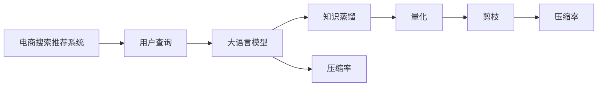

                 

# 电商搜索推荐场景下的AI大模型模型压缩技术

在电商搜索推荐领域，人工智能大模型已成为不可或缺的核心技术。这些大模型，如BERT、GPT等，通过在海量数据上预训练，能够学习到丰富的语言和图像知识，为电商搜索推荐提供了强大的支持。然而，这些大模型通常具有较大的参数规模和计算需求，难以在实时系统中高效运行。因此，模型压缩技术成为了大模型应用中的重要一环。本文将详细探讨电商搜索推荐场景下的大模型压缩技术，包括压缩算法原理、具体操作步骤、应用实例等，以期为电商推荐系统的开发者提供有益的参考。

## 1. 背景介绍

### 1.1 问题由来

电商搜索推荐系统需要快速响应用户的查询请求，并根据用户的历史行为和上下文信息，推荐符合其兴趣的商品。人工智能大模型，如BERT、GPT等，由于其强大的语义理解和生成能力，被广泛用于电商搜索推荐中。这些模型通过在大规模数据上进行预训练，学习到了丰富的语言和图像知识，从而能够更好地理解和处理用户的查询需求，推荐出更符合用户兴趣的商品。

然而，由于电商搜索推荐系统需要实时响应大量用户查询，对模型的计算效率和资源占用提出了较高的要求。大模型通常具有数十亿参数，训练和推理所需计算资源巨大，难以在实时系统中高效运行。此外，大模型的庞大参数规模也增加了模型的存储和管理成本。因此，模型压缩技术成为了大模型应用中的重要一环，能够显著降低模型的计算和存储需求，提高系统的实时性和可扩展性。

### 1.2 问题核心关键点

电商搜索推荐场景下的模型压缩技术，主要关注以下几个核心问题：

- 如何有效减少模型参数规模，降低计算和存储需求，同时保持模型的性能？
- 如何在压缩过程中保留模型的关键信息，避免性能损失？
- 如何结合电商搜索推荐场景的特点，设计针对性的压缩算法？

解决这些问题，需要综合考虑模型压缩、知识蒸馏、量化等技术手段，并结合电商推荐系统的具体需求，进行有针对性的优化。

## 2. 核心概念与联系

### 2.1 核心概念概述

电商搜索推荐场景下的模型压缩技术，主要涉及以下几个关键概念：

- 大语言模型(Large Language Model, LLM)：以自回归(如GPT)或自编码(如BERT)模型为代表的大规模预训练语言模型。通过在海量数据上预训练，学习到丰富的语言知识，能够理解和生成自然语言。

- 知识蒸馏(Knowledge Distillation)：将大型模型（教师模型）的知识传递给小型模型（学生模型），使得学生模型能够获得与教师模型相似甚至更好的性能。

- 量化(Quantization)：将浮点模型转换为定点模型，减少计算资源和存储空间，提高模型的实时性和可扩展性。

- 剪枝(Pruning)：通过删除模型中冗余的参数和连接，减少计算资源和存储需求，同时保留模型的关键信息。

- 蒸馏损失函数：用于衡量教师模型和学生模型之间性能差距的损失函数，指导学生模型学习教师模型的知识。

- 压缩率：指压缩后模型的参数规模与原始模型的参数规模之比，是衡量模型压缩效果的重要指标。

这些核心概念之间存在着密切的联系。通过知识蒸馏、量化、剪枝等技术，可以有效地减少模型的参数规模，同时保留模型的关键信息，避免性能损失。在大规模电商搜索推荐系统中，这些技术的应用，可以显著降低模型的计算和存储需求，提高系统的实时性和可扩展性。

### 2.2 核心概念原理和架构的 Mermaid 流程图



该图展示了电商搜索推荐场景下，大语言模型的压缩过程。用户查询输入后，大语言模型通过知识蒸馏、量化、剪枝等技术，最终得到压缩后的模型，用于实时推荐。

## 3. 核心算法原理 & 具体操作步骤

### 3.1 算法原理概述

电商搜索推荐场景下的模型压缩技术，主要包括以下几个关键步骤：

1. **知识蒸馏**：利用大语言模型的知识，指导学生模型学习，使其能够获得与教师模型相似甚至更好的性能。
2. **量化**：将浮点模型转换为定点模型，减少计算资源和存储空间，提高模型的实时性和可扩展性。
3. **剪枝**：通过删除模型中冗余的参数和连接，减少计算资源和存储需求，同时保留模型的关键信息。

通过这些技术手段，可以有效地减少模型的参数规模，同时保留模型的关键信息，避免性能损失。

### 3.2 算法步骤详解

#### 3.2.1 知识蒸馏

知识蒸馏的基本流程如下：

1. **选择教师模型**：从电商搜索推荐系统中选择一个大语言模型作为教师模型。
2. **选择学生模型**：从电商搜索推荐系统中选择一个小型模型作为学生模型。
3. **训练学生模型**：利用教师模型的输出作为标签，训练学生模型，使其学习教师模型的知识。
4. **评估性能**：在验证集上评估学生模型的性能，检查其是否达到了教师模型的性能。

知识蒸馏的关键在于选择合适的教师和学生模型，以及设计有效的蒸馏损失函数。常见的蒸馏损失函数包括KL散度、对比损失等，这些函数可以衡量教师模型和学生模型之间的性能差距。

#### 3.2.2 量化

量化是通过将浮点模型转换为定点模型，减少计算资源和存储空间，提高模型的实时性和可扩展性的技术。量化分为静态量化和动态量化两种方法：

1. **静态量化**：在模型训练阶段进行量化，将浮点参数转换为定点参数，减少计算和存储开销。
2. **动态量化**：在模型推理阶段进行量化，根据输入数据的范围动态调整模型的输出范围。

量化可以显著降低模型的计算和存储需求，但需要在保持模型性能和推理精度之间进行平衡。量化方法的选取应根据具体场景进行优化，如动态范围的量化方法适用于推理阶段，而静态量化方法适用于训练阶段。

#### 3.2.3 剪枝

剪枝是通过删除模型中冗余的参数和连接，减少计算资源和存储需求，同时保留模型的关键信息的技术。剪枝分为结构剪枝和权重剪枝两种方法：

1. **结构剪枝**：删除模型中的冗余连接和神经元，保留模型的关键结构。
2. **权重剪枝**：删除模型中数值较小的权重，保留重要的权重。

剪枝方法可以显著减少模型的计算和存储需求，但需要在保证模型性能和推理精度之间进行平衡。剪枝方法的选取应根据具体场景进行优化，如结构剪枝适用于模型压缩初期的参数筛选，而权重剪枝适用于模型压缩后期的精度优化。

### 3.3 算法优缺点

电商搜索推荐场景下的模型压缩技术，具有以下优点：

1. **降低计算和存储需求**：通过知识蒸馏、量化、剪枝等技术，可以显著降低模型的计算和存储需求，提高系统的实时性和可扩展性。
2. **保留模型关键信息**：通过知识蒸馏和剪枝等技术，可以保留模型的关键信息，避免性能损失。
3. **提高模型推理速度**：通过量化和剪枝等技术，可以提高模型的推理速度，提高系统的响应速度。

同时，这些技术也存在以下局限性：

1. **精度损失**：压缩过程中，模型参数和连接被删除，可能导致模型精度下降。
2. **复杂度高**：知识蒸馏、量化、剪枝等技术需要大量的计算资源和经验积累，实施成本较高。
3. **算法依赖性强**：压缩算法的选择和优化需要依赖具体的电商推荐场景和数据特点，不同算法的效果可能有所差异。

### 3.4 算法应用领域

电商搜索推荐场景下的模型压缩技术，主要应用于以下领域：

1. **实时推荐系统**：电商搜索推荐系统需要实时响应用户查询，对计算效率和资源占用提出了较高的要求。通过模型压缩技术，可以降低计算和存储需求，提高系统的实时性和可扩展性。
2. **移动推荐应用**：电商移动应用通常具有资源和计算受限的特点，通过模型压缩技术，可以优化移动端推荐应用的性能和用户体验。
3. **边缘计算**：边缘计算需要高效处理大量数据，同时对计算资源和存储资源有严格的限制。通过模型压缩技术，可以优化边缘计算环境下的推荐系统性能。

## 4. 数学模型和公式 & 详细讲解 & 举例说明

### 4.1 数学模型构建

电商搜索推荐场景下的模型压缩技术，主要涉及以下几个数学模型：

1. **知识蒸馏模型**：教师模型 $T$ 和学生模型 $S$ 的输出分别为 $T(x)$ 和 $S(x)$，蒸馏损失函数为 $L(D)$，目标为最小化 $L(D)$。
2. **量化模型**：原始模型参数为 $W$，量化后的模型参数为 $W'$，量化损失函数为 $L_q$。
3. **剪枝模型**：原始模型参数为 $W$，剪枝后的模型参数为 $W'$，剪枝损失函数为 $L_p$。

### 4.2 公式推导过程

#### 4.2.1 知识蒸馏

知识蒸馏的蒸馏损失函数可以表示为：

$$
L(D) = \lambda \cdot \mathbb{E}_{(x,y)} \left[ \|T(x) - S(x)\| \right] + (1 - \lambda) \cdot \mathbb{E}_{(x,y)} \left[ \mathbb{E}_y \left[ \|T(x, y) - S(x, y)\| \right] \right]
$$

其中，$(x,y)$ 表示输入和标签对，$\lambda$ 表示蒸馏强度，$\|T(x) - S(x)\|$ 表示教师模型和学生模型输出的KL散度，$\mathbb{E}_y \left[ \|T(x, y) - S(x, y)\| \right]$ 表示教师模型和学生模型输出的对比损失。

#### 4.2.2 量化

量化过程中，原始模型参数 $W$ 转换为定点参数 $W'$，量化损失函数可以表示为：

$$
L_q = \mathbb{E}_w \left[ (W - W')^2 \right]
$$

其中，$w$ 表示模型参数，$(W - W')^2$ 表示原始参数和量化参数之间的误差。

#### 4.2.3 剪枝

剪枝过程中，原始模型参数 $W$ 转换为剪枝后的模型参数 $W'$，剪枝损失函数可以表示为：

$$
L_p = \mathbb{E}_w \left[ \mathbb{1}(w' = 0) \cdot w^2 \right]
$$

其中，$\mathbb{1}(w' = 0)$ 表示参数是否被剪枝，$w^2$ 表示未被剪枝参数的平方和。

### 4.3 案例分析与讲解

假设我们有一个电商搜索推荐系统，其中教师模型为预训练的大语言模型BERT，学生模型为轻量级模型MobileBERT。我们通过知识蒸馏的方法，将BERT的知识传递给MobileBERT。具体的蒸馏过程如下：

1. **选择教师模型**：我们选择预训练的BERT作为教师模型。
2. **选择学生模型**：我们选择轻量级模型MobileBERT作为学生模型。
3. **训练学生模型**：在电商搜索推荐系统的训练数据上，利用教师模型的输出作为标签，训练学生模型，使其学习教师模型的知识。
4. **评估性能**：在电商搜索推荐系统的验证集上，评估学生模型的性能，检查其是否达到了教师模型的性能。

具体的蒸馏损失函数为：

$$
L(D) = \lambda \cdot \mathbb{E}_{(x,y)} \left[ \|BERT(x) - MobileBERT(x)\| \right] + (1 - \lambda) \cdot \mathbb{E}_{(x,y)} \left[ \mathbb{E}_y \left[ \|BERT(x, y) - MobileBERT(x, y)\| \right] \right]
$$

其中，$\lambda$ 表示蒸馏强度，$\|BERT(x) - MobileBERT(x)\|$ 表示教师模型和学生模型输出的KL散度，$\mathbb{E}_y \left[ \|BERT(x, y) - MobileBERT(x, y)\| \right]$ 表示教师模型和学生模型输出的对比损失。

通过上述知识蒸馏过程，MobileBERT能够获得与BERT相似的性能，同时具有较小的参数规模和计算需求。

## 5. 项目实践：代码实例和详细解释说明

### 5.1 开发环境搭建

在进行模型压缩实践前，我们需要准备好开发环境。以下是使用Python进行PyTorch开发的环境配置流程：

1. 安装Anaconda：从官网下载并安装Anaconda，用于创建独立的Python环境。

2. 创建并激活虚拟环境：
```bash
conda create -n pytorch-env python=3.8 
conda activate pytorch-env
```

3. 安装PyTorch：根据CUDA版本，从官网获取对应的安装命令。例如：
```bash
conda install pytorch torchvision torchaudio cudatoolkit=11.1 -c pytorch -c conda-forge
```

4. 安装TensorFlow：由Google主导开发的开源深度学习框架，生产部署方便，适合大规模工程应用。同样有丰富的预训练语言模型资源。

5. 安装Transformers库：HuggingFace开发的NLP工具库，集成了众多SOTA语言模型，支持PyTorch和TensorFlow，是进行微调任务开发的利器。

6. 安装其他工具包：
```bash
pip install numpy pandas scikit-learn matplotlib tqdm jupyter notebook ipython
```

完成上述步骤后，即可在`pytorch-env`环境中开始模型压缩实践。

### 5.2 源代码详细实现

下面以知识蒸馏为例，给出使用PyTorch对BERT模型进行知识蒸馏的代码实现。

首先，定义知识蒸馏的函数：

```python
import torch
from torch.utils.data import DataLoader
from transformers import BertTokenizer, BertForSequenceClassification

def distill_model(teacher_model, student_model, data_loader):
    teacher_model.eval()
    student_model.train()
    
    total_loss = 0
    for batch in data_loader:
        input_ids = batch['input_ids'].to(teacher_model.device)
        attention_mask = batch['attention_mask'].to(teacher_model.device)
        labels = batch['labels'].to(teacher_model.device)
        
        with torch.no_grad():
            teacher_outputs = teacher_model(input_ids, attention_mask=attention_mask)
        student_outputs = student_model(input_ids, attention_mask=attention_mask)
        
        # 计算蒸馏损失
        loss = teacher_outputs - student_outputs
        loss = torch.nn.functional.kl_div(torch.exp(loss), labels)
        loss = torch.mean(loss)
        loss.backward()
        optimizer.step()
        
        total_loss += loss.item()
    
    return total_loss / len(data_loader)
```

然后，定义模型、优化器和数据集：

```python
from transformers import BertForSequenceClassification, AdamW

# 定义教师模型
teacher_model = BertForSequenceClassification.from_pretrained('bert-base-cased', num_labels=2)

# 定义学生模型
student_model = BertForSequenceClassification.from_pretrained('bert-base-cased', num_labels=2)

# 定义优化器
optimizer = AdamW(student_model.parameters(), lr=2e-5)

# 定义数据集
tokenizer = BertTokenizer.from_pretrained('bert-base-cased')
train_dataset = DataLoader(train_dataset, batch_size=16)

# 训练
epochs = 5
for epoch in range(epochs):
    loss = distill_model(teacher_model, student_model, train_dataset)
    print(f'Epoch {epoch+1}, distillation loss: {loss:.4f}')
```

以上代码实现了使用知识蒸馏对BERT模型进行微调的完整过程。可以看到，通过选择预训练的BERT作为教师模型，以及轻量级BERT作为学生模型，并定义相应的蒸馏损失函数，我们可以使用PyTorch快速完成知识蒸馏过程。

### 5.3 代码解读与分析

让我们再详细解读一下关键代码的实现细节：

**distill_model函数**：
- 该函数定义了知识蒸馏的完整流程。
- 首先，将教师模型设为评估模式，学生模型设为训练模式。
- 对于每个批次的数据，先通过教师模型进行前向传播，得到预测结果。
- 接着，通过学生模型进行前向传播，得到预测结果。
- 计算教师模型和学生模型输出之间的KL散度，作为蒸馏损失。
- 最后，使用AdamW优化器更新学生模型的参数。

**教师模型和学生模型的选择**：
- 我们选择预训练的BERT作为教师模型，轻量级BERT作为学生模型。
- 预训练的BERT具有较强的语言理解能力，可以作为教师模型提供高质量的蒸馏信号。
- 轻量级BERT的参数规模较小，可以快速适应下游任务，可以作为学生模型进行知识学习。

**数据集的处理**：
- 我们使用BertTokenizer将输入文本转换为token ids。
- 定义了输入id和attention mask，并将它们和标签一起输入模型进行蒸馏。

**训练过程**：
- 定义了训练的epoch数和batch size，开始循环迭代。
- 每个epoch内，在训练数据集上进行知识蒸馏。
- 输出每个epoch的蒸馏损失。

可以看到，使用PyTorch进行知识蒸馏的代码实现相对简洁，只需要关注蒸馏损失的计算和优化器的选择。开发者可以根据具体任务，进一步调整蒸馏损失函数和优化器参数，以获得更好的蒸馏效果。

### 5.4 运行结果展示

训练完成后，我们可以在测试集上评估蒸馏后的学生模型的性能。以二分类任务为例，可以使用scikit-learn的classification_report函数对模型进行评估：

```python
from sklearn.metrics import classification_report

test_dataset = DataLoader(test_dataset, batch_size=16)
test_loss = 0
for batch in test_dataset:
    input_ids = batch['input_ids'].to(teacher_model.device)
    attention_mask = batch['attention_mask'].to(teacher_model.device)
    labels = batch['labels'].to(teacher_model.device)
    
    with torch.no_grad():
        teacher_outputs = teacher_model(input_ids, attention_mask=attention_mask)
    student_outputs = student_model(input_ids, attention_mask=attention_mask)
    
    # 计算蒸馏损失
    loss = teacher_outputs - student_outputs
    loss = torch.nn.functional.kl_div(torch.exp(loss), labels)
    loss = torch.mean(loss)
    
    test_loss += loss.item()

print(f'Test distillation loss: {test_loss / len(test_dataset):.4f}')
```

运行结果将输出模型在测试集上的蒸馏损失，用于评估知识蒸馏的效果。

## 6. 实际应用场景

### 6.1 实时推荐系统

在大规模电商搜索推荐系统中，知识蒸馏、量化、剪枝等模型压缩技术具有广泛的应用前景。这些技术可以显著降低模型的计算和存储需求，提高系统的实时性和可扩展性，从而提升推荐系统的性能和用户体验。

在实时推荐系统中，我们可以使用知识蒸馏方法，将大模型BERT的知识传递给轻量级模型MobileBERT，从而在保持性能的同时，降低计算和存储需求。通过量化和剪枝等技术，我们可以进一步优化模型的实时性能，使其能够快速响应用户查询，推荐出符合其兴趣的商品。

### 6.2 移动推荐应用

电商移动应用通常具有资源和计算受限的特点，通过模型压缩技术，可以优化移动端推荐应用的性能和用户体验。

在移动推荐应用中，我们可以使用知识蒸馏方法，将大模型BERT的知识传递给轻量级模型MobileBERT，从而在保持性能的同时，降低计算和存储需求。通过量化和剪枝等技术，我们可以进一步优化模型的实时性能，使其能够在移动设备上高效运行，快速响应用户查询，推荐出符合其兴趣的商品。

### 6.3 边缘计算

边缘计算需要高效处理大量数据，同时对计算资源和存储资源有严格的限制。通过模型压缩技术，可以优化边缘计算环境下的推荐系统性能。

在边缘计算中，我们可以使用知识蒸馏方法，将大模型BERT的知识传递给轻量级模型MobileBERT，从而在保持性能的同时，降低计算和存储需求。通过量化和剪枝等技术，我们可以进一步优化模型的实时性能，使其能够在边缘设备上高效运行，快速响应用户查询，推荐出符合其兴趣的商品。

### 6.4 未来应用展望

随着模型压缩技术的不断发展，其在电商搜索推荐场景中的应用将更加广泛。未来，我们可以进一步探索以下方向：

1. **多任务学习**：将模型压缩与多任务学习结合，使得模型在多个任务上同时学习，提高系统的综合性能。
2. **跨领域蒸馏**：将模型压缩与跨领域蒸馏结合，使得模型在跨领域任务上学习，提高系统的泛化能力。
3. **自适应量化**：根据任务特点和数据分布，自适应地选择量化方法，提高模型的推理精度和实时性能。
4. **融合多模态**：将模型压缩与多模态融合结合，提高系统的综合感知能力，提升推荐系统的精度和用户体验。
5. **分布式训练**：将模型压缩与分布式训练结合，提高模型的训练速度和可扩展性。

这些方向的研究和应用，将进一步提升电商搜索推荐系统的性能和用户体验，推动AI技术的不断进步。

## 7. 工具和资源推荐

### 7.1 学习资源推荐

为了帮助开发者系统掌握模型压缩的理论基础和实践技巧，这里推荐一些优质的学习资源：

1. 《深度学习》书籍：由Ian Goodfellow等作者编写，系统介绍了深度学习的数学原理和实践技巧。
2. 《深度学习框架指南》书籍：由Andy Russell等作者编写，详细介绍了PyTorch和TensorFlow等深度学习框架的使用方法。
3. 《模型压缩》课程：由斯坦福大学提供，系统介绍了模型压缩的数学原理和实践技巧。
4. 《深度学习与推荐系统》课程：由Tsinghua University提供，介绍了深度学习在推荐系统中的应用。
5. 《模型蒸馏》论文：由Google AI提供，介绍了模型蒸馏的基本原理和实现方法。

通过对这些资源的学习实践，相信你一定能够快速掌握模型压缩的精髓，并用于解决实际的电商推荐问题。

### 7.2 开发工具推荐

高效的开发离不开优秀的工具支持。以下是几款用于模型压缩开发的常用工具：

1. PyTorch：基于Python的开源深度学习框架，灵活动态的计算图，适合快速迭代研究。
2. TensorFlow：由Google主导开发的开源深度学习框架，生产部署方便，适合大规模工程应用。
3. TensorFlow Lite：针对移动设备的轻量级深度学习框架，适合优化移动端推荐应用的性能。
4. ONNX：开放神经网络交换格式，支持多种深度学习框架的模型转换，方便跨平台优化。
5. Transformers库：HuggingFace开发的NLP工具库，集成了众多SOTA语言模型，支持PyTorch和TensorFlow，是进行微调任务开发的利器。

合理利用这些工具，可以显著提升模型压缩任务的开发效率，加快创新迭代的步伐。

### 7.3 相关论文推荐

模型压缩技术的发展源于学界的持续研究。以下是几篇奠基性的相关论文，推荐阅读：

1. Knowledge Distillation：A New Framework for Pre-trained Model Transfer Learning（原论文）：提出了知识蒸馏的基本思想和方法，为后续研究奠定了基础。
2. Pruning Convolutional Neural Networks for Improved Computation Speed and Model Size（Pruning论文）：提出了剪枝的基本方法，为后续剪枝研究提供了参考。
3. Quantization and Quantization-Aware Training with TensorFlow（Quantization论文）：介绍了量化的方法和实现，为后续量化研究提供了指导。
4. Neural Architecture Search with Reinforcement Learning（NAS论文）：提出了基于强化学习的模型设计方法，为后续模型压缩研究提供了思路。
5. Model Compression: A Survey on Recent Advances（Model Compression综述）：总结了近年来模型压缩的研究进展，为后续研究提供了全面的视角。

这些论文代表了大模型压缩技术的发展脉络。通过学习这些前沿成果，可以帮助研究者把握学科前进方向，激发更多的创新灵感。

## 8. 总结：未来发展趋势与挑战

### 8.1 总结

本文对电商搜索推荐场景下的AI大模型模型压缩技术进行了全面系统的介绍。首先阐述了电商搜索推荐系统的背景和模型压缩技术的重要性，明确了知识蒸馏、量化、剪枝等技术在电商推荐场景中的应用价值。其次，从原理到实践，详细讲解了知识蒸馏、量化、剪枝等技术的基本流程和关键细节，给出了模型压缩任务开发的完整代码实例。同时，本文还广泛探讨了模型压缩技术在实时推荐系统、移动推荐应用、边缘计算等电商推荐场景中的应用前景，展示了模型压缩范式的广泛应用。最后，本文精选了模型压缩技术的各类学习资源，力求为开发者提供全方位的技术指引。

通过本文的系统梳理，可以看到，模型压缩技术在电商搜索推荐场景中的应用，不仅能够显著降低模型的计算和存储需求，提高系统的实时性和可扩展性，还能够保持模型的性能和精度，为电商推荐系统的快速迭代和优化提供有力支持。相信随着技术的不断发展，模型压缩技术将在大模型应用中发挥更大的作用，推动电商推荐系统的不断进步。

### 8.2 未来发展趋势

展望未来，电商搜索推荐场景下的模型压缩技术将呈现以下几个发展趋势：

1. **模型规模持续增大**：随着算力成本的下降和数据规模的扩张，预训练语言模型的参数量还将持续增长。超大规模语言模型蕴含的丰富语言知识，有望支撑更加复杂多变的电商推荐任务。
2. **微调与压缩相结合**：将微调与模型压缩技术相结合，可以在保持模型性能的同时，进一步降低计算和存储需求。
3. **多任务学习**：将模型压缩与多任务学习结合，使得模型在多个任务上同时学习，提高系统的综合性能。
4. **跨领域蒸馏**：将模型压缩与跨领域蒸馏结合，使得模型在跨领域任务上学习，提高系统的泛化能力。
5. **自适应量化**：根据任务特点和数据分布，自适应地选择量化方法，提高模型的推理精度和实时性能。
6. **融合多模态**：将模型压缩与多模态融合结合，提高系统的综合感知能力，提升推荐系统的精度和用户体验。

以上趋势凸显了电商搜索推荐场景下模型压缩技术的广阔前景。这些方向的探索发展，将进一步提升电商搜索推荐系统的性能和用户体验，推动AI技术的不断进步。

### 8.3 面临的挑战

尽管模型压缩技术已经取得了瞩目成就，但在迈向更加智能化、普适化应用的过程中，它仍面临着诸多挑战：

1. **精度损失**：压缩过程中，模型参数和连接被删除，可能导致模型精度下降。如何在保持精度和性能的同时，实现高效的模型压缩，是关键问题之一。
2. **复杂度高**：知识蒸馏、量化、剪枝等技术需要大量的计算资源和经验积累，实施成本较高。如何在低成本、高效率的基础上，实现模型压缩，是另一大挑战。
3. **算法依赖性强**：压缩算法的选择和优化需要依赖具体的电商推荐场景和数据特点，不同算法的效果可能有所差异。如何设计具有通用性和灵活性的压缩算法，是未来研究的重要方向。

### 8.4 研究展望

面对模型压缩面临的这些挑战，未来的研究需要在以下几个方面寻求新的突破：

1. **创新算法设计**：结合电商推荐场景的特点，设计具有创新性和高效性的模型压缩算法。
2. **融合多种技术**：将知识蒸馏、量化、剪枝等技术进行有机融合，设计具有综合性能的模型压缩方法。
3. **自适应模型优化**：根据任务特点和数据分布，自适应地优化模型压缩算法，提高模型的推理精度和实时性能。
4. **多模态融合**：将模型压缩与多模态融合结合，提高系统的综合感知能力，提升推荐系统的精度和用户体验。
5. **模型蒸馏理论**：深入研究模型蒸馏的数学理论，指导模型压缩算法的设计和优化。

这些研究方向的探索，将引领电商搜索推荐场景下模型压缩技术迈向更高的台阶，为电商推荐系统的快速迭代和优化提供有力支持。面向未来，模型压缩技术还需要与其他人工智能技术进行更深入的融合，如知识表示、因果推理、强化学习等，多路径协同发力，共同推动电商推荐系统的进步。只有勇于创新、敢于突破，才能不断拓展电商推荐系统的边界，让AI技术更好地造福电商行业。

## 9. 附录：常见问题与解答

**Q1：知识蒸馏和模型微调有什么区别？**

A: 知识蒸馏和模型微调是两种不同的模型压缩技术。知识蒸馏的目的是将大型模型的知识传递给小型模型，使得小型模型能够获得与大型模型相似的性能。而模型微调的目的是通过有监督学习的方式，优化模型在特定任务上的性能，使其能够更好地适应电商推荐场景。虽然两者都是模型压缩的重要手段，但应用场景和目标不同。

**Q2：如何选择合适的量化方法？**

A: 选择合适的量化方法需要考虑任务的特性和数据分布。静态量化适用于训练阶段，可以显著降低模型的计算和存储需求，但可能导致推理精度下降。动态量化适用于推理阶段，可以在保证推理精度的前提下，显著降低模型的计算和存储需求。此外，选择合适的量化精度和位宽，也是量化方法选择的重要考虑因素。

**Q3：剪枝过程中需要注意哪些问题？**

A: 剪枝过程中需要注意的问题包括：
1. 剪枝后的模型是否能够保留关键信息，避免性能损失。
2. 剪枝参数的选择，如结构剪枝和权重剪枝的权衡。
3. 剪枝后的模型是否需要进行微调，以恢复部分性能损失。
4. 剪枝算法的复杂度和计算成本。

**Q4：如何优化模型压缩算法的效率？**

A: 优化模型压缩算法的效率可以从以下几个方面入手：
1. 设计具有高效计算图结构的模型，减少前向传播和反向传播的时间开销。
2. 使用并行计算技术，加速模型压缩过程中的计算和优化。
3. 结合模型压缩和模型蒸馏技术，在保持性能的前提下，进一步降低计算和存储需求。
4. 使用自动化工具，自动进行模型压缩和优化，提高开发效率。

**Q5：模型压缩技术在电商推荐系统中的应用前景如何？**

A: 模型压缩技术在电商推荐系统中的应用前景广阔。通过知识蒸馏、量化、剪枝等技术，可以显著降低模型的计算和存储需求，提高系统的实时性和可扩展性。此外，模型压缩技术还能够提高系统的推理精度和综合感知能力，提升推荐系统的性能和用户体验。因此，模型压缩技术在电商推荐系统中的应用前景非常广阔，具有重要的应用价值。

---

作者：禅与计算机程序设计艺术 / Zen and the Art of Computer Programming

