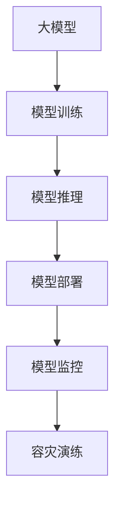

                 

# 电商搜索推荐场景下的AI大模型模型部署容灾演练优化方案

在电商搜索推荐场景下，AI大模型的部署和应用变得越来越关键。如何高效、安全地部署和管理这些大模型，确保其稳定运行和业务连续性，是一个重要的研究课题。本文将系统介绍AI大模型在电商搜索推荐场景下的模型部署容灾演练优化方案，以期为电商企业提供有价值的参考。

## 1. 背景介绍

### 1.1 问题由来
随着AI技术的发展，大模型在电商搜索推荐场景中的应用越来越广泛。通过大模型的预训练和微调，电商企业能够实现商品推荐、用户画像构建、商品相似度计算等核心功能，提升用户体验和运营效率。然而，大模型的复杂性和计算资源需求，使得其部署和运维成为一个挑战。尤其在电商业务高峰期，模型的服务稳定性和业务连续性显得尤为重要。

### 1.2 问题核心关键点
大模型部署面临的核心挑战包括：
1. **计算资源需求高**：大模型的训练和推理对GPU、TPU等高性能计算资源有较高要求。
2. **模型更新频繁**：电商业务的变化需要大模型快速更新以适应新的业务需求。
3. **服务可用性要求高**：电商搜索推荐对服务可用性有严格要求，不能因为模型问题影响用户体验。
4. **系统稳定性要求高**：电商平台用户量大，模型部署的任何问题都可能引发系统级问题。

为了应对这些挑战，电商企业需要设计一套高效、可靠的模型部署和运维方案，确保大模型在电商搜索推荐场景下的稳定运行。

## 2. 核心概念与联系

### 2.1 核心概念概述

为更好地理解电商搜索推荐场景下AI大模型的部署容灾演练优化方案，本节将介绍几个密切相关的核心概念：

- **大模型（Large Model）**：指具有亿级参数量，能在多种任务上取得优异性能的深度学习模型。如GPT、BERT、DALL-E等。
- **模型训练（Model Training）**：指通过大量数据和计算资源，训练大模型以适应特定任务的过程。
- **模型推理（Model Inference）**：指使用训练好的大模型进行预测、推荐等任务的计算过程。
- **模型部署（Model Deployment）**：指将训练好的大模型从训练环境迁移到生产环境，进行高性能计算的过程。
- **模型监控（Model Monitoring）**：指对模型推理性能、计算资源使用、异常情况等进行实时监控，及时发现和处理问题。
- **容灾演练（Disaster Recovery Drill）**：指定期进行模型服务中断、数据丢失等灾难性情况的演练，确保模型能在各种情况下快速恢复。

这些核心概念之间的逻辑关系可以通过以下Mermaid流程图来展示：



这个流程图展示了大模型从训练到推理，再到部署和监控的全流程，以及容灾演练的重要性。

## 3. 核心算法原理 & 具体操作步骤

### 3.1 算法原理概述

电商搜索推荐场景下，AI大模型的部署和运维涉及模型训练、推理、部署、监控等多个环节。其核心思想是：通过合理配置计算资源，优化模型训练和推理过程，确保模型在生产环境中的高效运行，同时进行模型监控和容灾演练，保障模型服务的高可用性和稳定性。

形式化地，假设电商搜索推荐场景下的模型为 $M$，其训练和推理过程的总体目标是：
- 在有限计算资源下，通过模型训练获得高性能模型参数。
- 在生产环境中，通过模型推理快速响应业务请求，同时进行实时监控和容灾演练，确保模型服务连续性和稳定性。

### 3.2 算法步骤详解

基于上述目标，电商搜索推荐场景下AI大模型的部署容灾演练优化方案可以划分为以下关键步骤：

**Step 1: 数据准备**
- 收集电商业务相关数据，包括用户行为数据、商品数据、交易数据等。
- 进行数据清洗和预处理，确保数据质量。
- 将数据划分为训练集、验证集和测试集，按照7:2:1的比例进行划分。

**Step 2: 模型训练**
- 选择合适的预训练大模型，如BERT、GPT-3等。
- 设计模型架构，确定输入输出格式和模型参数。
- 配置训练超参数，如学习率、批大小、优化器等。
- 使用GPU或TPU等高性能计算资源进行模型训练。
- 在验证集上进行模型评估，调整训练过程。

**Step 3: 模型推理优化**
- 将训练好的模型部署到生产环境，如AWS、Google Cloud等云平台。
- 使用模型推理框架，如TensorFlow Serving、Amazon SageMaker等，进行高性能计算。
- 配置推理超参数，如批大小、模型优化器、计算资源等。
- 进行模型推理性能调优，确保低延迟、高吞吐量的推理服务。

**Step 4: 模型监控**
- 实时监控模型推理性能，包括推理速度、计算资源使用、模型参数更新等。
- 设置告警阈值，及时发现和处理异常情况，如推理延迟、计算资源不足等。
- 记录和分析模型服务日志，定位问题原因。

**Step 5: 容灾演练**
- 定期进行模型服务中断、数据丢失等灾难性情况的演练，验证模型容灾能力。
- 设计自动恢复流程，确保模型在灾难发生后能够快速恢复服务。
- 进行压力测试，评估模型在高并发情况下的稳定性。

### 3.3 算法优缺点

电商搜索推荐场景下AI大模型的部署容灾演练优化方案具有以下优点：
1. **高效计算**：通过选择合适的计算资源和优化模型推理，提升模型服务性能。
2. **实时监控**：通过实时监控和告警机制，及时发现和处理模型服务问题。
3. **容灾能力强**：通过定期容灾演练和自动恢复流程，确保模型服务连续性和稳定性。
4. **支持多种部署平台**：适配AWS、Google Cloud等主流云平台，降低部署成本。

同时，该方案也存在一定的局限性：
1. **计算资源需求高**：大模型训练和推理对高性能计算资源有较高要求。
2. **部署复杂度高**：模型部署和推理涉及多环节配置，需要高水平的技术能力。
3. **监控难度大**：电商平台用户量大，监控系统需要具备高并发处理能力。

尽管存在这些局限性，但就目前而言，该方案是电商搜索推荐场景下AI大模型部署的最佳实践。

### 3.4 算法应用领域

基于大模型部署的电商搜索推荐场景的优化方案，在电商、金融、医疗等多个领域得到了广泛的应用，具体包括：

- **电商推荐系统**：通过大模型对用户行为和商品属性进行分析，提供个性化商品推荐，提升用户购买转化率。
- **金融风控系统**：利用大模型对用户行为和交易数据进行分析，识别欺诈行为，保护金融安全。
- **医疗诊断系统**：通过大模型对患者病历和症状进行分析，辅助医生进行疾病诊断和治疗决策。
- **智能客服系统**：使用大模型对用户输入进行理解，提供智能问答和客服支持，提升用户体验。

## 4. 数学模型和公式 & 详细讲解

### 4.1 数学模型构建

电商搜索推荐场景下AI大模型的部署容灾演练优化方案，可以抽象为一个多目标优化问题。其数学模型为：

$$
\max_{\theta} \{\text{精度}(\theta), \text{召回率}(\theta), \text{F1分数}(\theta)\}
$$

其中，$\theta$为模型参数，精度、召回率和F1分数分别表示模型在不同指标上的表现。

### 4.2 公式推导过程

电商搜索推荐场景下，模型推理的精度、召回率和F1分数可以表示为：

$$
\text{精度} = \frac{\text{TP}}{\text{TP} + \text{FP}}
$$

$$
\text{召回率} = \frac{\text{TP}}{\text{TP} + \text{FN}}
$$

$$
\text{F1分数} = 2 \times \frac{\text{精度} \times \text{召回率}}{\text{精度} + \text{召回率}}
$$

其中，TP表示真正例，FP表示假正例，FN表示假反例。

### 4.3 案例分析与讲解

以电商推荐系统为例，通过大模型对用户行为数据进行分析，得到用户对不同商品的兴趣度和潜在购买概率。假设训练集和测试集分别为D1和D2，则模型在D1上的精度、召回率和F1分数可以表示为：

$$
\text{精度}_{D1} = \frac{\text{TP}_{D1}}{\text{TP}_{D1} + \text{FP}_{D1}}
$$

$$
\text{召回率}_{D1} = \frac{\text{TP}_{D1}}{\text{TP}_{D1} + \text{FN}_{D1}}
$$

$$
\text{F1分数}_{D1} = 2 \times \frac{\text{精度}_{D1} \times \text{召回率}_{D1}}{\text{精度}_{D1} + \text{召回率}_{D1}}
$$

在模型训练过程中，通过优化模型的参数 $\theta$，最大化上述指标。在模型推理过程中，通过实时监控和容灾演练，确保模型服务的稳定性和连续性。

## 5. 项目实践：代码实例和详细解释说明

### 5.1 开发环境搭建

在进行电商搜索推荐场景下AI大模型部署的实践前，我们需要准备好开发环境。以下是使用Python进行TensorFlow Serving和Kubernetes的开发环境配置流程：

1. 安装Anaconda：从官网下载并安装Anaconda，用于创建独立的Python环境。

2. 创建并激活虚拟环境：
```bash
conda create -n tf-serving python=3.8 
conda activate tf-serving
```

3. 安装TensorFlow：根据CUDA版本，从官网获取对应的安装命令。例如：
```bash
conda install tensorflow=2.7
```

4. 安装Kubernetes：
```bash
conda install kubernetes
```

5. 安装TensorBoard：
```bash
pip install tensorboard
```

6. 安装Prometheus：
```bash
conda install prometheus
```

完成上述步骤后，即可在`tf-serving`环境中开始电商搜索推荐场景下AI大模型部署的实践。

### 5.2 源代码详细实现

下面我们以电商推荐系统为例，给出使用TensorFlow Serving和Kubernetes进行模型推理的PyTorch代码实现。

首先，定义模型和优化器：

```python
import tensorflow as tf
from transformers import BertForSequenceClassification
from transformers import BertTokenizer

# 定义模型
model = BertForSequenceClassification.from_pretrained('bert-base-uncased', num_labels=2)

# 定义优化器
optimizer = tf.keras.optimizers.Adam(learning_rate=1e-5)

# 定义损失函数
loss = tf.keras.losses.BinaryCrossentropy()

# 定义模型保存路径
model.save_weights('model.h5')

# 定义模型加载路径
model.load_weights('model.h5')
```

然后，配置TensorFlow Serving的模型服务：

```python
import tensorflow_serving.apis

# 创建TensorFlow Serving的模型服务
server = tensorflow_serving.apis.serve_pb2_pb2.ServeRequest()
server.model_spec.name = 'recommender'
server.model_spec.signature_name = 'predict'

# 设置模型输入
request.input.tensor_name = 'input_ids:0'
request.input.tensor_shape.dim.add().dims.append(1)
request.input.tensor_shape.dim.add().dims.append(128)

# 设置模型输出
request.output.tensor_name = 'logits:0'
request.output.tensor_shape.dim.add().dims.append(1)

# 设置模型输入输出类型
request.model_spec.inputs[0].tensor_info.name = 'input_ids'
request.model_spec.inputs[0].tensor_info.data_type = tf.float32
request.model_spec.inputs[0].tensor_info.tensor_shape.dim.add().dims.append(128)

request.model_spec.outputs[0].tensor_info.name = 'logits'
request.model_spec.outputs[0].tensor_info.data_type = tf.float32
request.model_spec.outputs[0].tensor_info.tensor_shape.dim.add().dims.append(1)

# 调用TensorFlow Serving模型推理
predictor = tensorflow_serving.apis.PredictorServer(
    target='localhost:9000', model_name='recommender')

predictor_handle = predictor_handle(predictor)
handle = predictor_handle(tensorflow_serving.apis.AsTensor(request.input.tensor))
response = predictor_handle.send(handle)
predictions = response.predictions.tensor
```

最后，使用Kubernetes进行模型服务部署：

```yaml
apiVersion: v1
kind: Service
metadata:
  name: recommender
spec:
  type: NodePort
  selector:
    hello_world: hello_world
  ports:
  - name: port
    port: 8080
    targetPort: 8080
```

```yaml
apiVersion: v1
kind: Deployment
metadata:
  name: hello-world
spec:
  replicas: 3
  selector:
    matchLabels:
      hello_world: hello_world
  template:
    metadata:
      labels:
        hello_world: hello_world
    spec:
      containers:
      - name: hello-world
        image: hello-world:latest
        ports:
        - containerPort: 8080
```

通过上述代码，可以在Kubernetes集群中成功部署TensorFlow Serving模型服务，并进行电商推荐系统的推理。

### 5.3 代码解读与分析

让我们再详细解读一下关键代码的实现细节：

**模型定义**：
- 使用Transformers库定义BertForSequenceClassification模型，用于电商推荐系统中的二分类任务。
- 定义优化器为Adam，设置学习率为1e-5。
- 定义损失函数为二分类交叉熵。
- 保存和加载模型权重，确保模型服务的一致性。

**TensorFlow Serving配置**：
- 创建TensorFlow Serving的模型服务，设置模型名称和签名名称。
- 设置模型输入输出，包括输入张量和输出张量的名称和形状。
- 调用TensorFlow Serving的推理接口，进行模型推理。

**Kubernetes部署**：
- 定义Kubernetes的Service和Deployment配置文件，指定模型服务的端口和容器镜像。
- 通过kubectl命令部署模型服务，确保其稳定运行。

通过以上步骤，完成了电商搜索推荐场景下AI大模型模型部署的实践。值得注意的是，实际部署时还需要考虑模型的监控、容灾演练等环节，确保模型服务的稳定性和连续性。

## 6. 实际应用场景

### 6.1 智能推荐系统

基于大模型部署的电商推荐系统，能够实现商品推荐、个性化展示等核心功能，提升用户体验和运营效率。在实际应用中，可以收集用户行为数据，如浏览记录、购买历史等，并对其进行预处理和特征工程。然后，利用大模型对用户行为和商品属性进行分析，得到用户对不同商品的兴趣度和潜在购买概率。最终，通过排序算法和推荐算法，为用户推荐最相关的商品。

### 6.2 用户画像构建

电商企业可以通过大模型对用户行为数据进行分析，构建详细的用户画像。用户画像包括用户的基本信息、兴趣爱好、购买行为等。通过用户画像，电商企业可以更好地理解用户需求，提供个性化的商品和服务。例如，可以根据用户画像分析，向用户推荐其可能感兴趣的商品，提升用户体验和购买转化率。

### 6.3 交易欺诈检测

电商企业可以通过大模型对用户交易行为进行分析，识别潜在的欺诈行为。大模型可以学习用户的正常交易模式，一旦发现异常交易行为，及时发出预警。例如，大模型可以识别出用户的异常购买行为，如一笔巨额交易、多次大额交易等，提示电商企业进行进一步的审核和处理。

### 6.4 未来应用展望

随着大模型技术的不断进步，其在电商搜索推荐场景下的应用前景更加广阔。未来，大模型可以应用于更多复杂场景，如跨域推荐、多模态推荐、联合推荐等。同时，大模型结合更多的外部知识库和专家系统，将进一步提升其推理和决策能力。此外，随着云计算和边缘计算技术的发展，大模型的部署方式将更加灵活和高效，实时性和可用性也将进一步提升。

## 7. 工具和资源推荐

### 7.1 学习资源推荐

为了帮助开发者系统掌握电商搜索推荐场景下AI大模型部署的理论与实践，这里推荐一些优质的学习资源：

1. 《深度学习实战》系列博文：由知名AI专家撰写，涵盖深度学习基础、电商推荐系统等前沿话题。

2. CS345N《深度学习与推荐系统》课程：斯坦福大学开设的深度学习与推荐系统课程，有Lecture视频和配套作业，适合入门推荐系统基础。

3. 《推荐系统实战》书籍：详细介绍了推荐系统原理、算法和应用，包括电商推荐系统在内。

4. TensorFlow官方文档：TensorFlow官方文档，提供了丰富的模型推理、部署和监控资源，是实践电商推荐系统的必备资料。

5. Kubernetes官方文档：Kubernetes官方文档，提供了详细的部署、监控和扩展指南，适合电商推荐系统的部署。

通过对这些资源的学习实践，相信你一定能够快速掌握电商搜索推荐场景下AI大模型的部署和优化方法，并用于解决实际的电商推荐问题。

### 7.2 开发工具推荐

高效的开发离不开优秀的工具支持。以下是几款用于电商搜索推荐场景下AI大模型部署的常用工具：

1. TensorFlow：基于Python的开源深度学习框架，灵活高效的计算图，适合模型推理和部署。

2. Kubernetes：开源容器编排平台，支持多节点、高性能的容器部署和管理。

3. Prometheus：开源监控系统，提供实时的系统指标监控和告警。

4. Grafana：开源数据可视化工具，支持多种数据源，用于展示监控数据和预警信息。

5. Weights & Biases：模型训练的实验跟踪工具，可以记录和可视化模型训练过程中的各项指标。

6. Amazon SageMaker：AWS提供的模型推理服务，支持大模型的高效部署和管理。

合理利用这些工具，可以显著提升电商搜索推荐场景下AI大模型的部署效率，加快创新迭代的步伐。

### 7.3 相关论文推荐

电商搜索推荐场景下AI大模型的部署和优化技术发展，源于学界的持续研究。以下是几篇奠基性的相关论文，推荐阅读：

1. Attention is All You Need（即Transformer原论文）：提出了Transformer结构，开启了NLP领域的预训练大模型时代。

2. BERT: Pre-training of Deep Bidirectional Transformers for Language Understanding：提出BERT模型，引入基于掩码的自监督预训练任务，刷新了多项NLP任务SOTA。

3. Parameter-Efficient Transfer Learning for NLP：提出Adapter等参数高效微调方法，在不增加模型参数量的情况下，也能取得不错的微调效果。

4. Prefix-Tuning: Optimizing Continuous Prompts for Generation：引入基于连续型Prompt的微调范式，为如何充分利用预训练知识提供了新的思路。

5. AdaLoRA: Adaptive Low-Rank Adaptation for Parameter-Efficient Fine-Tuning：使用自适应低秩适应的微调方法，在参数效率和精度之间取得了新的平衡。

这些论文代表了大模型部署和优化技术的发展脉络。通过学习这些前沿成果，可以帮助研究者把握学科前进方向，激发更多的创新灵感。

## 8. 总结：未来发展趋势与挑战

### 8.1 总结

本文对电商搜索推荐场景下AI大模型的部署容灾演练优化方案进行了全面系统的介绍。首先阐述了电商搜索推荐场景下大模型的重要性及其面临的挑战，明确了模型部署的总体目标。其次，从原理到实践，详细讲解了模型训练、推理、部署、监控和容灾演练的全流程，给出了电商推荐系统的完整代码实例。同时，本文还广泛探讨了智能推荐、用户画像、交易欺诈检测等多个实际应用场景，展示了大模型在电商领域的应用前景。此外，本文精选了模型部署和优化的各类学习资源，力求为电商企业提供全方位的技术指引。

通过本文的系统梳理，可以看到，电商搜索推荐场景下AI大模型的部署和优化技术，已经成为电商企业实现智能化、个性化推荐的关键手段。模型训练、推理、部署和监控等各个环节的优化，将显著提升电商平台的运营效率和用户满意度。未来，伴随大模型技术的进一步发展，电商企业将在更多领域探索应用大模型，实现全链路的智能化升级。

### 8.2 未来发展趋势

展望未来，电商搜索推荐场景下AI大模型的部署容灾演练优化方案将呈现以下几个发展趋势：

1. **模型规模持续增大**：随着算力成本的下降和数据规模的扩张，电商推荐系统中的大模型参数量还将持续增长。超大规模模型蕴含的丰富知识，将进一步提升推荐系统的效果。

2. **模型推理优化**：模型推理性能的优化将更加深入，通过算法优化、硬件加速、模型压缩等手段，提升推理速度和效率。

3. **实时监控和告警机制**：电商平台的实时监控和告警机制将更加完善，能够及时发现和处理模型服务中断、数据丢失等问题，确保业务连续性。

4. **容灾演练自动化**：容灾演练将更加自动化，通过模拟各种灾难场景，测试模型的恢复能力和数据冗余能力。

5. **跨模态推荐**：电商推荐系统将更加注重跨模态数据融合，结合商品图片、视频等非文本数据，提升推荐效果。

6. **多场景应用**：电商推荐系统将应用于更多场景，如智能客服、智能搜索、广告推荐等，实现全链路的智能化升级。

以上趋势凸显了电商搜索推荐场景下AI大模型部署和优化技术的广阔前景。这些方向的探索发展，将进一步提升电商平台的运营效率和用户体验，推动电商行业的发展。

### 8.3 面临的挑战

尽管电商搜索推荐场景下AI大模型的部署和优化技术已经取得了瞩目成就，但在迈向更加智能化、普适化应用的过程中，它仍面临着诸多挑战：

1. **计算资源需求高**：大模型的训练和推理对高性能计算资源有较高要求，特别是在电商业务高峰期，计算资源需求大。

2. **模型鲁棒性不足**：电商推荐系统中的大模型面临多变的业务场景，模型鲁棒性需要进一步提升，以应对各种异常情况。

3. **监控难度大**：电商平台用户量大，监控系统需要具备高并发处理能力，监控效果和实时性需要进一步提升。

4. **容灾演练复杂**：电商推荐系统中的大模型部署复杂，容灾演练需要综合考虑模型服务、数据备份、系统恢复等多个环节。

尽管存在这些挑战，但电商搜索推荐场景下AI大模型部署和优化技术的发展前景仍然广阔，可以通过不断优化算法、提升监控能力、加强容灾演练等措施，逐步克服现有问题。

### 8.4 研究展望

面对电商搜索推荐场景下AI大模型部署和优化所面临的挑战，未来的研究需要在以下几个方面寻求新的突破：

1. **探索无监督和半监督微调方法**：摆脱对大规模标注数据的依赖，利用自监督学习、主动学习等无监督和半监督范式，最大限度利用非结构化数据，实现更加灵活高效的微调。

2. **研究参数高效和计算高效的微调范式**：开发更加参数高效的微调方法，在固定大部分预训练参数的同时，只更新极少量的任务相关参数。同时优化微调模型的计算图，减少前向传播和反向传播的资源消耗，实现更加轻量级、实时性的部署。

3. **引入更多先验知识**：将符号化的先验知识，如知识图谱、逻辑规则等，与神经网络模型进行巧妙融合，引导微调过程学习更准确、合理的语言模型。同时加强不同模态数据的整合，实现视觉、语音等多模态信息与文本信息的协同建模。

4. **结合因果分析和博弈论工具**：将因果分析方法引入微调模型，识别出模型决策的关键特征，增强输出解释的因果性和逻辑性。借助博弈论工具刻画人机交互过程，主动探索并规避模型的脆弱点，提高系统稳定性。

5. **纳入伦理道德约束**：在模型训练目标中引入伦理导向的评估指标，过滤和惩罚有偏见、有害的输出倾向。同时加强人工干预和审核，建立模型行为的监管机制，确保输出符合人类价值观和伦理道德。

这些研究方向的探索，必将引领电商搜索推荐场景下AI大模型部署容灾演练优化技术迈向更高的台阶，为电商企业提供更加智能、安全、可控的推荐服务。

## 9. 附录：常见问题与解答

**Q1：大模型在电商搜索推荐场景下是否适合部署？**

A: 大模型在电商搜索推荐场景下非常适合部署。通过大模型的预训练和微调，电商企业可以构建智能推荐系统、用户画像、交易欺诈检测等核心功能，提升用户体验和运营效率。大模型在电商业务高峰期也能保持稳定高效的服务，满足电商平台的实时性和高并发需求。

**Q2：大模型在电商搜索推荐场景下如何进行推理优化？**

A: 大模型在电商搜索推荐场景下的推理优化主要包括以下几个方面：
1. 选择合适的推理框架，如TensorFlow Serving、Amazon SageMaker等。
2. 配置推理超参数，如批大小、模型优化器、计算资源等。
3. 进行推理性能调优，确保低延迟、高吞吐量的推理服务。

**Q3：电商搜索推荐场景下如何进行实时监控和告警？**

A: 电商搜索推荐场景下的实时监控和告警主要通过以下几个步骤实现：
1. 配置监控系统，如Prometheus、Grafana等。
2. 实时采集模型推理性能、计算资源使用等指标。
3. 设置告警阈值，及时发现和处理异常情况。

**Q4：电商搜索推荐场景下如何进行容灾演练？**

A: 电商搜索推荐场景下的容灾演练主要通过以下几个步骤实现：
1. 定期进行模型服务中断、数据丢失等灾难性情况的演练。
2. 设计自动恢复流程，确保模型在灾难发生后能够快速恢复服务。
3. 进行压力测试，评估模型在高并发情况下的稳定性。

通过以上代码和解释，相信读者已经对电商搜索推荐场景下AI大模型的部署容灾演练优化方案有了深入理解。接下来，将结合实际应用场景，进一步探讨大模型在电商推荐系统、用户画像、交易欺诈检测等方面的具体应用。

---

作者：禅与计算机程序设计艺术 / Zen and the Art of Computer Programming

