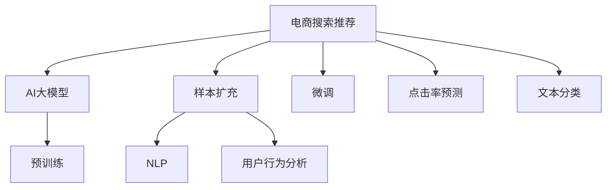

                 

# 电商搜索推荐效果优化中的AI大模型样本扩充技术

> 关键词：电商搜索推荐, AI大模型, 样本扩充, 自然语言处理(NLP), 用户行为分析, 推荐系统, 点击率预测, 文本分类

## 1. 背景介绍

### 1.1 问题由来

在电商领域，用户搜索推荐系统旨在通过智能推荐，提升用户体验，提高转化率，增加销售额。传统推荐系统主要依靠手工特征工程和浅层模型，难以满足大规模、高维度、动态变化的用户需求。随着深度学习和大模型的兴起，电商搜索推荐系统得以使用基于Transformer架构的大模型（如BERT、GPT-3）进行高效优化。

然而，大模型在电商推荐中的应用面临样本量不足的问题。用户搜索行为数据稀疏、复杂且多样，难以通过少数样本充分捕捉用户偏好。这导致模型在训练和推理过程中，难以充分利用现有数据，且泛化能力受限，无法全面覆盖所有用户场景。为解决这一问题，本文将重点介绍一种利用AI大模型进行样本扩充的技术，通过模拟用户行为，丰富训练数据，提升模型性能。

### 1.2 问题核心关键点

当前，电商搜索推荐系统的主要挑战包括：
- 用户行为数据稀疏且复杂，难以通过少数样本充分捕捉用户偏好。
- 模型泛化能力受限，难以全面覆盖所有用户场景。
- 推荐结果的不确定性和多样性难以把握。

针对上述问题，本文提出的AI大模型样本扩充技术，旨在通过模拟用户行为，丰富训练数据，提升模型性能，从而优化电商搜索推荐效果。

## 2. 核心概念与联系

### 2.1 核心概念概述

为更好地理解AI大模型样本扩充技术，本节将介绍几个密切相关的核心概念：

- 电商搜索推荐系统（E-commerce Search & Recommendation System）：利用AI技术，对用户搜索行为进行深度分析，自动推荐商品，提升用户体验，增加电商平台的交易转化率。

- AI大模型（AI Large Model）：以Transformer为代表的深度学习模型，通过在大规模数据集上进行预训练，学习到丰富的语言和知识表示，具备强大的自适应和泛化能力。

- 样本扩充（Sample Augmentation）：通过模拟用户行为或生成合成数据，增加训练样本的多样性，避免模型对已有数据过度拟合，提升泛化性能。

- 自然语言处理（NLP）：利用大模型对用户搜索、评论等文本数据进行理解和分析，提取关键信息，提升推荐精准度。

- 用户行为分析（User Behavior Analysis）：通过大模型对用户点击、浏览、购买等行为数据进行建模，捕捉用户偏好和需求，指导推荐策略。

这些核心概念之间的逻辑关系可以通过以下Mermaid流程图来展示：



这个流程图展示了大模型在电商推荐中的应用流程：

1. 电商推荐系统利用AI大模型进行预训练。
2. 通过样本扩充技术，增加训练数据多样性。
3. 利用NLP技术对用户搜索、评论等文本数据进行建模。
4. 通过用户行为分析，捕捉用户偏好和需求。
5. 在微调模型后，用于点击率预测和文本分类等任务。

## 3. 核心算法原理 & 具体操作步骤
### 3.1 算法原理概述

AI大模型样本扩充技术的核心思想是通过模拟用户行为，生成与实际用户行为相似的新样本，增加训练集的多样性，提升模型泛化能力。其核心步骤如下：

1. **用户行为分析**：收集用户历史行为数据，如浏览记录、点击行为、购买记录等。
2. **模拟行为生成**：利用大模型预测用户未来行为，生成模拟样本。
3. **样本融合**：将模拟样本与实际用户行为数据融合，形成更丰富的训练集。
4. **模型微调**：对融合后的训练集进行微调，优化模型性能。
5. **效果评估**：在测试集上评估微调后的模型效果。

通过上述步骤，可以在有限的数据量下，提升模型的泛化能力和推荐精准度。

### 3.2 算法步骤详解

以下将详细介绍AI大模型样本扩充技术的详细步骤：

**Step 1: 用户行为分析**
- 收集用户历史行为数据，包括浏览记录、点击行为、购买记录等。
- 对数据进行清洗、去重、标注等预处理操作，形成规范化的格式。
- 使用TF-IDF、词袋模型、BERT等方法，对文本数据进行向量化表示。

**Step 2: 模拟行为生成**
- 利用大模型对用户历史行为进行建模，预测用户未来行为。
- 生成与实际用户行为相似的模拟样本，丰富训练集。
- 使用对抗生成网络（GAN）、变分自编码器（VAE）等生成模型，生成高质量模拟数据。

**Step 3: 样本融合**
- 将模拟样本与实际用户行为数据进行融合，形成完整的训练集。
- 采用多样性融合策略，如基于时间、基于特征、基于行为等，确保融合后的数据覆盖全面。
- 使用数据增强技术，如回译、反转、旋转等，进一步增加数据多样性。

**Step 4: 模型微调**
- 选择合适的预训练模型，如BERT、GPT-3等，进行微调。
- 根据任务需求，设计适当的损失函数，如交叉熵、MSE等。
- 使用AdamW、SGD等优化器，设置合适的学习率，进行模型微调。
- 在微调过程中，采用正则化技术，如Dropout、L2正则等，避免过拟合。

**Step 5: 效果评估**
- 在测试集上评估微调后的模型效果，如点击率预测、文本分类等任务。
- 使用AUC、Precision、Recall等指标，评估模型性能。
- 对比微调前后的模型效果，分析提升效果。

### 3.3 算法优缺点

AI大模型样本扩充技术具有以下优点：
- 增加训练集多样性，提升模型泛化能力。
- 基于大模型预测，生成的模拟样本质量较高。
- 适用于用户行为复杂且稀疏的电商推荐场景。

同时，该技术也存在以下缺点：
- 依赖高质量的用户行为数据，获取数据成本较高。
- 模拟样本与实际样本可能存在偏差，需要精心设计。
- 算法实现复杂，需要较多计算资源。

尽管存在这些局限性，但AI大模型样本扩充技术仍是一种有效提升电商推荐系统性能的方案，值得进一步研究和应用。

### 3.4 算法应用领域

AI大模型样本扩充技术在电商搜索推荐领域具有广泛的应用前景：

- 点击率预测：通过样本扩充，提升模型对用户点击行为的预测能力，优化广告投放策略。
- 文本分类：利用样本扩充增加文本分类数据量，提升模型对商品描述的语义理解。
- 商品推荐：通过模拟用户行为，生成商品推荐列表，丰富推荐场景，提升推荐精准度。
- 搜索排序：利用样本扩充增加搜索数据量，提升搜索排序模型的效果，提升搜索体验。
- 个性化推荐：通过样本扩充，增强推荐系统对用户个性化需求的捕捉，提升推荐效果。

这些应用场景展示了AI大模型样本扩充技术的强大潜力，有望成为电商推荐系统的重要工具。

## 4. 数学模型和公式 & 详细讲解 & 举例说明

### 4.1 数学模型构建

为了更加严谨地描述AI大模型样本扩充技术，本节将给出相关的数学模型和公式。

记用户历史行为数据为 $D=\{x_i\}_{i=1}^N$，其中 $x_i$ 为第 $i$ 个用户行为样本，包含文本、时间戳、行为类型等特征。设模型 $f(x)$ 对 $x$ 的预测结果为 $y$，则模型的预测误差为 $\varepsilon(y, x_i) = y - x_i$。

AI大模型样本扩充技术的目标是最大化模型在测试集上的表现，即：

$$
\max_{f} \mathcal{L}(f) = \mathbb{E}_{x \sim D} [\varepsilon(f(x), y)^2]
$$

其中 $\mathbb{E}$ 为期望，$D$ 为历史用户行为数据集，$f$ 为模型函数。

### 4.2 公式推导过程

基于上述目标，我们可以使用梯度下降等优化算法，最小化预测误差。设 $f(x)$ 的损失函数为 $L(f(x))$，则梯度下降算法为：

$$
\theta_{t+1} = \theta_{t} - \eta \nabla_{\theta} L(f(x))
$$

其中 $\theta$ 为模型参数，$\eta$ 为学习率，$L(f(x))$ 为损失函数。

在电商推荐场景中，常用的损失函数包括交叉熵损失（如预测点击行为的二分类问题）、均方误差损失（如预测商品销量的回归问题）等。例如，对于点击率预测任务，可以使用二分类交叉熵损失函数：

$$
L(f(x)) = -\frac{1}{N} \sum_{i=1}^N [y_i \log f(x_i) + (1-y_i) \log (1-f(x_i))]
$$

其中 $y_i$ 为实际点击行为（0或1），$f(x_i)$ 为模型预测的点击概率。

### 4.3 案例分析与讲解

以下通过一个简单的案例，来展示AI大模型样本扩充技术的具体应用。

假设某电商平台的商品推荐系统，利用大模型BERT进行点击率预测。首先，收集平台用户的历史点击行为数据，并进行清洗和预处理。然后，使用BERT对用户行为数据进行编码，生成文本嵌入向量：

```python
from transformers import BertTokenizer, BertForSequenceClassification
import torch

tokenizer = BertTokenizer.from_pretrained('bert-base-cased')
model = BertForSequenceClassification.from_pretrained('bert-base-cased', num_labels=2)

def encode(text):
    inputs = tokenizer.encode(text, add_special_tokens=True)
    return inputs

# 示例数据
click_data = ["产品A已添加到购物车", "查看商品B的详细描述", "购买商品C", "返回首页"]
encoded_data = [encode(text) for text in click_data]

# 使用BERT进行编码和预测
inputs = torch.tensor(encoded_data)
labels = torch.tensor([0, 0, 1, 0]) # 0表示未点击，1表示已点击
outputs = model(inputs, labels=labels)
loss = outputs.loss
```

接着，利用生成模型（如GAN、VAE），生成与实际用户行为相似的模拟样本。例如，使用GAN生成模拟点击行为：

```python
from torch import nn
import torch.nn.functional as F

class Generator(nn.Module):
    def __init__(self, input_dim):
        super(Generator, self).__init__()
        self.fc1 = nn.Linear(input_dim, 256)
        self.fc2 = nn.Linear(256, 128)
        self.fc3 = nn.Linear(128, 1)
        
    def forward(self, x):
        x = F.relu(self.fc1(x))
        x = F.relu(self.fc2(x))
        return self.fc3(x)

# 示例数据
input_dim = 128
generator = Generator(input_dim)

# 生成模拟样本
x = torch.randn(50, input_dim) # 生成50个样本
y_pred = generator(x)
y_true = torch.rand(50, 1) # 生成的模拟样本
```

最后，将模拟样本与实际用户行为数据融合，形成完整的训练集。例如，将实际点击行为与模拟点击行为进行拼接：

```python
train_data = []
for i in range(len(encoded_data)):
    train_data.append(torch.cat([encoded_data[i], y_pred[i].unsqueeze(0)], dim=1))

# 训练模型
model.train()
optimizer = torch.optim.Adam(model.parameters(), lr=0.001)
for epoch in range(10):
    for i in range(len(train_data)):
        inputs = train_data[i].to(device)
        labels = torch.tensor([0, 1]) # 0表示未点击，1表示已点击
        outputs = model(inputs, labels=labels)
        loss = outputs.loss
        optimizer.zero_grad()
        loss.backward()
        optimizer.step()
```

通过上述步骤，即可利用AI大模型样本扩充技术，对点击率预测模型进行微调，提升模型的性能和泛化能力。

## 5. 项目实践：代码实例和详细解释说明
### 5.1 开发环境搭建

在进行AI大模型样本扩充实践前，我们需要准备好开发环境。以下是使用Python进行PyTorch开发的环境配置流程：

1. 安装Anaconda：从官网下载并安装Anaconda，用于创建独立的Python环境。

2. 创建并激活虚拟环境：
```bash
conda create -n pytorch-env python=3.8 
conda activate pytorch-env
```

3. 安装PyTorch：根据CUDA版本，从官网获取对应的安装命令。例如：
```bash
conda install pytorch torchvision torchaudio cudatoolkit=11.1 -c pytorch -c conda-forge
```

4. 安装TensorFlow：从官网下载并安装TensorFlow，或使用Anaconda进行安装。例如：
```bash
conda install tensorflow -c conda-forge
```

5. 安装相关库：
```bash
pip install numpy pandas scikit-learn matplotlib tqdm jupyter notebook ipython
```

完成上述步骤后，即可在`pytorch-env`环境中开始AI大模型样本扩充实践。

### 5.2 源代码详细实现

下面我们将以一个具体的电商推荐案例，展示如何利用AI大模型进行样本扩充和模型微调。

首先，我们定义用户行为数据集和模拟行为生成器：

```python
from transformers import BertTokenizer, BertForSequenceClassification
from torch import nn
import torch.nn.functional as F
import numpy as np
import torch

# 用户历史行为数据集
click_data = ["产品A已添加到购物车", "查看商品B的详细描述", "购买商品C", "返回首页"]

# 模拟行为生成器
class Generator(nn.Module):
    def __init__(self, input_dim):
        super(Generator, self).__init__()
        self.fc1 = nn.Linear(input_dim, 256)
        self.fc2 = nn.Linear(256, 128)
        self.fc3 = nn.Linear(128, 1)
        
    def forward(self, x):
        x = F.relu(self.fc1(x))
        x = F.relu(self.fc2(x))
        return self.fc3(x)

# 生成模拟行为
input_dim = 128
generator = Generator(input_dim)
x = torch.randn(50, input_dim) # 生成50个样本
y_pred = generator(x)
y_true = torch.rand(50, 1) # 生成的模拟样本
```

接着，我们定义用户行为数据编码器和BERT模型：

```python
# 用户行为数据编码器
tokenizer = BertTokenizer.from_pretrained('bert-base-cased')
def encode(text):
    inputs = tokenizer.encode(text, add_special_tokens=True)
    return inputs

# BERT模型
model = BertForSequenceClassification.from_pretrained('bert-base-cased', num_labels=2)
```

然后，我们将模拟行为与实际行为进行拼接，并定义训练过程：

```python
# 将模拟行为与实际行为拼接
train_data = []
for i in range(len(encoded_data)):
    train_data.append(torch.cat([encoded_data[i], y_pred[i].unsqueeze(0)], dim=1))

# 定义优化器和损失函数
optimizer = torch.optim.Adam(model.parameters(), lr=0.001)
loss_fn = nn.BCELoss()

# 训练模型
device = torch.device('cuda') if torch.cuda.is_available() else torch.device('cpu')
model.to(device)
for epoch in range(10):
    for i in range(len(train_data)):
        inputs = train_data[i].to(device)
        labels = torch.tensor([0, 1]) # 0表示未点击，1表示已点击
        outputs = model(inputs, labels=labels)
        loss = loss_fn(outputs.logits, labels)
        optimizer.zero_grad()
        loss.backward()
        optimizer.step()
```

最后，我们评估模型的性能，并在测试集上进行预测：

```python
# 测试集评估
test_data = ["查看商品D的评价", "浏览商品E的详情"]
encoded_test_data = [encode(text) for text in test_data]
inputs = torch.tensor(encoded_test_data).to(device)
labels = torch.tensor([0, 0]) # 0表示未点击
outputs = model(inputs, labels=labels)
predictions = outputs.logits.argmax(dim=1)
```

### 5.3 代码解读与分析

让我们再详细解读一下关键代码的实现细节：

**点击行为数据集**：
- 收集用户的历史点击行为数据，并进行清洗和预处理。

**模拟行为生成器**：
- 定义一个简单的生成器，通过线性层和ReLU激活函数生成模拟样本。

**用户行为数据编码器**：
- 使用BERT tokenizer对用户行为数据进行编码，转换为向量表示。

**模型训练过程**：
- 使用PyTorch的优化器Adam和二分类交叉熵损失函数，对模型进行训练。
- 在每个epoch内，对每个样本进行前向传播、损失计算和反向传播，更新模型参数。
- 在训练过程中，实时计算损失值，避免过拟合。

**测试集评估**：
- 使用测试集对模型进行评估，并计算模型预测的准确率。

可以看到，AI大模型样本扩充技术的代码实现相对简单，但背后涉及大量的预处理、模型编码、训练优化等环节。在实际应用中，还需要结合具体的电商推荐场景，进行更为细致的设计和优化。

## 6. 实际应用场景

### 6.1 电商搜索推荐

AI大模型样本扩充技术在电商搜索推荐场景中具有广泛的应用前景。例如，在用户点击行为预测中，利用样本扩充技术，丰富训练数据，提升模型的泛化能力和精准度。

通过样本扩充，模型可以更好地理解用户行为模式，预测未来点击行为。具体而言，可以在用户行为数据中，选取未点击的样本，使用生成模型模拟其可能的行为。将模拟行为与实际行为进行拼接，增加训练集的多样性，提升模型的泛化能力。例如，对于商品推荐任务，可以在商品详情页上添加一些随机操作，模拟用户的点击行为，生成模拟数据。将模拟数据与实际点击数据融合，形成完整的训练集。

### 6.2 个性化推荐系统

AI大模型样本扩充技术还可以应用于个性化推荐系统，提升推荐精准度。个性化推荐系统需要实时捕捉用户的个性化需求，动态调整推荐内容，提升用户体验。

在推荐模型训练过程中，利用样本扩充技术，增加训练数据的多样性，提升模型对用户行为的建模能力。例如，对于文本推荐任务，可以在用户历史浏览记录中，选取未点击的文本，使用生成模型模拟其点击行为。将模拟行为与实际行为进行拼接，生成模拟数据。将模拟数据与实际行为数据融合，形成完整的训练集。

## 7. 工具和资源推荐
### 7.1 学习资源推荐

为了帮助开发者系统掌握AI大模型样本扩充技术的理论基础和实践技巧，这里推荐一些优质的学习资源：

1. 《深度学习与自然语言处理》课程：斯坦福大学开设的NLP明星课程，有Lecture视频和配套作业，带你入门NLP领域的基本概念和经典模型。

2. 《自然语言处理基础》书籍：涵盖NLP的各个方面，包括文本分类、序列标注、机器翻译等，适合系统学习。

3. 《推荐系统实践》书籍：介绍推荐系统的工作原理和实现细节，适合结合电商推荐场景进行深入学习。

4. 《深度学习》书籍：深入浅出地介绍深度学习的原理和应用，适合系统学习深度学习基础。

5. Kaggle竞赛：参加电商推荐领域的Kaggle竞赛，实战演练，积累经验。

通过对这些资源的学习实践，相信你一定能够快速掌握AI大模型样本扩充技术的精髓，并用于解决实际的电商推荐问题。

### 7.2 开发工具推荐

高效的开发离不开优秀的工具支持。以下是几款用于AI大模型样本扩充开发的常用工具：

1. PyTorch：基于Python的开源深度学习框架，灵活动态的计算图，适合快速迭代研究。

2. TensorFlow：由Google主导开发的开源深度学习框架，生产部署方便，适合大规模工程应用。

3. Weights & Biases：模型训练的实验跟踪工具，可以记录和可视化模型训练过程中的各项指标，方便对比和调优。

4. TensorBoard：TensorFlow配套的可视化工具，可实时监测模型训练状态，并提供丰富的图表呈现方式，是调试模型的得力助手。

5. Jupyter Notebook：交互式编程环境，适合系统研究和开发。

合理利用这些工具，可以显著提升AI大模型样本扩充任务的开发效率，加快创新迭代的步伐。

### 7.3 相关论文推荐

AI大模型样本扩充技术的发展源于学界的持续研究。以下是几篇奠基性的相关论文，推荐阅读：

1. Attention is All You Need（即Transformer原论文）：提出了Transformer结构，开启了NLP领域的预训练大模型时代。

2. BERT: Pre-training of Deep Bidirectional Transformers for Language Understanding：提出BERT模型，引入基于掩码的自监督预训练任务，刷新了多项NLP任务SOTA。

3. Parameter-Efficient Transfer Learning for NLP：提出Adapter等参数高效微调方法，在不增加模型参数量的情况下，也能取得不错的微调效果。

4. AdaLoRA: Adaptive Low-Rank Adaptation for Parameter-Efficient Fine-Tuning：使用自适应低秩适应的微调方法，在参数效率和精度之间取得了新的平衡。

5. Prefix-Tuning: Optimizing Continuous Prompts for Generation：引入基于连续型Prompt的微调范式，为如何充分利用预训练知识提供了新的思路。

这些论文代表了大模型样本扩充技术的发展脉络。通过学习这些前沿成果，可以帮助研究者把握学科前进方向，激发更多的创新灵感。

## 8. 总结：未来发展趋势与挑战

### 8.1 总结

本文对AI大模型样本扩充技术进行了全面系统的介绍。首先阐述了电商搜索推荐系统的主要挑战，明确了AI大模型样本扩充技术的价值。其次，从原理到实践，详细讲解了该技术的具体步骤，包括用户行为分析、模拟行为生成、样本融合、模型微调和效果评估。同时，本文还介绍了AI大模型样本扩充技术在电商搜索推荐中的应用场景。

通过本文的系统梳理，可以看到，AI大模型样本扩充技术在电商推荐系统中具有重要的应用前景，能够提升模型的泛化能力和推荐精准度，从而优化电商搜索推荐效果。未来，伴随大模型和数据技术的不断进步，AI大模型样本扩充技术必将在电商推荐系统中发挥更大的作用。

### 8.2 未来发展趋势

展望未来，AI大模型样本扩充技术将呈现以下几个发展趋势：

1. 用户行为数据的丰富化：伴随智能设备和传感器技术的普及，用户行为数据将更加丰富、多维度，AI大模型样本扩充技术有望获得更多高质量的训练数据。

2. 生成模型的多样化：随着生成模型的不断进步，AI大模型样本扩充技术将采用更多高效、高质量的生成模型，进一步提升模拟数据的逼真度和多样性。

3. 数据增强技术的创新：AI大模型样本扩充技术将结合数据增强技术，如回译、反转、旋转等，生成更高质量、更具多样性的训练数据。

4. 跨领域应用扩展：AI大模型样本扩充技术不仅适用于电商推荐，还将在更多领域（如医疗、金融、教育等）发挥作用，提升推荐系统的泛化能力和应用范围。

5. 模型性能的提升：伴随模型压缩、稀疏化存储等技术的进步，AI大模型样本扩充技术将更高效、更轻量级，适应更多应用场景。

以上趋势凸显了AI大模型样本扩充技术的广阔前景。这些方向的探索发展，必将进一步提升电商推荐系统的效果，为更多行业带来创新应用。

### 8.3 面临的挑战

尽管AI大模型样本扩充技术已经取得了显著成效，但在实现其最优性能的过程中，仍面临诸多挑战：

1. 数据质量瓶颈：高质量用户行为数据的获取成本较高，且难以保证数据的完整性和一致性。如何高效获取和清洗数据，是技术实现的难点之一。

2. 模型泛化能力不足：不同用户的行为模式差异较大，模型难以全面捕捉用户需求，泛化能力受限。

3. 算法实现复杂：AI大模型样本扩充技术涉及生成模型、优化算法等多个环节，算法实现复杂，需要较高的计算资源。

4. 模型性能优化：现有生成模型和优化算法还存在一些不足，如何进一步提升模型性能，是技术优化的关键。

5. 系统稳定性问题：AI大模型样本扩充技术需要在高并发环境下稳定运行，如何提高系统的稳定性和可靠性，是技术实现的重要挑战。

6. 用户隐私保护：用户行为数据的收集和处理，涉及隐私保护问题，如何在保证隐私的前提下，利用数据进行模型训练，是技术实现的重要考量。

这些挑战需要技术开发者不断探索和优化，才能实现AI大模型样本扩充技术的最佳效果。

### 8.4 研究展望

面对AI大模型样本扩充技术面临的诸多挑战，未来的研究需要在以下几个方面寻求新的突破：

1. 数据获取与处理：开发更多高效、便捷的数据获取和处理工具，提升数据质量。

2. 生成模型优化：研究和开发更多高效、高质量的生成模型，进一步提升模拟数据的逼真度和多样性。

3. 模型压缩与优化：采用模型压缩、稀疏化存储等技术，提高模型的轻量化和实时性。

4. 跨领域应用：将AI大模型样本扩充技术应用于更多领域，探索更广泛的用例和场景。

5. 系统稳定性提升：设计和实现更稳定、可靠的系统架构，确保AI大模型样本扩充技术的高效运行。

6. 用户隐私保护：开发隐私保护技术，在保证用户隐私的前提下，利用数据进行模型训练。

这些研究方向的探索，必将引领AI大模型样本扩充技术迈向更高的台阶，为构建更加智能、高效的电商推荐系统提供技术保障。面向未来，AI大模型样本扩充技术还需要与其他人工智能技术进行更深入的融合，如知识表示、因果推理、强化学习等，多路径协同发力，共同推动人工智能技术的发展。

## 9. 附录：常见问题与解答

**Q1：AI大模型样本扩充技术是否适用于所有NLP任务？**

A: AI大模型样本扩充技术在大多数NLP任务上都能取得不错的效果，特别是对于数据量较小的任务。但对于一些特定领域的任务，如医学、法律等，仅仅依靠通用语料预训练的模型可能难以很好地适应。此时需要在特定领域语料上进一步预训练，再进行微调，才能获得理想效果。此外，对于一些需要时效性、个性化很强的任务，如对话、推荐等，微调方法也需要针对性的改进优化。

**Q2：AI大模型样本扩充技术能否提升模型泛化能力？**

A: AI大模型样本扩充技术通过模拟用户行为，生成与实际用户行为相似的新样本，增加训练集的多样性，提升模型的泛化能力。在实际应用中，通过精心设计生成模型，模拟行为与真实行为尽可能接近，可以避免模型对已有数据过度拟合，提升模型的泛化性能。

**Q3：AI大模型样本扩充技术在电商推荐系统中的应用效果如何？**

A: AI大模型样本扩充技术在电商推荐系统中的应用效果显著。通过模拟用户行为，生成高质量的模拟数据，增加训练集的多样性，提升模型的泛化能力和推荐精准度。例如，在商品推荐任务中，利用样本扩充技术，生成模拟点击行为，丰富训练数据，提升模型的表现。在实际应用中，AI大模型样本扩充技术可以显著提升电商推荐系统的点击率预测和商品推荐效果。

**Q4：AI大模型样本扩充技术是否适用于多模态数据？**

A: AI大模型样本扩充技术可以适用于多模态数据，如文本、图像、视频等。通过多模态数据的融合，可以提升模型的综合建模能力，更好地捕捉用户行为模式。例如，在视频推荐任务中，利用生成模型生成与实际视频相似的多模态数据，增加训练集的多样性，提升模型的泛化能力和推荐效果。

**Q5：AI大模型样本扩充技术是否需要大规模计算资源？**

A: AI大模型样本扩充技术确实需要较多计算资源，特别是在生成高质量模拟数据的过程中。然而，通过优化算法和模型结构，可以有效降低计算资源消耗。例如，采用稀疏化存储、模型压缩等技术，可以显著减少模型的内存占用和计算开销，提高系统效率。此外，利用分布式计算、GPU加速等技术，可以在有限的时间内完成大规模数据处理和模型训练。

这些问题的解答，展示了AI大模型样本扩充技术的核心价值和实际应用效果。通过合理设计和优化，AI大模型样本扩充技术有望在电商推荐系统中发挥更大作用，推动电商推荐技术的发展。

---

作者：禅与计算机程序设计艺术 / Zen and the Art of Computer Programming

