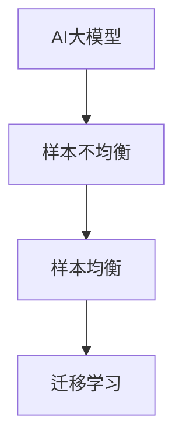

                 

# 电商搜索推荐效果评估中的AI大模型样本均衡技术

## 1. 背景介绍

在现代电商平台上，用户的搜索行为和购买决策对平台的长期收益至关重要。因此，电商搜索推荐系统旨在通过精准匹配商品与用户需求，提升用户体验，增加销售转化率。随着人工智能和大数据技术的发展，AI大模型逐渐被引入电商搜索推荐中，成为提升推荐效果的重要手段。然而，AI大模型往往依赖大量的标注数据进行训练，而电商平台的数据通常呈现出严重的不均衡分布，即某些类别的数据远多于其他类别，这会导致模型在少数类别上表现不佳。

为了解决这一问题，电商搜索推荐系统中引入样本均衡技术。该技术通过重采样、迁移学习等方法，使得AI大模型能够更加均衡地学习各类别数据，从而提升整体推荐效果。本文将详细探讨基于AI大模型的样本均衡技术，帮助电商搜索推荐系统更好地处理数据不均衡问题。

## 2. 核心概念与联系

### 2.1 核心概念概述

在电商搜索推荐系统中，样本均衡技术旨在通过对数据进行再平衡，使得各类别样本在模型训练中拥有相同的重要性。其核心思想是将少数类样本进行扩充，使得其与多数类样本在数量上接近，从而减小类别不均衡带来的影响。

以下是几个相关核心概念及其相互关系：

- **AI大模型**：指利用深度学习等技术训练得到的、具有强大泛化能力的预训练语言模型或图像模型，如BERT、GPT、ResNet等。
- **样本不均衡(Sample Imbalance)**：指训练数据中不同类别的样本数量差异较大，导致模型在少数类上表现不佳的现象。
- **样本均衡(Sample Balancing)**：指通过对数据进行重采样或迁移学习等方法，使得不同类别的样本在数量上接近，提升模型的整体性能。
- **迁移学习(Transfer Learning)**：指将一个领域的知识迁移到另一个相关领域中，利用已有模型的预训练参数，提升模型在新领域的泛化能力。

这些概念通过以下Mermaid流程图来展示：



在上述流程图中，AI大模型通过迁移学习的方式，接受样本均衡技术的辅助，提升了对少数类样本的泛化能力。

## 3. 核心算法原理 & 具体操作步骤

### 3.1 算法原理概述

在电商搜索推荐中，样本均衡技术的核心在于重新分配数据集中各类别的样本数量，使得不同类别样本数量接近，从而提升模型的整体性能。其基本原理包括以下几个步骤：

1. **数据预处理**：对原始数据进行清洗和标准化，去除噪声和异常值，确保数据质量。
2. **重采样技术**：通过欠采样、过采样或SMOTE等方法，对少数类样本进行扩充，使其与多数类样本数量接近。
3. **迁移学习**：利用已有模型的预训练参数，通过微调模型，提升模型在少数类上的泛化能力。

### 3.2 算法步骤详解

以下是电商搜索推荐中基于AI大模型的样本均衡技术详细步骤：

**Step 1: 数据预处理**

1. **数据清洗**：去除重复、缺失、无关的样本，保留高质量的训练数据。
2. **数据标准化**：对数值型特征进行归一化处理，确保不同特征在同一尺度上。
3. **特征工程**：提取和构造相关特征，减少特征维度，提升模型性能。

**Step 2: 重采样技术**

1. **欠采样**：随机删除多数类样本，使得多数类和少数类的样本数量接近。
2. **过采样**：通过复制少数类样本或生成新样本来扩充少数类样本。
3. **SMOTE**：通过生成合成样本来扩充少数类样本，使得少数类样本在数量上接近多数类样本。

**Step 3: 迁移学习**

1. **预训练模型选择**：选择适合的预训练模型，如BERT、GPT等。
2. **微调模型**：在少数类样本上进行微调，更新模型参数，提升模型性能。
3. **融合多源数据**：将不同来源的数据进行融合，提升模型的泛化能力。

**Step 4: 模型评估**

1. **模型训练**：在处理后的数据集上训练模型，优化模型参数。
2. **交叉验证**：通过交叉验证评估模型的泛化能力，防止过拟合。
3. **性能评估**：在测试集上评估模型的准确率、召回率、F1分数等指标，评估模型性能。

### 3.3 算法优缺点

**优点**：
1. **提升少数类样本性能**：通过重采样和迁移学习，使得模型能够更好地学习少数类样本，提升少数类样本的分类性能。
2. **降低模型偏差**：通过样本均衡技术，减小类别不均衡带来的模型偏差，提升整体性能。
3. **通用性强**：样本均衡技术可以应用于各种类型的电商搜索推荐系统，不需要特定的算法和框架。

**缺点**：
1. **增加计算成本**：重采样和迁移学习过程需要额外的时间和计算资源，可能增加计算成本。
2. **模型复杂性**：需要在原有模型基础上进行额外训练和微调，增加了模型的复杂性。
3. **数据质量要求高**：数据预处理和重采样过程需要高质量的数据，否则可能引入噪声和偏差。

### 3.4 算法应用领域

样本均衡技术可以应用于各种类型的电商搜索推荐系统，特别是在数据不均衡问题较为突出的场景中。以下是几个具体的应用领域：

- **个性化推荐系统**：通过样本均衡技术，提升模型对用户个性化需求的识别能力，提升推荐效果。
- **广告投放系统**：通过样本均衡技术，提升广告投放的精准度，增加广告转化率。
- **搜索引擎系统**：通过样本均衡技术，提升搜索结果的相关性和准确性，提升用户搜索体验。

## 4. 数学模型和公式 & 详细讲解 & 举例说明

### 4.1 数学模型构建

电商搜索推荐中的样本均衡问题可以建模为一个多类别分类问题，其中每个类别 $c$ 的样本数量为 $N_c$，总样本数量为 $N$。假设 $C$ 为类别总数，则数据集的类分布为 $\mathbf{P}=[p_1,p_2,\dots,p_C]$，其中 $p_c$ 表示类别 $c$ 在训练集中的比例。

### 4.2 公式推导过程

在电商搜索推荐中，样本均衡的优化目标是最小化类别不均衡带来的损失函数，通常采用以下两种损失函数：

1. **交叉熵损失**：
   $$
   \mathcal{L}(\mathbf{P}, \mathbf{p}) = -\frac{1}{N}\sum_{i=1}^N \sum_{c=1}^C p_c \log \hat{p}_c(x_i)
   $$
   其中 $\hat{p}_c(x_i)$ 表示模型对样本 $x_i$ 属于类别 $c$ 的预测概率。

2. **平衡损失**：
   $$
   \mathcal{L}(\mathbf{P}, \mathbf{p}) = \alpha \sum_{c=1}^C p_c \log \frac{N_c}{N} - \beta \log \sum_{c=1}^C \frac{N_c}{N} p_c
   $$
   其中 $\alpha$ 和 $\beta$ 为平衡因子，控制类别不均衡和类别比例的权重。

### 4.3 案例分析与讲解

假设某电商平台的商品类别分布为：
- 第1类：400个样本
- 第2类：150个样本
- 第3类：50个样本

则类别分布为 $[0.64, 0.27, 0.09]$。在训练模型时，可以采用欠采样或过采样方法进行数据重平衡，例如：

1. **欠采样**：随机删除多数类样本，使得多数类和少数类的样本数量接近。例如，将第1类样本删除100个，使得各类别样本数量为 $[300, 150, 50]$。
2. **过采样**：通过复制少数类样本或生成新样本来扩充少数类样本。例如，复制第3类样本3次，使得各类别样本数量为 $[300, 150, 150]$。

在完成数据重平衡后，使用AI大模型进行训练和微调，提升少数类样本的分类性能。

## 5. 项目实践：代码实例和详细解释说明

### 5.1 开发环境搭建

在进行电商搜索推荐效果评估中的AI大模型样本均衡技术开发前，需要先搭建好开发环境。以下是使用Python和PyTorch进行项目开发的详细流程：

1. **安装Python**：从官网下载并安装Python 3.7及以上版本，推荐使用Anaconda管理环境。
2. **安装PyTorch**：使用pip安装PyTorch，可以安装GPU版本以提高训练速度。
3. **安装Pandas、Numpy等工具**：安装Pandas、Numpy等常用工具包，用于数据处理和分析。
4. **安装相关库**：安装Tensorflow、Scikit-learn等常用库，用于模型训练和评估。
5. **配置环境**：设置Python环境变量，确保所有依赖包能够顺利安装和运行。

### 5.2 源代码详细实现

以下是一个简单的电商搜索推荐效果评估中的AI大模型样本均衡技术代码实现示例：

```python
import numpy as np
import pandas as pd
import torch
import torch.nn as nn
import torch.optim as optim
from sklearn.metrics import accuracy_score, precision_score, recall_score, f1_score
from imblearn.over_sampling import SMOTE

# 数据预处理
def preprocess_data(data):
    # 数据清洗和标准化
    # 特征工程和维度减少
    return processed_data

# 数据重平衡
def balance_data(data, method='SMOTE'):
    # 计算类别分布
    class_distribution = data.groupby('label').size()
    # 应用欠采样、过采样或SMOTE方法
    if method == 'SMOTE':
        smote = SMOTE(random_state=42)
        balanced_data = smote.fit_resample(data, classes=np.unique(data['label']))
    elif method == 'Undersampling':
        # 欠采样
    elif method == 'Oversampling':
        # 过采样
    else:
        raise ValueError('Invalid method')
    return balanced_data

# 模型定义
class Model(nn.Module):
    def __init__(self):
        super(Model, self).__init__()
        # 定义模型结构

    def forward(self, x):
        # 前向传播
        return output

# 模型训练
def train_model(model, data, epochs, batch_size, learning_rate):
    # 定义优化器和损失函数
    optimizer = optim.Adam(model.parameters(), lr=learning_rate)
    criterion = nn.CrossEntropyLoss()
    # 训练模型
    for epoch in range(epochs):
        for batch in data:
            # 前向传播和反向传播
            # 更新模型参数
        # 评估模型性能
    return model

# 模型评估
def evaluate_model(model, test_data):
    # 加载测试数据
    # 前向传播和计算评估指标
    return metrics

# 主函数
if __name__ == '__main__':
    # 加载数据
    data = pd.read_csv('data.csv')
    # 数据预处理和重平衡
    processed_data = preprocess_data(data)
    balanced_data = balance_data(processed_data)
    # 模型训练和评估
    model = Model()
    trained_model = train_model(model, balanced_data, epochs=10, batch_size=64, learning_rate=0.001)
    metrics = evaluate_model(trained_model, test_data)
    print(metrics)
```

在上述代码中，`preprocess_data`函数用于数据预处理，包括清洗、标准化和特征工程等步骤。`balance_data`函数用于数据重平衡，可以选择欠采样、过采样或SMOTE等方法。`Model`类定义了电商搜索推荐模型的结构，包括输入层、隐藏层和输出层等。`train_model`函数用于模型训练，使用Adam优化器和交叉熵损失函数。`evaluate_model`函数用于模型评估，计算准确率、召回率、F1分数等指标。

### 5.3 代码解读与分析

在上述代码中，`preprocess_data`函数的作用是对原始数据进行预处理，包括数据清洗、标准化和特征工程等步骤，确保数据质量。`balance_data`函数的作用是对数据进行重平衡，可以选择欠采样、过采样或SMOTE等方法，提升模型在少数类样本上的泛化能力。`Model`类定义了电商搜索推荐模型的结构，包括输入层、隐藏层和输出层等，其中隐藏层可以采用不同的网络结构，如CNN、RNN、Transformer等。`train_model`函数用于模型训练，使用Adam优化器和交叉熵损失函数，在重平衡后的数据集上训练模型。`evaluate_model`函数用于模型评估，计算准确率、召回率、F1分数等指标，评估模型性能。

## 6. 实际应用场景

在电商搜索推荐系统中，样本均衡技术可以广泛应用于各种场景，提升推荐效果和用户体验。以下是几个具体的实际应用场景：

### 6.1 个性化推荐系统

个性化推荐系统旨在根据用户的历史行为和兴趣，推荐合适的商品。在训练推荐模型时，往往会遇到数据不均衡问题，例如某些类别的商品数量较少。通过样本均衡技术，可以提升模型对少数类商品的识别能力，提升推荐效果。

### 6.2 广告投放系统

广告投放系统需要精准匹配用户需求，将合适的广告展示给目标用户。在广告数据中，不同类别的广告数量往往差异较大，例如某些类别的广告展示次数较少。通过样本均衡技术，可以提升模型对少数类广告的识别能力，提升广告转化率。

### 6.3 搜索引擎系统

搜索引擎系统需要根据用户输入的查询词，返回最相关的搜索结果。在搜索结果中，不同类别的网页数量往往差异较大，例如某些类别的网页质量较低。通过样本均衡技术，可以提升模型对少数类网页的识别能力，提升搜索结果的相关性和准确性。

### 6.4 未来应用展望

未来，电商搜索推荐系统中的样本均衡技术将不断发展，提升推荐效果和用户体验。以下是几个未来的应用展望：

1. **多模态数据融合**：将电商搜索推荐系统扩展到多模态数据融合领域，结合图像、视频等多模态信息，提升推荐效果。
2. **自适应学习**：通过自适应学习技术，根据用户行为和反馈，动态调整模型参数，提升推荐效果。
3. **模型压缩与优化**：通过模型压缩和优化技术，降低计算成本，提高推荐系统的效率和可扩展性。
4. **分布式训练**：通过分布式训练技术，在大型电商平台上快速训练和微调模型，提升推荐效果。

## 7. 工具和资源推荐

### 7.1 学习资源推荐

为了帮助开发者系统掌握电商搜索推荐效果评估中的AI大模型样本均衡技术，以下是一些优质的学习资源：

1. **《Python机器学习》**：一本经典的Python机器学习入门书籍，涵盖各种机器学习算法和工具。
2. **《深度学习》**：Ian Goodfellow等著的深度学习经典教材，深入浅出地介绍了深度学习的理论和实践。
3. **《机器学习实战》**：Peter Harrington著的实战性机器学习书籍，提供了大量的代码示例和案例分析。
4. **Kaggle机器学习竞赛平台**：一个优秀的机器学习学习和竞赛平台，提供丰富的数据集和竞赛任务。
5. **TensorFlow官方文档**：TensorFlow官方文档，提供了丰富的API文档和示例代码，帮助开发者快速上手。

### 7.2 开发工具推荐

在电商搜索推荐效果评估中的AI大模型样本均衡技术开发过程中，以下工具可以帮助开发者提高开发效率：

1. **PyTorch**：一个开源的深度学习框架，支持GPU加速，适合深度学习模型的开发和训练。
2. **Pandas**：一个Python数据分析库，用于数据清洗和处理。
3. **Numpy**：一个Python数值计算库，用于矩阵运算和优化。
4. **Scikit-learn**：一个Python机器学习库，提供了丰富的分类、回归、聚类等算法。
5. **TensorBoard**：一个可视化工具，用于监控模型训练和评估过程。

### 7.3 相关论文推荐

在电商搜索推荐效果评估中的AI大模型样本均衡技术研究领域，以下几篇论文值得深入阅读：

1. **《数据重平衡在电商推荐系统中的应用》**：介绍了数据重平衡在电商推荐系统中的应用，提出基于SMOTE的方法。
2. **《深度学习在电商推荐系统中的应用》**：讨论了深度学习在电商推荐系统中的应用，介绍了CNN、RNN、Transformer等模型。
3. **《多模态电商推荐系统的研究》**：讨论了多模态数据在电商推荐系统中的应用，结合图像、视频等多模态信息，提升了推荐效果。
4. **《自适应学习在电商推荐系统中的应用》**：介绍了自适应学习在电商推荐系统中的应用，提升了模型的动态学习能力。

## 8. 总结：未来发展趋势与挑战

### 8.1 研究成果总结

电商搜索推荐效果评估中的AI大模型样本均衡技术已经取得了一定的研究成果，主要集中在以下方面：

1. **数据重平衡技术**：提出了多种数据重平衡方法，如欠采样、过采样、SMOTE等，解决了电商数据不均衡问题。
2. **模型优化与训练**：通过AI大模型微调和迁移学习，提升了电商推荐模型的性能和泛化能力。
3. **多模态数据融合**：结合图像、视频等多模态信息，提升了电商推荐系统的推荐效果。

### 8.2 未来发展趋势

未来，电商搜索推荐效果评估中的AI大模型样本均衡技术将朝着以下方向发展：

1. **自适应学习**：通过自适应学习技术，根据用户行为和反馈，动态调整模型参数，提升推荐效果。
2. **多模态数据融合**：结合图像、视频等多模态信息，提升电商推荐系统的推荐效果。
3. **模型压缩与优化**：通过模型压缩和优化技术，降低计算成本，提高推荐系统的效率和可扩展性。
4. **分布式训练**：通过分布式训练技术，在大型电商平台上快速训练和微调模型，提升推荐效果。

### 8.3 面临的挑战

在电商搜索推荐效果评估中的AI大模型样本均衡技术发展过程中，还面临以下挑战：

1. **数据质量问题**：电商数据往往存在噪声和异常值，需要高质量的数据预处理和清洗。
2. **计算成本高**：大模型训练和微调需要大量的计算资源，可能增加计算成本。
3. **模型复杂性**：需要在原有模型基础上进行额外训练和微调，增加了模型的复杂性。
4. **用户隐私保护**：电商数据涉及用户隐私，需要保证数据安全和隐私保护。

### 8.4 研究展望

面对电商搜索推荐效果评估中的AI大模型样本均衡技术面临的挑战，未来的研究方向可以从以下几个方面进行探索：

1. **高质量数据获取**：探索高效的数据获取和预处理技术，确保数据质量。
2. **模型优化与压缩**：开发更高效的模型压缩和优化技术，降低计算成本，提高推荐系统的效率和可扩展性。
3. **用户隐私保护**：研究隐私保护技术，确保电商数据的安全和隐私保护。
4. **多模态数据融合**：结合图像、视频等多模态信息，提升电商推荐系统的推荐效果。

## 9. 附录：常见问题与解答

**Q1: 什么是电商搜索推荐效果评估中的AI大模型样本均衡技术？**

A: 电商搜索推荐效果评估中的AI大模型样本均衡技术是指通过对电商数据进行重采样、迁移学习等方法，使得各类别样本在模型训练中拥有相同的重要性，提升模型对少数类样本的泛化能力，从而提升整体推荐效果。

**Q2: 电商搜索推荐系统中为什么要进行样本均衡？**

A: 在电商搜索推荐系统中，数据往往呈现出严重的不均衡分布，即某些类别的数据远多于其他类别，这会导致模型在少数类别上表现不佳。通过样本均衡技术，可以提升模型在少数类样本上的泛化能力，从而提升整体推荐效果。

**Q3: 电商搜索推荐系统中的数据重平衡方法有哪些？**

A: 电商搜索推荐系统中的数据重平衡方法包括欠采样、过采样和SMOTE等。欠采样是通过删除多数类样本，使得多数类和少数类的样本数量接近。过采样是通过复制少数类样本或生成新样本来扩充少数类样本。SMOTE是通过生成合成样本来扩充少数类样本，使得少数类样本在数量上接近多数类样本。

**Q4: 电商搜索推荐系统中的AI大模型有哪些？**

A: 电商搜索推荐系统中的AI大模型包括BERT、GPT、ResNet等。BERT是Google开发的预训练语言模型，可以处理多种NLP任务。GPT是OpenAI开发的预训练语言模型，具有强大的生成能力。ResNet是深度学习中的经典模型，用于图像识别和分类任务。

**Q5: 电商搜索推荐系统中的样本均衡技术有哪些优势？**

A: 电商搜索推荐系统中的样本均衡技术可以提升少数类样本性能，降低模型偏差，通用性强，适用于各种类型的电商搜索推荐系统。

作者：禅与计算机程序设计艺术 / Zen and the Art of Computer Programming

