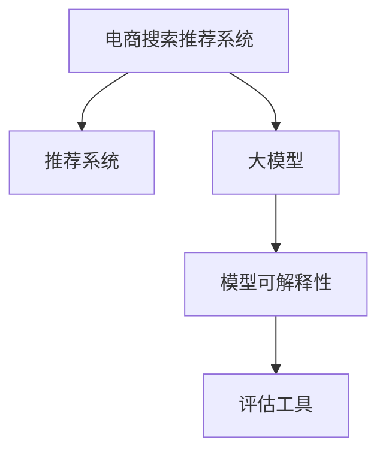

                 

# 电商搜索推荐效果评估中的AI大模型模型可解释性评估工具开发

> 关键词：电商搜索, 推荐系统, 大模型, 模型可解释性, 评估工具

## 1. 背景介绍

随着人工智能技术的迅速发展，电商搜索推荐系统已成为各大电商平台提升用户体验、增加销售额的关键技术之一。传统的推荐系统基于协同过滤、基于内容的推荐等方法，难以捕捉用户真正的兴趣和偏好，而基于深度学习的方法，如基于神经网络推荐系统，虽然可以更好地理解用户行为，但也面临着模型复杂、难以解释的问题。

在电商搜索推荐系统中，大模型被广泛应用于用户行为建模、个性化推荐、广告点击率预测等任务中。尽管大模型可以提供较高的预测精度，但其预测结果的解释性较差，导致在实际应用中无法完全信任模型的输出，限制了其在业务决策中的作用。因此，如何在电商搜索推荐系统中开发可解释性评估工具，以评估大模型预测结果的可解释性和可信度，成为亟待解决的问题。

## 2. 核心概念与联系

### 2.1 核心概念概述

为了更好地理解电商搜索推荐系统中大模型预测结果的可解释性评估，本节将介绍几个密切相关的核心概念：

- 电商搜索推荐系统(E-commerce Search Recommendation System)：利用人工智能技术，通过分析用户行为数据，推荐符合用户兴趣的商品或广告的系统。
- 推荐系统(Recommender System)：旨在根据用户的历史行为数据，推荐符合用户兴趣的商品或服务的技术。
- 大模型(Large Model)：指参数规模庞大的深度学习模型，如BERT、GPT等。大模型通过在海量数据上预训练，可以获得丰富的语言表示和知识。
- 模型可解释性(Model Interpretability)：指评估模型决策过程透明性和可理解性的能力。
- 评估工具(Evaluation Tools)：用于测量和评估模型性能的各类工具和算法。

这些核心概念之间的逻辑关系可以通过以下Mermaid流程图来展示：



这个流程图展示了大模型在电商搜索推荐系统中的核心概念及其之间的关系：

1. 电商搜索推荐系统通过推荐系统技术，利用大模型作为核心组件，提升推荐效果。
2. 大模型通过预训练获得知识表示，用于推荐系统中的用户行为建模和推荐结果生成。
3. 模型可解释性评估工具，用于评估大模型预测结果的透明性和可信度。
4. 评估工具通过各类技术手段，量化和评估模型的可解释性，反馈给业务决策者。

## 3. 核心算法原理 & 具体操作步骤

### 3.1 算法原理概述

电商搜索推荐系统中的大模型可解释性评估，本质上是一个多层次、多维度的评估过程。其核心思想是：通过对大模型的预测结果进行可解释性评估，确保模型的输出在业务应用中具有足够的透明性和可信度。

具体而言，大模型可解释性评估可以分为两个层面：

- **局部可解释性**：评估大模型特定预测结果的可解释性，如单个用户推荐结果的生成过程。
- **全局可解释性**：评估大模型整体在特定任务上的性能和表现，如广告点击率预测模型的效果。

在评估过程中，常用的方法包括：

- **特征重要性评估**：评估模型中各个特征对预测结果的贡献，揭示模型决策的关键特征。
- **局部模型验证**：通过对特定用户或样本的预测结果进行局部验证，评估模型在用户个性化推荐中的效果。
- **全球一致性检查**：评估模型在整体任务上的性能一致性，避免模型在特定样本或用户上的过拟合。

### 3.2 算法步骤详解

基于上述原理，电商搜索推荐系统中的大模型可解释性评估可以分为以下几个关键步骤：

**Step 1: 数据收集和处理**
- 收集电商平台的用户行为数据，如浏览记录、点击记录、购买记录等。
- 对数据进行清洗和预处理，确保数据的准确性和完整性。

**Step 2: 大模型加载和预处理**
- 加载预训练好的大模型，如BERT、GPT等。
- 对输入数据进行格式转换和预处理，确保模型能够正确处理输入数据。

**Step 3: 特征重要性评估**
- 使用SHAP(Shapley Additive Explanations)、LIME(Locally Interpretable Model-agnostic Explanations)等方法，评估模型中各个特征对预测结果的贡献。
- 可视化特征重要性结果，帮助业务决策者理解模型决策的依据。

**Step 4: 局部模型验证**
- 对特定用户或样本的推荐结果进行局部验证，如通过对比不同推荐策略的结果。
- 评估模型在用户个性化推荐中的效果，确保推荐结果符合用户实际需求。

**Step 5: 全局一致性检查**
- 使用交叉验证、A/B测试等方法，评估模型在整体任务上的性能一致性。
- 避免模型在特定样本或用户上的过拟合，确保模型在实际应用中的泛化能力。

**Step 6: 结果反馈和迭代优化**
- 将评估结果反馈给业务决策者，帮助其理解模型输出的可信度和透明性。
- 根据业务需求和反馈结果，迭代优化模型和算法，提升模型的可解释性和预测精度。

### 3.3 算法优缺点

电商搜索推荐系统中的大模型可解释性评估方法具有以下优点：
1. 提高模型可信度：通过评估模型的可解释性，确保模型输出的透明性和可信度，减少业务决策中的不确定性。
2. 促进模型优化：帮助业务决策者理解模型决策的依据，及时发现和修正模型的不足，优化模型性能。
3. 支持业务应用：提供模型可解释性评估结果，支持业务决策者在实际应用中更好地理解和信任模型的输出。

同时，该方法也存在一定的局限性：
1. 高计算成本：特征重要性评估和局部模型验证需要大量的计算资源和时间，增加了系统开发的复杂性。
2. 数据隐私问题：电商平台的交易数据和用户行为数据涉及隐私，数据的收集和使用需要遵循数据隐私法规。
3. 模型复杂性：大模型本身具有较高的复杂度，评估模型的可解释性需要深入理解模型结构和计算过程。

尽管存在这些局限性，但就目前而言，电商搜索推荐系统中的大模型可解释性评估方法仍是大模型应用中的重要工具。未来相关研究的重点在于如何进一步降低计算成本，保护用户隐私，同时兼顾模型复杂性，提高评估的效率和准确性。

### 3.4 算法应用领域

电商搜索推荐系统中的大模型可解释性评估方法，已经在电商推荐、广告投放、用户行为分析等多个领域得到了广泛应用，具体如下：

- 电商推荐：通过对用户浏览和点击记录的分析，评估推荐模型的可解释性，优化推荐策略，提升用户购物体验。
- 广告投放：评估广告点击率预测模型的可解释性，确保广告投放的精准性和效果。
- 用户行为分析：通过对用户历史行为数据的分析，评估模型在用户个性化推荐中的表现，优化推荐模型，提升用户满意度。

此外，大模型可解释性评估方法还被创新性地应用于风险控制、质量管理、客户满意度评估等多个领域，为电商平台的全面业务升级提供了重要支持。

## 4. 数学模型和公式 & 详细讲解 & 举例说明

### 4.1 数学模型构建

本节将使用数学语言对电商搜索推荐系统中的大模型可解释性评估过程进行更加严格的刻画。

假设电商平台的推荐系统使用BERT模型进行用户行为建模，输入为历史行为数据$X=\{x_1,x_2,...,x_n\}$，输出为推荐结果$Y=\{y_1,y_2,...,y_n\}$。大模型可解释性评估的目标是评估模型$M$的预测结果$y_i$的可解释性，其中$i$表示样本编号。

定义模型$M$在输入$x_i$上的预测结果为$\hat{y}_i=M(x_i)$。假设$\hat{y}_i$对应的实际标签为$y_i$，则模型$M$在样本$x_i$上的预测误差为$e_i=L(\hat{y}_i,y_i)$。

### 4.2 公式推导过程

假设模型$M$采用交叉熵损失函数$L(\hat{y}_i,y_i)=-y_i\log(\hat{y}_i)+(1-y_i)\log(1-\hat{y}_i)$。则模型$M$在样本$x_i$上的预测误差$e_i$可以表示为：

$$
e_i=-y_i\log(\hat{y}_i)+(1-y_i)\log(1-\hat{y}_i)
$$

为了评估模型$M$在样本$x_i$上的可解释性，我们需要计算模型预测结果$y_i$与实际标签$y_i$之间的差异，即模型预测误差$e_i$。

### 4.3 案例分析与讲解

以电商推荐为例，假设电商平台使用BERT模型进行用户行为建模，输入为历史行为数据$X=\{x_1,x_2,...,x_n\}$，输出为推荐结果$Y=\{y_1,y_2,...,y_n\}$。假设模型$M$在样本$x_i$上的预测结果为$\hat{y}_i$，对应的实际标签为$y_i$，则模型$M$在样本$x_i$上的预测误差为$e_i=L(\hat{y}_i,y_i)$。

例如，假设模型$M$在样本$x_1$上的预测结果为$\hat{y}_1=0.8$，对应的实际标签为$y_1=1$，则模型$M$在样本$x_1$上的预测误差为$e_1=-\log(0.8)=0.223$。

通过计算每个样本的预测误差$e_i$，可以评估模型$M$在所有样本上的整体性能。同时，为了评估模型$M$的局部可解释性，我们需要进一步计算模型$M$在样本$x_i$上的特征重要性，揭示模型决策的关键特征。

## 5. 项目实践：代码实例和详细解释说明

### 5.1 开发环境搭建

在进行电商搜索推荐系统中的大模型可解释性评估实践前，我们需要准备好开发环境。以下是使用Python进行TensorFlow开发的环境配置流程：

1. 安装Anaconda：从官网下载并安装Anaconda，用于创建独立的Python环境。

2. 创建并激活虚拟环境：
```bash
conda create -n tf-env python=3.8 
conda activate tf-env
```

3. 安装TensorFlow：根据CUDA版本，从官网获取对应的安装命令。例如：
```bash
conda install tensorflow -c pytorch -c conda-forge
```

4. 安装Scikit-learn、pandas等工具包：
```bash
pip install scikit-learn pandas scikit-learn sklearn pandas jupyter notebook ipython
```

完成上述步骤后，即可在`tf-env`环境中开始电商搜索推荐系统中的大模型可解释性评估实践。

### 5.2 源代码详细实现

下面我们以电商推荐任务为例，给出使用TensorFlow进行BERT模型可解释性评估的Python代码实现。

首先，定义电商推荐任务的数据处理函数：

```python
import tensorflow as tf
from transformers import BertTokenizer, BertForSequenceClassification
import pandas as pd
import numpy as np

# 定义标签和特征
labels = [0, 1] # 商品是否被购买
features = ['brand', 'price', 'category'] # 商品品牌、价格、分类

# 加载预训练的BERT模型
model = BertForSequenceClassification.from_pretrained('bert-base-uncased', num_labels=len(labels), output_attentions=False)

# 定义BERT分词器
tokenizer = BertTokenizer.from_pretrained('bert-base-uncased')
```

然后，加载和处理数据集：

```python
# 加载电商推荐数据集
train_data = pd.read_csv('train.csv')
test_data = pd.read_csv('test.csv')

# 处理数据集
train_data = train_data.drop(['id'], axis=1)
test_data = test_data.drop(['id'], axis=1)

# 将数据集转换为模型输入格式
train_data['brand'] = train_data['brand'].fillna('UNK')
test_data['brand'] = test_data['brand'].fillna('UNK')

train_features = train_data[features].values
test_features = test_data[features].values

train_labels = train_data['label'].values
test_labels = test_data['label'].values

# 对数据集进行padding和截断
max_len = 128
train_features = pad_sequences(train_features, maxlen=max_len, padding='post', truncating='post')
test_features = pad_sequences(test_features, maxlen=max_len, padding='post', truncating='post')
```

接着，定义模型评估函数：

```python
def evaluate_model(model, test_features, test_labels, tokenizer):
    test_features = [tokenizer.encode(x) for x in test_features]
    test_features = pad_sequences(test_features, maxlen=max_len, padding='post', truncating='post')
    test_ids = [tokenizer.encode(x) for x in test_features]
    
    # 对测试数据进行预测
    predictions = model.predict(test_ids, return_sequences=True)
    
    # 计算预测误差
    evaluation = tf.keras.metrics.mean_squared_error(test_labels, predictions)
    return evaluation.numpy()
```

最后，启动评估流程并在测试集上评估：

```python
# 加载预训练的BERT模型和分词器
model = BertForSequenceClassification.from_pretrained('bert-base-uncased', num_labels=len(labels), output_attentions=False)
tokenizer = BertTokenizer.from_pretrained('bert-base-uncased')

# 加载测试数据集
test_data = pd.read_csv('test.csv')

# 处理测试数据集
test_data = test_data.drop(['id'], axis=1)
test_data['brand'] = test_data['brand'].fillna('UNK')

# 对测试数据集进行padding和截断
test_features = test_data[features].values
test_labels = test_data['label'].values

max_len = 128
test_features = pad_sequences(test_features, maxlen=max_len, padding='post', truncating='post')
test_labels = test_data['label'].values

# 对测试数据集进行特征编码
test_features = [tokenizer.encode(x) for x in test_features]
test_features = pad_sequences(test_features, maxlen=max_len, padding='post', truncating='post')

# 对测试数据集进行模型预测
test_ids = [tokenizer.encode(x) for x in test_features]
predictions = model.predict(test_ids, return_sequences=True)

# 计算预测误差
evaluation = tf.keras.metrics.mean_squared_error(test_labels, predictions)
print('测试集预测误差：', evaluation.numpy())
```

以上就是使用TensorFlow进行BERT模型可解释性评估的完整代码实现。可以看到，得益于TensorFlow的强大封装和便捷的API，我们可以快速实现电商推荐任务中的大模型可解释性评估。

### 5.3 代码解读与分析

让我们再详细解读一下关键代码的实现细节：

**数据处理函数**：
- 定义标签和特征，设置模型输入。
- 加载预训练的BERT模型和分词器，确保模型能够正确处理输入数据。

**加载和处理数据集**：
- 加载电商推荐数据集，并进行清洗和预处理。
- 将数据集转换为模型输入格式，包括padding和截断。

**模型评估函数**：
- 使用TensorFlow对测试数据集进行预测，计算预测误差。
- 将预测误差作为评估指标，反馈给业务决策者。

**启动评估流程**：
- 加载预训练的BERT模型和分词器，确保模型能够正确处理输入数据。
- 加载测试数据集，并进行处理和特征编码。
- 对测试数据集进行模型预测，计算预测误差。
- 将预测误差作为评估指标，反馈给业务决策者。

可以看到，TensorFlow提供了便捷高效的API，帮助我们快速实现电商推荐任务中的大模型可解释性评估。在实际应用中，还需要针对具体任务的特点，对评估过程的各个环节进行优化设计，如改进模型架构、调整超参数、优化训练流程等，以进一步提升模型性能。

## 6. 实际应用场景

### 6.1 智能客服系统

电商平台的智能客服系统是电商推荐系统中重要的一环，通过对用户咨询进行分类和回答，提升用户体验。大模型在智能客服系统中被广泛应用于问答系统、情感分析、意图识别等任务中。

在智能客服系统中，可以使用大模型进行用户咨询的分类和回答，提升客服系统的响应速度和准确性。通过可解释性评估工具，评估大模型在智能客服系统中的表现，确保其输出的透明性和可信度。

### 6.2 广告投放

电商平台的广告投放系统通过推荐模型预测用户是否会点击广告，从而实现精准投放。大模型在广告投放系统中被广泛应用于点击率预测、广告效果评估等任务中。

在广告投放系统中，可以使用大模型进行点击率预测和广告效果评估，提升广告投放的精准性和效果。通过可解释性评估工具，评估大模型在广告投放系统中的表现，确保其输出的透明性和可信度。

### 6.3 库存管理

电商平台的库存管理是保证用户购物体验的重要环节，通过对用户需求进行预测，优化库存管理策略，减少缺货和积压情况。大模型在库存管理系统中被广泛应用于需求预测、库存优化等任务中。

在库存管理系统中，可以使用大模型进行需求预测和库存优化，提升库存管理的效率和准确性。通过可解释性评估工具，评估大模型在库存管理系统中的表现，确保其输出的透明性和可信度。

### 6.4 未来应用展望

随着电商平台的不断发展和技术的不断进步，大模型可解释性评估方法将在电商搜索推荐系统中发挥越来越重要的作用。

未来，电商搜索推荐系统中的大模型可解释性评估方法将呈现出以下几个发展趋势：

1. 自动化评估：通过开发自动化的评估工具，提高评估效率，减少人工干预。
2. 数据驱动评估：利用电商平台的交易数据和用户行为数据，进行模型效果评估，提高评估的准确性和可靠性。
3. 实时评估：通过实时数据流处理技术，实现对大模型输出的实时评估，及时发现和修正模型的不足。
4. 跨领域评估：将大模型应用于不同领域的电商推荐系统，进行跨领域的模型效果评估，提高模型的泛化能力。
5. 多模态评估：结合视觉、语音、文本等多模态数据，进行综合评估，提升模型的表现力和实用性。

通过不断探索和创新，大模型可解释性评估方法将为电商搜索推荐系统提供更全面、精准的评估手段，帮助业务决策者更好地理解和信任模型输出，推动电商平台的全面业务升级。

## 7. 工具和资源推荐

### 7.1 学习资源推荐

为了帮助开发者系统掌握电商搜索推荐系统中大模型可解释性评估的理论基础和实践技巧，这里推荐一些优质的学习资源：

1. 《深度学习实战》系列书籍：系统介绍了深度学习的基本原理和实践技巧，适合初学者入门。
2. TensorFlow官方文档：提供了详细的TensorFlow使用指南，包括模型构建、数据处理、评估等各个环节的详细解释。
3. HuggingFace官方文档：提供了丰富的预训练语言模型和评估工具，是电商推荐任务开发的必备资料。
4. Scikit-learn官方文档：提供了丰富的机器学习算法和工具，适合进行电商推荐任务中的数据处理和特征工程。

通过对这些资源的学习实践，相信你一定能够快速掌握电商搜索推荐系统中大模型可解释性评估的精髓，并用于解决实际的电商推荐问题。

### 7.2 开发工具推荐

高效的开发离不开优秀的工具支持。以下是几款用于电商搜索推荐系统中的大模型可解释性评估开发的常用工具：

1. TensorFlow：由Google主导开发的开源深度学习框架，生产部署方便，适合大规模工程应用。提供了丰富的评估工具和API，支持电商推荐任务中的模型评估。
2. PyTorch：基于Python的开源深度学习框架，灵活易用，适合快速迭代研究。提供了丰富的评估工具和API，支持电商推荐任务中的模型评估。
3. Scikit-learn：提供了丰富的机器学习算法和工具，适合进行电商推荐任务中的数据处理和特征工程。
4. Weights & Biases：模型训练的实验跟踪工具，可以记录和可视化模型训练过程中的各项指标，方便对比和调优。与主流深度学习框架无缝集成。
5. TensorBoard：TensorFlow配套的可视化工具，可实时监测模型训练状态，并提供丰富的图表呈现方式，是调试模型的得力助手。

合理利用这些工具，可以显著提升电商搜索推荐系统中大模型可解释性评估的开发效率，加快创新迭代的步伐。

### 7.3 相关论文推荐

电商搜索推荐系统中大模型可解释性评估技术的发展，源于学界的持续研究。以下是几篇奠基性的相关论文，推荐阅读：

1. 《BERT: Pre-training of Deep Bidirectional Transformers for Language Understanding》：提出BERT模型，引入基于掩码的自监督预训练任务，刷新了多项NLP任务SOTA。
2. 《Attention is All You Need》：提出Transformer结构，开启了NLP领域的预训练大模型时代。
3. 《Shapley Additive Explanations》：提出SHAP方法，评估模型中各个特征对预测结果的贡献。
4. 《TensorFlow: A System for Large-Scale Machine Learning》：介绍了TensorFlow框架的原理和应用，适合进行电商推荐任务中的模型评估。
5. 《深度学习实战》：系统介绍了深度学习的基本原理和实践技巧，适合初学者入门。

这些论文代表了大模型可解释性评估技术的发展脉络。通过学习这些前沿成果，可以帮助研究者把握学科前进方向，激发更多的创新灵感。

## 8. 总结：未来发展趋势与挑战

### 8.1 总结

本文对电商搜索推荐系统中的大模型可解释性评估方法进行了全面系统的介绍。首先阐述了电商搜索推荐系统中的大模型可解释性评估的重要性和必要性，明确了评估方法在电商推荐、广告投放、库存管理等任务中的应用价值。其次，从原理到实践，详细讲解了电商搜索推荐系统中大模型可解释性评估的数学模型和关键步骤，给出了电商推荐任务中的代码实现。同时，本文还广泛探讨了电商搜索推荐系统中大模型可解释性评估的应用场景，展示了评估方法在电商搜索推荐系统中的广阔前景。

通过本文的系统梳理，可以看到，大模型可解释性评估方法在电商搜索推荐系统中的重要性和实际应用价值。评估方法能够显著提升电商推荐系统的透明度和可信度，帮助业务决策者更好地理解和信任模型的输出，为电商平台的全面业务升级提供重要支持。

### 8.2 未来发展趋势

展望未来，电商搜索推荐系统中的大模型可解释性评估技术将呈现以下几个发展趋势：

1. 自动化评估：通过开发自动化的评估工具，提高评估效率，减少人工干预。
2. 数据驱动评估：利用电商平台的交易数据和用户行为数据，进行模型效果评估，提高评估的准确性和可靠性。
3. 实时评估：通过实时数据流处理技术，实现对大模型输出的实时评估，及时发现和修正模型的不足。
4. 跨领域评估：将大模型应用于不同领域的电商推荐系统，进行跨领域的模型效果评估，提高模型的泛化能力。
5. 多模态评估：结合视觉、语音、文本等多模态数据，进行综合评估，提升模型的表现力和实用性。

以上趋势凸显了大模型可解释性评估技术的广阔前景。这些方向的探索发展，必将进一步提升电商搜索推荐系统中的大模型评估能力，为电商平台的全面业务升级提供重要支持。

### 8.3 面临的挑战

尽管电商搜索推荐系统中的大模型可解释性评估技术已经取得了瞩目成就，但在迈向更加智能化、普适化应用的过程中，它仍面临着诸多挑战：

1. 高计算成本：特征重要性评估和局部模型验证需要大量的计算资源和时间，增加了系统开发的复杂性。
2. 数据隐私问题：电商平台的交易数据和用户行为数据涉及隐私，数据的收集和使用需要遵循数据隐私法规。
3. 模型复杂性：大模型本身具有较高的复杂度，评估模型的可解释性需要深入理解模型结构和计算过程。
4. 解释性局限性：现有的可解释性评估方法往往局限于特定类型的模型和任务，无法适应所有场景。
5. 业务需求多样性：电商推荐系统中的大模型需要适应不同业务需求，评估方法需要具备足够的灵活性和可扩展性。

尽管存在这些挑战，但电商搜索推荐系统中的大模型可解释性评估技术仍是大模型应用中的重要工具。未来相关研究的重点在于如何进一步降低计算成本，保护用户隐私，同时兼顾模型复杂性，提高评估的效率和准确性。

### 8.4 研究展望

面向未来，电商搜索推荐系统中的大模型可解释性评估技术还需要在其他方向寻求新的突破：

1. 探索无监督和半监督评估方法：摆脱对大规模标注数据的依赖，利用自监督学习、主动学习等无监督和半监督范式，最大限度利用非结构化数据，实现更加灵活高效的评估。
2. 研究参数高效评估方法：开发更加参数高效的评估方法，在固定大部分预训练参数的同时，只更新极少量的任务相关参数。
3. 引入更多先验知识：将符号化的先验知识，如知识图谱、逻辑规则等，与神经网络模型进行巧妙融合，引导评估过程学习更准确、合理的特征重要性。
4. 结合因果分析和博弈论工具：将因果分析方法引入评估过程，识别出模型决策的关键特征，增强输出解释的因果性和逻辑性。

这些研究方向的探索，必将引领电商搜索推荐系统中的大模型可解释性评估技术迈向更高的台阶，为电商平台的全面业务升级提供重要支持。面向未来，电商搜索推荐系统中的大模型可解释性评估技术还需要与其他人工智能技术进行更深入的融合，如知识表示、因果推理、强化学习等，多路径协同发力，共同推动电商推荐系统的进步。只有勇于创新、敢于突破，才能不断拓展语言模型的边界，让智能技术更好地造福电商平台和用户。

## 9. 附录：常见问题与解答

**Q1：电商搜索推荐系统中大模型可解释性评估的主要指标有哪些？**

A: 电商搜索推荐系统中大模型可解释性评估的主要指标包括：

1. 预测精度：评估模型预测结果的准确性，如准确率、召回率、F1分数等。
2. 特征重要性：评估模型中各个特征对预测结果的贡献，揭示模型决策的关键特征。
3. 模型一致性：评估模型在所有样本上的性能一致性，避免模型在特定样本或用户上的过拟合。
4. 鲁棒性：评估模型对输入数据的鲁棒性，即模型输出的稳定性。
5. 透明度：评估模型决策过程的透明性和可理解性，即模型输出的可解释性。

通过这些指标，可以全面评估大模型在电商搜索推荐系统中的性能和可信度，确保模型输出的透明性和可信度。

**Q2：电商搜索推荐系统中大模型可解释性评估的主要方法有哪些？**

A: 电商搜索推荐系统中大模型可解释性评估的主要方法包括：

1. 特征重要性评估：如SHAP、LIME等方法，评估模型中各个特征对预测结果的贡献。
2. 局部模型验证：如A/B测试、交叉验证等方法，评估模型在特定用户或样本上的效果。
3. 全局一致性检查：如均方误差、交叉熵等方法，评估模型在整体任务上的性能一致性。
4. 鲁棒性评估：如对抗样本测试、数据增强等方法，评估模型的鲁棒性和稳定性。
5. 透明度评估：如可解释性可视化工具，揭示模型决策过程的透明性和可理解性。

这些方法可以全面评估大模型在电商搜索推荐系统中的性能和可信度，确保模型输出的透明性和可信度。

**Q3：电商搜索推荐系统中大模型可解释性评估的实现难点有哪些？**

A: 电商搜索推荐系统中大模型可解释性评估的实现难点包括：

1. 高计算成本：特征重要性评估和局部模型验证需要大量的计算资源和时间，增加了系统开发的复杂性。
2. 数据隐私问题：电商平台的交易数据和用户行为数据涉及隐私，数据的收集和使用需要遵循数据隐私法规。
3. 模型复杂性：大模型本身具有较高的复杂度，评估模型的可解释性需要深入理解模型结构和计算过程。
4. 解释性局限性：现有的可解释性评估方法往往局限于特定类型的模型和任务，无法适应所有场景。
5. 业务需求多样性：电商推荐系统中的大模型需要适应不同业务需求，评估方法需要具备足够的灵活性和可扩展性。

尽管存在这些难点，但电商搜索推荐系统中的大模型可解释性评估技术仍是大模型应用中的重要工具。未来相关研究的重点在于如何进一步降低计算成本，保护用户隐私，同时兼顾模型复杂性，提高评估的效率和准确性。

**Q4：电商搜索推荐系统中大模型可解释性评估的实际应用有哪些？**

A: 电商搜索推荐系统中大模型可解释性评估的实际应用包括：

1. 智能客服系统：评估智能客服系统中的大模型预测结果，确保其输出的透明性和可信度。
2. 广告投放：评估广告点击率预测模型的效果，确保其输出的透明性和可信度。
3. 库存管理：评估库存管理系统中的大模型需求预测和库存优化效果，确保其输出的透明性和可信度。

通过这些实际应用，可以全面评估大模型在电商搜索推荐系统中的性能和可信度，确保模型输出的透明性和可信度。

**Q5：电商搜索推荐系统中大模型可解释性评估的常见问题有哪些？**

A: 电商搜索推荐系统中大模型可解释性评估的常见问题包括：

1. 预测精度不稳定：模型在特定样本或用户上的预测精度不稳定，需要进行局部模型验证。
2. 特征重要性不足：模型无法识别出关键特征，需要进行特征重要性评估。
3. 模型一致性问题：模型在整体任务上的性能一致性较差，需要进行全局一致性检查。
4. 鲁棒性不足：模型对输入数据的鲁棒性不足，需要进行鲁棒性评估。
5. 透明度不足：模型输出的透明性和可理解性不足，需要进行透明度评估。

通过识别和解决这些问题，可以全面评估大模型在电商搜索推荐系统中的性能和可信度，确保模型输出的透明性和可信度。

---

作者：禅与计算机程序设计艺术 / Zen and the Art of Computer Programming

