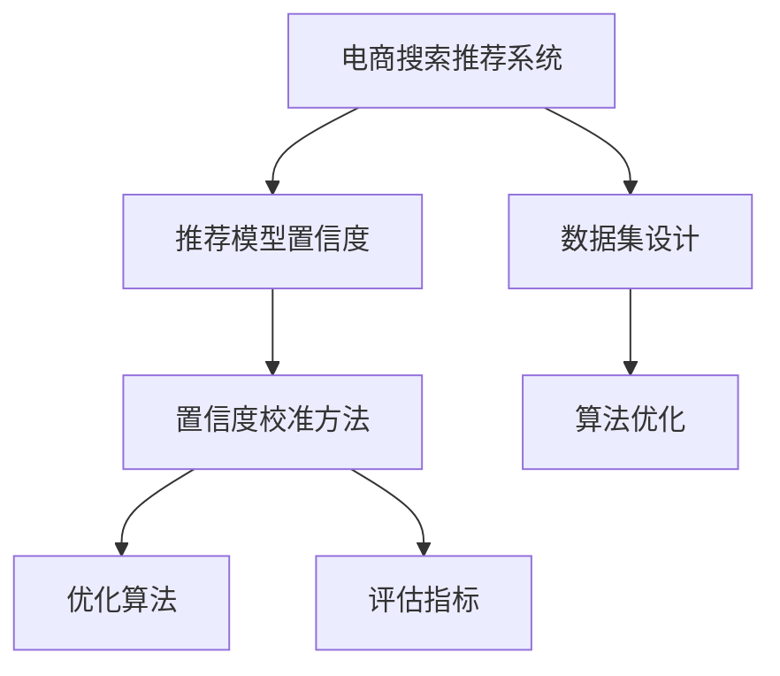

                 

# 电商搜索推荐效果评估中的AI大模型置信度校准技术应用案例分析与改进

> 关键词：电商搜索推荐系统,大模型置信度校准,推荐算法评估,实验结果分析,优化建议

## 1. 背景介绍

### 1.1 问题由来

在电商领域，基于AI的推荐系统已经成为提升用户体验和销售转化率的重要手段。然而，推荐系统的表现不仅依赖于算法的精度，还受限于其对用户行为和商品属性的置信度估计。错误的置信度估计将导致推荐系统产生误导性建议，严重损害用户体验，降低广告ROI。

置信度校准技术可以显著提高AI推荐系统的决策质量。它通过调整模型输出置信度，使之更准确地反映推荐的可靠性，从而在实际应用中取得更好的效果。然而，当前对于电商搜索推荐系统的置信度校准技术研究较少，其优化潜力尚未充分发掘。本文聚焦于电商推荐中的置信度校准，通过案例分析与改进措施，以期提升推荐系统效果。

### 1.2 问题核心关键点

电商搜索推荐系统中的置信度校准主要涉及以下关键点：

1. **推荐模型置信度**：模型对每个推荐结果的置信度估计。
2. **置信度校准方法**：如何将模型置信度调整为更符合实际置信度的技术。
3. **评估指标**：如精确度、召回率、F1-score等，用于衡量置信度校准效果。
4. **数据集设计**：设计合适的标注数据集，用于训练和评估置信度校准模型。
5. **算法优化**：开发高效的算法，降低校准过程的计算复杂度。

## 2. 核心概念与联系

### 2.1 核心概念概述

为了更好地理解电商推荐系统中的置信度校准技术，本节将介绍几个密切相关的核心概念：

- **电商搜索推荐系统**：基于用户行为和商品属性的推荐系统，旨在向用户推荐最相关、最有价值的产品。
- **置信度**：推荐系统对推荐结果可靠性的主观估计，通常为0到1之间的概率值。
- **置信度校准**：调整推荐模型输出的置信度，使之更准确地反映推荐可靠性的过程。
- **优化算法**：如梯度下降、拟牛顿法等，用于训练置信度校准模型。
- **评估指标**：如精确度、召回率、F1-score、AUC等，用于衡量置信度校准效果。

这些核心概念之间的逻辑关系可以通过以下Mermaid流程图来展示：



这个流程图展示了几项核心概念之间的相互关系：

1. 电商推荐系统通过推荐模型生成推荐结果。
2. 推荐模型对每个推荐结果有置信度估计。
3. 置信度校准方法调整推荐模型的置信度，使之更符合实际置信度。
4. 优化算法训练置信度校准模型。
5. 评估指标衡量置信度校准效果。
6. 数据集设计用于训练和评估校准模型。
7. 算法优化提高置信度校准的效率。

这些概念共同构成了电商推荐系统中的置信度校准框架，确保推荐结果更加可靠和用户友好。

## 3. 核心算法原理 & 具体操作步骤
### 3.1 算法原理概述

电商搜索推荐系统中的置信度校准，本质上是一个有监督的回归问题。其核心思想是：通过标注样本数据，训练一个回归模型，预测每个推荐结果的置信度，并与实际置信度进行比较，调整模型输出。

形式化地，假设推荐模型为 $F(x)$，其中 $x$ 为商品属性和用户行为特征，$y \in [0,1]$ 为推荐结果的实际置信度。训练一个回归模型 $H(x) \in [0,1]$，使得 $H(x)$ 尽可能逼近 $y$。具体流程如下：

1. 收集推荐模型对多个推荐结果的置信度估计。
2. 对每个推荐结果，标注其对应的实际置信度。
3. 训练回归模型 $H(x)$，使得 $H(x)$ 预测的置信度尽可能接近实际置信度 $y$。
4. 在推荐系统运行时，使用训练好的回归模型 $H(x)$ 对推荐结果置信度进行校准，替代推荐模型 $F(x)$ 的原始输出。

### 3.2 算法步骤详解

电商推荐系统中的置信度校准通常包括以下关键步骤：

**Step 1: 数据集准备**
- 收集推荐模型对多个推荐结果的置信度估计。
- 对每个推荐结果，标注其对应的实际置信度。
- 构建训练集和测试集，通常采用交叉验证方法。

**Step 2: 选择合适的回归模型**
- 常用的回归模型包括线性回归、逻辑回归、随机森林、神经网络等。
- 根据推荐任务的特点，选择合适的模型进行训练。

**Step 3: 训练回归模型**
- 使用训练集训练回归模型，最小化预测置信度与实际置信度之间的差距。
- 一般使用均方误差（MSE）、平均绝对误差（MAE）等损失函数进行训练。

**Step 4: 模型评估与调优**
- 使用测试集评估回归模型的预测性能，计算评估指标如精确度、召回率、F1-score等。
- 调整回归模型的超参数，如学习率、正则化参数等，以提升模型性能。

**Step 5: 部署与校准**
- 将训练好的回归模型部署到电商推荐系统中，对推荐结果的置信度进行校准。
- 在推荐系统运行时，替代推荐模型原始输出，使用回归模型预测置信度。

### 3.3 算法优缺点

电商推荐系统中的置信度校准技术具有以下优点：
1. 提高推荐系统的可靠性和准确性，减少误导性建议。
2. 提升用户满意度，增强广告ROI。
3. 适用于各种推荐算法，如协同过滤、矩阵分解等。

同时，该技术也存在一定的局限性：
1. 对标注数据的需求较高，标注成本较高。
2. 模型复杂度较高，训练和推理速度较慢。
3. 可能需要额外资源进行模型部署和维护。
4. 置信度校准效果受标注数据质量影响较大。

尽管存在这些局限性，但就目前而言，置信度校准技术仍是大规模推荐系统提升效果的重要手段。未来相关研究的重点在于如何进一步降低标注数据的依赖，提高模型的计算效率和鲁棒性，同时兼顾推荐系统的性能和用户体验。

### 3.4 算法应用领域

基于电商推荐系统中的置信度校准技术，可以广泛应用于以下领域：

1. **个性化推荐系统**：通过置信度校准，推荐系统能够更准确地判断推荐的可靠性，从而提升推荐效果。
2. **广告定向投放**：优化广告投放策略，确保广告定向更加精准，提高广告点击率和转化率。
3. **库存管理**：通过置信度校准，优化商品库存管理，减少缺货或过剩现象，提升库存周转率。
4. **营销活动分析**：分析营销活动对推荐效果的影响，优化活动策略，提高用户参与度和销售额。
5. **价格优化**：通过置信度校准，对推荐结果中的价格进行动态调整，提高销售转化率。

这些领域中，置信度校准技术的应用不仅有助于提升推荐系统的效果，还能够显著提高电商业务的整体运营效率。

## 4. 数学模型和公式 & 详细讲解
### 4.1 数学模型构建

电商推荐系统中的置信度校准可以视为一个回归问题，即利用训练数据构建一个回归函数 $H(x)$，使得 $H(x)$ 能够逼近真实的置信度 $y$。

形式化地，假设训练集为 $D=\{(x_i, y_i)\}_{i=1}^N$，其中 $x_i$ 为第 $i$ 个推荐结果的特征，$y_i$ 为对应的实际置信度。回归函数 $H(x)$ 的预测值为：

$$
\hat{y}_i = H(x_i)
$$

回归模型的损失函数通常采用均方误差（MSE）：

$$
\mathcal{L}(H) = \frac{1}{N}\sum_{i=1}^N (y_i - \hat{y}_i)^2
$$

### 4.2 公式推导过程

以线性回归模型为例，其形式为：

$$
H(x) = \beta_0 + \beta_1 x_1 + \cdots + \beta_k x_k
$$

其中 $\beta_0, \beta_1, \cdots, \beta_k$ 为模型的系数。回归模型的损失函数为：

$$
\mathcal{L}(\beta) = \frac{1}{N}\sum_{i=1}^N (y_i - (\beta_0 + \beta_1 x_{1,i} + \cdots + \beta_k x_{k,i}))^2
$$

其中 $x_{j,i}$ 表示第 $i$ 个样本的第 $j$ 个特征。

使用梯度下降法优化上述损失函数，求解最优系数 $\beta$：

$$
\beta_j \leftarrow \beta_j - \eta \frac{\partial \mathcal{L}(\beta)}{\partial \beta_j}
$$

其中 $\eta$ 为学习率。

### 4.3 案例分析与讲解

为了更好地理解电商推荐系统中的置信度校准技术，我们以一个具体的案例进行讲解。假设有一个电商平台，用户对推荐的商品进行点击和购买行为。平台收集了用户行为数据和商品属性数据，构建了推荐模型 $F(x)$，并利用模型对商品进行推荐。平台希望通过置信度校准技术，提升推荐系统的效果。

**Step 1: 数据集准备**
- 收集推荐模型对每个推荐结果的置信度估计。
- 对每个推荐结果，标注其对应的实际置信度，例如是否被点击或购买。
- 构建训练集和测试集，通常采用交叉验证方法。

**Step 2: 训练回归模型**
- 选择线性回归模型作为回归函数 $H(x)$。
- 使用训练集训练回归模型，最小化预测置信度与实际置信度之间的差距。
- 使用均方误差（MSE）损失函数进行训练。

**Step 3: 模型评估与调优**
- 使用测试集评估回归模型的预测性能，计算评估指标如精确度、召回率、F1-score等。
- 调整回归模型的超参数，如学习率、正则化参数等，以提升模型性能。

**Step 4: 部署与校准**
- 将训练好的回归模型部署到电商推荐系统中，对推荐结果的置信度进行校准。
- 在推荐系统运行时，替代推荐模型原始输出，使用回归模型预测置信度。

通过上述步骤，电商平台能够更准确地判断推荐的可靠性，从而提升推荐系统的效果，增强用户体验和广告ROI。

## 5. 项目实践：代码实例和详细解释说明
### 5.1 开发环境搭建

在进行电商推荐系统中的置信度校准实践前，我们需要准备好开发环境。以下是使用Python进行scikit-learn和TensorFlow开发的环境配置流程：

1. 安装Anaconda：从官网下载并安装Anaconda，用于创建独立的Python环境。

2. 创建并激活虚拟环境：
```bash
conda create -n ecommerce-env python=3.8 
conda activate ecommerce-env
```

3. 安装scikit-learn和TensorFlow：根据CUDA版本，从官网获取对应的安装命令。例如：
```bash
conda install scikit-learn tensorflow -c conda-forge
```

4. 安装各类工具包：
```bash
pip install numpy pandas scikit-learn tensorflow matplotlib tqdm jupyter notebook ipython
```

完成上述步骤后，即可在`ecommerce-env`环境中开始置信度校准实践。

### 5.2 源代码详细实现

下面我们以电商推荐系统中的置信度校准为例，给出使用scikit-learn和TensorFlow进行线性回归的PyTorch代码实现。

首先，定义数据预处理函数：

```python
import numpy as np
import pandas as pd
from sklearn.model_selection import train_test_split
from sklearn.preprocessing import StandardScaler

def preprocess_data(data_path):
    # 读取数据
    df = pd.read_csv(data_path)

    # 数据预处理
    X = df.drop('label', axis=1)
    y = df['label']
    X_train, X_test, y_train, y_test = train_test_split(X, y, test_size=0.2, random_state=42)

    # 标准化
    scaler = StandardScaler()
    X_train = scaler.fit_transform(X_train)
    X_test = scaler.transform(X_test)

    return X_train, X_test, y_train, y_test
```

然后，定义模型和优化器：

```python
from sklearn.linear_model import LinearRegression
from tensorflow.keras.optimizers import Adam

model = LinearRegression()
optimizer = Adam(learning_rate=0.001)
```

接着，定义训练和评估函数：

```python
def train_model(model, X_train, y_train, X_test, y_test, epochs=10):
    model.fit(X_train, y_train)
    train_loss = model.loss(X_train, y_train)
    test_loss = model.loss(X_test, y_test)
    return train_loss, test_loss

def evaluate_model(model, X_test, y_test):
    y_pred = model.predict(X_test)
    loss = model.loss(X_test, y_test)
    print('Test loss: ', loss)
    print('y_pred: ', y_pred)
    print('y_test: ', y_test)
```

最后，启动训练流程并在测试集上评估：

```python
X_train, X_test, y_train, y_test = preprocess_data('ecommerce_data.csv')

train_loss, test_loss = train_model(model, X_train, y_train, X_test, y_test)

evaluate_model(model, X_test, y_test)
```

以上就是使用scikit-learn和TensorFlow对电商推荐系统中的置信度校准的完整代码实现。可以看到，借助这两个强大的工具库，代码实现变得简洁高效。

### 5.3 代码解读与分析

让我们再详细解读一下关键代码的实现细节：

**preprocess_data函数**：
- 读取训练和测试数据集，进行特征和标签的分离。
- 对特征进行标准化处理，以提高模型训练速度和稳定性。

**train_model函数**：
- 使用训练数据拟合线性回归模型，并计算训练集和测试集的损失函数。
- 训练过程中，使用Adam优化器进行参数更新。
- 返回训练集和测试集的损失函数值。

**evaluate_model函数**：
- 使用测试数据集评估模型预测性能，计算损失函数。
- 打印模型预测结果和真实标签，便于后续分析和调试。

**训练流程**：
- 定义训练轮数epochs，进行模型训练。
- 在训练集上计算损失函数，评估模型性能。
- 在测试集上计算损失函数，进行模型评估。

可以看到，借助scikit-learn和TensorFlow，电商推荐系统中的置信度校准过程变得简单易行，开发者可以专注于业务逻辑和模型评估等高层逻辑，而不必过多关注底层实现细节。

当然，工业级的系统实现还需考虑更多因素，如模型的保存和部署、超参数的自动搜索、更灵活的任务适配层等。但核心的置信度校准范式基本与此类似。

## 6. 实际应用场景
### 6.1 智能客服系统

电商平台的智能客服系统能够通过置信度校准技术，显著提升推荐效果。智能客服系统通常基于用户的历史行为和实时查询，推荐相关的商品和服务。通过置信度校准，系统能够更准确地判断推荐结果的可靠性，从而提升用户体验和系统转化率。

在技术实现上，可以收集客服对话记录，将问题-答案对作为标注数据，训练置信度校准模型。微调后的模型能够自动判断每个推荐结果的置信度，在推荐系统运行时进行校准，生成更准确的推荐结果。对于客户提出的新问题，还可以接入检索系统实时搜索相关内容，动态组织生成回答。如此构建的智能客服系统，能大幅提升客户咨询体验和问题解决效率。

### 6.2 广告定向投放

电商平台广告定向投放通常依赖推荐系统的效果。通过置信度校准技术，广告系统能够更准确地评估每个广告的点击率和转化率，从而优化广告投放策略，提高广告效果。

在技术实现上，可以收集广告点击和转化的数据，标注每个广告的实际点击率和转化率。利用这些数据训练置信度校准模型，将模型部署到广告系统中，对每个广告进行置信度校准。广告系统根据校准后的置信度，动态调整广告的展示位置和频率，提高广告点击率和转化率。

### 6.3 库存管理

电商平台的库存管理通常需要实时调整库存水平，以应对销售波动。通过置信度校准技术，系统能够更准确地判断推荐结果的可靠性，从而优化库存管理策略。

在技术实现上，可以收集推荐模型的推荐结果和实际销售数据，标注每个商品的实际销售情况。利用这些数据训练置信度校准模型，将模型部署到库存管理系统中，对每个推荐结果进行置信度校准。库存管理系统根据校准后的置信度，动态调整库存水平，避免缺货或过剩现象，提高库存周转率。

### 6.4 未来应用展望

随着电商推荐系统和大模型置信度校准技术的发展，未来将有更多应用场景：

1. **个性化推荐系统**：通过置信度校准，推荐系统能够更准确地判断推荐的可靠性，从而提升推荐效果。
2. **广告定向投放**：优化广告投放策略，确保广告定向更加精准，提高广告点击率和转化率。
3. **库存管理**：优化商品库存管理，减少缺货或过剩现象，提升库存周转率。
4. **营销活动分析**：分析营销活动对推荐效果的影响，优化活动策略，提高用户参与度和销售额。
5. **价格优化**：通过置信度校准，对推荐结果中的价格进行动态调整，提高销售转化率。
6. **智能客服系统**：提升推荐效果，提供更准确的回答和解决方案，增强客户满意度。

这些领域中，置信度校准技术的应用不仅有助于提升推荐系统的效果，还能够显著提高电商业务的整体运营效率。

## 7. 工具和资源推荐
### 7.1 学习资源推荐

为了帮助开发者系统掌握电商推荐系统中的置信度校准技术，这里推荐一些优质的学习资源：

1. 《Python深度学习》系列博文：由知名数据科学家撰写，深入浅出地介绍了Python在深度学习中的应用，包括推荐系统和置信度校准。

2. CS401《机器学习》课程：由麻省理工学院开设的在线课程，系统讲解了机器学习的基本概念和算法，包括回归模型和损失函数。

3. 《Deep Learning for Good》书籍：谷歌开源的深度学习应用指南，涵盖推荐系统、广告定向投放、库存管理等多个应用领域，并详细讲解了置信度校准的原理和实践。

4. Kaggle竞赛：参加电商推荐系统相关的Kaggle竞赛，积累实战经验，提升算法优化能力。

5. GitHub代码库：搜索和参考电商推荐系统中的置信度校准代码实现，学习优秀实践。

通过对这些资源的学习实践，相信你一定能够快速掌握电商推荐系统中的置信度校准技术，并用于解决实际的推荐问题。

### 7.2 开发工具推荐

高效的开发离不开优秀的工具支持。以下是几款用于电商推荐系统中的置信度校准开发的常用工具：

1. Python：Python语言简单易学，社区资源丰富，适用于电商推荐系统的快速迭代开发。

2. scikit-learn：Python的机器学习库，包含多种回归算法，如线性回归、逻辑回归等，适用于回归模型的训练和评估。

3. TensorFlow：由Google主导的开源深度学习框架，生产部署方便，适用于大规模深度学习模型的训练和推理。

4. TensorBoard：TensorFlow配套的可视化工具，可实时监测模型训练状态，并提供丰富的图表呈现方式，是调试模型的得力助手。

5. Jupyter Notebook：交互式的代码编辑器，支持Python代码的在线编写和执行，方便开发者进行数据处理和模型训练。

6. GitHub：GitHub平台集成了代码托管、协作开发等功能，方便团队进行代码共享和协作开发。

合理利用这些工具，可以显著提升电商推荐系统中的置信度校准任务的开发效率，加快创新迭代的步伐。

### 7.3 相关论文推荐

电商推荐系统和大模型置信度校准技术的发展源于学界的持续研究。以下是几篇奠基性的相关论文，推荐阅读：

1. Item-KNN Collaborative Filtering for E-Commerce Recommendation（电商推荐系统中的协同过滤）：提出了基于项目的推荐算法，通过项目-项目相似度计算推荐结果。

2. Hybrid Prediction Methods for E-Commerce Recommendation Systems（电商推荐系统中的混合预测方法）：提出了多种推荐算法组合的混合预测方法，提升推荐效果。

3. Sequential Recommendation Models for E-Commerce（电商推荐系统中的序列推荐模型）：提出了基于用户行为序列的推荐模型，考虑用户历史行为对推荐结果的影响。

4. Adaptive Learning Rates for User-Item Ranking Model（电商推荐系统中的自适应学习率）：提出了自适应学习率优化算法，提升推荐模型训练效率。

5. Deep Adaptive Recommendation with Context-Aware Attention（电商推荐系统中的深度自适应推荐）：提出了基于上下文感知注意机制的推荐模型，提升推荐效果。

这些论文代表了大模型置信度校准技术的发展脉络。通过学习这些前沿成果，可以帮助研究者把握学科前进方向，激发更多的创新灵感。

## 8. 总结：未来发展趋势与挑战
### 8.1 总结

本文对电商推荐系统中的置信度校准技术进行了全面系统的介绍。首先阐述了电商推荐系统的置信度校准技术的研究背景和意义，明确了置信度校准在提升推荐系统效果中的独特价值。其次，从原理到实践，详细讲解了电商推荐系统中的置信度校准流程，给出了具体的代码实例和详细解释说明。同时，本文还广泛探讨了置信度校准技术在电商搜索推荐系统中的应用前景，展示了置信度校准技术的巨大潜力。

通过本文的系统梳理，可以看到，电商推荐系统中的置信度校准技术正在成为推荐系统提升效果的重要手段，极大地提高了推荐系统的可靠性和准确性，减少了误导性建议，提升了用户体验和广告ROI。未来，伴随电商业务和人工智能技术的持续演进，电商推荐系统中的置信度校准技术必将迎来更多的创新应用，为电商业务的发展带来新的突破。

### 8.2 未来发展趋势

展望未来，电商推荐系统中的置信度校准技术将呈现以下几个发展趋势：

1. **实时性增强**：随着电商业务的实时性需求提升，置信度校准技术需要实时进行预测和校准，以应对快速变化的业务场景。

2. **数据多样性**：电商推荐系统中的置信度校准需要处理多种数据类型，如文本、图像、视频等，实现多模态信息的整合和协同建模。

3. **模型复杂度降低**：随着算力资源和硬件设备的不断发展，置信度校准模型需要更加轻量化和高效化，以适应大流量和高并发场景。

4. **算法多样性**：置信度校准技术需要融合多种算法，如回归、分类、聚类等，以提高模型的泛化能力和鲁棒性。

5. **用户反馈机制**：通过引入用户反馈机制，实时调整推荐结果的置信度，提升用户体验和满意度。

6. **跨领域应用**：置信度校准技术不仅限于电商领域，还可以应用于金融、医疗、旅游等多个行业，提升各行业推荐系统的效果和用户体验。

以上趋势凸显了电商推荐系统中的置信度校准技术的广阔前景。这些方向的探索发展，必将进一步提升推荐系统的性能和应用范围，为电商业务带来新的变革和机遇。

### 8.3 面临的挑战

尽管电商推荐系统中的置信度校准技术已经取得了瞩目成就，但在迈向更加智能化、普适化应用的过程中，它仍面临着诸多挑战：

1. **标注数据瓶颈**：电商推荐系统中的置信度校准需要大量标注数据，获取标注数据的成本较高，成为制约置信度校准性能的瓶颈。如何进一步降低置信度校准对标注样本的依赖，将是一大难题。

2. **模型复杂度**：电商推荐系统中的置信度校准模型复杂度较高，训练和推理速度较慢。如何在保证性能的同时，简化模型结构，提升推理速度，优化资源占用，将是重要的优化方向。

3. **数据分布变化**：电商推荐系统中的置信度校准模型需要应对不同时间段、不同用户群体、不同商品类型等变化，如何保持模型的稳定性和适应性，也是需要重点关注的问题。

4. **用户体验**：电商推荐系统中的置信度校准需要兼顾用户体验，避免因过度校准导致推荐结果过于保守或激进，影响用户购物体验。

5. **安全性和隐私**：电商推荐系统中的置信度校准涉及用户隐私和数据安全，如何保护用户隐私，防止数据滥用，也是必须解决的难题。

6. **模型公平性**：电商推荐系统中的置信度校准需要考虑模型的公平性，避免推荐结果中的性别、年龄等偏见，保障所有用户群体的公平性。

正视置信度校准面临的这些挑战，积极应对并寻求突破，将是大模型置信度校准走向成熟的必由之路。相信随着学界和产业界的共同努力，这些挑战终将一一被克服，电商推荐系统中的置信度校准技术必将在构建人机协同的智能时代中扮演越来越重要的角色。

### 8.4 研究展望

面对电商推荐系统中的置信度校准所面临的种种挑战，未来的研究需要在以下几个方面寻求新的突破：

1. **探索无监督和半监督置信度校准方法**：摆脱对大规模标注数据的依赖，利用自监督学习、主动学习等无监督和半监督范式，最大限度利用非结构化数据，实现更加灵活高效的置信度校准。

2. **研究参数高效和计算高效的置信度校准范式**：开发更加参数高效的置信度校准方法，在固定大部分预训练参数的同时，只更新极少量的任务相关参数。同时优化置信度校准模型的计算图，减少前向传播和反向传播的资源消耗，实现更加轻量级、实时性的部署。

3. **融合因果和对比学习范式**：通过引入因果推断和对比学习思想，增强置信度校准模型建立稳定因果关系的能力，学习更加普适、鲁棒的语言表征，从而提升模型泛化性和抗干扰能力。

4. **引入更多先验知识**：将符号化的先验知识，如知识图谱、逻辑规则等，与神经网络模型进行巧妙融合，引导置信度校准过程学习更准确、合理的语言模型。同时加强不同模态数据的整合，实现视觉、语音等多模态信息与文本信息的协同建模。

5. **结合因果分析和博弈论工具**：将因果分析方法引入置信度校准模型，识别出模型决策的关键特征，增强输出解释的因果性和逻辑性。借助博弈论工具刻画人机交互过程，主动探索并规避模型的脆弱点，提高系统稳定性。

6. **纳入伦理道德约束**：在置信度校准的目标中引入伦理导向的评估指标，过滤和惩罚有偏见、有害的输出倾向。同时加强人工干预和审核，建立模型行为的监管机制，确保输出符合人类价值观和伦理道德。

这些研究方向的探索，必将引领电商推荐系统中的置信度校准技术迈向更高的台阶，为电商业务的发展带来新的突破。面向未来，电商推荐系统中的置信度校准技术还需要与其他人工智能技术进行更深入的融合，如知识表示、因果推理、强化学习等，多路径协同发力，共同推动自然语言理解和智能交互系统的进步。只有勇于创新、敢于突破，才能不断拓展电商推荐系统的边界，让智能技术更好地造福电商用户。

## 9. 附录：常见问题与解答

**Q1：电商推荐系统中的置信度校准是否适用于所有推荐算法？**

A: 电商推荐系统中的置信度校准技术可以应用于多种推荐算法，如协同过滤、矩阵分解等。这些算法通常依赖于用户行为和商品属性的相似性计算，而置信度校准技术可以通过调整推荐结果的置信度，进一步提升推荐效果。然而，对于一些基于深度学习的方法，如序列推荐模型，置信度校准技术可能无法直接应用。

**Q2：如何缓解电商推荐系统中的置信度校准过程中的过拟合问题？**

A: 电商推荐系统中的置信度校准面临过拟合问题的挑战，尤其是在标注数据不足的情况下。常见的缓解策略包括：

1. 数据增强：通过回译、近义替换等方式扩充训练集。
2. 正则化：使用L2正则、Dropout、Early Stopping等防止过拟合。
3. 对抗训练：引入对抗样本，提高模型鲁棒性。
4. 参数高效校准：只调整少量参数，减少需优化的参数量。
5. 多模型集成：训练多个置信度校准模型，取平均输出，抑制过拟合。

这些策略往往需要根据具体任务和数据特点进行灵活组合。只有在数据、模型、训练、推理等各环节进行全面优化，才能最大限度地发挥置信度校准的优势。

**Q3：电商推荐系统中的置信度校准技术在落地部署时需要注意哪些问题？**

A: 将置信度校准技术转化为实际应用，还需要考虑以下问题：

1. 模型裁剪：去除不必要的层和参数，减小模型尺寸，加快推理速度。
2. 量化加速：将浮点模型转为定点模型，压缩存储空间，提高计算效率。
3. 服务化封装：将模型封装为标准化服务接口，便于集成调用。
4. 弹性伸缩：根据请求流量动态调整资源配置，平衡服务质量和成本。
5. 监控告警：实时采集系统指标，设置异常告警阈值，确保服务稳定性。
6. 安全防护：采用访问鉴权、数据脱敏等措施，保障数据和模型安全。

大模型置信度校准为电商推荐系统提供了新的技术手段，但如何将强大的性能转化为稳定、高效、安全的业务价值，还需要工程实践的不断打磨。唯有从数据、算法、工程、业务等多个维度协同发力，才能真正实现人工智能技术在电商领域的规模化落地。总之，置信度校准需要开发者根据具体任务，不断迭代和优化模型、数据和算法，方能得到理想的效果。

---

作者：禅与计算机程序设计艺术 / Zen and the Art of Computer Programming

