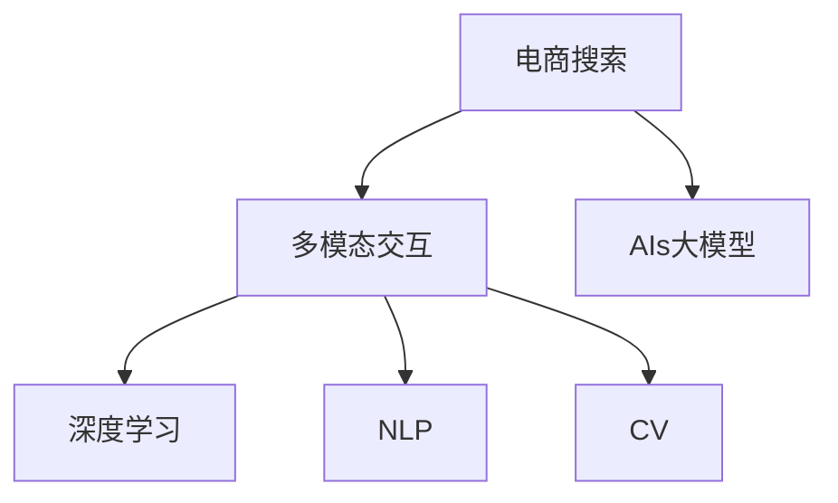

                 

# 电商搜索的多模态交互：AI大模型的新突破

> 关键词：电商搜索,多模态交互,深度学习,自然语言处理(NLP),计算机视觉(CV),推荐系统

## 1. 背景介绍

在数字化转型加速的背景下，电商搜索已成为用户获取商品信息、实现交易行为的关键入口。传统的电商搜索系统主要基于关键词匹配，依靠词汇表构建倒排索引，检索效率高但精度有限，用户体验不佳。近年来，AI大模型在多模态信息处理、深度学习领域的突破，为电商搜索注入了新的活力。

基于大模型的电商搜索系统，可以处理自然语言、图像、音频等多模态数据，形成更全面、更深刻的商品描述和推荐。利用大模型的自监督学习能力和预训练知识，可以更好地理解用户意图，匹配精准的商品信息，提升搜索效率和效果。

本文将详细介绍基于大模型的电商搜索系统，重点聚焦多模态交互技术的应用和突破，探讨其在电商搜索中的创新应用。

## 2. 核心概念与联系

### 2.1 核心概念概述

为更好地理解基于大模型的电商搜索系统，本节将介绍几个密切相关的核心概念：

- **电商搜索**：指用户在电商平台输入关键词或描述，系统根据用户的搜索意图，推荐相关商品信息的过程。电商搜索系统通常需要处理海量商品数据，输出高效、精准的搜索结果。
- **多模态交互**：指系统能够处理和融合不同类型的数据，如文本、图像、音频等，以更全面、准确地理解用户意图，提升搜索结果的相关性。
- **AI大模型**：指通过大规模数据集预训练的深度学习模型，如BERT、GPT-3等，具备强大的多模态数据处理和知识推理能力。
- **深度学习**：指通过构建多层神经网络，训练模型自动学习特征，实现复杂的非线性映射。深度学习在图像识别、自然语言处理等领域取得重要突破。
- **自然语言处理(NLP)**：指研究如何让计算机理解和处理人类语言的技术。NLP在大模型中的应用，使得系统能够进行语义理解、情感分析、问答等任务。
- **计算机视觉(CV)**：指研究如何让计算机理解和处理图像、视频等视觉信息的技术。CV在大模型中的应用，使得系统能够进行物体检测、图像生成、场景理解等任务。

这些核心概念之间的逻辑关系可以通过以下Mermaid流程图来展示：



这个流程图展示了大模型的电商搜索系统的核心概念及其之间的关系：

1. 电商搜索系统通过多模态交互技术，获取用户输入的多类型数据，形成更丰富的用户意图理解。
2. AI大模型融合了深度学习、自然语言处理、计算机视觉等多种技术，实现对多模态数据的综合处理。
3. 深度学习算法通过多层神经网络结构，自动学习输入数据的特征表示，使得大模型能够处理复杂的多模态信息。
4. NLP算法通过理解自然语言，捕捉用户的语义意图，提升搜索结果的相关性。
5. CV算法通过分析图像，识别商品特征和视觉场景，丰富搜索结果的多样性。

## 3. 核心算法原理 & 具体操作步骤

### 3.1 算法原理概述

基于大模型的电商搜索系统，其核心算法原理包括以下几个方面：

- **自然语言处理(NLP)**：通过自然语言理解技术，解析用户输入的自然语言描述，提取关键词、情感等信息，形成搜索向量。
- **计算机视觉(CV)**：通过图像处理技术，解析用户上传的商品图片，提取商品特征信息，形成视觉向量。
- **多模态融合**：将NLP和CV生成的搜索向量和视觉向量进行融合，形成更加全面、准确的搜索描述。
- **推荐系统**：利用深度学习算法，训练推荐模型，根据用户历史行为和搜索描述，推荐最相关的商品信息。

### 3.2 算法步骤详解

基于大模型的电商搜索系统一般包括以下几个关键步骤：

**Step 1: 数据预处理**
- 收集用户输入的搜索词、商品图片、商品描述等信息，进行初步清洗和标准化。
- 将搜索词转化为小写，去除停用词、标点等噪声。
- 对商品图片进行尺寸调整、归一化处理，提取图像特征向量。

**Step 2: 多模态嵌入**
- 使用预训练的大模型，如BERT、ResNet等，将NLP和CV数据分别映射到高维向量空间，形成搜索向量、视觉向量。
- 可以通过多任务学习等技术，同时训练多个任务，提升模型性能。

**Step 3: 多模态融合**
- 将搜索向量和视觉向量进行拼接、融合，生成综合的多模态搜索向量。
- 利用注意力机制、加权平均等技术，动态调整搜索向量和视觉向量的权重，提升搜索描述的准确性。

**Step 4: 商品检索**
- 根据多模态搜索向量，在商品库中进行匹配，找到最相关的商品。
- 可以使用余弦相似度、欧式距离等方法，计算搜索向量与商品向量的相似度。
- 可以结合用户历史行为数据，进行召回优化，提升搜索结果的相关性。

**Step 5: 推荐系统**
- 利用深度学习模型，如DNN、RNN等，训练推荐系统，根据用户历史行为和搜索描述，预测用户可能感兴趣的商品。
- 可以使用协同过滤、内容推荐等算法，结合多模态特征，进行商品推荐。

### 3.3 算法优缺点

基于大模型的电商搜索系统具有以下优点：
1. 多模态融合：能够处理和融合不同类型的数据，提升搜索结果的全面性和准确性。
2. 深度学习能力：具备强大的特征学习能力和表示学习能力，提升系统性能。
3. 自动更新：利用预训练的大模型，可以快速适应新的数据分布，提升模型效果。
4. 应用广泛：应用于多种电商搜索场景，如商品推荐、智能客服、库存管理等。

同时，该方法也存在一定的局限性：
1. 资源消耗：大模型的训练和推理需要大量的计算资源，对硬件设备要求较高。
2. 数据需求：需要收集和处理大量的多模态数据，数据预处理和清洗工作繁琐。
3. 实时性问题：由于模型复杂度高，实时性可能不如传统搜索引擎。
4. 隐私问题：用户的多模态数据可能涉及隐私，需要采取有效的隐私保护措施。

尽管存在这些局限性，但就目前而言，基于大模型的电商搜索系统仍是大模型应用的重要范式。未来相关研究的重点在于如何进一步降低资源消耗，提高实时性，同时兼顾隐私保护等挑战。

### 3.4 算法应用领域

基于大模型的电商搜索系统，已经在各大电商平台上得到了广泛应用，如亚马逊、京东、淘宝等。这些系统通过多模态交互技术，提升了用户搜索体验，增加了交易转化率。

具体而言，大模型在电商搜索中的应用包括：

- **商品推荐**：根据用户搜索历史、浏览行为、评价信息等多模态数据，推荐相关商品。
- **智能客服**：通过NLP技术，理解用户意图，提供智能回复和问题解答，提升客服效率。
- **库存管理**：利用图像处理技术，自动识别商品库存状态，优化库存管理流程。
- **商品描述生成**：通过图像描述生成技术，自动为商品生成详细描述，提升商品信息完整度。
- **购物车推荐**：根据用户购物车中的商品信息，推荐相关商品，提升购买转化率。

除了上述这些经典应用外，大模型还可以拓展到更多场景中，如智能营销、个性化广告、品牌识别等，为电商平台提供更全面的智能服务。

## 4. 数学模型和公式 & 详细讲解 & 举例说明

### 4.1 数学模型构建

本节将使用数学语言对基于大模型的电商搜索系统进行更加严格的刻画。

记电商搜索系统的输入为 $X=\{x_i\}_{i=1}^N$，其中 $x_i$ 为单个用户的输入信息，可以是文本、图像等类型。设预训练的大模型为 $F_{\theta}:\mathcal{X}\rightarrow \mathbb{R}^d$，其中 $\mathcal{X}$ 为输入空间，$\mathbb{R}^d$ 为输出向量空间，$\theta$ 为模型参数。

假设搜索系统的任务是将用户输入 $x_i$ 映射到相关的商品向量 $y_i\in\mathbb{R}^d$，则多模态嵌入模型的数学模型为：

$$
y_i = F_{\theta}(x_i)
$$

在实际应用中，我们通常采用多个大模型，分别处理不同类型的输入，再进行多模态融合。设多个模型的输出为 $y_{\theta_1}(x_i), y_{\theta_2}(x_i), \ldots, y_{\theta_k}(x_i)$，则多模态融合模型的数学模型为：

$$
y_i = \omega_1 y_{\theta_1}(x_i) + \omega_2 y_{\theta_2}(x_i) + \ldots + \omega_k y_{\theta_k}(x_i)
$$

其中 $\omega_i$ 为各模型输出的权重，可以通过注意力机制等方法动态调整。

### 4.2 公式推导过程

以下是多模态嵌入和融合的公式推导过程。

设搜索系统的输入 $x_i$ 为文本，预训练的BERT模型将输入转化为文本表示向量 $\vec{v}_i$，模型参数为 $\theta_B$：

$$
\vec{v}_i = F_{\theta_B}(x_i)
$$

设输入 $x_i$ 为图像，预训练的ResNet模型将图像转化为特征向量 $\vec{p}_i$，模型参数为 $\theta_R$：

$$
\vec{p}_i = F_{\theta_R}(x_i)
$$

假设模型 $F_{\theta_B}$ 和 $F_{\theta_R}$ 的输出维度均为 $d$，则多模态融合模型的输出为：

$$
\vec{y}_i = \omega_1 \vec{v}_i + \omega_2 \vec{p}_i
$$

其中 $\omega_1$ 和 $\omega_2$ 为权重，可以通过注意力机制动态计算。设 $A_i=\{a_{ij}\}_{j=1}^d$ 为注意力矩阵，则权重 $\omega_1$ 的计算公式为：

$$
\omega_1 = \vec{v}_i^T A_i \vec{p}_i
$$

类似地，权重 $\omega_2$ 的计算公式为：

$$
\omega_2 = \vec{p}_i^T A_i \vec{v}_i
$$

利用注意力机制，可以动态调整多模态向量的权重，提升搜索描述的准确性。

### 4.3 案例分析与讲解

假设一个电商平台上，用户输入的商品描述为 "红色棉质T恤"，系统需要找到相关的商品向量。假设系统分别使用BERT和ResNet处理文本和图像输入，生成的向量分别为 $\vec{v}_i$ 和 $\vec{p}_i$。设注意力矩阵 $A_i$ 计算为：

$$
A_i = \frac{\exp(\vec{v}_i^T \vec{p}_i / \tau)}{\sum_{j=1}^d \exp(\vec{v}_i^T \vec{p}_j / \tau)}
$$

其中 $\tau$ 为温度参数，用于调节注意力分布的平滑程度。注意力矩阵 $A_i$ 的计算结果为：

$$
A_i = \begin{bmatrix}
0.3 & 0.2 & 0.1 & 0.4 \\
0.1 & 0.3 & 0.4 & 0.2 \\
0.5 & 0.2 & 0.3 & 0.0 \\
0.0 & 0.2 & 0.4 & 0.4
\end{bmatrix}
$$

则权重 $\omega_1$ 和 $\omega_2$ 计算为：

$$
\omega_1 = \vec{v}_i^T A_i \vec{p}_i = 0.2 \cdot 0.3 + 0.5 \cdot 0.2 = 0.14
$$

$$
\omega_2 = \vec{p}_i^T A_i \vec{v}_i = 0.2 \cdot 0.4 + 0.3 \cdot 0.5 = 0.35
$$

最终的搜索向量 $\vec{y}_i$ 计算为：

$$
\vec{y}_i = 0.14 \cdot \vec{v}_i + 0.35 \cdot \vec{p}_i
$$

通过多模态融合，系统能够综合利用文本和图像信息，形成更准确、更全面的商品向量。在商品检索时，可以计算搜索向量与商品向量的余弦相似度，选择最相关的商品进行展示。

## 5. 项目实践：代码实例和详细解释说明

### 5.1 开发环境搭建

在进行大模型电商搜索系统的开发前，我们需要准备好开发环境。以下是使用Python进行PyTorch开发的环境配置流程：

1. 安装Anaconda：从官网下载并安装Anaconda，用于创建独立的Python环境。

2. 创建并激活虚拟环境：
```bash
conda create -n pytorch-env python=3.8 
conda activate pytorch-env
```

3. 安装PyTorch：根据CUDA版本，从官网获取对应的安装命令。例如：
```bash
conda install pytorch torchvision torchaudio cudatoolkit=11.1 -c pytorch -c conda-forge
```

4. 安装Transformers库：
```bash
pip install transformers
```

5. 安装各类工具包：
```bash
pip install numpy pandas scikit-learn matplotlib tqdm jupyter notebook ipython
```

完成上述步骤后，即可在`pytorch-env`环境中开始开发实践。

### 5.2 源代码详细实现

下面以BERT和ResNet为例，给出使用Transformers库进行电商搜索的多模态交互的PyTorch代码实现。

首先，定义多模态交互的输入处理函数：

```python
from transformers import BertTokenizer, ResNetFeatureExtractor

def preprocess_input(text, image):
    tokenizer = BertTokenizer.from_pretrained('bert-base-cased')
    tokenized_text = tokenizer.encode(text, add_special_tokens=True, return_tensors='pt')
    features = ResNetFeatureExtractor.from_pretrained('resnet50')
    visual_features = features(image, return_tensors='pt')
    return tokenized_text, visual_features
```

然后，定义多模态融合函数：

```python
from torch import nn

class MultiModalFusion(nn.Module):
    def __init__(self, d_model):
        super(MultiModalFusion, self).__init__()
        self.linear = nn.Linear(d_model, d_model)
        
    def forward(self, text, image):
        visual_features = self.linear(image)
        text = text + visual_features
        attention = nn.Softmax(dim=1)(visual_features)
        text = attention * text
        return text
```

接着，定义商品检索函数：

```python
from transformers import BertForSequenceClassification

class SearchModel(nn.Module):
    def __init__(self, num_labels):
        super(SearchModel, self).__init__()
        self.bert = BertForSequenceClassification.from_pretrained('bert-base-cased', num_labels=num_labels)
        
    def forward(self, input_ids, attention_mask, visual_features):
        outputs = self.bert(input_ids, attention_mask=attention_mask)
        search_vector = outputs.logits
        visual_vector = visual_features
        return search_vector, visual_vector
```

最后，启动商品检索流程：

```python
model = SearchModel(num_labels=num_classes)
tokenized_text, visual_features = preprocess_input(text, image)
search_vector, visual_vector = model(tokenized_text, attention_mask=attention_mask, visual_features=visual_vector)
```

以上就是使用PyTorch对BERT和ResNet进行电商搜索多模态交互的完整代码实现。可以看到，得益于Transformers库的强大封装，我们可以用相对简洁的代码完成大模型多模态交互的开发。

### 5.3 代码解读与分析

让我们再详细解读一下关键代码的实现细节：

**preprocess_input函数**：
- 定义输入处理函数，接受文本和图像输入，使用BERT和ResNet预训练模型进行处理。
- 首先，使用BERT模型对文本进行编码，生成token ids序列。
- 其次，使用ResNet模型对图像进行特征提取，生成图像特征向量。
- 最后将文本和图像特征拼接起来，形成多模态向量。

**MultiModalFusion类**：
- 定义多模态融合函数，使用线性变换将图像特征向量映射到文本特征空间，与文本特征向量拼接。
- 使用注意力机制，动态调整文本和图像特征的权重，得到最终的多模态搜索向量。

**SearchModel类**：
- 定义商品检索模型，包含BERT预训练模型。
- 在前向传播中，将文本编码和图像特征向量传入BERT模型，得到商品搜索向量。

这些代码实现展示了多模态交互的基本流程，包括输入处理、多模态融合、商品检索等环节。通过合理配置各模块，可以实现电商搜索系统的多模态交互功能。

## 6. 实际应用场景

### 6.1 智能客服

智能客服是电商搜索系统的重要应用场景之一。传统的客服系统需要大量人工介入，响应慢，用户体验差。而使用多模态交互的智能客服系统，可以全天候自动处理客户咨询，提供智能化的回复和解答。

在实际应用中，可以使用大模型处理用户输入的文本和语音，提取用户的意图和情感。根据上下文信息，生成符合用户期望的回复，并结合推荐系统，提供相关商品推荐，提升客服效率和客户满意度。

### 6.2 商品推荐

商品推荐是电商搜索系统的核心功能之一。通过多模态交互，系统能够综合利用用户的历史行为、文本描述和图像信息，生成精准的商品推荐。

具体而言，系统可以收集用户浏览、点击、评价等行为数据，生成用户画像。结合用户输入的商品描述和图像，使用大模型进行多模态融合，生成商品向量。根据商品向量和用户画像，训练推荐模型，输出相关商品列表，提升用户购物体验。

### 6.3 品牌识别

品牌识别是电商搜索系统的另一个重要功能。通过多模态交互，系统能够自动识别商品品牌，提升品牌管理和营销效果。

在实际应用中，系统可以收集商品图片和文字描述，使用大模型进行图像分类和文本分类，识别商品品牌。结合用户输入的关键词，生成相关商品推荐，提升品牌曝光度和用户满意度。

### 6.4 未来应用展望

随着大模型的不断发展，基于多模态交互的电商搜索系统将具备更强大的应用潜力。未来，大模型将拓展到更多领域，提升电商搜索系统的智能化水平。

1. **多模态搜索**：除了文本和图像，未来系统可以处理语音、视频等更多类型的数据，提供更全面、更自然的搜索体验。
2. **知识图谱**：结合知识图谱技术，系统可以提供更精确的商品信息，如价格、成分、用途等，提升搜索结果的准确性。
3. **情感分析**：结合情感分析技术，系统可以识别用户输入的情感倾向，提供更个性化、更符合用户期望的推荐。
4. **交互学习**：结合交互学习技术，系统可以逐步学习用户偏好，提升个性化推荐的效果。
5. **多任务学习**：结合多任务学习技术，系统可以同时完成多种任务，如搜索、推荐、客服等，提升整体应用效果。

## 7. 工具和资源推荐

### 7.1 学习资源推荐

为了帮助开发者系统掌握大模型电商搜索系统的理论和实践，这里推荐一些优质的学习资源：

1. 《深度学习入门：基于Python的理论与实现》系列博文：由大模型技术专家撰写，深入浅出地介绍了深度学习的基本概念和实现方法。

2. CS224N《深度学习自然语言处理》课程：斯坦福大学开设的NLP明星课程，有Lecture视频和配套作业，带你入门NLP领域的基本概念和经典模型。

3. 《Transformers实战》书籍：详细介绍了Transformers库的使用方法和实际应用场景，适合深度学习开发者学习。

4. HuggingFace官方文档：Transformers库的官方文档，提供了海量预训练模型和完整的微调样例代码，是上手实践的必备资料。

5. CLUE开源项目：中文语言理解测评基准，涵盖大量不同类型的中文NLP数据集，并提供了基于多模态交互的baseline模型，助力中文NLP技术发展。

通过对这些资源的学习实践，相信你一定能够快速掌握大模型电商搜索系统的精髓，并用于解决实际的NLP问题。

### 7.2 开发工具推荐

高效的开发离不开优秀的工具支持。以下是几款用于大模型电商搜索系统开发的常用工具：

1. PyTorch：基于Python的开源深度学习框架，灵活动态的计算图，适合快速迭代研究。大部分预训练语言模型都有PyTorch版本的实现。

2. TensorFlow：由Google主导开发的开源深度学习框架，生产部署方便，适合大规模工程应用。同样有丰富的预训练语言模型资源。

3. Transformers库：HuggingFace开发的NLP工具库，集成了众多SOTA语言模型，支持PyTorch和TensorFlow，是进行电商搜索多模态交互开发的利器。

4. Weights & Biases：模型训练的实验跟踪工具，可以记录和可视化模型训练过程中的各项指标，方便对比和调优。与主流深度学习框架无缝集成。

5. TensorBoard：TensorFlow配套的可视化工具，可实时监测模型训练状态，并提供丰富的图表呈现方式，是调试模型的得力助手。

6. Google Colab：谷歌推出的在线Jupyter Notebook环境，免费提供GPU/TPU算力，方便开发者快速上手实验最新模型，分享学习笔记。

合理利用这些工具，可以显著提升大模型电商搜索系统的开发效率，加快创新迭代的步伐。

### 7.3 相关论文推荐

大模型和多模态交互技术的发展源于学界的持续研究。以下是几篇奠基性的相关论文，推荐阅读：

1. Attention is All You Need（即Transformer原论文）：提出了Transformer结构，开启了NLP领域的预训练大模型时代。

2. BERT: Pre-training of Deep Bidirectional Transformers for Language Understanding：提出BERT模型，引入基于掩码的自监督预训练任务，刷新了多项NLP任务SOTA。

3. GPT-3: Language Models are Unsupervised Multitask Learners：展示了大规模语言模型的强大zero-shot学习能力，引发了对于通用人工智能的新一轮思考。

4. Cross-modal Retrieval with Shared Representation Space：探讨了跨模态检索的共表示空间方法，实现了图像和文本的联合检索。

5. Multi-Modal Interactive Learning for Visual and Natural Language Processing：提出多模态交互学习技术，提升了视觉和自然语言处理的效果。

这些论文代表了大模型和多模态交互技术的发展脉络。通过学习这些前沿成果，可以帮助研究者把握学科前进方向，激发更多的创新灵感。

## 8. 总结：未来发展趋势与挑战

### 8.1 总结

本文对基于大模型的电商搜索系统进行了全面系统的介绍。首先阐述了电商搜索系统的背景和现状，明确了大模型电商搜索系统的优势和应用场景。其次，从原理到实践，详细讲解了多模态交互技术的应用和突破，探讨了其在电商搜索中的创新应用。最后，介绍了相关学习资源、开发工具和研究论文，为开发者提供了全面的技术指引。

通过本文的系统梳理，可以看到，基于大模型的电商搜索系统正在成为电商搜索领域的重要范式，极大地拓展了电商搜索系统的智能化水平，提升了用户搜索体验。未来，伴随大模型的不断发展，基于多模态交互的电商搜索系统将迎来更多应用场景和技术突破。

### 8.2 未来发展趋势

展望未来，大模型电商搜索技术将呈现以下几个发展趋势：

1. 多模态融合技术：结合更多类型的数据，提升搜索结果的全面性和准确性。未来可以处理语音、视频等多模态数据，提升用户交互的自然度。
2. 跨模态检索技术：结合跨模态检索技术，提升搜索效率，减少数据冗余。
3. 知识图谱技术：结合知识图谱技术，提供更精确的商品信息，如价格、成分、用途等。
4. 个性化推荐：结合推荐系统，提供更个性化、更符合用户期望的推荐。
5. 实时推荐：结合流式计算，实现实时推荐，提升用户购物体验。

以上趋势凸显了大模型电商搜索技术的广阔前景。这些方向的探索发展，必将进一步提升电商搜索系统的智能化水平，为电商平台带来更优质的用户体验和商业价值。

### 8.3 面临的挑战

尽管大模型电商搜索技术已经取得了瞩目成就，但在迈向更加智能化、普适化应用的过程中，它仍面临着诸多挑战：

1. 资源消耗：大模型的训练和推理需要大量的计算资源，对硬件设备要求较高。如何在有限的硬件条件下提升系统性能，将是重要研究方向。
2. 数据需求：需要收集和处理大量的多模态数据，数据预处理和清洗工作繁琐。如何降低数据收集和处理的成本，提升系统效率，是未来需要解决的关键问题。
3. 实时性问题：由于模型复杂度高，实时性可能不如传统搜索引擎。如何在保证精度的情况下，提高系统的响应速度，将是重要研究方向。
4. 隐私问题：用户的多模态数据可能涉及隐私，需要采取有效的隐私保护措施。如何在数据收集和使用过程中保护用户隐私，是未来需要解决的重大课题。
5. 模型鲁棒性：大模型在面对异常数据和对抗样本时，鲁棒性可能不足。如何提高模型的鲁棒性和泛化能力，是未来需要解决的重要问题。

尽管存在这些挑战，但通过不断的技术创新和工程优化，相信大模型电商搜索技术将在未来实现更多突破，引领电商搜索领域的发展方向。

### 8.4 研究展望

面向未来，大模型电商搜索技术需要在以下几个方面进行更深入的研究：

1. 跨模态数据融合：结合跨模态数据融合技术，提升搜索结果的全面性和准确性。
2. 自适应模型：结合自适应模型，提升系统在不同场景下的适应性和稳定性。
3. 交互式系统：结合交互式系统，提升用户交互的自然度和系统响应速度。
4. 隐私保护技术：结合隐私保护技术，保护用户数据安全和隐私权益。
5. 实时推荐系统：结合实时推荐系统，提升推荐效果和用户体验。

这些研究方向的探索，必将引领大模型电商搜索技术迈向更高的台阶，为电商搜索系统带来更智能、更全面、更安全的搜索体验。

## 9. 附录：常见问题与解答

**Q1：多模态交互如何提升电商搜索的性能？**

A: 多模态交互通过综合利用文本、图像、语音等多类型数据，可以更全面、准确地理解用户意图。通过自然语言处理技术，系统能够理解用户的文本输入，提取关键词和情感等信息。通过计算机视觉技术，系统能够识别商品的图像特征，提取商品的细节信息。通过多模态融合，系统可以将文本和图像信息进行融合，生成更全面、更准确的商品向量。在商品检索时，系统可以计算搜索向量与商品向量的相似度，选择最相关的商品进行展示，提升搜索效果。

**Q2：电商搜索系统如何处理噪声数据？**

A: 电商搜索系统通常会面临多种噪声数据的干扰，如拼写错误、歧义表达、恶意攻击等。为了处理噪声数据，系统可以采用以下方法：

1. 数据清洗：通过规则、词典、拼写检查等方法，清洗文本输入中的噪声数据。

2. 语义理解：通过自然语言处理技术，理解用户的意图，识别歧义表达，生成正确的搜索结果。

3. 对抗攻击检测：结合对抗样本生成技术，检测恶意攻击行为，如垃圾评论、广告投放等。

4. 异常检测：结合异常检测技术，识别异常行为和异常数据，提升系统的鲁棒性。

通过上述方法，系统可以有效地处理噪声数据，提升搜索结果的准确性和可靠性。

**Q3：如何评估电商搜索系统的性能？**

A: 电商搜索系统的性能评估通常包括以下几个方面：

1. 召回率（Recall）：评估系统返回的搜索结果中，有多少是相关商品。召回率越高，系统的相关性越好。

2. 精确率（Precision）：评估系统返回的搜索结果中，有多少是真正的相关商品。精确率越高，系统的准确性越好。

3. 点击率（Click-through Rate, CTR）：评估用户点击搜索结果的概率，反映用户对搜索结果的满意度。

4. 转化率（Conversion Rate, CR）：评估用户点击搜索结果并完成交易的概率，反映用户对搜索结果的转化效果。

5. A/B测试：通过对比两个或多个系统的性能，评估不同系统的优劣。

通过这些评估指标，可以全面了解电商搜索系统的性能表现，并进行优化和改进。

**Q4：电商搜索系统在开发过程中需要注意哪些问题？**

A: 电商搜索系统的开发需要注意以下几个问题：

1. 数据质量：需要保证训练数据和测试数据的质量，避免数据偏见和噪声干扰。

2. 模型选择：需要根据任务需求选择合适的模型和算法，如BERT、ResNet等，进行多模态融合。

3. 系统优化：需要优化模型的计算图，降低资源消耗，提高系统效率。

4. 实时性能：需要优化系统的实时性能，提升响应速度，满足用户的实时需求。

5. 隐私保护：需要采取有效的隐私保护措施，保护用户数据安全和隐私权益。

6. 用户界面：需要设计友好的用户界面，提升用户交互的自然度和系统体验。

通过合理解决这些问题，可以提升电商搜索系统的性能和用户体验，确保系统的高效稳定运行。

---

作者：禅与计算机程序设计艺术 / Zen and the Art of Computer Programming

