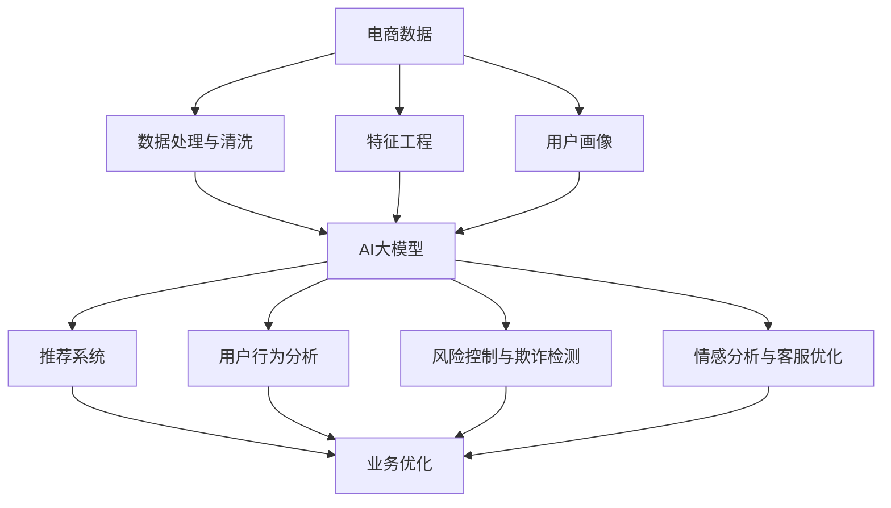

                 

# 电商数据分析的新纪元：AI大模型的洞察力

> 关键词：电商数据分析, AI大模型, 数据挖掘, 机器学习, 推荐系统, 用户行为分析, 模型优化

## 1. 背景介绍

### 1.1 问题由来
电商行业作为全球最大的互联网产业之一，其数据量之巨大、数据类型之复杂、数据流之快速，为数据科学工作者提供了极大的挑战。传统的数据分析方法，如统计分析、数据挖掘等，往往难以全面深入地理解数据背后的潜力和趋势。而新兴的AI大模型，特别是深度学习模型的广泛应用，为电商数据分析带来了全新的视角和手段。

在过去几年里，深度学习模型在电商领域的成功应用，引发了广泛关注。例如，基于深度神经网络的推荐系统，通过学习用户行为和商品特征，提升了用户体验和销售转化率；自然语言处理(NLP)技术，对用户评论和反馈进行情感分析，帮助商家更好地理解用户需求；计算机视觉(CV)技术，对商品图片进行分类和识别，提高了搜索的精准度和效率。

本文将深入探讨如何利用AI大模型在电商数据分析中的洞察力，通过数据分析挖掘用户行为和市场趋势，为企业决策提供支持，推动电商行业的数字化转型。

### 1.2 问题核心关键点
在电商数据分析中，AI大模型的应用主要聚焦于以下几个核心关键点：
1. **数据处理与特征工程**：电商数据通常包含大规模、高维度的特征，通过大模型实现有效的特征提取和降维，提升模型的性能。
2. **推荐系统优化**：电商领域的主要应用之一是推荐系统，通过大模型优化用户画像和推荐策略，提升推荐效果。
3. **用户行为分析**：利用大模型进行用户行为预测和分析，挖掘深层次的消费模式和趋势。
4. **风险控制与欺诈检测**：电商平台面临诸多风险，通过大模型检测和防范潜在的欺诈行为。
5. **情感分析与客服优化**：通过NLP技术分析用户评论和反馈，优化客户服务流程。

### 1.3 问题研究意义
研究AI大模型在电商数据分析中的应用，对于推动电商行业的数字化转型具有重要意义：

1. **提高决策效率与精准度**：大模型可以快速处理和分析海量电商数据，挖掘深层次的业务洞察，支持企业决策。
2. **增强用户体验与满意度**：通过推荐系统个性化推荐商品，提高用户满意度和留存率。
3. **优化运营效率与成本**：大模型自动化数据分析，减少人工干预，提升运营效率。
4. **防范风险与欺诈**：及时发现和防范欺诈行为，保障平台安全与利益。
5. **促进技术创新与应用**：大模型的应用推动了NLP、CV等前沿技术在电商行业的普及，为电商创新提供了新动力。

## 2. 核心概念与联系

### 2.1 核心概念概述

为更好地理解AI大模型在电商数据分析中的应用，本节将介绍几个密切相关的核心概念：

- **电商数据分析**：通过数据挖掘、机器学习等技术，从电商数据中提取有价值的信息，支持业务决策。
- **AI大模型**：以深度神经网络为代表的大规模预训练模型，通过在特定任务上的微调，能够高效地处理和分析电商数据。
- **推荐系统**：通过分析用户行为和商品特征，向用户推荐可能感兴趣的商品，提升用户满意度和销售转化率。
- **用户画像**：通过对用户行为数据的分析，构建详细的用户画像，进行个性化推荐和服务。
- **自然语言处理(NLP)**：分析文本数据，如用户评论、产品描述，提取情感、主题等信息，优化电商运营。
- **计算机视觉(CV)**：处理图像和视频数据，如商品图片、视频展示，提高搜索与推荐系统的准确性。
- **模型优化**：通过算法优化，提升模型的性能和效率，如超参数调优、正则化、损失函数等。

这些核心概念之间通过电商数据的收集、处理、分析和应用，形成一个有机整体，共同支撑电商数据分析的各个环节。

### 2.2 核心概念原理和架构的 Mermaid 流程图



此流程图展示了电商数据分析中各核心概念之间的联系与相互作用。

## 3. 核心算法原理 & 具体操作步骤

### 3.1 算法原理概述

AI大模型在电商数据分析中的应用，主要依赖于其在特定任务上的微调能力。以深度神经网络为例，常见的电商数据分析任务包括用户画像构建、推荐系统优化、用户行为分析等。微调过程通常包括以下几个关键步骤：

1. **数据准备**：收集电商数据，包括用户行为数据、商品信息数据等。
2. **特征提取**：通过AI大模型对电商数据进行特征提取和降维。
3. **模型微调**：在大模型上添加特定任务适配层，进行有监督学习，优化模型性能。
4. **结果评估**：使用测试集对微调后的模型进行评估，优化模型超参数。
5. **应用部署**：将微调后的模型部署到实际应用场景中，进行电商数据分析。

### 3.2 算法步骤详解

以推荐系统为例，以下是基于AI大模型进行推荐系统优化的详细步骤：

**Step 1: 准备电商数据**
- 收集用户行为数据，包括点击、浏览、购买记录等。
- 收集商品特征数据，包括商品名称、类别、价格等。

**Step 2: 特征工程**
- 对用户行为数据进行清洗、归一化、编码等处理。
- 对商品特征数据进行向量化表示。
- 使用PCA、LDA等降维技术，减少数据维度。

**Step 3: 模型微调**
- 选择适合的深度神经网络模型，如CNN、RNN等。
- 添加推荐系统的输出层，通常使用多分类交叉熵损失函数。
- 使用AdamW等优化算法，设置合适的学习率和正则化参数。
- 将处理后的数据划分为训练集、验证集和测试集，进行模型微调。

**Step 4: 结果评估**
- 在测试集上评估推荐系统的准确率、召回率、F1分数等指标。
- 调整超参数，如隐藏层大小、学习率等，优化模型性能。

**Step 5: 应用部署**
- 将微调后的模型集成到推荐系统中，实现个性化推荐。
- 监控推荐系统的性能，根据用户反馈进行迭代优化。

### 3.3 算法优缺点

AI大模型在电商数据分析中的应用具有以下优点：
1. **高效处理大规模数据**：大模型能够高效处理海量电商数据，挖掘深层次的业务洞察。
2. **提升推荐系统精准度**：通过微调，推荐系统可以更加精准地预测用户兴趣，提升转化率。
3. **多任务协同优化**：大模型可以同时优化多个电商数据分析任务，实现数据的全方位利用。

同时，大模型也存在以下局限性：
1. **计算资源需求高**：大规模数据和大模型对计算资源的需求较高，需要高性能的GPU/TPU设备。
2. **模型复杂度大**：大模型的复杂度较高，训练和推理过程较为耗时。
3. **模型解释性不足**：深度神经网络模型通常被称为"黑箱"，难以解释其内部工作机制。
4. **数据依赖性强**：模型性能高度依赖于数据质量，数据偏差可能导致模型失效。

### 3.4 算法应用领域

AI大模型在电商数据分析中的应用领域非常广泛，涵盖以下方面：

- **用户画像构建**：通过对用户行为数据进行分析，构建详细的用户画像，用于个性化推荐和服务。
- **推荐系统优化**：利用大模型提升推荐系统的准确性和多样性，增强用户体验。
- **用户行为分析**：通过分析用户行为数据，预测用户兴趣和需求，优化运营策略。
- **风险控制与欺诈检测**：利用大模型识别异常行为和欺诈行为，保障电商平台安全。
- **情感分析与客服优化**：通过NLP技术分析用户评论和反馈，优化客户服务流程。

## 4. 数学模型和公式 & 详细讲解 & 举例说明

### 4.1 数学模型构建

本节将使用数学语言对基于AI大模型的电商数据分析过程进行更加严格的刻画。

设电商数据集为 $D=\{(x_i, y_i)\}_{i=1}^N, x_i \in \mathbb{R}^d, y_i \in \mathbb{R}^k$，其中 $x_i$ 表示用户行为数据或商品特征数据，$y_i$ 表示标签或输出。

定义AI大模型为 $M_{\theta}:\mathbb{R}^d \rightarrow \mathbb{R}^k$，其中 $\theta \in \mathbb{R}^D$ 为模型参数。假设电商数据分析任务为 $T$，任务适配层为 $H$，任务输出为 $y_i$。

任务损失函数为：
$$
\mathcal{L}(\theta) = \frac{1}{N} \sum_{i=1}^N \ell(M_{\theta}(x_i), y_i)
$$
其中 $\ell$ 为特定任务的损失函数，如多分类交叉熵、均方误差等。

微调的目标是最小化任务损失函数，即找到最优参数：
$$
\theta^* = \mathop{\arg\min}_{\theta} \mathcal{L}(\theta)
$$

### 4.2 公式推导过程

以推荐系统为例，假设模型 $M_{\theta}$ 对用户行为数据 $x$ 进行编码，得到特征表示 $h = M_{\theta}(x)$。假设推荐系统的输出为 $y \in \{1, 2, ..., K\}$，其中 $K$ 为推荐结果的种类数。

推荐系统的损失函数为：
$$
\ell(y, y_i) = -\log\left(\frac{\exp(y_i)}{\sum_{j=1}^K \exp(y_j)}\right)
$$

将 $h$ 输入到适配层 $H$ 中，得到输出 $z = H(h)$。根据输出 $z$ 和标签 $y$，计算损失函数：
$$
\mathcal{L}(\theta) = \frac{1}{N} \sum_{i=1}^N \ell(y_i, z_i)
$$

其中 $z_i$ 表示模型在样本 $x_i$ 上的输出。

根据链式法则，损失函数对模型参数 $\theta$ 的梯度为：
$$
\frac{\partial \mathcal{L}(\theta)}{\partial \theta} = \frac{\partial \ell(y_i, z_i)}{\partial z_i} \frac{\partial z_i}{\partial \theta}
$$

其中 $\frac{\partial \ell(y_i, z_i)}{\partial z_i}$ 为交叉熵损失对 $z_i$ 的梯度，$\frac{\partial z_i}{\partial \theta}$ 为适配层对 $h$ 的梯度，可通过反向传播算法计算。

在得到损失函数的梯度后，即可带入参数更新公式，完成模型的迭代优化。重复上述过程直至收敛，最终得到适应电商数据分析任务的最优模型参数 $\theta^*$。

### 4.3 案例分析与讲解

假设电商推荐系统需要对用户行为数据进行预测，模型结构为 $M_{\theta} = [Embedding Layer, FNN, Output Layer]$。其中，Embedding Layer 用于将用户行为数据 $x$ 编码为向量表示 $h$，FNN 为全连接神经网络，Output Layer 为推荐结果输出层。

设Embedding Layer的维度为 $d$，FNN的隐藏层大小为 $m$，输出层大小为 $k$。则模型结构如图：

```mermaid
graph LR
    Subgraph Embedding Layer
        A(x) --> B[h]
    End
    Subgraph FNN
        B(h) --> C[h]
    End
    Subgraph Output Layer
        C[h] --> D[y]
    End
    A --> D
```

在训练过程中，先通过Embedding Layer将用户行为数据 $x$ 转换为向量表示 $h$，然后将其输入FNN进行特征提取，最后通过Output Layer输出推荐结果 $y$。

使用交叉熵损失函数，设推荐系统在样本 $x_i$ 上的输出为 $y_i$，则损失函数为：
$$
\ell(y_i, y) = -\log\left(\frac{\exp(y_i)}{\sum_{j=1}^K \exp(y_j)}\right)
$$

适配层的输出为：
$$
z = H(h) = W_1h + b_1
$$

其中 $W_1$ 为适配层的权重，$b_1$ 为偏置项。适配层的梯度为：
$$
\frac{\partial z_i}{\partial \theta} = \frac{\partial \ell(y_i, z_i)}{\partial z_i} \frac{\partial z_i}{\partial \theta}
$$

其中 $\frac{\partial \ell(y_i, z_i)}{\partial z_i}$ 可通过反向传播算法计算。

通过上述公式，即可计算损失函数对模型参数 $\theta$ 的梯度，进行模型优化。

## 5. 项目实践：代码实例和详细解释说明

### 5.1 开发环境搭建

在进行电商数据分析的AI大模型微调实践前，我们需要准备好开发环境。以下是使用Python进行PyTorch开发的环境配置流程：

1. 安装Anaconda：从官网下载并安装Anaconda，用于创建独立的Python环境。

2. 创建并激活虚拟环境：
```bash
conda create -n ecommerce-env python=3.8 
conda activate ecommerce-env
```

3. 安装PyTorch：根据CUDA版本，从官网获取对应的安装命令。例如：
```bash
conda install pytorch torchvision torchaudio cudatoolkit=11.1 -c pytorch -c conda-forge
```

4. 安装Transformers库：
```bash
pip install transformers
```

5. 安装各类工具包：
```bash
pip install numpy pandas scikit-learn matplotlib tqdm jupyter notebook ipython
```

完成上述步骤后，即可在`ecommerce-env`环境中开始微调实践。

### 5.2 源代码详细实现

下面以电商推荐系统为例，给出使用Transformers库对BERT模型进行微调的PyTorch代码实现。

首先，定义电商推荐系统的数据处理函数：

```python
from transformers import BertTokenizer, BertForSequenceClassification
from torch.utils.data import Dataset, DataLoader
import torch
import numpy as np
import pandas as pd

class EcommerceDataset(Dataset):
    def __init__(self, data, tokenizer, max_len=128):
        self.data = data
        self.tokenizer = tokenizer
        self.max_len = max_len
        
    def __len__(self):
        return len(self.data)
    
    def __getitem__(self, item):
        text = self.data.iloc[item]['text']
        label = self.data.iloc[item]['label']
        
        encoding = self.tokenizer(text, return_tensors='pt', max_length=self.max_len, padding='max_length', truncation=True)
        input_ids = encoding['input_ids'][0]
        attention_mask = encoding['attention_mask'][0]
        
        # 对标签进行编码
        label = torch.tensor(label, dtype=torch.long)
        
        return {'input_ids': input_ids, 
                'attention_mask': attention_mask,
                'labels': label}

# 数据准备
train_data = pd.read_csv('train.csv')
test_data = pd.read_csv('test.csv')
val_data = pd.read_csv('val.csv')

# 定义tokenizer
tokenizer = BertTokenizer.from_pretrained('bert-base-cased')

# 创建dataset
train_dataset = EcommerceDataset(train_data, tokenizer)
val_dataset = EcommerceDataset(val_data, tokenizer)
test_dataset = EcommerceDataset(test_data, tokenizer)
```

然后，定义模型和优化器：

```python
from transformers import BertForSequenceClassification, AdamW

model = BertForSequenceClassification.from_pretrained('bert-base-cased', num_labels=2)

optimizer = AdamW(model.parameters(), lr=2e-5)
```

接着，定义训练和评估函数：

```python
from tqdm import tqdm
from sklearn.metrics import accuracy_score, precision_recall_fscore_support

device = torch.device('cuda') if torch.cuda.is_available() else torch.device('cpu')
model.to(device)

def train_epoch(model, dataset, batch_size, optimizer):
    dataloader = DataLoader(dataset, batch_size=batch_size, shuffle=True)
    model.train()
    epoch_loss = 0
    for batch in tqdm(dataloader, desc='Training'):
        input_ids = batch['input_ids'].to(device)
        attention_mask = batch['attention_mask'].to(device)
        labels = batch['labels'].to(device)
        model.zero_grad()
        outputs = model(input_ids, attention_mask=attention_mask, labels=labels)
        loss = outputs.loss
        epoch_loss += loss.item()
        loss.backward()
        optimizer.step()
    return epoch_loss / len(dataloader)

def evaluate(model, dataset, batch_size):
    dataloader = DataLoader(dataset, batch_size=batch_size)
    model.eval()
    preds, labels = [], []
    with torch.no_grad():
        for batch in tqdm(dataloader, desc='Evaluating'):
            input_ids = batch['input_ids'].to(device)
            attention_mask = batch['attention_mask'].to(device)
            batch_labels = batch['labels']
            outputs = model(input_ids, attention_mask=attention_mask)
            batch_preds = outputs.logits.argmax(dim=1).to('cpu').tolist()
            batch_labels = batch_labels.to('cpu').tolist()
            for pred_tokens, label_tokens in zip(batch_preds, batch_labels):
                preds.append(pred_tokens[:len(label_tokens)])
                labels.append(label_tokens)
                
    print(f'Accuracy: {accuracy_score(labels, preds)}')
    print(f'Precision, Recall, F1-Score: {precision_recall_fscore_support(labels, preds, average='micro')}')
```

最后，启动训练流程并在测试集上评估：

```python
epochs = 5
batch_size = 16

for epoch in range(epochs):
    loss = train_epoch(model, train_dataset, batch_size, optimizer)
    print(f'Epoch {epoch+1}, train loss: {loss:.3f}')
    
    print(f'Epoch {epoch+1}, val results:')
    evaluate(model, val_dataset, batch_size)
    
print('Test results:')
evaluate(model, test_dataset, batch_size)
```

以上就是使用PyTorch对BERT进行电商推荐系统微调的完整代码实现。可以看到，得益于Transformers库的强大封装，我们可以用相对简洁的代码完成BERT模型的加载和微调。

### 5.3 代码解读与分析

让我们再详细解读一下关键代码的实现细节：

**EcommerceDataset类**：
- `__init__`方法：初始化数据集和tokenizer。
- `__len__`方法：返回数据集的样本数量。
- `__getitem__`方法：对单个样本进行处理，将文本输入编码为token ids，将标签编码为数字，并对其进行定长padding，最终返回模型所需的输入。

**数据准备**：
- 使用Pandas库读取电商数据集。
- 定义tokenizer，用于将文本转换为token ids。
- 创建训练集、验证集和测试集。

**模型和优化器**：
- 使用BertForSequenceClassification模型，指定输出层大小为2，表示二分类任务。
- 使用AdamW优化器，设置合适的学习率。

**训练和评估函数**：
- 使用PyTorch的DataLoader对数据集进行批次化加载，供模型训练和推理使用。
- 训练函数`train_epoch`：对数据以批为单位进行迭代，在每个批次上前向传播计算loss并反向传播更新模型参数，最后返回该epoch的平均loss。
- 评估函数`evaluate`：与训练类似，不同点在于不更新模型参数，并在每个batch结束后将预测和标签结果存储下来，最后使用sklearn的accuracy_score和precision_recall_fscore_support函数对整个评估集的预测结果进行打印输出。

**训练流程**：
- 定义总的epoch数和batch size，开始循环迭代
- 每个epoch内，先在训练集上训练，输出平均loss
- 在验证集上评估，输出准确率和各类指标
- 所有epoch结束后，在测试集上评估，给出最终测试结果

可以看到，PyTorch配合Transformers库使得BERT微调的代码实现变得简洁高效。开发者可以将更多精力放在数据处理、模型改进等高层逻辑上，而不必过多关注底层的实现细节。

当然，工业级的系统实现还需考虑更多因素，如模型的保存和部署、超参数的自动搜索、更灵活的任务适配层等。但核心的微调范式基本与此类似。

## 6. 实际应用场景

### 6.1 智能客服系统

基于AI大模型的电商数据分析，可以应用于智能客服系统的构建。传统客服往往需要配备大量人力，高峰期响应缓慢，且一致性和专业性难以保证。而使用电商数据分析中的AI大模型，可以7x24小时不间断服务，快速响应客户咨询，用自然流畅的语言解答各类常见问题。

在技术实现上，可以收集企业内部的历史客服对话记录，将问题和最佳答复构建成监督数据，在此基础上对预训练大模型进行微调。微调后的模型能够自动理解用户意图，匹配最合适的答案模板进行回复。对于客户提出的新问题，还可以接入检索系统实时搜索相关内容，动态组织生成回答。如此构建的智能客服系统，能大幅提升客户咨询体验和问题解决效率。

### 6.2 库存管理与物流优化

电商数据分析中的AI大模型可以应用于库存管理和物流优化。通过分析历史销售数据和市场趋势，预测商品的销售量和库存需求，优化库存管理和补货策略。同时，利用机器学习算法对物流数据进行分析，优化物流路线、车辆调度和配送时间，提高配送效率和降低配送成本。

### 6.3 价格优化与促销策略

电商平台通过电商数据分析中的AI大模型，可以实时监控市场价格和用户需求，自动调整商品价格和促销策略。通过分析用户行为数据，识别出不同用户群体的价格敏感度和购买意愿，精准制定促销活动。同时，利用AI大模型的预测能力，预测市场价格趋势，制定合理的价格策略，提升整体销售业绩。

### 6.4 风险控制与欺诈检测

电商平台面临诸多风险，如订单欺诈、价格作弊等。通过电商数据分析中的AI大模型，可以实时监控交易数据，识别出异常行为和潜在的欺诈行为。通过分析用户行为和交易数据，构建详细的用户画像和商品画像，提高风险识别和防范能力。同时，利用深度学习模型的特征提取能力，检测数据中的异常模式和特征，提前预警潜在的风险。

### 6.5 广告投放与精准营销

电商平台通过电商数据分析中的AI大模型，可以优化广告投放和精准营销策略。通过分析用户行为数据，识别出不同用户群体的兴趣和需求，精准推送相关广告。同时，利用AI大模型的预测能力，预测广告点击率和转化率，优化广告投放策略，提升广告效果和转化率。

## 7. 工具和资源推荐

### 7.1 学习资源推荐

为了帮助开发者系统掌握AI大模型在电商数据分析中的应用，这里推荐一些优质的学习资源：

1. 《深度学习》系列课程：由斯坦福大学开设，涵盖深度学习的基本概念、经典模型和应用。

2. 《自然语言处理》课程：由CMU开设，涵盖NLP的基本理论和技术，包括文本分类、情感分析、机器翻译等。

3. 《计算机视觉》课程：由斯坦福大学开设，涵盖CV的基本理论和技术，包括图像分类、目标检测、图像生成等。

4. 《Python深度学习》书籍：由Francois Chollet编写，介绍如何使用Keras实现深度学习模型，涵盖卷积神经网络、循环神经网络等。

5. 《TensorFlow实战Google AI》书籍：由Google团队编写，介绍TensorFlow的基本概念和技术，涵盖图像处理、自然语言处理、推荐系统等。

6. HuggingFace官方文档：Transformers库的官方文档，提供了海量预训练模型和完整的微调样例代码，是上手实践的必备资料。

通过对这些资源的学习实践，相信你一定能够快速掌握AI大模型在电商数据分析中的应用，并用于解决实际的电商问题。

### 7.2 开发工具推荐

高效的开发离不开优秀的工具支持。以下是几款用于AI大模型电商数据分析开发的常用工具：

1. PyTorch：基于Python的开源深度学习框架，灵活动态的计算图，适合快速迭代研究。大部分预训练语言模型都有PyTorch版本的实现。

2. TensorFlow：由Google主导开发的开源深度学习框架，生产部署方便，适合大规模工程应用。同样有丰富的预训练语言模型资源。

3. Transformers库：HuggingFace开发的NLP工具库，集成了众多SOTA语言模型，支持PyTorch和TensorFlow，是进行电商数据分析开发的利器。

4. Weights & Biases：模型训练的实验跟踪工具，可以记录和可视化模型训练过程中的各项指标，方便对比和调优。与主流深度学习框架无缝集成。

5. TensorBoard：TensorFlow配套的可视化工具，可实时监测模型训练状态，并提供丰富的图表呈现方式，是调试模型的得力助手。

6. Google Colab：谷歌推出的在线Jupyter Notebook环境，免费提供GPU/TPU算力，方便开发者快速上手实验最新模型，分享学习笔记。

合理利用这些工具，可以显著提升AI大模型电商数据分析的开发效率，加快创新迭代的步伐。

### 7.3 相关论文推荐

AI大模型在电商数据分析中的应用源于学界的持续研究。以下是几篇奠基性的相关论文，推荐阅读：

1. Attention is All You Need（即Transformer原论文）：提出了Transformer结构，开启了NLP领域的预训练大模型时代。

2. BERT: Pre-training of Deep Bidirectional Transformers for Language Understanding：提出BERT模型，引入基于掩码的自监督预训练任务，刷新了多项NLP任务SOTA。

3. Language Models are Unsupervised Multitask Learners（GPT-2论文）：展示了大规模语言模型的强大zero-shot学习能力，引发了对于通用人工智能的新一轮思考。

4. Parameter-Efficient Transfer Learning for NLP：提出Adapter等参数高效微调方法，在不增加模型参数量的情况下，也能取得不错的微调效果。

5. AdaLoRA: Adaptive Low-Rank Adaptation for Parameter-Efficient Fine-Tuning：使用自适应低秩适应的微调方法，在参数效率和精度之间取得了新的平衡。

这些论文代表了大语言模型微调技术的发展脉络。通过学习这些前沿成果，可以帮助研究者把握学科前进方向，激发更多的创新灵感。

## 8. 总结：未来发展趋势与挑战

### 8.1 总结

本文对AI大模型在电商数据分析中的应用进行了全面系统的介绍。首先阐述了AI大模型和电商数据分析的研究背景和意义，明确了电商数据分析任务的多样性和复杂性，以及AI大模型在其中的应用潜力。其次，从原理到实践，详细讲解了基于AI大模型的电商数据分析过程，给出了电商推荐系统优化的详细步骤。同时，本文还广泛探讨了AI大模型在电商数据分析中的应用场景，展示了其在电商行业中的广泛应用。

通过本文的系统梳理，可以看到，AI大模型在电商数据分析中的应用前景广阔，极大地拓展了电商行业的数据分析能力。未来，伴随AI大模型的不断发展，电商数据分析将变得更加全面、高效和精准，推动电商行业迈向新的发展阶段。

### 8.2 未来发展趋势

展望未来，AI大模型在电商数据分析中将呈现以下几个发展趋势：

1. **数据驱动与深度学习结合**：随着电商数据的不断增长和多样化，AI大模型将更广泛地应用于数据驱动决策中，提升电商运营的智能化水平。

2. **多模态数据融合**：电商数据分析中，商品图片、视频、文本等不同模态的数据将得到更好的融合，提升模型对商品特征的全面理解和预测能力。

3. **模型泛化与迁移学习**：通过模型泛化和迁移学习，AI大模型能够更好地适应不同电商领域和业务场景，提升模型的通用性和泛化能力。

4. **模型优化与超参数调优**：未来的电商数据分析将更加注重模型优化和超参数调优，通过自适应学习和超参数调整，提升模型性能。

5. **隐私保护与数据安全**：随着数据隐私和安全性的重要性日益增加，电商数据分析中需要引入隐私保护和数据安全技术，保护用户数据。

6. **可解释性与透明性**：未来电商数据分析的模型将更加注重可解释性和透明性，提升模型的可信度和接受度。

以上趋势凸显了AI大模型在电商数据分析中的广泛应用前景，未来的研究将推动电商行业更加智能化、数据化、安全化，助力电商行业的可持续发展。

### 8.3 面临的挑战

尽管AI大模型在电商数据分析中的应用取得了显著进展，但在迈向更加智能化、普适化应用的过程中，仍面临诸多挑战：

1. **计算资源需求高**：大规模数据和复杂模型的计算需求较高，需要高性能的GPU/TPU设备，限制了模型的应用范围。

2. **数据质量与标注成本**：高质量标注数据是模型训练的基础，但标注成本较高，如何降低标注成本、提升数据质量将是重要的研究方向。

3. **模型复杂性与可解释性**：大模型的复杂性较高，难以解释其内部工作机制，未来需要在提高模型性能的同时，增强模型的可解释性。

4. **安全与隐私**：电商数据分析中的数据隐私和安全问题较为敏感，如何在保障数据安全的前提下进行数据分析，需要不断探索和创新。

5. **模型鲁棒性与泛化能力**：大模型在不同场景下表现可能会存在差异，如何提高模型的鲁棒性和泛化能力，确保模型在不同电商场景下的一致性，将是重要的研究方向。

### 8.4 研究展望

面对AI大模型在电商数据分析中的挑战，未来的研究需要在以下几个方面寻求新的突破：

1. **模型压缩与优化**：开发更高效的模型压缩与优化方法，降低计算资源需求，提升模型效率。

2. **无监督与半监督学习**：探索无监督和半监督学习方法，减少标注数据依赖，降低标注成本。

3. **模型解释性与透明性**：引入可解释性技术和透明性技术，提升模型的可信度和接受度。

4. **隐私保护与数据安全**：研究隐私保护与数据安全技术，确保电商数据分析中用户数据的安全。

5. **多模态融合与泛化**：研究多模态数据融合与泛化技术，提升模型对不同模态数据的理解能力。

6. **模型鲁棒性与泛化**：研究鲁棒性与泛化技术，提高模型在不同场景下的鲁棒性和泛化能力。

这些研究方向将推动AI大模型在电商数据分析中的应用更加全面、高效、可靠，为电商行业的数字化转型提供强大的技术支持。相信随着研究的不断深入，AI大模型将为电商行业带来更深层次的变革，提升电商企业的竞争力和市场地位。

## 9. 附录：常见问题与解答

**Q1: AI大模型在电商数据分析中的应用有哪些优势？**

A: AI大模型在电商数据分析中的应用具有以下优势：

1. **高效处理大规模数据**：AI大模型能够高效处理海量电商数据，挖掘深层次的业务洞察，支持企业决策。

2. **提升推荐系统精准度**：通过微调，推荐系统可以更加精准地预测用户兴趣，提升转化率。

3. **多任务协同优化**：AI大模型可以同时优化多个电商数据分析任务，实现数据的全方位利用。

**Q2: 电商推荐系统的评估指标有哪些？**

A: 电商推荐系统的评估指标包括以下几种：

1. **准确率(Accuracy)**：推荐系统正确预测用户行为的比例。
2. **召回率(Recall)**：推荐系统中所有正确预测的用户行为占总真实行为的比例。
3. **精确率(Precision)**：推荐系统中正确预测的推荐结果占总推荐结果的比例。
4. **F1-Score**：精确率和召回率的调和平均数，综合考虑了系统的准确率和全面性。
5. **覆盖率(Coverage)**：推荐系统中不同的推荐结果占总推荐结果的比例。
6. **Diversity**：推荐结果的多样性，避免用户过度接触相似商品。

这些指标通常综合使用，评估推荐系统的整体表现。

**Q3: 电商数据分析中如何构建用户画像？**

A: 电商数据分析中构建用户画像通常包括以下步骤：

1. **数据收集**：收集用户的基本信息、行为数据、交易数据等。

2. **特征工程**：对收集到的数据进行清洗、归一化、编码等处理，提取有意义的特征。

3. **模型训练**：使用AI大模型对用户数据进行训练，学习用户特征。

4. **画像构建**：根据模型的输出，构建详细的用户画像，包括用户的基本信息、兴趣偏好、消费习惯等。

5. **画像更新**：根据用户新行为数据，实时更新用户画像，保持画像的时效性和准确性。

通过以上步骤，电商企业可以构建详细的用户画像，实现个性化推荐和服务，提升用户体验和留存率。

**Q4: 电商数据分析中如何防范风险与欺诈？**

A: 电商数据分析中防范风险与欺诈通常包括以下几个方面：

1. **异常行为检测**：利用AI大模型检测异常行为，如频繁下单、高额交易等，及时发现潜在的欺诈行为。

2. **多维度分析**：结合用户行为数据、交易数据等多维度信息，进行全面分析，识别潜在的欺诈行为。

3. **模型优化**：不断优化AI大模型，提升其识别欺诈行为的能力。

4. **人工干预**：结合人工审查和干预，提高风险识别的准确性和可信度。

通过以上措施，电商企业可以有效防范风险与欺诈，保障平台安全与利益。

**Q5: 电商数据分析中如何利用深度学习模型进行情感分析？**

A: 电商数据分析中利用深度学习模型进行情感分析通常包括以下几个步骤：

1. **数据准备**：收集用户评论、反馈等文本数据，标注其情感极性（如正面、负面、中性）。

2. **模型训练**：使用深度学习模型（如LSTM、RNN、Transformer等）对文本数据进行训练，学习情感分类能力。

3. **模型评估**：在验证集上评估模型的性能，调整模型参数。

4. **应用部署**：将训练好的模型部署到实际应用中，实时分析用户评论和反馈，优化客户服务流程。

通过以上步骤，电商企业可以实时监控用户情感，提升客户满意度，优化产品和服务。

