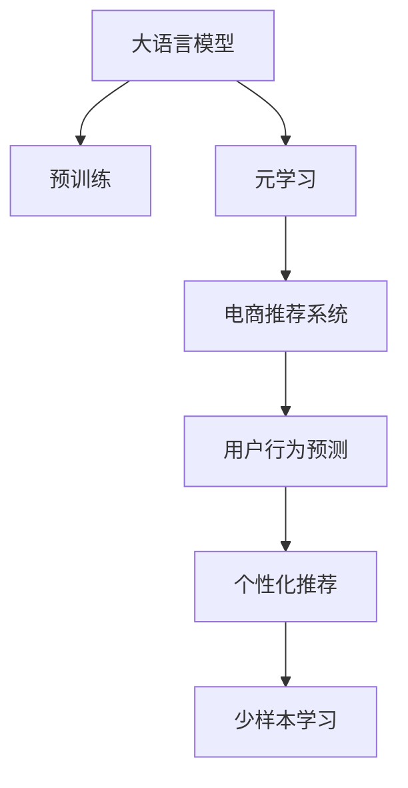

                 

# 电商行业中的元学习：大模型在快速适应新用户中的应用

> 关键词：大语言模型,元学习,电商推荐,用户行为,快速适应

## 1. 背景介绍

### 1.1 问题由来

随着电子商务的蓬勃发展，如何精准地为用户推荐合适的商品，成为了电商企业实现商业成功的重要一环。传统的基于规则、基于协同过滤的推荐系统在面对用户行为的变化时，往往需要重新训练或手动调整规则，耗时耗力，难以适应快速变化的电商市场。近年来，深度学习技术，尤其是大语言模型，在电商推荐领域的应用取得了显著进展，通过使用大模型微调的方式，企业可以更加快速高效地应对新用户的个性化需求。

### 1.2 问题核心关键点

本文聚焦于如何利用大语言模型在电商行业中的元学习（Meta-Learning）能力，实现对新用户的快速适应。元学习是一种通过少量样本来快速学习新任务的学习范式，大语言模型具备强大的自适应能力，能够在大规模语料上预训练，在小规模数据上进行微调，快速提升特定任务性能。这一能力在电商推荐中尤为关键，能够帮助电商平台快速响应新用户，提供个性化推荐，提升用户体验和转化率。

### 1.3 问题研究意义

掌握大语言模型在电商行业中的应用，对于提升电商推荐的精准度和时效性，优化用户体验，推动电商业务的持续增长，具有重要意义：

1. **提升推荐精准度**：通过个性化推荐，提高用户满意度，促进销售转化。
2. **优化用户体验**：减少用户等待时间，提高决策效率。
3. **推动业务增长**：借助精准推荐提升电商平台的销售和市场份额。
4. **加速模型更新**：通过元学习，快速适应新用户，提升模型迭代速度。
5. **赋能业务创新**：利用大模型预训练-微调的优势，探索更多电商推荐的新方法，开拓新的业务场景。

## 2. 核心概念与联系

### 2.1 核心概念概述

为更好地理解大语言模型在电商推荐中的应用，本节将介绍几个密切相关的核心概念：

- **大语言模型(Large Language Model, LLM)**：以自回归(如GPT)或自编码(如BERT)模型为代表的大规模预训练语言模型。通过在大规模无标签文本语料上进行预训练，学习通用的语言表示，具备强大的语言理解和生成能力。

- **元学习(Meta-Learning)**：指模型能够通过少量样本来学习新任务，快速适应新场景。大语言模型可以通过微调来快速适应新用户的行为变化，提供个性化推荐。

- **电商推荐系统(Recommendation System for E-commerce)**：利用用户的历史行为数据，结合商品特征信息，为用户推荐合适商品的系统。目标是提升用户满意度，增加平台销量。

- **用户行为预测(Predictive User Behavior)**：通过分析用户的历史行为，预测用户未来的购买意愿和偏好。

- **个性化推荐(Personalized Recommendation)**：根据用户偏好，为其推荐最符合其兴趣的商品。

- **少样本学习(Few-shot Learning)**：指在只有少量标注样本的情况下，模型能够快速适应新任务。大语言模型通过微调，能够在少数用户行为数据上快速学习新用户的行为模式。

这些核心概念之间的逻辑关系可以通过以下Mermaid流程图来展示：



这个流程图展示了大语言模型的核心概念及其之间的关系：

1. 大语言模型通过预训练获得基础能力。
2. 元学习使得模型能够通过少量数据快速适应新任务。
3. 电商推荐系统利用元学习能力，快速响应新用户。
4. 用户行为预测通过元学习实现，提升个性化推荐的准确性。
5. 个性化推荐通过微调大模型，实现快速响应新用户需求。

这些概念共同构成了大语言模型在电商推荐系统中的学习和应用框架，使其能够快速高效地为电商平台的个性化推荐提供支持。

## 3. 核心算法原理 & 具体操作步骤
### 3.1 算法原理概述

基于元学习的大语言模型在电商推荐系统中的应用，本质上是一个通过少量用户行为数据来优化模型性能的微调过程。其核心思想是：将预训练的大语言模型视作一个强大的"特征提取器"，通过在下游任务（电商推荐）上的少量标注数据上进行有监督地训练来优化模型在新用户上的性能。

形式化地，假设预训练模型为 $M_{\theta}$，其中 $\theta$ 为预训练得到的模型参数。给定电商推荐任务 $T$ 的标注数据集 $D=\{(x_i,y_i)\}_{i=1}^N$，其中 $x_i$ 为用户行为数据，$y_i$ 为用户期望购买的商品标签。微调的目标是找到新的模型参数 $\hat{\theta}$，使得：

$$
\hat{\theta}=\mathop{\arg\min}_{\theta} \mathcal{L}(M_{\theta},D)
$$

其中 $\mathcal{L}$ 为针对任务 $T$ 设计的损失函数，用于衡量模型预测输出与真实标签之间的差异。常见的损失函数包括交叉熵损失、均方误差损失等。

通过梯度下降等优化算法，微调过程不断更新模型参数 $\theta$，最小化损失函数 $\mathcal{L}$，使得模型输出逼近真实标签。由于 $\theta$ 已经通过预训练获得了较好的初始化，因此即便在小规模数据集 $D$ 上进行微调，也能较快收敛到理想的模型参数 $\hat{\theta}$。

### 3.2 算法步骤详解

基于元学习的大语言模型在电商推荐系统中的应用一般包括以下几个关键步骤：

**Step 1: 准备预训练模型和数据集**
- 选择合适的预训练语言模型 $M_{\theta}$ 作为初始化参数，如 BERT、GPT 等。
- 准备电商推荐任务 $T$ 的标注数据集 $D$，划分为训练集、验证集和测试集。一般要求标注数据与预训练数据的分布不要差异过大。

**Step 2: 设计任务适配层**
- 根据电商推荐任务的特点，在预训练模型顶层设计合适的输出层和损失函数。
- 对于电商推荐任务，通常在顶层添加线性分类器和交叉熵损失函数。

**Step 3: 设置微调超参数**
- 选择合适的优化算法及其参数，如 AdamW、SGD 等，设置学习率、批大小、迭代轮数等。
- 设置正则化技术及强度，包括权重衰减、Dropout、Early Stopping 等。
- 确定冻结预训练参数的策略，如仅微调顶层，或全部参数都参与微调。

**Step 4: 执行梯度训练**
- 将训练集数据分批次输入模型，前向传播计算损失函数。
- 反向传播计算参数梯度，根据设定的优化算法和学习率更新模型参数。
- 周期性在验证集上评估模型性能，根据性能指标决定是否触发 Early Stopping。
- 重复上述步骤直到满足预设的迭代轮数或 Early Stopping 条件。

**Step 5: 测试和部署**
- 在测试集上评估微调后模型 $M_{\hat{\theta}}$ 的性能，对比微调前后的精度提升。
- 使用微调后的模型对新用户的行为进行预测，集成到实际的应用系统中。
- 持续收集新的用户行为数据，定期重新微调模型，以适应数据分布的变化。

以上是基于元学习的大语言模型在电商推荐系统中的应用的一般流程。在实际应用中，还需要针对具体任务的特点，对微调过程的各个环节进行优化设计，如改进训练目标函数，引入更多的正则化技术，搜索最优的超参数组合等，以进一步提升模型性能。

### 3.3 算法优缺点

基于元学习的大语言模型在电商推荐中的应用具有以下优点：
1. 快速适应新用户：通过微调，模型能够快速适应新用户的行为变化，提升推荐准确性。
2. 泛化能力强：在大规模预训练的基础上，小规模数据也能有效提升模型性能。
3. 参数效率高：利用元学习，可以在固定大部分预训练参数的情况下，仅更新少量任务相关参数。
4. 易于扩展：支持动态收集新用户数据，模型可随时微调以适应用户行为的变化。

同时，该方法也存在一定的局限性：
1. 对标注数据依赖高：微调效果很大程度上取决于标注数据的质量和数量，获取高质量标注数据的成本较高。
2. 泛化能力有限：当目标任务与预训练数据的分布差异较大时，微调的性能提升有限。
3. 可解释性不足：微调模型的决策过程通常缺乏可解释性，难以对其推理逻辑进行分析和调试。

尽管存在这些局限性，但就目前而言，基于元学习的大语言模型在电商推荐系统中的应用仍是最主流范式。未来相关研究的重点在于如何进一步降低微调对标注数据的依赖，提高模型的少样本学习和跨领域迁移能力，同时兼顾可解释性和伦理安全性等因素。

### 3.4 算法应用领域

基于大语言模型的元学习技术，在电商推荐领域已经得到了广泛的应用，覆盖了几乎所有常见任务，例如：

- 商品推荐：根据用户的历史行为和浏览记录，为用户推荐可能感兴趣的商品。
- 个性化营销：通过分析用户行为，制定个性化的营销策略，提高转化率。
- 购物车推荐：在用户准备结算时，推荐搭配商品，增加购买可能性。
- 评论分析：分析用户评论内容，预测商品评分和销量趋势。
- 客服对话：利用用户对话记录，自动回答常见问题，提升客服效率。

除了上述这些经典任务外，大语言模型元学习技术还被创新性地应用到更多场景中，如智能搜索、多商品推荐、跨平台推荐等，为电商推荐系统带来了全新的突破。随着预训练模型和元学习方法的不断进步，相信电商推荐系统将在更广阔的应用领域大放异彩。

## 4. 数学模型和公式 & 详细讲解  
### 4.1 数学模型构建

本节将使用数学语言对基于元学习的大语言模型在电商推荐系统中的应用进行更加严格的刻画。

记预训练语言模型为 $M_{\theta}$，其中 $\theta$ 为预训练得到的模型参数。假设电商推荐任务 $T$ 的训练集为 $D=\{(x_i,y_i)\}_{i=1}^N, x_i \in \mathcal{X}, y_i \in \mathcal{Y}$，其中 $\mathcal{X}$ 为用户行为数据空间，$\mathcal{Y}$ 为用户期望购买的商品标签空间。

定义模型 $M_{\theta}$ 在输入 $x$ 上的输出为 $\hat{y}=M_{\theta}(x)$，表示模型对用户行为的预测。真实标签 $y \in \{1,0\}$，其中 $1$ 表示用户购买该商品，$0$ 表示用户不购买该商品。

定义模型 $M_{\theta}$ 在输入 $x$ 上的预测概率为 $P(y|x)=M_{\theta}(x)$，则在数据集 $D$ 上的经验风险为：

$$
\mathcal{L}(\theta) = -\frac{1}{N}\sum_{i=1}^N \log P(y_i|x_i)
$$

其中 $P(y_i|x_i)$ 为模型在训练集 $D$ 上的预测概率，即：

$$
P(y_i|x_i) = \frac{\exp(M_{\theta}(x_i))}{\sum_{j=1}^N \exp(M_{\theta}(x_j))}
$$

微调的优化目标是最小化经验风险，即找到最优参数：

$$
\theta^* = \mathop{\arg\min}_{\theta} \mathcal{L}(\theta)
$$

在实践中，我们通常使用基于梯度的优化算法（如SGD、Adam等）来近似求解上述最优化问题。设 $\eta$ 为学习率，$\lambda$ 为正则化系数，则参数的更新公式为：

$$
\theta \leftarrow \theta - \eta \nabla_{\theta}\mathcal{L}(\theta) - \eta\lambda\theta
$$

其中 $\nabla_{\theta}\mathcal{L}(\theta)$ 为损失函数对参数 $\theta$ 的梯度，可通过反向传播算法高效计算。

### 4.2 公式推导过程

以下我们以二分类任务为例，推导交叉熵损失函数及其梯度的计算公式。

假设模型 $M_{\theta}$ 在输入 $x$ 上的输出为 $\hat{y}=M_{\theta}(x) \in [0,1]$，表示用户购买该商品的预测概率。真实标签 $y \in \{0,1\}$。则二分类交叉熵损失函数定义为：

$$
\ell(M_{\theta}(x),y) = -[y\log \hat{y} + (1-y)\log (1-\hat{y})]
$$

将其代入经验风险公式，得：

$$
\mathcal{L}(\theta) = -\frac{1}{N}\sum_{i=1}^N [y_i\log M_{\theta}(x_i)+(1-y_i)\log(1-M_{\theta}(x_i))]
$$

根据链式法则，损失函数对参数 $\theta_k$ 的梯度为：

$$
\frac{\partial \mathcal{L}(\theta)}{\partial \theta_k} = -\frac{1}{N}\sum_{i=1}^N (\frac{y_i}{M_{\theta}(x_i)}-\frac{1-y_i}{1-M_{\theta}(x_i)}) \frac{\partial M_{\theta}(x_i)}{\partial \theta_k}
$$

其中 $\frac{\partial M_{\theta}(x_i)}{\partial \theta_k}$ 可进一步递归展开，利用自动微分技术完成计算。

在得到损失函数的梯度后，即可带入参数更新公式，完成模型的迭代优化。重复上述过程直至收敛，最终得到适应电商推荐任务的最优模型参数 $\theta^*$。

## 5. 项目实践：代码实例和详细解释说明
### 5.1 开发环境搭建

在进行电商推荐微调实践前，我们需要准备好开发环境。以下是使用Python进行PyTorch开发的环境配置流程：

1. 安装Anaconda：从官网下载并安装Anaconda，用于创建独立的Python环境。

2. 创建并激活虚拟环境：
```bash
conda create -n pytorch-env python=3.8 
conda activate pytorch-env
```

3. 安装PyTorch：根据CUDA版本，从官网获取对应的安装命令。例如：
```bash
conda install pytorch torchvision torchaudio cudatoolkit=11.1 -c pytorch -c conda-forge
```

4. 安装Transformers库：
```bash
pip install transformers
```

5. 安装各类工具包：
```bash
pip install numpy pandas scikit-learn matplotlib tqdm jupyter notebook ipython
```

完成上述步骤后，即可在`pytorch-env`环境中开始微调实践。

### 5.2 源代码详细实现

下面我们以电商推荐任务为例，给出使用Transformers库对BERT模型进行微调的PyTorch代码实现。

首先，定义电商推荐任务的数据处理函数：

```python
from transformers import BertTokenizer
from torch.utils.data import Dataset
import torch

class ECommDataset(Dataset):
    def __init__(self, data, tokenizer, max_len=128):
        self.data = data
        self.tokenizer = tokenizer
        self.max_len = max_len
        
    def __len__(self):
        return len(self.data)
    
    def __getitem__(self, item):
        text = self.data[item]
        tokenized_input = self.tokenizer(text, padding='max_length', truncation=True, max_length=self.max_len, return_tensors='pt')
        input_ids = tokenized_input['input_ids']
        attention_mask = tokenized_input['attention_mask']
        return {'input_ids': input_ids, 
                'attention_mask': attention_mask}
```

然后，定义模型和优化器：

```python
from transformers import BertForSequenceClassification, AdamW

model = BertForSequenceClassification.from_pretrained('bert-base-cased', num_labels=2)

optimizer = AdamW(model.parameters(), lr=2e-5)
```

接着，定义训练和评估函数：

```python
from torch.utils.data import DataLoader
from tqdm import tqdm
from sklearn.metrics import accuracy_score

device = torch.device('cuda') if torch.cuda.is_available() else torch.device('cpu')
model.to(device)

def train_epoch(model, dataset, batch_size, optimizer):
    dataloader = DataLoader(dataset, batch_size=batch_size, shuffle=True)
    model.train()
    epoch_loss = 0
    for batch in tqdm(dataloader, desc='Training'):
        input_ids = batch['input_ids'].to(device)
        attention_mask = batch['attention_mask'].to(device)
        labels = batch['labels'].to(device)
        model.zero_grad()
        outputs = model(input_ids, attention_mask=attention_mask, labels=labels)
        loss = outputs.loss
        epoch_loss += loss.item()
        loss.backward()
        optimizer.step()
    return epoch_loss / len(dataloader)

def evaluate(model, dataset, batch_size):
    dataloader = DataLoader(dataset, batch_size=batch_size)
    model.eval()
    preds, labels = [], []
    with torch.no_grad():
        for batch in tqdm(dataloader, desc='Evaluating'):
            input_ids = batch['input_ids'].to(device)
            attention_mask = batch['attention_mask'].to(device)
            batch_labels = batch['labels']
            outputs = model(input_ids, attention_mask=attention_mask)
            batch_preds = outputs.logits.argmax(dim=1).to('cpu').tolist()
            batch_labels = batch_labels.to('cpu').tolist()
            for pred, label in zip(batch_preds, batch_labels):
                preds.append(pred)
                labels.append(label)
                
    accuracy = accuracy_score(labels, preds)
    print(f"Accuracy: {accuracy:.2f}")
```

最后，启动训练流程并在测试集上评估：

```python
epochs = 5
batch_size = 16

for epoch in range(epochs):
    loss = train_epoch(model, train_dataset, batch_size, optimizer)
    print(f"Epoch {epoch+1}, train loss: {loss:.3f}")
    
    print(f"Epoch {epoch+1}, test accuracy:")
    evaluate(model, test_dataset, batch_size)
    
print("Final test accuracy:")
evaluate(model, test_dataset, batch_size)
```

以上就是使用PyTorch对BERT进行电商推荐任务微调的完整代码实现。可以看到，得益于Transformers库的强大封装，我们可以用相对简洁的代码完成BERT模型的加载和微调。

### 5.3 代码解读与分析

让我们再详细解读一下关键代码的实现细节：

**ECommDataset类**：
- `__init__`方法：初始化数据、分词器等关键组件。
- `__len__`方法：返回数据集的样本数量。
- `__getitem__`方法：对单个样本进行处理，将文本输入编码为token ids，进行padding，最终返回模型所需的输入。

**训练和评估函数**：
- 使用PyTorch的DataLoader对数据集进行批次化加载，供模型训练和推理使用。
- 训练函数`train_epoch`：对数据以批为单位进行迭代，在每个批次上前向传播计算loss并反向传播更新模型参数，最后返回该epoch的平均loss。
- 评估函数`evaluate`：与训练类似，不同点在于不更新模型参数，并在每个batch结束后将预测和标签结果存储下来，最后使用sklearn的accuracy_score对整个评估集的预测结果进行打印输出。

**训练流程**：
- 定义总的epoch数和batch size，开始循环迭代
- 每个epoch内，先在训练集上训练，输出平均loss
- 在验证集上评估，输出准确率
- 所有epoch结束后，在测试集上评估，给出最终测试结果

可以看到，PyTorch配合Transformers库使得BERT微调的代码实现变得简洁高效。开发者可以将更多精力放在数据处理、模型改进等高层逻辑上，而不必过多关注底层的实现细节。

当然，工业级的系统实现还需考虑更多因素，如模型的保存和部署、超参数的自动搜索、更灵活的任务适配层等。但核心的微调范式基本与此类似。

## 6. 实际应用场景
### 6.1 智能推荐系统

基于大语言模型元学习能力的电商推荐系统，在实际应用中已经取得了显著成效。传统的推荐系统往往依赖于用户的历史行为数据，难以适应新用户的快速变化。而使用元学习技术的电商推荐系统，能够通过少量历史数据，快速适应新用户，提供个性化的推荐。

例如，某电商平台可以收集新用户的前几笔购买记录和浏览行为，利用大语言模型微调生成个性化的商品推荐列表，帮助新用户快速找到感兴趣的商品。通过不断收集新用户数据，模型能够持续更新，进一步提升推荐效果。

### 6.2 个性化营销策略

电商平台通过分析用户行为，可以设计个性化的营销策略，提高转化率。使用元学习技术，模型能够根据少量用户行为数据，学习新用户的购买倾向和行为模式，从而制定更加精准的营销方案。

例如，电商平台可以在新用户注册时，收集其浏览记录和搜索关键词，使用大语言模型进行微调，预测其对不同商品的兴趣和购买意愿。基于此，平台可以发送针对性的广告和优惠券，促进用户转化。

### 6.3 智能客服系统

智能客服系统利用大语言模型元学习能力，能够快速响应新用户的需求，提升用户满意度。电商平台可以收集用户与客服的对话记录，使用大语言模型进行微调，自动回答常见问题，减少客服工作量，提高服务效率。

例如，当新用户向客服咨询商品信息时，系统可以自动从对话中提取问题，使用预训练模型生成最佳回答，并推荐相关商品。通过不断学习新用户的对话内容，模型能够逐步提升回答准确率，提供更个性化的服务。

### 6.4 未来应用展望

随着大语言模型元学习技术的不断进步，其在电商推荐系统中的应用前景将更加广阔。未来，我们可以预见以下几个方向的发展：

1. **多商品推荐**：支持同时推荐多种商品，满足用户的复杂需求。
2. **跨平台推荐**：利用用户在不同平台上的行为数据，实现跨平台一致性的推荐。
3. **实时推荐**：支持动态收集新用户数据，实时调整推荐策略，提高转化率。
4. **个性化标签推荐**：利用大语言模型对用户进行深度标签分析，推荐符合标签的商品。
5. **联合推荐**：结合用户行为数据和商品属性数据，提供更全面、精准的推荐。

这些应用场景将进一步拓展电商推荐系统的应用边界，提升用户体验，优化电商平台的运营效率。

## 7. 工具和资源推荐
### 7.1 学习资源推荐

为了帮助开发者系统掌握大语言模型元学习在电商推荐中的应用，这里推荐一些优质的学习资源：

1. 《Transformer从原理到实践》系列博文：由大模型技术专家撰写，深入浅出地介绍了Transformer原理、BERT模型、元学习技术等前沿话题。

2. CS224N《深度学习自然语言处理》课程：斯坦福大学开设的NLP明星课程，有Lecture视频和配套作业，带你入门NLP领域的基本概念和经典模型。

3. 《Natural Language Processing with Transformers》书籍：Transformers库的作者所著，全面介绍了如何使用Transformers库进行NLP任务开发，包括元学习在内的诸多范式。

4. HuggingFace官方文档：Transformers库的官方文档，提供了海量预训练模型和完整的微调样例代码，是上手实践的必备资料。

5. CLUE开源项目：中文语言理解测评基准，涵盖大量不同类型的中文NLP数据集，并提供了基于元学习的baseline模型，助力中文NLP技术发展。

通过对这些资源的学习实践，相信你一定能够快速掌握大语言模型元学习在电商推荐中的应用，并用于解决实际的NLP问题。
###  7.2 开发工具推荐

高效的开发离不开优秀的工具支持。以下是几款用于电商推荐系统微调开发的常用工具：

1. PyTorch：基于Python的开源深度学习框架，灵活动态的计算图，适合快速迭代研究。大部分预训练语言模型都有PyTorch版本的实现。

2. TensorFlow：由Google主导开发的开源深度学习框架，生产部署方便，适合大规模工程应用。同样有丰富的预训练语言模型资源。

3. Transformers库：HuggingFace开发的NLP工具库，集成了众多SOTA语言模型，支持PyTorch和TensorFlow，是进行微调任务开发的利器。

4. Weights & Biases：模型训练的实验跟踪工具，可以记录和可视化模型训练过程中的各项指标，方便对比和调优。与主流深度学习框架无缝集成。

5. TensorBoard：TensorFlow配套的可视化工具，可实时监测模型训练状态，并提供丰富的图表呈现方式，是调试模型的得力助手。

6. Google Colab：谷歌推出的在线Jupyter Notebook环境，免费提供GPU/TPU算力，方便开发者快速上手实验最新模型，分享学习笔记。

合理利用这些工具，可以显著提升电商推荐系统微调的开发效率，加快创新迭代的步伐。

### 7.3 相关论文推荐

大语言模型元学习技术的发展源于学界的持续研究。以下是几篇奠基性的相关论文，推荐阅读：

1. Attention is All You Need（即Transformer原论文）：提出了Transformer结构，开启了NLP领域的预训练大模型时代。

2. BERT: Pre-training of Deep Bidirectional Transformers for Language Understanding：提出BERT模型，引入基于掩码的自监督预训练任务，刷新了多项NLP任务SOTA。

3. Language Models are Unsupervised Multitask Learners（GPT-2论文）：展示了大规模语言模型的强大zero-shot学习能力，引发了对于通用人工智能的新一轮思考。

4. Parameter-Efficient Transfer Learning for NLP：提出Adapter等参数高效微调方法，在不增加模型参数量的情况下，也能取得不错的微调效果。

5. Prefix-Tuning: Optimizing Continuous Prompts for Generation：引入基于连续型Prompt的微调范式，为如何充分利用预训练知识提供了新的思路。

6. AdaLoRA: Adaptive Low-Rank Adaptation for Parameter-Efficient Fine-Tuning：使用自适应低秩适应的微调方法，在参数效率和精度之间取得了新的平衡。

这些论文代表了大语言模型元学习技术的发展脉络。通过学习这些前沿成果，可以帮助研究者把握学科前进方向，激发更多的创新灵感。

## 8. 总结：未来发展趋势与挑战
### 8.1 总结

本文对基于元学习的大语言模型在电商推荐系统中的应用进行了全面系统的介绍。首先阐述了元学习在电商推荐中的应用背景和意义，明确了大语言模型元学习在快速适应新用户方面的独特价值。其次，从原理到实践，详细讲解了元学习的数学原理和关键步骤，给出了电商推荐任务开发的完整代码实例。同时，本文还广泛探讨了元学习技术在智能推荐系统、个性化营销策略、智能客服系统等多个电商应用场景中的应用前景，展示了元学习范式的巨大潜力。此外，本文精选了元学习技术的各类学习资源，力求为读者提供全方位的技术指引。

通过本文的系统梳理，可以看到，基于大语言模型的元学习技术正在成为电商推荐系统的核心范式，极大地拓展了电商推荐系统的应用边界，催生了更多的落地场景。受益于大规模语料的预训练和元学习的能力，电商推荐系统能够快速高效地为电商平台提供个性化的推荐，提升用户体验和平台销量。未来，伴随预训练语言模型和元学习方法的持续演进，相信电商推荐系统将在更广阔的应用领域大放异彩，深刻影响人类的生产生活方式。

### 8.2 未来发展趋势

展望未来，基于元学习的大语言模型在电商推荐系统中的应用将呈现以下几个发展趋势：

1. **模型规模持续增大**：随着算力成本的下降和数据规模的扩张，预训练语言模型的参数量还将持续增长。超大规模语言模型蕴含的丰富语言知识，有望支撑更加复杂多变的电商推荐系统。

2. **元学习方法日趋多样**：除了传统的全参数元学习外，未来会涌现更多参数高效的元学习方法，如Meta-Learning for Fine-Tuning，在节省计算资源的同时也能保证微调精度。

3. **跨平台推荐系统崛起**：利用用户在不同平台上的行为数据，实现跨平台一致性的推荐，提高用户粘性。

4. **实时推荐系统成为常态**：支持动态收集新用户数据，实时调整推荐策略，提高转化率。

5. **个性化标签推荐**：利用大语言模型对用户进行深度标签分析，推荐符合标签的商品，提升推荐的精准度。

6. **联合推荐系统崛起**：结合用户行为数据和商品属性数据，提供更全面、精准的推荐。

以上趋势凸显了大语言模型元学习技术在电商推荐系统中的应用前景。这些方向的探索发展，必将进一步提升电商推荐系统的性能和应用范围，为电商平台的智能化转型提供新的动力。

### 8.3 面临的挑战

尽管大语言模型元学习技术已经取得了瞩目成就，但在迈向更加智能化、普适化应用的过程中，它仍面临着诸多挑战：

1. **标注成本瓶颈**：微调效果很大程度上取决于标注数据的质量和数量，获取高质量标注数据的成本较高。如何进一步降低元学习对标注样本的依赖，将是一大难题。

2. **模型鲁棒性不足**：当前元学习模型面对域外数据时，泛化性能往往大打折扣。对于测试样本的微小扰动，元学习模型的预测也容易发生波动。如何提高元学习模型的鲁棒性，避免灾难性遗忘，还需要更多理论和实践的积累。

3. **推理效率有待提高**：尽管元学习模型精度高，但在实际部署时往往面临推理速度慢、内存占用大等效率问题。如何在保证性能的同时，简化模型结构，提升推理速度，优化资源占用，将是重要的优化方向。

4. **可解释性亟需加强**：当前元学习模型更像是"黑盒"系统，难以解释其内部工作机制和决策逻辑。对于医疗、金融等高风险应用，算法的可解释性和可审计性尤为重要。如何赋予元学习模型更强的可解释性，将是亟待攻克的难题。

5. **安全性有待保障**：元学习模型难免会学习到有偏见、有害的信息，通过微调传递到推荐系统，产生误导性、歧视性的输出，给实际应用带来安全隐患。如何从数据和算法层面消除模型偏见，避免恶意用途，确保输出的安全性，也将是重要的研究课题。

6. **知识整合能力不足**：现有的元学习模型往往局限于任务内数据，难以灵活吸收和运用更广泛的先验知识。如何让元学习过程更好地与外部知识库、规则库等专家知识结合，形成更加全面、准确的信息整合能力，还有很大的想象空间。

正视元学习面临的这些挑战，积极应对并寻求突破，将是大语言模型元学习技术走向成熟的必由之路。相信随着学界和产业界的共同努力，这些挑战终将一一被克服，大语言模型元学习必将在构建智能化的电商推荐系统中扮演越来越重要的角色。

### 8.4 研究展望

面对大语言模型元学习所面临的种种挑战，未来的研究需要在以下几个方面寻求新的突破：

1. **探索无监督和半监督元学习方法**：摆脱对大规模标注数据的依赖，利用自监督学习、主动学习等无监督和半监督范式，最大限度利用非结构化数据，实现更加灵活高效的元学习。

2. **研究参数高效和计算高效的元学习范式**：开发更加参数高效的元学习方法，在固定大部分预训练参数的情况下，仅更新极少量的任务相关参数。同时优化元学习模型的计算图，减少前向传播和反向传播的资源消耗，实现更加轻量级、实时性的部署。

3. **融合因果和对比学习范式**：通过引入因果推断和对比学习思想，增强元学习模型建立稳定因果关系的能力，学习更加普适、鲁棒的语言表征，从而提升模型泛化性和抗干扰能力。

4. **引入更多先验知识**：将符号化的先验知识，如知识图谱、逻辑规则等，与神经网络模型进行巧妙融合，引导元学习过程学习更准确、合理的语言模型。同时加强不同模态数据的整合，实现视觉、语音等多模态信息与文本信息的协同建模。

5. **结合因果分析和博弈论工具**：将因果分析方法引入元学习模型，识别出模型决策的关键特征，增强输出解释的因果性和逻辑性。借助博弈论工具刻画人机交互过程，主动探索并规避模型的脆弱点，提高系统稳定性。

6. **纳入伦理道德约束**：在元学习目标中引入伦理导向的评估指标，过滤和惩罚有偏见、有害的输出倾向。同时加强人工干预和审核，建立模型行为的监管机制，确保输出符合人类价值观和伦理道德。

这些研究方向的探索，必将引领大语言模型元学习技术迈向更高的台阶，为构建安全、可靠、可解释、可控的智能系统铺平道路。面向未来，大语言模型元学习技术还需要与其他人工智能技术进行更深入的融合，如知识表示、因果推理、强化学习等，多路径协同发力，共同推动自然语言理解和智能交互系统的进步。只有勇于创新、敢于突破，才能不断拓展语言模型的边界，让智能技术更好地造福人类社会。

## 9. 附录：常见问题与解答

**Q1：大语言模型元学习是否适用于所有电商推荐任务？**

A: 大语言模型元学习在大多数电商推荐任务上都能取得不错的效果，特别是对于数据量较小的任务。但对于一些特定领域的任务，如医疗器械、金融产品等，仅仅依靠通用语料预训练的模型可能难以很好地适应。此时需要在特定领域语料上进一步预训练，再进行元学习，才能获得理想效果。此外，对于一些需要时效性、个性化很强的任务，如直播推荐、动态推荐等，元学习方法也需要针对性的改进优化。

**Q2：元学习过程中如何选择合适的学习率？**

A: 元学习的学习率一般要比预训练时小1-2个数量级，如果使用过大的学习率，容易破坏预训练权重，导致过拟合。一般建议从1e-5开始调参，逐步减小学习率，直至收敛。也可以使用warmup策略，在开始阶段使用较小的学习率，再逐渐过渡到预设值。需要注意的是，不同的优化器(如AdamW、Adafactor等)以及不同的学习率调度策略，可能需要设置不同的学习率阈值。

**Q3：采用大模型元学习时会面临哪些资源瓶颈？**

A: 目前主流的预训练大模型动辄以亿计的参数规模，对算力、内存、存储都提出了很高的要求。GPU/TPU等高性能设备是必不可少的，但即便如此，超大批次的训练和推理也可能遇到显存不足的问题。因此需要采用一些资源优化技术，如梯度积累、混合精度训练、模型并行等，来突破硬件瓶颈。同时，模型的存储和读取也可能占用大量时间和空间，需要采用模型压缩、稀疏化存储等方法进行优化。

**Q4：如何缓解元学习过程中的过拟合问题？**

A: 过拟合是元学习面临的主要挑战，尤其是在标注数据不足的情况下。常见的缓解策略包括：
1. 数据增强：通过回译、近义替换等方式扩充训练集
2. 正则化：使用L2正则、Dropout、Early Stopping等避免过拟合
3. 对抗训练：引入对抗样本，提高模型鲁棒性
4. 参数高效元学习：只调整少量参数(如Adapter、Prefix等)，减小过拟合风险
5. 多模型集成：训练多个元学习模型，取平均输出，抑制过拟合

这些策略往往需要根据具体任务和数据特点进行灵活组合。只有在数据、模型、训练、推理等各环节进行全面优化，才能最大限度地发挥大模型元学习的威力。

**Q5：元学习模型在落地部署时需要注意哪些问题？**

A: 将元学习模型转化为实际应用，还需要考虑以下因素：
1. 模型裁剪：去除不必要的层和参数，减小模型尺寸，加快推理速度
2. 量化加速：将浮点模型转为定点模型，压缩存储空间，提高计算效率
3. 服务化封装：将模型封装为标准化服务接口，便于集成调用
4. 弹性伸缩：根据请求流量动态调整资源配置，平衡服务质量和成本
5. 监控告警：实时采集系统指标，设置异常告警阈值，确保服务稳定性
6. 安全防护：采用访问鉴权、数据脱敏等措施，保障数据和模型安全

大语言模型元学习为电商推荐系统带来了显著的性能提升，但如何将强大的性能转化为稳定、高效、安全的业务价值，还需要工程实践的不断打磨。唯有从数据、算法、工程、业务等多个维度协同发力，才能真正实现人工智能技术在电商领域的落地应用。总之，元学习需要开发者根据具体任务，不断迭代和优化模型、数据和算法，方能得到理想的效果。

---

作者：禅与计算机程序设计艺术 / Zen and the Art of Computer Programming

