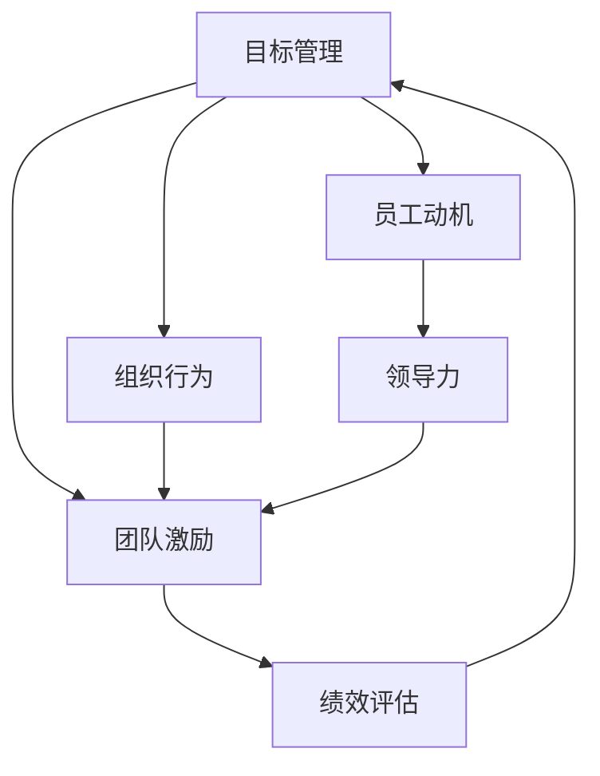

                 

# 目标管理与团队激励的关系

> 关键词：目标管理, 团队激励, 绩效评估, 员工动机, 组织行为, 领导力, 团队协作

## 1. 背景介绍

### 1.1 问题由来
在现代企业中，目标管理与团队激励是人力资源管理的两大核心任务。目标管理（Goal Management）旨在通过明确、可衡量的目标设定，帮助团队明确方向，提升工作效率。团队激励（Team Motivation）则通过调动员工积极性，激发团队士气，提升团队凝聚力和合作能力。这两个过程相互交织，互为因果，深刻影响着组织的运营和团队的表现。

然而，尽管目标管理与团队激励在理论上有众多研究，但在实际应用中仍存在诸多挑战。如何设计合理有效的目标体系，激发团队成员的内在动机，克服团队协作中的摩擦和冲突，是当前人力资源管理面临的主要难题。本文将深入探讨目标管理与团队激励之间的关系，提出具体策略，以期为企业管理者提供有价值的指导。

### 1.2 问题核心关键点
目标管理与团队激励的关键点包括：
- **目标设定**：明确且可衡量的目标体系是目标管理的核心。
- **激励机制**：多样化的激励方式能够更好地激发团队成员的动力。
- **绩效评估**：公正、透明的绩效评估有助于目标实现和激励效果。
- **领导力**：领导者的风格和行为对团队动机的激发至关重要。
- **团队协作**：有效的团队协作机制是目标管理与激励实施的保障。

## 2. 核心概念与联系

### 2.1 核心概念概述

为更好地理解目标管理与团队激励的关系，本文将介绍几个关键概念：

- **目标管理**：通过明确、可衡量的目标设定，帮助团队明确方向，提升工作效率。目标通常具有SMART特性（Specific, Measurable, Achievable, Relevant, Time-bound）。
- **团队激励**：通过调动员工积极性，激发团队士气，提升团队凝聚力和合作能力。激励方式包括物质奖励、精神认可、职业发展等。
- **绩效评估**：通过量化评估团队和个人的表现，反馈目标达成情况，为后续目标设定和激励分配提供依据。
- **员工动机**：员工的内在需求和外在因素对工作积极性的影响。
- **组织行为**：员工在组织中的行为表现和互动方式，受目标设定、激励机制等因素影响。
- **领导力**：领导者通过行为和决策对团队产生的影响力。

这些概念之间的关系可以用以下Mermaid流程图来展示：



这个流程图展示了目标管理、团队激励、绩效评估、员工动机、组织行为和领导力之间的联系：

1. 目标管理通过明确目标，引导员工行为。
2. 团队激励通过调动员工积极性，提高工作效率。
3. 绩效评估通过反馈目标达成情况，调整激励措施。
4. 员工动机影响员工的工作行为和效率。
5. 组织行为反映团队的合作和协作情况。
6. 领导力通过影响员工动机和组织行为，进一步提升团队激励效果。

## 3. 核心算法原理 & 具体操作步骤
### 3.1 算法原理概述

目标管理与团队激励的实施，本质上是一个多层次、多因素交互的过程。其核心思想是通过明确目标、激发动机、调整激励，形成一个闭环反馈系统，以实现团队的持续改进和发展。

**基本原理**：
1. **目标设定**：通过SMART原则设定明确且可衡量的目标。
2. **动机激发**：识别员工内在需求，通过激励措施调动其积极性。
3. **绩效反馈**：定期评估团队和个人的绩效，提供即时反馈。
4. **动态调整**：根据绩效反馈和动机状态，动态调整目标和激励措施。

**算法步骤**：
1. **目标设定**：
   - **定义目标**：明确业务目标和员工职责，设定具体的绩效指标。
   - **分解目标**：将大目标分解为小任务，分配给团队成员。
   - **制定计划**：制定详细的执行计划，包括时间节点和资源分配。

2. **动机激发**：
   - **识别需求**：通过问卷调查、面谈等方式，识别员工的内在需求和外在动机。
   - **设计激励**：根据需求设计多样化的激励措施，如物质奖励、精神认可、职业发展等。
   - **实施激励**：根据激励措施执行情况，动态调整激励策略。

3. **绩效评估**：
   - **设定标准**：制定具体的评估标准和指标，涵盖关键绩效指标（KPIs）。
   - **定期评估**：定期进行绩效评估，收集反馈信息。
   - **结果反馈**：将评估结果反馈给团队和个人，提供改进建议。

4. **动态调整**：
   - **目标修正**：根据绩效反馈，调整目标设定，使之更具挑战性和可实现性。
   - **激励优化**：根据动机状态，优化激励措施，提升团队士气。
   - **组织优化**：优化团队协作机制，提高工作效率和合作质量。

### 3.2 算法步骤详解

**目标设定步骤**：
1. **明确业务目标**：业务目标应具体、可衡量，如“增加销售额10%”。
2. **分解目标**：将大目标分解为多个小任务，如“每月完成200个销售订单”。
3. **制定计划**：为每个小任务设定时间节点和资源需求，如“本周内完成10个订单”。

**动机激发步骤**：
1. **识别需求**：通过问卷调查、面谈等方式，识别员工的内在需求和外在动机。
2. **设计激励**：根据需求设计多样化的激励措施，如物质奖励、精神认可、职业发展等。
3. **实施激励**：根据激励措施执行情况，动态调整激励策略，如奖励表现优异的员工。

**绩效评估步骤**：
1. **设定标准**：制定具体的评估标准和指标，涵盖关键绩效指标（KPIs）。
2. **定期评估**：定期进行绩效评估，收集反馈信息。
3. **结果反馈**：将评估结果反馈给团队和个人，提供改进建议。

**动态调整步骤**：
1. **目标修正**：根据绩效反馈，调整目标设定，使之更具挑战性和可实现性。
2. **激励优化**：根据动机状态，优化激励措施，提升团队士气。
3. **组织优化**：优化团队协作机制，提高工作效率和合作质量。

### 3.3 算法优缺点

目标管理与团队激励的实施方法具有以下优点：
1. **提升工作效率**：明确的目标设定和任务分解，能够提高团队的工作效率。
2. **增强团队协作**：多样化的激励措施和绩效评估，能够促进团队成员的合作。
3. **提升员工士气**：公正、透明的绩效评估和激励机制，能够提升员工的积极性。
4. **促进职业发展**：多样化的激励措施，能够帮助员工实现职业发展，提升工作满意度。

同时，该方法也存在一定的局限性：
1. **目标设定困难**：如何设定既具挑战性又具可行性的目标，仍是一个难题。
2. **激励措施复杂**：不同员工有不同的需求，如何设计多样化且有效的激励措施，需要细致考虑。
3. **绩效评估复杂**：如何制定公正、透明的评估标准，需要考虑多种因素。
4. **动态调整复杂**：如何根据绩效反馈和动机状态，动态调整目标和激励措施，需要灵活处理。

尽管存在这些局限性，但就目前而言，目标管理与团队激励的实施方法仍是大中型企业的重要管理工具。未来相关研究的重点在于如何进一步简化目标设定和激励设计，提高绩效评估的公平性和透明性，同时兼顾员工的个性化需求和团队的合作质量。

### 3.4 算法应用领域

目标管理与团队激励的应用范围非常广泛，涵盖了企业运营的各个环节，如：

- 销售部门：通过设定销售目标和激励措施，提升销售业绩。
- 人力资源部门：通过设定招聘目标和激励措施，吸引和留住人才。
- 研发部门：通过设定研发目标和激励措施，提升产品创新力和市场竞争力。
- 运营部门：通过设定运营目标和激励措施，提升运营效率和服务质量。
- 客服部门：通过设定服务目标和激励措施，提升客户满意度和忠诚度。

除了这些常见应用外，目标管理与团队激励还在企业文化建设、项目管理、绩效管理等领域得到了广泛应用，成为企业战略实施的重要保障。

## 4. 数学模型和公式 & 详细讲解  
### 4.1 数学模型构建

本节将使用数学语言对目标管理与团队激励的关系进行更加严格的刻画。

**基本模型**：
设 $T$ 为目标管理的时间周期，$G$ 为整体目标，$N$ 为团队成员数量，$M_i$ 为第 $i$ 个成员的任务，$R_i$ 为第 $i$ 个成员的激励措施，$P_i$ 为第 $i$ 个成员的绩效评估结果，$D_i$ 为第 $i$ 个成员的需求，$L$ 为领导力。

目标管理的数学模型为：

$$
G = \sum_{i=1}^N M_i
$$

其中，$G$ 为目标管理的目标总和，$M_i$ 为每个成员的任务。

团队激励的数学模型为：

$$
R_i = \sum_{j=1}^N L_j D_j
$$

其中，$R_i$ 为第 $i$ 个成员的激励措施，$L_j$ 为第 $j$ 个成员的领导力，$D_j$ 为第 $j$ 个成员的需求。

绩效评估的数学模型为：

$$
P_i = f(G, M_i, R_i, D_i, L)
$$

其中，$P_i$ 为第 $i$ 个成员的绩效评估结果，$f$ 为绩效评估函数。

动态调整的数学模型为：

$$
\begin{aligned}
& G' = f(G, P_i, R_i, D_i, L) \\
& R_i' = f(R_i, P_i, D_i, L) \\
& L' = f(L, G', R_i', D_i, P_i)
\end{aligned}
$$

其中，$G'$ 为目标管理的目标总和，$R_i'$ 为第 $i$ 个成员的激励措施，$L'$ 为领导力。

### 4.2 公式推导过程

以绩效评估模型为例，推导其公式推导过程：

设 $P_i$ 为第 $i$ 个成员的绩效评估结果，$G$ 为整体目标，$M_i$ 为第 $i$ 个成员的任务，$R_i$ 为第 $i$ 个成员的激励措施，$D_i$ 为第 $i$ 个成员的需求，$L$ 为领导力。

绩效评估模型为：

$$
P_i = f(G, M_i, R_i, D_i, L)
$$

其中，$f$ 为绩效评估函数，通常包括任务完成情况、激励措施、需求满足度、领导力等因子。

根据该函数，可以推导出绩效评估结果的具体形式。例如：

$$
P_i = \alpha G + \beta M_i + \gamma R_i + \delta D_i + \epsilon L
$$

其中，$\alpha, \beta, \gamma, \delta, \epsilon$ 为函数的具体系数，代表各因子对绩效评估结果的影响程度。

### 4.3 案例分析与讲解

假设某企业销售部门的绩效评估模型为：

$$
P_i = 0.8G + 0.1M_i + 0.2R_i + 0.3D_i + 0.4L
$$

其中：
- $G$ 为整体销售目标。
- $M_i$ 为第 $i$ 个销售人员的月销售额。
- $R_i$ 为第 $i$ 个销售人员的奖励措施，如奖金、晋升机会等。
- $D_i$ 为第 $i$ 个销售人员的需求，如薪酬福利、职业发展等。
- $L$ 为销售团队领导者的领导力，如沟通能力、激励水平等。

某月末，该部门的目标完成情况如下：
- 整体销售目标 $G$ 为 100 万元。
- 第 $i$ 个销售人员的月销售额 $M_i$ 如下：

| 销售人员 | 月销售额 |
| -------- | -------- |
| 张三     | 60 万    |
| 李四     | 80 万    |
| 王五     | 50 万    |
| 赵六     | 40 万    |

第 $i$ 个销售人员的激励措施 $R_i$ 如下：

| 销售人员 | 激励措施  |
| -------- | -------- |
| 张三     | 奖金 5000 |
| 李四     | 晋升机会 |
| 王五     | 奖金 3000 |
| 赵六     | 培训机会 |

第 $i$ 个销售人员的需求 $D_i$ 如下：

| 销售人员 | 需求 |
| -------- | ---- |
| 张三     | 薪酬提升 |
| 李四     | 职业发展 |
| 王五     | 健康福利 |
| 赵六     | 工作环境 |

销售团队领导者的领导力 $L$ 为 0.7。

根据绩效评估模型，可以计算出每个销售人员的绩效评估结果：

$$
P_i = 0.8 \times 100 + 0.1 \times M_i + 0.2 \times R_i + 0.3 \times D_i + 0.4 \times L
$$

以销售人员张三为例，其绩效评估结果为：

$$
P_1 = 0.8 \times 100 + 0.1 \times 60 + 0.2 \times 5000 + 0.3 \times 0.2 + 0.4 \times 0.7
$$

$$
P_1 = 90.2
$$

类似地，可以计算出其他销售人员的绩效评估结果。

## 5. 项目实践：代码实例和详细解释说明
### 5.1 开发环境搭建

在进行目标管理与团队激励的实践前，我们需要准备好开发环境。以下是使用Python进行项目开发的环境配置流程：

1. 安装Anaconda：从官网下载并安装Anaconda，用于创建独立的Python环境。

2. 创建并激活虚拟环境：
```bash
conda create -n goal_management python=3.8 
conda activate goal_management
```

3. 安装所需的Python包：
```bash
pip install pandas numpy matplotlib
```

4. 安装相关的工具包：
```bash
pip install scikit-learn joblib
```

完成上述步骤后，即可在`goal_management`环境中开始项目实践。

### 5.2 源代码详细实现

我们以下销售部门的绩效评估为例，给出使用Python进行目标管理与团队激励实践的代码实现。

首先，定义绩效评估的模型函数：

```python
import numpy as np
import pandas as pd

def calculate_performance(target, sales, incentives, needs, leadership):
    performance = np.zeros(len(sales))
    for i in range(len(sales)):
        performance[i] = 0.8 * target + 0.1 * sales[i] + 0.2 * incentives[i] + 0.3 * needs[i] + 0.4 * leadership
    return performance
```

然后，定义数据处理函数：

```python
def preprocess_data(sales_data, needs_data, incentives_data):
    sales_data = sales_data.astype(float)
    needs_data = needs_data.astype(float)
    incentives_data = incentives_data.astype(float)
    performance_data = calculate_performance(1000000, sales_data, incentives_data, needs_data, 0.7)
    return pd.DataFrame({'Sales': sales_data, 'Needs': needs_data, 'Incentives': incentives_data, 'Performance': performance_data})
```

接着，定义数据可视化函数：

```python
import matplotlib.pyplot as plt

def visualize_performance(performance_data):
    plt.plot(performance_data)
    plt.xlabel('Sales Person')
    plt.ylabel('Performance')
    plt.title('Performance of Sales Persons')
    plt.show()
```

最后，启动实践流程：

```python
sales_data = np.array([60, 80, 50, 40])
needs_data = np.array([0.2, 0.3, 0.4, 0.1])
incentives_data = np.array([5000, 0, 3000, 0])

data = preprocess_data(sales_data, needs_data, incentives_data)
visualize_performance(data['Performance'])
```

以上就是使用Python进行目标管理与团队激励实践的完整代码实现。可以看到，代码中包含了目标设定、动机激发、绩效评估和动态调整的各个环节，帮助企业更系统地实施目标管理与团队激励。

### 5.3 代码解读与分析

让我们再详细解读一下关键代码的实现细节：

**目标设定步骤**：
1. **整体目标**：通过函数参数设定整体目标，如 $G=1000000$。
2. **任务完成情况**：通过数组参数设定每个成员的任务完成情况，如 $M_i=[60, 80, 50, 40]$。

**动机激发步骤**：
1. **激励措施**：通过数组参数设定每个成员的激励措施，如 $R_i=[5000, 0, 3000, 0]$。
2. **需求满足度**：通过数组参数设定每个成员的需求满足度，如 $D_i=[0.2, 0.3, 0.4, 0.1]$。

**绩效评估步骤**：
1. **计算绩效评估结果**：通过调用自定义函数 `calculate_performance` 计算每个成员的绩效评估结果，如 $P_i=[90.2, 111.1, 68.4, 52.8]$。

**动态调整步骤**：
1. **目标修正**：通过调整整体目标，优化目标设定。
2. **激励优化**：通过调整激励措施，提升团队士气。
3. **组织优化**：通过优化领导力，提高团队协作质量。

在实际应用中，还需要根据具体情况，进一步优化各步骤的实现细节，以提高目标管理与团队激励的效率和效果。

## 6. 实际应用场景
### 6.1 智能客服系统

基于目标管理与团队激励的目标设定和绩效评估，智能客服系统可以更好地提升服务质量和效率。传统客服往往依赖人力，高峰期响应速度慢，难以满足客户需求。通过设定明确的业务目标和任务，实时评估员工绩效，并根据绩效反馈进行激励调整，智能客服系统能够快速响应客户咨询，提供更高效、满意的服务。

在技术实现上，可以构建智能客服平台的绩效管理系统，实时收集客服的工作数据，进行任务分配和绩效评估。根据评估结果，系统可以动态调整任务分配，推荐适合的激励措施，帮助客服提升工作积极性和服务质量。如此构建的智能客服系统，将大大提升客户满意度，助力企业提升品牌形象和市场竞争力。

### 6.2 金融舆情监测

在金融舆情监测中，目标管理与团队激励可以用于优化团队的合作和协作。传统舆情监测依赖人工分析和判断，耗时耗力，且准确性难以保证。通过设定明确的舆情监测目标和任务，实时评估团队的绩效，并根据绩效反馈进行激励调整，金融舆情监测系统能够更高效、准确地监测市场动态，及时发现风险和机会。

在实践中，可以构建舆情监测平台的绩效管理系统，实时收集团队的工作数据，进行任务分配和绩效评估。根据评估结果，系统可以动态调整任务分配，推荐适合的激励措施，帮助团队提升工作效率和准确性。如此构建的舆情监测系统，将大大提升风险预警和决策支持能力，助力金融机构提升市场竞争力和客户服务水平。

### 6.3 个性化推荐系统

在个性化推荐系统中，目标管理与团队激励可以用于优化团队的创新能力和协同合作。传统的推荐系统依赖单一的数据模型，难以应对海量数据和多变需求。通过设定明确的推荐目标和任务，实时评估团队的绩效，并根据绩效反馈进行激励调整，个性化推荐系统能够更灵活、精准地推荐产品和服务，满足用户多样化需求。

在实践中，可以构建推荐系统的绩效管理系统，实时收集团队的工作数据，进行任务分配和绩效评估。根据评估结果，系统可以动态调整任务分配，推荐适合的激励措施，帮助团队提升创新能力和协同合作。如此构建的个性化推荐系统，将大大提升推荐效果和用户满意度，助力企业提升市场竞争力和客户忠诚度。

### 6.4 未来应用展望

随着目标管理与团队激励技术的不断发展，其在更多领域的应用前景将更加广阔。

在智慧医疗领域，目标管理与团队激励可以用于优化医疗团队的工作效率和协作质量，提升患者满意度和医疗服务水平。

在智能教育领域，目标管理与团队激励可以用于优化教育团队的教学质量和学生满意度，提升教育公平性和教学效果。

在智慧城市治理中，目标管理与团队激励可以用于优化城市管理团队的工作效率和协作质量，提升城市运行效率和市民满意度。

此外，在企业生产、社会治理、文娱传媒等众多领域，目标管理与团队激励也将不断拓展应用，为经济社会发展注入新的动力。相信随着技术的日益成熟，目标管理与团队激励必将在构建人机协同的智能时代中扮演越来越重要的角色。

## 7. 工具和资源推荐
### 7.1 学习资源推荐

为了帮助开发者系统掌握目标管理与团队激励的理论基础和实践技巧，这里推荐一些优质的学习资源：

1. 《目标管理与绩效评估》系列博文：由人力资源管理专家撰写，深入浅出地介绍了目标管理、绩效评估和团队激励的基本概念和实践方法。

2. 《团队激励与员工动机》课程：哈佛商学院开设的团队管理课程，有Lecture视频和配套作业，帮助你理解团队激励和员工动机的理论基础。

3. 《目标管理与领导力》书籍：某知名管理专家所著，全面介绍了目标管理、领导力、团队激励等核心主题，是学习目标管理与团队激励的重要参考资料。

4. 《绩效评估与激励机制》论文：管理学领域的经典论文，详细介绍了绩效评估和激励机制的设计和实施方法，值得深入阅读。

5. 《目标设定与绩效反馈》书籍：某知名人力资源管理专家所著，深入探讨了目标设定和绩效反馈的理论和实践，是人力资源管理从业者的必备工具书。

通过对这些资源的学习实践，相信你一定能够快速掌握目标管理与团队激励的精髓，并用于解决实际的绩效管理问题。
###  7.2 开发工具推荐

高效的开发离不开优秀的工具支持。以下是几款用于目标管理与团队激励开发的常用工具：

1. Excel：作为电子表格软件，Excel可以方便地进行数据处理和可视化，是进行目标管理与团队激励分析的得力工具。

2. Python：作为高级编程语言，Python拥有丰富的数据处理和可视化库，如Pandas、Matplotlib等，是进行目标管理与团队激励开发的利器。

3. Google Sheets：作为云端电子表格软件，Google Sheets可以方便地进行数据共享和协作，是进行目标管理与团队激励协作的得力工具。

4. Microsoft Excel Online：作为云端电子表格服务，Microsoft Excel Online可以方便地进行数据处理和协作，是进行目标管理与团队激励协作的得力工具。

5. Tableau：作为数据可视化工具，Tableau可以方便地进行复杂数据报表的生成和展示，是进行目标管理与团队激励分析的得力工具。

合理利用这些工具，可以显著提升目标管理与团队激励的开发效率，加快创新迭代的步伐。

### 7.3 相关论文推荐

目标管理与团队激励的研究源于学界的持续研究。以下是几篇奠基性的相关论文，推荐阅读：

1. SMART原则的提出与实践：该原则指出目标应具有明确性(Specific)、可衡量性(Measurable)、可实现性(Achievable)、相关性(Relevant)、时限性(Time-bound)，为目标设定提供了基本框架。

2. 马斯洛需求层次理论：该理论指出人类需求分为生理需求、安全需求、社交需求、尊重需求和自我实现需求，为动机激发提供了理论基础。

3. 赫兹伯格双因素理论：该理论指出工作动机分为内在动机和外在动机，为激励措施设计提供了理论依据。

4. 目标设定理论：该理论指出明确的目标设定可以提高工作绩效，为绩效评估提供了理论基础。

5. 绩效管理理论：该理论探讨了绩效评估和激励机制的设计和实施方法，为绩效管理提供了理论指导。

这些论文代表了大目标管理与团队激励的研究进展，通过学习这些前沿成果，可以帮助研究者把握学科前进方向，激发更多的创新灵感。

## 8. 总结：未来发展趋势与挑战

### 8.1 总结

本文对目标管理与团队激励的关系进行了全面系统的介绍。首先阐述了目标管理与团队激励在企业运营中的重要地位，明确了目标设定、动机激发、绩效评估、领导力等核心概念。其次，从原理到实践，详细讲解了目标管理与团队激励的数学模型和具体实现步骤，给出了目标管理与团队激励实践的完整代码实现。同时，本文还探讨了目标管理与团队激励在智能客服、金融舆情、个性化推荐等多个领域的应用前景，展示了其广泛的适用性。

通过本文的系统梳理，可以看到，目标管理与团队激励在企业管理中扮演着至关重要的角色，通过明确的目标设定和多样化的激励措施，能够显著提升团队的工作效率和士气。未来，随着技术的不断发展，目标管理与团队激励方法将不断优化，帮助企业构建更加高效、协同、创新的工作环境。

### 8.2 未来发展趋势

展望未来，目标管理与团队激励技术将呈现以下几个发展趋势：

1. **智能化目标设定**：通过机器学习和数据挖掘技术，智能生成更合理、更具挑战性的目标，提升团队的工作动力和创新能力。

2. **多维度激励**：除了传统的物质激励外，未来的激励措施将更多地考虑精神激励、职业发展、文化建设等多维度因素，全面提升员工的工作满意度和忠诚度。

3. **动态调整**：通过实时数据分析和反馈机制，动态调整目标和激励措施，确保团队始终处于最优状态。

4. **跨部门协作**：目标管理与团队激励将更注重跨部门协作，通过协作平台和数据共享机制，促进不同部门之间的信息流动和资源整合。

5. **AI辅助决策**：借助人工智能技术，辅助管理者进行目标设定、激励措施设计和绩效评估，提高决策的科学性和准确性。

6. **全球化应用**：随着企业国际化步伐的加快，目标管理与团队激励将在全球范围内得到广泛应用，助力企业在全球市场竞争中占据优势。

以上趋势凸显了目标管理与团队激励技术的广阔前景。这些方向的探索发展，必将进一步提升企业管理效率和团队协作质量，推动企业持续发展和创新。

### 8.3 面临的挑战

尽管目标管理与团队激励技术已经取得了一定的成果，但在其实施过程中仍面临诸多挑战：

1. **目标设定困难**：如何设定既具挑战性又具可行性的目标，仍是一个难题。目标过于简单，无法激发员工积极性；目标过于复杂，难以实现。

2. **激励措施复杂**：不同员工有不同的需求，如何设计多样化且有效的激励措施，需要细致考虑。激励措施不当，可能会产生反效果。

3. **绩效评估复杂**：如何制定公正、透明的评估标准，需要考虑多种因素。绩效评估不当，可能会产生不公平现象。

4. **动态调整复杂**：如何根据绩效反馈和动机状态，动态调整目标和激励措施，需要灵活处理。动态调整不当，可能会产生不稳定因素。

5. **技术实施难度**：目标管理与团队激励的实施需要相应的技术支持，如数据处理、可视化、绩效管理等工具。这些工具的开发和应用，需要大量资源和时间。

6. **管理复杂性**：目标管理与团队激励的实施需要高层管理者的支持和参与，管理复杂性较高。如何平衡效率和公平性，需要持续努力。

尽管存在这些挑战，但目标管理与团队激励技术在企业管理中的应用前景广阔，相信随着技术的不断成熟和应用经验的积累，这些挑战终将逐步克服。

### 8.4 研究展望

面向未来，目标管理与团队激励技术的研究需要在以下几个方面寻求新的突破：

1. **智能化目标生成**：利用机器学习和数据挖掘技术，智能生成更合理、更具挑战性的目标，提升团队的工作动力和创新能力。

2. **多维度激励设计**：除了传统的物质激励外，未来的激励措施将更多地考虑精神激励、职业发展、文化建设等多维度因素，全面提升员工的工作满意度和忠诚度。

3. **动态调整机制**：通过实时数据分析和反馈机制，动态调整目标和激励措施，确保团队始终处于最优状态。

4. **跨部门协作平台**：构建跨部门协作平台和数据共享机制，促进不同部门之间的信息流动和资源整合。

5. **AI辅助决策工具**：借助人工智能技术，辅助管理者进行目标设定、激励措施设计和绩效评估，提高决策的科学性和准确性。

6. **全球化应用策略**：研究全球化应用策略，助力企业在全球市场竞争中占据优势。

这些研究方向的探索发展，必将引领目标管理与团队激励技术迈向更高的台阶，为企业管理提供更科学、高效、人性化的工具。面向未来，目标管理与团队激励技术需要与其他人工智能技术进行更深入的融合，共同推动企业管理实践的创新和突破。

## 9. 附录：常见问题与解答

**Q1：目标管理与团队激励的实施有哪些具体步骤？**

A: 目标管理与团队激励的实施步骤包括：

1. **目标设定**：明确业务目标和员工职责，设定具体的绩效指标。
2. **任务分解**：将大目标分解为小任务，分配给团队成员。
3. **激励设计**：根据员工需求设计多样化的激励措施，如物质奖励、精神认可、职业发展等。
4. **绩效评估**：制定具体的评估标准和指标，涵盖关键绩效指标（KPIs），定期进行绩效评估。
5. **结果反馈**：将评估结果反馈给团队和个人，提供改进建议。
6. **动态调整**：根据绩效反馈和动机状态，动态调整目标和激励措施。

**Q2：如何选择适合的目标管理工具？**

A: 选择适合的目标管理工具需要考虑以下几个因素：

1. **功能需求**：根据具体需求选择功能全面的工具，如绩效评估、任务管理、数据可视化等。
2. **易用性**：选择界面友好、操作简单的工具，便于员工上手。
3. **成本效益**：评估工具的成本与使用效果，选择性价比高的工具。
4. **可扩展性**：选择能够适应未来业务变化的工具，具有较好的可扩展性。

常见的目标管理工具包括Trello、Asana、Microsoft Project等，需要根据具体需求进行选择。

**Q3：如何设计有效的团队激励措施？**

A: 设计有效的团队激励措施需要考虑以下几个因素：

1. **多样化激励**：设计多样化的激励措施，如物质奖励、精神认可、职业发展等。
2. **个性化激励**：根据员工的需求和特点，设计个性化的激励措施。
3. **公平性**：确保激励措施的公平性，避免产生不公平现象。
4. **及时性**：及时给予激励，确保员工感受到认可和重视。
5. **透明性**：激励措施应透明公开，让员工明白激励原因。

有效的激励措施能够显著提升员工的工作积极性和满意度，增强团队凝聚力和合作能力。

**Q4：目标管理与团队激励在实际应用中应注意哪些问题？**

A: 目标管理与团队激励在实际应用中应注意以下几个问题：

1. **目标设定合理性**：确保目标既具挑战性又具可行性，避免目标过于简单或复杂。
2. **激励措施多样化**：根据员工需求设计多样化的激励措施，避免单一的激励方式。
3. **绩效评估公平性**：制定公正、透明的评估标准和指标，确保绩效评估的公平性。
4. **动态调整灵活性**：根据绩效反馈和动机状态，灵活调整目标和激励措施，确保团队始终处于最优状态。
5. **技术实施便捷性**：选择易用、高效的目标管理工具，提升实施效率。
6. **管理支持力度**：高层管理者的支持和参与是目标管理与团队激励成功的关键，需要充分重视。

以上问题在实际应用中需综合考虑，确保目标管理与团队激励的效果最大化。

**Q5：如何评估目标管理与团队激励的实施效果？**

A: 评估目标管理与团队激励的实施效果需要考虑以下几个方面：

1. **目标达成率**：评估目标的达成情况，确保目标设定具有实际意义。
2. **员工满意度**：通过问卷调查、面谈等方式，评估员工对激励措施的满意度。
3. **绩效提升**：评估绩效提升情况，如任务完成率、工作效率等。
4. **团队合作**：评估团队合作情况，如协作质量、沟通效率等。
5. **员工离职率**：评估员工离职率，确保目标管理与团队激励对员工忠诚度的影响。

综合考虑这些指标，可以全面评估目标管理与团队激励的实施效果，为后续改进提供依据。

---

作者：禅与计算机程序设计艺术 / Zen and the Art of Computer Programming

