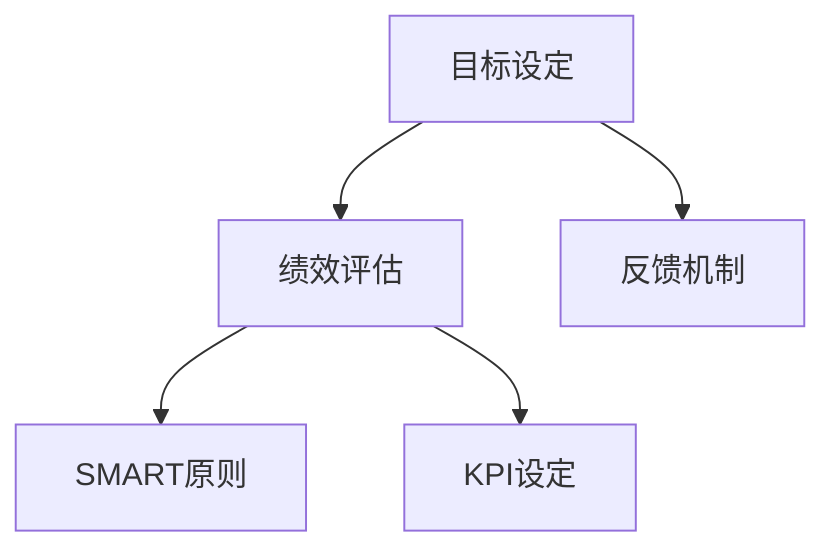

                 

# 目标管理：管理者的领导力

在当今快速变化和高度竞争的商业环境中，有效的目标管理（Goal Management）成为企业管理者领导力的核心要素。目标管理不仅是企业战略执行的关键，也是推动团队协作和员工动力的重要工具。本文将深入探讨目标管理的核心概念、实施步骤及其优缺点，同时分析其在不同领域的实际应用场景，并提出未来发展的趋势和挑战。

## 1. 背景介绍

### 1.1 问题由来
现代企业面临复杂多变的市场环境，如何在不确定性中找到正确的方向和路径，是管理者首要解决的问题。传统自上而下的指令式管理方法，难以激发员工的主动性和创新性。目标管理（Goal Management）作为一种注重结果导向的激励机制，强调明确目标、责任和绩效反馈，成为提升团队协作效率和员工满意度的有效手段。

### 1.2 问题核心关键点
目标管理的关键在于明确目标、确定责任、测量绩效和提供反馈，通过一系列闭环管理措施，帮助团队和个人实现共同目标。关键在于：
1. **SMART原则**：目标必须具体、可衡量、可达成、相关性、时限性（Specific, Measurable, Achievable, Relevant, Time-bound）。
2. **KPI设定**：关键绩效指标（Key Performance Indicators）设定应与公司战略对齐，定期评估。
3. **定期沟通**：管理者与员工之间的定期沟通，确保目标一致性和进展跟踪。
4. **绩效反馈**：定期提供建设性的绩效反馈，激励和改进。

### 1.3 问题研究意义
有效的目标管理有助于提升企业战略执行力，激发员工潜力，提高团队协作效率，同时增强企业的适应性和创新力。目标管理还能通过明确目标和绩效标准，增强员工的归属感和成就感，从而提升企业整体凝聚力。

## 2. 核心概念与联系

### 2.1 核心概念概述

目标管理涉及多个核心概念：

- **目标设定（Goal Setting）**：确定具体的、可衡量的、可达成的、相关性强、时限明确的目标。
- **绩效评估（Performance Evaluation）**：通过关键绩效指标（KPI）和定期反馈，评估团队和个人的绩效。
- **反馈机制（Feedback Mechanism）**：管理者与员工之间的定期沟通和建设性反馈，以提升工作效率和员工满意度。
- **SMART原则**：明确目标制定的具体性、可衡量性、可达成性、相关性和时限性，确保目标的有效性和可行性。

### 2.2 核心概念原理和架构的 Mermaid 流程图



这个流程图展示了目标管理的核心逻辑：

1. 从目标设定开始，明确具体、可衡量的目标。
2. 通过绩效评估，结合KPI设定，定期评估团队和个人的绩效。
3. 引入反馈机制，确保管理者与员工之间的定期沟通和建设性反馈。
4. 所有环节均遵循SMART原则，确保目标的可行性和有效性。

## 3. 核心算法原理 & 具体操作步骤

### 3.1 算法原理概述

目标管理算法原理主要基于目标设定理论和绩效评估理论。其核心思想是通过明确的目标设定和绩效评估，引导团队和个人朝着共同的目标努力，同时通过反馈机制不断优化目标和绩效标准，实现动态调整和持续改进。

### 3.2 算法步骤详解

目标管理的具体实施步骤如下：

**Step 1: 目标设定**

1. **SMART原则应用**：目标应具体、可衡量、可达成、相关性强、时限明确。例如，设定“在三个月内，提高销售额10%”。
2. **KPI设定**：确定与目标相关的关键绩效指标。如销售额、客户满意度、项目交付时间等。
3. **目标分解**：将大目标分解为可执行的小任务，如每周增加5%的销售额。

**Step 2: 绩效评估**

1. **定期评估**：根据设定的KPI，定期（如月度、季度）评估团队和个人绩效。
2. **数据分析**：收集和分析相关数据，评估目标达成情况和绩效表现。
3. **目标调整**：根据评估结果，调整目标和KPI，确保目标的可行性和有效性。

**Step 3: 反馈机制**

1. **定期沟通**：管理者与员工定期进行沟通，了解进展、挑战和改进建议。
2. **建设性反馈**：提供具体、有针对性的反馈，帮助员工改进工作表现。
3. **激励措施**：根据绩效评估结果，提供适当的激励措施，如奖励、晋升、培训等。

### 3.3 算法优缺点

**优点**：
1. **提高执行力**：明确的目标设定和绩效评估，有助于提升团队执行力。
2. **激发员工动力**：通过目标管理和反馈机制，激发员工的主动性和创新性。
3. **优化资源配置**：通过目标分解和绩效评估，合理配置资源，提升资源利用效率。
4. **增强团队协作**：共同的目标和定期的沟通，增强团队协作和凝聚力。

**缺点**：
1. **依赖管理者**：目标管理的有效性依赖于管理者的能力，容易因管理者失误导致目标偏差。
2. **容易产生压力**：高目标设定可能导致员工压力过大，影响身心健康。
3. **灵活性不足**：严格的目标设定和绩效评估，可能导致灵活性不足，难以应对突发情况。
4. **资源消耗大**：定期的绩效评估和沟通，需要大量时间和人力资源，增加管理成本。

### 3.4 算法应用领域

目标管理在多个领域都有广泛应用：

- **企业管理**：帮助企业制定战略目标，提升执行力和绩效。
- **项目管理**：通过项目目标设定和绩效评估，提高项目管理效率。
- **人力资源**：通过员工目标设定和绩效评估，提升人力资源管理效果。
- **市场营销**：设定销售目标和KPI，提升市场推广效果。
- **个人发展**：通过个人目标设定和绩效评估，促进自我提升和职业发展。

## 4. 数学模型和公式 & 详细讲解 & 举例说明

### 4.1 数学模型构建

目标管理的数学模型可以通过以下公式表示：

$$
G = \begin{cases}
G_{i} & \text{if } G_{i} \text{ satisfies SMART criteria} \\
\text{Null} & \text{otherwise}
\end{cases}
$$

其中，$G$ 表示目标，$G_i$ 表示具体的目标。

### 4.2 公式推导过程

**目标设定公式**：
1. 设定目标：$G_{i} = \text{Define specific goal}$
2. 应用SMART原则：$G_{i} = \text{Ensure SMART}$
3. 确定KPI：$KPI_{i} = \text{Define relevant KPIs}$
4. 分解目标：$G_{j} = \text{Break down into smaller tasks}$

**绩效评估公式**：
1. 收集数据：$Data_{j} = \text{Collect relevant data}$
2. 数据分析：$Analysis_{j} = \text{Analyze data}$
3. 绩效评估：$Performance_{j} = \text{Evaluate performance}$

**反馈机制公式**：
1. 定期沟通：$Communication_{k} = \text{Schedule regular communication}$
2. 提供反馈：$Feedback_{k} = \text{Provide constructive feedback}$
3. 激励措施：$Incentives_{k} = \text{Provide appropriate incentives}$

### 4.3 案例分析与讲解

假设某企业设定“提高销售额10%”为目标，具体实施步骤如下：

1. **目标设定**：设定“在三个月内，提高销售额10%”。
2. **KPI设定**：设定KPI为“每月增加2%的销售额”。
3. **目标分解**：分解为每周增加0.5%的销售额。
4. **绩效评估**：每周收集和分析销售数据，评估目标达成情况。
5. **反馈机制**：每周与销售团队沟通，提供反馈和激励。

通过目标管理和绩效评估，企业能够及时调整策略，提升销售效率，达成整体目标。

## 5. 项目实践：代码实例和详细解释说明

### 5.1 开发环境搭建

在目标管理实践中，可以使用Python进行项目开发。具体步骤如下：

1. 安装Python环境：从官网下载Python安装程序，进行安装。
2. 安装相关库：安装NumPy、Pandas、Matplotlib等数据分析和可视化库。
3. 搭建数据仓库：使用SQLite或MySQL搭建数据仓库，存储目标和绩效数据。
4. 搭建应用服务器：使用Flask或Django搭建Web应用服务器。

### 5.2 源代码详细实现

以下是一个简单的目标管理系统的Python代码实现：

```python
import pandas as pd
from flask import Flask, request, jsonify

app = Flask(__name__)

# 目标管理数据仓库
target_db = pd.DataFrame({
    'id': [1, 2, 3],
    'target': ['提高销售额10%', '提升客户满意度', '增加项目交付时间'],
    'start_date': ['2022-01-01', '2022-02-01', '2022-03-01'],
    'end_date': ['2022-03-31', '2022-04-30', '2022-06-30']
})

@app.route('/targets', methods=['GET'])
def get_targets():
    return jsonify(target_db.to_dict(orient='records'))

@app.route('/targets/<int:id>', methods=['GET'])
def get_target(id):
    target = target_db.loc[id]
    return jsonify(target.to_dict())

@app.route('/targets', methods=['POST'])
def add_target():
    data = request.json
    target_db = target_db.append(data, ignore_index=True)
    return jsonify(target_db.to_dict(orient='records'))

@app.route('/targets/<int:id>', methods=['PUT'])
def update_target(id):
    data = request.json
    target_db = target_db.replace(id, data)
    return jsonify(target_db.to_dict(orient='records'))

@app.route('/targets/<int:id>', methods=['DELETE'])
def delete_target(id):
    target_db = target_db.drop(id)
    return jsonify(target_db.to_dict(orient='records'))

if __name__ == '__main__':
    app.run(debug=True)
```

该代码实现了一个简单的目标管理系统，支持目标的增删改查功能。

### 5.3 代码解读与分析

该代码主要使用了Pandas进行数据处理和Flask搭建Web服务。通过定义目标管理数据仓库，实现了目标数据的存储和查询功能。同时，通过Flask的API接口，支持目标的增删改查操作，方便用户和管理员对目标数据进行管理。

### 5.4 运行结果展示

运行该代码后，可以通过浏览器访问目标管理系统，实现目标的创建、修改、查询和删除等功能。

## 6. 实际应用场景

### 6.1 智能制造

在智能制造领域，目标管理可以帮助企业设定生产目标、质量目标、设备维护目标等，通过绩效评估和反馈机制，提升生产效率和质量控制。例如，设定“在三个月内，提高设备利用率10%”，定期评估设备利用率，及时发现和解决设备维护问题，确保生产任务的高效完成。

### 6.2 医疗健康

在医疗健康领域，目标管理可以帮助医院设定患者满意度目标、病患康复率目标等，通过绩效评估和反馈机制，提升医疗服务质量。例如，设定“在六个月内，提高患者满意度5%”，定期评估患者满意度，及时改进医疗服务，提升患者满意度和医疗效果。

### 6.3 教育培训

在教育培训领域，目标管理可以帮助学校设定学生成绩目标、课程质量目标等，通过绩效评估和反馈机制，提升教学质量和学生成绩。例如，设定“在三个月内，提高学生平均成绩5%”，定期评估学生成绩，及时改进教学方法，提升教学效果。

### 6.4 未来应用展望

随着目标管理技术的不断发展和应用，未来将有更多创新方向：

1. **AI驱动的目标管理**：引入AI技术，通过数据挖掘和预测分析，自动生成目标和KPI，提高目标设定的科学性和合理性。
2. **区块链技术的应用**：利用区块链技术，确保目标和绩效数据的透明性和不可篡改性，增强目标管理的可信度和公平性。
3. **多维度目标管理**：引入多维度目标设定，如财务目标、人力资源目标、社会责任目标等，全面提升企业综合管理能力。
4. **全球化目标管理**：通过全球化目标管理，帮助跨国企业在全球范围内实现目标协调和资源优化。
5. **可持续目标管理**：引入可持续目标（Sustainable Development Goals, SDGs），推动企业可持续发展，提升社会责任和企业形象。

## 7. 工具和资源推荐

### 7.1 学习资源推荐

1. **《目标管理：成功经理人必备技能》**：一本系统介绍目标管理理论和方法的经典书籍。
2. **《绩效管理：理论与实践》**：一本详细介绍绩效评估和反馈机制的实用书籍。
3. **Coursera《目标设定与绩效管理》课程**：由宾夕法尼亚大学开设的在线课程，系统讲解目标管理和绩效评估理论。
4. **LinkedIn Learning《目标管理与执行》视频课程**：提供丰富的目标管理实践案例和工具技巧。

### 7.2 开发工具推荐

1. **Jupyter Notebook**：一个强大的Python开发环境，支持数据分析、可视化、机器学习等任务。
2. **PyCharm**：一个高效的Python开发工具，支持代码编写、调试、测试等功能。
3. **Git**：一个版本控制系统，支持代码协作和版本管理。
4. **Flask/Django**：两个流行的Web应用框架，支持快速搭建Web应用和API接口。

### 7.3 相关论文推荐

1. **《目标设定理论》（Goal Setting Theory）**：由Edwin Locke和Gary Latham提出的经典理论，阐述目标设定与绩效的关系。
2. **《绩效评估与反馈：理论与实践》（Performance Evaluation and Feedback: Theory and Practice）**：一本详细介绍绩效评估和反馈机制的实用书籍。
3. **《基于数据的绩效管理》（Data-Driven Performance Management）**：讨论如何通过数据分析和机器学习技术改进绩效管理。

## 8. 总结：未来发展趋势与挑战

### 8.1 研究成果总结

目标管理作为一种科学、系统的管理工具，已经在多个领域得到广泛应用，并取得了显著效果。其核心在于明确目标、确定责任、测量绩效和提供反馈，通过闭环管理措施，推动团队和个人实现共同目标。目标管理在提升执行力、激发员工动力、优化资源配置和增强团队协作方面具有重要意义。

### 8.2 未来发展趋势

未来，目标管理将呈现以下几个发展趋势：

1. **数字化转型**：通过数字化工具和AI技术，实现目标管理和绩效评估的自动化和智能化。
2. **跨领域融合**：目标管理将与其他管理工具和技术进行更深层次的融合，如人力资源管理、项目管理、财务管理等。
3. **全球化管理**：随着全球化的深入发展，目标管理将支持跨国企业的目标协调和资源优化。
4. **可持续目标**：引入可持续目标（SDGs），推动企业实现可持续发展，提升社会责任和企业形象。

### 8.3 面临的挑战

尽管目标管理已经取得了诸多成果，但仍面临一些挑战：

1. **数据质量和隐私问题**：目标和绩效数据的质量和隐私保护，是目标管理面临的重要挑战。
2. **目标设定的灵活性**：目标设定应具有一定的灵活性，以应对突发情况和变化环境。
3. **绩效评估的公平性**：绩效评估应公平、透明，避免偏见和歧视。
4. **员工参与度**：提高员工的参与度和积极性，是目标管理的关键挑战。

### 8.4 研究展望

未来，目标管理的进一步研究应聚焦以下几个方向：

1. **数据驱动的目标设定**：通过数据分析和机器学习技术，实现目标设定的科学化和合理化。
2. **多维度的目标管理**：引入多维度的目标设定，如财务目标、人力资源目标、社会责任目标等，全面提升企业综合管理能力。
3. **可持续目标管理**：推动企业实现可持续发展，提升社会责任和企业形象。
4. **跨领域的融合应用**：将目标管理与其他管理工具和技术进行深度融合，推动企业整体管理水平的提升。

总之，目标管理作为企业管理的重要工具，其研究和应用前景广阔，将在未来企业的发展中发挥更加重要的作用。

## 9. 附录：常见问题与解答

**Q1：目标管理与传统指令式管理有何不同？**

A: 目标管理注重结果导向，强调明确目标、确定责任、测量绩效和提供反馈，通过闭环管理措施，推动团队和个人实现共同目标。而传统指令式管理主要依靠上级命令和下级执行，缺乏明确的目标和反馈机制，难以激发员工的主动性和创新性。

**Q2：目标管理在执行过程中应注意哪些问题？**

A: 目标管理在执行过程中应注意以下几个问题：
1. 目标应具有挑战性和可达性，避免过高或过低。
2. 定期进行绩效评估和反馈，及时发现和解决问题。
3. 提供建设性的反馈，激励员工改进工作表现。
4. 确保目标与企业战略和员工发展方向一致。

**Q3：如何提高目标管理的执行效果？**

A: 提高目标管理执行效果的策略如下：
1. 采用SMART原则，确保目标的明确性和可行性。
2. 定期进行绩效评估和反馈，及时发现和解决问题。
3. 提供建设性的反馈，激励员工改进工作表现。
4. 确保目标与企业战略和员工发展方向一致。

**Q4：目标管理在跨文化环境下应注意哪些问题？**

A: 在跨文化环境下，目标管理应注意以下几个问题：
1. 理解不同文化背景下的工作习惯和价值观。
2. 与员工沟通时，注意语言和文化差异。
3. 确保目标设定和绩效评估的公平性和透明性。
4. 引入本地化管理方法，适应不同文化环境。

**Q5：目标管理在大型企业中的应用效果如何？**

A: 目标管理在大型企业中的应用效果显著，具体表现如下：
1. 提升企业执行力，推动战略目标的实现。
2. 激发员工主动性和创新性，提升团队协作和凝聚力。
3. 优化资源配置，提高生产效率和质量控制。
4. 增强企业的适应性和创新力，提升市场竞争力。

总之，目标管理作为一种科学、系统的管理工具，已经在多个领域得到广泛应用，并取得了显著效果。未来，随着数字化转型和跨领域融合的发展，目标管理将在企业的发展中发挥更加重要的作用。

---

作者：禅与计算机程序设计艺术 / Zen and the Art of Computer Programming

