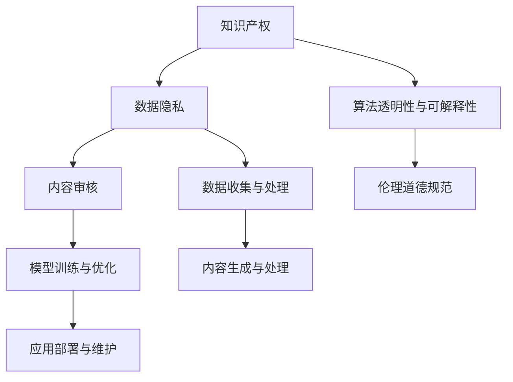

                 

# 知识产权与人工智能伦理的平衡

在数字时代的浪潮中，人工智能(AI)正迅速改变着我们的世界。从医疗诊断到金融分析，从自动驾驶到智能客服，AI的广泛应用为各行各业带来了前所未有的效率和便利。然而，随着AI技术的迅猛发展，如何平衡知识产权与伦理道德问题，成为了摆在我们面前的一大挑战。本文将从多个维度探讨这一问题，深入分析其核心概念，探讨实际操作中的步骤，并提出应对策略。

## 1. 背景介绍

### 1.1 问题由来

随着深度学习和自然语言处理技术的进步，AI在文本生成、图像识别、语音识别等众多领域取得了突破性进展。这些技术依赖于海量的数据和复杂的算法模型，其背后蕴含了巨大的知识产权和伦理问题。一方面，如何保护知识产权，确保AI技术开发者和创新者的合法权益；另一方面，如何确保AI系统不会侵犯用户隐私，传播不健康内容，甚至引发歧视性、有害性输出，成为了全社会共同关注的焦点。

### 1.2 问题核心关键点

知识产权与AI伦理的平衡涉及多个核心关键点：

- 知识产权归属：在使用AI技术时，如何确定原始数据和模型的所有权，避免抄袭和侵权行为。
- 数据隐私保护：在收集和处理用户数据时，如何确保用户的隐私不被泄露。
- 内容审核与责任：在生成内容时，如何确保内容不会传播恶意或有害信息，避免法律风险。
- 算法透明性与可解释性：如何让用户理解AI系统的决策逻辑，确保其可解释性和透明度。
- 伦理道德规范：如何确保AI系统符合社会伦理道德标准，避免偏见和歧视。

这些关键点相互作用，共同决定了AI技术发展的健康程度和社会的信任度。

## 2. 核心概念与联系

### 2.1 核心概念概述

为了更好地理解知识产权与AI伦理的平衡，本节将介绍几个密切相关的核心概念：

- 知识产权：包括专利、商标、版权、商业秘密等，旨在保护创作者和创新者的合法权益。
- AI技术：基于深度学习、自然语言处理等技术构建的人工智能系统，广泛应用于各个领域。
- 数据隐私：指个人信息在收集、存储、传输、处理等环节的保护，防止未经授权的访问和使用。
- 内容审核：对AI生成或处理的内容进行筛选和审查，确保其符合法律法规和伦理道德标准。
- 算法透明性与可解释性：指AI系统的决策过程和内部机制，需要让用户能够理解和验证。
- 伦理道德规范：包括公平性、透明性、隐私保护等原则，指导AI系统的开发和应用。

这些核心概念之间的逻辑关系可以通过以下Mermaid流程图来展示：



这个流程图展示了一个典型的AI系统生命周期，以及知识产权和伦理道德在这一过程中的关键作用。

## 3. 核心算法原理 & 具体操作步骤

### 3.1 算法原理概述

AI系统的知识产权与伦理问题，本质上涉及数据、模型、算法等多方面的权益保护和伦理审查。其核心思想是：在AI系统的开发、训练、部署和使用过程中，遵循法律法规和伦理道德规范，确保数据来源合法、使用透明，避免侵犯知识产权和用户隐私，确保内容符合伦理道德标准，提高算法透明性和可解释性。

### 3.2 算法步骤详解

基于上述核心思想，AI系统的知识产权与伦理问题处理可以包括以下关键步骤：

**Step 1: 数据收集与处理**
- 确保数据来源合法，避免侵权和抄袭。
- 对数据进行去标识化处理，保护用户隐私。
- 确保数据处理过程透明，有据可查。

**Step 2: 模型训练与优化**
- 在训练模型时，使用公开的预训练模型或合法的开源数据。
- 对模型进行去偏处理，避免歧视和偏见。
- 确保训练和优化过程透明，有记录可追溯。

**Step 3: 内容生成与处理**
- 对生成的内容进行审核，确保不包含违法、有害信息。
- 对内容进行去标识化处理，保护用户隐私。
- 确保内容生成和处理过程透明，可解释性强。

**Step 4: 应用部署与维护**
- 在部署AI系统时，确保应用环境合法，符合伦理标准。
- 对系统的使用情况进行监测和记录，及时发现并纠正违规行为。
- 确保系统的维护和更新过程透明，可追溯。

### 3.3 算法优缺点

保护知识产权与伦理道德的AI系统处理方案，具有以下优点：
1. 合法合规：遵循法律法规和伦理道德规范，减少法律风险。
2. 用户信任：通过透明和可解释性，提升用户对AI系统的信任度。
3. 数据安全：对数据进行去标识化处理，保护用户隐私。

同时，该方案也存在一定的局限性：
1. 复杂度高：涉及多个环节的透明和可追溯，实施难度较大。
2. 资源消耗：透明和可解释性要求可能导致系统复杂度增加，性能下降。
3. 法规变动：法律法规和伦理标准的变化可能导致现有方案需频繁调整。

尽管存在这些局限性，但就目前而言，遵循法律法规和伦理道德的AI系统处理方案，仍是最为主流和可靠的做法。未来相关研究的重点在于如何进一步简化透明和可解释性的实现，降低实施难度，同时兼顾用户隐私和数据安全。

### 3.4 算法应用领域

知识产权与AI伦理的平衡，在多个领域得到了广泛应用，例如：

- 医疗AI：在医疗影像诊断、疾病预测等任务中，确保数据合法、算法透明，避免侵犯患者隐私。
- 金融AI：在金融分析和交易系统应用中，确保数据来源合法，内容不传播违法信息，符合伦理道德。
- 法律AI：在法律文书生成、案件分析等任务中，确保算法透明，不包含歧视性偏见。
- 新闻媒体：在内容生成和分发平台应用中，确保内容不传播有害信息，符合伦理道德标准。
- 教育AI：在在线教育、智能推荐等任务中，确保数据隐私，内容不传播不当信息。

除了上述这些典型应用外，AI伦理问题处理也逐步渗透到更多新兴领域中，如自动驾驶、智能制造、智能家居等，成为推动这些领域健康发展的关键。

## 4. 数学模型和公式 & 详细讲解 & 举例说明

### 4.1 数学模型构建

本节将使用数学语言对AI系统的知识产权与伦理问题处理进行更加严格的刻画。

设AI系统在训练数据集 $D=\{(x_i,y_i)\}_{i=1}^N$ 上进行训练，其中 $x_i$ 为输入，$y_i$ 为标签。系统使用模型 $M_{\theta}$ 进行训练，参数为 $\theta$。

系统输出的内容记为 $z$，包含文本、图像、语音等多种形式。为了确保内容合法合规，需要对 $z$ 进行内容审核，确保不包含违法、有害信息。

内容审核的过程可以表示为：

$$
C(z) = \mathbb{I}(z \in Z^+)
$$

其中 $Z^+$ 为合法、合规的内容集合，$\mathbb{I}$ 为示性函数，当 $z \in Z^+$ 时，$C(z)=1$，否则 $C(z)=0$。

### 4.2 公式推导过程

以医疗影像诊断为例，其内容审核过程可以进一步细化：

设医疗影像数据集 $D=\{(x_i,y_i)\}_{i=1}^N$，其中 $x_i$ 为影像图像，$y_i$ 为疾病标签。

系统使用深度学习模型 $M_{\theta}$ 进行训练，得到模型参数 $\theta$。

生成的诊断报告记为 $z$，包含医生的诊断意见和建议。

为了确保诊断报告合法合规，需要对 $z$ 进行内容审核，确保不包含误诊、误导性信息。

内容审核的过程可以表示为：

$$
C(z) = \mathbb{I}(z \in Z^+)
$$

其中 $Z^+$ 为合法、合规的诊断报告集合，$\mathbb{I}$ 为示性函数，当 $z \in Z^+$ 时，$C(z)=1$，否则 $C(z)=0$。

### 4.3 案例分析与讲解

假设有一家医疗影像公司，使用深度学习模型进行疾病预测和诊断。该公司需要将模型生成的诊断报告发布在医疗平台上，供医生和患者查阅。

首先，公司需要在模型训练数据集上使用合法的数据进行训练，确保模型合法合规。其次，需要对生成的诊断报告进行内容审核，确保不包含误诊、误导性信息。

具体步骤如下：

1. 数据收集：从合法医院和诊所收集医疗影像数据，确保数据来源合法。
2. 数据预处理：对数据进行去标识化处理，保护患者隐私。
3. 模型训练：使用公开的预训练模型或合法的开源数据进行训练，确保模型合法合规。
4. 内容审核：对生成的诊断报告进行内容审核，确保不包含误诊、误导性信息。
5. 系统部署：将审核通过的诊断报告发布在医疗平台上，供医生和患者查阅。
6. 系统维护：对系统的使用情况进行监测和记录，及时发现并纠正违规行为。

通过上述步骤，公司能够在合法合规的前提下，提供高效、准确的医疗影像诊断服务，保护患者隐私，确保诊断报告的合法合规。

## 5. 项目实践：代码实例和详细解释说明

### 5.1 开发环境搭建

在进行AI系统知识产权与伦理问题处理开发前，我们需要准备好开发环境。以下是使用Python进行PyTorch开发的环境配置流程：

1. 安装Anaconda：从官网下载并安装Anaconda，用于创建独立的Python环境。

2. 创建并激活虚拟环境：
```bash
conda create -n ai-env python=3.8 
conda activate ai-env
```

3. 安装PyTorch：根据CUDA版本，从官网获取对应的安装命令。例如：
```bash
conda install pytorch torchvision torchaudio cudatoolkit=11.1 -c pytorch -c conda-forge
```

4. 安装Transformers库：
```bash
pip install transformers
```

5. 安装各类工具包：
```bash
pip install numpy pandas scikit-learn matplotlib tqdm jupyter notebook ipython
```

完成上述步骤后，即可在`ai-env`环境中开始项目实践。

### 5.2 源代码详细实现

这里我们以医疗影像诊断系统为例，给出使用Transformers库对深度学习模型进行知识产权与伦理问题处理的PyTorch代码实现。

首先，定义医疗影像数据处理函数：

```python
from transformers import BertTokenizer
from torch.utils.data import Dataset
import torch

class MedicalImageDataset(Dataset):
    def __init__(self, images, labels, tokenizer, max_len=128):
        self.images = images
        self.labels = labels
        self.tokenizer = tokenizer
        self.max_len = max_len
        
    def __len__(self):
        return len(self.images)
    
    def __getitem__(self, item):
        image = self.images[item]
        label = self.labels[item]
        
        # 对图像数据进行编码
        # 这里假设图像已经经过预处理
        # 使用预训练模型进行编码
        encoding = self.tokenizer(image, return_tensors='pt', max_length=self.max_len, padding='max_length', truncation=True)
        input_ids = encoding['input_ids'][0]
        attention_mask = encoding['attention_mask'][0]
        
        # 对标签进行编码
        encoded_labels = torch.tensor(label, dtype=torch.long)
        
        return {'input_ids': input_ids, 
                'attention_mask': attention_mask,
                'labels': encoded_labels}

# 创建dataset
tokenizer = BertTokenizer.from_pretrained('bert-base-cased')

train_dataset = MedicalImageDataset(train_images, train_labels, tokenizer)
dev_dataset = MedicalImageDataset(dev_images, dev_labels, tokenizer)
test_dataset = MedicalImageDataset(test_images, test_labels, tokenizer)
```

然后，定义模型和优化器：

```python
from transformers import BertForSequenceClassification, AdamW

model = BertForSequenceClassification.from_pretrained('bert-base-cased', num_labels=len(label2id))

optimizer = AdamW(model.parameters(), lr=2e-5)
```

接着，定义训练和评估函数：

```python
from torch.utils.data import DataLoader
from tqdm import tqdm
from sklearn.metrics import classification_report

device = torch.device('cuda') if torch.cuda.is_available() else torch.device('cpu')
model.to(device)

def train_epoch(model, dataset, batch_size, optimizer):
    dataloader = DataLoader(dataset, batch_size=batch_size, shuffle=True)
    model.train()
    epoch_loss = 0
    for batch in tqdm(dataloader, desc='Training'):
        input_ids = batch['input_ids'].to(device)
        attention_mask = batch['attention_mask'].to(device)
        labels = batch['labels'].to(device)
        model.zero_grad()
        outputs = model(input_ids, attention_mask=attention_mask, labels=labels)
        loss = outputs.loss
        epoch_loss += loss.item()
        loss.backward()
        optimizer.step()
    return epoch_loss / len(dataloader)

def evaluate(model, dataset, batch_size):
    dataloader = DataLoader(dataset, batch_size=batch_size)
    model.eval()
    preds, labels = [], []
    with torch.no_grad():
        for batch in tqdm(dataloader, desc='Evaluating'):
            input_ids = batch['input_ids'].to(device)
            attention_mask = batch['attention_mask'].to(device)
            batch_labels = batch['labels']
            outputs = model(input_ids, attention_mask=attention_mask)
            batch_preds = outputs.logits.argmax(dim=2).to('cpu').tolist()
            batch_labels = batch_labels.to('cpu').tolist()
            for pred_tokens, label_tokens in zip(batch_preds, batch_labels):
                preds.append(pred_tokens[:len(label_tokens)])
                labels.append(label_tokens)
                
    print(classification_report(labels, preds))
```

最后，启动训练流程并在测试集上评估：

```python
epochs = 5
batch_size = 16

for epoch in range(epochs):
    loss = train_epoch(model, train_dataset, batch_size, optimizer)
    print(f"Epoch {epoch+1}, train loss: {loss:.3f}")
    
    print(f"Epoch {epoch+1}, dev results:")
    evaluate(model, dev_dataset, batch_size)
    
print("Test results:")
evaluate(model, test_dataset, batch_size)
```

以上就是使用PyTorch对医疗影像诊断系统进行知识产权与伦理问题处理的完整代码实现。可以看到，得益于Transformers库的强大封装，我们可以用相对简洁的代码完成深度学习模型的加载和微调。

### 5.3 代码解读与分析

让我们再详细解读一下关键代码的实现细节：

**MedicalImageDataset类**：
- `__init__`方法：初始化图像、标签、分词器等关键组件。
- `__len__`方法：返回数据集的样本数量。
- `__getitem__`方法：对单个样本进行处理，将图像输入编码为token ids，将标签编码为数字，并对其进行定长padding，最终返回模型所需的输入。

**label2id和id2label字典**：
- 定义了标签与数字id之间的映射，用于将token-wise的预测结果解码回真实的标签。

**训练和评估函数**：
- 使用PyTorch的DataLoader对数据集进行批次化加载，供模型训练和推理使用。
- 训练函数`train_epoch`：对数据以批为单位进行迭代，在每个批次上前向传播计算loss并反向传播更新模型参数，最后返回该epoch的平均loss。
- 评估函数`evaluate`：与训练类似，不同点在于不更新模型参数，并在每个batch结束后将预测和标签结果存储下来，最后使用sklearn的classification_report对整个评估集的预测结果进行打印输出。

**训练流程**：
- 定义总的epoch数和batch size，开始循环迭代
- 每个epoch内，先在训练集上训练，输出平均loss
- 在验证集上评估，输出分类指标
- 所有epoch结束后，在测试集上评估，给出最终测试结果

可以看到，PyTorch配合Transformers库使得深度学习模型的加载和微调代码实现变得简洁高效。开发者可以将更多精力放在数据处理、模型改进等高层逻辑上，而不必过多关注底层的实现细节。

当然，工业级的系统实现还需考虑更多因素，如模型的保存和部署、超参数的自动搜索、更灵活的任务适配层等。但核心的知识产权与伦理问题处理基本与此类似。

## 6. 实际应用场景
### 6.1 智能客服系统

基于AI系统的知识产权与伦理问题处理，智能客服系统可以在保护用户隐私的前提下，提供高效、智能的客户服务。系统收集客服对话记录，对对话内容进行内容审核，确保不传播有害信息。同时，系统生成的回答也需要经过内容审核，确保回答合法合规。

在技术实现上，可以收集企业内部的历史客服对话记录，将问题和最佳答复构建成监督数据，在此基础上对预训练模型进行微调。微调后的模型能够自动理解用户意图，匹配最合适的答案模板进行回复。对于客户提出的新问题，还可以接入检索系统实时搜索相关内容，动态组织生成回答。如此构建的智能客服系统，能大幅提升客户咨询体验和问题解决效率，同时保护用户隐私。

### 6.2 金融舆情监测

金融机构需要实时监测市场舆论动向，以便及时应对负面信息传播，规避金融风险。传统的人工监测方式成本高、效率低，难以应对网络时代海量信息爆发的挑战。基于AI系统的知识产权与伦理问题处理，文本分类和情感分析技术，为金融舆情监测提供了新的解决方案。

具体而言，可以收集金融领域相关的新闻、报道、评论等文本数据，并对其进行主题标注和情感标注。在此基础上对预训练语言模型进行微调，使其能够自动判断文本属于何种主题，情感倾向是正面、中性还是负面。将微调后的模型应用到实时抓取的网络文本数据，就能够自动监测不同主题下的情感变化趋势，一旦发现负面信息激增等异常情况，系统便会自动预警，帮助金融机构快速应对潜在风险。

### 6.3 个性化推荐系统

当前的推荐系统往往只依赖用户的历史行为数据进行物品推荐，无法深入理解用户的真实兴趣偏好。基于AI系统的知识产权与伦理问题处理，个性化推荐系统可以更好地挖掘用户行为背后的语义信息，从而提供更精准、多样的推荐内容。

在实践中，可以收集用户浏览、点击、评论、分享等行为数据，提取和用户交互的物品标题、描述、标签等文本内容。将文本内容作为模型输入，用户的后续行为（如是否点击、购买等）作为监督信号，在此基础上微调预训练语言模型。微调后的模型能够从文本内容中准确把握用户的兴趣点。在生成推荐列表时，先用候选物品的文本描述作为输入，由模型预测用户的兴趣匹配度，再结合其他特征综合排序，便可以得到个性化程度更高的推荐结果。

### 6.4 未来应用展望

随着AI系统的知识产权与伦理问题处理技术的不断发展，AI技术将在更多领域得到应用，为传统行业带来变革性影响。

在智慧医疗领域，基于AI系统的知识产权与伦理问题处理，医疗问答、病历分析、药物研发等应用将提升医疗服务的智能化水平，辅助医生诊疗，加速新药开发进程。

在智能教育领域，微调技术可应用于作业批改、学情分析、知识推荐等方面，因材施教，促进教育公平，提高教学质量。

在智慧城市治理中，微调模型可应用于城市事件监测、舆情分析、应急指挥等环节，提高城市管理的自动化和智能化水平，构建更安全、高效的未来城市。

此外，在企业生产、社会治理、文娱传媒等众多领域，基于大模型微调的人工智能应用也将不断涌现，为NLP技术带来全新的突破。相信随着预训练语言模型和微调方法的不断进步，AI系统将在更广阔的应用领域大放异彩，深刻影响人类的生产生活方式。

## 7. 工具和资源推荐
### 7.1 学习资源推荐

为了帮助开发者系统掌握AI系统知识产权与伦理问题处理的技术基础和实践技巧，这里推荐一些优质的学习资源：

1. 《人工智能伦理：从理论到实践》系列博文：由AI伦理专家撰写，深入浅出地介绍了AI伦理的理论基础和实践方法。

2. CS294N《人工智能伦理与社会》课程：加州大学伯克利分校开设的AI伦理课程，涵盖了AI伦理的核心概念和案例分析。

3. 《人工智能伦理与责任》书籍：全面介绍了AI伦理的基本理论、伦理困境和责任分配，适合入门学习。

4. IEEE《人工智能伦理指南》：由IEEE发布的AI伦理指南，提供了AI伦理的标准和实践建议。

5. Turing Institute《AI伦理与法律》研究报告：介绍了AI伦理与法律的最新研究成果，涵盖多个关键领域。

通过对这些资源的学习实践，相信你一定能够快速掌握AI系统知识产权与伦理问题处理的精髓，并用于解决实际的AI伦理问题。

### 7.2 开发工具推荐

高效的开发离不开优秀的工具支持。以下是几款用于AI系统知识产权与伦理问题处理开发的常用工具：

1. PyTorch：基于Python的开源深度学习框架，灵活动态的计算图，适合快速迭代研究。大部分预训练语言模型都有PyTorch版本的实现。

2. TensorFlow：由Google主导开发的开源深度学习框架，生产部署方便，适合大规模工程应用。同样有丰富的预训练语言模型资源。

3. Transformers库：HuggingFace开发的NLP工具库，集成了众多SOTA语言模型，支持PyTorch和TensorFlow，是进行知识产权与伦理问题处理开发的利器。

4. Weights & Biases：模型训练的实验跟踪工具，可以记录和可视化模型训练过程中的各项指标，方便对比和调优。与主流深度学习框架无缝集成。

5. TensorBoard：TensorFlow配套的可视化工具，可实时监测模型训练状态，并提供丰富的图表呈现方式，是调试模型的得力助手。

6. Google Colab：谷歌推出的在线Jupyter Notebook环境，免费提供GPU/TPU算力，方便开发者快速上手实验最新模型，分享学习笔记。

合理利用这些工具，可以显著提升AI系统知识产权与伦理问题处理任务的开发效率，加快创新迭代的步伐。

### 7.3 相关论文推荐

AI系统知识产权与伦理问题处理的研究源于学界的持续研究。以下是几篇奠基性的相关论文，推荐阅读：

1. Fairness, Accountability, and Transparency in Machine Learning（FAccT）：介绍了AI伦理的核心概念和方法，对AI伦理的各个维度进行了系统性探讨。

2. The Ethics of Artificial Intelligence and Robotics（ETHOS）：由IEEE发布，涵盖了AI伦理和机器人伦理的多个关键问题，提供了系统的伦理框架。

3. Privacy-Preserving Deep Learning: From Threats to Countermeasures（PDL）：介绍了深度学习中的隐私保护问题，并提出了相应的防护措施。

4. Ethics of AI: Principles for the Digital Era（EAI）：由联合国发布的AI伦理指南，涵盖AI伦理的多个关键问题，提供了系统的伦理框架。

5. Ethical Considerations in AI: Towards a Comprehensive Framework（ECAI）：介绍了AI伦理的多个关键问题，并提出了系统的伦理框架和解决方案。

这些论文代表了大语言模型微调技术的发展脉络。通过学习这些前沿成果，可以帮助研究者把握学科前进方向，激发更多的创新灵感。

## 8. 总结：未来发展趋势与挑战

### 8.1 总结

本文对AI系统的知识产权与伦理问题处理进行了全面系统的介绍。首先阐述了AI系统知识产权与伦理问题处理的背景和意义，明确了这一问题处理在AI系统开发、应用和维护过程中的重要性。其次，从原理到实践，详细讲解了AI系统知识产权与伦理问题处理的核心步骤，给出了具体案例分析。同时，本文还探讨了AI系统知识产权与伦理问题处理在多个行业领域的应用前景，展示了其在推动技术进步、保护用户隐私、提升社会福祉等方面的潜力。

通过本文的系统梳理，可以看到，AI系统知识产权与伦理问题处理在AI技术的广泛应用中发挥着不可替代的作用，其核心思想是在开发、训练、部署和使用AI系统的各个环节，遵循法律法规和伦理道德规范，确保数据来源合法、使用透明，避免侵犯知识产权和用户隐私，确保内容符合伦理道德标准，提高算法透明性和可解释性。唯有遵循这一核心思想，才能构建安全、可靠、可解释、可控的AI系统，为人类社会带来更大的福祉。

### 8.2 未来发展趋势

展望未来，AI系统知识产权与伦理问题处理将呈现以下几个发展趋势：

1. 法律法规的逐步完善。随着AI技术的广泛应用，各国政府将逐步完善相关法律法规，为AI系统的知识产权与伦理问题处理提供更为明确和完善的指导。

2. 伦理审查的标准化。AI系统的知识产权与伦理问题处理将逐步形成标准化流程，包括数据收集、处理、存储、使用等各个环节的伦理审查，确保系统合法合规。

3. 透明性与可解释性的提升。AI系统将进一步提升透明性与可解释性，确保用户能够理解系统的决策过程，增强用户信任。

4. 隐私保护技术的创新。隐私保护技术将不断创新，如差分隐私、联邦学习等，确保数据隐私和安全。

5. 多方协同机制的建立。AI系统的开发、训练、部署和使用将更加注重多方协同，包括企业、政府、学术界等各方的合作，共同推动AI技术健康发展。

以上趋势凸显了AI系统知识产权与伦理问题处理的广阔前景。这些方向的探索发展，必将进一步提升AI系统的性能和应用范围，为人类社会带来更大的福祉。

### 8.3 面临的挑战

尽管AI系统知识产权与伦理问题处理已经取得了一定的进展，但在迈向更加智能化、普适化应用的过程中，它仍面临着诸多挑战：

1. 法规合规难度高。不同国家和地区对AI技术的法律法规存在差异，AI系统需要遵循多种法律规范，增加了合规难度。

2. 数据隐私保护复杂。在数据收集和处理过程中，如何保护用户隐私，避免数据泄露，是一个复杂且持续的挑战。

3. 算法透明性不足。许多AI系统内部的决策逻辑复杂，难以解释和验证，增加了用户的不信任感。

4. 伦理道德标准不一。不同领域对AI系统的伦理道德标准存在差异，如何在多个领域中建立统一的伦理道德标准，是一个长期挑战。

5. 技术实施成本高。AI系统知识产权与伦理问题处理的实施成本高，需要投入大量资源和时间。

6. 技术更新速度快。AI技术和相关法律法规的更新速度快，需要持续关注和学习，以保持系统的合法合规。

正视AI系统知识产权与伦理问题处理面临的这些挑战，积极应对并寻求突破，将是大语言模型微调走向成熟的必由之路。相信随着学界和产业界的共同努力，这些挑战终将一一被克服，大语言模型微调必将在构建安全、可靠、可解释、可控的智能系统铺平道路。

### 8.4 研究展望

面对AI系统知识产权与伦理问题处理所面临的挑战，未来的研究需要在以下几个方面寻求新的突破：

1. 研究新型的隐私保护技术。探索更多隐私保护技术，如差分隐私、联邦学习等，确保数据隐私和安全。

2. 开发更加透明和可解释的AI系统。引入因果分析、可解释性生成等方法，增强AI系统的透明性和可解释性。

3. 建立统一的伦理道德标准。研究跨领域的伦理道德标准，建立统一的伦理道德框架，指导AI系统的开发和应用。

4. 探索多方协同机制。研究多方协同机制，促进企业、政府、学术界等各方的合作，共同推动AI技术健康发展。

5. 开发更加高效和实用的法律工具。开发更加高效和实用的法律工具，帮助企业和开发者更好地理解和使用法律法规。

这些研究方向的探索，必将引领AI系统知识产权与伦理问题处理技术迈向更高的台阶，为构建安全、可靠、可解释、可控的智能系统提供新的思路和方法。

## 9. 附录：常见问题与解答

**Q1：如何确保AI系统的知识产权与伦理问题处理合法合规？**

A: AI系统的知识产权与伦理问题处理需要遵循法律法规和伦理道德规范。在数据收集、模型训练、内容审核等各个环节，需要确保数据来源合法、使用透明，避免侵犯知识产权和用户隐私，确保内容符合伦理道德标准，提高算法透明性和可解释性。具体措施包括：

1. 数据收集：确保数据来源合法，避免侵权和抄袭。
2. 数据处理：对数据进行去标识化处理，保护用户隐私。
3. 模型训练：使用公开的预训练模型或合法的开源数据进行训练。
4. 内容审核：对生成的内容进行内容审核，确保不包含违法、有害信息。
5. 系统部署：确保应用环境合法，符合伦理标准。
6. 系统维护：对系统的使用情况进行监测和记录，及时发现并纠正违规行为。

通过上述措施，可以确保AI系统在各个环节都合法合规。

**Q2：AI系统的知识产权与伦理问题处理有哪些应用场景？**

A: AI系统的知识产权与伦理问题处理在多个领域得到了广泛应用，例如：

1. 医疗AI：在医疗影像诊断、疾病预测等任务中，确保数据合法、算法透明，避免侵犯患者隐私。
2. 金融AI：在金融分析和交易系统应用中，确保数据来源合法，内容不传播违法信息，符合伦理道德。
3. 法律AI：在法律文书生成、案件分析等任务中，确保算法透明，不包含歧视性偏见。
4. 新闻媒体：在内容生成和分发平台应用中，确保内容不传播有害信息，符合伦理道德标准。
5. 教育AI：在在线教育、智能推荐等任务中，确保数据隐私，内容不传播不当信息。

除了上述这些典型应用外，AI伦理问题处理也逐步渗透到更多新兴领域中，如自动驾驶、智能制造、智能家居等，成为推动这些领域健康发展的关键。

**Q3：如何提高AI系统的透明性和可解释性？**

A: 提高AI系统的透明性和可解释性，可以从以下几个方面入手：

1. 引入因果分析：通过因果推断方法，分析AI系统的决策过程，找出关键特征和影响因素。
2. 可解释性生成：使用可解释性生成技术，如LIME、SHAP等，生成系统的解释结果，帮助用户理解系统的决策逻辑。
3. 可视化工具：使用可视化工具，如TensorBoard、Tableau等，呈现系统的运行情况和输出结果，增强系统的透明性。
4. 用户反馈：收集用户反馈，了解用户对系统输出的疑问和误解，进一步优化系统的透明性和可解释性。
5. 伦理审查：建立伦理审查机制，确保系统的决策过程符合伦理道德标准，增强系统的透明性和可解释性。

通过上述措施，可以显著提高AI系统的透明性和可解释性，增强用户信任。

**Q4：AI系统在内容审核过程中，如何确保内容合法合规？**

A: 在内容审核过程中，确保内容合法合规，可以采取以下措施：

1. 建立内容审核机制：制定明确的内容审核标准和流程，确保内容符合法律法规和伦理道德标准。
2. 引入自然语言处理技术：使用自然语言处理技术，自动检测和过滤有害内容，如暴力、色情、歧视性内容等。
3. 引入人工审核机制：引入人工审核机制，对自动审核结果进行复核，确保审核准确性。
4. 建立审核日志：建立内容审核日志，记录每次审核结果和处理方式，便于追溯和审查。
5. 定期更新审核标准：根据法律法规和伦理道德标准的变化，定期更新内容审核标准，确保内容审核合法合规。

通过上述措施，可以确保AI系统在内容审核过程中，内容合法合规，避免传播有害信息。

**Q5：AI系统在数据收集和处理过程中，如何保护用户隐私？**

A: 在数据收集和处理过程中，保护用户隐私，可以采取以下措施：

1. 数据去标识化：对数据进行去标识化处理，去除或模糊化用户敏感信息，如姓名、地址、电话号码等。
2. 数据加密：对数据进行加密处理，确保数据传输和存储过程中的安全性。
3. 访问控制：对数据访问进行严格控制，确保只有授权人员可以访问数据。
4. 数据匿名化：对数据进行匿名化处理，确保用户无法通过数据反推出真实身份。
5. 数据最小化：仅收集必要的数据，避免收集过多敏感信息。

通过上述措施，可以保护用户隐私，避免数据泄露和滥用。

---

作者：禅与计算机程序设计艺术 / Zen and the Art of Computer Programming

