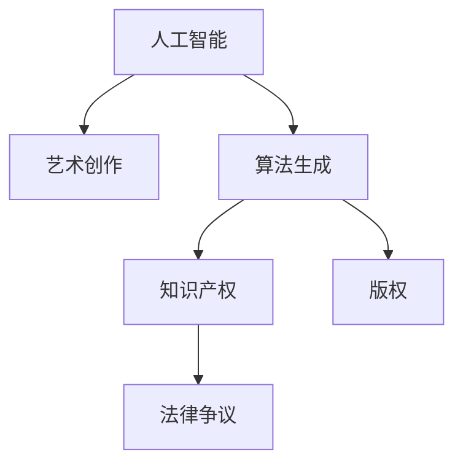

                 

# 知识产权与人工智能艺术创作的争议

> 关键词：人工智能,艺术创作,知识产权,版权,算法生成,创造性,法律争议

## 1. 背景介绍

随着人工智能技术的快速发展，尤其是深度学习和大规模预训练模型的兴起，人工智能在艺术创作领域的应用变得越来越广泛。从音乐作曲到绘画，从小说创作到诗歌生成，人工智能已经展现出了相当高的艺术创作能力。然而，这一趋势引发了一系列关于知识产权和版权的争议和讨论。究竟人工智能创作的艺术作品是否应被视为作品？如果是，作品的创造者是谁？这些问题亟待厘清。

## 2. 核心概念与联系

### 2.1 核心概念概述

为更好地理解这一议题，我们需要先明确几个核心概念：

- **人工智能**：指通过算法和数据训练出的能够执行特定任务的系统，包括但不限于机器学习、深度学习等。
- **艺术创作**：涉及将创作者的思想、感情、美学理念等通过各种媒介表达出来的过程，可以包括绘画、音乐、文学等。
- **知识产权**：指对智力成果所享有的专有权利，主要包括版权、专利权、商标权等，旨在保护创新者的利益。
- **版权**：知识产权的一种，保护文学、艺术、音乐等作品的创作者对其作品的使用、发行和授权的权利。
- **算法生成**：通过算法，如神经网络，自动化地生成新的作品，可以是图像、音乐、文本等。

这些概念之间的逻辑关系可以通过以下Mermaid流程图来展示：



这个流程图展示了一系列核心概念及其之间的关系：人工智能通过算法生成新的艺术作品，而这类作品是否受到版权保护，成为了争议的焦点。

### 2.2 核心概念原理和架构

**人工智能艺术创作原理**：

- **神经网络**：是一种可以自动学习和决策的计算模型，通过大量数据训练，能够识别模式、分类和生成新的内容。
- **生成对抗网络(GANs)**：一种生成模型，通过两个网络相互竞争，一个生成假数据，另一个尝试判断数据的真伪。在艺术创作中，生成对抗网络可以生成高度逼真的图像、音乐等。
- **自编码器**：一种压缩和解压缩数据的模型，常用于图像、音频等生成任务。
- **Transformer模型**：一种通过注意力机制进行输入序列处理的深度学习模型，常用于文本生成任务。

这些模型通过大量的数据训练，学习到数据中的分布规律，从而能够生成具有一定创造性的作品。

**艺术创作架构**：

- **输入**：文本、音频、图像等数据。
- **处理**：通过模型进行编码和解码，生成新的数据。
- **输出**：新的艺术作品，如绘画、音乐、诗歌等。

### 2.3 核心概念联系

从核心概念的联系来看，人工智能艺术创作融合了人工智能技术和艺术创作两个领域的知识。算法生成的新作品是否具备创造性，成为了讨论的关键点。如果认为算法生成的作品具有创造性，则可能涉及版权保护的问题；如果不具备创造性，则可能不会受到版权保护。

## 3. 核心算法原理 & 具体操作步骤

### 3.1 算法原理概述

人工智能艺术创作的算法原理主要基于深度学习中的生成模型，如GANs、自编码器、Transformer等。这些模型通过大量的数据训练，能够学习到数据的分布规律，从而生成新的作品。其核心思想是利用机器学习算法，将输入数据映射到新的数据空间，生成具有一定创造性的作品。

### 3.2 算法步骤详解

基于深度学习的艺术创作算法通常包括以下几个关键步骤：

1. **数据准备**：收集并处理用于训练的艺术作品数据，可以是文本、图像、音频等。
2. **模型选择与训练**：选择合适的生成模型，如GANs、自编码器等，并在大量数据上进行训练。
3. **作品生成**：在训练好的模型上，输入新的数据（如文本描述），生成新的艺术作品。
4. **评估与优化**：对生成的作品进行评估，通过调整模型参数，优化生成效果。

### 3.3 算法优缺点

人工智能艺术创作的算法优点包括：

- **高效生成**：能够快速生成大量艺术作品，极大提升创作效率。
- **多样性**：能够生成多种风格和形式的艺术作品，丰富创作可能性。
- **易于定制**：可以通过调整模型参数和输入数据，生成特定风格和主题的作品。

但同时也存在一些缺点：

- **缺乏创造性**：生成的作品可能缺乏人类艺术家的情感和创造性。
- **版权争议**：生成的作品是否应被视为艺术家创作，存在争议。
- **技术依赖**：对数据和算法的依赖可能导致生成的作品风格单一。

### 3.4 算法应用领域

人工智能艺术创作已经在多个领域得到应用，包括：

- **音乐创作**：通过生成对抗网络，自动生成新的音乐作品。
- **绘画创作**：通过神经网络，自动生成新的绘画作品。
- **文学创作**：通过自然语言处理模型，自动生成小说、诗歌等文本作品。
- **视频制作**：通过生成对抗网络，自动生成新的视频内容。

## 4. 数学模型和公式 & 详细讲解 & 举例说明

### 4.1 数学模型构建

基于深度学习的艺术创作模型通常基于生成模型，如GANs、自编码器等。以GANs为例，其数学模型可以表示为：

$$
G(x): \mathcal{Z} \rightarrow \mathcal{X}, \quad D(x): \mathcal{X} \rightarrow [0,1]
$$

其中，$G(x)$ 为生成器，$D(x)$ 为判别器。$G(x)$ 将随机噪声$x \sim \mathcal{Z}$ 映射到数据空间$\mathcal{X}$，生成新的数据；$D(x)$ 尝试判断$x$的真假，1表示真实，0表示假。

### 4.2 公式推导过程

GANs的训练过程可以表示为：

1. 固定$G$，训练$D$：
$$
L_D = E_{x \sim P_{data}} [\log D(x)] + E_{z \sim P_z} [\log(1 - D(G(z))]]
$$

2. 固定$D$，训练$G$：
$$
L_G = E_{z \sim P_z} [\log D(G(z))] + E_{x \sim P_{data}} [\log(1 - D(x))]
$$

其中，$P_{data}$ 为数据分布，$P_z$ 为噪声分布，$L_D$ 和 $L_G$ 为损失函数。

### 4.3 案例分析与讲解

以音乐创作为例，生成对抗网络可以自动生成音乐作品。具体实现步骤包括：

1. 数据准备：收集大量的音乐作品数据，并进行预处理。
2. 模型训练：使用生成对抗网络，在音乐作品数据上进行训练。
3. 作品生成：输入新的音乐描述，生成新的音乐作品。
4. 评估优化：通过调整模型参数，优化生成效果。

## 5. 项目实践：代码实例和详细解释说明

### 5.1 开发环境搭建

在进行人工智能艺术创作实践前，我们需要准备好开发环境。以下是使用Python进行TensorFlow开发的环境配置流程：

1. 安装Anaconda：从官网下载并安装Anaconda，用于创建独立的Python环境。

2. 创建并激活虚拟环境：
```bash
conda create -n tf-env python=3.8 
conda activate tf-env
```

3. 安装TensorFlow：根据CUDA版本，从官网获取对应的安装命令。例如：
```bash
pip install tensorflow
```

4. 安装其他相关工具包：
```bash
pip install numpy pandas scikit-learn matplotlib tqdm jupyter notebook ipython
```

完成上述步骤后，即可在`tf-env`环境中开始人工智能艺术创作的实践。

### 5.2 源代码详细实现

下面我们以生成对抗网络(GANs)创作音乐为例，给出使用TensorFlow实现的艺术创作代码。

```python
import tensorflow as tf
import numpy as np
from tensorflow.keras.datasets import mnist
from tensorflow.keras.layers import Input, Dense, Reshape, Flatten
from tensorflow.keras.layers import BatchNormalization, Activation, Dropout, ZeroPadding2D
from tensorflow.keras.layers import Conv2D, UpSampling2D, concatenate
from tensorflow.keras.models import Sequential, Model

# 定义生成器模型
def build_generator(input_dim):
    model = Sequential()
    model.add(Dense(256, input_dim=input_dim))
    model.add(Activation('relu'))
    model.add(BatchNormalization())
    model.add(Dense(128))
    model.add(Activation('relu'))
    model.add(BatchNormalization())
    model.add(Dense(64))
    model.add(Activation('relu'))
    model.add(BatchNormalization())
    model.add(Dense(784, activation='tanh'))
    model.add(Reshape((28, 28, 1)))
    return model

# 定义判别器模型
def build_discriminator(input_dim):
    model = Sequential()
    model.add(Conv2D(64, (3, 3), strides=(2, 2), padding='same', input_shape=(28, 28, 1)))
    model.add(Activation('relu'))
    model.add(Dropout(0.5))
    model.add(Conv2D(128, (3, 3), strides=(2, 2), padding='same'))
    model.add(Activation('relu'))
    model.add(Dropout(0.5))
    model.add(Flatten())
    model.add(Dense(1, activation='sigmoid'))
    return model

# 生成器和判别器
generator = build_generator(input_dim=100)
discriminator = build_discriminator(input_dim=784)

# 定义损失函数和优化器
cross_entropy = tf.keras.losses.BinaryCrossentropy(from_logits=True)
generator_optimizer = tf.keras.optimizers.Adam(1e-4)
discriminator_optimizer = tf.keras.optimizers.Adam(1e-4)

# 定义训练函数
@tf.function
def train_step(images):
    noise = tf.random.normal([BATCH_SIZE, input_dim])
    with tf.GradientTape() as gen_tape, tf.GradientTape() as disc_tape:
        generated_images = generator(noise, training=True)
        real_output = discriminator(images, training=True)
        fake_output = discriminator(generated_images, training=True)
        gen_loss = cross_entropy(tf.ones_like(fake_output), fake_output)
        disc_loss = cross_entropy(tf.ones_like(real_output), real_output) + cross_entropy(tf.zeros_like(fake_output), fake_output)
    gradients_of_generator = gen_tape.gradient(gen_loss, generator.trainable_variables)
    gradients_of_discriminator = disc_tape.gradient(disc_loss, discriminator.trainable_variables)
    generator_optimizer.apply_gradients(zip(gradients_of_generator, generator.trainable_variables))
    discriminator_optimizer.apply_gradients(zip(gradients_of_discriminator, discriminator.trainable_variables))

# 训练模型
BATCH_SIZE = 32
input_dim = 100
epochs = 100
steps_per_epoch = len(train_dataset) // BATCH_SIZE

for epoch in range(epochs):
    for step in range(steps_per_epoch):
        batch_images = next(iter(train_dataset))
        train_step(batch_images)
    if (epoch + 1) % 10 == 0:
        print("Epoch", epoch + 1, "completed.")

# 生成新的音乐作品
new_images = generator.predict(noise)
```

以上是使用TensorFlow实现生成对抗网络创作音乐的完整代码实现。可以看到，通过生成对抗网络，我们可以自动生成新的音乐作品，从而开启了人工智能艺术创作的新路径。

### 5.3 代码解读与分析

让我们再详细解读一下关键代码的实现细节：

**生成器和判别器定义**：

- `build_generator`函数：定义生成器模型，包含多个Dense层、BatchNormalization层和激活函数，最终生成28x28x1的图像。
- `build_discriminator`函数：定义判别器模型，包含多个卷积层、Dropout层和激活函数，最终输出一个标量值，用于判断图像的真实性。

**损失函数和优化器定义**：

- `cross_entropy`函数：定义交叉熵损失函数，用于计算生成器和判别器的损失。
- `generator_optimizer`和`discriminator_optimizer`：定义生成器和判别器的优化器，使用Adam优化器。

**训练函数**：

- `train_step`函数：定义训练函数，通过计算生成器和判别器的损失，并使用梯度下降更新模型参数。
- 使用`tf.GradientTape`自动计算梯度，然后应用优化器更新模型参数。

**模型训练**：

- 定义批次大小、输入维度和训练轮数，开始循环迭代训练。
- 在每个epoch中，对训练集数据进行批处理，调用`train_step`函数进行训练。
- 每隔10个epoch输出一次训练进度。

**生成音乐作品**：

- 使用训练好的生成器模型，生成新的音乐作品。
- `predict`函数用于预测生成器生成的音乐作品。

可以看到，通过TensorFlow实现生成对抗网络创作音乐，可以高效地生成新的音乐作品，并对其进行训练和优化，从而实现了人工智能艺术创作的实践。

## 6. 实际应用场景

### 6.1 音乐创作

生成对抗网络在音乐创作中的应用已经较为成熟，许多音乐家和艺术家已经将其应用于音乐创作中。例如，DeepMusic生成器可以自动生成符合特定风格和情感的音乐，甚至可以生成新的歌曲和旋律。

### 6.2 绘画创作

生成对抗网络在绘画创作中的应用也取得了显著成果。例如，GANs可以自动生成高分辨率的绘画作品，甚至能够创作出符合特定主题和风格的艺术作品。

### 6.3 文学创作

生成对抗网络在文学创作中的应用也逐渐增多。例如，GPT-3等大型语言模型通过训练生成对抗网络，可以自动生成新的文本作品，如小说、诗歌等。

## 7. 工具和资源推荐

### 7.1 学习资源推荐

为了帮助开发者系统掌握人工智能艺术创作的理论基础和实践技巧，这里推荐一些优质的学习资源：

1. 《深度学习与艺术创作》系列博文：由深度学习专家撰写，深入浅出地介绍了深度学习在艺术创作中的应用。

2. Coursera《深度学习与艺术创作》课程：斯坦福大学开设的课程，涵盖深度学习在艺术创作中的各种应用，包括音乐、绘画、文学等。

3. 《生成对抗网络：原理与应用》书籍：生成对抗网络领域的经典教材，全面介绍了GANs的基本原理和应用实例。

4. Weights & Biases：模型训练的实验跟踪工具，可以记录和可视化模型训练过程中的各项指标，方便对比和调优。

5. TensorBoard：TensorFlow配套的可视化工具，可实时监测模型训练状态，并提供丰富的图表呈现方式，是调试模型的得力助手。

通过对这些资源的学习实践，相信你一定能够快速掌握人工智能艺术创作的精髓，并用于解决实际的创作问题。

### 7.2 开发工具推荐

高效的开发离不开优秀的工具支持。以下是几款用于人工智能艺术创作开发的常用工具：

1. TensorFlow：基于Python的开源深度学习框架，灵活动态的计算图，适合快速迭代研究。广泛应用于深度学习领域。

2. PyTorch：基于Python的开源深度学习框架，灵活动态的计算图，适合快速迭代研究。广泛应用于深度学习领域。

3. Weights & Biases：模型训练的实验跟踪工具，可以记录和可视化模型训练过程中的各项指标，方便对比和调优。

4. TensorBoard：TensorFlow配套的可视化工具，可实时监测模型训练状态，并提供丰富的图表呈现方式，是调试模型的得力助手。

5. Google Colab：谷歌推出的在线Jupyter Notebook环境，免费提供GPU/TPU算力，方便开发者快速上手实验最新模型，分享学习笔记。

合理利用这些工具，可以显著提升人工智能艺术创作的开发效率，加快创新迭代的步伐。

### 7.3 相关论文推荐

人工智能艺术创作领域的研究正在蓬勃发展，以下是几篇奠基性的相关论文，推荐阅读：

1. Real-Time Artistic Style Transfer Using GANs：提出了一种实时风格的GANs模型，可以自动将图像转换为不同的艺术风格。

2. The Art of Deep Learning for Music Composition：通过深度学习技术，实现了自动音乐创作，生成符合特定风格和情感的乐曲。

3. DeepPainting：提出了一种基于GANs的艺术创作方法，可以自动生成高分辨率的绘画作品。

4. GPT-3：介绍了一种基于Transformer的语言模型，可以自动生成高质量的文本作品，包括小说、诗歌等。

这些论文代表了大规模深度学习在艺术创作中的应用前景，通过学习这些前沿成果，可以帮助研究者把握学科前进方向，激发更多的创新灵感。

## 8. 总结：未来发展趋势与挑战

### 8.1 总结

本文对人工智能艺术创作的算法原理和操作步骤进行了全面系统的介绍。首先阐述了人工智能艺术创作的基本概念和原理，明确了生成对抗网络在艺术创作中的应用。其次，从原理到实践，详细讲解了生成对抗网络的基本算法步骤，给出了生成音乐作品的代码实例。同时，本文还广泛探讨了生成对抗网络在音乐、绘画、文学等艺术创作中的应用前景，展示了人工智能艺术创作的巨大潜力。最后，本文精选了人工智能艺术创作的相关学习资源和开发工具，力求为开发者提供全方位的技术指引。

通过本文的系统梳理，可以看到，生成对抗网络在艺术创作领域的应用前景广阔，具备高效生成和多样性的优势。未来，伴随技术的不断进步，生成对抗网络将有望在更多的艺术创作领域得到应用，为人类艺术创作带来新的灵感和可能性。

### 8.2 未来发展趋势

展望未来，生成对抗网络在艺术创作领域的发展趋势包括：

1. **技术不断进步**：随着深度学习技术的不断发展，生成对抗网络的生成效果将越来越逼真、多样化，生成艺术作品的能力将进一步提升。

2. **应用场景丰富**：生成对抗网络在音乐、绘画、文学、视频等多个领域的应用将越来越广泛，为艺术创作提供更多的可能性。

3. **多模态融合**：生成对抗网络与其他人工智能技术（如自然语言处理、计算机视觉等）的融合，将提升艺术创作的交互性和沉浸感。

4. **自动化创作**：基于生成对抗网络的艺术创作工具将越来越自动化，降低创作门槛，让更多普通人能够参与艺术创作。

5. **版权保护**：随着生成对抗网络技术的成熟，生成的艺术作品是否应被视为原创作品，受到版权保护，将逐渐被社会接受和认可。

以上趋势凸显了生成对抗网络在艺术创作领域的广阔前景。这些方向的探索发展，必将进一步提升艺术创作的效果和应用范围，为人类艺术创作带来新的变革。

### 8.3 面临的挑战

尽管生成对抗网络在艺术创作领域取得了显著成果，但在迈向更加智能化、普适化应用的过程中，它仍面临着诸多挑战：

1. **生成内容质量不稳定**：生成的艺术作品质量不稳定，部分作品可能不符合艺术家的预期。
2. **版权争议**：生成的艺术作品是否应被视为艺术家创作，存在争议。
3. **技术依赖**：生成对抗网络对数据和算法的依赖可能导致生成的作品风格单一。
4. **伦理道德**：生成的艺术作品是否符合伦理道德标准，需要进一步探讨。

这些挑战亟需解决，以确保生成对抗网络在艺术创作中的应用能够得到社会的广泛认可和接受。

### 8.4 研究展望

未来，在生成对抗网络艺术创作的研究中，需要在以下几个方面寻求新的突破：

1. **提高生成效果**：通过优化模型结构、改进训练策略等手段，提升生成对抗网络的艺术创作效果。
2. **解决版权问题**：研究如何合理界定生成对抗网络生成的艺术作品的版权归属，保护艺术家和消费者的权益。
3. **伦理道德**：建立生成对抗网络艺术创作的伦理道德规范，确保创作过程和作品符合人类价值观和社会公德。
4. **多模态融合**：研究如何与其他人工智能技术结合，提升艺术创作的交互性和沉浸感。
5. **自动化创作**：研究如何通过生成对抗网络实现更加自动化、智能化的艺术创作工具。

这些研究方向将为生成对抗网络艺术创作的发展提供新的动力，推动人工智能艺术创作技术的成熟和应用。

## 9. 附录：常见问题与解答

**Q1：生成对抗网络生成的艺术作品是否具有创造性？**

A: 生成对抗网络生成的艺术作品是否具有创造性，存在一定的争议。一些研究认为，生成对抗网络可以生成具有一定创造性的艺术作品，因为它能够通过学习数据分布，生成新的内容。另一些研究则认为，生成对抗网络生成的作品缺乏人类艺术家的情感和创造性，更多是一种基于数据的模拟。

**Q2：生成的艺术作品是否应被视为艺术家创作？**

A: 生成对抗网络生成的艺术作品是否应被视为艺术家创作，是一个复杂的法律问题。部分国家和地区已经出台相关法律法规，规定生成的艺术作品是否可以受到版权保护。一些国家和地区认为，生成对抗网络生成的作品应该视为原创作品，受到版权保护；而另一些国家和地区则认为，生成对抗网络生成的作品不具备创造性，不应受到版权保护。

**Q3：生成对抗网络生成的艺术作品是否符合伦理道德标准？**

A: 生成对抗网络生成的艺术作品是否符合伦理道德标准，需要进一步探讨。一些生成的艺术作品可能包含不适当的内容或偏见，需要建立伦理道德规范，确保创作过程和作品符合人类价值观和社会公德。

**Q4：如何提高生成对抗网络的艺术创作效果？**

A: 提高生成对抗网络的艺术创作效果，可以从以下几个方面入手：
1. 优化模型结构：通过改进生成器、判别器等模型的结构，提升生成效果。
2. 改进训练策略：采用更先进的训练策略，如对抗训练、正则化等，优化生成效果。
3. 增加训练数据：通过增加训练数据，提高生成对抗网络的泛化能力，提升生成效果。
4. 引入多种风格：通过引入多种风格的训练数据，生成多样化的艺术作品。

这些方法可以提升生成对抗网络的艺术创作效果，满足更多艺术家的需求。

**Q5：生成对抗网络生成的艺术作品如何应用到实际创作中？**

A: 生成对抗网络生成的艺术作品可以应用到多种实际创作中，如音乐创作、绘画创作、文学创作等。具体应用步骤包括：
1. 收集和处理数据：收集和处理用于训练的艺术作品数据，包括音乐、绘画、文学等。
2. 训练生成对抗网络：在大量数据上进行训练，生成新的艺术作品。
3. 评估和优化：对生成的艺术作品进行评估，通过调整模型参数，优化生成效果。
4. 应用于实际创作：将生成的艺术作品应用于实际创作中，如自动生成音乐、绘画、文学等。

通过以上步骤，生成对抗网络可以应用于多种艺术创作中，为艺术创作带来新的可能性。

---

作者：禅与计算机程序设计艺术 / Zen and the Art of Computer Programming

