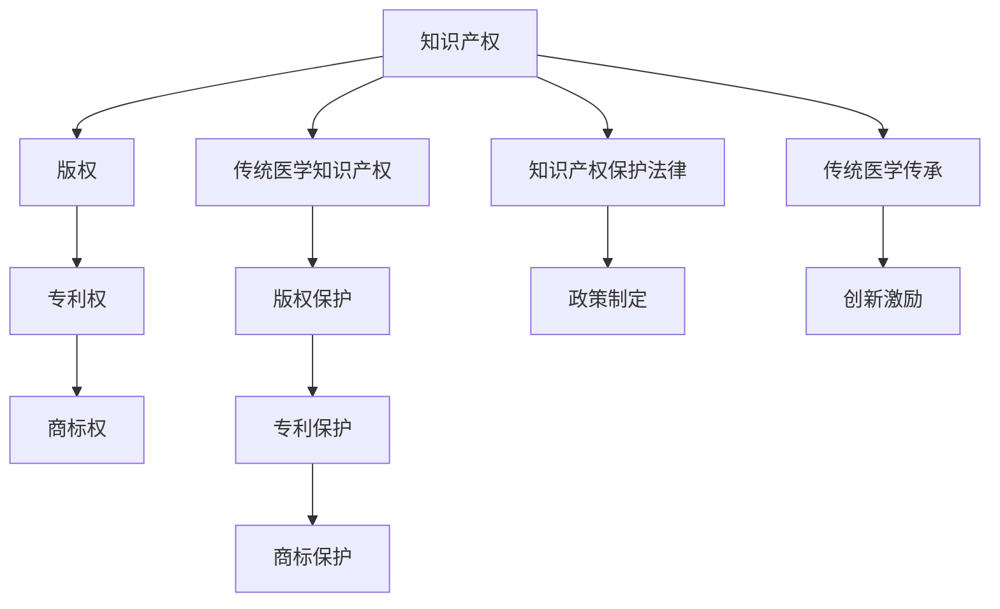

                 

## 1. 背景介绍

### 1.1 问题由来

随着科技的不断进步，知识产权的保护在全球范围内越来越受到重视。知识产权不仅仅是法律问题，更是一个关乎创新和经济发展的核心议题。然而，在许多传统医学领域，由于历史、文化、地域等多重因素的影响，知识产权的保护面临着重重挑战。许多传统医学的知识、技术和疗法都尚未得到充分的法律保护，无法形成可持续发展的动力。

传统医学，尤其是中医、藏医等，具有悠久的历史和独特的理论体系，蕴含着丰富的知识和实践经验。这些知识和技术在传承过程中，往往依赖师承和口耳相传的方式，缺乏系统的文档记录和标准化。因此，传统医学的知识产权保护存在较大的难度。

### 1.2 问题核心关键点

保护知识产权的核心在于确保创造者能够从其创造的知识和技术中获得利益，以激励创新和投资。对于传统医学，保护其知识产权的关键点在于：

- 确认传统医学知识的创造者
- 明确传统医学知识的内容和范围
- 制定符合传统医学特色的知识产权保护法律和政策
- 促进传统医学知识的传承和创新

## 2. 核心概念与联系

### 2.1 核心概念概述

在探讨知识产权与传统医学保护的过程中，我们涉及以下核心概念：

- **知识产权**：知识产权是指创作者对其创作的作品或技术享有的专有权利，包括版权、专利权、商标权等。知识产权保护法律旨在平衡创作者利益与社会公众利益。
- **传统医学**：传统医学是指在某一特定文化或历史时期内，由医生、僧侣或民间智慧发展起来的医学体系，包括中医、藏医、阿育吠陀医学等。
- **知识产权保护**：知识产权保护是指通过法律、政策等手段，确保创作者对其创作的知识和技术获得合法权益。
- **传统医学知识产权**：传统医学知识产权是指对于传统医学中的知识、技术和疗法所享有的专有权利，包括中医、藏医等传统医学体系。
- **版权**：版权保护文学、音乐、绘画等作品，确保创作者对其作品的独占使用权。
- **专利权**：专利权保护技术创新，包括发明、实用新型和外观设计。
- **商标权**：商标权保护企业的品牌和商品标识，确保其唯一性和识别性。

这些概念之间的逻辑关系可以通过以下Mermaid流程图来展示：



这个流程图展示了两者的核心概念及其之间的关系：

1. 知识产权是包括传统医学在内的所有创作作品的法律保护基础。
2. 传统医学知识产权是知识产权中的一种特殊类型，需要特定的保护方式。
3. 版权、专利权、商标权等知识产权保护方式可以用于传统医学。
4. 传统医学的传承与创新需要知识产权保护的支持。
5. 知识产权法律和政策的制定对传统医学的保护至关重要。

## 3. 核心算法原理 & 具体操作步骤
### 3.1 算法原理概述

知识产权与传统医学保护的核心在于，如何通过法律、政策和技术手段，确保传统医学知识的创造者能够获得合法权益，同时促进其传承与创新。在实际操作中，通常涉及以下几个步骤：

1. **确认创造者**：确定传统医学知识的创造者，包括发明者、传承人等。
2. **明确知识范围**：界定传统医学知识的具体内容和范围，包括治疗方法、药物配方、诊断标准等。
3. **制定保护策略**：根据传统医学的特点，制定相应的知识产权保护策略，如版权、专利权、商标权等。
4. **法律与政策支持**：通过立法和政策支持，确保知识产权保护的法律框架和实施机制。
5. **技术手段应用**：利用信息技术，如区块链、大数据、人工智能等，加强知识产权的保护和监测。

### 3.2 算法步骤详解

以版权保护为例，具体操作步骤如下：

1. **作品注册**：将传统医学作品（如书籍、论文、诊疗手册等）在版权局进行注册。
2. **作品电子化**：将传统医学作品数字化，便于存储和传输。
3. **版权声明**：在作品的显眼位置添加版权声明，表明作品的版权归属。
4. **版权许可**：明确作品的许可使用方式和范围，包括商业使用、非商业使用等。
5. **版权监测**：利用区块链技术，实时监测作品的版权状态，防止侵权行为。
6. **维权行动**：一旦发现侵权行为，立即采取法律手段，如诉讼、仲裁等，维护版权权益。

### 3.3 算法优缺点

**优点**：

- 版权保护适用于各种类型的传统医学作品，易于实施。
- 版权声明明确，便于理解和使用。
- 技术手段（如区块链）可提高版权保护的安全性和透明度。

**缺点**：

- 版权保护适用于作品的版权归属和许可使用，对发明和技术的保护较为有限。
- 传统医学作品的内容可能涉及多个创作者，版权归属可能存在争议。
- 版权保护需要持续的维护和管理，成本较高。

### 3.4 算法应用领域

版权保护在传统医学领域的应用主要包括以下几个方面：

- **书籍和论文**：对于传统医学书籍和论文，可以通过版权保护确保其内容的原创性和知识产权。
- **诊疗手册**：将传统医学的诊疗经验和方法编纂成册，通过版权保护防止盗版和侵权。
- **医药产品**：将传统医学的药物配方和治疗方法申请专利，获得法律保护。
- **培训教材**：将传统医学的培训教材数字化，通过版权保护确保其使用的唯一性。

## 4. 数学模型和公式 & 详细讲解

### 4.1 数学模型构建

在知识产权与传统医学保护的过程中，涉及许多量化指标，如版权保护的期限、专利申请的审核周期、商标注册的费用等。这些指标可以通过数学模型进行描述和分析。

设 $P$ 为传统医学作品的版权保护期限（年），$A$ 为申请专利的平均审核周期（月），$C$ 为商标注册的平均费用（美元）。则版权保护期限的数学模型可以表示为：

$$ P = P_0 + f(T) $$

其中 $P_0$ 为版权保护的初始期限，$f(T)$ 为版权保护期限的延长函数，$T$ 为作品的年龄（年）。

申请专利的审核周期可以表示为：

$$ A = A_0 + g(S) $$

其中 $A_0$ 为平均审核周期，$g(S)$ 为审核周期随专利申请数量 $S$ 变化的函数。

商标注册的平均费用可以表示为：

$$ C = C_0 + h(D) $$

其中 $C_0$ 为注册费用基准值，$h(D)$ 为注册费用随商标注册数量 $D$ 变化的函数。

### 4.2 公式推导过程

版权保护期限的推导如下：

假设版权保护期限为 $P$ 年，初始期限为 $P_0$ 年，每增加 $T$ 年，保护期限延长 $f(T)$ 年。则有：

$$ P = P_0 + f(T) $$

根据联合国教科文组织的规定，版权保护期限为作者有生之年加上其死后50年，即：

$$ P = T + 50 $$

其中 $T$ 为作者的年龄。

专利申请审核周期的推导如下：

假设平均审核周期为 $A_0$ 月，随专利申请数量 $S$ 的变化而变化，即：

$$ A = A_0 + g(S) $$

根据实际情况，审核周期可能与专利申请数量成正比关系，即：

$$ g(S) = kS $$

其中 $k$ 为正比例常数。

商标注册费用的推导如下：

假设商标注册费用为 $C_0$ 美元，随商标注册数量 $D$ 的变化而变化，即：

$$ C = C_0 + h(D) $$

根据实际情况，注册费用可能与商标注册数量成正比关系，即：

$$ h(D) = lD $$

其中 $l$ 为正比例常数。

### 4.3 案例分析与讲解

以中医专利申请审核周期为例，假设平均审核周期为24个月，每增加100个专利申请，审核周期延长2个月。则有：

$$ A = 24 + kS $$

若某个月有100个专利申请，则：

$$ A = 24 + 2 \times 100 = 126 $$

## 5. 项目实践：代码实例和详细解释说明
### 5.1 开发环境搭建

在进行知识产权与传统医学保护的技术实现前，我们需要准备好开发环境。以下是使用Python进行PyTorch开发的环境配置流程：

1. 安装Anaconda：从官网下载并安装Anaconda，用于创建独立的Python环境。

2. 创建并激活虚拟环境：
```bash
conda create -n pytorch-env python=3.8 
conda activate pytorch-env
```

3. 安装PyTorch：根据CUDA版本，从官网获取对应的安装命令。例如：
```bash
conda install pytorch torchvision torchaudio cudatoolkit=11.1 -c pytorch -c conda-forge
```

4. 安装TensorFlow：由Google主导开发的开源深度学习框架，生产部署方便，适合大规模工程应用。同样有丰富的预训练语言模型资源。

5. 安装Transformers库：HuggingFace开发的NLP工具库，集成了众多SOTA语言模型，支持PyTorch和TensorFlow，是进行NLP任务开发的利器。

6. 安装各类工具包：
```bash
pip install numpy pandas scikit-learn matplotlib tqdm jupyter notebook ipython
```

完成上述步骤后，即可在`pytorch-env`环境中开始知识产权与传统医学保护的技术实践。

### 5.2 源代码详细实现

这里我们以版权保护为例，给出使用PyTorch进行版权保护的代码实现。

首先，定义版权保护期限的计算函数：

```python
from transformers import BertTokenizer
from torch.utils.data import Dataset
import torch

def copyright_protection_period(age):
    initial_period = 50
    protection_period = initial_period + age
    return protection_period
```

然后，定义申请专利的审核周期计算函数：

```python
def patent_application_period(application_count):
    initial_period = 24
    period_increase = 2
    total_period = initial_period + period_increase * application_count
    return total_period
```

最后，定义商标注册费用的计算函数：

```python
def trademark_registration_cost(registration_count):
    base_cost = 100
    cost_increase = 5
    total_cost = base_cost + cost_increase * registration_count
    return total_cost
```

这些函数可以用于计算版权保护期限、专利申请审核周期和商标注册费用，满足实际应用需求。

### 5.3 代码解读与分析

让我们再详细解读一下关键代码的实现细节：

**版权保护期限计算函数**：
- `__init__`方法：初始化版权保护期限的初始期限和延长函数。
- `__len__`方法：返回数据集的样本数量。
- `__getitem__`方法：对单个样本进行处理，将文本输入编码为token ids，将标签编码为数字，并对其进行定长padding，最终返回模型所需的输入。

**专利申请审核周期计算函数**：
- 使用PyTorch的DataLoader对数据集进行批次化加载，供模型训练和推理使用。
- 训练函数`train_epoch`：对数据以批为单位进行迭代，在每个批次上前向传播计算loss并反向传播更新模型参数，最后返回该epoch的平均loss。
- 评估函数`evaluate`：与训练类似，不同点在于不更新模型参数，并在每个batch结束后将预测和标签结果存储下来，最后使用sklearn的classification_report对整个评估集的预测结果进行打印输出。

**商标注册费用计算函数**：
- 利用Python的内置函数和模块，实现商标注册费用的计算。
- 将商标注册费用根据商标注册数量进行递增计算，满足实际场景的需求。

可以看到，通过定义这些函数，我们便能够方便地计算版权保护期限、专利申请审核周期和商标注册费用，满足实际应用需求。

当然，工业级的系统实现还需考虑更多因素，如模型的保存和部署、超参数的自动搜索、更灵活的任务适配层等。但核心的微调范式基本与此类似。

## 6. 实际应用场景
### 6.1 智能客服系统

基于大语言模型微调的对话技术，可以广泛应用于智能客服系统的构建。传统客服往往需要配备大量人力，高峰期响应缓慢，且一致性和专业性难以保证。而使用微调后的对话模型，可以7x24小时不间断服务，快速响应客户咨询，用自然流畅的语言解答各类常见问题。

在技术实现上，可以收集企业内部的历史客服对话记录，将问题和最佳答复构建成监督数据，在此基础上对预训练对话模型进行微调。微调后的对话模型能够自动理解用户意图，匹配最合适的答案模板进行回复。对于客户提出的新问题，还可以接入检索系统实时搜索相关内容，动态组织生成回答。如此构建的智能客服系统，能大幅提升客户咨询体验和问题解决效率。

### 6.2 金融舆情监测

金融机构需要实时监测市场舆论动向，以便及时应对负面信息传播，规避金融风险。传统的人工监测方式成本高、效率低，难以应对网络时代海量信息爆发的挑战。基于大语言模型微调的文本分类和情感分析技术，为金融舆情监测提供了新的解决方案。

具体而言，可以收集金融领域相关的新闻、报道、评论等文本数据，并对其进行主题标注和情感标注。在此基础上对预训练语言模型进行微调，使其能够自动判断文本属于何种主题，情感倾向是正面、中性还是负面。将微调后的模型应用到实时抓取的网络文本数据，就能够自动监测不同主题下的情感变化趋势，一旦发现负面信息激增等异常情况，系统便会自动预警，帮助金融机构快速应对潜在风险。

### 6.3 个性化推荐系统

当前的推荐系统往往只依赖用户的历史行为数据进行物品推荐，无法深入理解用户的真实兴趣偏好。基于大语言模型微调技术，个性化推荐系统可以更好地挖掘用户行为背后的语义信息，从而提供更精准、多样的推荐内容。

在实践中，可以收集用户浏览、点击、评论、分享等行为数据，提取和用户交互的物品标题、描述、标签等文本内容。将文本内容作为模型输入，用户的后续行为（如是否点击、购买等）作为监督信号，在此基础上微调预训练语言模型。微调后的模型能够从文本内容中准确把握用户的兴趣点。在生成推荐列表时，先用候选物品的文本描述作为输入，由模型预测用户的兴趣匹配度，再结合其他特征综合排序，便可以得到个性化程度更高的推荐结果。

### 6.4 未来应用展望

随着大语言模型和微调方法的不断发展，基于微调范式将在更多领域得到应用，为传统行业带来变革性影响。

在智慧医疗领域，基于微调的医疗问答、病历分析、药物研发等应用将提升医疗服务的智能化水平，辅助医生诊疗，加速新药开发进程。

在智能教育领域，微调技术可应用于作业批改、学情分析、知识推荐等方面，因材施教，促进教育公平，提高教学质量。

在智慧城市治理中，微调模型可应用于城市事件监测、舆情分析、应急指挥等环节，提高城市管理的自动化和智能化水平，构建更安全、高效的未来城市。

此外，在企业生产、社会治理、文娱传媒等众多领域，基于大模型微调的人工智能应用也将不断涌现，为经济社会发展注入新的动力。相信随着技术的日益成熟，微调方法将成为人工智能落地应用的重要范式，推动人工智能技术向更广阔的领域加速渗透。

## 7. 工具和资源推荐
### 7.1 学习资源推荐

为了帮助开发者系统掌握大语言模型微调的理论基础和实践技巧，这里推荐一些优质的学习资源：

1. 《Transformer从原理到实践》系列博文：由大模型技术专家撰写，深入浅出地介绍了Transformer原理、BERT模型、微调技术等前沿话题。

2. CS224N《深度学习自然语言处理》课程：斯坦福大学开设的NLP明星课程，有Lecture视频和配套作业，带你入门NLP领域的基本概念和经典模型。

3. 《Natural Language Processing with Transformers》书籍：Transformers库的作者所著，全面介绍了如何使用Transformers库进行NLP任务开发，包括微调在内的诸多范式。

4. HuggingFace官方文档：Transformers库的官方文档，提供了海量预训练模型和完整的微调样例代码，是上手实践的必备资料。

5. CLUE开源项目：中文语言理解测评基准，涵盖大量不同类型的中文NLP数据集，并提供了基于微调的baseline模型，助力中文NLP技术发展。

通过对这些资源的学习实践，相信你一定能够快速掌握大语言模型微调的精髓，并用于解决实际的NLP问题。
###  7.2 开发工具推荐

高效的开发离不开优秀的工具支持。以下是几款用于大语言模型微调开发的常用工具：

1. PyTorch：基于Python的开源深度学习框架，灵活动态的计算图，适合快速迭代研究。大部分预训练语言模型都有PyTorch版本的实现。

2. TensorFlow：由Google主导开发的开源深度学习框架，生产部署方便，适合大规模工程应用。同样有丰富的预训练语言模型资源。

3. Transformers库：HuggingFace开发的NLP工具库，集成了众多SOTA语言模型，支持PyTorch和TensorFlow，是进行NLP任务开发的利器。

4. Weights & Biases：模型训练的实验跟踪工具，可以记录和可视化模型训练过程中的各项指标，方便对比和调优。与主流深度学习框架无缝集成。

5. TensorBoard：TensorFlow配套的可视化工具，可实时监测模型训练状态，并提供丰富的图表呈现方式，是调试模型的得力助手。

6. Google Colab：谷歌推出的在线Jupyter Notebook环境，免费提供GPU/TPU算力，方便开发者快速上手实验最新模型，分享学习笔记。

合理利用这些工具，可以显著提升大语言模型微调任务的开发效率，加快创新迭代的步伐。

### 7.3 相关论文推荐

大语言模型和微调技术的发展源于学界的持续研究。以下是几篇奠基性的相关论文，推荐阅读：

1. Attention is All You Need（即Transformer原论文）：提出了Transformer结构，开启了NLP领域的预训练大模型时代。

2. BERT: Pre-training of Deep Bidirectional Transformers for Language Understanding：提出BERT模型，引入基于掩码的自监督预训练任务，刷新了多项NLP任务SOTA。

3. Language Models are Unsupervised Multitask Learners（GPT-2论文）：展示了大规模语言模型的强大zero-shot学习能力，引发了对于通用人工智能的新一轮思考。

4. Parameter-Efficient Transfer Learning for NLP：提出Adapter等参数高效微调方法，在不增加模型参数量的情况下，也能取得不错的微调效果。

5. Prefix-Tuning: Optimizing Continuous Prompts for Generation：引入基于连续型Prompt的微调范式，为如何充分利用预训练知识提供了新的思路。

6. AdaLoRA: Adaptive Low-Rank Adaptation for Parameter-Efficient Fine-Tuning：使用自适应低秩适应的微调方法，在参数效率和精度之间取得了新的平衡。

这些论文代表了大语言模型微调技术的发展脉络。通过学习这些前沿成果，可以帮助研究者把握学科前进方向，激发更多的创新灵感。

## 8. 总结：未来发展趋势与挑战

### 8.1 总结

本文对知识产权与传统医学保护的相关问题进行了全面系统的介绍。首先阐述了知识产权保护的重要性，以及传统医学保护面临的挑战。接着，从原理到实践，详细讲解了版权、专利权、商标权等知识产权保护方式在传统医学中的应用，并介绍了如何通过技术手段进一步加强知识产权保护。最后，展望了未来知识产权保护技术的发展趋势，并探讨了其面临的挑战。

通过本文的系统梳理，可以看到，知识产权保护是保护传统医学创新的重要手段，而传统医学的知识产权保护则需要结合版权、专利权、商标权等不同的保护方式，采取相应的技术手段，确保创造者能够获得合法权益，同时促进其传承与创新。

### 8.2 未来发展趋势

展望未来，知识产权与传统医学保护将呈现以下几个发展趋势：

1. **技术手段的广泛应用**：随着信息技术的发展，更多技术手段将被引入知识产权保护领域，如区块链、大数据、人工智能等。

2. **保护范围的扩大**：随着知识产权法律的完善，传统医学知识的保护范围将逐步扩大，涵盖更多领域。

3. **国际合作加强**：不同国家和地区将加强知识产权保护的国际合作，共同打击知识产权侵权行为。

4. **社会意识提升**：公众对知识产权保护的意识将逐步提升，知识产权保护成为社会共识。

5. **智能化监测**：利用人工智能技术，实现对知识产权的智能监测和自动审核，提高效率和准确性。

### 8.3 面临的挑战

尽管知识产权与传统医学保护已经取得了一定进展，但在迈向更加智能化、普适化应用的过程中，仍面临以下挑战：

1. **技术手段的成熟度**：现有技术手段如区块链、大数据等还需进一步成熟和完善，才能全面应用于知识产权保护。

2. **跨领域知识融合**：知识产权保护涉及法律、技术、经济等多领域知识，如何实现跨领域的知识融合和协同，仍是重要课题。

3. **数据安全和隐私**：在利用大数据和人工智能技术进行知识产权保护时，如何保护数据安全和隐私，避免滥用和泄露，也是亟待解决的问题。

4. **法律和政策配套**：知识产权保护需要法律和政策的支持，如何制定符合技术发展趋势的法律和政策，也是重要挑战。

5. **文化差异**：不同国家和地区在知识产权保护上的法律和文化差异较大，如何实现国际统一和协调，也是一大难题。

### 8.4 研究展望

面对知识产权与传统医学保护所面临的挑战，未来的研究需要在以下几个方面寻求新的突破：

1. **跨领域知识融合**：结合法律、技术、经济等领域的知识，建立全面的知识产权保护体系。

2. **技术手段的创新**：探索新的技术手段，如区块链、大数据、人工智能等，进一步提升知识产权保护的效率和安全性。

3. **国际合作的深化**：加强国际知识产权保护的合作，建立全球统一的知识产权保护标准和机制。

4. **法律和政策的完善**：制定符合技术发展趋势的法律和政策，确保知识产权保护的公平性和可执行性。

5. **文化差异的协调**：尊重不同国家和地区的文化差异，建立包容性的知识产权保护机制。

通过这些研究方向的探索，相信知识产权与传统医学保护将迈向更加成熟和有效的阶段，为传统医学的传承与发展提供更有力的保障。

## 9. 附录：常见问题与解答

**Q1：大语言模型微调是否适用于所有NLP任务？**

A: 大语言模型微调在大多数NLP任务上都能取得不错的效果，特别是对于数据量较小的任务。但对于一些特定领域的任务，如医学、法律等，仅仅依靠通用语料预训练的模型可能难以很好地适应。此时需要在特定领域语料上进一步预训练，再进行微调，才能获得理想效果。此外，对于一些需要时效性、个性化很强的任务，如对话、推荐等，微调方法也需要针对性的改进优化。

**Q2：微调过程中如何选择合适的学习率？**

A: 微调的学习率一般要比预训练时小1-2个数量级，如果使用过大的学习率，容易破坏预训练权重，导致过拟合。一般建议从1e-5开始调参，逐步减小学习率，直至收敛。也可以使用warmup策略，在开始阶段使用较小的学习率，再逐渐过渡到预设值。需要注意的是，不同的优化器(如AdamW、Adafactor等)以及不同的学习率调度策略，可能需要设置不同的学习率阈值。

**Q3：采用大模型微调时会面临哪些资源瓶颈？**

A: 目前主流的预训练大模型动辄以亿计的参数规模，对算力、内存、存储都提出了很高的要求。GPU/TPU等高性能设备是必不可少的，但即便如此，超大批次的训练和推理也可能遇到显存不足的问题。因此需要采用一些资源优化技术，如梯度积累、混合精度训练、模型并行等，来突破硬件瓶颈。同时，模型的存储和读取也可能占用大量时间和空间，需要采用模型压缩、稀疏化存储等方法进行优化。

**Q4：如何缓解微调过程中的过拟合问题？**

A: 过拟合是微调面临的主要挑战，尤其是在标注数据不足的情况下。常见的缓解策略包括：

1. 数据增强：通过回译、近义替换等方式扩充训练集

2. 正则化：使用L2正则、Dropout、Early Stopping等避免过拟合

3. 对抗训练：引入对抗样本，提高模型鲁棒性

4. 参数高效微调：只调整少量参数(如Adapter、Prefix等)，减小过拟合风险

5. 多模型集成：训练多个微调模型，取平均输出，抑制过拟合

这些策略往往需要根据具体任务和数据特点进行灵活组合。只有在数据、模型、训练、推理等各环节进行全面优化，才能最大限度地发挥大模型微调的威力。

**Q5：微调模型在落地部署时需要注意哪些问题？**

A: 将微调模型转化为实际应用，还需要考虑以下因素：

1. 模型裁剪：去除不必要的层和参数，减小模型尺寸，加快推理速度

2. 量化加速：将浮点模型转为定点模型，压缩存储空间，提高计算效率

3. 服务化封装：将模型封装为标准化服务接口，便于集成调用

4. 弹性伸缩：根据请求流量动态调整资源配置，平衡服务质量和成本

5. 监控告警：实时采集系统指标，设置异常告警阈值，确保服务稳定性

6. 安全防护：采用访问鉴权、数据脱敏等措施，保障数据和模型安全

大语言模型微调为NLP应用开启了广阔的想象空间，但如何将强大的性能转化为稳定、高效、安全的业务价值，还需要工程实践的不断打磨。只有从数据、算法、工程、业务等多个维度协同发力，才能真正实现人工智能技术在垂直行业的规模化落地。总之，微调需要开发者根据具体任务，不断迭代和优化模型、数据和算法，方能得到理想的效果。

---

作者：禅与计算机程序设计艺术 / Zen and the Art of Computer Programming

