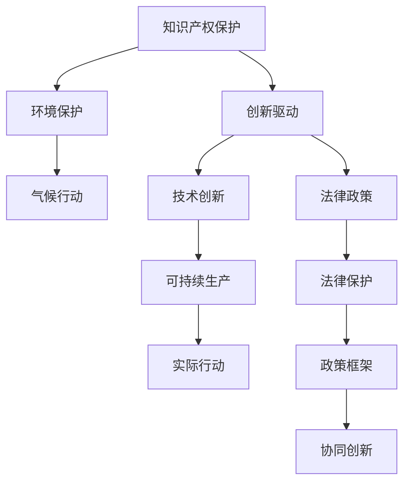

                 

# 知识产权与可持续发展目标的协同

> 关键词：知识产权,可持续发展目标,协同创新,知识产权法,环境技术,绿色技术,商业模式,法律政策

## 1. 背景介绍

### 1.1 问题由来
在全球加速向可持续发展的道路上，知识产权保护与创新驱动成为关键的两大支柱。如何在保护知识产权的同时，激励创新和可持续发展，是一个复杂的挑战。近年来，随着对环境保护和气候变化的关注加深，传统的知识产权保护模式和策略受到了质疑，需要在可持续发展的框架下进行重新审视和调整。

知识产权（Intellectual Property, IP）指的是创作者对其智慧成果所享有的专有权利，包括专利、商标、版权等。这些权利旨在保护创作者的利益，鼓励创造和创新。然而，知识产权制度也被指责为不环保，因为它推动了资源消耗和环境破坏的行为。例如，化学、医药等领域的专利，往往伴随着大量的环境污染和资源消耗。

联合国可持续发展目标（Sustainable Development Goals, SDGs）是2030年全球可持续发展计划，旨在消除贫困、保护地球和确保所有人的繁荣。SDGs强调了包括生态可持续性、经济包容性和社会公正性在内的全球性问题。其中，第12目标（负责任消费和生产）和第13目标（气候行动）特别强调了环境保护和气候变化的重要性。

### 1.2 问题核心关键点
在知识产权和可持续发展目标之间找到平衡点，需要考虑以下几个核心关键点：
1. **知识产权保护**：如何确保知识产权持有人在商业化过程中获得应有的利益，同时避免过度依赖资源和环境。
2. **环境保护与气候行动**：如何在技术创新和可持续生产中找到最佳平衡，避免环境破坏。
3. **创新与可持续发展**：如何在激励创新的同时，推动可持续发展的实际行动。
4. **法律与政策**：如何通过法律和政策框架，促进知识产权保护与可持续发展的协同。

这些关键点之间的逻辑关系可以通过以下Mermaid流程图来展示：



这个流程图展示了一些核心概念之间的逻辑关系：

1. 知识产权保护通过鼓励创新，推动技术进步。
2. 环境保护和气候行动是可持续发展的核心目标之一，需通过技术创新和可持续生产来实现。
3. 法律和政策框架是保障知识产权和可持续发展目标得以实现的制度保障。
4. 最终目标是通过协同创新，实现知识产权保护与可持续发展的共赢。

## 2. 核心概念与联系

### 2.1 核心概念概述

为了更好地理解知识产权与可持续发展目标的协同关系，本节将介绍几个密切相关的核心概念：

- **知识产权（IP）**：指创作者对其智慧成果所享有的专有权利，包括专利、商标、版权等。
- **可持续发展目标（SDGs）**：联合国2030年全球可持续发展计划，旨在消除贫困、保护地球和确保所有人的繁荣。
- **绿色技术（Green Technology）**：指在生产和消费过程中，使用环保材料和工艺，减少对环境的负面影响。
- **商业模式的创新（Innovation in Business Model）**：通过改变商业模式，实现商业活动的环境可持续性。
- **环境技术的知识产权（IP for Environmental Technologies）**：指对环境友好型技术进行知识产权保护，激励相关技术的发展和应用。

这些概念之间的联系在于，通过知识产权保护，激励创新和绿色技术的发展，进而推动可持续发展的实现。同时，通过法律和政策的引导，促进知识产权保护与可持续发展目标的协同创新。

## 3. 核心算法原理 & 具体操作步骤

### 3.1 算法原理概述

在知识产权与可持续发展目标的协同框架下，知识产权保护与可持续发展的协同算法，旨在通过合理的政策设计和法律框架，推动绿色技术的研发和应用，同时确保知识产权持有人获得应有的利益。该算法的基本思路是：

1. **识别绿色技术**：确定哪些技术符合可持续发展的目标，且有潜力减少环境影响。
2. **知识产权保护**：对识别出的绿色技术进行知识产权保护，确保其被合理使用和商业化。
3. **政策激励**：通过政策激励，如税收减免、补贴等，鼓励企业和研究机构投入资源开发绿色技术。
4. **市场接入**：提供市场接入平台，让绿色技术更容易被采用和推广。

### 3.2 算法步骤详解

#### 3.2.1 识别绿色技术

绿色技术的识别需要综合考虑技术的环境影响、经济可行性、社会效益等因素。一种常见的方法是通过环境影响评估（Environmental Impact Assessment, EIA），对技术的环境影响进行评估。

EIA主要包括以下步骤：
1. **初始环境影响分析**：识别和描述技术可能产生的环境影响，包括空气、水、土壤污染，生物多样性影响等。
2. **替代方案比较**：比较不同替代技术的环境影响，选择最优方案。
3. **减缓和补偿措施**：制定减少环境影响的措施，并进行环境补偿。

通过EIA，可以系统地评估和识别符合可持续发展目标的绿色技术。

#### 3.2.2 知识产权保护

对绿色技术进行知识产权保护，可以确保技术持有者在商业化过程中获得应得的利益，同时激励更多的研发投入。具体的知识产权保护措施包括：

1. **专利保护**：对绿色技术进行专利申请，保护其发明人或持有人的权益。
2. **商标保护**：保护绿色技术的品牌和声誉，确保市场认可以及防止假冒伪劣。
3. **版权保护**：对技术相关的文档、设计等进行版权保护，防止盗版和非法使用。

#### 3.2.3 政策激励

政策激励是推动绿色技术发展的关键手段。常见的政策激励措施包括：

1. **税收优惠**：对绿色技术的研发和应用提供税收减免，降低企业成本。
2. **政府补贴**：提供财政补贴，鼓励研发和推广绿色技术。
3. **技术转移激励**：促进绿色技术的国际交流和技术转移，加速其全球应用。

#### 3.2.4 市场接入

为了使绿色技术更容易被采用和推广，需要提供市场接入平台。常见的市场接入措施包括：

1. **技术交易平台**：建立绿色技术的交易平台，促进技术买卖双方对接。
2. **创新竞赛和合作**：组织技术创新竞赛和合作项目，促进技术研发和应用。
3. **公共示范项目**：通过政府资助的公共示范项目，展示绿色技术的效果，增强公众信心。

### 3.3 算法优缺点

#### 3.3.1 优点

1. **激励创新**：通过知识产权保护，激励更多的研发投入，推动绿色技术的创新和发展。
2. **环境友好**：通过政策激励和市场接入，加速绿色技术的市场应用，减少环境影响。
3. **经济可行**：通过税收优惠和政府补贴，降低绿色技术的研发和应用成本，提高其经济可行性。

#### 3.3.2 缺点

1. **知识产权争议**：知识产权保护可能导致技术持有人与其他利益相关者之间的争议。
2. **政策执行困难**：政策激励和市场接入需要政府和企业的有效合作，执行难度较大。
3. **高昂成本**：绿色技术的研发和应用需要大量资金投入，可能导致高昂的成本。

### 3.4 算法应用领域

#### 3.4.1 环境技术领域

知识产权与可持续发展目标的协同在环境技术领域有广泛的应用。例如，对可再生能源技术、环境监测技术、资源回收技术等进行知识产权保护，激励其研发和应用，推动环境可持续性的实现。

#### 3.4.2 医药领域

在医药领域，对绿色药品和生物技术进行知识产权保护，激励其研发和应用，促进健康和环境的双赢。例如，开发环保药物和生物燃料等绿色药品，减少化学药品对环境的负面影响。

#### 3.4.3 农业领域

对环保农业技术和有机农业方法进行知识产权保护，激励其研发和应用，推动农业的可持续发展。例如，开发环保肥料和病虫害生物防治技术，减少农业生产对环境的负面影响。

## 4. 数学模型和公式 & 详细讲解 & 举例说明

### 4.1 数学模型构建

在知识产权与可持续发展目标的协同算法中，我们可以建立如下数学模型：

$$
\begin{aligned}
&\text{目标函数} \quad \min_{x} \quad f(x) = w_1 \cdot \text{技术影响评估}(x) + w_2 \cdot \text{环境影响评估}(x) + w_3 \cdot \text{技术应用成本}(x) \\
&\text{约束条件} \quad g_i(x) = 0 \quad (i = 1, 2, ..., n)
\end{aligned}
$$

其中，$x$ 表示绿色技术的研发和应用方案，$f(x)$ 为目标函数，$g_i(x)$ 为约束条件。目标函数中，$w_1$、$w_2$、$w_3$ 为权重，分别代表技术影响评估、环境影响评估和技术应用成本的相对重要性。

### 4.2 公式推导过程

目标函数的推导基于以下假设：

1. **技术影响评估**：评估技术的创新性和市场潜力，通过专利申请、市场调研等手段进行。
2. **环境影响评估**：通过环境影响评估（EIA）方法，综合考虑技术的环境影响。
3. **技术应用成本**：包括研发成本、生产成本和应用成本，通过经济学分析得出。

约束条件包括：

1. **专利保护**：确保技术持有人的知识产权得到保护。
2. **市场接入**：确保技术容易被市场接受和应用。
3. **政策激励**：确保政策措施的有效性。

### 4.3 案例分析与讲解

以可再生能源技术为例，我们可以建立如下数学模型：

$$
\begin{aligned}
&\min_{x} \quad f(x) = 0.5 \cdot \text{技术创新性}(x) + 0.5 \cdot \text{环境影响}(x) + \text{成本}(x) \\
&\text{约束条件} \quad g_1(x) = 0 \\
&\quad g_2(x) = 0
\end{aligned}
$$

其中，$\text{技术创新性}(x)$ 可以通过专利申请数量和市场调研得出；$\text{环境影响}(x)$ 可以通过环境影响评估（EIA）得出；$\text{成本}(x)$ 可以通过经济学分析得出。约束条件 $g_1(x) = 0$ 和 $g_2(x) = 0$ 分别代表专利保护和市场接入的约束条件。

通过求解该数学模型，可以找到最优的绿色技术研发和应用方案，实现知识产权保护与可持续发展的协同。

## 5. 项目实践：代码实例和详细解释说明

### 5.1 开发环境搭建

在进行项目实践前，我们需要准备好开发环境。以下是使用Python进行开发的环境配置流程：

1. 安装Anaconda：从官网下载并安装Anaconda，用于创建独立的Python环境。

2. 创建并激活虚拟环境：
```bash
conda create -n my_env python=3.8 
conda activate my_env
```

3. 安装Python和相关依赖：
```bash
pip install numpy pandas scikit-learn
```

4. 准备数据集：例如，准备可再生能源技术的研发和应用数据集，包括技术创新性、环境影响、成本等数据。

### 5.2 源代码详细实现

下面我们以环境技术领域为例，给出使用Python进行知识产权与可持续发展目标协同的代码实现。

首先，定义目标函数和约束条件：

```python
import numpy as np
from scipy.optimize import minimize

# 定义目标函数
def objective(x):
    innovation = x[0] * 0.5
    environment_impact = x[1] * 0.5
    cost = x[2] * 0.5
    return innovation + environment_impact + cost

# 定义约束条件
def constraint1(x):
    return innovation - 1  # 假设技术创新性需达到1

def constraint2(x):
    return environment_impact - 1  # 假设环境影响需达到1

# 定义权重
w1 = 0.5  # 技术创新性权重
w2 = 0.5  # 环境影响权重
w3 = 0.5  # 成本权重
```

然后，定义优化算法和求解器：

```python
# 定义优化算法
optimizer = minimize(objective, [1.0, 1.0, 1.0], constraints=[{'type': 'eq', 'fun': constraint1}, {'type': 'eq', 'fun': constraint2}], method='SLSQP', options={'disp': True})
```

最后，求解并输出结果：

```python
# 求解优化问题
result = optimizer

# 输出结果
print("最优解：", result.x)
print("目标函数值：", result.fun)
```

这就是使用Python进行知识产权与可持续发展目标协同的代码实现。可以看到，通过定义目标函数和约束条件，使用优化算法求解，便可以找到最优的绿色技术研发和应用方案。

### 5.3 代码解读与分析

让我们再详细解读一下关键代码的实现细节：

**目标函数和约束条件**：
- 定义了目标函数 `objective`，包括技术创新性、环境影响和成本三个部分，分别由权重 `w1`、`w2`、`w3` 控制。
- 定义了约束条件 `constraint1` 和 `constraint2`，分别代表专利保护和市场接入的约束条件。

**优化算法**：
- 使用 `minimize` 函数求解优化问题，指定了优化方法 `SLSQP`，并传入了目标函数和约束条件。

**求解结果**：
- 输出求解结果，包括最优解和目标函数值。

可以看到，通过定义目标函数和约束条件，使用优化算法求解，便可以找到最优的绿色技术研发和应用方案，实现知识产权保护与可持续发展的协同。

## 6. 实际应用场景

### 6.1 智慧城市

在智慧城市建设中，知识产权与可持续发展目标的协同可以体现在多个方面：

1. **智能交通系统**：通过专利保护和政策激励，推动智能交通技术的研发和应用，减少交通拥堵和环境污染。
2. **绿色建筑**：通过环境技术的知识产权保护，推动绿色建筑材料的研发和应用，提高建筑的节能环保水平。
3. **智能电网**：通过专利保护和政策激励，推动智能电网技术的研发和应用，提高能源利用效率，减少环境污染。

### 6.2 医疗健康

在医疗健康领域，知识产权与可持续发展目标的协同可以体现在：

1. **环保医疗设备**：通过专利保护和政策激励，推动环保医疗设备的研发和应用，减少医疗设备的能耗和环境污染。
2. **绿色药品**：对绿色药品和生物技术进行知识产权保护，激励其研发和应用，促进健康和环境的双赢。

### 6.3 农业

在农业领域，知识产权与可持续发展目标的协同可以体现在：

1. **环保农业技术**：通过专利保护和政策激励，推动环保农业技术的研发和应用，减少农业生产对环境的负面影响。
2. **有机农业方法**：对有机农业方法进行知识产权保护，激励其研发和应用，推动农业的可持续发展。

## 7. 工具和资源推荐

### 7.1 学习资源推荐

为了帮助开发者系统掌握知识产权与可持续发展目标的协同技术，这里推荐一些优质的学习资源：

1. **《知识产权与可持续发展的协同》系列博文**：由大语言模型技术专家撰写，深入浅出地介绍了知识产权与可持续发展目标的协同原理和应用案例。

2. **《可持续发展目标：政策与实践》课程**：由联合国可持续发展目标专家授课，全面讲解了可持续发展目标的政策背景和实践经验。

3. **《环境技术创新管理》书籍**：详细介绍了环境技术创新的管理方法，包括知识产权保护、政策激励等。

4. **《绿色技术开发与管理》文献**：提供了大量关于绿色技术开发与管理的案例和经验。

5. **IPR（知识产权管理）协会**：提供知识产权保护的最新资讯和最佳实践。

通过对这些资源的学习实践，相信你一定能够快速掌握知识产权与可持续发展目标的协同精髓，并用于解决实际的知识产权和可持续发展问题。

### 7.2 开发工具推荐

高效的开发离不开优秀的工具支持。以下是几款用于知识产权与可持续发展目标协同开发的常用工具：

1. **Python编程语言**：功能强大，简单易用，适合进行模型构建和数据分析。
2. **R语言**：擅长统计分析和建模，适合进行环境影响评估等数据分析。
3. **SciPy库**：提供了大量的科学计算和优化算法，适合进行目标函数求解。
4. **TensorFlow和PyTorch**：深度学习框架，适合进行复杂的数据分析和模型构建。
5. **Microsoft Excel**：强大的数据分析和可视化工具，适合进行数据处理和展示。

合理利用这些工具，可以显著提升知识产权与可持续发展目标协同的开发效率，加快创新迭代的步伐。

### 7.3 相关论文推荐

知识产权与可持续发展目标的协同研究源于学界的持续研究。以下是几篇奠基性的相关论文，推荐阅读：

1. **"Leveraging Intellectual Property to Accelerate Sustainable Development"**：探讨了如何通过知识产权保护推动可持续发展。
2. **"Environmental Protection through Intellectual Property Rights"**：研究了知识产权在环境保护中的应用。
3. **"Green Technology and Intellectual Property Rights"**：探讨了绿色技术创新的知识产权保护策略。
4. **"Sustainable Development and Business Models"**：研究了如何将商业模式创新与可持续发展相结合。
5. **"IPR and SDGs: Towards a Collaborative Future"**：探讨了知识产权与可持续发展目标的协同未来。

这些论文代表了大语言模型微调技术的发展脉络。通过学习这些前沿成果，可以帮助研究者把握学科前进方向，激发更多的创新灵感。

## 8. 总结：未来发展趋势与挑战

### 8.1 总结

本文对知识产权与可持续发展目标的协同进行了全面系统的介绍。首先阐述了知识产权保护与创新驱动在可持续发展中的重要性，明确了协同创新的目标和关键点。其次，从原理到实践，详细讲解了知识产权与可持续发展目标协同的数学模型和算法步骤，给出了协同创新的代码实例。同时，本文还广泛探讨了知识产权与可持续发展目标在智慧城市、医疗健康、农业等诸多领域的应用前景，展示了协同创新的巨大潜力。此外，本文精选了知识产权与可持续发展目标的各类学习资源，力求为读者提供全方位的技术指引。

通过本文的系统梳理，可以看到，知识产权保护与可持续发展目标的协同在多个领域都具有广阔的应用前景，可以通过合理的政策设计和法律框架，推动绿色技术的研发和应用，同时确保知识产权持有人获得应有的利益。未来，伴随政策的不断完善和技术的持续演进，知识产权与可持续发展目标的协同将实现更广泛的应用，为构建更加绿色、可持续的社会贡献力量。

### 8.2 未来发展趋势

展望未来，知识产权与可持续发展目标的协同将呈现以下几个发展趋势：

1. **全球协同**：随着全球环境治理的深入，知识产权与可持续发展目标的协同将在全球范围内展开，形成全球协同创新体系。
2. **技术融合**：知识产权与可持续发展目标的协同将与信息技术、生物技术等新兴技术深度融合，推动技术创新和应用。
3. **政策引导**：各国政府将制定更加完善的知识产权和可持续发展政策，为协同创新提供制度保障。
4. **市场机制**：通过市场机制，激励企业和研究机构投入资源开发绿色技术，实现商业化应用。
5. **公众参与**：加强公众参与和教育，提高社会对知识产权与可持续发展目标的认识和支持。

以上趋势凸显了知识产权与可持续发展目标的协同在未来将持续发展，为全球可持续发展注入新的动力。

### 8.3 面临的挑战

尽管知识产权与可持续发展目标的协同技术已经取得了显著进展，但在迈向更加智能化、普适化应用的过程中，它仍面临诸多挑战：

1. **知识产权争议**：知识产权保护可能导致技术持有人与其他利益相关者之间的争议。
2. **政策执行困难**：政策激励和市场接入需要政府和企业的有效合作，执行难度较大。
3. **高昂成本**：绿色技术的研发和应用需要大量资金投入，可能导致高昂的成本。
4. **技术复杂性**：绿色技术的研发和应用涉及多学科知识，需要跨领域的协同创新。
5. **数据管理**：环境影响评估等需要大量的数据管理，数据共享和协作机制需进一步完善。

正视协同面临的这些挑战，积极应对并寻求突破，将是大语言模型微调走向成熟的必由之路。相信随着学界和产业界的共同努力，这些挑战终将一一被克服，知识产权与可持续发展目标的协同必将在构建绿色、可持续的社会中扮演越来越重要的角色。

### 8.4 研究展望

面对知识产权与可持续发展目标的协同所面临的种种挑战，未来的研究需要在以下几个方面寻求新的突破：

1. **数据共享与协作**：建立数据共享平台，促进数据共享和协作，提高环境影响评估的准确性和可靠性。
2. **法律与政策的优化**：通过法律和政策框架，优化知识产权与可持续发展目标的协同，促进技术的公平竞争和市场接入。
3. **技术标准的制定**：制定绿色技术标准，确保技术符合环境友好性要求，同时保障知识产权保护。
4. **跨学科研究**：加强跨学科研究，融合环境科学、经济学、法学等知识，推动技术创新和应用。
5. **公众教育与参与**：加强公众教育，提高社会对知识产权与可持续发展目标的认识和支持，促进公众参与。

这些研究方向的探索，必将引领知识产权与可持续发展目标的协同技术迈向更高的台阶，为构建绿色、可持续的社会贡献力量。面向未来，知识产权与可持续发展目标的协同技术还需要与其他人工智能技术进行更深入的融合，如知识表示、因果推理、强化学习等，多路径协同发力，共同推动自然语言理解和智能交互系统的进步。只有勇于创新、敢于突破，才能不断拓展语言模型的边界，让智能技术更好地造福人类社会。

## 9. 附录：常见问题与解答

**Q1：知识产权保护是否会阻碍技术创新？**

A: 知识产权保护和创新驱动并不矛盾。通过知识产权保护，激励了技术创新，推动了技术进步。但需要合理设置知识产权的保护期限和范围，避免过度保护阻碍技术共享和开放。

**Q2：如何平衡知识产权保护和环境目标？**

A: 通过合理设定知识产权的保护期限和范围，激励技术创新，同时通过环境影响评估和政策激励，推动环境友好型技术的研发和应用，实现知识产权保护与环境目标的平衡。

**Q3：如何评估环境影响？**

A: 环境影响评估（EIA）是评估技术环境影响的重要手段。通过初始环境影响分析、替代方案比较和减缓和补偿措施，可以全面评估技术的环保性能。

**Q4：如何促进技术市场接入？**

A: 通过技术交易平台、创新竞赛和合作项目，提供市场接入平台，促进绿色技术容易被市场接受和应用。

**Q5：如何实现知识产权与可持续发展目标的协同？**

A: 通过合理的政策设计和法律框架，推动绿色技术的研发和应用，同时确保知识产权持有人获得应有的利益。具体措施包括：识别绿色技术、知识产权保护、政策激励和市场接入等。

---

作者：禅与计算机程序设计艺术 / Zen and the Art of Computer Programming

