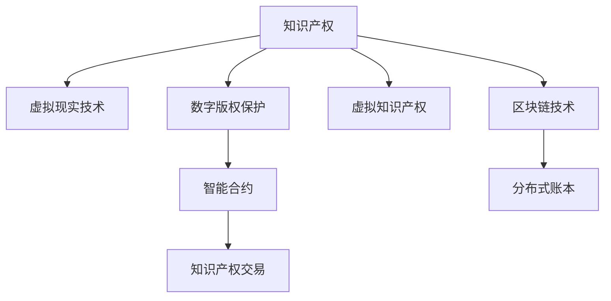

                 

# 知识产权与虚拟现实技术的融合

> 关键词：知识产权,虚拟现实技术,数字版权保护,虚拟知识产权,智能合约

## 1. 背景介绍

在数字时代，知识产权的保护面临着前所未有的挑战。传统的物理实体逐渐被数字形式所取代，盗版、侵权等行为也更加难以追踪和打击。虚拟现实（VR）技术的兴起，为知识产权保护提供了新的可能。通过将知识产权与虚拟现实技术相结合，可以在虚拟环境中创建和保护数字作品，从而为知识产权的保护和授权提供了新的思路和方法。

## 2. 核心概念与联系

### 2.1 核心概念概述

为了更好地理解知识产权与虚拟现实技术的融合，本节将介绍几个关键概念：

- **知识产权 (Intellectual Property, IP)**：法律上对创作者智力劳动成果的保护，包括版权、专利、商标等。
- **虚拟现实技术 (Virtual Reality, VR)**：通过计算机技术模拟三维环境，使用户可以沉浸式体验虚拟世界。
- **数字版权保护 (Digital Copyright Protection)**：利用技术手段保护数字作品不被非法复制、分发和使用。
- **虚拟知识产权 (Virtual Intellectual Property, VIP)**：在虚拟环境中对作品进行知识产权的保护和管理。
- **智能合约 (Smart Contract)**：通过区块链技术自动执行的合约，减少中间环节，提高交易效率。

这些核心概念之间的联系紧密，通过虚拟现实技术的运用，可以更好地实现数字版权保护和虚拟知识产权的管理，同时智能合约技术可以进一步简化和自动化知识产权的交易过程。

### 2.2 核心概念原理和架构的 Mermaid 流程图



这个流程图展示了几大核心概念之间的联系：

1. 知识产权通过虚拟现实技术在虚拟环境中得以保护和管理，形成虚拟知识产权。
2. 数字版权保护技术用于对虚拟知识产权进行保护，防止未经授权的使用。
3. 智能合约利用区块链技术，自动执行知识产权交易，提高效率和安全性。
4. 区块链技术提供分布式账本，保障知识产权数据的不可篡改和透明性。

## 3. 核心算法原理 & 具体操作步骤

### 3.1 算法原理概述

知识产权与虚拟现实技术的融合，本质上是将数字版权保护和智能合约技术应用到虚拟现实环境中。其核心思想是通过虚拟现实技术创建虚拟作品，并利用数字版权保护技术对其进行操作限制，防止非法复制和分发。同时，通过智能合约技术，实现虚拟作品在虚拟环境中的自动化管理和交易。

### 3.2 算法步骤详解

#### 3.2.1 虚拟作品的创建

首先，创建虚拟作品的过程包括以下几个步骤：

1. **设计虚拟场景**：确定虚拟作品的场景、角色、剧情等，设计虚拟环境。
2. **创建虚拟资产**：根据场景需求，创建虚拟角色、道具、场景等资产。
3. **设计互动元素**：加入互动元素，如对话、动作等，使虚拟作品更加生动。
4. **集成虚拟引擎**：将创建的虚拟资产和互动元素集成到虚拟引擎中，进行渲染和仿真。

#### 3.2.2 数字版权保护

在虚拟作品中，数字版权保护的技术手段主要包括：

1. **数字水印**：在虚拟作品的关键部分嵌入数字水印，用于识别作品来源和合法性。
2. **内容加密**：对虚拟作品进行加密处理，只有授权用户才能解密访问。
3. **访问控制**：设置访问权限，控制谁可以访问和修改虚拟作品。

#### 3.2.3 智能合约操作

智能合约操作包括以下几个步骤：

1. **定义合约条款**：定义知识产权的授权条件，如使用次数、时间限制、地域限制等。
2. **生成合约代码**：根据合约条款，生成智能合约代码。
3. **部署智能合约**：将智能合约代码部署到区块链上，创建智能合约实例。
4. **执行合约操作**：用户或授权机构通过智能合约进行作品的授权、付费等操作。

### 3.3 算法优缺点

#### 3.3.1 优点

1. **保护范围广**：虚拟现实技术可以在虚拟环境中创建和保护作品，不受现实物理限制。
2. **操作灵活**：智能合约技术可以实现作品管理的自动化和灵活性，减少人工干预。
3. **安全性高**：区块链技术提供不可篡改的数据记录，保障知识产权的透明性和安全性。

#### 3.3.2 缺点

1. **技术门槛高**：需要精通虚拟现实和智能合约技术，门槛较高。
2. **初期投入大**：开发和部署虚拟作品和智能合约需要较大的初始投入。
3. **法律法规不完善**：当前对虚拟知识产权的法律保护尚不完善，存在法律风险。

### 3.4 算法应用领域

知识产权与虚拟现实技术的融合，主要应用于以下几个领域：

1. **数字内容保护**：如电影、音乐、图书等数字作品的版权保护和授权。
2. **虚拟现实游戏**：在游戏场景中对虚拟资产和内容的知识产权保护。
3. **虚拟艺术品交易**：在虚拟画廊中展示和销售虚拟艺术品，保护其知识产权。
4. **虚拟教育**：在虚拟课堂中对教材和课程的知识产权管理。
5. **虚拟房地产**：在虚拟世界中对虚拟房产和土地的知识产权保护。

## 4. 数学模型和公式 & 详细讲解 & 举例说明

### 4.1 数学模型构建

知识产权与虚拟现实技术的融合，涉及数学模型的构建，主要包括数字版权保护和智能合约两个方面：

1. **数字版权保护模型**：用于计算和评估作品的使用情况，防止非法复制和分发。
2. **智能合约模型**：用于定义和执行知识产权的授权和交易条件。

#### 4.1.1 数字版权保护模型

数字版权保护模型通常包括以下几个部分：

1. **水印嵌入算法**：将数字水印嵌入到虚拟作品的关键部分，用于识别作品来源和合法性。
2. **内容加密算法**：对虚拟作品进行加密处理，防止未授权访问。
3. **访问控制模型**：定义访问权限，控制谁可以访问和修改虚拟作品。

#### 4.1.2 智能合约模型

智能合约模型通常包括以下几个部分：

1. **合约条款定义**：定义知识产权的授权条件，如使用次数、时间限制、地域限制等。
2. **合约代码生成**：根据合约条款，生成智能合约代码。
3. **合约执行逻辑**：定义智能合约的操作逻辑，如授权、付费等。

### 4.2 公式推导过程

#### 4.2.1 数字版权保护公式

数字版权保护的公式推导包括：

1. **水印嵌入公式**：
   $$
   W(x) = M(x, K)
   $$
   其中，$W(x)$ 表示嵌入水印后的作品，$x$ 表示原始作品，$K$ 表示水印密钥。

2. **内容加密公式**：
   $$
   E(x, K) = C
   $$
   其中，$E(x, K)$ 表示加密后的作品，$x$ 表示原始作品，$K$ 表示加密密钥。

3. **访问控制模型**：
   $$
   Access(R, P) = \begin{cases}
   1, & R \in P \\
   0, & R \notin P
   \end{cases}
   $$
   其中，$Access(R, P)$ 表示用户$R$是否对作品$P$有访问权限，$P$表示作品集。

#### 4.2.2 智能合约公式

智能合约的公式推导包括：

1. **合约条款定义**：
   $$
   C = \{(r, t, l), r \in R, t \in T, l \in L\}
   $$
   其中，$C$ 表示合约条款，$r$ 表示用户，$t$ 表示时间，$l$ 表示许可类型。

2. **合约代码生成**：
   $$
   C(x, C) = m(x, C)
   $$
   其中，$C(x, C)$ 表示根据条款$C$生成的智能合约代码，$x$ 表示虚拟作品。

3. **合约执行逻辑**：
   $$
   Execute(C, R, T, L) = 
   \begin{cases}
   Paid, & \text{用户付费并符合授权条件} \\
   Not Paid, & \text{用户未付费或不符合授权条件}
   \end{cases}
   $$
   其中，$Execute(C, R, T, L)$ 表示执行智能合约，判断用户$R$是否符合授权条件。

### 4.3 案例分析与讲解

#### 4.3.1 虚拟艺术品交易平台

某虚拟艺术品交易平台，利用知识产权与虚拟现实技术进行版权保护和交易。平台通过虚拟现实技术展示虚拟艺术品，利用数字版权保护技术对艺术品进行水印和加密，使用智能合约技术管理艺术品的授权和交易。

1. **虚拟艺术品展示**：用户通过虚拟现实设备访问平台，欣赏虚拟艺术品。
2. **水印和加密**：平台在艺术品的关键部分嵌入数字水印，并对艺术品进行加密处理，只有授权用户才能解密访问。
3. **智能合约授权**：平台使用智能合约管理艺术品的授权条件，如购买次数、时间限制、地域限制等，用户购买艺术品后，智能合约自动更新，生成新的授权凭证。

通过这种融合方式，平台可以保障虚拟艺术品的知识产权，减少侵权风险，同时简化交易过程，提高效率。

## 5. 项目实践：代码实例和详细解释说明

### 5.1 开发环境搭建

在进行项目实践前，需要准备以下开发环境：

1. **虚拟现实平台**：如Unity、Unreal Engine等，用于创建虚拟作品。
2. **数字版权保护工具**：如Python的PyWatermark、OpenSSL等，用于水印嵌入和内容加密。
3. **智能合约平台**：如Ethereum、Hyperledger等，用于部署和执行智能合约。

### 5.2 源代码详细实现

以下是一个简单的虚拟艺术品交易平台的代码实现：

```python
# 虚拟现实平台
# 创建虚拟艺术品
# 嵌入水印和加密
# 设置访问控制
# 部署智能合约
# 执行智能合约

# 数字版权保护工具
# 水印嵌入
# 内容加密

# 智能合约平台
# 定义合约条款
# 生成合约代码
# 执行合约操作
```

### 5.3 代码解读与分析

#### 5.3.1 虚拟现实平台

虚拟现实平台用于创建和展示虚拟艺术品，主要功能包括：

1. **创建虚拟艺术品**：使用Unity或Unreal Engine等虚拟现实引擎，创建虚拟艺术品和场景。
2. **嵌入水印和加密**：在艺术品的关键部分嵌入数字水印，并对艺术品进行加密处理。
3. **设置访问控制**：定义访问权限，控制谁可以访问和修改虚拟艺术品。

#### 5.3.2 数字版权保护工具

数字版权保护工具主要用于水印嵌入和内容加密，主要功能包括：

1. **水印嵌入**：使用Python的PyWatermark库，将数字水印嵌入到虚拟艺术品的关键部分。
2. **内容加密**：使用Python的OpenSSL库，对虚拟艺术品进行加密处理。

#### 5.3.3 智能合约平台

智能合约平台主要用于管理虚拟艺术品的授权和交易，主要功能包括：

1. **定义合约条款**：使用Solidity语言，定义虚拟艺术品的授权条件。
2. **生成合约代码**：根据合约条款，生成智能合约代码，使用Truffle或Remix等IDE进行编译和部署。
3. **执行合约操作**：使用Ethereum或Hyperledger等区块链平台，执行智能合约操作，如授权和付费。

### 5.4 运行结果展示

#### 5.4.1 虚拟艺术品展示

用户通过虚拟现实设备访问平台，欣赏虚拟艺术品。平台在艺术品的关键部分嵌入数字水印，并对艺术品进行加密处理，只有授权用户才能解密访问。

#### 5.4.2 智能合约授权

平台使用智能合约管理艺术品的授权条件，如购买次数、时间限制、地域限制等，用户购买艺术品后，智能合约自动更新，生成新的授权凭证。

## 6. 实际应用场景

### 6.1 数字内容保护

数字内容保护是知识产权与虚拟现实技术融合的主要应用场景之一。传统的内容盗版和侵权问题，可以通过虚拟现实技术在虚拟环境中进行保护，防止非法复制和分发。

1. **电影**：在虚拟环境中展示电影，通过数字版权保护技术，防止非法下载和观看。
2. **音乐**：在虚拟环境中播放音乐，通过智能合约技术，管理音乐作品的授权和付费。
3. **图书**：在虚拟环境中展示电子书，通过水印和加密技术，防止盗版和非法分发。

### 6.2 虚拟现实游戏

虚拟现实游戏是知识产权与虚拟现实技术融合的重要应用场景之一。游戏开发者可以通过虚拟现实技术创建虚拟世界，利用数字版权保护技术保护游戏中的虚拟资产和内容，同时通过智能合约技术管理游戏的授权和交易。

1. **虚拟游戏场景**：通过虚拟现实技术，创建虚拟游戏场景和角色。
2. **虚拟资产保护**：使用数字版权保护技术，对游戏中的虚拟资产进行水印和加密处理。
3. **智能合约管理**：使用智能合约技术，管理游戏的授权和交易，如道具购买、装备升级等。

### 6.3 虚拟艺术品交易

虚拟艺术品交易是知识产权与虚拟现实技术融合的重要应用场景之一。艺术家和收藏家可以通过虚拟现实技术展示和交易虚拟艺术品，利用数字版权保护技术保障作品版权，同时通过智能合约技术管理艺术品的授权和交易。

1. **虚拟画廊**：通过虚拟现实技术，创建虚拟画廊展示虚拟艺术品。
2. **数字水印和加密**：使用数字版权保护技术，对虚拟艺术品进行水印和加密处理。
3. **智能合约管理**：使用智能合约技术，管理艺术品的授权和交易，如购买、授权等。

## 7. 工具和资源推荐

### 7.1 学习资源推荐

为了帮助开发者系统掌握知识产权与虚拟现实技术的融合，这里推荐一些优质的学习资源：

1. **虚拟现实技术教程**：如Unity官方教程、Unreal Engine官方教程，掌握虚拟现实技术的开发和部署。
2. **数字版权保护教程**：如PyWatermark官方文档、OpenSSL官方文档，掌握数字版权保护技术的实现和应用。
3. **智能合约教程**：如Solidity官方教程、Ethereum官方教程，掌握智能合约技术的开发和部署。
4. **区块链技术教程**：如Hyperledger官方教程、Blockchain Basics，掌握区块链技术的基本原理和应用。

通过这些资源的学习实践，相信你一定能够快速掌握知识产权与虚拟现实技术的融合精髓，并用于解决实际的NLP问题。

### 7.2 开发工具推荐

高效的开发离不开优秀的工具支持。以下是几款用于知识产权与虚拟现实技术融合开发的常用工具：

1. **虚拟现实平台**：如Unity、Unreal Engine等，用于创建虚拟作品。
2. **数字版权保护工具**：如Python的PyWatermark、OpenSSL等，用于水印嵌入和内容加密。
3. **智能合约平台**：如Ethereum、Hyperledger等，用于部署和执行智能合约。
4. **区块链平台**：如Blockchain、Blockchain Explorer等，用于存储和管理知识产权数据。

合理利用这些工具，可以显著提升知识产权与虚拟现实技术融合任务的开发效率，加快创新迭代的步伐。

### 7.3 相关论文推荐

知识产权与虚拟现实技术的融合发展迅速，以下是几篇奠基性的相关论文，推荐阅读：

1. **虚拟现实和知识产权保护**：探讨了虚拟现实技术在知识产权保护中的应用，如虚拟现实游戏中的版权保护。
2. **数字版权保护技术研究**：介绍了数字版权保护技术的最新进展，如数字水印、内容加密等技术。
3. **智能合约在知识产权中的应用**：研究了智能合约技术在知识产权授权和交易中的应用，如虚拟艺术品交易平台。
4. **区块链和知识产权**：讨论了区块链技术在知识产权保护和管理的优势和应用，如区块链平台上的智能合约管理。

这些论文代表了大语言模型微调技术的发展脉络。通过学习这些前沿成果，可以帮助研究者把握学科前进方向，激发更多的创新灵感。

## 8. 总结：未来发展趋势与挑战

### 8.1 总结

本文对知识产权与虚拟现实技术的融合方法进行了全面系统的介绍。首先阐述了虚拟现实技术在知识产权保护中的作用和应用，明确了数字版权保护和智能合约技术在融合中的重要意义。其次，从原理到实践，详细讲解了虚拟作品创建、数字版权保护和智能合约操作的流程，给出了具体的代码实例和详细解释。同时，本文还广泛探讨了融合技术在多个领域的应用前景，展示了其巨大的潜力和价值。最后，本文精选了相关学习资源和开发工具，力求为读者提供全方位的技术指引。

通过本文的系统梳理，可以看到，知识产权与虚拟现实技术的融合为数字版权保护和知识产权管理提供了新的思路和方法，具有广阔的应用前景和巨大的发展潜力。未来，伴随技术的不断进步，融合技术必将在更多领域大放异彩，为数字经济的蓬勃发展注入新的动力。

### 8.2 未来发展趋势

展望未来，知识产权与虚拟现实技术的融合发展趋势主要体现在以下几个方面：

1. **技术融合不断深化**：虚拟现实技术与数字版权保护、智能合约技术的深度融合，将进一步提升知识产权管理的智能化和自动化水平。
2. **市场应用不断拓展**：随着技术的成熟和应用推广，知识产权与虚拟现实技术的融合将在更多领域得到应用，如虚拟教育、虚拟房地产等。
3. **法律法规逐步完善**：各国将逐步制定和完善虚拟知识产权的法律保护措施，为融合技术的推广提供法律保障。
4. **标准化和规范化的推进**：行业标准的制定和规范化，将推动融合技术的普及和应用，提升系统的互操作性和安全性。
5. **用户隐私保护**：随着虚拟现实技术的广泛应用，用户隐私保护将成为一个重要的研究方向，如何保护用户隐私，同时保障知识产权的权益，将成为融合技术的重要课题。

### 8.3 面临的挑战

尽管知识产权与虚拟现实技术的融合发展迅速，但在迈向更加智能化、普适化应用的过程中，它仍面临着诸多挑战：

1. **技术门槛高**：需要开发人员具备虚拟现实和智能合约技术的能力，同时需要了解相关法律法规和标准规范，技术门槛较高。
2. **初始投入大**：开发和部署虚拟作品和智能合约需要较大的初始投入，包括虚拟现实引擎、数字版权保护工具、智能合约平台等。
3. **法律法规不完善**：当前对虚拟知识产权的法律保护尚不完善，存在法律风险，需要进一步制定和完善相关法律法规。
4. **系统复杂度高**：融合技术涉及多个子系统和模块，系统复杂度高，容易出现兼容性、稳定性和安全性问题。
5. **用户隐私保护**：虚拟现实技术在提供沉浸式体验的同时，可能泄露用户的隐私信息，如何保护用户隐私，同时保障知识产权的权益，将成为融合技术的重要课题。

### 8.4 研究展望

为了应对融合技术面临的挑战，未来的研究需要在以下几个方面寻求新的突破：

1. **简化技术栈**：开发易于使用的工具和平台，降低技术门槛，吸引更多开发者参与。
2. **降低初始投入**：通过开源和商业化结合的方式，降低开发和部署成本，推动技术的普及应用。
3. **完善法律法规**：加快制定和完善虚拟知识产权的相关法律法规，为融合技术的推广提供法律保障。
4. **提高系统安全性**：引入安全技术和工具，如区块链、加密技术等，保障系统的安全性和稳定性。
5. **增强隐私保护**：研究隐私保护技术，如差分隐私、匿名化等，保障用户隐私的同时，提供安全的知识产权管理方案。

这些研究方向将推动知识产权与虚拟现实技术的融合技术向更加智能化、普适化和安全化的方向发展，为数字经济的蓬勃发展注入新的动力。

## 9. 附录：常见问题与解答

**Q1：知识产权与虚拟现实技术的融合是否适用于所有行业？**

A: 知识产权与虚拟现实技术的融合在许多行业具有广泛的应用前景，如数字内容保护、虚拟现实游戏、虚拟艺术品交易等。但对于一些物理依赖性较强的行业，如制造业、农业等，虚拟现实技术的融合还需要结合其他技术手段，才能实现最佳效果。

**Q2：融合技术如何保障用户隐私？**

A: 融合技术在保障用户隐私方面，主要通过以下几个措施：

1. **匿名化处理**：对用户的个人信息进行匿名化处理，防止信息泄露。
2. **差分隐私**：使用差分隐私技术，保护用户隐私的同时，提供数据统计分析功能。
3. **访问控制**：对用户的虚拟作品和信息进行严格的访问控制，防止未经授权的访问和修改。
4. **数据加密**：对用户的虚拟作品和信息进行加密处理，防止未授权访问。

**Q3：融合技术的初始投入如何控制？**

A: 融合技术的初始投入主要集中在虚拟现实平台、数字版权保护工具和智能合约平台的开发和部署上。为降低初始投入，可以采用以下措施：

1. **开源工具**：利用开源的虚拟现实平台和智能合约平台，减少开发成本。
2. **云服务**：使用云服务提供商提供的虚拟现实引擎和智能合约平台，降低硬件和部署成本。
3. **模块化设计**：采用模块化设计，按需选择和组合虚拟现实平台、数字版权保护工具和智能合约平台，控制初始投入。

**Q4：如何应对融合技术的法律法规不完善问题？**

A: 为应对融合技术的法律法规不完善问题，可以采取以下措施：

1. **政策倡导**：积极参与相关法律法规的制定和修改，推动法律法规的完善。
2. **法律咨询**：聘请专业的法律顾问，提供法律咨询和支持，降低法律风险。
3. **合规评估**：定期进行合规评估，确保系统符合相关法律法规要求。

通过这些措施，可以有效应对融合技术的法律法规不完善问题，保障系统的合法性和合规性。

**Q5：融合技术的未来发展方向是什么？**

A: 融合技术的未来发展方向主要包括以下几个方面：

1. **智能化和自动化**：通过人工智能技术，实现虚拟作品创建、数字版权保护和智能合约操作的自动化和智能化。
2. **跨平台和跨系统**：实现跨平台和跨系统的互通和协作，提供更好的用户体验和应用场景。
3. **多模态融合**：将虚拟现实技术与自然语言处理、计算机视觉等技术结合，实现多模态融合，提升系统功能和性能。
4. **隐私保护和安全性**：研究隐私保护和安全性技术，保障用户隐私和系统安全。

这些方向将推动融合技术向更加智能化、普适化和安全化的方向发展，为数字经济的蓬勃发展注入新的动力。

---

作者：禅与计算机程序设计艺术 / Zen and the Art of Computer Programming

