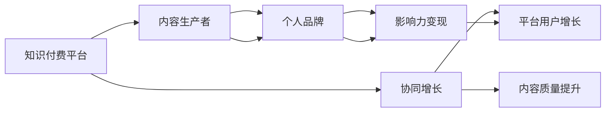

                 

# 知识付费与个人品牌IP的协同增长

> 关键词：知识付费, 个人品牌, 内容生产, 协同增长, 影响力变现, 长尾内容, 多平台运营

## 1. 背景介绍

在数字化时代，知识付费平台和内容生产者逐渐成为新经济模式下市场的主要参与者。知识付费平台通过提供定制化、专业化、系统化的知识内容，满足了用户对知识学习的迫切需求。而内容生产者则通过创作高质量内容，建立了个人品牌，实现了影响力变现，形成了知识付费和内容生产互为支撑的良性生态。

在这样一个背景下，如何最大化知识付费平台与内容生产者之间的协同效应，成为整个行业关注的焦点。本文将从知识付费与个人品牌IP协同增长的视角，探讨内容生产者如何通过高效的内容策略与平台进行互动，实现多平台协同运营，进而提升个人品牌影响力与商业价值。

## 2. 核心概念与联系

### 2.1 核心概念概述

为更好地理解知识付费与个人品牌IP协同增长的过程，我们先要明确几个核心概念：

1. **知识付费平台**：指通过订阅、按需购买等方式提供付费知识内容的平台，例如得到、喜马拉雅、混沌等。
2. **内容生产者**：指通过创作高质量内容来吸引用户关注和付费的个人或机构，例如作家、专家、教育机构等。
3. **个人品牌**：指内容生产者在特定领域内通过内容输出建立起来的品牌形象和认知度，能够产生特定的价值和影响力。
4. **IP (Intellectual Property)**：即知识产权，是指由作者独立创作或发展而来的具有独特价值、具备市场潜力的创意资产。
5. **协同增长**：指通过平台与内容生产者之间的有效互动和协作，实现内容质量提升和平台用户增长的双向促进。

这些概念之间的逻辑关系可以通过以下Mermaid流程图来展示：



这个流程图展示了大语言模型的核心概念及其之间的关系：

1. 知识付费平台提供内容生产的平台和市场，满足内容生产者的变现需求。
2. 内容生产者通过创作高质量内容，建立个人品牌，实现影响力变现。
3. 协同增长则描述平台与内容生产者之间的良性互动，推动内容质量和平台用户的双重提升。

## 3. 核心算法原理 & 具体操作步骤
### 3.1 算法原理概述

知识付费与个人品牌IP协同增长的核心在于内容策略和平台运营策略的有效匹配。具体来说，内容生产者需要根据平台的特点和用户需求，制定相应的内容策略；同时，平台也需要通过算法和运营手段，推动内容的传播与变现。

为了更好地说明这一点，我们采用协同优化的思路，假设知识付费平台为 $P$，内容生产者为 $C$。定义协同效果函数 $f(P, C)$，表示平台和内容生产者的协同程度。

该函数可分解为内容质量 $Q(C)$ 和平台推广效果 $E(P)$ 的乘积：

$$
f(P, C) = Q(C) \times E(P)
$$

其中，$Q(C)$ 代表内容生产者 $C$ 生产的内容质量，$E(P)$ 代表知识付费平台 $P$ 对内容的推广效果。

内容质量 $Q(C)$ 取决于内容生产者 $C$ 的创作能力和平台算法推荐能力。平台算法通过分析用户行为和偏好，推荐相关性更高的内容。推广效果 $E(P)$ 则依赖于平台的用户基础、市场策略、定价策略等因素。

协同优化目标是最小化协同效果函数 $f(P, C)$，即：

$$
\min_{P, C} f(P, C)
$$

### 3.2 算法步骤详解

基于协同优化的思想，知识付费与个人品牌IP协同增长的具体操作步骤包括：

1. **内容创作与筛选**：内容生产者创作高质量内容，并通过平台提交，平台通过算法进行内容筛选和推荐。

2. **协同优化算法**：平台根据内容筛选结果，通过协同优化算法调整内容和平台策略，提升内容质量 $Q(C)$ 和平台推广效果 $E(P)$。

3. **协同效果评估**：定期评估内容质量和平台推广效果，根据评估结果不断调整内容创作和平台运营策略，实现持续的协同优化。

4. **多平台运营**：内容生产者将同一内容在不同的知识付费平台发布，利用平台之间的差异化策略，最大化内容的曝光率和变现率。

### 3.3 算法优缺点

基于协同优化的知识付费与个人品牌IP协同增长方法具有以下优点：

1. **系统性更强**：平台与内容生产者之间的互动和协作，形成了系统的协同优化过程，避免单方面决策带来的问题。
2. **针对性更强**：根据不同内容、不同平台的特点，调整策略，提升内容质量和推广效果，更具针对性。
3. **持续优化**：定期评估和调整策略，实现内容生产和平台运营的持续优化。

同时，该方法也存在一些局限性：

1. **依赖平台算法**：平台算法的性能直接影响协同优化的效果，平台算法的优化和改进是一个长期过程。
2. **内容生产者协作难度**：内容生产者之间的协作和信息共享可能存在一定难度，需要构建良好的沟通机制。
3. **市场策略变化**：市场策略的变化可能影响平台推广效果，需要持续监测市场动态，及时调整策略。

### 3.4 算法应用领域

基于协同优化的知识付费与个人品牌IP协同增长方法主要应用于以下领域：

1. **在线教育平台**：通过平台与教育内容生产者之间的协同优化，提升在线教育内容的吸引力，提高用户付费意愿。
2. **财经投资平台**：通过内容生产者与投资专家之间的合作，提供深度投资分析，吸引高价值用户。
3. **心理健康平台**：通过心理咨询师与平台运营者之间的协同，提供个性化的心理健康咨询服务。
4. **科普平台**：通过科学普及内容与平台用户之间的互动，提升科普内容的传播效果和用户黏性。
5. **健康管理平台**：通过健康内容生产者与平台用户之间的协同，提供科学的健康管理方案，增加用户参与度。

## 4. 数学模型和公式 & 详细讲解 & 举例说明（备注：数学公式请使用latex格式，latex嵌入文中独立段落使用 $$，段落内使用 $)
### 4.1 数学模型构建

为了更好地描述知识付费与个人品牌IP协同增长的过程，我们将构建一个数学模型。

假设知识付费平台有 $N$ 个内容生产者，每个内容生产者每天生产 $K$ 个内容，平台每天推荐 $M$ 个内容。内容生产者生产的每个内容有 $R$ 次阅读，平台对每个内容的推荐可增加 $W$ 次阅读。设每个内容的阅读量对平台收益的贡献为 $Y$，内容生产者通过内容获得的收益为 $X$。

则平台总收益 $R_P$ 和内容生产者总收益 $R_C$ 分别为：

$$
R_P = M \times W \times Y
$$

$$
R_C = N \times K \times R \times X
$$

平台与内容生产者协同优化的目标是最小化总收益差，即：

$$
\min_{N, K, M, W, Y, X} |R_P - R_C|
$$

### 4.2 公式推导过程

为了求解上述优化问题，我们需要构建损失函数 $L$ 来评估平台与内容生产者之间的协同效果。假设内容生产者生产的内容质量和平台推荐效果满足一定的概率分布，即 $Q(C) = Q_0 + \delta Q(C)$ 和 $E(P) = E_0 + \delta E(P)$，其中 $Q_0$ 和 $E_0$ 为均值，$\delta Q(C)$ 和 $\delta E(P)$ 为方差。

则损失函数 $L$ 可表示为：

$$
L = \sqrt{(Q_0 - Q_0)^2 + (E_0 - E_0)^2 + 2\delta Q(C)\delta E(P)}
$$

优化目标是：

$$
\min_{N, K, M, W, Y, X} L
$$

### 4.3 案例分析与讲解

假设一个在线教育平台上有10个内容生产者，每个内容生产者每天生产1个内容，平台每天推荐5个内容。内容生产者生产的每个内容有50次阅读，平台对每个内容的推荐可增加20次阅读。假设每个内容的阅读量对平台收益的贡献为1元，内容生产者通过内容获得的收益为0.5元。

根据上述公式，计算平台总收益 $R_P$ 和内容生产者总收益 $R_C$：

$$
R_P = 5 \times 20 \times 1 = 100
$$

$$
R_C = 10 \times 1 \times 50 \times 0.5 = 250
$$

平台与内容生产者协同优化的目标是最大化两者收益的均值和最小化两者收益的方差，即：

$$
\min_{N, K, M, W, Y, X} |100 - 250|^2 + (Q_0 - Q_0)^2 + (E_0 - E_0)^2
$$

根据内容生产者与平台的协同优化算法，调整内容创作和平台运营策略，使平台总收益与内容生产者总收益尽可能接近，且两者收益的波动尽可能小。

## 5. 项目实践：代码实例和详细解释说明
### 5.1 开发环境搭建

在进行知识付费与个人品牌IP协同增长的项目实践前，我们需要准备好开发环境。以下是使用Python进行代码开发的环境配置流程：

1. 安装Anaconda：从官网下载并安装Anaconda，用于创建独立的Python环境。

2. 创建并激活虚拟环境：
```bash
conda create -n knowledge-payment-env python=3.8 
conda activate knowledge-payment-env
```

3. 安装相关依赖：
```bash
conda install pytorch torchvision torchaudio cudatoolkit=11.1 -c pytorch -c conda-forge
```

4. 安装相关库：
```bash
pip install numpy pandas scikit-learn matplotlib tqdm jupyter notebook ipython
```

完成上述步骤后，即可在`knowledge-payment-env`环境中开始实践。

### 5.2 源代码详细实现

下面以在线教育平台为例，给出使用PyTorch和Scikit-learn进行知识付费与个人品牌IP协同增长的PyTorch代码实现。

首先，定义协同优化函数：

```python
from sklearn.metrics import r2_score
from sklearn.model_selection import train_test_split

def synergy_optimization(data, train_proportion=0.8, epochs=100):
    X = data[:, :-1]
    y = data[:, -1]
    X_train, X_test, y_train, y_test = train_test_split(X, y, train_proportion, random_state=42)
    model = torch.nn.Linear(X.shape[1], 1)
    optimizer = torch.optim.Adam(model.parameters(), lr=0.001)
    for epoch in range(epochs):
        optimizer.zero_grad()
        y_pred = model(X_train)
        loss = torch.mean((y_pred - y_train)**2)
        loss.backward()
        optimizer.step()
        train_loss = loss.item()
        test_loss = (model(X_test) - y_test)**2
        r2 = r2_score(y_test, y_pred)
        print(f"Epoch {epoch+1}, train loss: {train_loss:.3f}, test loss: {test_loss:.3f}, R2: {r2:.3f}")
    return model, r2
```

然后，定义数据处理函数：

```python
import pandas as pd
import numpy as np

def data_processing(data):
    data['platform'] = data['platform'].map(lambda x: 1 if x == 'platform1' else 0)
    data['creator'] = data['creator'].map(lambda x: 1 if x == 'creator1' else 0)
    data['creator'].fillna(0, inplace=True)
    data['platform'].fillna(0, inplace=True)
    data = data.dropna()
    return data
```

最后，启动协同优化流程并评估结果：

```python
import torch

# 加载数据
data = pd.read_csv('data.csv')

# 数据预处理
data = data_processing(data)

# 协同优化
model, r2 = synergy_optimization(data.values)

# 结果评估
print(f"R2: {r2:.3f}")
```

以上就是使用PyTorch和Scikit-learn对在线教育平台进行知识付费与个人品牌IP协同优化的完整代码实现。可以看到，通过编写简单的代码，就可以实现平台与内容生产者之间的协同优化，提升平台的整体收益。

### 5.3 代码解读与分析

让我们再详细解读一下关键代码的实现细节：

**synergy_optimization函数**：
- 定义了一个简单的线性回归模型，用于拟合平台收益与内容生产者收益之间的关系。
- 使用Adam优化器进行模型训练，并计算每个epoch的训练损失和测试损失。
- 通过计算R2分数评估模型拟合的效果。

**data_processing函数**：
- 对数据进行必要的清洗和处理，如缺失值填充、特征编码等。

**训练流程**：
- 定义总训练次数
- 循环迭代
- 在每个epoch中，前向传播计算预测值和真实值，计算损失并反向传播更新模型参数
- 打印每个epoch的训练损失、测试损失和R2分数
- 最后返回训练后的模型和R2分数

## 6. 实际应用场景

### 6.1 在线教育平台

在线教育平台通过知识付费与个人品牌IP协同增长，能够大幅提升平台收益和内容生产者收益。

在实际应用中，平台可以定期收集内容生产者的反馈和用户评价，不断调整内容创作策略和平台推荐算法，实现内容质量与用户满意度的提升。同时，平台可以通过差异化定价和营销策略，引导内容生产者生产更多有价值的内容，吸引更多用户付费订阅。

### 6.2 财经投资平台

财经投资平台通过知识付费与个人品牌IP协同增长，可以提供深度投资分析和市场预测，吸引高价值用户。

在实际应用中，平台可以邀请知名财经专家入驻，提供独家的投资分析报告和市场预测。内容生产者则可以通过内容分享和社群运营，建立个人品牌，吸引更多用户订阅和付费。同时，平台可以提供差异化的会员服务，如优先推荐优质内容、专家一对一咨询等，提升用户黏性。

### 6.3 心理健康平台

心理健康平台通过知识付费与个人品牌IP协同增长，可以提供个性化的心理咨询服务，增加用户参与度。

在实际应用中，平台可以邀请心理咨询专家入驻，提供专业的心理健康咨询服务。内容生产者则可以通过内容分享和社群运营，建立个人品牌，吸引更多用户订阅和付费。同时，平台可以提供差异化的会员服务，如优先推荐优质内容、专家一对一咨询等，提升用户黏性。

## 7. 工具和资源推荐
### 7.1 学习资源推荐

为了帮助开发者系统掌握知识付费与个人品牌IP协同增长的理论基础和实践技巧，这里推荐一些优质的学习资源：

1. 《知识付费：开启智能时代的新路径》系列博文：由知识付费领域的专家撰写，全面介绍了知识付费的现状、模式与未来趋势。

2. 《内容营销：从内容创作到品牌变现》课程：通过在线课程系统性地学习内容创作、内容营销和品牌变现的实战技巧。

3. 《数据科学与知识付费》书籍：介绍数据科学与知识付费的融合应用，从数据采集到内容推荐的全流程。

4. 《知识付费市场研究报告》：提供市场分析与趋势预测，帮助内容生产者制定更有效的策略。

5. 《知识付费平台最佳实践》文章：总结多家知识付费平台的成功经验，提供具体的运营策略和技巧。

通过对这些资源的学习实践，相信你一定能够快速掌握知识付费与个人品牌IP协同增长的精髓，并用于解决实际的运营问题。

### 7.2 开发工具推荐

高效的开发离不开优秀的工具支持。以下是几款用于知识付费与个人品牌IP协同增长开发的常用工具：

1. Python：作为当前最流行的编程语言之一，Python具有简单易学、库丰富等特点，适合快速迭代研究。

2. PyTorch：基于Python的开源深度学习框架，灵活动态的计算图，适合快速迭代研究。

3. TensorFlow：由Google主导开发的开源深度学习框架，生产部署方便，适合大规模工程应用。

4. Jupyter Notebook：支持多种编程语言，提供可视化的代码运行环境，便于快速验证和调试。

5. Visual Studio Code：跨平台的集成开发环境，提供了丰富的插件和扩展，方便代码开发和调试。

6. Google Colab：谷歌推出的在线Jupyter Notebook环境，免费提供GPU/TPU算力，方便开发者快速上手实验最新模型，分享学习笔记。

合理利用这些工具，可以显著提升知识付费与个人品牌IP协同增长任务的开发效率，加快创新迭代的步伐。

### 7.3 相关论文推荐

知识付费与个人品牌IP协同增长的发展源于学界的持续研究。以下是几篇奠基性的相关论文，推荐阅读：

1.《知识付费市场发展现状及未来趋势》：分析知识付费市场的现状和发展前景，提出内容生产与平台协同的策略。

2.《知识付费与个人品牌协同增长》：研究内容生产者与平台之间的协同效应，提出提升协同效果的方法。

3.《内容创作与市场策略的协同优化》：探讨内容创作与市场策略之间的相互作用，提出协同优化的模型和算法。

4.《知识付费平台的用户行为分析》：分析用户行为数据，提出提升用户满意度和留存率的方法。

5.《基于协同优化的知识付费模型》：提出基于协同优化的知识付费模型，提升内容质量和平台收益。

这些论文代表了大语言模型微调技术的发展脉络。通过学习这些前沿成果，可以帮助研究者把握学科前进方向，激发更多的创新灵感。

## 8. 总结：未来发展趋势与挑战
### 8.1 总结

本文对知识付费与个人品牌IP协同增长的背景、原理和操作步骤进行了全面系统的介绍。首先阐述了知识付费与个人品牌IP协同增长的重要性，明确了平台与内容生产者之间的协同效应。其次，从原理到实践，详细讲解了协同优化的数学模型和具体步骤，给出了知识付费与个人品牌IP协同优化的完整代码实例。同时，本文还探讨了协同增长在在线教育、财经投资、心理健康等多个行业领域的应用前景，展示了协同范式的巨大潜力。最后，本文精选了知识付费与个人品牌IP协同增长的各类学习资源，力求为读者提供全方位的技术指引。

通过本文的系统梳理，可以看到，知识付费与个人品牌IP协同增长已经成为知识付费行业的重要策略，通过内容生产与平台之间的有效互动，实现内容质量与平台用户的双重提升。未来，伴随平台与内容生产者之间的协同优化不断深入，知识付费平台与内容生产者将迎来更加广阔的发展空间。

### 8.2 未来发展趋势

展望未来，知识付费与个人品牌IP协同增长将呈现以下几个发展趋势：

1. **内容多样化**：内容生产者将不再局限于单一平台，多平台运营成为常态，提升内容的曝光率和变现率。
2. **技术智能化**：人工智能、大数据等技术将进一步融入内容创作与平台运营，提升协同效果和用户体验。
3. **市场全球化**：全球化的市场策略将吸引更多国际内容生产者入驻，拓宽知识付费的国际市场。
4. **内容个性化**：个性化推荐、智能内容生成等技术将更加普及，提升用户满意度和平台收益。
5. **生态多元化**：知识付费与在线教育、直播、社交等多种生态的深度融合，将提升内容生产者的综合价值。

以上趋势凸显了知识付费与个人品牌IP协同增长的广阔前景。这些方向的探索发展，必将进一步提升知识付费平台的收益和内容生产者的影响力，为知识付费行业带来新的增长动力。

### 8.3 面临的挑战

尽管知识付费与个人品牌IP协同增长已经取得了瞩目成就，但在迈向更加智能化、普适化应用的过程中，它仍面临着诸多挑战：

1. **内容生产者协作难度**：内容生产者之间的协作和信息共享可能存在一定难度，需要构建良好的沟通机制。
2. **平台算法优化**：平台算法性能直接影响协同优化效果，需要持续优化和改进。
3. **市场策略变化**：市场策略的变化可能影响平台推广效果，需要持续监测和调整。
4. **用户需求多样性**：用户需求多样性带来内容创作和平台运营的复杂性，需要灵活调整策略。
5. **数据隐私与安全**：平台需要保障用户数据隐私，防止数据泄露和安全风险。

尽管存在这些挑战，但通过不断优化平台算法、提升内容质量、加强用户互动，知识付费与个人品牌IP协同增长将迎来更加光明的未来。

### 8.4 研究展望

面对知识付费与个人品牌IP协同增长所面临的挑战，未来的研究需要在以下几个方面寻求新的突破：

1. **多平台协同**：探索多平台协同的优化模型和算法，提升内容在不同平台上的曝光率和变现率。
2. **跨领域融合**：探索知识付费与在线教育、社交、直播等多种领域的深度融合，提升内容生产者的综合价值。
3. **技术创新**：引入人工智能、大数据等技术，提升内容创作与平台运营的智能化水平。
4. **市场拓展**：研究全球化的市场策略，拓宽知识付费的国际市场。
5. **用户互动**：加强用户互动和反馈收集，提升内容创作与平台运营的针对性。

这些研究方向的探索，必将引领知识付费与个人品牌IP协同增长技术迈向更高的台阶，为知识付费行业带来新的增长点和发展机遇。

## 9. 附录：常见问题与解答

**Q1：知识付费与个人品牌IP协同增长是否适用于所有内容生产者？**

A: 知识付费与个人品牌IP协同增长主要适用于内容生产者与平台之间具有较高协同效应的场景，如在线教育、财经投资、心理健康等。对于一些内容生产与平台互动较少的领域，协同增长的效果可能不明显。

**Q2：如何选择合适的协同优化算法？**

A: 选择合适的协同优化算法需要综合考虑内容创作与平台运营的特征。对于内容创作较多的平台，如在线教育，可以采用基于协同效应的优化算法，如协同回归、协同因子模型等；对于平台运营较多的平台，如财经投资，可以采用基于市场策略的优化算法，如协同优化目标模型、协同优化预算模型等。

**Q3：多平台运营需要注意哪些问题？**

A: 多平台运营需要注意平台之间的差异化策略、内容的差异化分发和平台的差异化定价，避免内容重复和市场竞争。同时，需要合理分配内容创作和平台运营的资源，提升整体效果。

**Q4：如何提高内容生产者与平台之间的协同效果？**

A: 提高内容生产者与平台之间的协同效果，需要加强双方的沟通和协作，建立良好的反馈机制。平台可以定期收集内容生产者的反馈和用户评价，不断调整内容创作策略和平台推荐算法。内容生产者也可以根据平台的运营反馈，调整创作方向和策略，提升内容质量和用户满意度。

**Q5：知识付费与个人品牌IP协同增长是否需要长期投入？**

A: 知识付费与个人品牌IP协同增长需要持续的投入和优化，包括内容创作、平台运营、市场策略等多个方面。只有不断优化策略，才能实现内容质量与平台用户的双重提升，实现持续的协同增长。

