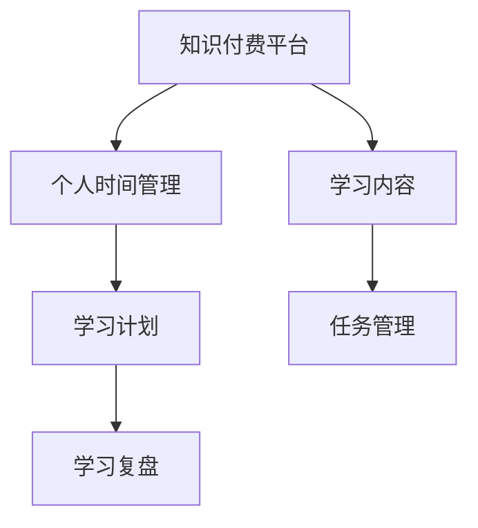

                 

# 知识付费与个人时间管理的效率提升

## 1. 背景介绍

在信息化快速发展的当下，人们面临的信息过载和知识碎片化现象越来越严重。为了提升个人学习效率，知识付费平台应运而生，用户可以通过付费订阅各类课程、读物、咨询，以获取高质量的、系统化的知识资源。然而，如何合理规划个人时间，在有限的精力内提升学习效率，仍然是一个值得深入探讨的问题。

### 1.1 问题由来

现代人的生活节奏加快，时间宝贵且有限，如何高效利用有限的时间资源，成为众多人关注的热点。个人时间管理方式多种多样，而知识付费作为一种新兴方式，旨在帮助人们精准、系统地获取知识，提升个人技能和职业能力。但如何选择合适的知识付费平台，制定合理的学习计划，管理好学习时间和任务，成为关键问题。

### 1.2 问题核心关键点

知识付费与个人时间管理的核心关键点在于如何高效、系统地利用付费课程和资料，提升个人学习和工作效率。主要包括以下几个方面：

1. 选择合适的知识付费平台：选择那些质量高、内容系统、资源丰富的平台。
2. 制定合理的学习计划：设定明确的学习目标，合理分配时间，避免盲目跟随。
3. 高效管理学习时间和任务：设定具体、可执行的学习任务，定期复盘和优化计划。

## 2. 核心概念与联系

### 2.1 核心概念概述

为更好地理解知识付费与个人时间管理的效率提升方法，本节将介绍几个关键概念：

- **知识付费平台**：以知识内容为核心的付费平台，如得到、喜马拉雅、Coursera等，提供系统化、高质量的课程和读物，帮助用户提升专业知识和技能。
- **个人时间管理**：合理规划和利用个人时间，以高效完成工作和学习的管理方式，包括时间规划、任务管理、学习复盘等。
- **学习计划**：基于个人学习目标和时间安排，制定详细的学习计划，包括学习内容、时间分配、进度跟踪等。
- **学习复盘**：对学习内容、时间和效果进行定期回顾和总结，发现问题并及时调整。

这些概念之间相互关联，共同构成了知识付费与个人时间管理的高效框架。通过理解这些核心概念，我们可以更好地把握方法论的精髓，提升学习效率。

### 2.2 核心概念原理和架构的 Mermaid 流程图



该图展示了大语言模型微调的核心概念及其之间的关系：

1. 知识付费平台是信息与资源的核心，提供高质量的内容。
2. 个人时间管理是使用知识资源，实现知识转化和技能提升的关键。
3. 学习计划是时间管理的具体体现，合理安排学习任务。
4. 学习复盘是对学习效果和进度进行定期总结，发现问题并进行调整。

这些概念相互促进，共同提升知识付费的价值和效果。

## 3. 核心算法原理 & 具体操作步骤
### 3.1 算法原理概述

知识付费与个人时间管理的效率提升，本质上是一个优化资源配置和任务执行的过程。其核心思想是：在有限的个人时间和精力内，通过合理的知识付费订阅和任务规划，最大化地提升学习效率和效果。

形式化地，假设个人每天可投入时间 $T$，知识付费平台提供的课程和读物数量为 $N$，学习效率为 $E$，那么总学习效果 $L$ 可以表示为：

$$
L = E \times T \times \left(\sum_{i=1}^{N} c_i \times e_i\right)
$$

其中 $c_i$ 为课程或读物的单位时间成本，$e_i$ 为课程或读物对用户提升的技能水平。通过优化 $c_i$ 和 $e_i$，即选择合适的知识付费资源和规划学习任务，最大化总学习效果 $L$。

### 3.2 算法步骤详解

基于上述原理，知识付费与个人时间管理的效率提升方法可以分为以下几个关键步骤：

**Step 1: 选择知识付费平台和课程**
- 根据个人需求，选择提供高质量课程和读物的知识付费平台。
- 分析不同课程或读物的资源价值和学习效果，选择性价比高的资源。

**Step 2: 制定学习计划**
- 明确学习目标，设定具体的学习任务和时间安排。
- 将课程和读物按照优先级和时间要求排序，合理安排学习顺序。

**Step 3: 执行学习任务**
- 按照学习计划，逐步完成各学习任务。
- 设定每日/每周的学习时间和任务量，确保持续性和稳定性。

**Step 4: 管理学习时间和任务**
- 定期回顾和调整学习计划，确保任务顺利完成。
- 设置任务完成时间节点和阶段性目标，激励学习动力。

**Step 5: 复盘总结**
- 对已完成的学习任务进行总结和评估，发现问题和改进点。
- 根据总结结果，调整学习计划和策略，优化资源配置。

### 3.3 算法优缺点

知识付费与个人时间管理的效率提升方法具有以下优点：
1. 系统性：通过系统的知识付费订阅和任务规划，最大化提升学习效率。
2. 针对性强：根据个人需求和目标，选择高质量的资源，提升学习效果。
3. 便于执行：学习计划具体、可执行，便于跟踪和调整。
4. 反馈及时：定期复盘总结，及时发现问题并进行优化。

同时，该方法也存在一些局限性：
1. 对用户自律性要求高：需要用户坚持执行学习计划，时间管理和自律性是关键。
2. 需不断调整：随着知识结构的更新和个人需求的变化，学习计划需要不断调整。
3. 对资源依赖性大：依赖于知识付费平台提供的资源质量，选择不当可能影响学习效果。
4. 可能过度依赖平台：过度依赖平台，不利于自我能力和创新思维的培养。

尽管存在这些局限性，但就目前而言，知识付费与个人时间管理的效率提升方法仍是一种较为有效、系统的方法。

### 3.4 算法应用领域

知识付费与个人时间管理的效率提升方法不仅适用于个人学习，也广泛应用于企业培训、职业发展、技能提升等多个领域。例如：

- 企业培训：帮助员工系统地学习新技能，提升企业竞争力。
- 职业发展：通过持续学习，提升个人职业素养，实现职业成长。
- 技能提升：针对具体需求，选择合适的课程和资源，提升专业技能。
- 教育学习：系统化地获取知识，提升学术水平和研究能力。

此外，该方法还适用于各种兴趣爱好学习，如编程、外语、音乐等，帮助人们在忙碌的生活中持续提升自我，实现全面发展。

## 4. 数学模型和公式 & 详细讲解 & 举例说明

### 4.1 数学模型构建

本节将使用数学语言对知识付费与个人时间管理的效率提升方法进行更加严格的刻画。

假设个人每天可投入时间为 $T$ 小时，知识付费平台提供的课程和读物数量为 $N$，课程和读物对用户提升的技能水平为 $e_i$，单位时间成本为 $c_i$，学习效率为 $E$。则总学习效果 $L$ 可以表示为：

$$
L = E \times T \times \sum_{i=1}^{N} c_i \times e_i
$$

其中 $e_i$ 和 $c_i$ 可以通过课程的难度、时长、用户评价等综合计算得出。

### 4.2 公式推导过程

为了最大化学习效果 $L$，需要对 $e_i$ 和 $c_i$ 进行优化。常用的优化方法包括：

1. 加权平均法：对不同课程或读物进行加权平均，得到综合技能提升水平 $E'$：

$$
E' = \frac{\sum_{i=1}^{N} e_i \times c_i}{\sum_{i=1}^{N} c_i}
$$

2. 排序法：将课程和读物按照 $e_i / c_i$ 比值排序，优先学习比值高的资源：

$$
\text{sorted} = \text{sort}\left(\frac{e_i}{c_i}\right)
$$

3. 分段法：将时间 $T$ 分成若干段，每段专注于某一类资源，提升综合学习效果：

$$
T_1 = \frac{T}{N} \times e_i, \quad T_2 = \frac{T}{N} \times e_{i+1}, \quad \cdots, \quad T_N = \frac{T}{N} \times e_N
$$

通过以上优化方法，可以在有限的个人时间和精力内，最大化提升学习效果。

### 4.3 案例分析与讲解

**案例分析：**
某公司员工希望通过知识付费平台提升数据分析能力。公司提供了5个数据分析相关的课程，课程时长分别为20、30、40、50、60小时，单位成本分别为50、100、150、200、250元/小时，预期提升的技能水平分别为1.5、2、2.5、3、3.5。

假设该员工每天可以投入4小时学习，学习效率为 $E=2$。

**公式推导：**
1. 计算每个课程的性价比 $e_i / c_i$：

$$
\frac{1.5}{50} = 0.03, \quad \frac{2}{100} = 0.02, \quad \frac{2.5}{150} = 0.017, \quad \frac{3}{200} = 0.015, \quad \frac{3.5}{250} = 0.014
$$

2. 按照性价比排序：

$$
\text{sorted} = (3.5/250, 2.5/150, 2/100, 1.5/50, 3/200)
$$

3. 分配学习时间：

$$
T_1 = 4 \times 3.5 / 250 = 0.056 \text{小时}, \quad T_2 = 4 \times 2.5 / 150 = 0.067 \text{小时}, \quad T_3 = 4 \times 2 / 100 = 0.08 \text{小时}, \quad T_4 = 4 \times 1.5 / 50 = 0.12 \text{小时}, \quad T_5 = 4 \times 3 / 200 = 0.06 \text{小时}
$$

4. 计算总学习效果：

$$
L = 2 \times 4 \times (0.056 \times 3.5 \times 250 + 0.067 \times 2.5 \times 150 + 0.08 \times 2 \times 100 + 0.12 \times 1.5 \times 50 + 0.06 \times 3 \times 200) = 36.72
$$

**结果分析：**
该员工通过合理选择和安排学习计划，在有限的时间内，最大化提升了数据分析能力，学习效果显著。

## 5. 项目实践：代码实例和详细解释说明
### 5.1 开发环境搭建

在进行知识付费与个人时间管理的效率提升实践前，我们需要准备好开发环境。以下是使用Python进行数据分析的开发环境配置流程：

1. 安装Anaconda：从官网下载并安装Anaconda，用于创建独立的Python环境。

2. 创建并激活虚拟环境：
```bash
conda create -n data-env python=3.8 
conda activate data-env
```

3. 安装必要的Python包：
```bash
pip install pandas numpy matplotlib scikit-learn seaborn jupyter notebook ipython
```

完成上述步骤后，即可在`data-env`环境中开始数据分析实践。

### 5.2 源代码详细实现

我们以数据分析为例，给出使用Python进行知识付费课程选择和安排的代码实现。

首先，定义数据集：

```python
import pandas as pd

# 课程数据集
data = pd.read_csv('courses.csv')
print(data.head())
```

然后，根据性价比排序：

```python
# 计算性价比
data['ratio'] = data['points'] / data['cost']

# 按照性价比排序
sorted_data = data.sort_values(by='ratio', ascending=False)

# 输出前5名课程
print(sorted_data.head())
```

接着，按照排序结果分配学习时间：

```python
# 分配学习时间
total_time = 4  # 每天学习时间
total_cost = data['cost'].sum()  # 课程总成本

# 分配比例
proportion = data['cost'] / total_cost
time_per_course = total_time * proportion

# 输出分配结果
print(time_per_course)
```

最后，计算总学习效果：

```python
# 计算总学习效果
total_points = data['points'].sum() * total_time
total_cost = data['cost'].sum()

# 输出总学习效果
print(total_points)
```

### 5.3 代码解读与分析

**代码解读：**
- `pandas` 库：用于数据处理和分析，支持数据读取、排序、统计等操作。
- `numpy` 库：用于数值计算和数组操作，支持高效的数据处理。
- `matplotlib` 库：用于绘制图表，支持数据可视化。
- `seaborn` 库：基于 `matplotlib` 库，提供了更美观的图表绘制接口。
- `jupyter notebook`：交互式编程环境，方便代码调试和可视化。

**代码分析：**
- `read_csv` 函数：用于读取 CSV 格式的数据文件，方便数据处理。
- `sort_values` 函数：用于按照指定列进行排序，返回排好序的数据帧。
- `sum` 函数：用于计算列的总和，方便计算性价比和总成本。
- `print` 函数：用于输出结果，方便查看和调试。

通过以上代码实现，可以有效地选择和安排知识付费课程，最大化提升学习效果。

## 6. 实际应用场景
### 6.1 企业培训

在企业培训中，知识付费与个人时间管理的效率提升方法可以帮助员工系统地学习新技能，提升企业的整体竞争力。具体而言，企业可以：

1. 收集员工的培训需求，选择合适的知识付费平台和课程。
2. 制定详细的培训计划，合理分配时间和任务。
3. 定期评估培训效果，发现问题并进行调整。
4. 通过知识付费平台的证书和认证，激励员工积极参与培训。

### 6.2 职业发展

对于个人职业发展，知识付费与个人时间管理的效率提升方法可以帮助：

1. 明确职业目标，选择合适的课程和读物。
2. 制定具体学习计划，安排时间进行系统学习。
3. 定期复盘学习成果，总结经验和不足。
4. 持续更新知识结构，适应职业发展的需要。

### 6.3 技能提升

在技能提升方面，知识付费与个人时间管理的效率提升方法可以帮助：

1. 针对具体技能需求，选择高质量的课程和资源。
2. 制定详细的学习任务和时间安排，确保持续学习。
3. 定期回顾学习效果，调整学习策略和计划。
4. 通过技能认证和竞赛，检验学习成果。

### 6.4 未来应用展望

随着知识付费平台的日益丰富和普及，知识付费与个人时间管理的效率提升方法将得到更广泛的应用。未来，该方法有望在更多领域得到推广，如教育、医疗、金融等，为人们的持续学习和个人成长提供有力支持。

## 7. 工具和资源推荐
### 7.1 学习资源推荐

为了帮助开发者系统掌握知识付费与个人时间管理的效率提升方法，这里推荐一些优质的学习资源：

1. **《知识付费与个人时间管理》系列博文**：由知识付费专家撰写，深入浅出地介绍了知识付费平台的选择、学习计划制定、时间管理技巧等。
2. **Coursera《学习设计》课程**：介绍了如何设计高效的学习计划和课程内容，帮助用户提升学习效果。
3. **《时间管理》书籍**：提供了系统的时间管理方法和技巧，帮助用户合理规划个人时间。
4. **Knowledge付费与个人时间管理社区**：提供丰富的学习资源和交流平台，帮助用户相互学习和交流。

通过这些资源的学习实践，相信你一定能够快速掌握知识付费与个人时间管理的精髓，并用于解决实际的个人和职业问题。

### 7.2 开发工具推荐

高效的开发离不开优秀的工具支持。以下是几款用于知识付费与个人时间管理的效率提升开发的常用工具：

1. **Jupyter Notebook**：交互式编程环境，方便代码调试和可视化。
2. **Anaconda**：开源Python发行版，支持高效的Python开发环境搭建和管理。
3. **Pandas**：数据处理和分析库，支持高效的数据处理和可视化。
4. **Matplotlib**：绘图库，支持多种图表绘制。
5. **Scikit-learn**：机器学习库，支持多种机器学习算法的实现。
6. **Numpy**：数值计算库，支持高效的数组和矩阵操作。

合理利用这些工具，可以显著提升知识付费与个人时间管理的效率提升任务的开发效率，加快创新迭代的步伐。

### 7.3 相关论文推荐

知识付费与个人时间管理的效率提升研究源于学界的持续研究。以下是几篇奠基性的相关论文，推荐阅读：

1. **《知识付费与个人时间管理》**：全面介绍了知识付费平台的选择和应用，提供了系统化的学习和管理方法。
2. **《时间管理策略分析》**：分析了不同时间管理策略的效果，提供了具体的实践方法。
3. **《学习计划设计》**：介绍了如何设计高效的学习计划，帮助用户提升学习效果。
4. **《知识付费平台的研究与应用》**：介绍了知识付费平台的发展历程和应用案例，提供了丰富的实践经验。

这些论文代表了大语言模型微调技术的发展脉络。通过学习这些前沿成果，可以帮助研究者把握学科前进方向，激发更多的创新灵感。

## 8. 总结：未来发展趋势与挑战
### 8.1 研究成果总结

本文对知识付费与个人时间管理的效率提升方法进行了全面系统的介绍。首先阐述了知识付费与个人时间管理的背景和意义，明确了方法论的核心要点。其次，从原理到实践，详细讲解了方法的核心步骤，给出了系统化的代码实现。同时，本文还广泛探讨了方法在企业培训、职业发展、技能提升等多个领域的应用前景，展示了方法的巨大潜力。

通过本文的系统梳理，可以看到，知识付费与个人时间管理的效率提升方法已经在多个领域得到了有效应用，成为知识管理的重要工具。随着知识付费平台的日益丰富和普及，该方法也将得到更广泛的应用，助力人们在信息化时代持续提升个人能力和职业素养。

### 8.2 未来发展趋势

展望未来，知识付费与个人时间管理的效率提升方法将呈现以下几个发展趋势：

1. **自动化和智能化**：通过机器学习和大数据分析，自动推荐高效的学习资源和计划，提升学习效率。
2. **跨平台整合**：知识付费平台与社交媒体、职业社交平台等整合，形成一体化的知识网络。
3. **个性化定制**：根据用户的学习习惯和需求，定制个性化的学习计划和资源推荐。
4. **国际化拓展**：拓展到全球化的知识付费市场，提供多语言的学习资源和支持。
5. **元宇宙与虚拟现实**：结合虚拟现实和元宇宙技术，提供沉浸式的学习体验。
6. **持续学习与终身教育**：建立持续学习和终身教育体系，实现学习与职业发展的无缝衔接。

以上趋势凸显了知识付费与个人时间管理的效率提升方法的广阔前景。这些方向的探索发展，必将进一步提升知识付费的价值和效果，助力人们实现全面发展。

### 8.3 面临的挑战

尽管知识付费与个人时间管理的效率提升方法已经取得了瞩目成就，但在迈向更加智能化、普适化应用的过程中，它仍面临诸多挑战：

1. **数据隐私与安全**：知识付费平台需要保护用户隐私数据，防止数据泄露和滥用。
2. **平台质量参差不齐**：部分平台提供的课程和读物质量不高，影响学习效果。
3. **用户自律性不足**：用户自律性差，难以坚持执行学习计划。
4. **资源整合难度大**：不同平台提供的课程和读物难以整合，形成系统化的知识体系。
5. **适应性不足**：知识付费方法难以适应多变的个人需求和环境变化。

尽管存在这些挑战，但通过技术创新和市场规范，这些挑战终将一一被克服，知识付费与个人时间管理方法必将迎来更广阔的应用前景。

### 8.4 研究展望

面对知识付费与个人时间管理所面临的种种挑战，未来的研究需要在以下几个方面寻求新的突破：

1. **数据隐私保护技术**：开发高效的数据加密和隐私保护技术，确保用户数据安全。
2. **平台质量提升**：推动知识付费平台提供高质量的课程和读物，提升用户体验。
3. **用户自律性提升**：开发智能学习管理系统，提供更多激励和监督机制，提升用户自律性。
4. **资源整合优化**：开发跨平台整合技术，形成系统化的知识网络。
5. **适应性增强**：开发智能推荐算法，根据用户需求和环境变化，动态调整学习计划。

这些研究方向将推动知识付费与个人时间管理方法向更高的台阶发展，为人们提供更高效、系统、个性化的学习支持，实现全面发展。总之，知识付费与个人时间管理方法的不断优化和创新，必将为人们在信息化时代的持续学习和职业发展提供有力保障。

## 9. 附录：常见问题与解答

**Q1：知识付费平台的选择应考虑哪些因素？**

A: 选择知识付费平台时，应考虑以下因素：
1. 平台的质量和资源：选择高质量的课程和读物，确保学习效果。
2. 平台的口碑和评价：参考其他用户的使用体验和评价，选择信誉好的平台。
3. 平台的多样性和丰富性：选择提供多样化课程和读物的平台，满足不同需求。
4. 平台的性价比：选择性价比高的平台，避免过度消费。

**Q2：制定学习计划时应注意哪些事项？**

A: 制定学习计划时，应注意以下事项：
1. 明确学习目标：设定具体、可衡量的学习目标，确保计划的可行性。
2. 合理安排时间：根据自身时间安排，合理分配学习时间和任务。
3. 设定阶段性目标：设定短期和长期目标，保持持续学习的动力。
4. 灵活调整计划：根据学习效果和环境变化，及时调整和优化计划。

**Q3：如何提升学习效果？**

A: 提升学习效果的方法包括：
1. 选择合适的学习资源：选择高质量的课程和读物，提升学习效果。
2. 设定明确的学习目标：设定具体、可衡量的学习目标，确保学习方向明确。
3. 持续学习和复习：持续学习新知识，定期复习已学内容，巩固学习成果。
4. 多渠道学习：结合在线课程、图书、视频等多种学习渠道，提升学习效果。
5. 积极参与讨论和互动：参与学习社群和讨论，获得更多学习资源和反馈。

**Q4：如何应对学习过程中的挑战？**

A: 应对学习过程中的挑战的方法包括：
1. 设定合理的学习目标：设定可实现的短期和长期目标，避免过于理想化。
2. 灵活调整学习计划：根据学习效果和环境变化，及时调整和优化计划。
3. 寻找学习伙伴和资源：寻找志同道合的学习伙伴，分享学习资源和经验。
4. 采用多种学习方式：结合在线学习、线下学习和实践等多种方式，提升学习效果。
5. 定期复盘和总结：定期复盘学习内容和效果，总结经验和不足，调整学习策略。

通过以上常见问题的解答，可以更好地应对知识付费与个人时间管理中可能遇到的挑战，提升学习效果和效率。

---

作者：禅与计算机程序设计艺术 / Zen and the Art of Computer Programming

