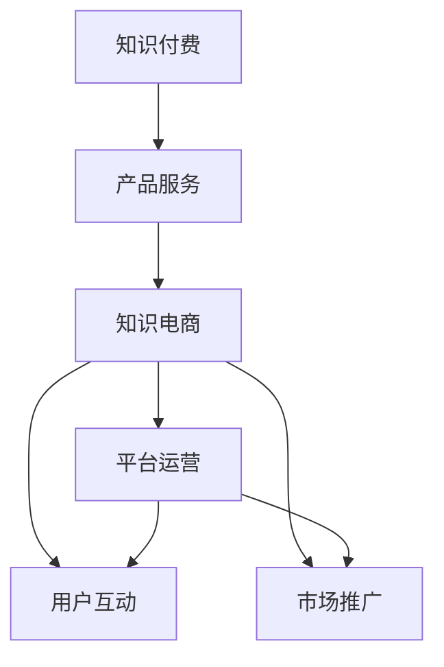

                 

# 知识付费与产品服务相结合的知识电商模式

## 1. 背景介绍

### 1.1 问题由来

在数字经济时代，知识付费作为知识变现的重要手段，迅速成为连接知识创作者和消费者的新型商业模式。传统教育系统难以满足日益增长的个性化学习需求，而知识付费通过高效、便捷的方式，让学习变得更加灵活和高效。

然而，现有的知识付费模式面临诸多问题：内容质量参差不齐，用户体验不够理想，平台运营效率低下，市场竞争激烈，用户付费意愿不足等。为解决这些问题，需要对知识付费的商业模式进行创新和升级。

### 1.2 问题核心关键点

本文聚焦于知识付费与产品服务相结合的知识电商模式。这一模式将知识付费作为基础服务，在满足用户学习需求的同时，通过产品服务增强用户体验，提升平台运营效率，扩大市场影响力，最终实现知识变现的最大化。

### 1.3 问题研究意义

研究知识付费与产品服务相结合的知识电商模式，对于拓展知识付费的市场空间，提升用户学习体验，增强平台竞争力，具有重要意义：

1. **增加用户黏性**：通过提供个性化推荐、互动学习工具等产品服务，增强用户的使用粘性，提升用户忠诚度。
2. **提升内容价值**：知识付费服务与产品服务的结合，能够进一步挖掘内容的深度和广度，提高知识传递的效果。
3. **优化用户体验**：借助技术手段提升用户学习体验，如语音识别、自然语言处理、推荐系统等，使得学习过程更加流畅、自然。
4. **拓宽盈利渠道**：将知识付费与产品服务有机结合，通过产品销售、广告投放、增值服务等多样化盈利方式，拓展知识电商的收入来源。
5. **降低运营成本**：产品服务的提供和优化可以降低平台的运营成本，提高资源利用效率。

## 2. 核心概念与联系

### 2.1 核心概念概述

为更好地理解知识付费与产品服务相结合的知识电商模式，本节将介绍几个密切相关的核心概念：

- **知识付费**：指知识创作者通过内容制作、发布获取报酬的模式，用户通过付费获取知识服务，如课程、文章、直播等。
- **产品服务**：指为知识付费用户提供的产品和附加服务，如学习工具、互动课程、应用软件等，旨在提升用户体验和平台价值。
- **知识电商**：结合知识付费和产品服务，通过平台化的方式，连接知识创作者和用户，形成知识交易和服务的生态系统。

### 2.2 核心概念原理和架构的 Mermaid 流程图



此图展示了知识付费、产品服务和知识电商三个概念之间的联系。知识付费是知识电商的基础服务，产品服务则是提升用户体验的关键手段，平台运营和市场推广则是保障知识电商持续发展的两个重要环节。

## 3. 核心算法原理 & 具体操作步骤

### 3.1 算法原理概述

知识付费与产品服务相结合的知识电商模式，其核心在于通过产品服务增强知识付费的用户体验，同时通过产品服务的销售和优化，实现平台的盈利和增值。

知识付费服务主要包括内容制作、发布和付费获取。内容制作需围绕用户需求进行，高质量的内容制作能够吸引用户付费。发布和获取则依托于平台技术支持，实现内容的分发和用户的支付。

产品服务主要包括学习工具、互动课程、应用软件等。通过提供这些附加服务，用户可以在学习过程中获得更多的价值和乐趣。

### 3.2 算法步骤详解

知识电商模式的实现分为以下几个关键步骤：

**Step 1: 需求分析与产品规划**

- 收集用户反馈，分析用户需求，识别需要提供的附加产品服务。
- 制定产品规划，明确产品功能、性能和用户体验要求。
- 评估产品成本和收益，确定产品的市场定位。

**Step 2: 内容制作与产品开发**

- 组织知识创作者，制作高质量的课程、文章等知识付费内容。
- 依据产品规划，开发相应的学习工具、互动课程等产品服务。
- 进行多轮测试和优化，确保产品质量和用户体验。

**Step 3: 平台搭建与运营管理**

- 搭建知识电商平台，实现知识付费和产品服务的集成和分发。
- 设计高效的运营流程，包括内容管理、用户互动、数据分析等。
- 实施市场推广策略，提升平台的知名度和用户数量。

**Step 4: 用户互动与反馈收集**

- 提供互动功能，如在线问答、直播互动、用户评论等，增强用户参与感。
- 收集用户反馈，及时调整产品和服务，提升用户满意度。
- 通过数据分析，了解用户行为和需求变化，指导后续产品开发。

### 3.3 算法优缺点

知识付费与产品服务相结合的知识电商模式具有以下优点：

1. **提升用户体验**：通过提供丰富的产品服务，提升用户学习效果，增强用户满意度和忠诚度。
2. **拓宽盈利渠道**：除了知识付费收入，还可以通过产品销售、广告投放等方式实现多元化盈利。
3. **优化资源配置**：产品服务的优化可以降低平台的运营成本，提高资源利用效率。

同时，该模式也存在一些局限性：

1. **产品开发成本高**：开发和优化产品服务需要大量的人力和资源投入。
2. **市场竞争激烈**：知识付费市场竞争激烈，需要持续创新和优化产品服务。
3. **用户付费意愿不足**：部分用户对知识付费的付费意愿不高，难以实现平台收入的快速增长。
4. **产品同质化风险**：如果产品服务缺乏差异化，容易被市场淘汰。

尽管存在这些局限性，但知识付费与产品服务相结合的知识电商模式，为知识变现提供了新的方向，具有广阔的市场前景和应用潜力。

### 3.4 算法应用领域

知识付费与产品服务相结合的知识电商模式，已在多个领域得到应用：

1. **教育培训**：提供在线课程、互动直播、智能辅导等功能，提升学习效果。
2. **健康医疗**：提供健康管理、营养咨询、在线诊疗等产品服务，满足用户的健康需求。
3. **职业技能**：提供职业技能培训、技能测评、就业指导等服务，帮助用户提升职业能力。
4. **娱乐休闲**：提供虚拟现实课程、互动游戏、社交网络等服务，满足用户的娱乐需求。
5. **职业发展**：提供职业规划、职业测评、职业培训等服务，帮助用户实现职业发展。

## 4. 数学模型和公式 & 详细讲解 & 举例说明

### 4.1 数学模型构建

知识电商平台的运营效果可以采用多种指标进行衡量，如用户留存率、转化率、销售额等。我们可以设计以下数学模型来评估平台的运营效果：

**用户留存率（User Retention Rate）**：
$$
\text{User Retention Rate} = \frac{\text{今日活跃用户数}}{\text{昨日活跃用户数}} \times 100\%
$$

**转化率（Conversion Rate）**：
$$
\text{Conversion Rate} = \frac{\text{付费用户数}}{\text{访问用户数}} \times 100\%
$$

**销售额（Revenue）**：
$$
\text{Revenue} = \text{销售数量} \times \text{单价} + \text{广告收入} + \text{其他收入}
$$

其中，销售数量包括知识付费的付费用户数和产品服务的销售数。

### 4.2 公式推导过程

以上指标的计算过程如下：

- 用户留存率计算：通过统计今日和昨日的活跃用户数，计算用户的留存率。
- 转化率计算：统计访问用户中付费用户的比例，即转化率。
- 销售额计算：将销售数量乘以单价，加上广告收入和其他收入，得到总销售额。

### 4.3 案例分析与讲解

**案例一：在线教育平台**

假设某在线教育平台有1000个活跃用户，今日有800个用户付费，其中400个是课程订阅，另外400个是应用付费。今日新增用户200个，其中150个是课程订阅，另外50个是应用付费。昨天活跃用户数为800个，付费用户数为600个，其中400个是课程订阅，另外200个是应用付费。

**用户留存率**：
$$
\text{User Retention Rate} = \frac{800}{800} \times 100\% = 100\%
$$

**转化率**：
$$
\text{Conversion Rate} = \frac{600}{1000} \times 100\% = 60\%
$$

**销售额**：
$$
\text{Revenue} = (400+200) \times 50 + (150+50) \times 20 = 10,000 + 3,000 = 13,000
$$

## 5. 项目实践：代码实例和详细解释说明

### 5.1 开发环境搭建

在进行知识电商模式的开发前，我们需要准备好开发环境。以下是使用Python进行Flask开发的环境配置流程：

1. 安装Python：从官网下载并安装Python，确保版本为3.7及以上。
2. 安装Flask：
```bash
pip install flask
```
3. 安装SQLAlchemy：用于数据库管理：
```bash
pip install sqlalchemy
```
4. 安装Flask-SQLAlchemy：
```bash
pip install flask-sqlalchemy
```
5. 安装Flask-WTF：用于表单处理：
```bash
pip install flask-wtf
```
6. 安装Flask-Login：用于用户认证：
```bash
pip install flask-login
```
7. 安装Jinja2：用于模板渲染：
```bash
pip install jinja2
```

### 5.2 源代码详细实现

以下是一个简单的知识电商平台后台代码实现：

```python
from flask import Flask, render_template, request, redirect, url_for, flash
from flask_sqlalchemy import SQLAlchemy
from flask_login import LoginManager, login_user, logout_user, login_required, current_user
from flask_wtf import FlaskForm
from wtforms import StringField, PasswordField, SubmitField
from wtforms.validators import DataRequired, Length, Email

app = Flask(__name__)
app.config['SECRET_KEY'] = '5791628bb0b13ce0c676dfde280ba245'
app.config['SQLALCHEMY_DATABASE_URI'] = 'sqlite:///platform.db'

db = SQLAlchemy(app)
login_manager = LoginManager(app)

class User(db.Model):
    id = db.Column(db.Integer, primary_key=True)
    username = db.Column(db.String(80), unique=True, nullable=False)
    email = db.Column(db.String(120), unique=True, nullable=False)
    password = db.Column(db.String(120), nullable=False)

    def __repr__(self):
        return f'<User {self.username}>'


@login_manager.user_loader
def load_user(user_id):
    return User.query.get(int(user_id))


class RegistrationForm(FlaskForm):
    username = StringField('Username', validators=[DataRequired(), Length(min=4, max=80)])
    email = StringField('Email', validators=[DataRequired(), Email()])
    password = PasswordField('Password', validators=[DataRequired()])
    submit = SubmitField('Register')

    def validate_username(self, username):
        user = User.query.filter_by(username=username.data).first()
        if user:
            flash('Username already exists. Please choose a different one.', 'error')
            return False

    def validate_email(self, email):
        user = User.query.filter_by(email=email.data).first()
        if user:
            flash('Email already exists. Please choose a different one.', 'error')
            return False


class LoginForm(FlaskForm):
    email = StringField('Email', validators=[DataRequired(), Email()])
    password = PasswordField('Password', validators=[DataRequired()])
    submit = SubmitField('Login')

@app.route('/')
@login_required
def home():
    return render_template('home.html')

@app.route('/login')
def login():
    form = LoginForm()
    if form.validate_on_submit():
        user = User.query.filter_by(email=form.email.data).first()
        if user and user.password == form.password.data:
            login_user(user)
            return redirect(url_for('home'))
        else:
            flash('Invalid email or password. Please try again.', 'error')
    return render_template('login.html', title='Login', form=form)

@app.route('/logout')
@login_required
def logout():
    logout_user()
    return redirect(url_for('index'))

@app.route('/register', methods=['GET', 'POST'])
def register():
    form = RegistrationForm()
    if form.validate_on_submit():
        user = User(username=form.username.data, email=form.email.data, password=form.password.data)
        db.session.add(user)
        db.session.commit()
        flash('Account created successfully!', 'success')
        return redirect(url_for('login'))
    return render_template('register.html', title='Register', form=form)

if __name__ == '__main__':
    app.run(debug=True)
```

### 5.3 代码解读与分析

这段代码展示了Flask框架下知识电商平台的用户注册、登录、退出功能。代码实现了用户模型的定义、数据库的连接、表单验证、用户认证等核心功能。通过Flask的路由机制，将不同功能模块组合在一起，实现了知识电商平台的用户管理和认证。

## 6. 实际应用场景

### 6.1 智能健康

在智能健康领域，知识付费与产品服务相结合的知识电商模式，能够为用户的健康管理提供全方位的支持。例如，可以提供在线健康课程、营养咨询、运动指导等服务，同时销售智能手环、健康监测设备等产品。

### 6.2 职业技能培训

职业技能培训领域，知识付费与产品服务相结合的模式可以大幅提升用户的学习效果。例如，可以通过在线课程、技能测评、职业指导等服务，帮助用户系统地学习职业技能，并通过职业测评和指导，提供个性化的职业建议。

### 6.3 儿童教育

在儿童教育领域，知识付费与产品服务相结合的模式可以提供更具互动性和趣味性的学习体验。例如，可以提供在线课程、互动游戏、学习工具等服务，同时销售教育应用软件和硬件，如学习机器人、智能书籍等。

### 6.4 未来应用展望

随着知识付费和产品服务的不断创新和优化，知识电商模式将拓展到更多领域，为各类知识服务提供新的商业模式。例如，在教育培训、医疗健康、职业技能等领域，将知识付费与产品服务有机结合，可以提升用户的体验和满意度，推动知识服务的高质量发展。

## 7. 工具和资源推荐

### 7.1 学习资源推荐

为了帮助开发者系统掌握知识付费与产品服务相结合的知识电商模式，这里推荐一些优质的学习资源：

1. **《知识付费：从理论到实践》**：介绍知识付费和知识电商的理论基础和实践方法，提供丰富的案例分析。
2. **《产品服务设计》**：讲解产品服务设计的原理和流程，涵盖用户研究、需求分析、产品规划等方面。
3. **《知识电商实践指南》**：提供知识电商平台的开发和运营策略，包括用户管理、数据分析、市场推广等。
4. **《知识付费商业模式研究》**：系统分析知识付费的商业模式，提供市场分析和盈利模式建议。
5. **《用户行为分析》**：讲解用户行为分析的方法和工具，帮助开发者理解用户需求，优化产品和服务。

### 7.2 开发工具推荐

高效的开发离不开优秀的工具支持。以下是几款用于知识电商开发的工具：

1. **Flask**：轻量级Web框架，适合快速迭代和原型开发。
2. **SQLAlchemy**：强大的数据库管理工具，支持多种数据库和ORM映射。
3. **Flask-Login**：用户认证工具，提供用户登录、注销、权限控制等功能。
4. **Jinja2**：模板引擎，支持动态渲染HTML页面。
5. **Flask-WTF**：表单处理工具，支持表单验证和错误处理。

### 7.3 相关论文推荐

知识付费与产品服务相结合的知识电商模式涉及多学科知识，以下是几篇相关的经典论文，推荐阅读：

1. **《知识付费的商业价值》**：分析知识付费的市场潜力和商业价值，探讨知识付费的盈利模式。
2. **《知识付费平台用户行为分析》**：研究知识付费平台的用户行为，提出针对性的用户体验优化建议。
3. **《知识电商平台的运营策略》**：讨论知识电商平台的运营策略，包括用户管理、内容运营、市场推广等方面。
4. **《知识付费与产品服务的融合》**：探讨知识付费与产品服务的融合方式，提供实际案例和应用建议。
5. **《知识电商平台的数据驱动策略》**：利用数据驱动的方法，优化知识电商平台的运营效果。

## 8. 总结：未来发展趋势与挑战

### 8.1 研究成果总结

本文对知识付费与产品服务相结合的知识电商模式进行了系统介绍，主要涵盖以下几个方面：

1. **需求分析与产品规划**：提出了解析用户需求和制定产品规划的方法。
2. **内容制作与产品开发**：介绍了高质量内容制作和产品开发的关键步骤。
3. **平台搭建与运营管理**：阐述了知识电商平台搭建和运营管理的策略。
4. **用户互动与反馈收集**：提出了增强用户互动和收集用户反馈的方法。
5. **数据驱动的运营分析**：利用数学模型评估平台的运营效果。

### 8.2 未来发展趋势

知识付费与产品服务相结合的知识电商模式，未来将呈现以下几个趋势：

1. **个性化推荐系统**：利用机器学习和大数据技术，实现用户的个性化推荐，提升用户体验。
2. **智能客服**：通过自然语言处理技术，实现智能客服系统，增强用户互动。
3. **知识图谱**：构建知识图谱，实现知识的深度整合和关联，提升知识服务的效果。
4. **AI辅助设计**：利用AI技术优化产品设计和用户体验，提升产品服务的竞争力。
5. **跨平台协同**：实现跨平台、跨设备的知识服务，提升平台的覆盖面和用户粘性。

### 8.3 面临的挑战

尽管知识付费与产品服务相结合的知识电商模式具有广阔前景，但也面临以下挑战：

1. **用户付费意愿不足**：部分用户对知识付费的付费意愿不高，难以实现平台收入的快速增长。
2. **内容质量参差不齐**：知识付费平台上的内容质量参差不齐，难以满足用户对高质量内容的需求。
3. **产品同质化风险**：如果产品服务缺乏差异化，容易被市场淘汰。
4. **运营成本高**：知识付费平台的开发和运营需要大量的人力和资源投入。
5. **市场竞争激烈**：知识付费市场竞争激烈，需要持续创新和优化产品服务。

### 8.4 研究展望

未来，知识付费与产品服务相结合的知识电商模式需要从以下几个方向进行突破：

1. **用户体验优化**：通过产品设计和技术手段，提升用户体验，增强用户黏性。
2. **知识服务创新**：创新知识服务的内容和形式，提升知识服务的深度和广度。
3. **平台协同优化**：优化知识平台各环节，提升整体运营效率和盈利能力。
4. **多模态融合**：实现多模态信息的融合，提供更丰富、更全面的知识服务。
5. **数据驱动决策**：利用大数据和机器学习技术，优化知识电商平台的运营策略。

## 9. 附录：常见问题与解答

**Q1：如何确保知识付费和产品服务的质量？**

A: 确保知识付费和产品服务的质量，需要从以下几个方面进行：

1. **内容制作**：组织高质量的知识创作者，制作内容丰富的课程、文章等知识付费产品。
2. **产品开发**：开发功能完善、界面友好的产品服务，并进行多轮测试和优化。
3. **用户反馈**：通过收集用户反馈，及时调整和优化产品和服务，提升用户体验。

**Q2：知识付费与产品服务的结合点在哪里？**

A: 知识付费与产品服务的结合点在于：

1. **内容增值**：通过提供产品服务，增强知识付费内容的附加值，提升用户的感知价值。
2. **功能补充**：提供与知识付费内容相关的产品服务，如工具、软件、应用等，满足用户的多样化需求。
3. **互动增强**：通过产品服务增强用户的互动体验，如在线问答、直播互动、社交网络等，增强用户粘性。

**Q3：知识电商平台的盈利模式有哪些？**

A: 知识电商平台的盈利模式主要包括以下几种：

1. **知识付费**：通过订阅、单次购买等方式获取知识付费收入。
2. **产品销售**：销售与知识付费相关的产品，如教育应用、智能设备等。
3. **广告投放**：通过平台广告收入获取收益。
4. **增值服务**：提供高级会员、个性定制等服务，获取额外收入。
5. **数据服务**：利用用户数据进行商业化开发，如数据分析、市场调研等。

**Q4：如何设计知识电商平台的运营策略？**

A: 设计知识电商平台的运营策略需要从以下几个方面进行：

1. **市场调研**：了解目标市场和用户需求，制定合理的运营策略。
2. **用户画像**：构建用户画像，分析用户行为和需求，提供个性化服务。
3. **内容运营**：优化内容制作和分发流程，提升内容的传播效果。
4. **数据驱动**：利用大数据和机器学习技术，优化运营策略和资源配置。
5. **营销推广**：通过市场推广策略，提升平台的知名度和用户数量。

---

作者：禅与计算机程序设计艺术 / Zen and the Art of Computer Programming

