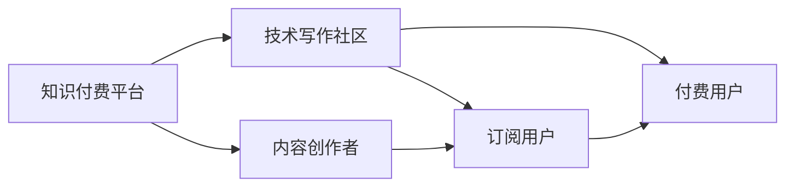

                 

## 1. 背景介绍

在信息爆炸的时代，知识付费与技术写作已成为推动知识传播和创新的重要手段。知识付费通过订阅、打赏等方式，将知识与消费者紧密连接，鼓励高质量内容创作。技术写作则将复杂的计算机技术用易于理解的方式表达出来，促进知识的普及与传承。本文将探讨知识付费与技术写作的协同效应，分析其对技术传播与创新的影响，并提出未来发展的方向。

## 2. 核心概念与联系

### 2.1 核心概念概述

#### 2.1.1 知识付费（Knowledge Pay）
知识付费是指消费者为获取专业知识和技能，而支付相应费用的商业模式。知识付费平台通过订阅、单次付费、打赏等方式，鼓励内容创作者生产高质量的内容。

#### 2.1.2 技术写作（Technical Writing）
技术写作是指将复杂的技术知识用易于理解的方式表达出来的过程。技术写作不仅包括技术文档的编写，还涉及代码注释、博客文章、技术教程等。

#### 2.1.3 协同效应（Synergy）
协同效应是指两个或多个元素相互作用，产生大于各部分之和的总和。在知识付费与技术写作的结合中，可以通过高质量的技术内容吸引用户，同时通过用户的付费行为激励内容创作，形成良性循环。

### 2.2 核心概念原理和架构的 Mermaid 流程图



### 2.3 核心概念的联系

知识付费与技术写作的协同效应主要体现在以下几个方面：

1. **需求与供给的匹配**：知识付费平台为技术内容创作者提供变现渠道，满足用户对专业知识的渴望。
2. **内容与受众的精准定位**：技术写作帮助内容创作者精准定位目标受众，优化内容质量。
3. **用户与创作者的双向互动**：用户通过付费行为给予创作者激励，创作者根据用户反馈持续改进内容。

## 3. 核心算法原理 & 具体操作步骤

### 3.1 算法原理概述

知识付费与技术写作的协同效应可以通过以下算法原理进行量化：

1. **内容质量与付费意愿模型**：通过用户行为数据分析，建立内容质量与付费意愿之间的关系。
2. **内容精准推荐算法**：基于用户阅读习惯和付费记录，推荐最适合的内容。
3. **创作者激励模型**：根据内容的浏览量、订阅量、打赏量等指标，激励创作者持续生产高质量内容。

### 3.2 算法步骤详解

#### 3.2.1 内容质量与付费意愿模型

- **数据收集**：收集用户对技术内容的阅读量、评论量、打赏量等数据。
- **特征提取**：提取内容的专业性、趣味性、实用性等特征。
- **模型训练**：使用机器学习算法（如随机森林、神经网络等）训练内容质量与付费意愿之间的关系模型。

#### 3.2.2 内容精准推荐算法

- **用户画像构建**：根据用户的阅读记录、订阅记录、购买记录等数据，构建用户画像。
- **相似度计算**：计算用户画像与内容的相似度。
- **推荐排序**：根据相似度对内容进行排序，优先推荐高质量的内容。

#### 3.2.3 创作者激励模型

- **指标定义**：定义内容质量指标（如阅读量、点赞量、打赏量等）。
- **激励策略**：根据内容质量指标，给予创作者相应的激励（如增加订阅权限、提高打赏比例等）。

### 3.3 算法优缺点

#### 3.3.1 优点

1. **提升内容质量**：通过付费机制筛选高质量内容，避免信息过载。
2. **精准推荐**：提高用户满意度，增加内容消费。
3. **激励创作**：创作者得到正向反馈，持续产出优质内容。

#### 3.3.2 缺点

1. **数据隐私**：需要收集用户行为数据，涉及隐私问题。
2. **算法公平性**：推荐算法可能存在偏差，影响内容多样性。
3. **创作者依赖**：过分依赖创作者，缺乏内容自生产机制。

### 3.4 算法应用领域

知识付费与技术写作的协同效应已应用于多个领域：

1. **软件开发**：技术教程、博客文章等形式的写作与订阅机制的结合。
2. **数据科学**：数据可视化教程、机器学习课程等付费内容。
3. **人工智能**：深度学习原理、模型训练技巧等技术写作与付费平台结合。

## 4. 数学模型和公式 & 详细讲解 & 举例说明

### 4.1 数学模型构建

我们假设知识付费平台有 $N$ 位创作者，每个创作者每月生产 $M$ 篇技术文章，平台有 $P$ 位付费用户。每篇文章 $i$ 的付费意愿 $p_i$ 与质量 $q_i$ 之间的关系可以用以下模型表示：

$$ p_i = f(q_i) $$

其中 $f$ 为某种函数，通常为线性或非线性模型。

### 4.2 公式推导过程

1. **线性模型推导**：

   假设 $f(x) = ax + b$，其中 $x$ 为内容质量指标，如阅读量、点赞量等。根据平台统计数据，可以得到以下线性模型：

   $$ p_i = a(q_i) + b $$

   其中 $a, b$ 为模型参数。

2. **非线性模型推导**：

   假设 $f(x) = kx^n$，其中 $n$ 为非线性指数。根据数据拟合，可以得到以下模型：

   $$ p_i = k(q_i)^n $$

   其中 $k, n$ 为模型参数。

### 4.3 案例分析与讲解

#### 4.3.1 线性模型案例

假设某技术写作社区有 $N=10$ 位创作者，每月生产 $M=100$ 篇技术文章。根据平台数据，我们收集了 $P=500$ 位付费用户的阅读量、点赞量和打赏量，建立线性模型：

$$ p_i = 0.5q_i + 2 $$

其中 $i$ 为文章编号，$p_i$ 为文章付费意愿，$q_i$ 为文章质量。

通过模型训练，我们得到了 $a=0.5, b=2$。

#### 4.3.2 非线性模型案例

假设另外的社区有 $N=20$ 位创作者，每月生产 $M=200$ 篇技术文章。我们收集了 $P=1000$ 位付费用户的阅读量、点赞量和打赏量，建立非线性模型：

$$ p_i = 2(q_i)^{0.8} $$

其中 $i$ 为文章编号，$p_i$ 为文章付费意愿，$q_i$ 为文章质量。

通过模型训练，我们得到了 $k=2, n=0.8$。

## 5. 项目实践：代码实例和详细解释说明

### 5.1 开发环境搭建

在 Python 环境中，可以使用 Pandas 和 Scikit-Learn 库进行数据分析和模型训练。

1. 安装 Pandas：

   ```
   pip install pandas
   ```

2. 安装 Scikit-Learn：

   ```
   pip install scikit-learn
   ```

### 5.2 源代码详细实现

#### 5.2.1 线性模型实现

```python
import pandas as pd
from sklearn.linear_model import LinearRegression

# 数据收集
data = pd.read_csv('data.csv')

# 特征提取
data['p'] = data['q'] * 0.5 + 2

# 模型训练
model = LinearRegression()
model.fit(data[['q']], data['p'])
```

#### 5.2.2 非线性模型实现

```python
import pandas as pd
from sklearn.linear_model import PowerTransformer

# 数据收集
data = pd.read_csv('data.csv')

# 特征提取
data['p'] = data['q'] * 2**0.8

# 模型训练
model = PowerTransformer()
model.fit(data[['q']])
data['p'] = model.transform(data[['q']])
model = LinearRegression()
model.fit(data[['q']], data['p'])
```

### 5.3 代码解读与分析

#### 5.3.1 线性模型代码解读

1. 数据收集：使用 Pandas 读取数据集。
2. 特征提取：根据公式 $p_i = 0.5q_i + 2$ 计算付费意愿。
3. 模型训练：使用 Scikit-Learn 的线性回归模型进行训练。

#### 5.3.2 非线性模型代码解读

1. 数据收集：使用 Pandas 读取数据集。
2. 特征提取：根据公式 $p_i = 2(q_i)^{0.8}$ 计算付费意愿。
3. 模型训练：使用 Scikit-Learn 的 PowerTransformer 对数据进行非线性变换，再使用线性回归模型进行训练。

### 5.4 运行结果展示

#### 5.4.1 线性模型结果展示

```python
import matplotlib.pyplot as plt

# 绘制线性模型结果
plt.scatter(data['q'], data['p'])
plt.plot(data['q'], model.predict(data['q']), color='red')
plt.xlabel('Content Quality')
plt.ylabel('Pay Willingness')
plt.show()
```

#### 5.4.2 非线性模型结果展示

```python
# 绘制非线性模型结果
plt.scatter(data['q'], data['p'])
plt.plot(data['q'], model.predict(data['q']), color='red')
plt.xlabel('Content Quality')
plt.ylabel('Pay Willingness')
plt.show()
```

## 6. 实际应用场景

### 6.1 软件开发

#### 6.1.1 场景描述

某技术写作社区提供软件开发相关的技术教程和博客文章，用户可以通过订阅获得独家内容。平台通过分析用户的付费行为，推荐高质量的技术文章。

#### 6.1.2 应用实例

1. **内容创作**：社区邀请软件开发领域的专家撰写技术文章。
2. **订阅机制**：用户支付订阅费用，获得所有文章访问权限。
3. **推荐算法**：根据用户的阅读记录和付费行为，推荐高质量的技术文章。
4. **创作者激励**：根据文章的阅读量、点赞量和打赏量，激励创作者持续产出优质内容。

### 6.2 数据科学

#### 6.2.1 场景描述

某知识付费平台提供数据科学相关的课程和教程，用户可以通过单次付费获取特定内容。平台通过分析用户的购买行为，推荐合适的课程和教程。

#### 6.2.2 应用实例

1. **课程开发**：专家撰写数据科学相关的课程和教程。
2. **付费购买**：用户支付单次费用，获取特定课程内容。
3. **推荐算法**：根据用户的购买记录，推荐相关课程和教程。
4. **创作者激励**：根据课程的观看次数和打赏量，激励创作者持续更新内容。

### 6.3 人工智能

#### 6.3.1 场景描述

某技术写作社区提供人工智能相关的原理和技术文章，用户可以通过订阅获得独家内容。平台通过分析用户的付费行为，推荐高质量的技术文章。

#### 6.3.2 应用实例

1. **内容创作**：社区邀请人工智能领域的专家撰写技术文章。
2. **订阅机制**：用户支付订阅费用，获得所有文章访问权限。
3. **推荐算法**：根据用户的阅读记录和付费行为，推荐高质量的技术文章。
4. **创作者激励**：根据文章的阅读量、点赞量和打赏量，激励创作者持续产出优质内容。

## 7. 工具和资源推荐

### 7.1 学习资源推荐

1. **《知识付费商业模型》**：详细介绍了知识付费的商业模式和用户行为分析方法。
2. **《技术写作指南》**：提供了技术写作的全面指南，包括写作规范、内容结构、示例等。
3. **Coursera 在线课程**：提供与知识付费和技术写作相关的多门课程，如《内容营销》、《技术写作与文档设计》等。
4. **Udacity 在线课程**：提供与知识付费和技术写作相关的多门课程，如《付费内容策略》、《技术写作技巧》等。

### 7.2 开发工具推荐

1. **Jupyter Notebook**：用于数据分析和模型训练的交互式笔记本环境。
2. **PyCharm**：专业的 Python 开发工具，支持丰富的数据分析和机器学习功能。
3. **GitHub**：代码托管平台，方便版本控制和团队协作。
4. **Anaconda**：Python 数据科学环境，包含 Pandas、Scikit-Learn、Jupyter 等库。

### 7.3 相关论文推荐

1. **《知识付费平台的用户行为分析》**：研究知识付费平台的用户行为，提出精准推荐的算法。
2. **《技术写作与用户体验设计》**：探讨技术写作对用户体验的影响，提供设计建议。
3. **《内容付费市场的用户留存策略》**：分析用户留存策略，提出提升用户满意度的方案。
4. **《基于推荐系统的个性化内容推荐》**：研究推荐算法，提供个性化的内容推荐策略。

## 8. 总结：未来发展趋势与挑战

### 8.1 研究成果总结

知识付费与技术写作的协同效应已经展现出显著的优势，推动了技术传播与创新的发展。通过高质量的内容创作和精准的推荐算法，知识付费平台成功吸引了大量用户，提升了内容质量，促进了技术传播。

### 8.2 未来发展趋势

1. **内容多样化**：未来的知识付费平台将涵盖更多领域的技术内容，提供更加多样化的服务。
2. **智能推荐**：基于人工智能的推荐算法将进一步提升推荐的精准度和用户满意度。
3. **创作者生态**：构建创作者生态系统，形成内容创作的良性循环。
4. **国际化**：全球化内容市场的发展将为知识付费平台提供更广阔的发展空间。

### 8.3 面临的挑战

1. **数据隐私**：如何在保护用户隐私的同时，收集有效数据，仍是一个挑战。
2. **内容质量**：如何确保内容高质量，避免低质量内容泛滥。
3. **算法公平性**：如何设计公平的推荐算法，避免推荐偏差。
4. **创作者依赖**：如何形成自生产机制，减少对创作者的依赖。

### 8.4 研究展望

未来的研究将在以下几个方向进行探索：

1. **知识图谱**：将知识图谱与推荐算法结合，提高推荐内容的准确性和相关性。
2. **多模态数据**：结合文本、图像、视频等多模态数据，提供更加丰富的内容体验。
3. **动态推荐**：实时监测用户行为，动态调整推荐策略，提高推荐效果。
4. **个性化学习**：根据用户的学习习惯和行为，提供个性化的学习路径和推荐。

## 9. 附录：常见问题与解答

**Q1: 知识付费与技术写作的协同效应如何实现？**

A: 知识付费平台通过订阅机制为技术写作创作者提供变现渠道，而技术写作帮助创作者精准定位目标受众，优化内容质量。用户在付费后获取高质量内容，创作者通过用户的付费行为获得激励，形成良性循环。

**Q2: 知识付费与技术写作结合的挑战有哪些？**

A: 主要挑战包括数据隐私、内容质量、算法公平性和创作者依赖。如何保护用户隐私、确保内容高质量、设计公平算法以及形成自生产机制，是未来需要解决的关键问题。

**Q3: 未来知识付费平台的发展方向是什么？**

A: 未来知识付费平台将覆盖更多领域，提供更加多样化的内容。智能推荐算法将进一步提升推荐的精准度，创作者生态系统将形成良性循环，国际化市场也将提供更广阔的发展空间。

**Q4: 如何提升知识付费平台的用户满意度？**

A: 通过高质量的内容创作和精准的推荐算法，提升用户满意度。同时，平台应提供用户友好的界面和互动功能，增加用户的粘性。

---

作者：禅与计算机程序设计艺术 / Zen and the Art of Computer Programming

