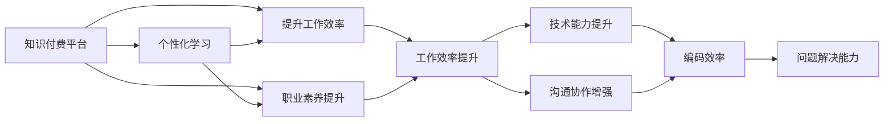

                 

## 1. 背景介绍

在快速变化的技术环境中，程序员面临着不断学习新技能、跟上技术潮流的需求。然而，高强度的编程任务和海量的技术信息使得程序员的“学习-工作-休息”周期变得异常紧张，导致效率低下和职业倦怠。知识付费平台作为一种新兴的在线学习形式，为程序员提供了个性化、结构化的学习内容，有助于提升工作效率和职业素养。

### 1.1 问题由来

**1.1.1 信息过载问题**

当前互联网时代，技术信息更新频繁，各种新技术、新工具层出不穷。这对程序员来说是一把双刃剑，一方面拓宽了知识面，另一方面也造成了信息过载，很难在有限的时间内掌握所有相关知识。

**1.1.2 学习效率问题**

传统的课程学习方式，尤其是面对面的课堂教学，效率较低。许多课程内容往往过于理论化，无法快速转化为实际工作的技能。

**1.1.3 职业倦怠问题**

高强度的工作压力和持续的学习需求，使得许多程序员处于长期的精神紧张状态，容易出现职业倦怠，影响工作效率和生活质量。

### 1.2 问题核心关键点

- **知识付费平台**：基于在线订阅模式的知识服务，以课程、视频、书籍等多种形式提供给用户，帮助用户快速掌握新技能。
- **个性化学习**：根据用户的学习历史和偏好，推荐合适的课程和资料，实现高效的学习体验。
- **提升工作效率**：通过学习新技能，改进现有工作方法，提升解决问题的速度和质量。
- **职业素养提升**：除了技术技能，知识付费还涵盖软技能、职业规划、时间管理等内容，有助于提升职业素养。

## 2. 核心概念与联系

### 2.1 核心概念概述

**知识付费平台**：基于互联网的在线知识服务模式，用户通过订阅、购买或免费观看的方式获取知识。平台通过算法推荐、内容优化等方式，提供个性化学习服务。

**个性化学习**：根据用户的学习习惯和偏好，动态调整学习计划和内容推荐，实现高效的学习效果。

**提升工作效率**：通过学习新技能，改进工作流程，提升编码效率和问题解决能力。

**职业素养提升**：涵盖沟通技巧、项目管理、团队协作等多方面内容，帮助程序员全面提升职业素养。

这些核心概念之间的逻辑关系可以通过以下Mermaid流程图来展示：



这个流程图展示了个体从知识付费平台获取知识，到提升工作效率、职业素养，最后带来个人能力提升的过程：

1. 知识付费平台提供个性化学习内容。
2. 通过提升工作效率和职业素养，实现个人能力全面提升。
3. 工作效率提升和沟通协作能力增强，显著提升编码效率和问题解决能力。

## 3. 核心算法原理 & 具体操作步骤

### 3.1 算法原理概述

知识付费平台的核心算法原理主要基于推荐系统和个性化学习理论。其核心目标是根据用户的学习历史和行为数据，推荐合适的学习内容，最大化用户的学习效果和满意度。

推荐系统一般包含以下几个模块：

- **用户画像**：根据用户的浏览历史、学习行为、兴趣爱好等，建立用户画像，用于个性化的内容推荐。
- **内容标签**：对学习内容进行标签化处理，以便进行相似度计算和推荐。
- **相似度计算**：根据用户画像和内容标签，计算用户与内容的相似度，选出最匹配的推荐内容。
- **推荐算法**：根据相似度计算结果，结合用户的学习进度、课程难度等因素，制定推荐策略。

### 3.2 算法步骤详解

#### 3.2.1 用户画像构建

用户画像的构建是推荐系统的核心步骤，主要包括：

- **数据收集**：收集用户的浏览记录、学习进度、评分、反馈等信息。
- **特征提取**：提取用户画像中的关键特征，如兴趣领域、学习难度偏好等。
- **画像维护**：实时更新用户画像，保持其准确性和时效性。

#### 3.2.2 内容标签化

内容标签化主要包括：

- **领域划分**：将课程、文章等学习内容划分为多个领域，如Python、Java、算法等。
- **标签设置**：为每个学习内容设置标签，如难度、时长、内容类型等。
- **标签权重**：根据用户画像中对不同标签的偏好，动态调整标签权重。

#### 3.2.3 相似度计算

相似度计算模块包括：

- **余弦相似度**：计算用户画像与内容标签之间的余弦相似度，选出最匹配的推荐内容。
- **Jaccard系数**：计算用户画像与内容标签之间的Jaccard系数，衡量兴趣领域的相似性。
- **协同过滤**：根据其他用户的学习行为，推荐相似度高的内容。

#### 3.2.4 推荐算法

推荐算法包括：

- **基于内容的推荐**：根据内容标签与用户画像的相似度，推荐相关内容。
- **协同过滤推荐**：根据用户的行为数据，推测其他用户的偏好，推荐相似内容。
- **混合推荐**：结合基于内容和协同过滤的推荐方法，提高推荐效果。

### 3.3 算法优缺点

**优点**：

- **个性化高效**：根据用户画像进行个性化推荐，能够最大化学习效率和满意度。
- **数据驱动**：推荐算法基于数据驱动，能够快速迭代优化，提升推荐效果。
- **动态更新**：用户画像和内容标签实时更新，能够适应用户的动态变化。

**缺点**：

- **隐私保护**：收集用户数据需要关注隐私保护问题，避免数据泄露。
- **数据质量**：用户数据质量不高会导致推荐效果不佳，需要持续优化数据收集方法。
- **冷启动问题**：新用户初期缺乏足够的学习数据，难以准确推荐。

### 3.4 算法应用领域

知识付费平台可以应用于多个领域，如：

- **技术学习**：提供各种编程语言、技术框架、开发工具等课程。
- **项目管理**：涵盖敏捷开发、Scrum、Kanban等内容，帮助团队提高项目管理效率。
- **职业发展**：提供职业规划、简历写作、面试技巧等课程，帮助职业人士提升竞争力。
- **时间管理**：提供时间管理技巧、番茄工作法等内容，帮助用户提高工作效率。

## 4. 数学模型和公式 & 详细讲解 & 举例说明

### 4.1 数学模型构建

知识付费平台的推荐系统通常采用协同过滤和基于内容的推荐算法。协同过滤算法基于用户之间的相似度，推荐相似用户喜欢的内容；基于内容的推荐算法则基于内容本身的特点，推荐相关内容。

#### 4.1.1 协同过滤算法

协同过滤算法分为基于用户的协同过滤和基于物品的协同过滤：

- **基于用户的协同过滤**：根据用户之间的相似度，推荐相似用户喜欢的内容。
  $$
  \text{similarity}(u, v) = \frac{\text{用户u和v的相似度}}{\sqrt{(\text{用户u的评分数量}) + (\text{用户v的评分数量})}}
  $$
  其中，用户u和v的相似度由他们对同一内容的评分之差计算。

- **基于物品的协同过滤**：根据物品之间的相似度，推荐相似物品。
  $$
  \text{similarity}(i, j) = \frac{\text{物品i和j的评分之和}}{\sqrt{(\text{物品i的评分数量}) + (\text{物品j的评分数量})}}
  $$
  其中，物品i和j的评分之和表示他们共同被多少用户评分。

#### 4.1.2 基于内容的推荐算法

基于内容的推荐算法包括基于余弦相似度的推荐和基于Jaccard系数的推荐：

- **基于余弦相似度的推荐**：计算内容与用户画像的余弦相似度，推荐相似度高的内容。
  $$
  \text{similarity}(c, u) = \frac{\text{内容c和用户画像u的向量点积}}{\text{内容c和用户画像u的向量范数之积}}
  $$
  其中，内容c的向量由其所有特征组成，用户画像u的向量由用户对所有内容的评分组成。

- **基于Jaccard系数的推荐**：计算内容与用户画像的Jaccard系数，衡量兴趣领域的相似性。
  $$
  \text{similarity}(c, u) = \frac{\text{内容c和用户画像u的交集大小}}{\text{内容c和用户画像u的并集大小}}
  $$
  其中，内容c和用户画像u的交集表示它们共同被多少用户评分，并集表示他们所有可能被评分的数量。

### 4.2 公式推导过程

#### 4.2.1 协同过滤算法

基于用户的协同过滤算法推导如下：

1. 计算用户u和v的相似度：
  $$
  \text{similarity}(u, v) = \frac{\sum_{k=1}^{n} (u_k \cdot v_k)}{\sqrt{\sum_{k=1}^{n} u_k^2 + \sum_{k=1}^{n} v_k^2}}
  $$
  其中，$u_k$ 和 $v_k$ 表示用户u和v对同一内容的评分，$n$ 表示用户u和v共同评分的内容数量。

2. 推荐用户u喜欢的内容：
  $$
  \text{recommend}(u) = \text{argmax}_{i} \text{similarity}(u, v)
  $$
  其中，$i$ 表示用户u喜欢的内容。

基于物品的协同过滤算法推导类似，只需将上述公式中的用户u和v替换为内容i和j即可。

#### 4.2.2 基于内容的推荐算法

基于余弦相似度的推荐算法推导如下：

1. 计算内容c的特征向量：
  $$
  c = (c_1, c_2, \cdots, c_n)
  $$
  其中，$c_k$ 表示内容c的第k个特征。

2. 计算用户画像u的特征向量：
  $$
  u = (u_1, u_2, \cdots, u_n)
  $$
  其中，$u_k$ 表示用户u对内容c的评分。

3. 计算内容c和用户画像u的余弦相似度：
  $$
  \text{similarity}(c, u) = \frac{\sum_{k=1}^{n} c_k \cdot u_k}{\sqrt{\sum_{k=1}^{n} c_k^2} \cdot \sqrt{\sum_{k=1}^{n} u_k^2}}
  $$

### 4.3 案例分析与讲解

以一个简单的学习平台为例，分析其推荐系统的具体实现：

1. 用户登录后，平台收集其浏览历史、学习进度、评分等数据，构建用户画像。
2. 平台将用户画像与课程特征向量进行余弦相似度计算，得到相似度最高的前10门课程。
3. 平台根据用户评分和课程评分，进行协同过滤计算，推荐其他用户评分高的课程。
4. 平台根据用户画像和内容标签的Jaccard系数，推荐相关课程。

通过以上步骤，平台能够实现个性化、精准的推荐，提升用户的学习效果和满意度。

## 5. 项目实践：代码实例和详细解释说明

### 5.1 开发环境搭建

知识付费平台的开发环境搭建如下：

1. 安装Python 3.x版本。
2. 安装Pandas、NumPy、Scikit-learn、TensorFlow等数据处理和机器学习库。
3. 安装Flask、Django等Web框架，用于构建Web服务。
4. 安装MySQL、MongoDB等数据库，用于存储用户数据和课程信息。
5. 安装Redis等缓存系统，提升数据查询效率。

### 5.2 源代码详细实现

以一个基于PyTorch的协同过滤推荐系统为例，展示其代码实现：

```python
import torch
import torch.nn as nn
import torch.optim as optim
from torch.utils.data import Dataset, DataLoader

class协同过滤推荐系统(nn.Module):
    def __init__(self, num_users, num_items, num_features):
        super(协同过滤推荐系统, self).__init__()
        self.num_users = num_users
        self.num_items = num_items
        self.num_features = num_features
        self.u_mean = nn.Parameter(torch.zeros(num_users, 1))
        self.u_std = nn.Parameter(torch.ones(num_users, 1))
        self.v_mean = nn.Parameter(torch.zeros(num_items, 1))
        self.v_std = nn.Parameter(torch.ones(num_items, 1))
        self.W_u = nn.Parameter(torch.randn(num_users, num_features))
        self.W_v = nn.Parameter(torch.randn(num_items, num_features))
        self.U = nn.Linear(num_features, 1)
        self.V = nn.Linear(num_features, 1)
        self.sigmoid = nn.Sigmoid()
    
    def forward(self, u, v):
        u = (u - self.u_mean) / self.u_std
        v = (v - self.v_mean) / self.v_std
        u = self.W_u * u
        v = self.W_v * v
        uv_dot = (u * v).sum(dim=1)
        u_squared = (u**2).sum(dim=1)
        v_squared = (v**2).sum(dim=1)
        similarity = uv_dot / (torch.sqrt(u_squared) * torch.sqrt(v_squared))
        return similarity
    
    def loss(self, u, v, similarity):
        y_pred = self.sigmoid(self.U(u) + self.V(v))
        y_true = similarity
        loss = nn.BCELoss()(y_pred, y_true)
        return loss
    
    def train(self, dataset, num_epochs, batch_size, learning_rate):
        train_loader = DataLoader(dataset, batch_size=batch_size, shuffle=True)
        optimizer = optim.Adam(self.parameters(), lr=learning_rate)
        for epoch in range(num_epochs):
            for batch_u, batch_v in train_loader:
                optimizer.zero_grad()
                similarity = self(u, v)
                loss = self.loss(u, v, similarity)
                loss.backward()
                optimizer.step()
            if (epoch+1) % 10 == 0:
                print(f"Epoch {epoch+1}, Loss: {loss:.4f}")
```

### 5.3 代码解读与分析

上述代码中，协同过滤推荐系统使用了PyTorch的深度学习框架，主要包括：

- **模块初始化**：初始化用户画像、内容特征、权重矩阵和输出层等参数。
- **前向传播**：根据用户画像和内容特征，计算相似度。
- **损失函数**：使用二分类交叉熵损失函数，最小化预测相似度与真实相似度之间的差距。
- **模型训练**：使用Adam优化器，根据损失函数的梯度更新模型参数。

## 6. 实际应用场景

### 6.1 技术学习

在技术学习领域，知识付费平台提供了大量的编程课程、技术框架和工具介绍，帮助程序员快速掌握新技能。

以一个针对Python程序员的学习平台为例：

1. 平台收集用户的学习历史，构建用户画像，推荐用户喜欢的Python课程。
2. 平台根据课程的评分和用户评分，推荐其他用户评分高的课程。
3. 平台根据课程内容和用户画像的Jaccard系数，推荐相关课程。

### 6.2 项目管理

在项目管理领域，知识付费平台提供了敏捷开发、Scrum、Kanban等内容，帮助团队提升项目管理效率。

以一个针对敏捷开发的学习平台为例：

1. 平台收集用户的学习历史，构建用户画像，推荐用户喜欢的敏捷开发课程。
2. 平台根据课程的评分和用户评分，推荐其他用户评分高的课程。
3. 平台根据课程内容和用户画像的余弦相似度，推荐相关课程。

### 6.3 职业发展

在职业发展领域，知识付费平台提供了职业规划、简历写作、面试技巧等课程，帮助职业人士提升竞争力。

以一个针对职业发展的学习平台为例：

1. 平台收集用户的职业规划需求，构建用户画像，推荐用户喜欢的职业规划课程。
2. 平台根据课程的评分和用户评分，推荐其他用户评分高的课程。
3. 平台根据课程内容和用户画像的Jaccard系数，推荐相关课程。

### 6.4 时间管理

在时间管理领域，知识付费平台提供了时间管理技巧、番茄工作法等内容，帮助用户提高工作效率。

以一个针对时间管理的学习平台为例：

1. 平台收集用户的时间管理需求，构建用户画像，推荐用户喜欢的时间管理课程。
2. 平台根据课程的评分和用户评分，推荐其他用户评分高的课程。
3. 平台根据课程内容和用户画像的余弦相似度，推荐相关课程。

## 7. 工具和资源推荐

### 7.1 学习资源推荐

为帮助开发者系统掌握知识付费平台的推荐算法，这里推荐一些优质的学习资源：

1. 《推荐系统实战》：由斯坦福大学讲师撰写，全面介绍了推荐系统的理论基础和实现方法。
2. 《Python推荐系统》：是一本基于Python的推荐系统实践指南，涵盖协同过滤、内容推荐等技术。
3. 《深度学习与推荐系统》：是一本深度学习在推荐系统中的应用指南，讲解了基于深度学习的推荐算法。
4. Coursera《Recommender Systems》课程：由纽约大学教授主讲，讲解推荐系统的理论基础和实际应用。
5. Udacity《Deep Learning for Recommendation Systems》课程：讲解深度学习在推荐系统中的应用，包括协同过滤、基于内容的推荐等。

### 7.2 开发工具推荐

知识付费平台的开发过程中，推荐使用以下工具：

1. Jupyter Notebook：一个交互式编程环境，支持Python等语言，适合数据处理和模型训练。
2. PyTorch：一个灵活的深度学习框架，适合构建推荐系统模型。
3. TensorFlow：一个强大的深度学习框架，适合大规模模型的训练和部署。
4. Flask：一个轻量级的Web框架，适合构建推荐系统的Web服务。
5. Django：一个全功能的Web框架，适合构建复杂的应用系统。
6. MySQL：一个流行的关系型数据库，适合存储用户数据和课程信息。
7. Redis：一个高性能的缓存系统，提升数据查询效率。

### 7.3 相关论文推荐

知识付费平台的推荐系统涉及多种算法和技术，以下是几篇相关论文，推荐阅读：

1. 《协同过滤算法综述》：详细介绍了协同过滤算法的原理和实现方法。
2. 《基于内容的推荐系统》：介绍了基于内容的推荐算法，并分析了其实现效果。
3. 《深度学习在推荐系统中的应用》：探讨了深度学习在推荐系统中的应用，包括协同过滤和内容推荐等。
4. 《混合推荐系统》：介绍了多种推荐算法的混合实现方法，并分析了其效果。

## 8. 总结：未来发展趋势与挑战

### 8.1 总结

本文对知识付费平台的推荐算法进行了系统介绍，介绍了协同过滤和基于内容的推荐算法，并结合实际应用场景，给出了推荐系统的详细代码实现。通过本文的系统梳理，可以看到，知识付费平台通过个性化推荐，帮助用户高效学习，提升工作效率，实现职业发展。

### 8.2 未来发展趋势

展望未来，知识付费平台将呈现以下几个发展趋势：

1. **个性化推荐**：推荐算法将更加精准，根据用户行为数据和反馈不断优化。
2. **多模态融合**：结合文本、图像、视频等多模态数据，提供更丰富的推荐内容。
3. **实时推荐**：基于流式数据，实时更新推荐内容，提高用户体验。
4. **社区互动**：增加用户之间的互动和交流，提升推荐效果。
5. **跨领域推荐**：结合不同领域的数据，提供跨领域的推荐服务。

### 8.3 面临的挑战

尽管知识付费平台在个性化推荐上取得了显著进展，但仍面临以下挑战：

1. **数据隐私问题**：用户数据隐私保护需要不断加强，防止数据泄露。
2. **数据质量问题**：数据质量不高，影响推荐效果，需要持续优化数据收集方法。
3. **冷启动问题**：新用户初期缺乏足够的学习数据，难以准确推荐。
4. **计算资源问题**：推荐算法计算复杂，需要优化计算资源。

### 8.4 研究展望

面向未来，知识付费平台推荐系统需要从以下几个方面进行改进：

1. **隐私保护**：结合差分隐私、联邦学习等技术，提升数据隐私保护。
2. **数据质量**：引入预处理和清洗技术，提升数据质量。
3. **模型优化**：采用深度学习等先进算法，提高推荐效果。
4. **多模态融合**：结合多模态数据，提升推荐内容的多样性。
5. **实时推荐**：采用流式数据处理技术，实现实时推荐。
6. **社区互动**：增加用户之间的互动和交流，提升推荐效果。

## 9. 附录：常见问题与解答

**Q1：知识付费平台推荐算法有哪些？**

A: 知识付费平台推荐算法主要包括协同过滤和基于内容的推荐算法：

- **协同过滤**：基于用户之间的相似度，推荐相似用户喜欢的内容。
- **基于内容**：基于内容本身的特点，推荐相关内容。

**Q2：如何提高知识付费平台的推荐效果？**

A: 提高推荐效果的方法包括：

1. 数据收集：收集更多的用户行为数据，提升用户画像的准确性。
2. 算法优化：引入先进的推荐算法，如深度学习、混合推荐等。
3. 实时更新：基于流式数据，实时更新推荐内容。
4. 社区互动：增加用户之间的互动和交流，提升推荐效果。

**Q3：知识付费平台有哪些应用场景？**

A: 知识付费平台主要应用于以下几个场景：

1. 技术学习：提供编程课程、技术框架和工具介绍，帮助程序员快速掌握新技能。
2. 项目管理：提供敏捷开发、Scrum、Kanban等内容，帮助团队提升项目管理效率。
3. 职业发展：提供职业规划、简历写作、面试技巧等课程，帮助职业人士提升竞争力。
4. 时间管理：提供时间管理技巧、番茄工作法等内容，帮助用户提高工作效率。

**Q4：知识付费平台推荐算法的缺点有哪些？**

A: 知识付费平台推荐算法的缺点包括：

1. 数据隐私问题：用户数据隐私保护需要不断加强，防止数据泄露。
2. 数据质量问题：数据质量不高，影响推荐效果，需要持续优化数据收集方法。
3. 冷启动问题：新用户初期缺乏足够的学习数据，难以准确推荐。
4. 计算资源问题：推荐算法计算复杂，需要优化计算资源。

**Q5：如何构建用户画像？**

A: 构建用户画像的主要步骤如下：

1. 数据收集：收集用户的浏览历史、学习进度、评分等数据。
2. 特征提取：提取用户画像中的关键特征，如兴趣领域、学习难度偏好等。
3. 画像维护：实时更新用户画像，保持其准确性和时效性。

**Q6：知识付费平台推荐系统的实现方法是什么？**

A: 知识付费平台推荐系统的实现方法主要包括：

1. 用户画像构建：根据用户数据，构建用户画像。
2. 内容标签化：对课程内容进行标签化处理。
3. 相似度计算：计算用户画像与内容标签之间的相似度。
4. 推荐算法：根据相似度计算结果，推荐合适的学习内容。

**Q7：知识付费平台的推荐算法有哪些优点？**

A: 知识付费平台的推荐算法具有以下优点：

1. 个性化高效：根据用户画像进行个性化推荐，能够最大化学习效率和满意度。
2. 数据驱动：推荐算法基于数据驱动，能够快速迭代优化，提升推荐效果。
3. 动态更新：用户画像和内容标签实时更新，能够适应用户的动态变化。

**Q8：知识付费平台的推荐算法有哪些缺点？**

A: 知识付费平台的推荐算法有以下缺点：

1. 隐私保护问题：收集用户数据需要关注隐私保护问题，避免数据泄露。
2. 数据质量问题：用户数据质量不高会导致推荐效果不佳，需要持续优化数据收集方法。
3. 冷启动问题：新用户初期缺乏足够的学习数据，难以准确推荐。

**Q9：知识付费平台的推荐算法如何实现？**

A: 知识付费平台的推荐算法实现步骤如下：

1. 用户画像构建：根据用户数据，构建用户画像。
2. 内容标签化：对课程内容进行标签化处理。
3. 相似度计算：计算用户画像与内容标签之间的相似度。
4. 推荐算法：根据相似度计算结果，推荐合适的学习内容。

**Q10：知识付费平台推荐算法的实现难点是什么？**

A: 知识付费平台推荐算法的实现难点包括：

1. 数据隐私问题：用户数据隐私保护需要不断加强，防止数据泄露。
2. 数据质量问题：数据质量不高，影响推荐效果，需要持续优化数据收集方法。
3. 冷启动问题：新用户初期缺乏足够的学习数据，难以准确推荐。

**Q11：知识付费平台的推荐算法有哪些改进方法？**

A: 知识付费平台的推荐算法改进方法包括：

1. 隐私保护：结合差分隐私、联邦学习等技术，提升数据隐私保护。
2. 数据质量：引入预处理和清洗技术，提升数据质量。
3. 模型优化：采用深度学习等先进算法，提高推荐效果。
4. 多模态融合：结合多模态数据，提升推荐内容的多样性。
5. 实时推荐：采用流式数据处理技术，实现实时推荐。
6. 社区互动：增加用户之间的互动和交流，提升推荐效果。

作者：禅与计算机程序设计艺术 / Zen and the Art of Computer Programming

