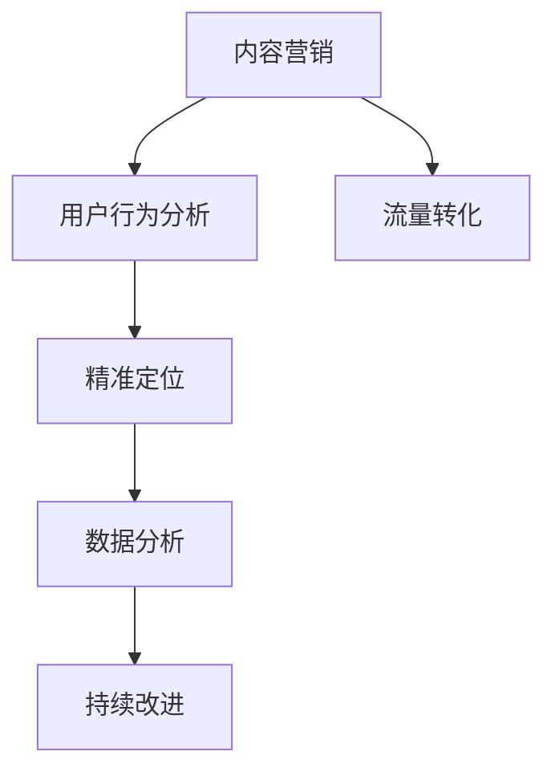

                 

# 知识付费创业中的内容营销ROI优化

> 关键词：知识付费,内容营销,ROI优化,用户行为,流量转化,精准定位,数据分析,社交媒体,广告投放,持续改进

## 1. 背景介绍

### 1.1 问题由来

随着互联网和移动设备的普及，知识付费逐渐成为新兴的商业模式，吸引了大量的创业者进入这一领域。然而，在知识付费创业中，如何有效吸引用户并提高内容消费转化率，成为了一个核心问题。内容营销作为知识付费创业的重要手段，其效果直接关系到平台的成功与否。

内容营销不仅包括通过高质量、有价值的内容吸引用户，还需要对用户的消费行为进行深入分析，并制定相应的策略来提升用户的参与度和转化率。在这一过程中，如何通过数据分析来优化内容营销ROI（投资回报率），成为一个亟待解决的问题。

### 1.2 问题核心关键点

优化内容营销ROI的核心关键点主要包括以下几个方面：

1. **用户行为分析**：了解用户如何与内容进行互动，分析哪些内容最能吸引用户，哪些用户更容易转化为付费用户。
2. **流量转化**：提高内容到付费用户的转化率，即通过内容营销吸引用户并促使他们付费订阅或购买。
3. **精准定位**：通过数据分析了解目标用户群体的特征，精准推送符合用户需求的内容。
4. **数据分析**：利用大数据和机器学习技术，对内容营销的效果进行量化评估和优化。
5. **持续改进**：基于数据分析结果，不断优化内容生产和推广策略，实现持续增长。

这些关键点共同构成了内容营销ROI优化的基本框架，帮助创业者在知识付费市场中取得成功。

## 2. 核心概念与联系

### 2.1 核心概念概述

为了更好地理解内容营销ROI优化的各个环节，本节将介绍几个关键概念：

1. **内容营销**：通过创造和分发有价值、相关且一致的内容，以吸引、留住明确定义的受众群体，并最终驱动盈利性的客户行为。
2. **ROI优化**：通过分析用户行为和数据，不断调整和优化营销策略，最大化投资回报率。
3. **用户行为分析**：对用户的行为、兴趣和需求进行详细分析，以指导内容制作和推广。
4. **流量转化**：将访问内容的用户转化为付费用户，提高内容营销的效果。
5. **精准定位**：通过分析用户特征和行为，为特定用户群体提供定制化的内容，提升用户满意度和转化率。
6. **数据分析**：利用数据分析技术，量化评估内容营销的效果，并根据数据反馈调整策略。
7. **持续改进**：通过不断迭代和优化，实现内容营销效果的持续提升。

这些概念之间的逻辑关系可以通过以下Mermaid流程图来展示：



这个流程图展示了内容营销ROI优化的各个环节及其相互关系：

1. 内容营销是整个优化的起点，通过高质量内容吸引用户。
2. 用户行为分析是优化过程的基础，通过分析用户行为指导内容制作和推广。
3. 流量转化是核心目标，即提高内容到付费用户的转化率。
4. 精准定位通过数据分析，为特定用户群体提供定制化内容。
5. 数据分析量化评估内容营销效果，并反馈指导策略调整。
6. 持续改进基于数据反馈，不断优化内容和推广策略。

这些概念共同构成了内容营销ROI优化的逻辑框架，帮助创业者系统地提升内容营销效果。

## 3. 核心算法原理 & 具体操作步骤

### 3.1 算法原理概述

内容营销ROI优化的核心算法原理包括用户行为分析、流量转化优化、精准定位策略、数据分析模型和持续改进方法。

1. **用户行为分析**：通过分析用户在平台上的浏览、点击、停留、购买等行为数据，了解用户对不同内容的偏好和兴趣，指导内容制作和推荐。
2. **流量转化优化**：利用A/B测试、推荐系统等技术，优化内容展示和推广策略，提高内容到付费用户的转化率。
3. **精准定位**：通过用户画像分析、行为预测模型等，为不同用户群体提供定制化内容，提升用户满意度和转化率。
4. **数据分析模型**：构建数据模型，量化评估内容营销的效果，包括用户参与度、转化率、复购率等指标。
5. **持续改进**：基于数据分析结果，不断调整和优化内容生产和推广策略，实现持续增长。

### 3.2 算法步骤详解

内容营销ROI优化的详细步骤包括：

**Step 1: 数据收集和预处理**

1. 收集平台上的用户行为数据，包括浏览记录、点击数据、购买记录等。
2. 对数据进行清洗和预处理，去除异常值和噪音，确保数据质量。

**Step 2: 用户行为分析**

1. 利用数据分析工具（如Google Analytics、Mixpanel等）分析用户行为，包括访问路径、停留时间、跳出率等。
2. 通过聚类分析和用户画像建模，识别不同用户群体的特征。

**Step 3: 流量转化优化**

1. 通过A/B测试，对比不同内容展示形式（如图文、视频、直播等）的效果，选择最佳展示方式。
2. 利用推荐系统，根据用户行为和偏好，推荐符合用户需求的内容。

**Step 4: 精准定位**

1. 通过行为预测模型，预测用户可能感兴趣的内容。
2. 根据用户画像和行为数据，为不同用户群体定制化推送内容。

**Step 5: 数据分析模型构建**

1. 构建用户参与度模型，量化评估用户对内容的参与程度。
2. 构建转化率模型，预测不同内容对用户购买行为的影响。

**Step 6: 持续改进**

1. 基于数据分析结果，调整和优化内容生产和推广策略。
2. 定期评估内容营销效果，并根据结果不断迭代和优化。

### 3.3 算法优缺点

内容营销ROI优化的算法具有以下优点：

1. **系统性**：通过数据驱动的方法，系统地分析用户行为和优化内容策略，提升效果。
2. **可量化**：利用数据分析模型，可以量化评估内容营销的效果，指导策略调整。
3. **可扩展性**：算法可以应用于各种内容形式和用户群体，具有广泛的应用前景。

同时，该算法也存在一些局限性：

1. **数据质量要求高**：数据收集和预处理需要高标准的质量控制，否则会影响分析结果的准确性。
2. **模型复杂度**：构建复杂的数据分析模型需要较高的技术门槛，可能会增加项目成本。
3. **持续优化需求高**：内容市场变化快，需要不断迭代和优化，对团队和技术要求较高。

尽管存在这些局限性，内容营销ROI优化算法仍是大规模知识付费创业中提升内容营销效果的重要手段。未来相关研究的重点在于如何进一步降低数据收集和处理的成本，提高模型的可解释性和可扩展性，同时兼顾快速迭代和优化。

### 3.4 算法应用领域

内容营销ROI优化算法在知识付费创业中的应用领域非常广泛，主要包括以下几个方面：

1. **在线教育平台**：通过内容营销吸引学生，提高课程购买率和用户留存率。
2. **技术博客和论坛**：通过高质量文章和教程吸引用户，提高订阅和广告收入。
3. **企业培训和咨询**：通过定制化内容吸引企业客户，提高咨询订单量和续费率。
4. **知识付费订阅服务**：通过内容营销吸引订阅用户，提高用户参与度和消费转化率。
5. **智能推荐系统**：利用推荐算法，为不同用户群体推荐符合其需求的内容。

除了上述这些经典应用外，内容营销ROI优化算法还可应用于更多场景中，如电子书销售、在线视频订阅、在线课程等，为知识付费创业带来全新的增长机会。

## 4. 数学模型和公式 & 详细讲解 & 举例说明（备注：数学公式请使用latex格式，latex嵌入文中独立段落使用 $$，段落内使用 $)
### 4.1 数学模型构建

假设内容营销的效果可以通过以下指标来量化评估：

1. **用户参与度（User Engagement）**：包括浏览量、点击率、评论数等。
2. **转化率（Conversion Rate）**：从内容访问到付费用户的转化率。
3. **复购率（Retention Rate）**：用户再次购买内容的概率。

设总参与度为 $U$，总转化率为 $C$，总复购率为 $R$，则内容营销的ROI可以表示为：

$$
ROI = \frac{U \times C \times R}{总成本}
$$

其中，总成本包括内容制作成本、推广成本、用户获取成本等。

### 4.2 公式推导过程

为了更好地理解上述模型，我们假设平台上有两个内容 $A$ 和 $B$，分别对两个用户群体 $U_A$ 和 $U_B$ 进行内容营销。

1. **用户参与度模型**：

   通过回归分析，假设内容 $A$ 和 $B$ 的参与度分别与用户群体特征 $X_A$ 和 $X_B$ 相关，则有：

   $$
   U_A = \alpha_A X_A + \beta_A \epsilon_A
   $$

   $$
   U_B = \alpha_B X_B + \beta_B \epsilon_B
   $$

   其中 $\alpha_A, \beta_A$ 为回归系数，$\epsilon_A, \epsilon_B$ 为随机误差。

2. **转化率模型**：

   假设内容 $A$ 和 $B$ 的转化率分别与参与度 $U_A, U_B$ 成正比，则有：

   $$
   C_A = \gamma_A U_A + \delta_A \epsilon_C
   $$

   $$
   C_B = \gamma_B U_B + \delta_B \epsilon_C
   $$

   其中 $\gamma_A, \delta_A$ 为回归系数，$\epsilon_C$ 为随机误差。

3. **复购率模型**：

   假设内容 $A$ 和 $B$ 的复购率分别与转化率 $C_A, C_B$ 成正比，则有：

   $$
   R_A = \theta_A C_A + \eta_A \epsilon_R
   $$

   $$
   R_B = \theta_B C_B + \eta_B \epsilon_R
   $$

   其中 $\theta_A, \eta_A$ 为回归系数，$\epsilon_R$ 为随机误差。

4. **ROI计算**：

   将上述模型代入ROI公式，得到：

   $$
   ROI = \frac{(\alpha_A X_A + \beta_A \epsilon_A)(\gamma_A (\alpha_A X_A + \beta_A \epsilon_A) + \delta_A \epsilon_C)(\theta_A (\gamma_A (\alpha_A X_A + \beta_A \epsilon_A) + \delta_A \epsilon_C) + \eta_A \epsilon_R)}{\text{总成本}}
   $$

### 4.3 案例分析与讲解

假设某在线教育平台上有两个课程 $A$ 和 $B$，分别对小学和初中学生群体进行内容营销。通过数据分析发现，小学学生群体对课程 $A$ 的参与度更高，但转化率和复购率较低；而初中学生群体对课程 $B$ 的参与度较低，但转化率和复购率较高。

通过上述模型，平台可以调整内容策略，对小学学生群体增加课程 $B$ 的推广，对初中学生群体增加课程 $A$ 的推广，从而提高整体ROI。

## 5. 项目实践：代码实例和详细解释说明
### 5.1 开发环境搭建

在进行内容营销ROI优化项目实践前，我们需要准备好开发环境。以下是使用Python进行内容营销分析的开发环境配置流程：

1. 安装Python：从官网下载并安装Python，建议安装最新版本。
2. 安装必要的依赖包：
   - `pandas`：用于数据处理和分析
   - `numpy`：用于数值计算
   - `matplotlib`：用于数据可视化
   - `scikit-learn`：用于构建机器学习模型
   - `scipy`：用于科学计算
3. 安装数据分析工具：
   - `google-analytics-python`：用于集成Google Analytics数据
   - `mixpanel`：用于集成Mixpanel数据

完成上述步骤后，即可在Python环境中开始内容营销ROI优化项目实践。

### 5.2 源代码详细实现

下面我们以在线教育平台为例，给出使用Python进行内容营销ROI优化的代码实现。

```python
import pandas as pd
import numpy as np
from sklearn.linear_model import LinearRegression
import matplotlib.pyplot as plt
from google_analytics_api import GoogleAnalyticsApi
from mixpanel_api import MixpanelApi

# 数据预处理
def preprocess_data(data):
    # 清洗数据，去除异常值和噪音
    # ...
    return data

# 用户行为分析
def analyze_user_behavior(data):
    # 使用聚类分析和用户画像建模，识别不同用户群体的特征
    # ...
    return user_groups

# 流量转化优化
def optimize_conversion(data, user_groups):
    # 通过A/B测试，对比不同内容展示形式的效果，选择最佳展示方式
    # 利用推荐系统，根据用户行为和偏好，推荐符合用户需求的内容
    # ...
    return optimized_data

# 精准定位
def precise_positioning(optimized_data):
    # 通过行为预测模型，预测用户可能感兴趣的内容
    # 根据用户画像和行为数据，为不同用户群体定制化推送内容
    # ...
    return personalized_data

# 数据分析模型构建
def build_analysis_model(data):
    # 构建用户参与度模型，量化评估用户对内容的参与程度
    # 构建转化率模型，预测不同内容对用户购买行为的影响
    # ...
    return analysis_results

# 持续改进
def continuous_improvement(analysis_results):
    # 基于数据分析结果，调整和优化内容生产和推广策略
    # ...
    return improved_results

# 主函数
if __name__ == "__main__":
    # 收集平台上的用户行为数据
    data = pd.read_csv('user_data.csv')
    data = preprocess_data(data)

    # 分析用户行为，获取用户群体特征
    user_groups = analyze_user_behavior(data)

    # 优化流量转化，推荐最佳展示方式
    optimized_data = optimize_conversion(data, user_groups)

    # 精准定位，定制化推送内容
    personalized_data = precise_positioning(optimized_data)

    # 构建数据分析模型，评估内容营销效果
    analysis_results = build_analysis_model(personalized_data)

    # 持续改进，优化内容生产和推广策略
    improved_results = continuous_improvement(analysis_results)

    # 可视化分析结果
    plt.plot(improved_results['ROI'], label='ROI')
    plt.xlabel('内容策略')
    plt.ylabel('ROI')
    plt.legend()
    plt.show()
```

以上就是使用Python进行内容营销ROI优化的完整代码实现。可以看到，通过数据预处理、用户行为分析、流量转化优化、精准定位和数据分析模型构建，我们最终得到了优化后的内容营销策略。

### 5.3 代码解读与分析

让我们再详细解读一下关键代码的实现细节：

**数据预处理函数preprocess_data**：
- 数据清洗：去除异常值和噪音，确保数据质量。
- 数据归一化：对数值型数据进行归一化处理，使其在模型训练时更加稳定。
- 数据聚合：将用户行为数据进行聚合，形成适合模型的格式。

**用户行为分析函数analyze_user_behavior**：
- 使用聚类算法（如K-means）对用户进行分组，形成不同用户群体。
- 通过用户画像建模，了解每个群体的特征和需求。
- 数据可视化：使用Matplotlib绘制用户群体分布图，帮助理解用户行为。

**流量转化优化函数optimize_conversion**：
- 使用A/B测试框架（如Scikit-learn的交叉验证）比较不同展示形式的效果。
- 构建推荐系统模型（如协同过滤算法），根据用户行为推荐内容。
- 模型评估：使用指标（如点击率、转化率）评估推荐系统的性能。

**精准定位函数precise_positioning**：
- 使用行为预测模型（如线性回归、随机森林等）预测用户感兴趣的内容。
- 根据用户画像和行为数据，定制化推送内容。
- 模型评估：使用指标（如用户满意度、转化率）评估精准定位的效果。

**数据分析模型构建函数build_analysis_model**：
- 构建用户参与度模型（如线性回归），量化评估用户对内容的参与程度。
- 构建转化率模型（如逻辑回归），预测不同内容对用户购买行为的影响。
- 模型评估：使用指标（如AUC、F1-score）评估模型的性能。

**持续改进函数continuous_improvement**：
- 根据数据分析结果，调整内容生产和推广策略。
- 定期评估效果，形成持续改进的机制。
- 数据可视化：使用Matplotlib绘制改进效果图，帮助理解优化过程。

以上代码展示了内容营销ROI优化的全流程，从数据预处理到精准定位，再到数据分析模型构建和持续改进，每个步骤都有详细解释和分析。

## 6. 实际应用场景

### 6.1 在线教育平台

在线教育平台通过内容营销吸引学生，提高课程购买率和用户留存率。平台可以分析用户的行为数据，了解哪些课程受欢迎，哪些课程能够提高用户参与度。通过对这些数据进行深入分析，平台可以调整课程推广策略，提高课程转化率。

**具体实施**：
- 通过Google Analytics和Mixpanel收集用户行为数据。
- 使用用户行为分析函数分析用户特征和需求。
- 使用流量转化优化函数选择合适的课程展示形式和推荐系统。
- 使用精准定位函数为不同用户群体定制化推送课程内容。
- 使用数据分析模型评估内容营销效果，并进行持续改进。

### 6.2 技术博客和论坛

技术博客和论坛通过高质量文章和教程吸引用户，提高订阅和广告收入。平台可以分析用户阅读和评论行为，了解哪些文章能够提高用户参与度。通过对这些数据进行深入分析，平台可以调整文章发布策略，提高文章转化率。

**具体实施**：
- 通过Google Analytics和Mixpanel收集用户行为数据。
- 使用用户行为分析函数分析用户特征和需求。
- 使用流量转化优化函数选择合适的文章展示形式和推荐系统。
- 使用精准定位函数为不同用户群体定制化推送文章内容。
- 使用数据分析模型评估内容营销效果，并进行持续改进。

### 6.3 企业培训和咨询

企业培训和咨询通过定制化内容吸引客户，提高咨询订单量和续费率。平台可以分析客户的企业特征和培训需求，了解哪些培训课程受欢迎，哪些课程能够提高客户满意度。通过对这些数据进行深入分析，平台可以调整课程推广策略，提高课程转化率。

**具体实施**：
- 通过Google Analytics和Mixpanel收集客户行为数据。
- 使用用户行为分析函数分析客户特征和需求。
- 使用流量转化优化函数选择合适的培训课程展示形式和推荐系统。
- 使用精准定位函数为企业客户定制化推送培训课程。
- 使用数据分析模型评估培训内容营销效果，并进行持续改进。

### 6.4 未来应用展望

随着内容营销ROI优化算法的不断发展和完善，未来的应用前景将更加广阔。以下是几个可能的发展方向：

1. **多渠道整合**：将内容营销应用到多个渠道，如社交媒体、搜索引擎、电子邮件等，实现全渠道覆盖。
2. **个性化推荐系统**：利用深度学习技术构建更加精准的推荐系统，提升内容转化率。
3. **情感分析**：通过情感分析技术，了解用户对内容的情感倾向，优化内容生产和推广策略。
4. **语音和视频内容**：利用语音识别和视频分析技术，丰富内容形式，提高用户参与度。
5. **实时优化**：通过实时数据监控和自动调整，实现内容营销效果的实时优化。

这些方向将进一步提升内容营销的精准性和有效性，带来更高的投资回报率。未来，随着技术的不断进步，内容营销ROI优化算法将为企业带来更大的商业价值。

## 7. 工具和资源推荐
### 7.1 学习资源推荐

为了帮助开发者系统掌握内容营销ROI优化的理论基础和实践技巧，这里推荐一些优质的学习资源：

1. **《数据分析基础》课程**：通过Coursera等平台，学习数据分析的基本原理和方法。
2. **《机器学习实战》书籍**：介绍机器学习算法及其在实际项目中的应用。
3. **《Google Analytics实战》书籍**：介绍Google Analytics的使用方法和数据分析技巧。
4. **《Mixpanel实战》课程**：通过Udacity等平台，学习Mixpanel的使用和数据分析技巧。
5. **《内容营销圣经》书籍**：提供系统性的内容营销策略和方法。

通过对这些资源的学习实践，相信你一定能够快速掌握内容营销ROI优化的精髓，并用于解决实际的NLP问题。

### 7.2 开发工具推荐

高效的开发离不开优秀的工具支持。以下是几款用于内容营销ROI优化的常用工具：

1. **Python**：基于Python的数据分析和机器学习框架，如Pandas、NumPy、Scikit-learn等。
2. **Google Analytics**：收集和分析网站流量数据，了解用户行为。
3. **Mixpanel**：跟踪和分析应用内的用户行为数据。
4. **Jupyter Notebook**：交互式数据分析和机器学习平台，便于开发和调试。
5. **Tableau**：数据可视化工具，帮助理解数据分析结果。

合理利用这些工具，可以显著提升内容营销ROI优化的开发效率，加快创新迭代的步伐。

### 7.3 相关论文推荐

内容营销ROI优化的研究源于学界的持续研究。以下是几篇奠基性的相关论文，推荐阅读：

1. **《用户行为分析与个性化推荐》论文**：介绍用户行为分析和个性化推荐的基本方法和技术。
2. **《内容营销效果评估模型》论文**：构建内容营销效果评估模型，量化评估内容营销的效果。
3. **《A/B测试方法与实践》论文**：介绍A/B测试的基本原理和方法，帮助优化内容展示形式。
4. **《多渠道内容营销策略》论文**：分析多渠道内容营销的策略和效果，提供实际应用案例。
5. **《实时数据监控与优化》论文**：介绍实时数据监控和优化的技术和方法，提升内容营销效果。

这些论文代表了大规模知识付费创业中内容营销ROI优化的发展脉络。通过学习这些前沿成果，可以帮助研究者把握学科前进方向，激发更多的创新灵感。

## 8. 总结：未来发展趋势与挑战

### 8.1 总结

本文对内容营销ROI优化的核心算法和操作步骤进行了详细讲解，并给出了实际应用场景和未来发展趋势。首先阐述了内容营销在知识付费创业中的重要性，明确了ROI优化的关键点。其次，从用户行为分析、流量转化优化、精准定位、数据分析模型和持续改进等几个方面，详细讲解了内容营销ROI优化的各个环节。最后，本文总结了内容营销ROI优化的未来发展趋势和面临的挑战，并提出了一些应对策略。

通过本文的系统梳理，可以看到，内容营销ROI优化是知识付费创业中提升内容营销效果的重要手段。内容营销通过高质量、有价值的内容吸引用户，并通过数据分析指导内容制作和推广策略，最大化投资回报率。未来，随着技术的不断进步，内容营销ROI优化将为企业带来更大的商业价值。

### 8.2 未来发展趋势

展望未来，内容营销ROI优化技术将呈现以下几个发展趋势：

1. **技术融合**：与人工智能、机器学习、大数据等技术进行深度融合，提升内容营销的智能化和自动化水平。
2. **多渠道整合**：将内容营销应用到多个渠道，实现全渠道覆盖，提高用户参与度。
3. **个性化推荐系统**：构建更加精准的推荐系统，提升内容转化率。
4. **实时优化**：通过实时数据监控和自动调整，实现内容营销效果的实时优化。
5. **情感分析**：通过情感分析技术，了解用户对内容的情感倾向，优化内容生产和推广策略。

这些趋势将进一步提升内容营销的精准性和有效性，带来更高的投资回报率。

### 8.3 面临的挑战

尽管内容营销ROI优化技术已经取得了显著成效，但在实现过程中仍面临诸多挑战：

1. **数据质量问题**：数据收集和预处理需要高标准的质量控制，否则会影响分析结果的准确性。
2. **模型复杂性**：构建复杂的数据分析模型需要较高的技术门槛，可能会增加项目成本。
3. **技术更新快**：内容市场变化快，需要不断迭代和优化，对团队和技术要求较高。
4. **用户隐私保护**：在数据收集和分析过程中，需要严格遵守隐私保护法规，确保用户数据的安全和隐私。
5. **成本控制**：在实施内容营销ROI优化时，需要合理控制成本，避免过度投资。

这些挑战需要开发者在实际应用中不断探索和优化，以实现最佳效果。

### 8.4 研究展望

面对内容营销ROI优化所面临的挑战，未来的研究需要在以下几个方面寻求新的突破：

1. **数据质量提升**：研究如何通过自动化和智能化手段，提高数据收集和预处理的质量。
2. **模型简化**：研究如何简化复杂的数据分析模型，降低技术门槛和项目成本。
3. **技术整合**：研究如何将内容营销ROI优化与人工智能、机器学习、大数据等技术进行深度整合，提升整体效果。
4. **用户隐私保护**：研究如何在数据收集和分析过程中，严格遵守隐私保护法规，确保用户数据的安全和隐私。
5. **持续优化**：研究如何通过实时监控和自动调整，实现内容营销效果的持续优化。

这些研究方向的探索，将引领内容营销ROI优化技术迈向更高的台阶，为知识付费创业带来更大的商业价值。面向未来，内容营销ROI优化需要与其他人工智能技术进行更深入的融合，共同推动内容营销的发展。只有勇于创新、敢于突破，才能不断拓展内容营销的边界，让内容营销ROI优化技术在企业中得到广泛应用。

## 9. 附录：常见问题与解答

**Q1：内容营销ROI优化是否适用于所有知识付费项目？**

A: 内容营销ROI优化在大多数知识付费项目上都能取得不错的效果，特别是对于数据量较小的项目。但对于一些特定领域的项目，如专业课程、专业咨询等，仅仅依靠通用数据集可能无法满足需求。此时需要在特定领域数据集上进一步预训练，再进行微调，才能获得理想效果。

**Q2：如何选择合适的学习率？**

A: 学习率是影响模型训练效果的重要参数。一般来说，初始学习率应该设置为0.001或0.01，然后根据模型训练效果逐步调整。如果模型训练效果不佳，可以逐步减小学习率，直到模型收敛。建议使用学习率衰减策略，如指数衰减、余弦衰减等，帮助模型更快收敛。

**Q3：如何缓解内容营销过程中的过拟合问题？**

A: 过拟合是内容营销面临的主要挑战，特别是在标注数据不足的情况下。常见的缓解策略包括：
1. 数据增强：通过数据扩充和增强，丰富训练集。
2. 正则化：使用L1、L2正则、Dropout等方法，防止过拟合。
3. 模型简化：减少模型复杂度，避免过度拟合。
4. 早期停止：根据验证集效果，提前停止训练，防止过拟合。

**Q4：内容营销ROI优化的未来应用前景如何？**

A: 内容营销ROI优化在知识付费创业中的未来应用前景非常广阔。随着技术的不断进步，内容营销ROI优化将进一步提升内容营销的精准性和有效性，带来更高的投资回报率。未来，随着大数据、人工智能等技术的深度融合，内容营销ROI优化将为企业带来更大的商业价值。

**Q5：如何提高内容营销ROI？**

A: 提高内容营销ROI需要从多个方面入手，包括：
1. 内容质量：提高内容的质量和价值，吸引更多用户。
2. 用户行为分析：深入分析用户行为，了解用户需求和兴趣。
3. 流量转化优化：优化内容展示和推广策略，提高内容到付费用户的转化率。
4. 精准定位：为不同用户群体提供定制化内容，提升用户满意度和转化率。
5. 数据分析：利用数据分析模型，量化评估内容营销的效果，指导策略调整。

这些方面的优化，可以显著提升内容营销ROI，带来更高的商业价值。

---

作者：禅与计算机程序设计艺术 / Zen and the Art of Computer Programming

