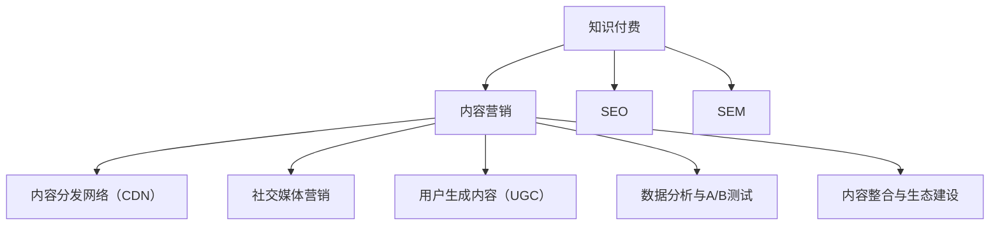

                 

# 知识付费创业中的内容营销策略

## 1. 背景介绍

### 1.1 问题由来

近年来，知识付费行业蓬勃发展，成为互联网经济的亮点。用户对知识的需求日益增长，愿意为高质量内容付费的意愿明显增强。知识付费创业，需要解决的核心问题是如何吸引用户，提高内容价值，实现商业变现。而内容营销，作为一种创新的营销方式，在吸引和维持用户方面具有独特优势。

内容营销的核心在于创造有价值的内容，并通过精准的渠道触达目标用户，从而提升品牌知名度和用户粘性。对于知识付费创业者而言，内容营销不仅可以塑造品牌形象，还能有效提高用户转化率和复购率。

### 1.2 问题核心关键点

内容营销在知识付费中的应用，关键在于以下几点：

1. **内容质量**：高质量、有深度、有吸引力的内容是基础。内容应涵盖用户关心的热点话题、专业技能提升、行业趋势分析等。

2. **渠道选择**：不同的内容适合不同的分发渠道。例如，长文和视频适合在网站和社交平台上分享，而音频内容则适合在音频平台和播客上推广。

3. **用户互动**：与用户建立互动，增加用户参与度，提升内容传播效果。例如，通过问答、评论、社群讨论等方式与用户互动。

4. **数据分析**：利用数据分析工具，监测内容表现，优化内容策略。

5. **多渠道整合**：将多种内容形式和分发渠道整合起来，形成综合的内容营销体系，提升整体效果。

6. **广告投放**：精准定位目标用户，通过广告投放快速提升内容曝光度。

7. **合作推广**：与其他品牌或KOL合作，扩大内容影响力。

8. **付费模式创新**：除了传统的订阅制和单次付费，还可以探索内容奖励、会员特权、知识店铺等付费模式。

这些核心点构成了知识付费内容营销的基础框架，帮助创业者系统性地思考和实施内容营销策略。

### 1.3 问题研究意义

内容营销在知识付费中的应用，不仅有助于提高品牌知名度和用户粘性，还能够显著提升用户转化率和复购率，加速商业变现。同时，内容营销还能增强用户的长期价值，提升用户对品牌的忠诚度，形成稳定的用户群体，为知识付费创业提供持续的收入来源。

## 2. 核心概念与联系

### 2.1 核心概念概述

为更好地理解知识付费内容营销的策略，本节将介绍几个密切相关的核心概念：

1. **知识付费**：指通过在线平台提供专业内容，用户为获取知识付费的一种新型商业模式。其核心在于提供有价值的、可应用的知识。

2. **内容营销**：指通过创造和分发有价值的内容，吸引、保持和增加目标用户，最终达到商业目的的营销策略。

3. **SEO（搜索引擎优化）**：通过优化网站内容，提升其在搜索引擎中的排名，从而吸引更多用户访问。

4. **SEM（搜索引擎营销）**：利用搜索引擎广告，提升品牌曝光度和用户点击率。

5. **内容分发网络（CDN）**：利用分布式服务器，加速内容的分发和用户访问速度。

6. **社交媒体营销**：通过社交平台分享内容，扩大品牌影响力和用户参与度。

7. **用户生成内容（UGC）**：鼓励用户生成和分享内容，提升用户参与度和品牌忠诚度。

8. **数据分析与A/B测试**：通过数据分析和实验，优化内容策略，提升营销效果。

9. **内容整合与生态建设**：将多种内容形式和渠道整合，构建完整的内容生态，增强用户粘性和品牌影响力。

这些核心概念之间的逻辑关系可以通过以下Mermaid流程图来展示：



这个流程图展示了一系列与知识付费相关的内容营销概念及其之间的关系：

1. 知识付费通过内容营销吸引和维持用户。
2. SEO和SEM通过优化和投放提升内容曝光度。
3. CDN和社交媒体营销加速内容传播。
4. UGC和数据分析与A/B测试提升用户参与度。
5. 内容整合与生态建设增强品牌影响力。

这些概念共同构成了知识付费内容营销的策略框架，帮助创业者制定和实施有效的内容营销方案。

## 3. 核心算法原理 & 具体操作步骤
### 3.1 算法原理概述

知识付费内容营销的核心在于创造和分发有价值的内容，吸引和保持目标用户。其基本原理是通过内容与用户的有效互动，建立品牌信任和用户粘性，最终实现商业变现。具体来说，内容营销的算法原理包括以下几个步骤：

1. **内容创作与分发**：根据用户需求和兴趣，创作和分发有价值的内容。
2. **用户互动与反馈**：通过评论、点赞、分享等方式，与用户建立互动，收集用户反馈。
3. **数据分析与优化**：利用数据分析工具，监测内容表现，优化内容策略。
4. **广告投放与合作推广**：精准定位目标用户，通过广告投放和合作推广提升内容曝光度。
5. **付费模式创新**：探索多样化的付费模式，提升用户转化率和复购率。

### 3.2 算法步骤详解

知识付费内容营销的具体操作步骤包括以下几个关键步骤：

**Step 1: 确定目标用户群体**

- 分析目标用户群体的需求、兴趣和行为，明确内容创作的方向。
- 使用市场调研、用户访谈等方式收集用户数据。
- 通过数据分析和用户画像建立用户群体模型。

**Step 2: 内容创作与分发**

- 根据用户需求和兴趣，创作高质量、有深度、有吸引力的内容。
- 选择合适的分发渠道，如网站、社交媒体、播客等。
- 利用SEO和SEM优化内容分发，提升曝光度。

**Step 3: 用户互动与反馈**

- 在内容发布后，鼓励用户留言、评论、分享，增加互动。
- 定期举办问答、讨论等活动，增强用户参与度。
- 通过数据分析工具，监测用户互动情况，优化内容策略。

**Step 4: 数据分析与优化**

- 利用数据分析工具，如Google Analytics、Mixpanel等，监测内容表现。
- 定期进行A/B测试，优化内容形式和分发策略。
- 分析用户反馈，调整内容策略，提升用户满意度。

**Step 5: 广告投放与合作推广**

- 通过精准广告投放，提升内容曝光度和用户点击率。
- 与KOL或其他品牌合作，扩大内容影响力。
- 利用社交媒体营销，提高品牌知名度和用户参与度。

**Step 6: 付费模式创新**

- 探索多样化的付费模式，如内容奖励、会员特权、知识店铺等。
- 根据用户需求和反馈，不断创新付费模式，提升用户转化率和复购率。

### 3.3 算法优缺点

知识付费内容营销具有以下优点：

1. **提升品牌知名度**：通过高质量、有价值的内容，提升品牌形象和用户信任度。
2. **增强用户粘性**：多样化的内容形式和互动机制，增加用户粘性和品牌忠诚度。
3. **优化广告效果**：精准的广告投放和合作推广，提升广告效果和用户转化率。
4. **提高用户参与度**：通过用户互动和反馈，增加用户参与度，提升用户满意度。
5. **多样化的付费模式**：探索多样化的付费模式，满足不同用户的需求，提升用户转化率和复购率。

同时，该方法也存在以下局限性：

1. **内容创作成本高**：高质量内容的创作需要专业团队和技术支持，成本较高。
2. **数据分析复杂**：需要大量的数据分析工具和技术支持，对团队技术能力要求较高。
3. **用户反馈管理难度大**：用户反馈多样，管理难度大，需要及时响应和处理。
4. **广告投放精准度要求高**：精准投放需要详细的数据分析和定向技术，成本较高。
5. **合作推广资源有限**：与KOL或其他品牌合作，需要大量资源和时间投入。

尽管存在这些局限性，但知识付费内容营销作为一种创新的营销方式，在吸引和维持用户方面具有显著优势，能够显著提升用户转化率和复购率，是知识付费创业的重要策略。

### 3.4 算法应用领域

知识付费内容营销广泛应用于多个领域，例如：

1. **在线教育**：通过高质量的课程和辅导内容，吸引和维持学生用户，实现商业变现。
2. **职业培训**：提供专业技能培训和行业趋势分析，帮助用户提升职业竞争力。
3. **健康与健身**：提供健康饮食、健身训练等专业内容，吸引健身爱好者和健康追求者。
4. **金融投资**：提供金融市场分析、投资策略等专业内容，吸引投资者和理财爱好者。
5. **科技与创新**：提供最新科技资讯、创新技术分享等，吸引科技爱好者和创业者。
6. **生活与娱乐**：提供生活技巧、娱乐内容等，吸引广泛的受众群体。

除了以上领域，知识付费内容营销还可以应用于更多垂直领域，为各行业的用户提供有价值的内容，提升用户体验和满意度。

## 4. 数学模型和公式 & 详细讲解 & 举例说明

### 4.1 数学模型构建

本节将使用数学语言对知识付费内容营销的策略进行更加严格的刻画。

假设知识付费平台的受众群体为 $U=\{u_1, u_2, ..., u_n\}$，其中 $u_i$ 表示第 $i$ 个用户。平台的总内容量为 $C=\{c_1, c_2, ..., c_m\}$，其中 $c_j$ 表示第 $j$ 个内容。

用户 $u_i$ 对内容 $c_j$ 的偏好度为 $p_{u_i}^c$，内容 $c_j$ 的曝光度为 $e_{c_j}$。用户 $u_i$ 的转化率为 $r_{u_i}$，即用户付费购买内容的概率。

定义平台的总曝光度为 $E=\sum_{j=1}^m e_{c_j}$，总转化率为 $R=\sum_{i=1}^n r_{u_i}$。内容 $c_j$ 的点击率为 $c_j$，用户 $u_i$ 的点击次数为 $k_{u_i}$。

知识付费平台的目标是最大化总转化率 $R$，即：

$$
\maximize R
$$

其中 $R=\sum_{i=1}^n r_{u_i}$。

### 4.2 公式推导过程

根据上述定义，平台的内容推荐算法可以表示为：

$$
r_{u_i} = f(p_{u_i}^c, e_{c_j})
$$

其中 $f$ 为推荐函数，根据用户偏好和内容曝光度计算用户的转化率。

假设内容 $c_j$ 的点击率为 $c_j$，平台在内容分发时，对于点击率高的内容给予更多曝光，即：

$$
e_{c_j} = c_j \times k_{u_i}
$$

其中 $k_{u_i}$ 为内容 $c_j$ 在用户 $u_i$ 处的点击次数。

因此，总转化率 $R$ 可以表示为：

$$
R = \sum_{i=1}^n r_{u_i} = \sum_{i=1}^n f(p_{u_i}^c, e_{c_j})
$$

### 4.3 案例分析与讲解

以在线教育平台为例，分析知识付费内容营销的数学模型和推荐算法。

假设在线教育平台提供编程、数据分析、人工智能等课程。平台收集了用户的学习行为数据，包括课程观看次数、测试成绩等。平台还通过问卷调查收集了用户的学习偏好，如课程难度、教学风格等。

平台的推荐算法首先根据用户的学习行为和偏好，计算用户对不同课程的偏好度 $p_{u_i}^c$。然后根据课程的观看次数和用户反馈，计算课程的点击率 $c_j$。最后，利用推荐函数 $f$，计算用户 $u_i$ 对内容 $c_j$ 的转化率 $r_{u_i}$。

通过不断的反馈和优化，平台的推荐算法能够更精准地推荐课程内容，提升用户的购买率和满意度。

## 5. 项目实践：代码实例和详细解释说明
### 5.1 开发环境搭建

在进行知识付费内容营销的项目实践前，我们需要准备好开发环境。以下是使用Python进行Flask开发的环境配置流程：

1. 安装Anaconda：从官网下载并安装Anaconda，用于创建独立的Python环境。

2. 创建并激活虚拟环境：
```bash
conda create -n flask-env python=3.8 
conda activate flask-env
```

3. 安装Flask：
```bash
pip install Flask
```

4. 安装SQLAlchemy：
```bash
pip install SQLAlchemy
```

5. 安装Flask-WTF：
```bash
pip install Flask-WTF
```

6. 安装Werkzeug：
```bash
pip install Werkzeug
```

完成上述步骤后，即可在`flask-env`环境中开始内容营销系统的开发。

### 5.2 源代码详细实现

下面以在线教育平台为例，给出使用Flask和SQLAlchemy对知识付费内容营销进行实践的Python代码实现。

首先，定义用户和课程的模型：

```python
from flask_sqlalchemy import SQLAlchemy

db = SQLAlchemy()

class User(db.Model):
    id = db.Column(db.Integer, primary_key=True)
    name = db.Column(db.String(80), nullable=False)
    email = db.Column(db.String(120), unique=True, nullable=False)

class Course(db.Model):
    id = db.Column(db.Integer, primary_key=True)
    title = db.Column(db.String(120), nullable=False)
    description = db.Column(db.Text, nullable=False)
    views = db.Column(db.Integer, default=0)
    ratings = db.Column(db.Float, default=0.0)
```

然后，定义推荐函数：

```python
from sklearn.neighbors import NearestNeighbors
from sklearn.metrics.pairwise import cosine_similarity

class RecommendationEngine:
    def __init__(self, courses):
        self.neighbors = NearestNeighbors(n_neighbors=5, algorithm='brute')
        self.neighbors.fit(courses)
    
    def get_recommendations(self, user, courses):
        user_viewed_courses = courses[user.views]
        distances, indices = self.neighbors.kneighbors(user_viewed_courses)
        distances = distances.flatten()
        indices = indices.flatten()
        
        similarities = cosine_similarity(courses[indices], courses)
        recommendations = [(courses[i], similarities[i][0]) for i in indices]
        recommendations = sorted(recommendations, key=lambda x: x[1], reverse=True)
        
        return recommendations
```

接着，定义Flask应用的路由和视图函数：

```python
from flask import Flask, render_template, request, redirect, url_for

app = Flask(__name__)

@app.route('/')
def index():
    users = User.query.all()
    courses = Course.query.all()
    
    recommendation_engine = RecommendationEngine(courses)
    
    for user in users:
        user.recommendations = recommendation_engine.get_recommendations(user.id, courses)
    
    return render_template('index.html', users=users)

@app.route('/user', methods=['POST'])
def user_profile():
    user_id = request.form['user_id']
    user = User.query.filter_by(id=user_id).first()
    
    return redirect(url_for('index', user=user))

@app.route('/course', methods=['POST'])
def course_profile():
    course_id = request.form['course_id']
    course = Course.query.filter_by(id=course_id).first()
    
    return redirect(url_for('index', course=course))

@app.route('/search', methods=['GET', 'POST'])
def search():
    query = request.form['query']
    results = []
    
    for course in Course.query.all():
        if query in course.title or query in course.description:
            results.append(course)
    
    return render_template('search.html', results=results)
```

最后，启动Flask应用：

```python
if __name__ == '__main__':
    app.run(debug=True)
```

以上就是使用Flask和SQLAlchemy对知识付费内容营销进行实践的完整代码实现。可以看到，Flask提供了强大的Web框架，方便开发者快速构建内容营销系统。SQLAlchemy则提供了高效的数据库操作接口，方便存储和查询用户和课程数据。

### 5.3 代码解读与分析

让我们再详细解读一下关键代码的实现细节：

**User和Course类**：
- `User`类定义了用户的基本信息，包括用户名和邮箱。
- `Course`类定义了课程的基本信息，包括课程标题、描述、观看次数和评分。

**RecommendationEngine类**：
- `RecommendationEngine`类利用sklearn的K近邻算法，根据用户观看过的课程，计算与课程的相似度，推荐用户可能感兴趣的其他课程。

**Flask应用的路由和视图函数**：
- `index`视图函数获取所有用户和课程数据，计算推荐结果，并将其赋值给用户对象。
- `user_profile`视图函数根据用户ID获取用户信息，并重定向到首页。
- `course_profile`视图函数根据课程ID获取课程信息，并重定向到首页。
- `search`视图函数根据用户输入的查询关键词，检索课程信息，并显示搜索结果。

可以看到，Flask框架提供了简洁的路由和视图机制，方便开发者构建复杂的内容营销系统。同时，SQLAlchemy框架提供了高效的数据库操作接口，确保了数据存储和查询的性能。

当然，工业级的系统实现还需考虑更多因素，如用户权限管理、内容审核、广告投放等，但核心的内容营销逻辑基本与此类似。通过Flask和SQLAlchemy，开发者可以快速上手开发知识付费内容营销系统，并根据具体需求不断迭代和优化。

## 6. 实际应用场景
### 6.1 在线教育平台

在线教育平台通过知识付费内容营销，能够有效吸引和维持用户，提升用户转化率和复购率。具体应用场景包括：

- **课程推荐**：根据用户的学习行为和偏好，推荐用户感兴趣的其他课程。
- **学习计划**：提供个性化的学习计划，帮助用户更好地掌握知识。
- **社区互动**：通过问答、讨论等社区互动，增加用户参与度，提升用户满意度。

### 6.2 职业培训平台

职业培训平台通过知识付费内容营销，能够帮助用户提升职业技能，增强职业竞争力。具体应用场景包括：

- **技能培训**：提供专业技能培训和行业趋势分析，帮助用户提升职业技能。
- **职业规划**：提供职业发展路径规划，帮助用户制定职业发展计划。
- **技能测试**：提供技能测试和评估，帮助用户了解自身技能水平。

### 6.3 健康与健身平台

健康与健身平台通过知识付费内容营销，能够吸引健身爱好者和健康追求者，提升用户转化率和复购率。具体应用场景包括：

- **健康饮食**：提供健康饮食指导和食谱，帮助用户健康饮食。
- **健身训练**：提供健身训练计划和视频，帮助用户提升健身效果。
- **健康监测**：提供健康监测工具和数据，帮助用户了解自身健康状况。

### 6.4 未来应用展望

随着知识付费内容营销的发展，其在更多领域的应用将不断拓展，为各行业的用户提供有价值的内容，提升用户体验和满意度。未来，知识付费内容营销在以下方向将有更多突破：

1. **个性化推荐**：通过数据分析和机器学习，提供更加个性化的内容推荐，提升用户满意度。
2. **多渠道分发**：将内容分发到多个渠道，如网站、社交媒体、视频平台等，扩大内容传播范围。
3. **用户生成内容**：鼓励用户生成和分享内容，提升用户参与度和品牌忠诚度。
4. **跨平台协作**：与其他平台和应用进行合作，共同开发内容，形成完整的内容生态。
5. **情感分析**：利用自然语言处理技术，分析用户情感，优化内容策略。
6. **互动体验**：通过增强现实、虚拟现实等技术，提升用户互动体验，增强用户粘性。
7. **智能客服**：利用人工智能技术，提供智能客服，提升用户服务体验。

这些应用方向将进一步提升知识付费内容营销的效果，为各行业的用户提供更加丰富、有价值的内容。

## 7. 工具和资源推荐
### 7.1 学习资源推荐

为了帮助开发者系统掌握知识付费内容营销的理论基础和实践技巧，这里推荐一些优质的学习资源：

1. **《知识付费之道》**：一本详细介绍知识付费商业模式、内容营销策略的书籍，涵盖多个领域的应用案例。
2. **《内容营销的艺术》**：一本介绍内容营销的理论和实践的书籍，适合初入者学习。
3. **《Python Web开发》**：一本介绍Python Web开发的书籍，适合开发者学习Flask等Web框架的使用。
4. **《SQLAlchemy官方文档》**：SQLAlchemy的官方文档，提供了丰富的示例和API文档，适合学习SQLAlchemy的使用。
5. **《Flask官方文档》**：Flask的官方文档，提供了丰富的示例和API文档，适合学习Flask的使用。

通过对这些资源的学习实践，相信你一定能够快速掌握知识付费内容营销的精髓，并用于解决实际的营销问题。

### 7.2 开发工具推荐

高效的开发离不开优秀的工具支持。以下是几款用于知识付费内容营销开发的常用工具：

1. **Python**：作为一门广泛应用的语言，Python在Web开发、数据处理、机器学习等方面都有很好的表现。
2. **Flask**：轻量级Web框架，简单易用，适合快速开发内容营销系统。
3. **SQLAlchemy**：高效的数据库操作接口，方便存储和查询用户和课程数据。
4. **MySQL**：关系型数据库，适合存储和管理用户和课程数据。
5. **MongoDB**：NoSQL数据库，适合存储大规模非结构化数据。
6. **Redis**：内存数据库，适合存储缓存数据，提升系统性能。

合理利用这些工具，可以显著提升知识付费内容营销的开发效率，加快创新迭代的步伐。

### 7.3 相关论文推荐

知识付费内容营销的发展源于学界的持续研究。以下是几篇奠基性的相关论文，推荐阅读：

1. **《内容推荐系统的研究进展》**：介绍了内容推荐系统的基本原理和实现方法，适合学习内容推荐的基础知识。
2. **《用户行为分析与个性化推荐》**：介绍利用用户行为数据进行个性化推荐的方法，适合学习用户行为分析的技术。
3. **《基于情感分析的用户反馈优化》**：介绍利用情感分析技术优化用户反馈的方法，适合学习情感分析技术。
4. **《跨平台内容分发与协作》**：介绍跨平台内容分发的基本原理和方法，适合学习跨平台协作的技术。
5. **《知识付费内容营销策略研究》**：介绍知识付费内容营销的理论和实践，适合学习知识付费内容营销的具体应用。

这些论文代表了大数据时代内容营销技术的发展脉络，通过学习这些前沿成果，可以帮助研究者把握学科前进方向，激发更多的创新灵感。

## 8. 总结：未来发展趋势与挑战
### 8.1 总结

本文对知识付费内容营销的方法进行了全面系统的介绍。首先阐述了知识付费内容营销的背景和意义，明确了内容营销在吸引和维持用户方面具有独特优势。其次，从原理到实践，详细讲解了内容营销的数学模型和关键步骤，给出了内容营销任务开发的完整代码实例。同时，本文还广泛探讨了内容营销方法在多个领域的应用前景，展示了内容营销范式的广阔前景。

通过本文的系统梳理，可以看到，知识付费内容营销在吸引和维持用户方面具有显著优势，能够显著提升用户转化率和复购率，是知识付费创业的重要策略。未来，伴随数据技术和机器学习方法的持续进步，知识付费内容营销将不断优化和创新，为各行业的用户提供更加丰富、有价值的内容。

### 8.2 未来发展趋势

展望未来，知识付费内容营销将呈现以下几个发展趋势：

1. **个性化推荐**：利用深度学习和大数据分析技术，提供更加个性化的内容推荐，提升用户满意度。
2. **多渠道分发**：将内容分发到多个渠道，如网站、社交媒体、视频平台等，扩大内容传播范围。
3. **用户生成内容**：鼓励用户生成和分享内容，提升用户参与度和品牌忠诚度。
4. **跨平台协作**：与其他平台和应用进行合作，共同开发内容，形成完整的内容生态。
5. **情感分析**：利用自然语言处理技术，分析用户情感，优化内容策略。
6. **互动体验**：通过增强现实、虚拟现实等技术，提升用户互动体验，增强用户粘性。
7. **智能客服**：利用人工智能技术，提供智能客服，提升用户服务体验。

这些趋势凸显了知识付费内容营销的广阔前景，通过多种技术的协同发力，知识付费内容营销将为各行业的用户提供更加丰富、有价值的内容。

### 8.3 面临的挑战

尽管知识付费内容营销已经取得了显著成果，但在迈向更加智能化、普适化应用的过程中，它仍面临诸多挑战：

1. **内容创作成本高**：高质量内容的创作需要专业团队和技术支持，成本较高。
2. **数据分析复杂**：需要大量的数据分析工具和技术支持，对团队技术能力要求较高。
3. **用户反馈管理难度大**：用户反馈多样，管理难度大，需要及时响应和处理。
4. **广告投放精准度要求高**：精准投放需要详细的数据分析和定向技术，成本较高。
5. **合作推广资源有限**：与KOL或其他品牌合作，需要大量资源和时间投入。

尽管存在这些挑战，但知识付费内容营销作为一种创新的营销方式，在吸引和维持用户方面具有显著优势，能够显著提升用户转化率和复购率，是知识付费创业的重要策略。

### 8.4 研究展望

面对知识付费内容营销所面临的挑战，未来的研究需要在以下几个方面寻求新的突破：

1. **探索无监督和半监督内容推荐**：摆脱对大规模标注数据的依赖，利用自监督学习、主动学习等无监督和半监督范式，最大限度利用非结构化数据，实现更加灵活高效的内容推荐。
2. **研究参数高效和计算高效的内容推荐方法**：开发更加参数高效的推荐方法，在固定大部分内容参数的情况下，只更新极少量的任务相关参数。同时优化推荐模型的计算图，减少前向传播和反向传播的资源消耗，实现更加轻量级、实时性的部署。
3. **引入因果推断和对比学习思想**：通过引入因果推断和对比学习思想，增强推荐模型建立稳定因果关系的能力，学习更加普适、鲁棒的内容推荐模型。
4. **融合多种模态数据**：将视觉、音频等多模态数据与文本数据整合，提升内容推荐模型的表现。
5. **探索多样化的付费模式**：除了传统的订阅制和单次付费，还可以探索内容奖励、会员特权、知识店铺等付费模式。
6. **纳入伦理道德约束**：在内容推荐目标中引入伦理导向的评估指标，过滤和惩罚有害的输出倾向。同时加强人工干预和审核，建立内容推荐的监管机制，确保输出符合人类价值观和伦理道德。

这些研究方向的探索，必将引领知识付费内容营销技术迈向更高的台阶，为各行业的用户提供更加丰富、有价值的内容，提升用户体验和满意度。

## 9. 附录：常见问题与解答

**Q1：内容营销是否适用于所有知识付费平台？**

A: 内容营销在大部分知识付费平台上都能取得不错的效果，特别是对于数据量较小的平台。但对于一些特定领域的平台，如医学、法律等，内容创作成本较高，内容质量较难控制，可能不适合内容营销。此时可以考虑其他营销策略，如广告投放、直销等。

**Q2：如何进行内容创作成本控制？**

A: 内容创作成本控制需要从多个方面入手：

1. **团队建设**：建立专业的内容创作团队，提升创作效率和质量。
2. **内容库建设**：利用内容库和模板，重复利用已有内容，减少创作成本。
3. **外包合作**：与内容生产公司或自由职业者合作，降低创作成本。
4. **用户生成内容**：鼓励用户生成和分享内容，降低内容创作成本。

**Q3：如何选择适合的分发渠道？**

A: 选择适合的分发渠道需要考虑内容类型和目标用户群体的特点。

1. **网站和博客**：适合发布长文和深度文章，吸引专业人士和深度用户。
2. **社交媒体**：适合分享短视频、图文等，吸引广泛的受众群体。
3. **播客和音频平台**：适合发布音频内容，吸引视听习惯的听众。
4. **视频平台**：适合发布视频内容，吸引视觉习惯的观众。

**Q4：如何进行数据分析与优化？**

A: 数据分析与优化是内容营销的重要环节，具体步骤如下：

1. **数据收集**：收集用户行为数据，如观看次数、点击率、留存率等。
2. **数据分析**：利用数据分析工具，如Google Analytics、Mixpanel等，分析用户行为和内容表现。
3. **A/B测试**：通过A/B测试，优化内容形式和分发策略。
4. **反馈机制**：建立用户反馈机制，收集用户意见，优化内容策略。

**Q5：如何进行跨平台协作？**

A: 跨平台协作可以带来更多内容和用户资源，具体步骤如下：

1. **内容合作**：与其他平台和应用进行内容合作，共同开发内容。
2. **用户互导**：通过合作推广，引导用户在不同平台间互相导流。
3. **数据共享**：共享用户数据，提升数据利用效率。

**Q6：如何进行情感分析？**

A: 情感分析可以提升内容推荐的效果，具体步骤如下：

1. **情感词典**：构建情感词典，用于计算文本情感。
2. **情感识别**：利用自然语言处理技术，识别文本情感。
3. **情感优化**：根据情感分析结果，优化内容策略，提升用户满意度。

**Q7：如何进行互动体验优化？**

A: 互动体验优化可以提升用户粘性和满意度，具体步骤如下：

1. **增强现实和虚拟现实**：利用增强现实和虚拟现实技术，提升互动体验。
2. **游戏化设计**：设计互动性强、趣味性的内容，增加用户参与度。
3. **智能客服**：利用人工智能技术，提供智能客服，提升用户服务体验。

通过上述常见问题的解答，可以看到，内容营销在知识付费平台中的应用具有广泛的适用性和多样化的策略，能够显著提升用户转化率和复购率，是知识付费创业的重要策略。

---

作者：禅与计算机程序设计艺术 / Zen and the Art of Computer Programming

