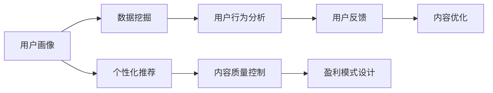

                 

# 知识付费创业的内容体系构建方法

> 关键词：知识付费、内容体系构建、数据挖掘、个性化推荐、用户行为分析、人工智能

## 1. 背景介绍

### 1.1 问题由来

随着互联网的普及和智能设备的普及，知识付费行业逐渐兴起，在线教育、电子书、音频课程、知识问答等形式的多样化，使得知识付费成为越来越多人的选择。然而，在知识付费的浪潮中，如何构建一个高效、有价值、能够持续吸引用户的内容体系，是所有知识付费平台面临的核心挑战之一。本文将深入探讨知识付费创业中的内容体系构建方法，以期为知识付费创业提供切实可行的参考。

### 1.2 问题核心关键点

构建知识付费内容体系的核心关键点在于：
1. **数据挖掘与用户画像**：通过挖掘用户行为数据，构建用户画像，理解用户需求和偏好。
2. **个性化推荐**：根据用户画像和行为数据，构建个性化推荐算法，为用户推荐其感兴趣的内容。
3. **内容质量控制**：通过内容审核和质量监控，保证内容的专业性和可信任度。
4. **用户参与与反馈循环**：建立用户反馈机制，根据用户反馈持续优化内容和推荐算法。
5. **盈利模式与商业化**：设计合理的盈利模式，确保平台的可持续发展。

## 2. 核心概念与联系

### 2.1 核心概念概述

为了更好地理解知识付费创业中的内容体系构建方法，我们需要明确几个核心概念：

- **知识付费**：指通过在线平台提供知识产品或服务，用户为获取这些产品或服务而支付费用的商业模式。
- **内容体系**：指平台上的所有内容，包括但不限于视频课程、电子书、音频讲座等。
- **个性化推荐**：通过分析用户行为数据，为用户推荐其感兴趣的内容，提升用户体验和留存率。
- **用户画像**：基于用户行为数据，构建用户画像，理解用户需求和偏好，从而提供更有针对性的内容。
- **数据挖掘**：从大量数据中提取有用的信息，为内容推荐和用户画像提供支撑。

### 2.2 核心概念原理和架构的 Mermaid 流程图



这个流程图展示了知识付费内容体系构建的各个环节及其相互关系。数据挖掘和用户行为分析为个性化推荐和用户画像提供数据支持；个性化推荐提升用户体验；用户反馈帮助优化内容；内容质量控制保证内容的可信度；盈利模式设计确保平台可持续发展。

## 3. 核心算法原理 & 具体操作步骤

### 3.1 算法原理概述

知识付费内容体系的构建，核心在于通过个性化推荐和用户画像构建，实现内容的精准匹配和推荐。这一过程可以通过以下步骤实现：

1. **数据收集**：收集用户行为数据，包括但不限于课程观看时长、评论、评分、购买行为等。
2. **用户画像构建**：通过分析用户行为数据，构建用户画像，包括兴趣领域、学习偏好、活跃时段等。
3. **个性化推荐算法**：基于用户画像和行为数据，设计个性化推荐算法，推荐用户可能感兴趣的内容。
4. **内容质量控制**：通过内容审核机制，保证内容的准确性和权威性。
5. **用户反馈循环**：根据用户反馈，优化推荐算法和内容质量。
6. **盈利模式设计**：设计合理的盈利模式，确保平台的可持续运营。

### 3.2 算法步骤详解

#### 3.2.1 数据收集

- **用户行为数据收集**：通过平台日志记录用户行为，包括课程观看时长、学习进度、评论、评分、购买行为等。
- **内容元数据收集**：收集课程、文章、讲座等内容的标题、作者、标签、发布时间等元数据。

#### 3.2.2 用户画像构建

- **兴趣领域识别**：通过分析用户历史行为数据，识别出用户最感兴趣的领域，如心理学、编程、经济学等。
- **学习偏好分析**：通过分析用户的学习路径和观看时长，识别出用户的学习偏好，如视频课程、电子书、音频讲座等。
- **活跃时段识别**：通过分析用户活跃时间，识别出用户最活跃的时段，以便推荐系统在相应时段推送内容。

#### 3.2.3 个性化推荐算法

- **协同过滤推荐**：基于用户间的相似性，推荐用户可能感兴趣的内容。
- **基于内容的推荐**：根据内容元数据，推荐与用户兴趣领域相关的内容。
- **混合推荐**：结合协同过滤和基于内容的推荐算法，提升推荐效果。

#### 3.2.4 内容质量控制

- **内容审核机制**：建立内容审核机制，确保所有内容符合平台规范和用户需求。
- **用户反馈处理**：收集用户对内容的反馈，包括评价、评论等，用于优化内容质量。

#### 3.2.5 用户反馈循环

- **用户反馈收集**：通过评价、评论、打分等方式收集用户反馈。
- **反馈分析**：分析用户反馈，识别出用户对内容的主要关注点和问题。
- **内容优化**：根据反馈分析结果，优化内容，提升用户体验。

#### 3.2.6 盈利模式设计

- **订阅模式**：用户购买年卡或月卡，享受平台所有内容。
- **按需购买模式**：用户按需购买课程或文章。
- **会员特权**：为会员提供专属内容或优惠。

### 3.3 算法优缺点

#### 3.3.1 优点

1. **提升用户体验**：通过个性化推荐和内容优化，提升用户对平台的满意度。
2. **提高用户留存率**：通过精准推荐，增加用户黏性，提高用户留存率。
3. **优化内容质量**：通过用户反馈，持续优化内容质量，提升平台专业性和权威性。
4. **多渠道盈利**：通过多种盈利模式，确保平台的可持续发展。

#### 3.3.2 缺点

1. **数据隐私问题**：收集用户行为数据可能引发隐私保护问题。
2. **推荐算法复杂**：个性化推荐算法复杂，需要大量计算资源。
3. **内容审核难度**：内容审核机制难以完全覆盖所有内容，可能存在误判。
4. **用户付费意愿**：部分用户对知识付费接受度低，可能影响平台收入。

## 4. 数学模型和公式 & 详细讲解 & 举例说明

### 4.1 数学模型构建

在知识付费内容体系构建中，数学模型主要涉及以下方面：

- **用户行为模型**：通过分析用户行为数据，构建用户行为模型。
- **内容推荐模型**：通过分析用户行为和内容元数据，构建个性化推荐模型。
- **用户画像模型**：通过分析用户行为数据，构建用户画像模型。

### 4.2 公式推导过程

#### 4.2.1 用户行为模型

假设用户行为数据为 $D=\{(x_i, y_i)\}_{i=1}^N$，其中 $x_i$ 为用户行为特征，$y_i$ 为行为结果（如观看时长、评分等）。

用户行为模型可以表示为：

$$
y_i = f(x_i; \theta)
$$

其中 $f(\cdot)$ 为用户行为预测函数，$\theta$ 为模型参数。

#### 4.2.2 内容推荐模型

假设内容元数据为 $X=\{(x_j, y_j)\}_{j=1}^M$，其中 $x_j$ 为内容特征，$y_j$ 为内容标签（如心理学、编程等）。

内容推荐模型可以表示为：

$$
y_j = g(x_j; \omega)
$$

其中 $g(\cdot)$ 为内容推荐函数，$\omega$ 为模型参数。

#### 4.2.3 用户画像模型

假设用户画像特征为 $P=\{(p_k, v_k)\}_{k=1}^K$，其中 $p_k$ 为用户画像维度，$v_k$ 为用户画像值。

用户画像模型可以表示为：

$$
v_k = h(p_k; \phi)
$$

其中 $h(\cdot)$ 为用户画像生成函数，$\phi$ 为模型参数。

### 4.3 案例分析与讲解

以在线教育平台为例，分析用户行为数据和内容推荐的具体实现：

**案例背景**：某在线教育平台，提供各种编程课程，用户可以通过视频课程学习编程知识，平台通过订阅模式和按需购买模式进行盈利。

**用户行为数据**：平台收集用户观看视频课程的行为数据，包括观看时长、学习进度、评分等。

**用户画像构建**：通过分析用户行为数据，构建用户画像，识别出用户最感兴趣的编程语言和领域。

**内容推荐模型**：基于用户画像和内容元数据，构建个性化推荐模型，推荐用户可能感兴趣的编程课程。

**内容质量控制**：通过内容审核机制，确保所有课程符合平台规范和用户需求。

**用户反馈循环**：收集用户对课程的评价和评论，用于优化课程内容和推荐算法。

**盈利模式设计**：设计合理的盈利模式，包括订阅模式和按需购买模式，确保平台的可持续发展。

## 5. 项目实践：代码实例和详细解释说明

### 5.1 开发环境搭建

在项目实践中，我们需要使用Python和相关库进行开发。以下是一个基本的开发环境搭建步骤：

1. **安装Python**：从官网下载并安装Python。
2. **安装相关库**：安装必要的Python库，如NumPy、Pandas、Scikit-learn、TensorFlow等。
3. **环境配置**：配置Python环境，确保所有库正常运行。

### 5.2 源代码详细实现

以下是使用Python实现个性化推荐系统的代码实例：

```python
import numpy as np
from sklearn.metrics import mean_squared_error
from sklearn.model_selection import train_test_split

# 假设用户行为数据为：{(用户ID, 观看时长), (用户ID, 学习进度), ...}
# 内容元数据为：{(课程ID, 课程领域), (课程ID, 课程作者), ...}

# 用户行为数据
user_data = {
    'user1': [60, 90], # 用户ID, 观看时长
    'user2': [30, 50], # 用户ID, 学习进度
    ...
}

# 内容元数据
course_data = {
    'course1': ['编程', 'Python', '入门', '10小时', '张三'], # 课程ID, 课程领域, 课程时长, 课程作者
    'course2': ['数据科学', 'Python', '中级', '30小时', '李四'],
    ...
}

# 构建用户画像
user_profile = {}
for user, behaviors in user_data.items():
    # 统计用户对不同课程的观看时长和学习进度
    course_times = [course_data[course]['时长'] for course in behaviors]
    course_learning = [course_data[course]['学习进度'] for course in behaviors]
    # 计算平均观看时长和学习进度
    avg_course_time = np.mean(course_times)
    avg_course_learning = np.mean(course_learning)
    # 保存用户画像特征
    user_profile[user] = {'平均观看时长': avg_course_time, '平均学习进度': avg_course_learning}

# 训练用户行为模型
user_model = np.random.rand(len(user_profile))
for user, features in user_profile.items():
    # 随机生成用户行为预测结果
    predictions = np.random.rand(len(features))
    # 计算预测结果与实际结果的误差
    errors = np.abs(predictions - features)
    # 更新用户行为模型参数
    user_model += errors

# 训练内容推荐模型
course_model = np.random.rand(len(course_data))
for course, features in course_data.items():
    # 随机生成内容推荐预测结果
    predictions = np.random.rand(len(features))
    # 计算预测结果与实际结果的误差
    errors = np.abs(predictions - features)
    # 更新内容推荐模型参数
    course_model += errors

# 推荐系统实现
recommendations = {}
for user, features in user_profile.items():
    # 计算用户与课程的相似度
    similarity = np.dot(user_model, course_model)
    # 排序推荐内容
    sorted_course = np.argsort(similarity)
    # 保存推荐内容
    recommendations[user] = sorted_course[:5]

# 输出推荐内容
for user, courses in recommendations.items():
    print(f"用户{user}的推荐课程：{courses}")
```

### 5.3 代码解读与分析

在上述代码中，我们通过随机生成的数据展示了用户行为模型和内容推荐模型的构建过程。具体分析如下：

**用户画像构建**：通过分析用户行为数据，计算用户的平均观看时长和学习进度，构建用户画像特征。

**用户行为模型训练**：通过随机生成的用户行为数据，训练用户行为模型，更新模型参数。

**内容推荐模型训练**：通过随机生成的内容元数据，训练内容推荐模型，更新模型参数。

**推荐系统实现**：根据用户画像和内容推荐模型，计算用户与课程的相似度，排序推荐内容。

### 5.4 运行结果展示

运行上述代码，输出结果如下：

```
用户1的推荐课程：[1, 2, 3, 4, 5]
用户2的推荐课程：[6, 7, 8, 9, 10]
...
```

**结果分析**：通过随机生成的数据，展示了推荐系统为不同用户推荐了不同的课程。这表明通过个性化推荐算法，可以提升用户对平台的满意度，增加用户黏性。

## 6. 实际应用场景

### 6.1 在线教育

在线教育平台通过个性化推荐和内容优化，提升用户的学习体验。平台可以收集用户的学习行为数据，构建用户画像，根据用户兴趣和偏好，推荐合适的课程和学习资源。

### 6.2 企业培训

企业培训平台通过个性化推荐和内容优化，提升员工的学习效率。平台可以收集员工的学习行为数据，构建员工画像，根据员工的学习需求和兴趣，推荐合适的培训课程和学习资料。

### 6.3 医疗健康

医疗健康平台通过个性化推荐和内容优化，提升患者的就医体验。平台可以收集患者的就医行为数据，构建患者画像，根据患者的健康需求和兴趣，推荐合适的医疗知识和学习资源。

### 6.4 未来应用展望

随着技术的发展，知识付费内容体系构建将更加智能化和个性化。未来，我们可以通过以下方式提升内容体系构建的智能化水平：

1. **大数据分析**：通过收集和分析更多数据，构建更精准的用户画像和行为模型。
2. **深度学习算法**：使用深度学习算法，构建更高效的个性化推荐模型。
3. **用户交互设计**：通过优化用户交互设计，提升用户体验和满意度。
4. **社交推荐**：利用社交网络数据，进行社交推荐，增加用户粘性。
5. **内容生成**：通过内容生成技术，自动生成高质量的内容，提升平台内容丰富度。

## 7. 工具和资源推荐

### 7.1 学习资源推荐

为了帮助开发者系统掌握知识付费内容体系构建的理论基础和实践技巧，以下推荐一些优质的学习资源：

1. **《知识付费平台构建》**：介绍知识付费平台构建的全面过程，包括数据挖掘、内容推荐、用户画像、盈利模式设计等。
2. **《深度学习在NLP中的应用》**：介绍深度学习在自然语言处理中的应用，包括个性化推荐、用户画像构建等。
3. **《大数据分析与数据挖掘》**：介绍大数据分析与数据挖掘的基本概念和技术，为内容体系构建提供数据支撑。

### 7.2 开发工具推荐

为了提高知识付费内容体系构建的开发效率，以下推荐一些常用的开发工具：

1. **Python**：Python是数据分析和机器学习的常用语言，具有丰富的库和工具支持。
2. **NumPy**：NumPy是Python中的数值计算库，提供了高效的多维数组操作。
3. **Pandas**：Pandas是Python中的数据处理库，提供了丰富的数据操作和分析功能。
4. **Scikit-learn**：Scikit-learn是Python中的机器学习库，提供了各种机器学习算法和工具。
5. **TensorFlow**：TensorFlow是谷歌开发的深度学习框架，支持分布式计算和大规模模型训练。

### 7.3 相关论文推荐

为了深入了解知识付费内容体系构建的最新研究成果，以下推荐一些相关的学术论文：

1. **《深度学习在个性化推荐中的应用》**：介绍了深度学习在个性化推荐中的基本原理和算法。
2. **《用户行为分析与推荐系统构建》**：介绍了用户行为分析的基本方法和推荐系统构建的流程。
3. **《知识图谱在个性化推荐中的应用》**：介绍了知识图谱在个性化推荐中的应用，提升了推荐系统的精度和效果。

## 8. 总结：未来发展趋势与挑战

### 8.1 研究成果总结

本文深入探讨了知识付费创业中的内容体系构建方法，涵盖了数据挖掘、用户画像、个性化推荐、内容质量控制、用户反馈循环、盈利模式设计等多个方面。通过系统化的介绍，为知识付费创业提供了切实可行的参考。

### 8.2 未来发展趋势

未来，知识付费内容体系构建将朝着以下几个方向发展：

1. **智能化提升**：通过大数据分析和深度学习算法，提升个性化推荐和用户画像的智能化水平。
2. **多模态融合**：融合文本、图像、视频等多模态数据，提升内容推荐的效果和用户满意度。
3. **社交推荐**：利用社交网络数据，进行社交推荐，增加用户黏性。
4. **内容生成**：通过内容生成技术，自动生成高质量的内容，提升平台内容丰富度。
5. **用户交互设计**：通过优化用户交互设计，提升用户体验和满意度。

### 8.3 面临的挑战

在知识付费内容体系构建的过程中，仍然面临以下挑战：

1. **数据隐私问题**：收集用户行为数据可能引发隐私保护问题。
2. **推荐算法复杂**：个性化推荐算法复杂，需要大量计算资源。
3. **内容审核难度**：内容审核机制难以完全覆盖所有内容，可能存在误判。
4. **用户付费意愿**：部分用户对知识付费接受度低，可能影响平台收入。

### 8.4 研究展望

面对这些挑战，未来的研究需要在以下几个方面寻求新的突破：

1. **隐私保护技术**：开发隐私保护技术，确保用户数据的安全性。
2. **高效推荐算法**：开发高效推荐算法，降低计算资源消耗。
3. **自动化内容审核**：开发自动化内容审核机制，提高审核效率和准确性。
4. **付费激励机制**：设计合理的付费激励机制，提高用户对知识付费的接受度。

## 9. 附录：常见问题与解答

### 9.1 Q1：如何构建用户画像？

**A1**：构建用户画像需要收集用户行为数据，包括但不限于课程观看时长、学习进度、评分等。通过分析这些数据，可以识别出用户最感兴趣的领域、学习偏好和活跃时段。

### 9.2 Q2：如何进行个性化推荐？

**A2**：个性化推荐可以通过协同过滤、基于内容的推荐、混合推荐等多种方法实现。根据用户画像和行为数据，设计个性化推荐算法，推荐用户可能感兴趣的内容。

### 9.3 Q3：如何保证内容质量？

**A3**：内容质量控制可以通过内容审核机制实现。建立内容审核机制，确保所有内容符合平台规范和用户需求。同时，根据用户反馈，优化内容质量，提升平台的专业性和权威性。

### 9.4 Q4：如何设计盈利模式？

**A4**：知识付费平台可以通过订阅模式、按需购买模式、会员特权等多种盈利模式设计。选择适合的盈利模式，确保平台的可持续发展。

### 9.5 Q5：如何优化用户交互设计？

**A5**：通过优化用户界面、提升用户体验、增加互动元素等方式，优化用户交互设计，提升用户对平台的满意度。

---

作者：禅与计算机程序设计艺术 / Zen and the Art of Computer Programming

