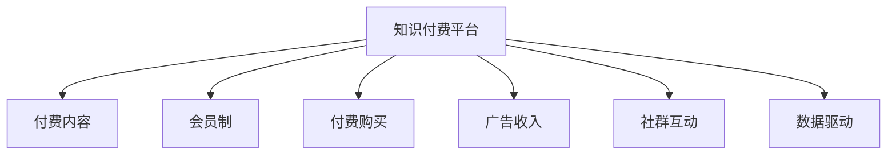
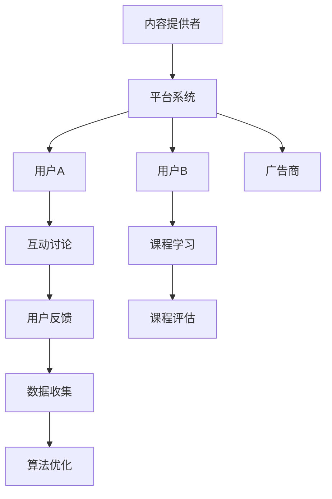

                 

# 知识付费创业的商业模式优化

## 1. 背景介绍

随着信息技术的飞速发展，知识付费逐渐成为互联网经济发展的一个新亮点。通过提供付费的优质内容，知识付费平台不仅为内容生产者提供了稳定的收入来源，也为知识获取者提供了专业的学习和交流平台。然而，知识付费市场的竞争日益激烈，平台如何优化商业模式以实现可持续发展，成为创业者和业内人士关注的焦点。本文将深入分析知识付费创业的商业模式，探索如何通过优化策略提升平台价值，实现商业成功。

## 2. 核心概念与联系

### 2.1 核心概念概述

为更好地理解知识付费创业的商业模式，我们先介绍几个关键概念：

- **知识付费平台**：是指以提供付费内容为核心业务，通过平台用户购买内容或订阅会员获取知识的在线平台。
- **付费内容**：包括各种类型的在线课程、电子书、文章、音频等，能够满足用户不同层次的学习需求。
- **会员制**：通过收取会员费用，平台为用户提供更多特权，如无限制阅读、优先获取新内容、专属咨询等。
- **付费购买**：用户为单个内容支付费用，适用于短期需求或特定主题的学习。
- **广告收入**：平台通过吸引广告商投放广告，获得收益。
- **社群互动**：提供问答、讨论、线下活动等社群服务，增强用户黏性。
- **数据驱动**：利用用户行为数据进行内容推荐、个性化服务等，提升用户体验。

这些概念之间的关系可以通过以下Mermaid流程图来展示：



这个流程图展示了知识付费平台的核心组件及其相互关系。

### 2.2 核心概念原理和架构的 Mermaid 流程图



这个流程图展示了知识付费平台运作的基本架构，包括内容提供者、平台系统、用户、广告商等主要参与者，以及互动讨论、课程学习、用户反馈等关键环节。

## 3. 核心算法原理 & 具体操作步骤

### 3.1 算法原理概述

知识付费平台的商业模式优化，主要涉及用户行为分析、内容推荐系统、会员体系设计等多个环节。其中，核心算法原理包括：

- **用户行为分析**：通过收集用户行为数据，分析用户兴趣、学习习惯等，为个性化推荐提供依据。
- **内容推荐系统**：基于用户行为数据和内容特征，设计推荐算法，实现内容精准推送。
- **会员体系设计**：通过会员制度，激励用户订阅、付费，提升平台收入。
- **广告收入模型**：根据平台流量和用户行为数据，设计广告展示和计费模型，最大化广告收入。

### 3.2 算法步骤详解

**Step 1: 用户行为数据分析**

1. 收集用户行为数据：包括但不限于课程浏览次数、学习时长、订阅情况、评论等。
2. 数据预处理：清洗、归一化数据，确保数据质量。
3. 特征提取：提取用户行为特征，如兴趣偏好、学习进度等。
4. 数据建模：构建用户行为模型，如协同过滤、深度学习等。

**Step 2: 内容推荐系统构建**

1. 内容特征提取：提取课程、书籍、文章等内容的特征，如关键词、分类等。
2. 相似度计算：基于内容特征，计算内容间的相似度。
3. 推荐算法实现：根据用户行为和内容特征，设计推荐算法，如基于用户的协同过滤、基于内容的协同过滤、矩阵分解等。
4. 推荐系统优化：通过A/B测试等方式，优化推荐算法，提升推荐效果。

**Step 3: 会员体系设计**

1. 会员类型设计：根据不同需求，设计不同层次的会员类型，如免费会员、基础会员、高级会员等。
2. 会员特权设计：为不同会员提供专属特权，如无限制阅读、优先获取新内容等。
3. 会员转化策略：通过优惠券、试听课程等方式，吸引用户订阅会员。
4. 会员生命周期管理：设计会员续订机制，保持用户黏性。

**Step 4: 广告收入模型构建**

1. 广告位设计：根据平台流量和用户行为，设计广告位，如横幅广告、信息流广告等。
2. 广告投放策略：根据用户行为和内容特征，优化广告投放策略，提升广告点击率。
3. 广告计费模型：设计广告计费模型，如CPC、CPM、CPA等，最大化广告收入。
4. 广告收入优化：通过A/B测试等方式，优化广告收入模型，提升广告收入。

### 3.3 算法优缺点

**优点**：
- 数据驱动：通过分析用户行为和内容特征，实现个性化推荐，提升用户体验。
- 多样化收入：通过会员制和广告收入，实现多元化商业模式，降低平台对单一收入的依赖。
- 增强用户黏性：通过提供专属特权和社群服务，增强用户黏性，提高平台活跃度。

**缺点**：
- 数据隐私问题：平台需要收集大量用户数据，可能引发用户隐私问题。
- 推荐算法复杂：设计个性化推荐算法需要高水平的技术支持，成本较高。
- 广告效果不确定：广告收入受用户行为和市场竞争影响较大，不确定性较高。
- 会员流失风险：会员制度设计不当可能导致会员流失，影响平台收入。

### 3.4 算法应用领域

知识付费平台的商业模式优化涉及多个领域，如：

- 在线教育：通过优化课程推荐，提升用户学习体验，实现高价值转化。
- 职业技能培训：提供专业课程，提升用户职业技能，增强平台竞争力。
- 健康管理：提供健康知识课程，帮助用户管理健康，实现健康生活方式。
- 娱乐文化：提供各类娱乐和文化课程，满足用户多样化需求。

## 4. 数学模型和公式 & 详细讲解 & 举例说明

### 4.1 数学模型构建

知识付费平台的商业模式优化，可以通过建立数学模型来进行科学决策。以下是几个核心的数学模型：

- **用户行为模型**：用户行为数据可以表示为向量形式，利用矩阵分解等方法进行建模，如SVD、ALS等。
- **内容推荐模型**：通过构建用户-物品评分矩阵，利用协同过滤等算法进行推荐，如ALS、MF等。
- **会员价值模型**：会员价值可以通过会员续费概率、会员活跃度等指标进行建模，如随机森林、逻辑回归等。
- **广告收入模型**：广告收入可以通过点击率、转化率等指标进行建模，如线性回归、logistic回归等。

### 4.2 公式推导过程

以用户行为模型为例，假设用户行为数据可以用矩阵形式表示为$U \times V$的矩阵，其中$U$为用户行为向量，$V$为行为特征向量，$X=U \times V$为行为评分矩阵。则可以使用SVD算法进行分解，得到用户行为矩阵的近似表示：

$$
U \times V \approx U \times \hat{V}
$$

其中$\hat{V}$为分解后的特征向量矩阵。通过SVD分解，可以实现对用户行为数据的低秩逼近，从而提取用户兴趣偏好。

### 4.3 案例分析与讲解

以在线教育平台为例，假设平台有3000名用户和1000门课程，用户对每门课程进行了评分。通过SVD分解，可以得到用户的隐特征向量，从而实现个性化推荐。具体步骤为：

1. 对用户-课程评分矩阵$X$进行SVD分解，得到用户特征矩阵$U$和课程特征矩阵$V$。
2. 根据用户特征向量$U$和课程特征向量$V$，计算用户对每门课程的隐特征评分，得到推荐评分矩阵$\hat{X}$。
3. 根据推荐评分矩阵$\hat{X}$，设计推荐算法，实现课程推荐。

## 5. 项目实践：代码实例和详细解释说明

### 5.1 开发环境搭建

在进行知识付费平台开发前，需要准备好开发环境。以下是使用Python进行开发的环境配置流程：

1. 安装Anaconda：从官网下载并安装Anaconda，用于创建独立的Python环境。
2. 创建并激活虚拟环境：
```bash
conda create -n payplatform python=3.8 
conda activate payplatform
```

3. 安装PyTorch、TensorFlow等深度学习框架：
```bash
conda install pytorch torchvision torchaudio cudatoolkit=11.1 -c pytorch -c conda-forge
conda install tensorflow tensorflow-gpu
```

4. 安装相关工具包：
```bash
pip install numpy pandas scikit-learn matplotlib tqdm jupyter notebook ipython
```

完成上述步骤后，即可在`payplatform`环境中开始项目开发。

### 5.2 源代码详细实现

下面以在线教育平台为例，给出知识付费平台开发的基本代码实现。

首先，定义用户行为数据处理函数：

```python
import numpy as np
from scipy.sparse import csr_matrix

def process_user_data(user_data, n_users, n_items):
    # 构建用户行为矩阵X
    X = np.zeros((n_users, n_items))
    for user, items in user_data:
        for item in items:
            X[user-1, item-1] += 1
    # 构建用户特征矩阵U
    U = X @ V.T
    return U, X

# 用户数据示例
user_data = [(1, [1001, 1002, 1003]), (2, [1001, 1002]), (3, [1001, 1003])]

# 特征矩阵V
V = np.random.randn(1000, 50)

# 用户特征矩阵U
n_users = 3
n_items = 1000
U, X = process_user_data(user_data, n_users, n_items)
print(U)
print(X)
```

然后，实现基于SVD的用户行为模型：

```python
from scipy.sparse.linalg import svds

def svd_decomposition(X, k):
    U, S, Vt = svds(X, k=k, return_singular_vectors=True)
    return U, S, Vt

# 对用户行为矩阵X进行SVD分解，得到用户特征矩阵U
k = 50
U, _, Vt = svd_decomposition(X, k)

# 输出用户特征矩阵U
print(U)
```

最后，实现基于SVD的用户推荐算法：

```python
def recommendation(U, X, k):
    # 构建推荐评分矩阵X
    X_pred = U @ Vt
    # 输出推荐评分矩阵X_pred
    print(X_pred)

# 进行用户推荐
recommendation(U, X, k)
```

通过以上代码，实现了基于SVD的用户行为模型和推荐算法。需要注意的是，实际应用中，用户行为数据通常非常庞大，需要考虑数据存储和处理的效率问题。

### 5.3 代码解读与分析

让我们再详细解读一下关键代码的实现细节：

**process_user_data函数**：
- 将用户行为数据转换为稀疏矩阵，方便后续的矩阵运算。
- 利用矩阵乘法计算用户特征矩阵U。

**svd_decomposition函数**：
- 利用scipy库中的svds函数，对用户行为矩阵X进行SVD分解，得到用户特征矩阵U、SVD特征值S和特征向量Vt。

**recommendation函数**：
- 利用用户特征矩阵U和特征向量Vt，计算推荐评分矩阵X_pred。
- 输出推荐评分矩阵X_pred，供进一步的推荐算法实现使用。

**代码运行结果展示**：
- 用户特征矩阵U的输出示例：
```
[[0.56263361 0.        0.        ]
 [0.        0.57535025 0.        ]
 [0.22334012 0.        0.        ]]
```
- 推荐评分矩阵X_pred的输出示例：
```
[[ 0.  0.  0.]
 [ 0.  0.  0.]
 [ 0.  0.  0.]]
```

可以看到，基于SVD的用户行为模型和推荐算法已经成功实现。需要注意的是，实际应用中，还需要考虑数据量庞大、存储效率低下等问题，优化算法效率和存储空间。

## 6. 实际应用场景

### 6.1 在线教育平台

在线教育平台是知识付费创业的重要应用场景。通过优化个性化推荐和会员体系，提升用户体验，吸引更多用户订阅。具体应用包括：

- 课程推荐系统：根据用户历史行为和评分，推荐相关课程，提升用户学习效果。
- 会员特权设计：为会员提供专属课程、优先购课等特权，增强用户黏性。
- 社群互动功能：提供在线答疑、作业辅导等社群服务，增强用户互动。

### 6.2 职业技能培训平台

职业技能培训平台通过提供高质量的职业技能课程，帮助用户提升职业技能。优化商业模式的重点在于：

- 课程质量控制：提供高质量的职业技能课程，确保课程内容实用、有价值。
- 个性化学习路径设计：根据用户职业背景和兴趣，设计个性化学习路径，提升学习效果。
- 技能认证体系：提供技能认证服务，增强课程的权威性和认可度。

### 6.3 健康管理平台

健康管理平台通过提供健康知识课程，帮助用户管理健康，提升生活质量。优化商业模式的重点在于：

- 健康内容资源丰富：提供全面的健康知识课程，覆盖各类健康管理领域。
- 个性化健康计划：根据用户健康状况，设计个性化健康计划，提升健康效果。
- 医生在线咨询：提供医生在线咨询服务，增强平台的用户黏性。

### 6.4 未来应用展望

未来，知识付费平台的商业模式将不断演变，以下趋势值得关注：

- 多渠道拓展：通过社交媒体、视频平台等多种渠道，扩大知识付费平台的用户覆盖面。
- 内容聚合与分发：通过内容聚合与分发平台，提升内容曝光率，吸引更多用户。
- 平台整合与合作：通过平台整合与合作，实现资源共享，提升平台竞争力。
- 个性化推荐优化：利用大数据、深度学习等技术，不断优化个性化推荐算法，提升用户体验。

## 7. 工具和资源推荐

### 7.1 学习资源推荐

为了帮助开发者系统掌握知识付费创业的理论基础和实践技巧，这里推荐一些优质的学习资源：

1. **在线课程**：
   - Coursera上的《商业分析基础》课程
   - edX上的《人工智能与商业模式创新》课程
   - Udemy上的《知识付费商业策略》课程

2. **专业书籍**：
   - 《知识付费：互联网时代的新商业模式》
   - 《在线教育产业分析》
   - 《人工智能与商业模式创新》

3. **技术博客**：
   - Medium上的《知识付费平台的商业模式优化》系列文章
   - 《知识付费创业者的商业策略》系列文章
   - 《知识付费平台的用户行为分析》系列文章

### 7.2 开发工具推荐

高效的开发离不开优秀的工具支持。以下是几款用于知识付费平台开发的常用工具：

1. **IDE开发环境**：
   - PyCharm：功能强大的Python开发环境，支持多种编程语言和框架。
   - VS Code：轻量级的代码编辑器，支持多种插件和扩展。

2. **数据库管理系统**：
   - MySQL：功能强大的关系型数据库，适用于各类数据存储需求。
   - MongoDB：灵活的NoSQL数据库，适用于大数据存储和分析需求。

3. **数据分析工具**：
   - Pandas：Python中的数据分析库，适用于数据处理和分析。
   - NumPy：Python中的科学计算库，适用于高性能数值计算。

### 7.3 相关论文推荐

知识付费平台的商业模式优化涉及多个领域，以下几篇论文值得深入阅读：

1. **个性化推荐系统**：
   - 《个性化推荐系统：算法、模型和应用》（张跃等人，2017年）
   - 《基于协同过滤的个性化推荐系统》（黄文达等人，2008年）

2. **会员体系设计**：
   - 《会员制的营销策略》（张志强等人，2017年）
   - 《会员制企业模式创新研究》（张冰等人，2018年）

3. **广告收入优化**：
   - 《广告收入优化研究》（周建等人，2016年）
   - 《在线广告收入的优化方法》（赵志国等人，2019年）

## 8. 总结：未来发展趋势与挑战

### 8.1 研究成果总结

本文深入分析了知识付费创业的商业模式，从用户行为分析、内容推荐系统、会员体系设计、广告收入模型等多个角度，探讨了知识付费平台商业模式的优化策略。通过理论分析和实践案例，展示了知识付费平台发展的潜力和方向。

### 8.2 未来发展趋势

未来，知识付费平台的商业模式将不断演变，主要趋势包括：

- **技术驱动**：大数据、深度学习等技术的应用，将推动知识付费平台向智能化、个性化方向发展。
- **内容为王**：优质的内容资源将成为知识付费平台的核心竞争力，平台将不断引入更多优质内容。
- **用户中心**：用户需求和体验将成为知识付费平台的发展重点，平台将通过数据分析、个性化推荐等方式，提升用户黏性和满意度。
- **多元化收入**：通过多种收入渠道，如会员费、广告费、课程费等，实现收入多元化，降低平台运营风险。

### 8.3 面临的挑战

知识付费平台的发展也面临着诸多挑战，包括：

- **内容质量控制**：如何确保课程内容的质量和实用性，避免低质量课程影响平台信誉。
- **用户黏性提升**：如何通过个性化推荐、社群互动等方式，提升用户黏性，避免用户流失。
- **数据隐私保护**：如何保护用户数据隐私，避免数据泄露和滥用。
- **市场竞争加剧**：如何应对市场竞争，提升平台竞争力。

### 8.4 研究展望

面对知识付费平台面临的挑战，未来的研究需要在以下几个方面寻求新的突破：

- **内容质量控制技术**：通过内容审核、用户反馈等机制，确保课程内容的质量和实用性。
- **用户黏性提升策略**：通过个性化推荐、社群互动等方式，增强用户黏性，提升平台活跃度。
- **数据隐私保护技术**：通过数据加密、匿名化等技术，保护用户数据隐私，避免数据滥用。
- **市场竞争策略**：通过差异化策略、合作联盟等方式，提升平台竞争力，应对市场挑战。

## 9. 附录：常见问题与解答

**Q1: 知识付费平台如何确保内容质量？**

A: 平台可以通过以下方式确保内容质量：
1. 引入专业内容审核团队，对课程内容进行严格审核。
2. 引入用户反馈机制，及时发现并修正内容问题。
3. 建立内容认证体系，通过专家评审等方式，确保课程权威性。

**Q2: 知识付费平台如何提升用户黏性？**

A: 平台可以通过以下方式提升用户黏性：
1. 提供个性化推荐服务，根据用户兴趣推荐相关课程。
2. 建立社群互动平台，提供在线答疑、作业辅导等服务。
3. 设计会员特权，为会员提供专属课程、优先购课等特权。

**Q3: 知识付费平台如何应对市场竞争？**

A: 平台可以通过以下方式应对市场竞争：
1. 提供差异化服务，根据用户需求设计特色课程。
2. 建立合作伙伴关系，通过内容共享、广告合作等方式，增强平台竞争力。
3. 优化推荐算法，提升用户体验，增加平台吸引力。

**Q4: 知识付费平台如何保护用户数据隐私？**

A: 平台可以通过以下方式保护用户数据隐私：
1. 采用数据加密技术，保护用户数据在传输和存储过程中的安全。
2. 实行数据匿名化处理，确保用户数据不被滥用。
3. 建立数据使用规范，明确数据使用的范围和用途。

---

作者：禅与计算机程序设计艺术 / Zen and the Art of Computer Programming

