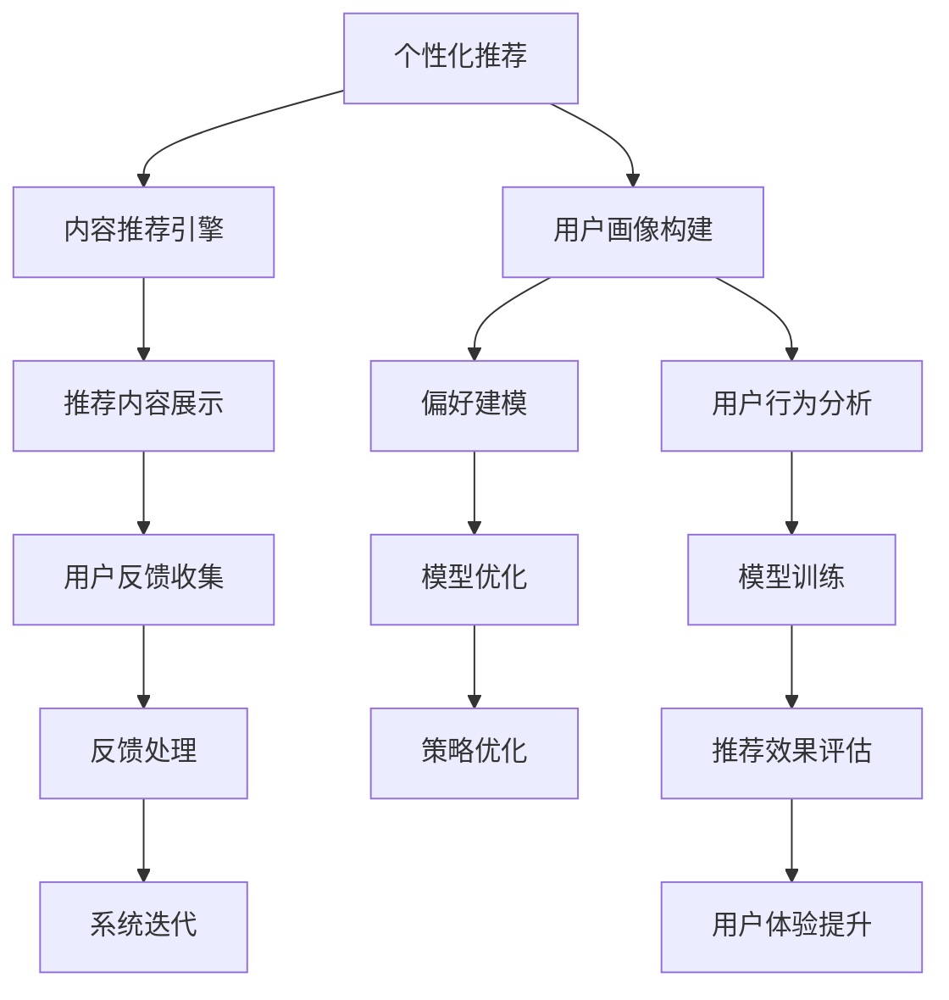

                 

# 知识付费创业的用户价值 Maximization

## 1. 背景介绍

### 1.1 问题由来

随着互联网的发展，知识付费作为一种新兴的商业模式迅速崛起。知识付费平台通过聚合高质量的内容，以订阅、付费咨询、课程等形式，为用户提供深度、系统化的知识服务。然而，尽管知识付费市场潜力巨大，仍面临着诸多挑战，如内容质量参差不齐、用户获取体验不佳、付费转化率低等。如何最大化用户价值，提升平台收益，成为知识付费创业者必须解答的重要问题。

### 1.2 问题核心关键点

知识付费用户价值的最大化，涉及用户获取、留存、转化等多个方面。本文将从用户获取和留存的角度，深入探讨如何通过个性化推荐、高质量内容和优质用户体验，最大化知识付费平台的用户价值。

## 2. 核心概念与联系

### 2.1 核心概念概述

为更好地理解如何通过个性化推荐、高质量内容和优质用户体验最大化知识付费平台的用户价值，本节将介绍几个密切相关的核心概念：

- **个性化推荐**：通过分析用户行为、偏好等数据，为用户提供定制化的内容推荐，提升用户体验，增加用户粘性。
- **高质量内容**：精选优质的教育资源、专业咨询、研究报告等，保证知识付费内容的专业性和权威性。
- **优质用户体验**：通过流畅的UI/UX设计、友好的交互方式、高效的内容访问等，提升用户的使用体验。
- **内容质量管理**：建立严格的内容审核机制，保证知识付费平台内容的准确性和可靠性。
- **用户价值评估**：通过建立用户行为数据模型，量化用户价值，优化产品策略。

这些核心概念共同构成了知识付费平台的运营框架，通过理解这些概念及其相互关系，可以帮助创业者更好地构建和运营知识付费平台。

### 2.2 核心概念原理和架构的 Mermaid 流程图(Mermaid 流程节点中不要有括号、逗号等特殊字符)



这个流程图展示了个性化推荐系统从数据收集、用户画像构建、模型训练到推荐效果评估和系统迭代的全流程。

## 3. 核心算法原理 & 具体操作步骤

### 3.1 算法原理概述

个性化推荐的核心在于对用户行为数据的分析和建模，以预测用户对不同内容的偏好和兴趣，从而实现定制化的内容推荐。具体来说，个性化推荐算法可以分为以下几步：

1. **数据收集**：收集用户浏览、购买、搜索、评分等行为数据。
2. **用户画像构建**：通过聚类、分类等方法，对用户进行个性化标签的标记。
3. **模型训练**：使用协同过滤、内容过滤、混合过滤等算法，构建用户-内容相似性矩阵，训练推荐模型。
4. **推荐效果评估**：通过A/B测试等方法，评估推荐系统的性能，如点击率、转化率、用户满意度等指标。
5. **策略优化**：根据评估结果，调整推荐模型和策略，进一步提升用户体验和用户留存率。

### 3.2 算法步骤详解

以协同过滤算法为例，详细讲解个性化推荐的核心步骤。

**Step 1: 数据收集与预处理**

1. **数据收集**：从知识付费平台收集用户的行为数据，包括浏览、点击、购买、评分等行为。
2. **数据清洗与归一化**：处理缺失值、异常值，对数据进行归一化处理。
3. **特征提取**：从行为数据中提取关键特征，如访问时长、浏览路径、购买记录等。

**Step 2: 用户画像构建**

1. **用户聚类**：使用K-means、层次聚类等算法，对用户进行聚类，生成用户群体。
2. **标签生成**：为每个用户群体生成一组个性化的标签，描述其兴趣偏好。
3. **特征组合**：将用户的个体特征与群体标签相结合，生成更细致的用户画像。

**Step 3: 模型训练**

1. **相似度计算**：计算用户-内容间的相似度，使用余弦相似度、皮尔逊相关系数等方法。
2. **协同过滤**：构建用户-内容相似性矩阵，使用基于用户的协同过滤或基于项目的协同过滤算法。
3. **模型训练与优化**：使用SGD、Adagrad等优化算法，训练推荐模型，并根据损失函数进行模型优化。

**Step 4: 推荐结果生成**

1. **内容排序**：根据用户画像和相似性矩阵，对内容进行排序，生成推荐列表。
2. **推荐结果展示**：将推荐结果展示给用户，可以通过前端展示或API接口提供推荐服务。

**Step 5: 推荐效果评估**

1. **点击率与转化率**：统计推荐内容被用户点击和购买的频率，评估推荐效果。
2. **用户满意度**：通过用户反馈和评分，评估用户对推荐结果的满意度。
3. **行为跟踪**：通过日志分析，跟踪用户后续行为，进一步优化推荐策略。

### 3.3 算法优缺点

个性化推荐算法具有以下优点：
1. **用户粘性高**：通过个性化推荐，提升用户对平台的粘性，增加活跃度。
2. **提升转化率**：推荐系统能够精准推荐用户感兴趣的内容，提高购买转化率。
3. **数据驱动**：通过数据驱动的算法，确保推荐结果的科学性和合理性。

同时，该算法也存在一些局限性：
1. **数据稀疏性**：用户行为数据往往较为稀疏，可能导致协同过滤算法失效。
2. **冷启动问题**：新用户或新内容没有足够的历史数据，难以进行个性化推荐。
3. **算法复杂性**：协同过滤算法计算复杂度较高，需要大量的计算资源。
4. **推荐多样性不足**：过于依赖历史行为数据，可能导致推荐内容的多样性不足。

尽管存在这些局限性，但就目前而言，个性化推荐算法仍是大规模知识付费平台的核心推荐策略。未来相关研究的重点在于如何进一步降低推荐算法对数据的需求，提高推荐内容的多样性和相关性，同时兼顾计算效率和可扩展性。

### 3.4 算法应用领域

个性化推荐算法在知识付费平台的应用非常广泛，涵盖以下多个方面：

- **课程推荐**：根据用户的学习历史和行为，推荐适合的在线课程。
- **资源推荐**：推荐用户可能感兴趣的研究报告、论文、新闻等资源。
- **会员推荐**：根据用户消费行为，推荐适合的会员套餐。
- **内容创作**：帮助内容创作者发现潜在的受众，提高内容曝光率。

此外，个性化推荐算法还被应用于电商、社交、新闻等多个领域，成为推动内容推荐服务的重要技术手段。

## 4. 数学模型和公式 & 详细讲解 & 举例说明

### 4.1 数学模型构建

本节将使用数学语言对个性化推荐算法进行更加严格的刻画。

记用户集合为 $U$，内容集合为 $I$，用户对内容的评分矩阵为 $R \in \mathbb{R}^{m \times n}$，其中 $m$ 为用户数，$n$ 为内容数。目标是通过评分矩阵 $R$，预测用户 $u$ 对内容 $i$ 的评分 $r_{ui}$，构建推荐模型。

假设推荐模型为 $f_{\theta}(u,i)$，其中 $\theta$ 为模型参数。我们的目标是最小化预测评分与实际评分之间的平方误差，即：

$$
\min_{\theta} \sum_{(u,i) \in U \times I} (r_{ui} - f_{\theta}(u,i))^2
$$

### 4.2 公式推导过程

对于协同过滤算法，我们采用基于用户的协同过滤方法，即：

$$
f_{\theta}(u,i) = \sum_{v \in U} w_{uv} \times r_{vi}
$$

其中 $w_{uv}$ 为用户 $u$ 和 $v$ 的相似度权重。常用的相似度计算方法包括余弦相似度和皮尔逊相关系数。

余弦相似度的计算公式为：

$$
w_{uv} = \frac{\mathbf{r}_u \cdot \mathbf{r}_v}{\|\mathbf{r}_u\| \|\mathbf{r}_v\|}
$$

其中 $\mathbf{r}_u$ 和 $\mathbf{r}_v$ 分别为用户 $u$ 和 $v$ 的评分向量。

皮尔逊相关系数的计算公式为：

$$
w_{uv} = \frac{\sum_{i \in I} (r_{ui} - \bar{r}_u)(r_{vi} - \bar{r}_v)}{\sqrt{\sum_{i \in I} (r_{ui} - \bar{r}_u)^2} \sqrt{\sum_{i \in I} (r_{vi} - \bar{r}_v)^2}}
$$

其中 $\bar{r}_u$ 和 $\bar{r}_v$ 分别为用户 $u$ 和 $v$ 的评分均值。

### 4.3 案例分析与讲解

以Netflix推荐系统为例，展示协同过滤算法的实际应用。

Netflix的推荐系统采用了基于用户的协同过滤算法，对用户和电影进行相似度计算，构建用户-电影相似性矩阵。具体步骤如下：

1. **数据收集**：Netflix收集了用户观看电影的历史数据，包括每个用户观看的电影列表。
2. **数据预处理**：对数据进行缺失值处理，去除异常值，并对数据进行归一化处理。
3. **相似度计算**：使用余弦相似度计算用户间的相似度，构建用户-用户相似性矩阵。
4. **模型训练**：使用基于用户协同过滤的推荐算法，训练推荐模型。
5. **推荐结果生成**：根据用户画像和相似性矩阵，生成推荐列表。

Netflix的推荐系统通过精确的用户行为分析和大规模计算，实现了个性化推荐，极大地提升了用户满意度和平台收益。

## 5. 项目实践：代码实例和详细解释说明

### 5.1 开发环境搭建

在进行个性化推荐项目实践前，我们需要准备好开发环境。以下是使用Python进行Scikit-Learn开发的环境配置流程：

1. 安装Anaconda：从官网下载并安装Anaconda，用于创建独立的Python环境。

2. 创建并激活虚拟环境：
```bash
conda create -n recsys-env python=3.8 
conda activate recsys-env
```

3. 安装Scikit-Learn：
```bash
pip install scikit-learn
```

4. 安装推荐系统相关的库：
```bash
pip install pandas numpy scipy scikit-learn tqdm jupyter notebook ipython
```

完成上述步骤后，即可在`recsys-env`环境中开始推荐系统开发。

### 5.2 源代码详细实现

这里我们以一个简单的协同过滤推荐系统为例，给出Python代码实现。

首先，导入必要的库和数据集：

```python
import pandas as pd
from sklearn.metrics import mean_squared_error, r2_score
from sklearn.model_selection import train_test_split
from sklearn.decomposition import TruncatedSVD
from sklearn.metrics.pairwise import cosine_similarity

# 导入数据集
data = pd.read_csv('rating.csv')
```

然后，进行数据预处理和特征提取：

```python
# 数据清洗
data = data.dropna()

# 特征提取
user_ids = data['userId'].unique()
movie_ids = data['movieId'].unique()
ratings = data[['userId', 'movieId', 'rating']].values

# 计算用户-电影评分矩阵
R = pd.pivot_table(data, index='userId', columns='movieId', values='rating').fillna(0)

# 标准化评分矩阵
mean = R.mean()
std = R.std()
R = (R - mean) / std

# 特征选择
features = R.index
target = R.columns
X = R[features].T
y = R[target]
```

接下来，构建推荐模型并进行训练：

```python
# 数据划分
X_train, X_test, y_train, y_test = train_test_split(X, y, test_size=0.2, random_state=42)

# 特征降维
svd = TruncatedSVD(n_components=10)
X_train = svd.fit_transform(X_train)
X_test = svd.transform(X_test)

# 训练模型
model = TruncatedSVD(n_components=10)
model.fit(X_train)

# 预测评分
y_pred = model.transform(X_test)

# 评估模型
rmse = mean_squared_error(y_test, y_pred)
r2 = r2_score(y_test, y_pred)
print(f'RMSE: {rmse:.2f}, R^2: {r2:.2f}')
```

最后，展示推荐结果：

```python
# 推荐结果展示
y_pred = model.transform(X_test)
top_n = 10
user_index = 0
top_movies = X_test.index[np.argsort(y_pred[user_index, :])][-top_n:]
print(f'Top {top_n} movies for user {user_index}: {top_movies}')
```

以上就是使用Scikit-Learn进行协同过滤推荐系统的完整代码实现。可以看到，代码实现较为简洁，通过几个关键步骤，即数据预处理、特征降维、模型训练和推荐结果展示，便能够构建一个基本的协同过滤推荐系统。

### 5.3 代码解读与分析

让我们再详细解读一下关键代码的实现细节：

**数据预处理**：
- 使用`dropna`方法处理缺失值。
- 通过`pivot_table`方法构建用户-电影评分矩阵。

**特征提取**：
- 使用`unique`方法获取用户和电影的唯一标识符。
- 使用`pivot_table`方法计算用户-电影评分矩阵，并使用`fillna`方法填补缺失值。

**特征降维**：
- 使用`TruncatedSVD`方法进行特征降维，保留10个主成分。
- 使用`fit_transform`方法对训练集进行降维，使用`transform`方法对测试集进行降维。

**模型训练**：
- 使用`TruncatedSVD`方法对训练集进行降维，得到用户-电影评分矩阵。
- 使用`fit_transform`方法对训练集进行降维，得到特征矩阵和目标向量。
- 使用`transform`方法对测试集进行降维，得到预测评分矩阵。

**推荐结果展示**：
- 使用`argsort`方法对预测评分矩阵进行排序，选择前10个评分最高的电影作为推荐结果。

可以看到，通过合理利用Scikit-Learn库的推荐系统组件，我们能够在较短时间内构建一个简单的协同过滤推荐系统。开发者可以进一步优化模型参数、引入更多的推荐策略，以提升推荐效果。

## 6. 实际应用场景

### 6.1 智能推荐系统

个性化推荐算法在智能推荐系统中的应用非常广泛，如电商平台、视频网站、新闻平台等。通过分析用户行为数据，这些平台能够为用户提供精准的商品推荐、内容推荐和广告推荐，提升用户满意度和平台收益。

以电商平台的商品推荐为例，平台通过分析用户的浏览、点击、购买行为，构建用户画像和商品画像，使用协同过滤算法生成推荐结果。推荐系统能够帮助用户快速找到所需商品，提高购物效率，同时平台也能通过精准推荐获得更高的销售额和用户粘性。

### 6.2 内容推荐引擎

内容推荐引擎是知识付费平台的核心功能之一。通过个性化推荐算法，平台能够为用户提供符合其兴趣和需求的课程、文章、视频等内容，提升用户体验和平台收益。

以在线教育平台为例，平台通过收集用户的学习行为数据，构建用户画像和课程画像，使用协同过滤算法生成推荐列表。推荐系统能够帮助用户发现优质的课程资源，提高学习效率，同时平台也能通过精准推荐获得更多的用户订阅和付费。

### 6.3 用户行为分析

个性化推荐算法的另一个重要应用是用户行为分析。通过分析用户的行为数据，平台能够洞察用户的兴趣和需求，优化产品策略和用户体验。

以新闻平台为例，平台通过分析用户的阅读行为，构建用户画像和文章画像，使用协同过滤算法生成推荐列表。推荐系统能够帮助用户发现感兴趣的新闻内容，提高阅读体验，同时平台也能通过精准推荐获得更高的点击率和广告收入。

## 7. 工具和资源推荐

### 7.1 学习资源推荐

为了帮助开发者系统掌握个性化推荐算法的理论基础和实践技巧，这里推荐一些优质的学习资源：

1. **《推荐系统》书籍**：由Adrian Kucukelbir等编著，全面介绍了推荐系统的主要理论和算法，适合初学者和进阶开发者学习。

2. **Coursera《推荐系统》课程**：由斯坦福大学Andrew Ng教授主讲的推荐系统课程，讲解了协同过滤、内容过滤、混合过滤等算法，并提供了丰富的实战案例。

3. **Kaggle推荐系统竞赛**：Kaggle平台提供了多个推荐系统竞赛，可以实际操作推荐算法，提升实战能力。

4. **Recommender Systems with Python**：Google的推荐系统实战教程，介绍了如何使用Python和Scikit-Learn实现协同过滤推荐系统，适合动手实践。

5. **AI Challenger推荐系统竞赛**：国内最大的推荐系统竞赛平台，提供了丰富的推荐算法和数据集，适合深入学习推荐系统。

通过对这些资源的学习实践，相信你一定能够快速掌握个性化推荐算法的精髓，并用于解决实际的推荐系统问题。

### 7.2 开发工具推荐

高效的开发离不开优秀的工具支持。以下是几款用于推荐系统开发的常用工具：

1. **Scikit-Learn**：Python的机器学习库，提供了丰富的推荐系统组件和工具，适合快速迭代研究。

2. **TensorFlow**：由Google主导开发的深度学习框架，支持分布式计算和模型优化，适合大规模工程应用。

3. **PyTorch**：Facebook开发的深度学习框架，支持动态计算图和模型调试，适合快速原型开发。

4. **Hadoop**：Apache的分布式计算框架，支持大规模数据处理和存储，适合大数据推荐系统。

5. **Apache Spark**：Apache的分布式计算框架，支持高效的流式处理和机器学习算法，适合实时推荐系统。

合理利用这些工具，可以显著提升推荐系统的开发效率，加快创新迭代的步伐。

### 7.3 相关论文推荐

个性化推荐系统的发展源于学界的持续研究。以下是几篇奠基性的相关论文，推荐阅读：

1. **协同过滤算法**：由Richard Luce在1959年提出的基于用户的协同过滤算法，奠定了推荐系统研究的理论基础。

2. **基于内容的推荐**：由Joseph Konstan等人于2009年提出的基于内容的推荐算法，通过用户对内容的评分，学习用户-内容关联。

3. **混合推荐算法**：由Dheeru Vijaya Rao等人于2015年提出的混合推荐算法，结合基于用户和基于内容的推荐，提升推荐效果。

4. **深度学习在推荐系统中的应用**：由Jian Deng等人于2016年提出的深度学习推荐系统，利用神经网络模型提升推荐精度。

5. **推荐系统中的自适应算法**：由Xinyu Ye等人于2017年提出的自适应推荐算法，通过模型自适应调整参数，提高推荐效果。

这些论文代表了个性化推荐系统的发展脉络。通过学习这些前沿成果，可以帮助研究者把握学科前进方向，激发更多的创新灵感。

## 8. 总结：未来发展趋势与挑战

### 8.1 总结

本文对个性化推荐算法的核心原理和具体操作步骤进行了全面系统的介绍。首先阐述了个性化推荐算法的核心思想和应用场景，明确了个性化推荐在提升用户价值、优化平台收益方面的独特价值。其次，从数据收集、用户画像构建、模型训练到推荐结果生成，详细讲解了个性化推荐算法的核心步骤，给出了推荐系统开发的完整代码实例。同时，本文还广泛探讨了推荐算法在智能推荐系统、内容推荐引擎、用户行为分析等多个领域的应用前景，展示了个性化推荐算法的广阔前景。最后，本文精选了推荐算法的各类学习资源，力求为读者提供全方位的技术指引。

通过本文的系统梳理，可以看到，个性化推荐算法在知识付费平台中的应用非常广泛，其通过精准推荐提升用户体验和平台收益的能力毋庸置疑。未来，伴随推荐算法的持续演进和优化，相信个性化推荐系统将迎来更广阔的发展空间，为知识付费平台带来更多的商业机会和创新可能。

### 8.2 未来发展趋势

展望未来，个性化推荐算法将呈现以下几个发展趋势：

1. **模型复杂度提升**：随着深度学习、强化学习等技术的发展，推荐模型的复杂度将不断提升，从而实现更加精准、灵活的推荐。

2. **多模态融合**：推荐算法将越来越多地融合文本、图像、视频等多种模态的数据，提升推荐内容的丰富性和多样性。

3. **实时化处理**：推荐系统将越来越多地采用流式处理技术，实时处理用户行为数据，提供更加个性化的推荐。

4. **个性化推荐策略优化**：推荐算法将更加注重个性化推荐策略的优化，如上下文感知推荐、社交推荐等，提升推荐效果。

5. **跨平台推荐**：推荐系统将越来越多地跨平台运行，实现多设备、多渠道的个性化推荐。

6. **推荐系统公平性**：推荐算法将更加注重公平性，避免数据偏见和算法歧视，实现更加公正的推荐。

以上趋势凸显了个性化推荐算法的广阔前景。这些方向的探索发展，必将进一步提升推荐系统的性能和应用范围，为知识付费平台带来更多的商业机会和创新可能。

### 8.3 面临的挑战

尽管个性化推荐算法已经取得了显著成果，但在迈向更加智能化、普适化应用的过程中，仍面临着诸多挑战：

1. **数据质量问题**：推荐系统的性能很大程度上依赖于数据质量，包括数据的完整性、准确性和及时性。如何获取高质量的数据，是推荐系统面临的重要问题。

2. **冷启动问题**：新用户或新内容没有足够的历史数据，难以进行个性化推荐。如何有效地解决冷启动问题，是推荐系统的重要研究方向。

3. **多样性和新颖性**：推荐系统需要保证推荐内容的多样性和新颖性，避免陷入推荐内容的低质量循环。如何平衡推荐效果和多样性，是推荐系统的关键问题。

4. **计算资源消耗**：推荐系统的计算复杂度较高，需要大量的计算资源。如何降低计算资源消耗，提高推荐系统的效率，是推荐系统的重要研究方向。

5. **隐私和安全问题**：推荐系统需要处理大量的用户数据，如何保护用户隐私和安全，是推荐系统的重要挑战。

6. **算法的可解释性**：推荐算法的复杂性较高，难以解释其内部工作机制和决策逻辑。如何提高推荐算法的可解释性，是推荐系统的重要研究方向。

7. **推荐系统的公平性**：推荐系统需要避免数据偏见和算法歧视，实现更加公正的推荐。如何保证推荐系统的公平性，是推荐系统的重要研究方向。

正视推荐系统面临的这些挑战，积极应对并寻求突破，将是个性化推荐算法走向成熟的必由之路。相信随着学界和产业界的共同努力，这些挑战终将一一被克服，个性化推荐算法必将在构建人机协同的智能时代中扮演越来越重要的角色。

### 8.4 未来突破

面对个性化推荐算法所面临的种种挑战，未来的研究需要在以下几个方面寻求新的突破：

1. **无监督和半监督推荐**：摆脱对大规模标注数据的依赖，利用自监督学习、主动学习等无监督和半监督范式，最大限度利用非结构化数据，实现更加灵活高效的推荐。

2. **多模态推荐系统**：融合文本、图像、视频等多种模态的数据，提升推荐内容的丰富性和多样性。

3. **实时推荐系统**：采用流式处理技术，实时处理用户行为数据，提供更加个性化的推荐。

4. **个性化推荐策略优化**：注重个性化推荐策略的优化，如上下文感知推荐、社交推荐等，提升推荐效果。

5. **跨平台推荐系统**：实现多设备、多渠道的个性化推荐，提升用户体验。

6. **推荐系统公平性**：避免数据偏见和算法歧视，实现更加公正的推荐。

7. **推荐系统优化**：降低计算资源消耗，提高推荐系统的效率。

这些研究方向的探索，必将引领个性化推荐算法迈向更高的台阶，为构建安全、可靠、可解释、可控的智能系统铺平道路。面向未来，个性化推荐算法还需要与其他人工智能技术进行更深入的融合，如知识表示、因果推理、强化学习等，多路径协同发力，共同推动推荐系统的发展。只有勇于创新、敢于突破，才能不断拓展推荐算法的边界，让智能技术更好地造福人类社会。

## 9. 附录：常见问题与解答

**Q1：推荐系统如何选择合适的特征？**

A: 特征的选择应遵循SMART原则，即Specific（具体）、Measurable（可衡量）、Attainable（可达成）、Relevant（相关）、Time-bound（有时限）。具体的特征选择方法包括：

1. **用户行为特征**：如浏览记录、购买记录、评分等。
2. **内容特征**：如标题、摘要、标签等。
3. **时间特征**：如时间戳、访问时间等。
4. **社交特征**：如好友推荐、用户社区等。

选择合适的特征是推荐系统成功的关键，开发者应根据具体业务场景，选择与推荐目标最相关的特征。

**Q2：推荐系统的冷启动问题如何解决？**

A: 冷启动问题可以通过以下方法解决：

1. **基于内容的推荐**：利用内容特征，如商品属性、文章主题等，进行推荐。
2. **基于模型的推荐**：利用深度学习模型，从已有用户的行为数据中推断新用户的偏好。
3. **多模态推荐**：利用多种模态数据，如文本、图像、语音等，提升推荐效果。
4. **标签推荐**：利用用户对已有内容的标签，进行推荐。

合理利用这些方法，可以有效地解决推荐系统的冷启动问题。

**Q3：推荐系统如何平衡推荐效果和多样性？**

A: 推荐系统可以通过以下方法平衡推荐效果和多样性：

1. **负采样**：通过负采样，增加多样性，避免陷入推荐内容的低质量循环。
2. **模型集成**：采用多种推荐算法，集成结果，提升推荐效果和多样性。
3. **上下文感知**：考虑上下文信息，提升推荐效果和多样性。

合理利用这些方法，可以有效地平衡推荐效果和多样性，提升推荐系统的性能。

**Q4：推荐系统的用户行为数据如何处理？**

A: 推荐系统的用户行为数据应进行如下处理：

1. **数据清洗**：去除异常值、缺失值等噪声。
2. **数据归一化**：对数据进行归一化处理，提升模型训练效果。
3. **数据增强**：通过数据增强，提升模型泛化能力。
4. **特征选择**：选择合适的特征，提升模型效果。

合理利用这些方法，可以有效地处理推荐系统的用户行为数据，提升模型性能。

**Q5：推荐系统如何实现个性化推荐？**

A: 推荐系统实现个性化推荐的关键在于用户画像和内容画像的构建，具体步骤如下：

1. **数据收集**：收集用户行为数据，如浏览、点击、购买等。
2. **用户画像构建**：通过聚类、分类等方法，对用户进行个性化标签的标记。
3. **内容画像构建**：通过分析内容特征，如标题、摘要、标签等，构建内容画像。
4. **模型训练**：使用协同过滤、内容过滤等算法，训练推荐模型。
5. **推荐结果生成**：根据用户画像和内容画像，生成推荐列表。

合理利用这些方法，可以有效地实现个性化推荐，提升用户满意度。

总之，推荐系统是一个复杂而庞大的系统，开发者需要综合考虑数据处理、特征选择、模型训练、推荐结果生成等多个环节，才能构建出高效、精准、灵活的推荐系统。未来，随着推荐算法的持续演进和优化，推荐系统将迎来更广阔的发展空间，为知识付费平台带来更多的商业机会和创新可能。相信通过持续的技术创新和优化，推荐系统必将在构建人机协同的智能时代中扮演越来越重要的角色。

---

作者：禅与计算机程序设计艺术 / Zen and the Art of Computer Programming

