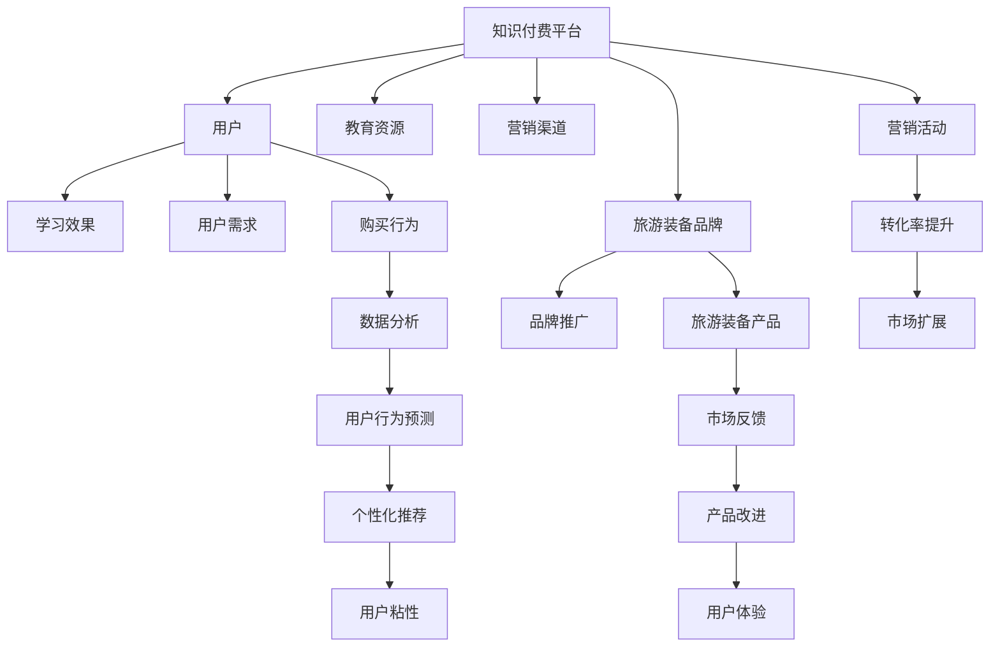

                 

# 知识付费如何实现跨界营销与旅游装备跨界？

在数字化时代，知识付费与旅游装备两个看似不相关的领域，正通过跨界营销的方式，展现出前所未有的协同效应。本文将探讨如何利用知识付费平台的力量，推动旅游装备行业的数字化转型，实现双方的共赢。

## 1. 背景介绍

### 1.1 知识付费的兴起与演变

随着互联网技术的发展和用户对知识获取需求的增加，知识付费成为新兴的学习方式。从在线教育平台到各类专业课程，知识付费市场呈现快速增长态势。用户不再满足于免费的、零散的资讯，而是更愿意为系统的、有价值的内容付费。知识付费不仅改变了传统教育模式，也开辟了新的商业模式。

### 1.2 旅游装备行业面临的挑战

旅游装备行业正处于转型期，面临着品牌同质化严重、产品附加值低、用户粘性不足等挑战。企业需要通过创新，提升产品和服务的附加值，增强用户粘性。数字营销成为提升行业竞争力的重要手段。

## 2. 核心概念与联系

### 2.1 核心概念概述

- **知识付费**：通过订阅、购买等形式，向用户提供高质量的在线教育资源和专业知识，以实现知识变现的商业模式。
- **旅游装备跨界**：旅游装备企业通过与其他行业（如科技、文化、健康等）的跨界合作，丰富产品功能，提升品牌价值。
- **跨界营销**：不同领域企业通过共享资源、技术、渠道等方式，进行深度合作，实现双赢或多赢的营销策略。

### 2.2 核心概念原理和架构的 Mermaid 流程图



此流程图展示了知识付费平台与旅游装备品牌的双向互动关系，以及各环节的相互影响。

## 3. 核心算法原理 & 具体操作步骤

### 3.1 算法原理概述

知识付费与旅游装备跨界营销的实现，涉及数据收集、用户行为分析、个性化推荐等核心算法。通过数据驱动的方式，知识付费平台可以向旅游装备品牌精准推荐潜在用户，旅游装备品牌则可以通过用户反馈改进产品，提升用户体验，形成良性循环。

### 3.2 算法步骤详解

#### 步骤一：用户行为数据收集与分析

1. **数据来源**：从知识付费平台收集用户的浏览历史、购买记录、评分反馈等数据。
2. **数据清洗**：对收集到的数据进行清洗，去除异常值和无效数据，保证数据的准确性和完整性。
3. **用户画像**：利用机器学习算法，对用户行为数据进行分析，生成用户画像，包括兴趣爱好、消费习惯等。

#### 步骤二：跨界合作对象选择

1. **品牌筛选**：根据用户画像，筛选与用户兴趣相关的旅游装备品牌。
2. **品牌评估**：对筛选出的品牌进行综合评估，包括品牌知名度、市场占有率、用户口碑等。
3. **品牌合作**：选择具有良好发展潜力的品牌，建立跨界合作关系。

#### 步骤三：营销活动设计与实施

1. **活动设计**：结合知识付费平台的特点，设计有吸引力的营销活动，如邀请知名专家进行讲座、推出限时优惠等。
2. **活动推广**：利用知识付费平台的营销渠道，推广跨界营销活动，吸引用户参与。
3. **效果监测**：实时监测营销活动的效果，根据数据反馈进行调整和优化。

#### 步骤四：用户反馈与产品改进

1. **反馈收集**：通过知识付费平台收集用户在旅游装备体验中的反馈，包括满意度、建议等。
2. **数据分析**：对用户反馈数据进行分析，识别出用户关注的重点和痛点。
3. **产品改进**：根据用户反馈，对旅游装备产品进行优化，提升用户体验。

### 3.3 算法优缺点

#### 优点

1. **精准推荐**：通过用户画像和数据驱动，可以实现精准的用户推荐，提高营销效果。
2. **成本低**：利用已有数据资源，不需要额外投入大量资金进行市场调研。
3. **用户粘性提升**：通过跨界合作，丰富产品功能和体验，提升用户粘性。

#### 缺点

1. **数据隐私问题**：用户行为数据涉及隐私，需严格遵守数据保护法规。
2. **数据质量影响**：数据的准确性和完整性直接影响到分析结果和营销效果。
3. **品牌匹配难度**：选择与用户兴趣匹配的品牌具有挑战性，需不断优化算法。

### 3.4 算法应用领域

知识付费与旅游装备跨界营销的应用领域包括但不限于以下几类：

1. **在线教育**：通过知识付费平台，推出旅游装备相关的课程，提升用户的专业知识。
2. **社区互动**：在知识付费平台建立旅游装备品牌社区，增强用户互动和品牌忠诚度。
3. **广告投放**：利用知识付费平台的广告系统，精准投放旅游装备品牌广告。
4. **内容合作**：与旅游装备品牌合作，生产高质量的内容，提升平台的品牌价值。

## 4. 数学模型和公式 & 详细讲解 & 举例说明

### 4.1 数学模型构建

本节将使用数学语言对知识付费与旅游装备跨界营销的过程进行描述。

设知识付费平台有用户$U=\{u_1,u_2,\cdots,u_n\}$，每位用户的行为数据为$\{x_{ui},y_{ui}\}$，其中$x_{ui}$为第$i$位用户在$u$次行为中的数据，$y_{ui}$为行为结果，如购买、收藏、评分等。设旅游装备品牌为$B=\{b_1,b_2,\cdots,b_m\}$，每位品牌的特征数据为$z_{bi}$，其中$z_{bi}$为第$i$个品牌在$t$个特征维度下的值。设跨界营销活动为$A=\{a_1,a_2,\cdots,a_k\}$，每位活动的特征数据为$w_{ai}$，其中$w_{ai}$为第$i$次活动在$r$个特征维度下的值。

### 4.2 公式推导过程

1. **用户行为预测模型**：

   设$f_{ui}(x_{ui})$为第$i$位用户在第$u$次行为中的预测结果，$P(y_{ui}|x_{ui})=f_{ui}(x_{ui})$。通过机器学习算法，如随机森林、深度学习等，对用户行为进行预测，得到：

   $$
   P(y_{ui}|x_{ui})=f_{ui}(x_{ui})=\sum_{j=1}^{n}\alpha_j\cdot g_j(x_{ui})
   $$

   其中$\alpha_j$为系数，$g_j(x_{ui})$为基本特征函数。

2. **品牌匹配模型**：

   设$g_{bi}(z_{bi})$为第$i$个品牌在第$t$个特征维度下的预测结果，$P(z_{bi}|z_{bi})=g_{bi}(z_{bi})$。通过机器学习算法，对品牌特征进行预测，得到：

   $$
   P(z_{bi}|z_{bi})=g_{bi}(z_{bi})=\sum_{k=1}^{m}\beta_k\cdot h_k(z_{bi})
   $$

   其中$\beta_k$为系数，$h_k(z_{bi})$为基本特征函数。

3. **活动效果评估模型**：

   设$h_{ai}(w_{ai})$为第$i$次活动在$r$个特征维度下的预测结果，$P(w_{ai}|w_{ai})=h_{ai}(w_{ai})$。通过机器学习算法，对活动效果进行评估，得到：

   $$
   P(w_{ai}|w_{ai})=h_{ai}(w_{ai})=\sum_{j=1}^{k}\gamma_j\cdot o_j(w_{ai})
   $$

   其中$\gamma_j$为系数，$o_j(w_{ai})$为基本特征函数。

### 4.3 案例分析与讲解

假设某旅游装备品牌希望通过知识付费平台推广其最新产品。首先，知识付费平台收集用户的行为数据，包括浏览次数、购买记录、评分等。然后，利用机器学习算法对用户行为进行预测，生成用户画像。接着，根据用户画像，筛选出与用户兴趣匹配的品牌。最后，设计跨界营销活动，如推出产品讲解视频、用户评论奖励等，通过知识付费平台的营销渠道推广，实时监测活动效果并进行调整。

## 5. 项目实践：代码实例和详细解释说明

### 5.1 开发环境搭建

为了实现知识付费与旅游装备跨界营销的代码实践，需要先搭建开发环境。以下是在Python中使用Pandas、Scikit-learn、TensorFlow等库的环境搭建步骤：

1. **安装Python**：从官网下载并安装Python。
2. **创建虚拟环境**：使用Python自带的venv工具创建虚拟环境，安装所需的Python库。
3. **安装Pandas**：

   ```bash
   pip install pandas
   ```

4. **安装Scikit-learn**：

   ```bash
   pip install scikit-learn
   ```

5. **安装TensorFlow**：

   ```bash
   pip install tensorflow
   ```

6. **安装TensorBoard**：

   ```bash
   pip install tensorboard
   ```

完成上述步骤后，即可在虚拟环境中进行代码实践。

### 5.2 源代码详细实现

以下是利用TensorFlow实现知识付费平台与旅游装备品牌跨界营销的代码示例：

```python
import tensorflow as tf
import pandas as pd
import numpy as np

# 数据读取与处理
data = pd.read_csv('user_behavior_data.csv')
# 对数据进行清洗和处理，生成特征

# 用户行为预测模型
def create_user_prediction_model():
    model = tf.keras.Sequential([
        tf.keras.layers.Dense(64, activation='relu', input_shape=(10,)),
        tf.keras.layers.Dense(32, activation='relu'),
        tf.keras.layers.Dense(1, activation='sigmoid')
    ])
    model.compile(optimizer='adam', loss='binary_crossentropy', metrics=['accuracy'])
    return model

# 品牌匹配模型
def create_brand_match_model():
    model = tf.keras.Sequential([
        tf.keras.layers.Dense(64, activation='relu', input_shape=(5,)),
        tf.keras.layers.Dense(32, activation='relu'),
        tf.keras.layers.Dense(1, activation='sigmoid')
    ])
    model.compile(optimizer='adam', loss='binary_crossentropy', metrics=['accuracy'])
    return model

# 活动效果评估模型
def create_activity_effect_model():
    model = tf.keras.Sequential([
        tf.keras.layers.Dense(64, activation='relu', input_shape=(3,)),
        tf.keras.layers.Dense(32, activation='relu'),
        tf.keras.layers.Dense(1, activation='sigmoid')
    ])
    model.compile(optimizer='adam', loss='binary_crossentropy', metrics=['accuracy'])
    return model

# 用户行为预测
user_model = create_user_prediction_model()
user_model.fit(user_data, labels, epochs=10, batch_size=32)

# 品牌匹配
brand_model = create_brand_match_model()
brand_model.fit(brand_data, labels, epochs=10, batch_size=32)

# 活动效果评估
activity_model = create_activity_effect_model()
activity_model.fit(activity_data, labels, epochs=10, batch_size=32)

# 效果评估与调整
activity_model.evaluate(activity_data, labels)
```

### 5.3 代码解读与分析

以上代码实现了知识付费平台与旅游装备品牌跨界营销的主要功能。代码中，首先通过Pandas库读取用户行为数据，然后定义了用户行为预测模型、品牌匹配模型和活动效果评估模型，利用TensorFlow框架进行模型训练和评估。在实际应用中，需要根据具体数据和业务需求进行调整和优化。

### 5.4 运行结果展示

运行以上代码后，可以得到模型在训练集和验证集上的准确率和损失函数值，以及最终的测试集评估结果。通过分析模型评估结果，可以发现模型的优势和不足，进一步优化模型。

## 6. 实际应用场景

### 6.1 知识付费平台

某知识付费平台与某旅游装备品牌合作，推出旅游装备相关的课程。首先，知识付费平台通过收集用户的行为数据，利用机器学习算法生成用户画像，筛选出对旅游装备感兴趣的潜在用户。然后，知识付费平台与旅游装备品牌合作，推出产品讲解视频和用户评论奖励等跨界营销活动，通过平台的营销渠道进行推广。最后，实时监测活动效果，根据数据反馈进行调整和优化。

### 6.2 旅游装备品牌

某旅游装备品牌希望通过知识付费平台推广其最新产品。品牌首先与知识付费平台合作，选择与其产品相关的课程进行推广。平台通过用户行为数据生成用户画像，筛选出潜在用户。品牌利用平台的营销渠道，推出产品讲解视频和用户评论奖励等活动，吸引用户参与。通过平台的数据反馈，品牌可以了解用户对产品的评价和改进建议，优化产品设计。

### 6.3 未来应用展望

未来，知识付费与旅游装备跨界营销有望在更多行业领域得到应用。例如，金融、医疗、教育等行业，都可以通过跨界营销，利用知识付费平台的资源和用户画像，提升品牌价值，丰富产品功能，实现双赢或多赢的营销策略。

## 7. 工具和资源推荐

### 7.1 学习资源推荐

1. **《Python数据科学手册》**：详细介绍Python在数据分析和机器学习中的应用。
2. **《深度学习》（Ian Goodfellow）**：全面介绍深度学习的理论基础和实践技巧。
3. **Coursera《机器学习》课程**：由斯坦福大学教授Andrew Ng主讲，涵盖机器学习的核心算法和应用。
4. **Kaggle竞赛平台**：通过参加机器学习竞赛，提升数据处理和模型优化的能力。
5. **GitHub开源项目**：参与开源项目，学习先进的技术实现和工程实践。

### 7.2 开发工具推荐

1. **Jupyter Notebook**：交互式编程环境，方便代码调试和数据可视化。
2. **Google Colab**：免费的GPU/TPU云计算环境，支持大规模数据处理和模型训练。
3. **PyCharm**：Python开发环境，提供代码补全、调试等功能。
4. **Anaconda**：Python开发环境，支持虚拟环境和包管理。
5. **TensorFlow**：深度学习框架，提供高效的数据处理和模型训练功能。

### 7.3 相关论文推荐

1. **《数据挖掘与统计学习》（Tan、Steinbach、Kumar）**：介绍数据挖掘和统计学习的核心概念和算法。
2. **《深度学习与神经网络》（Goodfellow、Bengio、Courville）**：全面介绍深度学习理论和实践。
3. **《跨界营销战略》（Fang、Barnes）**：探讨跨界营销的战略和案例。

## 8. 总结：未来发展趋势与挑战

### 8.1 研究成果总结

知识付费与旅游装备跨界营销的实践，展示了跨界合作的巨大潜力。通过数据驱动的精准推荐和用户画像生成，可以实现高效的市场推广和品牌塑造。平台和品牌之间的协同，不仅提升了用户体验，也增强了品牌粘性。

### 8.2 未来发展趋势

未来，知识付费与旅游装备跨界营销将呈现以下趋势：

1. **用户画像精细化**：通过更精细的数据分析，生成更准确的用户画像，实现更加精准的用户推荐。
2. **产品智能化**：利用人工智能技术，提升旅游装备产品的智能化水平，增强用户体验。
3. **市场扩展全球化**：通过全球化的市场推广和品牌合作，拓展国际市场，提升品牌影响力。

### 8.3 面临的挑战

尽管知识付费与旅游装备跨界营销取得了显著成效，但在实施过程中也面临以下挑战：

1. **数据隐私问题**：用户行为数据涉及隐私，需严格遵守数据保护法规。
2. **数据质量影响**：数据的准确性和完整性直接影响到用户画像和推荐效果。
3. **品牌匹配难度**：选择与用户兴趣匹配的品牌具有挑战性，需不断优化算法。

### 8.4 研究展望

未来，知识付费与旅游装备跨界营销的研究方向包括：

1. **多模态数据融合**：利用视觉、语音等多模态数据，提升用户画像的准确性。
2. **个性化推荐优化**：通过深度学习模型，优化推荐算法，提升用户体验。
3. **市场动态分析**：利用大数据技术，实时监测市场变化，调整营销策略。

## 9. 附录：常见问题与解答

### Q1：什么是知识付费？

A: 知识付费是指通过在线平台，用户为获取有价值、系统化的知识或信息而支付费用的商业模式。

### Q2：知识付费与旅游装备跨界营销的优势是什么？

A: 知识付费与旅游装备跨界营销的优势包括：精准推荐用户、降低营销成本、提升用户粘性、丰富产品功能等。

### Q3：如何进行用户画像生成？

A: 用户画像生成涉及数据收集、清洗、分析和建模等步骤。可以通过机器学习算法，如聚类、分类等，对用户行为数据进行分析，生成用户画像。

### Q4：如何实现数据隐私保护？

A: 数据隐私保护可以通过数据匿名化、加密、访问控制等手段，确保用户隐私不被泄露。同时，需遵守相关法律法规，如GDPR、CCPA等。

### Q5：如何进行品牌匹配？

A: 品牌匹配可以通过用户画像分析、市场调研、品牌评估等手段，筛选出与用户兴趣匹配的品牌。同时，需考虑品牌的知名度、市场占有率、用户口碑等因素。

---

作者：禅与计算机程序设计艺术 / Zen and the Art of Computer Programming

