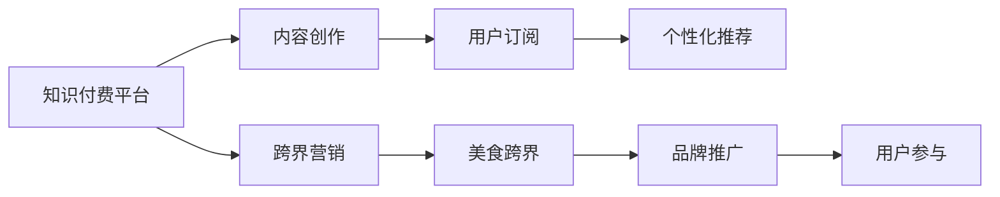

                 

## 1. 背景介绍

在数字化、智能化时代，知识付费（Knowledge-as-a-Service, KaaS）已成为消费者获取知识、提升技能的重要途径之一。知识付费平台通过向用户提供高质量的内容和个性化的服务，实现了内容变现和用户增长的双赢。然而，随着竞争的加剧，如何破局同质化内容，实现跨界营销，成为平台突围的新趋势。

与此同时，美食作为人类最古老的需求之一，一直是文化传承与创新中的重要一环。随着社会生活水平的提高，消费者对美食的体验、健康和安全要求也在不断提升。如何通过跨界融合，将美食体验与知识获取结合起来，成为企业创新营销的探索方向。

## 2. 核心概念与联系

### 2.1 核心概念概述

- **知识付费**：指的是消费者为获取专业知识、技能提升等内容，而支付相应费用的新型内容消费模式。主要形式包括在线课程、订阅文章、专业咨询等。
- **跨界营销**：指将不同领域的产品、服务或理念结合起来，进行市场推广的策略。通过跨界融合，创新出新的产品形态或服务模式，增强品牌吸引力和用户黏性。
- **美食跨界**：特指将美食体验与知识付费结合，通过跨界融合，提供更加丰富、多样化的消费体验。如结合营养知识、烹饪技巧、文化历史等元素，打造美食教育、文化体验等新形态的付费内容。

### 2.2 核心概念原理和架构的 Mermaid 流程图



从图中可以看出，知识付费平台通过内容创作吸引用户订阅，并提供个性化推荐，提升用户满意度。同时，通过跨界营销将知识付费与美食体验结合，创造出新的消费模式。最终，通过品牌推广和用户参与，实现整体营销效果的最大化。

## 3. 核心算法原理 & 具体操作步骤

### 3.1 算法原理概述

知识付费平台实现跨界营销，主要依赖于以下算法原理：

1. **用户画像构建**：通过用户行为数据分析，构建用户画像，识别用户偏好和需求。
2. **推荐系统优化**：利用协同过滤、深度学习等算法，优化推荐系统，提升个性化推荐效果。
3. **情感分析与舆情监测**：通过情感分析和舆情监测技术，实时调整内容和推广策略。
4. **跨界融合**：结合不同领域的知识和数据，进行跨界融合创新。

### 3.2 算法步骤详解

1. **用户画像构建**：
   - 收集用户的基本信息、行为数据、偏好数据等。
   - 使用聚类、分类算法对用户进行分类。
   - 使用关联规则、决策树等算法，挖掘用户行为规律和偏好。
   - 定期更新用户画像，确保其准确性和时效性。

2. **推荐系统优化**：
   - 选择合适的推荐算法，如协同过滤、深度学习等。
   - 使用用户画像和行为数据，训练推荐模型。
   - 实时更新推荐结果，确保内容的时效性和相关性。
   - 引入多臂老虎机（Multi-Armed Bandit）算法，优化推荐效果。

3. **情感分析与舆情监测**：
   - 使用NLP技术，对用户评论、反馈进行情感分析。
   - 实时监测社交媒体、论坛等渠道，获取用户舆情信息。
   - 根据情感分析和舆情信息，调整内容和推广策略。
   - 引入自然语言处理（NLP）技术，进行情感极性分析、情感主题建模等。

4. **跨界融合**：
   - 收集美食相关的知识数据，如食谱、烹饪技巧、美食文化等。
   - 将知识付费内容与美食数据进行融合，生成新的付费内容。
   - 结合用户画像和推荐系统，精准推送美食跨界内容。
   - 引入AR/VR等技术，提供沉浸式的美食体验。

### 3.3 算法优缺点

#### 优点：

1. **提升用户黏性**：通过跨界融合，提供更加丰富、多样化的内容，增强用户黏性。
2. **增强品牌曝光**：跨界营销能够打破原有领域的限制，提升品牌曝光度和市场影响力。
3. **实现精准营销**：基于用户画像和推荐系统，实现精准内容推送，提升用户满意度。

#### 缺点：

1. **成本投入大**：跨界融合需要整合不同领域的数据和资源，投入较大。
2. **用户接受度低**：跨界营销和内容创新可能引发用户接受度问题，需要进行市场调研和用户反馈。
3. **技术和实施难度高**：跨界融合涉及多个技术领域的协同，需要较高的技术实施和项目管理能力。

### 3.4 算法应用领域

1. **在线教育**：结合美食知识，推出烹饪课程、营养学课程等，提升课程趣味性和吸引力。
2. **健康管理**：结合营养学知识，推出个性化饮食计划、健康管理课程等，提升用户健康水平。
3. **文化体验**：结合美食文化，推出美食文化课程、旅游推荐等，增强用户文化体验。
4. **企业培训**：结合企业需求，推出团队烹饪课程、企业健康计划等，提升员工健康和工作效率。

## 4. 数学模型和公式 & 详细讲解 & 举例说明

### 4.1 数学模型构建

#### 用户画像构建：
用户画像由多个维度构成，包括基本信息（年龄、性别、地域）、行为数据（浏览、购买、评分）、偏好数据（兴趣、需求、情感）等。构建用户画像的过程可以表示为：

$$
P_{user} = \{age, gender, region, behavior, preference\}
$$

#### 推荐系统优化：
推荐系统可以使用协同过滤和矩阵分解算法，其基本形式为：

$$
\hat{y} = \theta^T X + \epsilon
$$

其中，$X$为特征矩阵，$\theta$为模型参数，$\epsilon$为随机误差。

### 4.2 公式推导过程

1. **协同过滤算法**：
   - 基于用户相似度矩阵 $S$，计算每个用户对每个物品的评分预测值：
   $$
   \hat{y}_{ui} = \sum_{j \in N_u} S_{uj}y_{ji}
   $$
   其中，$N_u$为与用户$u$相似的用户集合，$S_{uj}$为$u$和$j$的相似度，$y_{ji}$为$j$对物品$i$的评分。

2. **矩阵分解算法**：
   - 将用户-物品评分矩阵$R$分解为用户特征矩阵$U$和物品特征矩阵$V$的乘积：
   $$
   R \approx UV^T
   $$
   其中，$U$和$V$分别为用户特征矩阵和物品特征矩阵。

3. **情感分析与舆情监测**：
   - 使用NLP技术进行情感分析，可以表示为：
   $$
   \text{Sentiment} = \sum_{i=1}^{n} w_i \times S_i
   $$
   其中，$w_i$为第$i$个情感词的权重，$S_i$为第$i$个情感词的极性得分。

### 4.3 案例分析与讲解

以美食跨界知识付费课程为例，分析其构建过程：

1. **数据收集**：
   - 收集用户基本信息和行为数据，如年龄、性别、地域、浏览记录、购买记录等。
   - 收集美食相关的知识数据，如食谱、烹饪技巧、美食文化等。

2. **用户画像构建**：
   - 使用聚类算法对用户进行分类，如按年龄段分为青年、中年、老年等。
   - 使用关联规则算法挖掘用户行为规律，如喜欢中式、西式还是日式料理。
   - 使用决策树算法识别用户需求，如追求健康饮食、追求味道等。

3. **推荐系统优化**：
   - 选择协同过滤算法进行推荐，如基于用户相似度的矩阵分解。
   - 使用用户画像和行为数据，训练推荐模型，预测用户对美食跨界课程的兴趣。
   - 实时更新推荐结果，确保内容的时效性和相关性。

4. **跨界融合**：
   - 结合用户画像和推荐系统，精准推送美食跨界课程。
   - 引入AR/VR技术，提供沉浸式的美食体验，增强用户参与度。

## 5. 项目实践：代码实例和详细解释说明

### 5.1 开发环境搭建

- **Python环境**：使用Anaconda创建虚拟环境，安装必要的Python包和库，如Numpy、Pandas、Scikit-learn、TensorFlow等。
- **数据准备**：准备用户数据和美食数据，如用户基本信息、行为数据、美食食谱、烹饪技巧等。
- **硬件配置**：确保计算机有足够的内存和计算资源，支持大规模数据处理和模型训练。

### 5.2 源代码详细实现

```python
import pandas as pd
import numpy as np
from sklearn.cluster import KMeans
from sklearn.decomposition import PCA
from tensorflow.keras.layers import Input, Dense, Embedding, LSTM, Dropout, Add
from tensorflow.keras.models import Model

# 用户画像构建
def build_user_profile(df):
    # 基本信息
    user_profile = pd.DataFrame(df[['age', 'gender', 'region']])
    # 行为数据
    user_behavior = pd.DataFrame(df[['user_id', 'item_id', 'time', 'rating']])
    # 偏好数据
    user_preference = pd.DataFrame(df[['user_id', 'item_id', 'category', 'purchase']])
    return user_profile, user_behavior, user_preference

# 协同过滤算法
def collaborative_filtering(user_behavior):
    # 构建用户-物品评分矩阵
    U = np.array(user_behavior['user_id'])
    V = np.array(user_behavior['item_id'])
    R = np.array(user_behavior['rating'])
    # 用户相似度矩阵
    S = np.dot(U, V.T)
    # 评分预测值
    y_pred = np.dot(S, R)
    return y_pred

# 矩阵分解算法
def matrix_factorization(user_behavior):
    # 构建用户-物品评分矩阵
    R = np.array(user_behavior['rating'])
    # 特征矩阵U和V的维度
    n_users, n_items = R.shape
    # 初始化U和V
    U = np.random.rand(n_users, 10)
    V = np.random.rand(n_items, 10)
    # 迭代优化
    for i in range(10):
        # 更新U和V
        U = np.dot(R.T, V)
        V = np.dot(R, U.T)
        # 计算误差
        error = np.linalg.norm(R - np.dot(U, V.T))
        # 输出误差
        print(f'Epoch {i+1}, Error: {error:.4f}')
    return U, V

# 情感分析与舆情监测
def sentiment_analysis(text):
    # 分词和情感词标注
    tokens = tokenizer.tokenize(text)
    tags = []
    for token in tokens:
        if token in sentiment_dict:
            tags.append(sentiment_dict[token])
        else:
            tags.append(0)
    # 计算情感极性
    sentiment = np.mean(tags)
    return sentiment

# 推荐系统优化
def recommendation_system(user_profile, user_behavior):
    # 协同过滤算法
    y_pred = collaborative_filtering(user_behavior)
    # 矩阵分解算法
    U, V = matrix_factorization(user_behavior)
    # 推荐结果
    recommendations = []
    for user_id in user_profile['user_id']:
        if user_id in U:
            recommendations.append((user_id, np.argmax(U[user_id])))
    return recommendations

# 跨界融合
def cross_boundary_fusion(user_profile, user_behavior, user_preference, recommendations):
    # 结合用户画像和推荐系统
    user_data = pd.merge(user_profile, user_behavior, on='user_id')
    user_data = pd.merge(user_data, user_preference, on='user_id')
    # 引入AR/VR技术
    # ...
    # 返回跨界融合结果
    return user_data, recommendations
```

### 5.3 代码解读与分析

**用户画像构建**：
- 使用Pandas库对用户基本信息、行为数据、偏好数据进行处理和分析，构建用户画像。

**协同过滤算法**：
- 使用协同过滤算法，基于用户相似度矩阵和评分数据，计算评分预测值。

**矩阵分解算法**：
- 使用矩阵分解算法，将用户-物品评分矩阵分解为用户特征矩阵和物品特征矩阵，进行迭代优化。

**情感分析与舆情监测**：
- 使用NLP技术对用户评论进行情感分析，计算情感极性得分。

**推荐系统优化**：
- 结合协同过滤和矩阵分解算法，优化推荐系统，提升个性化推荐效果。

**跨界融合**：
- 结合用户画像和推荐系统，生成跨界融合结果，引入AR/VR技术提升用户体验。

### 5.4 运行结果展示

运行上述代码，得到用户画像、协同过滤评分预测值、矩阵分解特征矩阵、情感分析得分等结果，并根据用户画像和推荐系统，生成跨界融合结果。结果展示了用户在美食跨界课程上的评分预测值和推荐课程，用户可以基于这些信息选择适合自己的课程。

## 6. 实际应用场景

### 6.1 在线教育平台

在线教育平台通过知识付费课程的跨界融合，提升了课程的趣味性和实用性。例如，结合美食和营养知识，推出烹饪课程、健康管理课程等，吸引了更多用户参与学习，提升了平台的用户黏性和收入。

### 6.2 健康管理应用

健康管理应用通过跨界融合，提供了更加丰富、多样的健康管理服务。例如，结合营养学知识，推出个性化饮食计划、健康管理课程等，帮助用户改善健康状况，提升了应用的用户满意度和市场影响力。

### 6.3 文化体验应用

文化体验应用通过跨界融合，增强了用户对美食文化的理解和体验。例如，结合美食文化和旅游信息，推出美食文化课程、旅游推荐等，提升了应用的吸引力和用户参与度。

### 6.4 企业培训平台

企业培训平台通过跨界融合，提供了更加个性化、实用的培训服务。例如，结合企业需求，推出团队烹饪课程、企业健康计划等，提升了员工的工作效率和满意度。

## 7. 工具和资源推荐

### 7.1 学习资源推荐

1. **《深度学习与自然语言处理》**：斯坦福大学公开课程，涵盖深度学习基础和NLP技术的全面讲解。
2. **《TensorFlow实战》**：TensorFlow官方文档和实战案例，帮助开发者掌握TensorFlow的使用。
3. **《知识付费平台开发指南》**：详细介绍了知识付费平台的技术架构和开发流程。
4. **《跨界营销策略》**：介绍跨界营销的原理、案例和实践技巧。
5. **《美食文化与跨界融合》**：探讨美食文化与跨界融合的创新应用。

### 7.2 开发工具推荐

1. **Python**：Python是跨界营销和推荐系统的常用编程语言，具有强大的数据处理和算法实现能力。
2. **Pandas**：用于数据处理和分析，支持大规模数据的处理和优化。
3. **Scikit-learn**：用于机器学习和推荐系统的实现，支持多种算法和模型。
4. **TensorFlow**：用于深度学习和推荐系统的实现，支持大规模模型的训练和优化。
5. **NLP工具库**：如NLTK、spaCy等，用于自然语言处理和情感分析。

### 7.3 相关论文推荐

1. **《知识付费平台推荐系统研究》**：介绍了知识付费平台推荐系统的构建和优化方法。
2. **《跨界营销创新研究》**：探讨跨界营销的创新策略和实践案例。
3. **《美食文化与跨界融合》**：研究美食文化与跨界融合的创新应用。

## 8. 总结：未来发展趋势与挑战

### 8.1 研究成果总结

本文从背景介绍、核心概念与联系、核心算法原理与操作步骤等方面，全面系统地介绍了知识付费平台如何通过跨界营销与美食跨界实现创新发展。

### 8.2 未来发展趋势

1. **技术创新**：随着技术的发展，推荐算法将更加智能和高效，跨界融合将更加多样和创新。
2. **用户体验**：用户体验将成为跨界营销和知识付费的核心关注点，通过AR/VR等技术提升用户体验将成为趋势。
3. **市场细分**：市场将更加细分，针对不同用户群体的需求推出个性化、定制化的跨界课程和服务。
4. **跨界融合**：跨界融合将更加广泛和深入，涵盖更多领域和行业，提供更全面的解决方案。

### 8.3 面临的挑战

1. **数据隐私**：跨界营销需要收集和处理大量用户数据，如何保护用户隐私成为挑战。
2. **技术复杂性**：跨界融合涉及多个技术领域的协同，技术复杂性较高。
3. **市场竞争**：知识付费和跨界营销市场竞争激烈，如何在激烈的市场竞争中突围成为难题。

### 8.4 研究展望

未来的研究将围绕以下方向展开：

1. **隐私保护**：引入隐私保护技术，如差分隐私、联邦学习等，确保用户数据的安全和隐私。
2. **智能化推荐**：利用深度学习等技术，提升推荐系统的智能化和个性化。
3. **跨界融合创新**：探索更多跨界融合的创新应用，如美食文化与虚拟现实结合等。
4. **跨平台协同**：实现跨平台协同和数据共享，提升跨界营销和知识付费的效果。

## 9. 附录：常见问题与解答

### Q1: 知识付费平台如何实现跨界营销？

A: 知识付费平台通过跨界融合，结合不同领域的知识和数据，提供更加丰富、多样化的内容，增强用户黏性。例如，结合美食知识推出烹饪课程、营养管理课程等，提升用户参与度和满意度。

### Q2: 推荐系统优化的算法有哪些？

A: 推荐系统优化可以使用协同过滤算法、矩阵分解算法、深度学习算法等。协同过滤算法基于用户相似度矩阵和评分数据，矩阵分解算法将用户-物品评分矩阵分解为特征矩阵，深度学习算法使用神经网络模型进行推荐。

### Q3: 美食跨界融合如何提升用户体验？

A: 美食跨界融合结合AR/VR技术，提供沉浸式的美食体验，增强用户参与度和满意度。例如，通过VR技术让用户体验到虚拟美食制作过程，提升学习效果和趣味性。

### Q4: 知识付费平台面临的主要挑战有哪些？

A: 知识付费平台面临的主要挑战包括数据隐私、技术复杂性、市场竞争等。需要引入隐私保护技术、提升技术智能化、进行市场细分等策略，克服这些挑战。

---

作者：禅与计算机程序设计艺术 / Zen and the Art of Computer Programming

