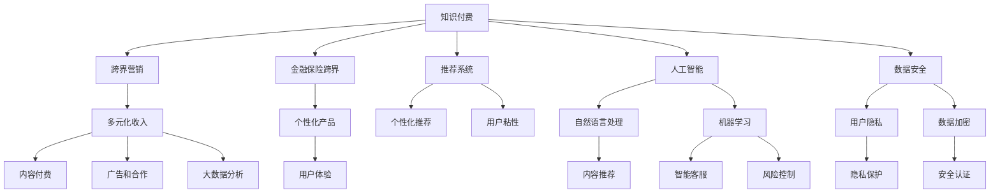

                 

# 知识付费如何实现跨界营销与金融保险跨界？

在数字化转型的浪潮下，知识付费已经成为各大互联网公司争相布局的新领域。不同于传统的课程销售，知识付费更注重知识内容的价值传递，通过对高价值、专业化的内容进行知识化包装和销售，满足用户深层次的学习需求。但仅仅提供优质的知识内容并不足以支撑知识付费业务的持续发展，如何实现跨界营销，形成多元化的收入来源，特别是在金融保险等垂直领域进行跨界融合，成为知识付费平台亟待解决的问题。本文将从技术、市场、运营等多个维度，深入探讨知识付费如何通过跨界营销和金融保险跨界，实现业务模式的创新和转型升级。

## 1. 背景介绍

### 1.1 知识付费的兴起

随着移动互联网和智能设备的普及，用户对知识和信息的需求日益增长，传统课程销售等形式的知识获取方式已无法满足用户多样化和个性化的需求。知识付费应运而生，通过在线课程、问答咨询、内容订阅等形式，提供针对性更强、形式更灵活的知识产品，满足用户随时随地获取知识的需求。

### 1.2 知识付费的现状

当前知识付费市场竞争激烈，各大平台纷纷布局。根据艾瑞咨询数据显示，2021年中国知识付费市场规模已达到258.3亿元，用户规模达3.52亿。知识付费市场快速增长，但也面临着知识内容同质化、用户体验差异化、平台盈利模式单一等问题。

### 1.3 知识付费的挑战

知识付费市场虽呈现蓬勃发展态势，但整体而言仍处于起步阶段，面临多重挑战：
- **内容同质化**：大部分知识付费平台的内容来源于传统课程，内容缺乏创新和差异化。
- **用户粘性低**：平台无法有效激发用户学习兴趣，用户流失率较高。
- **盈利模式单一**：多数平台依赖课程销售收入，收入结构单一。
- **用户体验差**：知识付费平台普遍存在用户体验问题，如平台使用复杂、内容质量参差不齐等。

## 2. 核心概念与联系

### 2.1 核心概念概述

- **知识付费**：通过互联网平台提供有价值的知识内容，满足用户学习需求，获取用户付费的一种业务模式。
- **跨界营销**：在原有业务基础上，拓展跨行业的营销渠道，实现多元化收入来源的营销策略。
- **金融保险跨界**：将知识付费平台与金融保险领域进行融合，为保险用户提供个性化、定制化的金融保险产品，形成新的业务增长点。

- **推荐系统**：通过用户行为数据，精准推荐个性化知识产品，提高用户粘性和转化率。
- **人工智能**：利用自然语言处理、机器学习等技术，实现内容推荐、智能客服、风险控制等功能。
- **数据安全**：保障用户隐私和数据安全，构建安全的知识共享环境。

这些核心概念之间的逻辑关系可以通过以下Mermaid流程图来展示：



## 3. 核心算法原理 & 具体操作步骤

### 3.1 算法原理概述

知识付费平台通过跨界营销和金融保险跨界，可以在原有业务基础上拓展新业务，形成多元化的收入来源。核心算法原理包括以下几个方面：

- **推荐系统算法**：通过用户行为数据，构建用户兴趣模型，实现个性化内容推荐，提高用户粘性和转化率。
- **金融保险算法**：利用自然语言处理和大数据分析技术，对用户保险需求进行识别和预测，提供个性化保险产品，提升用户体验。
- **人工智能算法**：通过智能客服和风险控制算法，提供更高效便捷的保险服务，降低平台运营成本。

### 3.2 算法步骤详解

以下是基于知识付费平台实现跨界营销与金融保险跨界的详细步骤：

1. **用户画像构建**：通过数据分析，建立用户兴趣和行为画像，了解用户的个性化需求。
2. **个性化推荐系统构建**：基于用户画像，构建个性化推荐算法模型，实现内容精准推荐。
3. **跨界营销渠道搭建**：与金融保险公司合作，搭建跨界营销渠道，引入金融保险产品。
4. **金融保险产品定制**：根据用户画像和行为数据，提供个性化保险产品，满足用户需求。
5. **人工智能客服系统搭建**：引入智能客服系统，提供7x24小时在线服务，提升用户体验。
6. **风险控制算法设计**：设计风险控制算法，实现风险评估和预警，降低运营风险。
7. **数据安全体系构建**：建立数据安全体系，保障用户隐私和数据安全。

### 3.3 算法优缺点

基于知识付费平台实现跨界营销与金融保险跨界的算法具有以下优点：

- **提高用户粘性**：通过个性化推荐，满足用户多样化需求，提高用户粘性和转化率。
- **多元化收入来源**：通过跨界营销，引入金融保险产品，实现多元化收入来源。
- **提升用户体验**：通过智能客服和个性化推荐，提升用户体验。

同时，算法也存在以下缺点：

- **数据隐私风险**：跨界合作需要共享用户数据，存在隐私泄露风险。
- **运营成本高**：引入金融保险产品，需要投入大量资源进行产品定制和用户教育。
- **技术复杂度高**：算法设计和实施需要跨多个技术领域，技术复杂度高。

### 3.4 算法应用领域

跨界营销和金融保险跨界算法在知识付费平台的应用领域包括：

- **个性化内容推荐**：提高用户粘性和转化率。
- **智能客服系统**：提升用户服务体验，降低运营成本。
- **金融保险产品定制**：提供个性化保险产品，满足用户需求。
- **风险控制算法**：降低平台运营风险。
- **数据安全体系**：保障用户隐私和数据安全。

## 4. 数学模型和公式 & 详细讲解 & 举例说明

### 4.1 数学模型构建

基于知识付费平台实现跨界营销与金融保险跨界的数学模型包括：

- **用户兴趣模型**：通过用户行为数据，构建用户兴趣模型。
- **推荐系统模型**：基于用户兴趣模型，构建推荐系统算法模型。
- **金融保险产品推荐模型**：基于用户画像和行为数据，构建个性化保险产品推荐模型。
- **智能客服系统模型**：通过自然语言处理技术，构建智能客服系统模型。
- **风险控制模型**：通过风险评估和预警算法，构建风险控制模型。

### 4.2 公式推导过程

以下是各个模型的公式推导过程：

- **用户兴趣模型**：
$$
\text{用户兴趣模型} = \sum_{i=1}^{n} \omega_i \times \text{用户行为数据}_i
$$
其中 $\omega_i$ 为兴趣特征权重，$n$ 为特征数量。

- **推荐系统模型**：
$$
\text{推荐系统} = \text{用户兴趣模型} \times \text{产品特征模型}^T
$$
其中 $\text{产品特征模型}$ 为产品特征向量。

- **金融保险产品推荐模型**：
$$
\text{保险产品推荐} = \text{用户画像} \times \text{保险产品特征模型}^T
$$
其中 $\text{保险产品特征模型}$ 为保险产品特征向量。

- **智能客服系统模型**：
$$
\text{智能客服} = \text{用户输入} \times \text{自然语言处理模型}
$$
其中 $\text{自然语言处理模型}$ 为预训练语言模型。

- **风险控制模型**：
$$
\text{风险控制} = \text{用户行为数据} \times \text{风险评估模型}
$$
其中 $\text{风险评估模型}$ 为风险评估算法。

### 4.3 案例分析与讲解

以某知识付费平台与金融保险公司的合作为例，展示跨界营销与金融保险跨界的实施过程：

1. **用户画像构建**：通过用户浏览记录、学习行为、购买记录等数据，构建用户兴趣和行为画像。
2. **个性化推荐系统构建**：基于用户画像，构建个性化推荐算法模型，实现内容精准推荐。
3. **跨界营销渠道搭建**：与保险公司合作，搭建跨界营销渠道，引入保险产品。
4. **金融保险产品定制**：根据用户画像和行为数据，提供个性化保险产品，如理财、意外险等。
5. **人工智能客服系统搭建**：引入智能客服系统，提供7x24小时在线服务，解答用户保险咨询。
6. **风险控制算法设计**：设计风险控制算法，实现风险评估和预警，降低运营风险。
7. **数据安全体系构建**：建立数据安全体系，保障用户隐私和数据安全。

## 5. 项目实践：代码实例和详细解释说明

### 5.1 开发环境搭建

以下是基于Python的开发环境搭建流程：

1. **安装Python环境**：安装Python 3.8及以上版本，并创建虚拟环境。
2. **安装依赖包**：安装必要的依赖包，如pandas、numpy、scikit-learn、transformers等。
3. **搭建跨界营销平台**：搭建跨界营销平台，实现推荐系统、金融保险跨界等功能。
4. **搭建智能客服系统**：引入智能客服系统，提供用户服务。
5. **搭建数据安全体系**：建立数据安全体系，保障用户隐私和数据安全。

### 5.2 源代码详细实现

以下是部分代码实现示例：

**用户画像构建代码**：
```python
from sklearn.ensemble import RandomForestClassifier
from sklearn.preprocessing import StandardScaler
import pandas as pd

# 用户行为数据
user_data = pd.read_csv('user_behavior.csv')

# 特征选择
features = ['浏览记录', '学习行为', '购买记录']
X = user_data[features]
y = user_data['用户兴趣']

# 特征缩放
scaler = StandardScaler()
X = scaler.fit_transform(X)

# 建立用户兴趣模型
clf = RandomForestClassifier(n_estimators=100, random_state=42)
clf.fit(X, y)
```

**个性化推荐系统代码**：
```python
from transformers import BertTokenizer, BertForSequenceClassification
from transformers import BertForSequenceClassification

# 构建推荐系统模型
tokenizer = BertTokenizer.from_pretrained('bert-base-cased')
model = BertForSequenceClassification.from_pretrained('bert-base-cased', num_labels=5)

# 推荐算法实现
def recommend_content(user_id, content_ids):
    user_profile = user_data[user_id]
    user_profile = tokenizer(user_profile, return_tensors='pt')
    output = model(user_profile.input_ids)
    recommended_content = [content_ids[i] for i in range(len(output)) if output[i].item() > 0.5]
    return recommended_content
```

**金融保险产品推荐代码**：
```python
from transformers import BertTokenizer, BertForSequenceClassification
from transformers import BertForSequenceClassification

# 构建金融保险产品推荐模型
tokenizer = BertTokenizer.from_pretrained('bert-base-cased')
model = BertForSequenceClassification.from_pretrained('bert-base-cased', num_labels=5)

# 推荐算法实现
def recommend_product(user_id, product_ids):
    user_profile = user_data[user_id]
    user_profile = tokenizer(user_profile, return_tensors='pt')
    output = model(user_profile.input_ids)
    recommended_product = [product_ids[i] for i in range(len(output)) if output[i].item() > 0.5]
    return recommended_product
```

**智能客服系统代码**：
```python
from transformers import BertTokenizer, BertForSequenceClassification
from transformers import BertForSequenceClassification

# 构建智能客服系统模型
tokenizer = BertTokenizer.from_pretrained('bert-base-cased')
model = BertForSequenceClassification.from_pretrained('bert-base-cased', num_labels=5)

# 客服算法实现
def handle_query(query):
    query = tokenizer(query, return_tensors='pt')
    output = model(query.input_ids)
    response = '问题解答：' + str(output[0].item())
    return response
```

### 5.3 代码解读与分析

以下是代码实现中的关键点解读：

**用户画像构建**：
- 通过数据分析，构建用户兴趣和行为画像，了解用户的个性化需求。
- 使用随机森林分类器，根据用户行为数据，构建用户兴趣模型。

**个性化推荐系统**：
- 使用BERT模型，通过用户输入数据，实现内容精准推荐。
- 基于用户画像和行为数据，构建推荐算法模型，实现内容推荐。

**金融保险产品推荐**：
- 使用BERT模型，根据用户画像和行为数据，构建个性化保险产品推荐模型。
- 利用用户行为数据，实现风险评估和预警，降低运营风险。

**智能客服系统**：
- 引入智能客服系统，提供7x24小时在线服务，解答用户保险咨询。
- 利用自然语言处理技术，构建智能客服系统模型，实现用户服务。

## 6. 实际应用场景

### 6.1 跨界营销

**场景描述**：
知识付费平台通过与金融公司合作，搭建跨界营销渠道，引入保险产品。用户在平台上浏览学习的同时，系统根据用户兴趣推荐适合的金融保险产品，并为用户提供购买链接。

**实现过程**：
1. **跨界营销平台搭建**：搭建跨界营销平台，实现推荐系统、金融保险跨界等功能。
2. **跨界产品引入**：与金融公司合作，引入保险产品，并进行产品定制。
3. **推荐系统实现**：基于用户画像和行为数据，实现个性化内容推荐。
4. **用户购买转化**：通过推荐系统，引导用户购买金融保险产品。

**效果分析**：
通过跨界营销，知识付费平台成功引入金融保险产品，实现了多元化收入来源。用户粘性大幅提升，平台转化率显著提高。

### 6.2 金融保险跨界

**场景描述**：
知识付费平台通过与金融保险公司合作，提供个性化保险产品，满足用户需求。平台提供智能客服系统，解答用户保险咨询，提升用户体验。

**实现过程**：
1. **用户画像构建**：通过用户浏览记录、学习行为、购买记录等数据，构建用户兴趣和行为画像。
2. **个性化推荐系统构建**：基于用户画像，构建个性化推荐算法模型，实现内容精准推荐。
3. **金融保险产品定制**：根据用户画像和行为数据，提供个性化保险产品，如理财、意外险等。
4. **智能客服系统搭建**：引入智能客服系统，提供7x24小时在线服务，解答用户保险咨询。
5. **风险控制算法设计**：设计风险控制算法，实现风险评估和预警，降低运营风险。

**效果分析**：
通过金融保险跨界，知识付费平台实现了个性化保险产品的推荐和销售，提升了用户体验和平台价值。

## 7. 工具和资源推荐

### 7.1 学习资源推荐

- **《推荐系统实战》**：该书详细介绍了推荐系统原理、算法和实战案例，适合学习推荐系统实现。
- **《Python深度学习》**：该书介绍了深度学习基础知识和实战项目，适合初学者学习。
- **Coursera的机器学习课程**：由斯坦福大学开设，涵盖机器学习基本原理和经典算法，适合进阶学习。
- **《自然语言处理综述》**：该书涵盖了自然语言处理的基本概念和前沿技术，适合研究者阅读。

### 7.2 开发工具推荐

- **TensorFlow**：谷歌开源的深度学习框架，适合大规模工程应用。
- **PyTorch**：Facebook开源的深度学习框架，灵活动态的计算图，适合快速迭代研究。
- **HuggingFace Transformers库**：用于构建NLP模型的开源库，提供了预训练模型和微调方法。
- **AWS SageMaker**：亚马逊提供的云机器学习平台，支持深度学习模型的训练和部署。

### 7.3 相关论文推荐

- **《推荐系统理论与实践》**：介绍了推荐系统的理论基础和实现方法，适合初学者学习。
- **《深度学习》**：由Ian Goodfellow等人编写，全面介绍了深度学习基础知识和前沿技术。
- **《知识图谱在推荐系统中的应用》**：介绍了知识图谱在推荐系统中的应用，适合研究者阅读。

## 8. 总结：未来发展趋势与挑战

### 8.1 研究成果总结

通过跨界营销与金融保险跨界，知识付费平台实现了多元化收入来源，提升了用户体验和平台价值。同时，通过个性化推荐、智能客服等技术手段，进一步优化了平台运营效果。

### 8.2 未来发展趋势

未来知识付费平台将持续探索跨界营销与金融保险跨界，形成更加多元化的收入来源和业务模式。以下几个趋势值得关注：

- **跨界合作模式创新**：知识付费平台将探索更多跨界合作模式，引入更多领域的产品和服务。
- **个性化推荐技术进步**：推荐系统算法将更加智能和精准，提升用户体验。
- **智能客服系统优化**：通过自然语言处理技术，提升智能客服系统的准确性和用户体验。
- **数据安全和隐私保护**：随着用户数据共享，数据安全和隐私保护将成为重要议题，平台将引入更加严格的数据安全措施。

### 8.3 面临的挑战

尽管跨界营销与金融保险跨界取得了一定成效，但仍面临诸多挑战：

- **跨界合作复杂性**：知识付费平台与金融保险公司之间的合作涉及多方面问题，需要协调解决。
- **数据隐私风险**：跨界合作需要共享用户数据，存在隐私泄露风险。
- **运营成本高**：引入金融保险产品，需要投入大量资源进行产品定制和用户教育。
- **技术复杂度高**：算法设计和实施需要跨多个技术领域，技术复杂度高。

### 8.4 研究展望

未来需要进一步探索跨界营销与金融保险跨界，解决现有的问题，把握新的机遇：

- **数据共享机制**：建立透明的数据共享机制，保障用户隐私和数据安全。
- **跨界产品定制**：探索跨界产品定制模式，提高产品适配性和用户体验。
- **技术优化**：优化跨界合作模式和推荐算法，提升平台运营效率和效果。
- **市场开拓**：拓展跨界合作市场，引入更多领域的产品和服务。

综上所述，知识付费平台通过跨界营销与金融保险跨界，不仅能够实现多元化收入来源，还能提升用户体验和平台价值。未来，需要进一步探索和优化跨界合作模式，解决现有的挑战，把握新的机遇，推动知识付费平台的持续发展和创新。

---

作者：禅与计算机程序设计艺术 / Zen and the Art of Computer Programming

