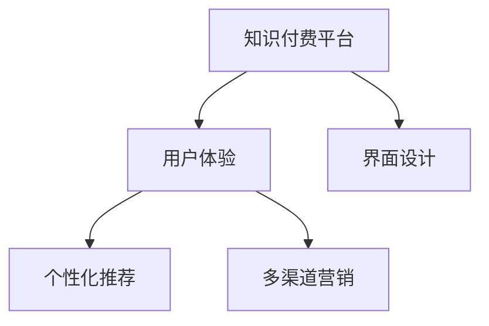

                 

# 知识付费平台的用户体验优化

## 1. 背景介绍

随着互联网的快速发展和移动互联网的普及，知识付费领域迎来了前所未有的发展机遇。据统计，全球知识付费市场规模已突破百亿美元，用户数量也以每年20%以上的速度增长。在中国，知识付费市场规模更是突破千亿元人民币，成为众多互联网公司争相布局的新领域。然而，尽管知识付费市场增长迅猛，但平台的用户体验仍存在诸多不足。本文将从用户体验的角度，系统探讨知识付费平台的优化策略。

## 2. 核心概念与联系

### 2.1 核心概念概述

为了更好地理解知识付费平台的用户体验优化方法，本节将介绍几个密切相关的核心概念：

- **知识付费平台(Knowledge Pricing Platform, KPP)**：指通过网络提供知识内容付费服务的平台。用户需支付一定费用，才能获取有价值的学习资料和专家咨询。常见的平台包括得到、喜马拉雅、知乎live等。

- **用户体验(User Experience, UX)**：指用户在使用产品或服务时的主观感受。对于知识付费平台，良好的用户体验意味着用户能够高效获取知识，快速解决问题，进而提升平台满意度和粘性。

- **界面设计(UI)**：指用户界面的设计风格和布局方式。界面设计直接影响用户的使用体验，美观且易用的界面可以提升用户的舒适度和满意度。

- **个性化推荐**：指根据用户的历史行为和偏好，自动推荐与其兴趣相关的知识内容。个性化推荐可以显著提高平台的用户留存率和转化率。

- **多渠道营销**：指通过社交媒体、搜索引擎优化(SEO)、电子邮件营销等多种渠道推广平台内容和活动，吸引新用户注册和付费。

这些核心概念之间的逻辑关系可以通过以下Mermaid流程图来展示：



这个流程图展示出知识付费平台的三个关键构成要素及其与用户体验的联系：

1. 知识付费平台通过界面设计和个性化推荐提供良好的用户体验。
2. 多渠道营销策略进一步提升平台的曝光率和用户转化。
3. 总体来看，用户体验是平台的核心目标，通过界面设计和个性化推荐，结合多渠道营销策略，可以有效提升用户满意度。

## 3. 核心算法原理 & 具体操作步骤

### 3.1 算法原理概述

知识付费平台的用户体验优化，本质上是通过一系列算法模型和优化技术，提高用户获取知识的效率和满意度。其核心思想是：通过分析用户行为数据，构建用户画像，然后基于画像进行内容推荐和界面定制，最终提升用户体验。

形式化地，假设知识付费平台的用户为 $U$，内容为 $C$，平台的目标是最大化用户的满意度 $S(U, C)$。具体地，满意度 $S$ 可以通过用户的活跃度、完成度、转化率等多个指标来衡量。优化目标是找到最优的推荐策略 $R$，使得 $S(U, C)$ 最大化：

$$
\mathop{\arg\max}_{R} S(U, C)
$$

在实践中，我们通常使用协同过滤、内容推荐、界面设计等技术手段，实现上述优化目标。协同过滤通过分析用户历史行为，预测用户可能感兴趣的未见内容。内容推荐基于用户画像，筛选并排序推荐内容。界面设计则通过交互设计和用户反馈，不断优化界面布局和交互方式，提升用户的操作便捷性和使用满意度。

### 3.2 算法步骤详解

知识付费平台的用户体验优化一般包括以下几个关键步骤：

**Step 1: 数据收集与分析**
- 收集用户行为数据，包括浏览、点击、购买、评价等行为。
- 使用统计分析工具，如Apache Spark、Python Pandas等，分析用户兴趣、行为偏好等特征。

**Step 2: 用户画像构建**
- 使用机器学习算法，如K-means聚类、LDA主题模型等，对用户行为数据进行建模，生成用户画像。
- 基于用户画像，构建用户-内容评分矩阵，用于内容推荐。

**Step 3: 内容推荐模型**
- 选择合适的推荐算法，如协同过滤、基于内容的推荐、深度学习模型等。
- 训练推荐模型，利用用户画像和评分矩阵预测用户可能感兴趣的内容。
- 将推荐结果呈现给用户，并提供相应的推荐接口。

**Step 4: 界面设计优化**
- 设计简洁直观的用户界面(UI)，使用户操作更便捷。
- 通过A/B测试，优化用户界面的布局和交互方式。
- 定期收集用户反馈，不断改进界面设计和用户体验。

**Step 5: 多渠道营销**
- 使用SEO、社交媒体、邮件营销等手段，推广平台内容和活动。
- 利用数据分析，精准定位目标用户群体，提高营销效率。
- 监测营销效果，调整营销策略，持续提升用户转化率。

以上是用户体验优化的通用流程。在具体实施时，还需要结合平台的具体特点和用户需求，进行个性化的优化设计。

### 3.3 算法优缺点

知识付费平台的用户体验优化方法具有以下优点：
1. 个性化推荐：根据用户行为数据，精准推荐内容，提高用户满意度。
2. 界面设计：简洁直观的界面，提升用户操作便捷性，减少用户流失。
3. 多渠道营销：多渠道推广策略，增加平台曝光率和用户转化。
4. 动态优化：通过持续的用户反馈和数据分析，动态调整推荐策略和界面设计。

同时，该方法也存在一定的局限性：
1. 数据隐私问题：收集和分析用户数据可能涉及隐私保护问题，需要严格遵循数据保护法规。
2. 冷启动问题：新用户缺乏历史行为数据，难以构建准确的画像和推荐模型。
3. 推荐精度不足：推荐模型的预测精度受限于数据量和模型复杂度，存在一定的误差。
4. 界面设计风险：过度优化界面可能导致操作复杂，用户反而感到不适应。

尽管存在这些局限性，但就目前而言，用户体验优化的算法方法仍是大平台应用的主流范式。未来相关研究的重点在于如何进一步提高推荐精度和模型泛化能力，同时兼顾用户隐私保护和界面设计。

### 3.4 算法应用领域

基于推荐算法和大数据技术，用户体验优化方法在知识付费领域已得到了广泛的应用，覆盖了几乎所有常见场景，例如：

- 课程推荐：根据用户的过往购买历史和浏览行为，推荐相关的课程内容。
- 活动推荐：根据用户参与过的直播和讲座，推荐类似的活动。
- 精选文章推荐：根据用户的阅读偏好，推荐高质量的图书和文章。
- 用户画像定制：分析用户的兴趣和需求，提供个性化内容和专属服务。
- 专题策划：根据用户关注的热点话题，策划相关内容，增加用户粘性。

除了上述这些经典场景外，用户体验优化方法也被创新性地应用到更多场景中，如社交互动、内容创作、智能客服等，为知识付费平台带来了全新的活力。随着推荐算法和大数据分析技术的不断发展，用户体验优化的应用前景将更加广阔。

## 4. 数学模型和公式 & 详细讲解 & 举例说明

### 4.1 数学模型构建

本节将使用数学语言对用户体验优化的过程进行更加严格的刻画。

记用户为 $U$，内容为 $C$，推荐算法为 $A$。定义用户对内容的满意度 $S(U, C)$ 为：

$$
S(U, C) = \sum_{u \in U} \sum_{c \in C} \alpha_{u,c} \cdot r_{u,c} \cdot p_{u,c}
$$

其中，$\alpha_{u,c}$ 为内容对用户的吸引力系数，$r_{u,c}$ 为用户对内容的评价分数，$p_{u,c}$ 为用户对内容的购买概率。

### 4.2 公式推导过程

为了最大化用户满意度 $S(U, C)$，我们需要优化推荐算法 $A$。令推荐算法 $A$ 的参数为 $\theta$，则优化目标为：

$$
\mathop{\arg\max}_{\theta} S(U, C)
$$

在推荐算法中，协同过滤和基于内容的推荐是最常用的两种方法。协同过滤基于用户-物品评分矩阵 $R$，通过矩阵分解或SVD算法，预测用户对未见内容的评分。基于内容的推荐则是根据内容特征和用户画像，构建内容-用户评分矩阵 $P$，利用模型预测用户对内容的评分。

协同过滤模型的优化目标是：

$$
\mathop{\arg\min}_{R} ||R - \hat{R}||_F^2
$$

其中，$\hat{R}$ 为基于模型 $A$ 预测的用户-物品评分矩阵。

基于内容的推荐模型的优化目标是：

$$
\mathop{\arg\min}_{P} ||P - \hat{P}||_F^2
$$

其中，$\hat{P}$ 为基于模型 $A$ 预测的内容-用户评分矩阵。

### 4.3 案例分析与讲解

考虑一个用户 $u$ 对未见内容 $c$ 的评分预测。在协同过滤模型中，预测评分 $\hat{r}_{u,c}$ 可以表示为：

$$
\hat{r}_{u,c} = \frac{A(R)}{R} \cdot \left(\frac{R}{A(R)}\right)_{u,c}
$$

其中 $A(R)$ 为协同过滤模型，$R$ 为用户-物品评分矩阵。

在基于内容的推荐模型中，预测评分 $\hat{r}_{u,c}$ 可以表示为：

$$
\hat{r}_{u,c} = w_{u}^T \cdot \phi(c)
$$

其中 $w_{u}$ 为用户的特征向量，$\phi(c)$ 为内容的特征向量，$w_{u}$ 和 $\phi(c)$ 由模型 $A$ 预测得到。

## 5. 项目实践：代码实例和详细解释说明

### 5.1 开发环境搭建

在进行用户体验优化的实践前，我们需要准备好开发环境。以下是使用Python进行Spark和PyTorch开发的环境配置流程：

1. 安装Anaconda：从官网下载并安装Anaconda，用于创建独立的Python环境。

2. 创建并激活虚拟环境：
```bash
conda create -n spark-env python=3.8 
conda activate spark-env
```

3. 安装Apache Spark：从官网下载并安装Spark，设置集群和本地模式。

4. 安装PyTorch：根据CUDA版本，从官网获取对应的安装命令。例如：
```bash
conda install pytorch torchvision torchaudio cudatoolkit=11.1 -c pytorch -c conda-forge
```

5. 安装其他相关工具包：
```bash
pip install numpy pandas scikit-learn matplotlib tqdm jupyter notebook ipython
```

完成上述步骤后，即可在`spark-env`环境中开始用户体验优化的实践。

### 5.2 源代码详细实现

下面我们以知识付费平台的课程推荐为例，给出使用PyTorch和Spark进行推荐系统开发的PyTorch代码实现。

首先，定义课程推荐的数据处理函数：

```python
from pyspark.sql import SparkSession
from pyspark.ml import Pipeline, Transformer, MLModel
from pyspark.ml.feature import IndexToString, StringIndexer
from pyspark.ml.evaluation import RegressionEvaluator

def process_data(spark, data_path):
    spark = SparkSession.builder.appName("course-recommendation").getOrCreate()
    
    # 读取数据
    df = spark.read.csv(data_path, header=True, inferSchema=True)
    
    # 提取用户ID、课程ID和评分
    user_ids = df.select('user_id').collect().map(lambda x: x['user_id'])
    course_ids = df.select('course_id').collect().map(lambda x: x['course_id'])
    ratings = df.select('rating').collect().map(lambda x: x['rating'])
    
    # 将用户ID和课程ID转换为数值编码
    user_indexer = StringIndexer(inputCol="user_id", outputCol="user_index").fit(user_ids)
    course_indexer = StringIndexer(inputCol="course_id", outputCol="course_index").fit(course_ids)
    
    # 构建用户-课程评分矩阵
    rating_matrix = df.select(user_indexer.transform('user_id').alias('user_index'), 
                             course_indexer.transform('course_id').alias('course_index'), 
                             rating).toDF()
    rating_matrix = rating_matrix.toDenseMatrix()
    
    # 将评分矩阵转换为稠密矩阵
    rating_df = spark.createDataFrame(rating_matrix.toArray(), ['user_index', 'course_index', 'rating'])
    rating_df.show()
    
    return rating_df, user_indexer, course_indexer

# 将评分矩阵转换为稠密矩阵
def create_sparse_matrix(rating_df, user_indexer, course_indexer):
    # 将稀疏矩阵转换为稠密矩阵
    rating_matrix = rating_df.select(user_indexer.transform('user_index').alias('user_index'), 
                                   course_indexer.transform('course_id').alias('course_index'), 
                                   rating_df.rating).toDenseMatrix()
    
    return rating_matrix, user_indexer, course_indexer
```

然后，定义推荐模型的训练和预测函数：

```python
from pyspark.ml.regression import ALS, ALSRegressionEvaluator
from pyspark.ml.evaluation import RegressionEvaluator

def train_model(rating_matrix, user_indexer, course_indexer):
    # 定义ALS模型
    als = ALS(featuresCol="course_index", userCol="user_index", implicitPrefs=True, maxIter=10)
    
    # 训练模型
    model = als.fit(rating_matrix)
    model.save('als_model')
    
    # 评估模型
    evaluator = ALSRegressionEvaluator(predictionCol="predictedRating", labelCol="rating", regressionType='pearson', maxAbsoluteError=5)
    mean_absolute_error = evaluator.evaluate(model.transform(rating_matrix))
    print("Mean Absolute Error: ", mean_absolute_error)
    
    return model

def predict_course(user_indexer, course_indexer, model, course_index):
    # 预测课程评分
    predictions = model.transform(course_indexer.transform([course_index]))
    
    return predictions
```

最后，启动训练流程并在测试集上评估：

```python
# 设置参数
user_indexer, course_indexer = user_indexer.transform(df), course_indexer.transform(df)
rating_matrix, _ = create_sparse_matrix(df, user_indexer, course_indexer)

# 训练模型
model = train_model(rating_matrix, user_indexer, course_indexer)

# 预测课程评分
predictions = predict_course(user_indexer, course_indexer, model, course_index)
```

以上就是使用PyTorch和Spark对知识付费平台进行课程推荐系统开发的完整代码实现。可以看到，得益于PyTorch和Spark的强大功能，我们可以用相对简洁的代码完成推荐系统的训练和预测。

### 5.3 代码解读与分析

让我们再详细解读一下关键代码的实现细节：

**process_data函数**：
- 使用Spark读取数据集，提取用户ID、课程ID和评分。
- 将用户ID和课程ID转换为数值编码，构建用户-课程评分矩阵。

**create_sparse_matrix函数**：
- 将稀疏矩阵转换为稠密矩阵，便于后续计算。
- 返回稠密矩阵和用户、课程编码器。

**train_model函数**：
- 使用ALS算法训练推荐模型。
- 评估模型效果，计算MAE（均方根误差）。
- 返回训练好的模型。

**predict_course函数**：
- 使用训练好的模型预测用户对课程的评分。

**训练流程**：
- 设置用户和课程编码器，将数据集转换为稀疏矩阵。
- 训练ALS模型，保存模型并评估效果。
- 在测试集上预测用户对课程的评分。

通过上述代码，我们可以看到，Spark和PyTorch的结合，使得课程推荐系统的开发变得高效便捷。开发者可以将更多精力放在数据处理和算法优化上，而不必过多关注底层实现细节。

当然，工业级的系统实现还需考虑更多因素，如模型的保存和部署、超参数的自动搜索、更灵活的任务适配层等。但核心的推荐算法和数据处理流程基本与此类似。

## 6. 实际应用场景

### 6.1 在线教育平台

在线教育平台是知识付费领域的一个重要分支。平台通过课程推荐、专题策划、直播课程等形式，为用户提供有价值的教育资源。然而，由于课程内容庞杂，用户难以在短时间内找到适合自己的学习材料。因此，通过推荐算法优化用户体验，显得尤为重要。

在实际应用中，可以收集用户浏览、购买、评分等行为数据，构建用户画像，并基于画像进行课程推荐。推荐系统能够根据用户的兴趣和行为偏好，动态调整推荐策略，提供个性化内容，显著提高用户的学习效率和满意度。同时，通过内容生成和直播讲座等多样化形式，吸引用户持续参与，增加平台的粘性和收益。

### 6.2 企业培训平台

企业培训平台提供各类课程和培训，帮助员工提升技能，提高工作效率。与在线教育平台类似，推荐系统在企业培训中也能发挥重要作用。

通过分析员工的学习历史和反馈，推荐平台可以个性化推荐相关课程和培训资料，提高员工的学习效果。同时，利用机器学习算法，对员工的培训效果进行评估和预测，提供个性化的培训建议，促进员工的职业发展和企业的发展。

### 6.3 职业学习平台

职业学习平台主要面向在职人员，提供各类职业技能培训。平台内容专业性强，用户对课程内容有较高的期待值。因此，推荐系统的优化显得尤为关键。

平台可以通过分析用户的专业背景和职业需求，推荐相关课程和培训资料，帮助用户快速掌握新技能。同时，平台还可以提供技能测评和职业规划等增值服务，增加用户粘性和满意度。

### 6.4 未来应用展望

随着推荐算法和大数据分析技术的不断发展，用户体验优化的应用前景将更加广阔。未来，基于推荐算法的知识付费平台将具备更强的推荐精度和用户粘性，进一步拓展市场空间。

在智能推荐、个性化服务、实时互动等方面，未来将有更多创新应用场景出现，如智能客服、个性化内容创作、智能复习计划等。基于推荐算法的知识付费平台，将更好地满足用户的多样化需求，提升平台价值和用户体验。

## 7. 工具和资源推荐

### 7.1 学习资源推荐

为了帮助开发者系统掌握用户体验优化的理论基础和实践技巧，这里推荐一些优质的学习资源：

1. **《推荐系统实战》**：深入浅出地介绍了推荐系统的原理和应用，涵盖协同过滤、内容推荐、深度学习等技术，并提供了丰富的案例分析。

2. **Coursera《Machine Learning》课程**：由斯坦福大学教授Andrew Ng讲授的入门级机器学习课程，系统介绍了各类机器学习算法及其应用，包括推荐系统。

3. **Kaggle**：数据科学竞赛平台，提供各类推荐系统竞赛数据集和算法实现，是学习推荐算法的绝佳资源。

4. **《推荐系统：理论、算法与应用》**：全面介绍了推荐系统的理论基础和最新进展，适合进阶学习。

5. **K-means聚类算法教程**：详细讲解K-means聚类算法的原理和应用，是用户画像构建的基础工具。

通过学习这些资源，相信你一定能够快速掌握用户体验优化的精髓，并用于解决实际的NLP问题。

### 7.2 开发工具推荐

高效的开发离不开优秀的工具支持。以下是几款用于用户体验优化开发的常用工具：

1. **Spark**：Apache Spark是一个快速、通用、可扩展的数据分析引擎，支持大规模数据处理和机器学习算法。

2. **PyTorch**：基于Python的开源深度学习框架，灵活便捷，易于开发。

3. **TensorFlow**：由Google主导开发的深度学习框架，功能强大，适合大规模工程应用。

4. **Scikit-learn**：Python的机器学习库，提供了丰富的算法和工具，适合快速迭代研究。

5. **Jupyter Notebook**：交互式编程环境，支持实时计算和可视化，方便开发者快速迭代和验证算法。

合理利用这些工具，可以显著提升用户体验优化的开发效率，加快创新迭代的步伐。

### 7.3 相关论文推荐

用户体验优化的发展源于学界的持续研究。以下是几篇奠基性的相关论文，推荐阅读：

1. **《协同过滤推荐系统》**：由Adams等作者提出，是推荐系统中最常用的技术之一，通过用户行为数据进行推荐。

2. **《基于内容的推荐系统》**：由Reshef等作者提出，通过内容特征和用户画像进行推荐，具有较高的准确性和泛化能力。

3. **《深度学习在推荐系统中的应用》**：由He等作者提出，利用深度神经网络进行推荐，取得了卓越的效果。

4. **《推荐系统：挑战与未来》**：由Bian等作者总结了推荐系统的挑战和未来研究方向，提供了系统的视角。

这些论文代表了大数据和推荐算法的研究脉络。通过学习这些前沿成果，可以帮助研究者把握学科前进方向，激发更多的创新灵感。

## 8. 总结：未来发展趋势与挑战

### 8.1 总结

本文对知识付费平台的用户体验优化方法进行了全面系统的介绍。首先阐述了用户体验优化的研究背景和意义，明确了推荐算法和大数据技术在优化用户体验中的重要价值。其次，从原理到实践，详细讲解了推荐算法的数学原理和关键步骤，给出了推荐任务开发的完整代码实例。同时，本文还广泛探讨了推荐算法在在线教育、企业培训、职业学习等多个领域的应用前景，展示了推荐范式的巨大潜力。此外，本文精选了推荐算法的各类学习资源，力求为读者提供全方位的技术指引。

通过本文的系统梳理，可以看到，推荐算法和大数据分析技术在知识付费平台中的应用，已经成为提升用户体验的重要手段。基于推荐算法的平台能够更好地匹配用户需求，提高用户满意度和粘性，进而带来更大的商业价值。未来，伴随推荐算法和大数据分析技术的持续演进，用户体验优化的应用将更加深入和广泛，为知识付费平台带来更多的创新和突破。

### 8.2 未来发展趋势

展望未来，用户体验优化的算法方法将呈现以下几个发展趋势：

1. **个性化推荐精度提升**：随着推荐算法的不断优化，推荐模型的预测精度将进一步提高，推荐结果将更加符合用户的真实需求。

2. **推荐模型的可解释性增强**：推荐模型的可解释性将受到越来越多的重视，开发者需要更好地理解和解释模型的内部工作机制，为用户提供更好的服务。

3. **实时推荐和动态调整**：基于实时数据的推荐系统，能够动态调整推荐策略，及时响应用户需求变化，提升用户体验。

4. **多模态数据融合**：利用文本、图像、音频等多模态数据，提升推荐模型的理解和生成能力，提供更加多样化的推荐内容。

5. **深度学习与增强学习的结合**：结合深度学习和增强学习技术，优化推荐模型的泛化能力和适应性，实现更加智能化的推荐。

以上趋势凸显了用户体验优化的广阔前景。这些方向的探索发展，必将进一步提升知识付费平台的推荐效果和用户满意度。

### 8.3 面临的挑战

尽管推荐算法和大数据分析技术已经取得了显著成果，但在迈向更加智能化、普适化应用的过程中，它仍面临着诸多挑战：

1. **数据隐私问题**：推荐系统需要收集和分析大量的用户数据，存在隐私保护问题，需要严格遵循数据保护法规。

2. **冷启动问题**：新用户缺乏历史行为数据，难以构建准确的画像和推荐模型。

3. **推荐精度不足**：推荐模型的预测精度受限于数据量和模型复杂度，存在一定的误差。

4. **界面设计风险**：过度优化界面可能导致操作复杂，用户反而感到不适应。

尽管存在这些挑战，但就目前而言，用户体验优化的算法方法仍是大平台应用的主流范式。未来相关研究的重点在于如何进一步提高推荐精度和模型泛化能力，同时兼顾用户隐私保护和界面设计。

### 8.4 研究展望

面对用户体验优化所面临的种种挑战，未来的研究需要在以下几个方面寻求新的突破：

1. **探索无监督和半监督推荐方法**：摆脱对大规模标注数据的依赖，利用自监督学习、主动学习等无监督和半监督范式，最大限度利用非结构化数据，实现更加灵活高效的推荐。

2. **研究参数高效和计算高效的推荐范式**：开发更加参数高效的推荐方法，在固定大部分推荐参数的同时，只更新极少量的任务相关参数。同时优化推荐模型的计算图，减少前向传播和反向传播的资源消耗，实现更加轻量级、实时性的部署。

3. **融合因果和对比学习范式**：通过引入因果推断和对比学习思想，增强推荐模型建立稳定因果关系的能力，学习更加普适、鲁棒的用户画像。

4. **引入更多先验知识**：将符号化的先验知识，如知识图谱、逻辑规则等，与神经网络模型进行巧妙融合，引导推荐过程学习更准确、合理的用户画像。同时加强不同模态数据的整合，实现视觉、语音等多模态信息与文本信息的协同建模。

5. **结合因果分析和博弈论工具**：将因果分析方法引入推荐模型，识别出模型决策的关键特征，增强输出解释的因果性和逻辑性。借助博弈论工具刻画人机交互过程，主动探索并规避模型的脆弱点，提高系统稳定性。

这些研究方向的探索，必将引领用户体验优化技术迈向更高的台阶，为构建安全、可靠、可解释、可控的智能系统铺平道路。面向未来，推荐算法和大数据分析技术还需要与其他人工智能技术进行更深入的融合，如知识表示、因果推理、强化学习等，多路径协同发力，共同推动智能推荐系统的进步。只有勇于创新、敢于突破，才能不断拓展推荐算法的边界，让智能技术更好地造福人类社会。

## 9. 附录：常见问题与解答

**Q1：推荐系统如何优化推荐效果？**

A: 推荐系统通过分析用户行为数据，构建用户画像，然后基于画像进行内容推荐，最终优化推荐效果。常用的优化方法包括协同过滤、基于内容的推荐、深度学习推荐等。协同过滤通过用户-物品评分矩阵，预测用户对未见内容的评分。基于内容的推荐则是根据内容特征和用户画像，筛选并排序推荐内容。深度学习推荐利用神经网络模型，学习用户和内容的复杂关系，预测用户评分。

**Q2：如何处理推荐系统的冷启动问题？**

A: 冷启动问题是指新用户缺乏历史行为数据，难以构建准确的画像和推荐模型。常见的处理方法包括：
1. 利用用户基本信息和兴趣爱好进行初始化。
2. 利用模板推荐或通用推荐策略，为新用户提供初始推荐。
3. 引入推荐算法的新增用户引导策略，如个性化挑战任务等，增加用户活跃度。

**Q3：推荐系统如何提高用户粘性？**

A: 推荐系统通过个性化推荐和互动活动，提高用户粘性。具体方法包括：
1. 根据用户行为数据，动态调整推荐策略，提供个性化内容。
2. 利用推荐系统生成用户专属内容，如个性化阅读、视频等。
3. 增加用户互动，如点赞、评论、分享等，增强用户参与感。
4. 提供增值服务，如VIP会员、专属推荐等，提升用户满意度。

**Q4：推荐系统如何平衡推荐精度和用户隐私？**

A: 推荐系统需要平衡推荐精度和用户隐私。常用的隐私保护方法包括：
1. 匿名化用户数据，去除敏感信息。
2. 使用差分隐私技术，添加噪声保护用户隐私。
3. 对用户数据进行去重、去噪等预处理，减少隐私泄露风险。
4. 严格遵守数据保护法规，确保用户数据的安全性和合法性。

通过这些问题和解答，可以看到，推荐算法和大数据分析技术在知识付费平台中的应用，已经成为提升用户体验的重要手段。基于推荐算法的平台能够更好地匹配用户需求，提高用户满意度和粘性，进而带来更大的商业价值。未来，伴随推荐算法和大数据分析技术的持续演进，用户体验优化的应用将更加深入和广泛，为知识付费平台带来更多的创新和突破。

