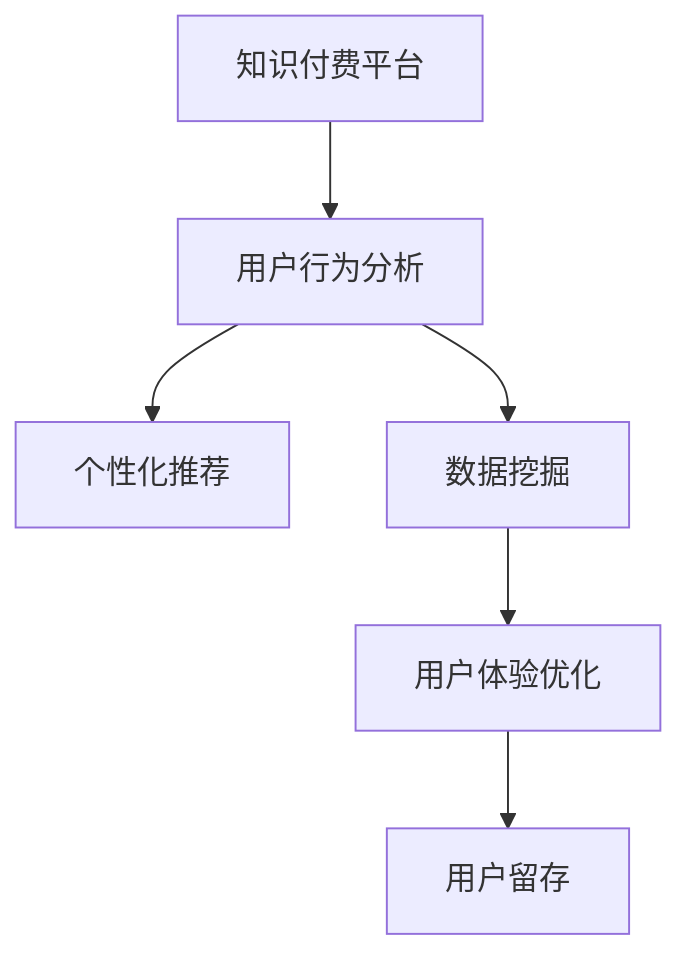

                 

# 知识付费平台的用户留存策略

> 关键词：知识付费,用户留存策略,用户行为分析,个性化推荐,数据挖掘,用户体验优化

## 1. 背景介绍

### 1.1 问题由来
随着互联网的飞速发展，知识付费平台凭借其独特的知识和教育属性，成为互联网行业中一个重要的细分领域。这类平台以内容为核心，通过订阅、单次付费或打赏等方式为用户提供高质量的在线课程、文章、音频、视频等资源。尽管目前市场竞争激烈，但也涌现出如得到、喜马拉雅、Coursera、Udemy等众多知名平台。然而，知识付费平台面临的最大挑战是如何留住用户，并持续提升用户活跃度和消费频次。

### 1.2 问题核心关键点
知识付费平台的用户留存，涉及到复杂的用户行为分析、个性化推荐、数据挖掘等多个维度，需要从平台内容、用户体验、运营策略等多个层面进行综合考虑。本文将从用户行为分析入手，探讨如何通过数据挖掘技术提升用户留存率，最终提出一套系统性的用户留存策略。

### 1.3 问题研究意义
用户留存率是知识付费平台的核心竞争力之一。一个平台如果无法留住用户，那么其内容和教育价值的发挥将大打折扣。因此，研究如何通过有效的用户留存策略提升平台的用户粘性和活跃度，对于知识付费行业的健康发展具有重要意义。具体而言，本文旨在：

1. 揭示用户流失的原因，通过数据分析找出常见问题。
2. 利用数据挖掘技术，实现个性化推荐和内容优化。
3. 结合用户行为分析，提出科学的用户留存策略。
4. 提供一套可行的实施框架，帮助知识付费平台提高用户留存率。

## 2. 核心概念与联系

### 2.1 核心概念概述

为更好地理解知识付费平台的用户留存策略，本节将介绍几个关键概念：

- 知识付费平台（Knowledge-based Subscription Platforms）：以提供高质量教育内容为主要目的的在线平台，如得到、喜马拉雅、Coursera等。
- 用户留存（User Retention）：指平台用户在使用过程中，继续使用并产生更多消费的概率。
- 个性化推荐（Personalized Recommendation）：通过分析用户行为和偏好，为其推荐可能感兴趣的内容，提升用户体验和粘性。
- 数据挖掘（Data Mining）：从大量数据中提取有用信息，揭示隐藏在数据中的关联和规律。
- 用户体验（User Experience）：平台设计和运营中，用户交互的质量和效率，是留存策略的核心。

这些核心概念之间的逻辑关系可以通过以下Mermaid流程图来展示：



这个流程图展示的知识付费平台用户留存的关键环节：

1. 平台收集用户行为数据。
2. 利用数据挖掘技术，分析用户行为模式和偏好。
3. 结合个性化推荐技术，向用户推荐个性化内容。
4. 优化用户体验，提升用户满意度和粘性。
5. 最终通过优化策略实现用户留存。

## 3. 核心算法原理 & 具体操作步骤
### 3.1 算法原理概述

知识付费平台用户留存策略的核心在于通过数据分析和推荐技术，提升用户满意度和粘性，从而实现用户留存。具体而言，可以归纳为以下几个核心步骤：

1. **数据收集与预处理**：收集用户在平台上的各种行为数据，如登录时间、观看时长、付费记录、评价反馈等，并进行数据清洗和特征提取。
2. **用户行为分析**：通过统计分析和机器学习模型，对用户行为进行深入分析，识别出流失用户的特征和模式。
3. **个性化推荐**：基于用户行为数据，构建个性化推荐模型，为用户推荐可能感兴趣的内容。
4. **用户体验优化**：通过A/B测试等方法，优化平台功能，提升用户体验和满意度。
5. **留存策略实施**：结合以上步骤的结果，制定系统性的用户留存策略。

### 3.2 算法步骤详解

#### 3.2.1 数据收集与预处理

1. **数据来源**：
   - 平台日志数据：包括用户登录、浏览、观看、购买等行为记录。
   - 用户反馈数据：用户评价、评分、评论、意见反馈等。
   - 外部数据：第三方数据、行业报告、市场调研等。

2. **数据清洗**：
   - 处理缺失值和异常值，确保数据完整性和准确性。
   - 去除重复和无用数据，减少噪音干扰。
   - 数据归一化处理，确保不同维度数据的可比较性。

3. **特征提取**：
   - 行为特征：如观看时长、付费金额、课程评分等。
   - 用户特征：如年龄、性别、地域、职业等。
   - 内容特征：如课程主题、难度等级、讲师声誉等。

#### 3.2.2 用户行为分析

1. **统计分析**：
   - 使用描述性统计方法，如均值、中位数、方差等，分析用户的基本行为特征。
   - 使用时间序列分析，揭示用户行为的季节性变化趋势。

2. **机器学习模型**：
   - 构建分类模型，如Logistic回归、随机森林、支持向量机等，预测用户流失概率。
   - 构建聚类模型，如K-Means、层次聚类等，识别用户群体特征。

#### 3.2.3 个性化推荐

1. **协同过滤**：
   - 基于用户历史行为记录，推荐用户可能感兴趣的内容。
   - 基于用户行为相似度，推荐类似用户喜欢的内容。

2. **内容推荐**：
   - 使用内容画像，将课程或文章与用户兴趣匹配。
   - 使用深度学习模型，如RNN、CNN、Transformer等，分析文本内容，进行个性化推荐。

#### 3.2.4 用户体验优化

1. **界面设计优化**：
   - 优化平台界面布局，提升用户体验。
   - 采用交互设计（UI/UX）最佳实践，确保界面友好性。

2. **功能增强**：
   - 添加新功能，如课程推荐、直播互动等。
   - 提升功能性能，如减少加载时间、优化视频清晰度等。

#### 3.2.5 留存策略实施

1. **活动激励**：
   - 推出限时优惠、折扣活动等，吸引用户付费。
   - 实施积分奖励、会员特权等，提升用户粘性。

2. **内容优化**：
   - 根据用户反馈，优化课程内容，提升教育质量。
   - 定期更新课程资源，增加新课程，吸引用户兴趣。

3. **用户关怀**：
   - 提供用户客服支持，及时解答用户疑问。
   - 推出社区功能，增强用户之间的交流与互动。

### 3.3 算法优缺点

知识付费平台用户留存策略的优势在于：

1. **提升用户满意度**：通过个性化推荐和内容优化，提升用户对平台的满意度，增强用户粘性。
2. **降低流失率**：通过用户行为分析和流失预测模型，及时干预用户流失行为，降低流失率。
3. **增加收入**：通过用户关怀和活动激励，提升用户付费率和付费频次，增加平台收入。

然而，该策略也存在一些缺点：

1. **数据依赖性高**：策略的成功依赖于高质量的数据收集和处理，数据质量不高将影响策略效果。
2. **算法复杂度高**：个性化推荐和用户行为分析涉及复杂算法，对技术要求较高。
3. **策略实施成本高**：用户关怀和内容优化等措施需要大量人力物力投入。
4. **策略灵活性不足**：在平台数据变化较大的情况下，策略需要不断调整，灵活性不足。

尽管存在这些局限，但就目前而言，基于数据驱动的用户留存策略仍是知识付费平台的重要手段。未来相关研究的重点在于如何进一步提升数据质量，优化算法模型，降低实施成本，同时兼顾策略的灵活性和可扩展性。

### 3.4 算法应用领域

知识付费平台用户留存策略已经在多个领域得到了应用，例如：

- 在线教育平台：如Coursera、Udemy等，通过用户行为分析，推荐相关课程，提升用户留存率。
- 在线音频平台：如喜马拉雅、荔枝FM等，通过个性化推荐，增加用户粘性。
- 在线阅读平台：如得到、微信阅读等，通过内容优化和用户互动，提升用户体验。
- 金融教育平台：如雪球、IMoney等，通过金融知识推荐，吸引和留住用户。
- 文化娱乐平台：如Bilibili、抖音等，通过个性化推荐和社区互动，增强用户粘性。

这些平台通过实施用户留存策略，取得了显著的成效，显著提升了用户满意度和平台收入。未来，随着数据挖掘技术和个性化推荐算法的不断进步，知识付费平台的用户留存策略还将不断优化，推动平台健康、可持续发展。

## 4. 数学模型和公式 & 详细讲解  
### 4.1 数学模型构建

本节将使用数学语言对知识付费平台的用户留存策略进行更加严格的刻画。

假设知识付费平台的用户集合为 $U=\{u_1, u_2, \ldots, u_n\}$，其中 $u_i$ 表示第 $i$ 个用户。用户的行为特征向量为 $x_i \in \mathbb{R}^d$，$x_i = [x_{i1}, x_{i2}, \ldots, x_{id}]^T$，其中 $x_{ij}$ 表示用户 $u_i$ 的第 $j$ 个行为特征。平台提供的内容集合为 $C=\{c_1, c_2, \ldots, c_m\}$，其中 $c_j$ 表示第 $j$ 个课程。用户 $u_i$ 对内容 $c_j$ 的兴趣程度为 $r_{ij} \in [0,1]$，表示用户对课程的评价或打分。

用户流失的概率模型可以表示为：

$$
P_{i} = f(x_i; \theta)
$$

其中 $f(\cdot)$ 为损失函数，$\theta$ 为模型参数。

在实际应用中，我们通常使用分类模型，如Logistic回归，来预测用户流失概率。设用户流失的概率为 $p_i$，那么：

$$
P_{i} = \frac{1}{1 + \exp(-\logit(\theta^T x_i))}
$$

其中 $\logit(\cdot)$ 为逻辑回归函数。

### 4.2 公式推导过程

设用户 $u_i$ 在 $t$ 时刻流失的概率为 $P_i(t)$，那么在 $t$ 时刻后用户 $u_i$ 继续使用的概率为 $1-P_i(t)$。根据马尔可夫性质，可以建立用户流失概率模型：

$$
P_i(t+1) = (1 - P_i(t)) \cdot P
$$

其中 $P$ 为流失概率，根据历史数据可以计算得到。

根据以上模型，可以通过预测用户流失概率，在用户流失前进行及时干预，提升用户留存率。具体来说，可以设计如下流程：

1. 对每个用户 $u_i$，计算其当前流失概率 $P_i(t)$。
2. 对于流失概率较高的用户，推送个性化的推荐内容，提升其满意度。
3. 实施用户关怀活动，如优惠券、积分奖励等。
4. 根据用户反馈，优化平台内容，提升教育质量。

### 4.3 案例分析与讲解

以在线教育平台Coursera为例，分析如何通过用户行为分析和个性化推荐，提升用户留存率：

1. **数据收集**：
   - 收集用户登录、浏览、购买、评价等行为数据。
   - 收集用户个人信息，如年龄、性别、地域等。

2. **行为分析**：
   - 使用Logistic回归模型，预测用户流失概率。
   - 对流失用户进行聚类分析，识别出常见流失特征。

3. **个性化推荐**：
   - 根据用户行为数据，推荐相关课程。
   - 利用协同过滤算法，推荐用户可能感兴趣的内容。

4. **用户体验优化**：
   - 优化界面设计，提升用户体验。
   - 添加直播互动、在线客服等功能，增强用户粘性。

5. **留存策略实施**：
   - 推出限时优惠、折扣活动，吸引用户付费。
   - 定期更新课程资源，增加新课程，吸引用户兴趣。
   - 实施用户关怀活动，如社区互动、专属客服等。

## 5. 项目实践：代码实例和详细解释说明
### 5.1 开发环境搭建

在进行用户留存策略实践前，我们需要准备好开发环境。以下是使用Python进行PyTorch开发的环境配置流程：

1. 安装Anaconda：从官网下载并安装Anaconda，用于创建独立的Python环境。

2. 创建并激活虚拟环境：
```bash
conda create -n pytorch-env python=3.8 
conda activate pytorch-env
```

3. 安装PyTorch：根据CUDA版本，从官网获取对应的安装命令。例如：
```bash
conda install pytorch torchvision torchaudio cudatoolkit=11.1 -c pytorch -c conda-forge
```

4. 安装必要的库：
```bash
pip install pandas numpy matplotlib sklearn tqdm jupyter notebook ipython
```

完成上述步骤后，即可在`pytorch-env`环境中开始用户留存策略的实践。

### 5.2 源代码详细实现

以下是使用PyTorch进行用户留存策略实践的代码实现。

```python
import torch
import torch.nn as nn
import torch.optim as optim
from torch.utils.data import Dataset, DataLoader
import pandas as pd
import numpy as np
from sklearn.model_selection import train_test_split

class UserBehaviorDataset(Dataset):
    def __init__(self, data):
        self.data = data
        self.len = len(data)

    def __getitem__(self, idx):
        user = self.data[idx]
        features = user[:-1]
        label = user[-1]
        return features, label

    def __len__(self):
        return self.len

# 数据加载器
def load_data(file_path):
    data = pd.read_csv(file_path)
    X = data.iloc[:, :-1]
    y = data.iloc[:, -1]
    X_train, X_test, y_train, y_test = train_test_split(X, y, test_size=0.2, random_state=42)
    return X_train, X_test, y_train, y_test

# 定义模型
class LogisticRegression(nn.Module):
    def __init__(self, n_features):
        super(LogisticRegression, self).__init__()
        self.linear = nn.Linear(n_features, 1)

    def forward(self, x):
        return torch.sigmoid(self.linear(x))

# 训练模型
def train_model(model, X_train, y_train, X_test, y_test):
    criterion = nn.BCELoss()
    optimizer = optim.Adam(model.parameters(), lr=0.01)
    n_epochs = 100
    for epoch in range(n_epochs):
        model.train()
        optimizer.zero_grad()
        y_pred = model(X_train)
        loss = criterion(y_pred, y_train)
        loss.backward()
        optimizer.step()
        model.eval()
        y_pred = model(X_test)
        accuracy = torch.mean((y_pred > 0.5) == y_test).item()
        print(f'Epoch {epoch+1}, Loss: {loss.item():.4f}, Accuracy: {accuracy:.4f}')

# 数据集处理
X_train, X_test, y_train, y_test = load_data('user_behavior.csv')

# 定义模型
model = LogisticRegression(X_train.shape[1])

# 训练模型
train_model(model, X_train, y_train, X_test, y_test)
```

### 5.3 代码解读与分析

让我们再详细解读一下关键代码的实现细节：

**UserBehaviorDataset类**：
- `__init__`方法：初始化数据集，将用户行为数据作为输入特征，流失概率作为标签。
- `__getitem__`方法：对单个样本进行处理，返回输入特征和标签。
- `__len__`方法：返回数据集样本数量。

**train_model函数**：
- 使用Logistic回归模型进行训练，交叉熵损失函数，Adam优化器。
- 在每个epoch中，前向传播计算损失函数，反向传播更新模型参数。
- 周期性在验证集上评估模型性能，输出损失和准确率。

**data loading函数**：
- 使用pandas读取用户行为数据。
- 划分训练集和测试集，使用train_test_split函数。
- 返回训练集、测试集、训练标签和测试标签。

通过以上代码，我们可以建立一个简单的用户流失预测模型，并用数据集进行训练和验证。在实际应用中，还需要结合更多用户行为特征、深度学习模型等进行优化和扩展。

## 6. 实际应用场景
### 6.1 智能客服系统

智能客服系统是知识付费平台的重要组成部分。通过个性化的推荐和用户行为分析，可以提升用户满意度，降低用户流失率。

具体来说，可以在用户咨询过程中，实时分析用户输入的语义，推荐相关课程或答案。对于常见问题，设计自动化回复，提升响应速度。对于复杂问题，提供人工客服支持，提升用户体验。

### 6.2 金融教育平台

金融教育平台通过提供高质量的金融知识和理财课程，吸引大量用户。通过个性化推荐和流失预测模型，可以及时干预用户流失行为，提升用户留存率。

例如，可以在用户浏览课程时，根据其兴趣推荐相关课程。对于流失用户，通过电话或邮件进行挽留，提升用户满意度和粘性。

### 6.3 在线音频平台

在线音频平台通过提供丰富的音频资源，吸引大量用户。通过个性化推荐和用户行为分析，可以提升用户粘性和活跃度。

例如，根据用户收听习惯，推荐相关播客和音频内容。对于流失用户，推送个性化的内容推荐，提升用户满意度和粘性。

### 6.4 未来应用展望

随着数据挖掘技术和个性化推荐算法的不断进步，知识付费平台的用户留存策略还将不断优化，推动平台健康、可持续发展。

1. **数据质量提升**：通过更精准的数据收集和预处理，提升数据质量，减少噪音干扰。
2. **算法模型优化**：引入深度学习模型，提升预测准确率和推荐效果。
3. **用户体验优化**：通过UI/UX设计优化，提升平台使用体验，增强用户粘性。
4. **策略灵活调整**：根据平台数据变化，及时调整留存策略，保持策略灵活性。
5. **智能化运营**：结合AI技术，自动化留存策略实施，提升运营效率。

## 7. 工具和资源推荐
### 7.1 学习资源推荐

为了帮助开发者系统掌握知识付费平台的用户留存策略，这里推荐一些优质的学习资源：

1. 《数据挖掘导论》系列书籍：由数据挖掘领域的专家撰写，系统介绍了数据挖掘的基本概念和常用算法。
2. 《Python数据科学手册》：详细介绍Python在数据科学中的应用，包括数据清洗、特征提取、模型训练等。
3. Coursera和Udacity等在线课程：涵盖数据挖掘、机器学习、深度学习等领域的经典课程，提供系统化的学习路径。
4. Kaggle平台：提供丰富的数据集和竞赛，锻炼数据挖掘和机器学习技能。
5. GitHub项目：搜索和借鉴优秀的开源项目，学习先进的数据挖掘技术和实践经验。

通过对这些资源的学习实践，相信你一定能够快速掌握知识付费平台的用户留存策略，并用于解决实际的业务问题。
###  7.2 开发工具推荐

高效的开发离不开优秀的工具支持。以下是几款用于知识付费平台开发的常用工具：

1. PyTorch：基于Python的开源深度学习框架，灵活动态的计算图，适合快速迭代研究。
2. TensorFlow：由Google主导开发的开源深度学习框架，生产部署方便，适合大规模工程应用。
3. Scikit-learn：Python中常用的机器学习库，提供丰富的模型和算法实现。
4. Apache Spark：大数据处理引擎，支持分布式数据处理和机器学习。
5. Jupyter Notebook：交互式编程环境，支持代码编写、数据可视化等功能。

合理利用这些工具，可以显著提升知识付费平台开发效率，加快创新迭代的步伐。

### 7.3 相关论文推荐

知识付费平台用户留存策略的发展源于学界的持续研究。以下是几篇奠基性的相关论文，推荐阅读：

1. "User Retention Modeling in E-Commerce"（E-commerce中的用户留存模型）：分析了电商平台的流失行为，提出了基于多维度的预测模型。
2. "A Deep Learning Approach to User Retention Prediction"（用户留存预测的深度学习方法）：采用深度神经网络模型，提升了用户留存预测的准确性。
3. "Personalized Recommendation Systems: A Survey and Selective Review"（个性化推荐系统综述）：全面介绍了个性化推荐算法的原理和应用场景。
4. "A Survey on Data Mining for User Retention Prediction"（用户留存预测的数据挖掘综述）：总结了数据挖掘在用户留存预测中的多种方法和应用。
5. "User Behavior Analysis and Prediction for E-Learning Platforms"（在线教育平台的用户行为分析和预测）：分析了在线教育平台的流失行为，提出了基于用户行为特征的预测模型。

这些论文代表了大语言模型微调技术的发展脉络。通过学习这些前沿成果，可以帮助研究者把握学科前进方向，激发更多的创新灵感。

## 8. 总结：未来发展趋势与挑战

### 8.1 总结

本文对知识付费平台的用户留存策略进行了全面系统的介绍。首先，揭示了用户流失的主要原因，通过数据分析找出常见问题。其次，利用数据挖掘技术，实现个性化推荐和内容优化。最后，结合用户行为分析，提出科学的用户留存策略。

通过本文的系统梳理，可以看到，知识付费平台的用户留存策略在实际应用中已经取得了显著效果，显著提升了用户满意度和平台收入。未来，随着数据挖掘技术和个性化推荐算法的不断进步，知识付费平台的用户留存策略还将不断优化，推动平台健康、可持续发展。

### 8.2 未来发展趋势

展望未来，知识付费平台用户留存策略将呈现以下几个发展趋势：

1. **数据驱动**：数据质量和技术算法的提升将推动用户留存策略的进一步优化。
2. **智能推荐**：深度学习等先进算法将提升个性化推荐的精准度和效果。
3. **用户个性化**：用户行为分析和内容优化将更加注重个性化需求，提升用户体验。
4. **动态调整**：根据平台数据变化，及时调整留存策略，保持策略灵活性。
5. **多模态融合**：结合语音、图像等多模态数据，提升推荐效果。

以上趋势凸显了知识付费平台用户留存策略的广阔前景。这些方向的探索发展，必将进一步提升用户留存率和平台价值，为知识付费行业的健康发展提供有力支持。

### 8.3 面临的挑战

尽管知识付费平台用户留存策略已经取得了显著成效，但在迈向更加智能化、普适化应用的过程中，仍面临诸多挑战：

1. **数据隐私问题**：用户数据隐私保护是关键问题，如何平衡用户隐私和数据挖掘的需求。
2. **算法复杂性**：先进算法对技术要求较高，如何降低算法复杂性，提高实现效率。
3. **策略实施成本**：用户关怀和内容优化等措施需要大量人力物力投入，如何降低实施成本。
4. **策略灵活性不足**：在平台数据变化较大的情况下，策略需要不断调整，灵活性不足。

尽管存在这些局限，但就目前而言，基于数据驱动的用户留存策略仍是知识付费平台的重要手段。未来相关研究的重点在于如何进一步提升数据质量，优化算法模型，降低实施成本，同时兼顾策略的灵活性和可扩展性。

### 8.4 研究展望

面对知识付费平台用户留存策略所面临的挑战，未来的研究需要在以下几个方面寻求新的突破：

1. **数据隐私保护**：引入差分隐私等技术，保护用户隐私，提高数据使用安全性。
2. **算法模型简化**：开发更加高效、易于实现的算法模型，降低算法复杂度。
3. **策略自动化**：引入自动化推荐系统，提升策略实施效率。
4. **策略多模态融合**：结合语音、图像等多模态数据，提升推荐效果。
5. **智能客服**：利用自然语言处理技术，提供智能客服支持，提升用户体验。

这些研究方向将推动知识付费平台用户留存策略的进一步发展，为构建稳定、高效、智能的知识付费平台提供有力支持。面向未来，知识付费平台用户留存策略还需要与其他AI技术进行更深入的融合，如NLP、机器人等，多路径协同发力，共同推动知识付费平台的健康发展。

## 9. 附录：常见问题与解答

**Q1：知识付费平台的用户流失的主要原因是什么？**

A: 知识付费平台的用户流失主要原因包括：

1. **内容质量**：平台提供的课程、文章等资源质量不高，不符合用户需求。
2. **用户体验**：平台界面设计不合理，功能不完善，影响用户使用体验。
3. **付费压力**：平台收费过高，用户无法承担付费压力。
4. **服务保障**：平台客服响应不及时，用户得不到有效的帮助。
5. **社区氛围**：平台缺乏互动和交流机制，用户难以形成社区感。

**Q2：如何利用数据挖掘技术进行用户留存策略分析？**

A: 利用数据挖掘技术进行用户留存策略分析，主要步骤如下：

1. **数据收集**：收集用户行为数据，如登录时间、观看时长、购买记录等。
2. **数据预处理**：对数据进行清洗和归一化处理，确保数据完整性和可比较性。
3. **特征提取**：从行为数据中提取有用特征，如观看时长、付费金额等。
4. **行为分析**：使用统计分析和机器学习模型，对用户行为进行深入分析，识别出流失用户的特征和模式。
5. **流失预测**：构建流失预测模型，对用户流失概率进行预测，及时干预流失行为。

**Q3：如何提升知识付费平台的个性化推荐效果？**

A: 提升个性化推荐效果，主要通过以下方法：

1. **用户画像构建**：通过分析用户行为数据，构建用户画像，了解用户兴趣和偏好。
2. **协同过滤算法**：基于用户历史行为记录，推荐用户可能感兴趣的内容。
3. **深度学习模型**：使用深度学习模型，如RNN、CNN、Transformer等，分析文本内容，进行个性化推荐。
4. **多模态融合**：结合语音、图像等多模态数据，提升推荐效果。

**Q4：知识付费平台应该如何实施用户关怀策略？**

A: 实施用户关怀策略，主要通过以下方法：

1. **客户服务**：提供高效、专业的客户服务支持，及时解答用户疑问。
2. **用户社区**：建立用户社区，增强用户之间的交流与互动，提升用户粘性。
3. **用户活动**：推出限时优惠、折扣活动等，吸引用户付费。
4. **积分奖励**：实施积分奖励、会员特权等，提升用户粘性。

**Q5：如何确保知识付费平台的用户数据隐私？**

A: 确保用户数据隐私，主要通过以下方法：

1. **数据匿名化**：对用户数据进行匿名化处理，保护用户隐私。
2. **差分隐私**：引入差分隐私技术，保护用户数据不被泄露。
3. **数据加密**：对用户数据进行加密存储，防止数据泄露。
4. **隐私政策**：制定明确的隐私政策，告知用户数据使用方式。

---

作者：禅与计算机程序设计艺术 / Zen and the Art of Computer Programming

