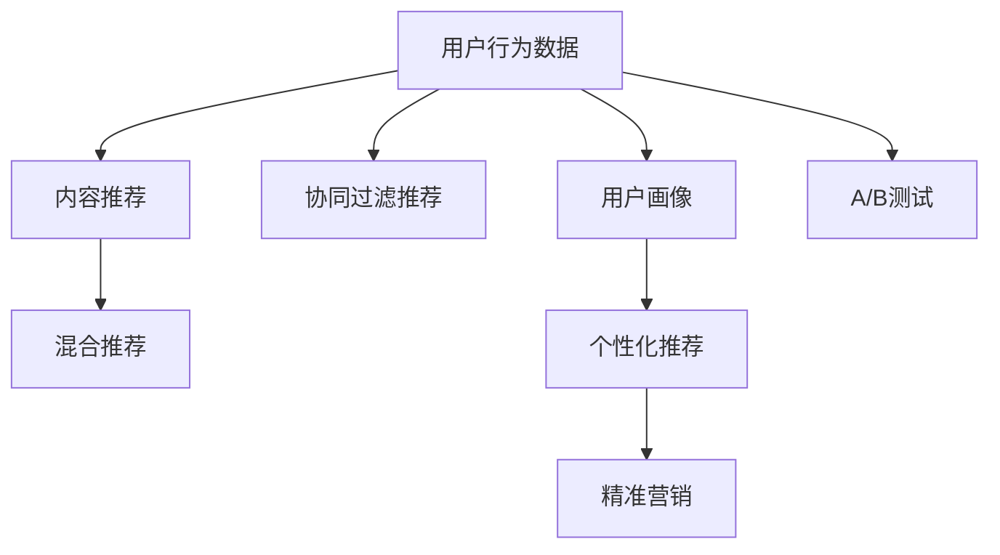

                 

# 知识付费平台的用户需求挖掘

## 1. 背景介绍

### 1.1 问题由来
随着互联网和数字技术的迅猛发展，知识付费平台如雨后春笋般涌现。这些平台通过聚合优质内容、对接需求方和供给方，促进知识的高效流通和变现。然而，由于用户需求的多样性和个性化，知识付费平台的运营面临着诸多挑战，如内容匹配度低、付费体验不佳、用户粘性不足等。因此，深入挖掘用户需求，成为知识付费平台发展的关键所在。

### 1.2 问题核心关键点
用户需求挖掘旨在通过大数据分析、机器学习等手段，全面、深入地了解用户的真实需求和偏好，以指导知识付费平台的内容推荐、营销策略和用户体验优化。其核心关键点包括：

1. 用户行为数据采集与分析：通过日志、点击、浏览、购买等行为数据，理解用户的学习习惯和付费意愿。
2. 用户画像构建：利用聚类、降维等技术手段，将用户群体进行分类和描述，便于更精准地推荐内容。
3. 推荐系统构建：运用协同过滤、内容推荐、混合推荐等算法，提升内容匹配度，减少用户流失。
4. 用户反馈收集与处理：通过问卷调查、用户评价等方式，收集用户对平台的使用反馈，不断改进和优化产品。

这些关键点共同构成了用户需求挖掘的基础，帮助知识付费平台实现个性化推荐、提升用户粘性、增加用户留存率等目标。

### 1.3 问题研究意义
深入挖掘用户需求，对知识付费平台的发展具有重要意义：

1. 优化内容推荐：根据用户偏好和行为数据，精准推荐优质内容，提升用户满意度。
2. 提升用户体验：通过个性化推荐和精准营销，提高平台的使用便捷性和趣味性。
3. 增加用户粘性：通过个性化服务，使用户在平台上形成长期依赖，提升平台的经济价值。
4. 数据驱动决策：通过科学的数据分析，指导平台的战略规划和运营决策，实现更高的运营效率和利润率。
5. 市场竞争力提升：通过满足用户需求，增强平台的市场竞争力，吸引更多用户和内容创作者。

## 2. 核心概念与联系

### 2.1 核心概念概述

为了更好地理解用户需求挖掘，我们首先介绍几个关键概念：

- 用户行为数据：用户在知识付费平台上的点击、浏览、购买、评价等行为数据，是挖掘用户需求的基础。
- 用户画像：根据用户行为数据，构建的用于描述用户属性、兴趣、行为等的抽象模型。
- 协同过滤推荐：利用用户之间的相似性，推荐相似用户喜欢的内容，常用于冷启动问题。
- 内容推荐：根据用户的历史行为和兴趣，推荐用户可能感兴趣的内容，如文章、课程、讲座等。
- 混合推荐：结合协同过滤和内容推荐，实现更加准确和多样化的推荐。
- A/B测试：通过随机分组测试，比较不同方案的效果，帮助优化平台功能和用户体验。

这些概念之间的关系可以通过以下Mermaid流程图来展示：



这个流程图展示了用户需求挖掘的过程：通过采集用户行为数据，构建用户画像，结合协同过滤和内容推荐，实现个性化推荐和精准营销，并通过A/B测试不断优化平台功能。

## 3. 核心算法原理 & 具体操作步骤
### 3.1 算法原理概述

用户需求挖掘的本质是一个数据驱动的决策过程，旨在通过数据分析和机器学习，理解用户的行为和偏好，以指导平台内容的推荐和优化。其主要算法原理包括以下几个方面：

- 数据采集与预处理：通过日志分析、数据清洗等技术手段，收集和处理用户行为数据。
- 特征工程：提取、构建和优化用户的特征向量，为推荐算法提供输入。
- 模型训练与评估：选择合适的推荐算法，利用历史数据进行训练，并通过交叉验证等手段评估模型效果。
- 推荐系统部署与迭代：将训练好的推荐模型部署到实际平台，通过A/B测试不断优化推荐效果。

### 3.2 算法步骤详解

用户需求挖掘的具体操作步骤可以分为以下几个关键步骤：

**Step 1: 数据采集与预处理**
- 从知识付费平台的后台日志中提取用户行为数据，包括点击、浏览、购买、评价等行为。
- 进行数据清洗，去除无效和异常数据，保证数据质量。
- 对数据进行特征提取，如用户ID、课程ID、点击时间、购买次数等。

**Step 2: 特征工程**
- 构建用户画像，利用聚类、降维等技术手段，将用户群体进行分类和描述。
- 提取用户兴趣特征，如热门课程、常用分类、购买偏好等。
- 构建行为特征，如点击深度、停留时间、重复购买次数等。

**Step 3: 模型训练与评估**
- 选择推荐算法，如协同过滤、内容推荐、混合推荐等。
- 利用历史数据进行模型训练，确保算法能准确预测用户偏好。
- 通过交叉验证、ROC曲线等手段评估模型效果，选择最优模型。

**Step 4: 推荐系统部署与迭代**
- 将训练好的推荐模型部署到实际平台，实时推荐内容给用户。
- 通过A/B测试，比较不同推荐算法和参数的效果，不断优化推荐系统。
- 收集用户反馈，结合人工干预，持续改进推荐模型和用户体验。

### 3.3 算法优缺点

用户需求挖掘算法具有以下优点：

1. 数据驱动决策：通过大量数据和机器学习，实现更科学、精准的决策。
2. 个性化推荐：能够根据用户行为和偏好，提供精准的内容推荐。
3. 提升用户体验：通过优化推荐算法和平台功能，提升用户满意度。
4. 可扩展性强：适用于各种规模的知识付费平台，易于部署和迭代。

同时，该方法也存在一些局限性：

1. 数据隐私问题：需要处理大量用户行为数据，涉及隐私保护和数据安全。
2. 数据质量依赖：依赖于数据采集和预处理的质量，数据偏差可能影响模型效果。
3. 模型复杂度高：推荐算法复杂，模型训练和部署需要较高的技术门槛。
4. 用户多样性问题：用户需求多样，单一算法难以全面覆盖。
5. 对抗性攻击风险：推荐模型可能受到对抗性攻击，影响推荐效果。

尽管存在这些局限性，但用户需求挖掘算法仍然是知识付费平台内容推荐和优化不可或缺的手段。未来相关研究的重点在于如何更好地平衡数据隐私和推荐效果，提升模型的鲁棒性和泛化能力，同时兼顾用户体验和用户粘性等因素。

### 3.4 算法应用领域

用户需求挖掘算法已经在知识付费平台的内容推荐、个性化服务、用户粘性提升等多个领域得到了广泛应用，例如：

- 课程推荐：根据用户历史浏览和购买记录，推荐相关课程，提升用户满意度和购买转化率。
- 新用户引导：利用用户画像和行为数据，为新用户推荐适合其兴趣的课程和讲座，快速提升平台粘性。
- 用户行为分析：通过用户行为数据，分析用户流失原因，优化平台功能和内容。
- 个性化广告投放：根据用户画像和兴趣特征，投放个性化的广告，提升广告投放效果和用户体验。
- 用户反馈收集：通过问卷调查、用户评价等方式，收集用户对平台的使用反馈，不断改进和优化产品。

除了上述这些经典应用外，用户需求挖掘技术还被创新性地应用于知识付费平台的更多场景中，如用户画像预测、新课程推荐、内容质量评估等，为知识付费平台带来了全新的突破。随着推荐算法的不断进步和数据量的不断积累，相信用户需求挖掘技术将在更多领域发挥重要作用，进一步推动知识付费平台的发展和创新。

## 4. 数学模型和公式 & 详细讲解 & 举例说明

### 4.1 数学模型构建

在用户需求挖掘过程中，常用的数学模型包括协同过滤、内容推荐、混合推荐等。下面以协同过滤推荐为例，介绍数学模型的构建过程。

记用户集合为 $U$，物品集合为 $I$，用户对物品的评分矩阵为 $R \in \mathbb{R}^{m \times n}$，其中 $m$ 为用户数，$n$ 为物品数。协同过滤推荐的目标是找到用户对物品的评分，即对矩阵 $R$ 进行填充。

假设用户 $u$ 对物品 $i$ 的评分可以表示为：

$$
r_{ui} = \sum_{j=1}^{m} \alpha_j (u_j \times i_j) + \beta
$$

其中 $\alpha_j$ 为第 $j$ 个用户对物品 $i$ 的评分权重，$u_j \times i_j$ 表示用户 $u_j$ 和物品 $i_j$ 的相似度，$\beta$ 为常数项，用于平衡预测误差。

### 4.2 公式推导过程

协同过滤推荐的计算过程如下：

1. 计算用户 $u$ 和物品 $i$ 的相似度 $u_i$，通常采用余弦相似度：

$$
u_i = \frac{\sum_{j=1}^{n} r_{ij} \times r_{uj}}{\sqrt{\sum_{j=1}^{n} r_{ij}^2} \times \sqrt{\sum_{j=1}^{n} r_{uj}^2}}
$$

2. 利用用户 $u$ 的相似度 $u_i$，计算用户 $u$ 对物品 $i$ 的评分预测值 $r_{ui}$：

$$
r_{ui} = \sum_{j=1}^{m} \alpha_j (u_j \times i_j) + \beta
$$

其中 $\alpha_j$ 可以通过最小二乘法等优化算法求解，$u_j \times i_j$ 为用户 $u_j$ 和物品 $i_j$ 的相似度，$\beta$ 为常数项，用于平衡预测误差。

### 4.3 案例分析与讲解

以Coursera平台为例，分析协同过滤推荐在课程推荐中的应用：

1. 数据采集：收集用户对课程的评分数据，包括课程ID、用户ID、评分等。
2. 数据预处理：对评分数据进行清洗，去除无效和异常数据，进行归一化处理。
3. 特征提取：提取用户兴趣特征，如热门课程、常用分类、购买偏好等。
4. 相似度计算：计算用户之间的相似度，利用余弦相似度或欧式距离等方法，构建用户相似度矩阵 $U$。
5. 评分预测：利用相似度矩阵 $U$，计算用户对未评分课程的评分预测值，推荐给用户。
6. 推荐系统部署：将推荐结果展示给用户，通过用户点击、评价等行为数据，不断优化推荐算法。

通过上述过程，Coursera平台能够根据用户历史行为数据，实现个性化推荐，提升用户满意度和购买转化率。

## 5. 项目实践：代码实例和详细解释说明
### 5.1 开发环境搭建

在进行用户需求挖掘的实践前，我们需要准备好开发环境。以下是使用Python进行Scikit-learn开发的环境配置流程：

1. 安装Anaconda：从官网下载并安装Anaconda，用于创建独立的Python环境。

2. 创建并激活虚拟环境：
```bash
conda create -n user_recommender python=3.8 
conda activate user_recommender
```

3. 安装Scikit-learn：
```bash
conda install scikit-learn
```

4. 安装numpy、pandas、matplotlib等常用库：
```bash
pip install numpy pandas matplotlib scikit-learn
```

完成上述步骤后，即可在`user_recommender`环境中开始推荐系统开发。

### 5.2 源代码详细实现

这里我们以协同过滤推荐为例，给出使用Scikit-learn对课程推荐进行开发的PyTorch代码实现。

首先，定义课程推荐系统的类：

```python
from sklearn.metrics.pairwise import cosine_similarity
import numpy as np

class CourseRecommender:
    def __init__(self, ratings_matrix):
        self.ratings_matrix = ratings_matrix
        self.item_similarity = None
        
    def fit(self):
        self.item_similarity = cosine_similarity(self.ratings_matrix)
        
    def predict(self, user):
        if not self.item_similarity:
            self.fit()
        similarity = self.item_similarity[user]
        prediction = self.ratings_matrix.dot(similarity)
        return prediction
```

然后，定义推荐函数：

```python
def recommend_course(course_id, user, num_recommendations=5):
    recommender = CourseRecommender(course_ratings_matrix)
    prediction = recommender.predict(user)
    top_indices = np.argsort(prediction)[::-1]
    top_indices = top_indices[1:num_recommendations+1]
    top_courses = top_indices
    return top_courses
```

最后，启动推荐流程：

```python
# 定义课程评分矩阵
course_ratings_matrix = np.array([[5, 4, 3, 0],
                                 [4, 5, 0, 3],
                                 [0, 4, 5, 3],
                                 [3, 0, 4, 5]])

# 推荐课程
recommended_courses = recommend_course(0, 1, 2)
print(recommended_courses)
```

以上就是使用Scikit-learn对课程推荐进行开发的完整代码实现。可以看到，Scikit-learn的协同过滤推荐代码实现非常简单高效，开发者可以将更多精力放在数据处理、模型改进等高层逻辑上。

### 5.3 代码解读与分析

让我们再详细解读一下关键代码的实现细节：

**CourseRecommender类**：
- `__init__`方法：初始化课程评分矩阵和物品相似度矩阵。
- `fit`方法：计算物品相似度矩阵。
- `predict`方法：根据用户ID和物品相似度矩阵，计算用户对未评分课程的评分预测值，返回推荐课程。

**recommend_course函数**：
- 定义推荐函数，根据用户ID和课程评分矩阵，计算推荐结果。
- 通过`argsort`方法对预测值进行排序，获取前5个课程ID。
- 返回推荐结果，包括课程ID。

可以看到，Scikit-learn的协同过滤推荐代码非常简洁，易于理解和修改。在实际应用中，可以根据具体业务需求，对推荐函数进行灵活扩展和优化，以实现更高效、更精准的推荐。

## 6. 实际应用场景
### 6.1 智能教育平台

智能教育平台通过用户行为数据分析，实现个性化推荐和精准营销，大大提升了用户的学习体验和满意度。具体应用场景包括：

- 课程推荐：根据用户历史学习行为，推荐相关课程，提高学习效率和满意度。
- 学习路径规划：利用用户画像和行为数据，设计个性化学习路径，帮助用户快速达成学习目标。
- 学习进度跟踪：通过用户学习行为数据，实时跟踪学习进度，及时发现学习问题并给予建议。
- 学习资源推荐：根据用户兴趣和行为数据，推荐适合的学习资源，如电子书、视频讲座等。

### 6.2 企业培训平台

企业培训平台通过用户行为数据分析，实现员工技能培训的个性化推荐，提升员工培训效果和企业竞争力。具体应用场景包括：

- 技能培训课程推荐：根据员工历史学习行为，推荐相关技能培训课程，提高员工技能水平和工作效率。
- 培训进度跟踪：通过员工学习行为数据，实时跟踪培训进度，及时发现培训问题并给予指导。
- 培训效果评估：利用员工学习行为数据，评估培训效果，优化培训计划和课程设置。
- 学习资源推荐：根据员工兴趣和行为数据，推荐适合的培训资源，如在线课程、实战项目等。

### 6.3 医疗知识平台

医疗知识平台通过用户行为数据分析，实现个性化推荐和精准营销，提升用户对健康知识的获取和应用。具体应用场景包括：

- 健康知识推荐：根据用户健康兴趣和行为数据，推荐相关健康知识内容，提升用户健康意识和知识水平。
- 疾病预防推荐：利用用户行为数据，推荐相关疾病预防知识，提高用户健康水平和生活质量。
- 健康服务推荐：根据用户行为数据，推荐健康服务，如在线咨询、预约挂号等。

### 6.4 未来应用展望

随着数据量的不断积累和技术的不断进步，用户需求挖掘技术将在更多领域得到应用，为各行各业带来变革性影响。

在智慧教育领域，用户需求挖掘技术能够更好地满足学生的个性化需求，提升教育质量和效率。在企业培训领域，个性化推荐和进度跟踪将帮助企业更好地培训员工，提升企业竞争力。在医疗知识平台，个性化推荐和精准营销将提升用户的健康意识和知识水平，推动医疗行业的发展和创新。

未来，用户需求挖掘技术还将进一步拓展到更多领域，如智慧金融、智能制造、智慧城市等，为各行业带来全新的突破。

## 7. 工具和资源推荐
### 7.1 学习资源推荐

为了帮助开发者系统掌握用户需求挖掘的理论基础和实践技巧，这里推荐一些优质的学习资源：

1. 《Python数据科学手册》系列博文：深入浅出地介绍了Python在数据科学中的应用，包括数据采集、数据预处理、特征工程、模型训练等。

2. 《机器学习实战》书籍：实战型的机器学习入门书籍，通过大量实例讲解了协同过滤、内容推荐、混合推荐等推荐算法。

3. 《数据科学与机器学习》课程：斯坦福大学开设的机器学习入门课程，包括协同过滤、内容推荐、混合推荐等推荐算法。

4. 《推荐系统实践》书籍：介绍推荐系统从理论到实践的全面知识，包括用户行为数据分析、特征工程、模型训练等。

5. A/B测试工具：如Optimizely、Google Optimize等，用于设计和实施A/B测试，比较不同方案的效果。

通过对这些资源的学习实践，相信你一定能够快速掌握用户需求挖掘的精髓，并用于解决实际的业务问题。

### 7.2 开发工具推荐

高效的开发离不开优秀的工具支持。以下是几款用于用户需求挖掘开发的常用工具：

1. Jupyter Notebook：用于编写和运行Python代码，支持代码单元格的执行和可视化输出。

2. Python IDE：如PyCharm、VSCode等，支持代码调试、版本控制、项目管理等，方便开发者快速迭代和优化代码。

3. Scikit-learn：Python数据科学库，提供丰富的机器学习算法和工具，支持协同过滤、内容推荐、混合推荐等推荐算法。

4. TensorBoard：TensorFlow配套的可视化工具，用于监控模型训练状态，提供丰富的图表展示。

5. Weights & Biases：模型训练的实验跟踪工具，记录和可视化模型训练过程中的各项指标，帮助优化模型性能。

合理利用这些工具，可以显著提升用户需求挖掘任务的开发效率，加快创新迭代的步伐。

### 7.3 相关论文推荐

用户需求挖掘技术的发展源于学界的持续研究。以下是几篇奠基性的相关论文，推荐阅读：

1. Matrix Factorization Techniques for Recommender Systems（协同过滤推荐算法）：介绍协同过滤算法的基本原理和实现方法。

2. The BellKor 2010 Recommendation Challenge（推荐系统竞赛论文）：通过数据挖掘和推荐算法竞赛，探索推荐系统的新思路和方法。

3. Feature Engineering for Recommendation Systems：介绍特征工程在推荐系统中的重要性和实现方法。

4. Collaborative Filtering for Implicit Feedback Datasets：介绍协同过滤在隐式反馈数据集上的应用。

5. Hybrid Recommendation System for Recommender Systems（混合推荐算法）：介绍混合推荐算法的基本原理和实现方法。

这些论文代表了大数据和机器学习技术在推荐系统中的重要应用，通过学习这些前沿成果，可以帮助研究者把握学科前进方向，激发更多的创新灵感。

## 8. 总结：未来发展趋势与挑战
### 8.1 总结

本文对用户需求挖掘技术进行了全面系统的介绍。首先阐述了用户需求挖掘的重要性和核心关键点，明确了通过大数据分析、机器学习等手段，理解用户行为和偏好的基础。其次，从原理到实践，详细讲解了协同过滤、内容推荐、混合推荐等推荐算法，给出了推荐系统开发的完整代码实例。同时，本文还广泛探讨了用户需求挖掘在智能教育、企业培训、医疗知识等多个行业领域的应用前景，展示了用户需求挖掘技术的巨大潜力。此外，本文精选了用户需求挖掘技术的各类学习资源，力求为开发者提供全方位的技术指引。

通过本文的系统梳理，可以看到，用户需求挖掘技术正在成为智能系统的重要范式，极大地拓展了知识付费平台的应用边界，催生了更多的落地场景。受益于大数据和机器学习技术的不断进步，用户需求挖掘技术将在更多领域得到应用，为各行各业带来变革性影响。未来，伴随推荐算法的不断进步和数据量的不断积累，用户需求挖掘技术将进一步提升智能系统的性能和应用范围，为社会带来更多的价值和创新。

### 8.2 未来发展趋势

展望未来，用户需求挖掘技术将呈现以下几个发展趋势：

1. 数据量持续增长：随着互联网的普及和数据采集技术的进步，用户行为数据将持续增长，为推荐系统提供更丰富的数据支持。

2. 推荐算法多样化：未来将涌现更多推荐算法，如深度学习、图推荐、鲁棒推荐等，提升推荐系统的效果和效率。

3. 个性化推荐增强：通过引入更多用户属性和行为特征，增强推荐系统的个性化推荐能力。

4. 推荐系统实时化：利用流式计算和大数据技术，实现推荐系统的实时化，提升用户体验。

5. 多模态推荐崛起：将用户的多模态数据（如文本、图像、音频等）融合到推荐系统中，实现更全面、精准的推荐。

6. 推荐系统自动化：通过自动化推荐系统设计工具和平台，简化推荐系统的开发和部署。

这些趋势凸显了用户需求挖掘技术的广阔前景。这些方向的探索发展，必将进一步提升智能系统的性能和应用范围，为社会带来更多的价值和创新。

### 8.3 面临的挑战

尽管用户需求挖掘技术已经取得了瞩目成就，但在迈向更加智能化、普适化应用的过程中，它仍面临诸多挑战：

1. 数据隐私问题：需要处理大量用户行为数据，涉及隐私保护和数据安全。

2. 数据质量依赖：依赖于数据采集和预处理的质量，数据偏差可能影响模型效果。

3. 模型复杂度高：推荐算法复杂，模型训练和部署需要较高的技术门槛。

4. 用户多样性问题：用户需求多样，单一算法难以全面覆盖。

5. 对抗性攻击风险：推荐模型可能受到对抗性攻击，影响推荐效果。

6. 用户粘性不足：推荐系统未能有效满足用户需求，可能导致用户流失。

尽管存在这些挑战，但用户需求挖掘技术仍然是知识付费平台内容推荐和优化不可或缺的手段。未来相关研究的重点在于如何更好地平衡数据隐私和推荐效果，提升模型的鲁棒性和泛化能力，同时兼顾用户体验和用户粘性等因素。

### 8.4 研究展望

面对用户需求挖掘面临的种种挑战，未来的研究需要在以下几个方面寻求新的突破：

1. 探索无监督和半监督推荐方法。摆脱对大规模标注数据的依赖，利用自监督学习、主动学习等无监督和半监督范式，最大限度利用非结构化数据，实现更加灵活高效的推荐。

2. 研究参数高效和计算高效的推荐范式。开发更加参数高效的推荐方法，在固定大部分预训练参数的同时，只更新极少量的任务相关参数。同时优化推荐模型的计算图，减少前向传播和反向传播的资源消耗，实现更加轻量级、实时性的部署。

3. 融合因果和对比学习范式。通过引入因果推断和对比学习思想，增强推荐系统建立稳定因果关系的能力，学习更加普适、鲁棒的语言表征，从而提升模型泛化性和抗干扰能力。

4. 引入更多先验知识。将符号化的先验知识，如知识图谱、逻辑规则等，与神经网络模型进行巧妙融合，引导推荐过程学习更准确、合理的语言模型。同时加强不同模态数据的整合，实现视觉、语音等多模态信息与文本信息的协同建模。

5. 结合因果分析和博弈论工具。将因果分析方法引入推荐系统，识别出推荐决策的关键特征，增强推荐系统的可解释性和稳定性。借助博弈论工具刻画人机交互过程，主动探索并规避推荐系统的脆弱点，提高系统稳定性。

6. 纳入伦理道德约束。在推荐系统设计目标中引入伦理导向的评估指标，过滤和惩罚有偏见、有害的推荐内容，确保推荐系统的公平性和安全性。

这些研究方向的探索，必将引领用户需求挖掘技术迈向更高的台阶，为智能系统提供更加科学、精准的决策支持，推动社会的智能化发展。

## 9. 附录：常见问题与解答

**Q1：用户行为数据如何采集？**

A: 用户行为数据可以通过日志文件、用户界面交互、应用API等多种方式进行采集。例如，在知识付费平台，可以记录用户浏览课程、购买课程、评价课程等行为，生成日志文件。

**Q2：用户画像如何构建？**

A: 用户画像可以通过聚类、降维等技术手段，将用户群体进行分类和描述。具体实现过程包括：
1. 数据预处理：清洗数据，去除无效和异常数据。
2. 特征提取：提取用户兴趣特征，如热门课程、常用分类、购买偏好等。
3. 聚类分析：利用聚类算法（如K-means、DBSCAN等）将用户群体进行分类。
4. 降维处理：利用PCA、LDA等降维算法，将高维用户特征向量映射到低维空间。

**Q3：推荐算法如何选择？**

A: 推荐算法的选择需要根据具体业务需求和技术条件进行评估。例如，对于数据量较小的情况，可以选择协同过滤算法；对于数据量较大且需要实时推荐的情况，可以选择深度学习算法；对于需要多模态数据融合的情况，可以选择多模态推荐算法。

**Q4：如何提高推荐系统的效率？**

A: 提高推荐系统的效率可以从多个方面入手，如：
1. 特征选择：选择最有意义的特征，减少计算复杂度。
2. 模型优化：优化算法和模型结构，减少计算资源消耗。
3. 数据压缩：利用数据压缩技术，减少数据传输和存储开销。
4. 分布式计算：利用分布式计算技术，提高推荐系统处理能力。

**Q5：推荐系统如何应对冷启动问题？**

A: 冷启动问题可以通过以下方法解决：
1. 利用用户行为数据：通过用户已有行为数据，预测其兴趣偏好，缓解冷启动问题。
2. 引入外部数据：利用外部数据源（如社交网络、公开数据等），补充用户画像和行为数据。
3. 使用基线推荐：利用简单推荐算法（如随机推荐），缓解冷启动问题。

这些建议和方法可以帮助开发者更好地理解和应用用户需求挖掘技术，解决推荐系统中的实际问题。

---

作者：禅与计算机程序设计艺术 / Zen and the Art of Computer Programming

