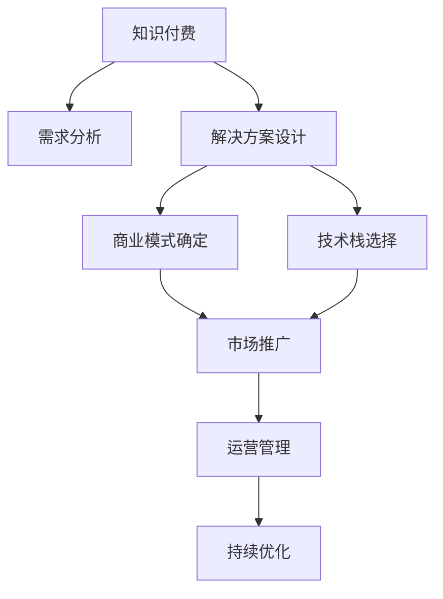

                 

# 知识付费时代程序员的创业机会

> 关键词：知识付费, 程序员创业, 人工智能, 算法, 数据科学, 软件工程, 技术创新

## 1. 背景介绍

### 1.1 问题由来

在互联网的浪潮下，信息的获取变得更加便捷，知识的传播速度也在加快。然而，在信息爆炸的背景下，如何高效、精准地获取优质信息，成为越来越多人的困扰。知识付费作为一种新兴的商业模式，通过付费方式提供深度、专业、高质量的资讯、课程、咨询等服务，不仅满足了人们对知识渴求的需求，还极大地促进了知识的传播和利用。

特别是在当下这个快速变化的时代，终身学习成为一种刚需，人们对于能够快速提升职业技能和专业素养的知识付费内容，有着越来越高的需求。而这一趋势，也为程序员们提供了前所未有的创业机会。

### 1.2 问题核心关键点

知识付费市场的大幅增长，为程序员提供了巨大的机遇，但同时也带来了挑战。如何把握这一趋势，找到合适的切入点，实现商业成功，是每一个有意创业的程序员所面临的核心问题。

1. **需求分析**：首先，需要对知识付费市场进行深度分析，明确用户需求，找到市场痛点。
2. **解决方案**：根据需求设计解决方案，并验证其市场接受度。
3. **商业模式**：确定商业模式的可行性，包括定价策略、盈利模式等。
4. **技术实现**：选择合适的技术栈，实现解决方案的快速迭代。
5. **市场推广**：制定有效的市场推广策略，提高产品知名度和用户粘性。
6. **运营管理**：建立完善的运营管理体系，确保产品的长期发展。

## 2. 核心概念与联系

### 2.1 核心概念概述

为更好地理解知识付费市场，本节将介绍几个关键概念：

- **知识付费**：指通过付费方式获取深度、专业、高质量的知识和信息，满足用户的学习和成长需求。知识付费的形式包括但不限于在线课程、电子书、咨询服务、软件开发工具等。
- **程序员创业**：指程序员利用自身的专业技能和技术背景，创立以编程、软件开发、数据科学、人工智能等领域为核心的创业项目。
- **算法与数据科学**：指通过数据和算法解决实际问题的技术，广泛应用于金融、医疗、教育、娱乐等领域，是知识付费市场的重要支撑。
- **人工智能**：指通过机器学习、深度学习等技术实现智能应用，包括自然语言处理、计算机视觉、语音识别等方向，是知识付费内容的重要组成部分。
- **技术栈选择**：指在软件开发中，根据项目需求选择最适合的技术工具、框架和平台。

### 2.2 核心概念原理和架构的 Mermaid 流程图(Mermaid 流程节点中不要有括号、逗号等特殊字符)



该图展示了从知识付费的概念出发，通过需求分析、解决方案设计、商业模式确定、技术栈选择、市场推广和运营管理等环节，最终实现产品的迭代和优化的过程。

## 3. 核心算法原理 & 具体操作步骤

### 3.1 算法原理概述

知识付费平台的核心在于内容和服务，而内容的质量和服务的质量，很大程度上依赖于算法的优化。以下以人工智能和数据科学为例，阐述算法的核心原理和操作步骤。

#### 3.1.1 算法原理概述

1. **机器学习与深度学习**：机器学习通过训练数据集，构建模型预测未知数据的标签，深度学习则是在传统机器学习的基础上，使用多层神经网络进行更复杂的非线性建模。
2. **自然语言处理(NLP)**：NLP利用算法对自然语言文本进行处理和分析，包括文本分类、情感分析、实体识别等。
3. **推荐系统**：推荐系统通过分析用户行为和偏好，推荐个性化的内容和服务，提高用户体验。

#### 3.1.2 算法步骤详解

1. **数据收集与预处理**：收集相关领域的文本数据、行为数据等，进行清洗、去重和标注。
2. **特征提取**：利用TF-IDF、词向量等技术，将文本数据转化为算法可以处理的特征向量。
3. **模型训练与调优**：选择合适的模型，如LSTM、CNN等，使用训练数据进行模型训练和参数调优。
4. **模型评估与部署**：使用测试数据集评估模型性能，部署模型到生产环境。
5. **持续监控与优化**：通过监控用户行为和反馈，不断优化模型，提高服务质量。

### 3.2 算法优缺点

#### 3.2.1 算法优点

1. **高效性**：通过算法自动化处理大量数据，提高效率。
2. **准确性**：算法可以处理高维数据，并找到复杂的模式和规律。
3. **可扩展性**：算法可以适应不同规模的数据集，实现横向和纵向扩展。
4. **灵活性**：算法可以根据需求进行定制化设计，满足特定的业务需求。

#### 3.2.2 算法缺点

1. **数据依赖**：算法的性能很大程度上依赖于训练数据的质量和数量，数据不足可能导致模型泛化能力不足。
2. **模型复杂性**：深度学习模型往往结构复杂，需要大量的计算资源和专业知识进行训练和优化。
3. **过拟合风险**：模型可能过拟合训练数据，导致在实际应用中表现不佳。
4. **黑盒性质**：复杂的算法模型难以解释，缺乏可解释性。

### 3.3 算法应用领域

人工智能和数据科学算法广泛应用于知识付费平台的各个环节，具体应用领域包括但不限于：

1. **内容推荐**：利用推荐算法为用户推荐个性化的课程、书籍、文章等。
2. **用户画像**：通过数据分析，构建用户画像，了解用户兴趣和行为。
3. **知识图谱**：构建知识图谱，帮助用户更高效地获取和理解知识。
4. **情感分析**：利用NLP技术分析用户评论和反馈，优化内容质量。
5. **个性化推荐引擎**：根据用户行为和偏好，提供个性化的学习路径和资源。

## 4. 数学模型和公式 & 详细讲解 & 举例说明

### 4.1 数学模型构建

以推荐系统为例，我们可以构建一个基于协同过滤的推荐模型。假设用户集合为 $U$，物品集合为 $I$，用户与物品的评分矩阵为 $R \in \mathbb{R}^{m \times n}$，其中 $m$ 为物品数量，$n$ 为用户数量。推荐模型的目标是最大化用户和物品之间的评分预测准确率。

### 4.2 公式推导过程

对于协同过滤算法中的用户-物品矩阵 $R$，我们可以使用矩阵分解的方法，将其分解为两个低秩矩阵 $P$ 和 $Q$，即：

$$
R \approx UPVQ^T
$$

其中 $U \in \mathbb{R}^{m \times k}, V \in \mathbb{R}^{n \times k}$，$P \in \mathbb{R}^{k \times k}$ 是用户和物品的特征矩阵，$Q \in \mathbb{R}^{k \times k}$ 是用户和物品的隐含特征矩阵。

### 4.3 案例分析与讲解

假设我们有一个推荐系统，用户 $u$ 对物品 $i$ 的评分 $r_{ui}$ 可以用 $P_u \cdot Q_i$ 表示，其中 $P_u$ 和 $Q_i$ 分别是用户 $u$ 和物品 $i$ 的特征向量。假设用户 $u$ 对物品 $i$ 的评分已知，那么可以预测用户 $u'$ 对物品 $i$ 的评分 $r_{u'i}$ 如下：

$$
r_{u'i} = \mathop{\arg\max}_{j \in I} \langle P_{u'}, Q_j \rangle
$$

其中 $\langle P_{u'}, Q_j \rangle$ 表示用户 $u'$ 和物品 $j$ 的特征向量点积。

通过上述模型，我们可以为用户 $u'$ 推荐评分预测值最高的物品 $j$。

## 5. 项目实践：代码实例和详细解释说明

### 5.1 开发环境搭建

为了实现上述推荐系统，我们需要搭建一个Python开发环境，具体步骤如下：

1. 安装Python 3.8及以上版本。
2. 安装NumPy、SciPy、Pandas等数据科学库。
3. 安装TensorFlow或PyTorch深度学习库。
4. 安装Jupyter Notebook或其他交互式开发环境。

### 5.2 源代码详细实现

以下是使用TensorFlow实现协同过滤推荐系统的Python代码：

```python
import numpy as np
import tensorflow as tf

# 构建用户和物品特征矩阵
P = np.random.rand(1000, 100)
Q = np.random.rand(100, 1000)

# 用户与物品评分矩阵
R = P.dot(Q.T)

# 定义模型
user_input = tf.keras.layers.Input(shape=(1000,))
item_input = tf.keras.layers.Input(shape=(1000,))
P_dot_Q = tf.keras.layers.Dot(axes=1)([user_input, item_input])
output = tf.keras.layers.Dense(1, activation='sigmoid')(P_dot_Q)

# 构建模型并编译
model = tf.keras.Model(inputs=[user_input, item_input], outputs=output)
model.compile(optimizer=tf.keras.optimizers.Adam(), loss='binary_crossentropy')

# 训练模型
model.fit([P.T, Q], R, epochs=10, batch_size=64)

# 使用模型进行推荐
# 假设用户u'的特征向量为P_u'，物品i的特征向量为Q_i，推荐物品j
P_u = P.T
Q_i = Q
j_indices = tf.keras.layers.Dense(1000, activation='softmax')(P_u.T).numpy().argmax(axis=1)
recommendations = np.dot(Q[i], P_u[j_indices])
```

### 5.3 代码解读与分析

1. **数据构建**：我们使用随机生成的用户和物品特征矩阵，以及评分矩阵构建推荐模型。
2. **模型定义**：定义输入层和输出层，并使用Dot层计算用户和物品的特征点积。
3. **模型编译**：使用Adam优化器和二分类交叉熵损失函数编译模型。
4. **模型训练**：使用训练集进行模型训练，共10个epoch，每个epoch使用64个样本。
5. **模型使用**：根据用户u'的特征向量P_u'和物品i的特征向量Q_i，使用Dense层计算预测评分，并通过argmax操作得到推荐物品的索引。

### 5.4 运行结果展示

在上述代码中，我们训练了一个协同过滤推荐模型，并通过模型推荐了用户u'的感兴趣物品。最终的推荐结果是一个1000维向量，其中每个元素表示物品j的概率评分，可以选择概率最大的几个物品作为推荐结果。

## 6. 实际应用场景

### 6.1 智能辅导

在知识付费领域，智能辅导是一种常见的应用场景。通过算法分析学生的学习进度和反馈，智能辅导系统可以提供个性化的学习资源和路径，帮助学生高效提升成绩。

#### 6.1.1 需求分析

1. **学习进度分析**：通过分析学生的作业提交情况和学习记录，了解学生的知识掌握情况和薄弱环节。
2. **学习路径规划**：根据学生的学习进度和兴趣，推荐适合的课程和学习资源。
3. **实时反馈**：在学习过程中，提供实时反馈和指导，帮助学生及时纠正错误。

#### 6.1.2 解决方案设计

1. **数据收集**：收集学生的学习数据，包括作业、考试、课堂表现等。
2. **特征提取**：使用TF-IDF、词向量等技术，将学习数据转化为算法可以处理的特征向量。
3. **模型训练**：使用机器学习或深度学习模型，训练学习进度分析和路径规划模型。
4. **模型部署**：将模型部署到学习平台上，实时分析学生的学习情况。

#### 6.1.3 商业模式

1. **订阅模式**：用户通过订阅学习平台，获得个性化辅导服务。
2. **按需服务**：用户可以根据需求购买单次课程或辅导服务。
3. **广告分成**：平台通过展示广告或广告点击率，获得收入分成。

#### 6.1.4 技术栈选择

1. **数据处理**：使用Pandas、NumPy等库进行数据预处理和特征提取。
2. **模型训练**：使用TensorFlow或PyTorch进行模型训练和优化。
3. **系统部署**：使用Django、Flask等框架构建Web服务，部署到云平台。

#### 6.1.5 市场推广

1. **SEO优化**：通过优化网站结构和内容，提高搜索引擎排名。
2. **社交媒体推广**：利用社交媒体平台，进行精准广告投放。
3. **口碑营销**：通过用户口碑传播，扩大用户群体。

#### 6.1.6 运营管理

1. **用户管理**：建立用户账号系统，管理用户数据和行为。
2. **内容管理**：定期更新课程和资料，确保内容质量。
3. **客户服务**：提供客服支持，及时解决用户问题。

### 6.2 教育资源整合

教育资源整合是知识付费领域的另一个重要应用场景，通过整合优质的教育资源，为学生提供更丰富、高效的学习体验。

#### 6.2.1 需求分析

1. **资源整合**：收集和整合各个领域的优质教育资源，如视频课程、电子书、研究论文等。
2. **内容筛选**：根据用户需求和反馈，筛选出最优质和最相关的资源。
3. **内容推荐**：为用户提供个性化的内容推荐服务，提高学习效率。

#### 6.2.2 解决方案设计

1. **数据收集**：收集和整合各个领域的教育资源，包括视频、文档、论文等。
2. **内容标注**：使用自然语言处理技术，对资源内容进行标注和分类。
3. **推荐模型**：构建推荐算法，对用户进行画像，根据用户画像推荐个性化资源。

#### 6.2.3 商业模式

1. **订阅模式**：用户通过订阅平台，获得整合的教育资源和个性化推荐服务。
2. **单次购买**：用户可以按需购买单个课程或资源。
3. **广告分成**：平台通过展示广告或广告点击率，获得收入分成。

#### 6.2.4 技术栈选择

1. **数据处理**：使用Pandas、NumPy等库进行数据预处理和特征提取。
2. **模型训练**：使用TensorFlow或PyTorch进行模型训练和优化。
3. **系统部署**：使用Django、Flask等框架构建Web服务，部署到云平台。

#### 6.2.5 市场推广

1. **SEO优化**：通过优化网站结构和内容，提高搜索引擎排名。
2. **社交媒体推广**：利用社交媒体平台，进行精准广告投放。
3. **口碑营销**：通过用户口碑传播，扩大用户群体。

#### 6.2.6 运营管理

1. **资源管理**：建立资源管理系统，确保资源的及时更新和维护。
2. **用户反馈**：收集用户反馈，不断优化资源和推荐算法。
3. **平台安全**：确保平台数据和用户隐私的安全性。

### 6.3 医疗健康

医疗健康领域的知识付费应用场景包括在线诊疗、健康管理、医疗科普等。通过人工智能和数据科学算法，可以为患者提供更高效、更精准的医疗服务。

#### 6.3.1 需求分析

1. **在线诊疗**：通过算法分析患者的病情和历史数据，提供初步诊断和推荐。
2. **健康管理**：分析用户的健康数据，提供健康建议和预警。
3. **医疗科普**：提供科普文章、视频和课程，帮助用户理解医学知识。

#### 6.3.2 解决方案设计

1. **数据收集**：收集患者的病情数据、历史诊疗记录、健康数据等。
2. **特征提取**：使用自然语言处理技术，对医疗数据进行标注和分类。
3. **模型训练**：使用机器学习或深度学习模型，训练在线诊疗和健康管理模型。
4. **模型部署**：将模型部署到医疗平台上，实时分析患者数据。

#### 6.3.3 商业模式

1. **按需服务**：患者通过平台查询病情和健康建议，付费获取推荐。
2. **订阅模式**：用户通过订阅平台，获得健康管理和在线诊疗服务。
3. **广告分成**：平台通过展示广告或广告点击率，获得收入分成。

#### 6.3.4 技术栈选择

1. **数据处理**：使用Pandas、NumPy等库进行数据预处理和特征提取。
2. **模型训练**：使用TensorFlow或PyTorch进行模型训练和优化。
3. **系统部署**：使用Django、Flask等框架构建Web服务，部署到云平台。

#### 6.3.5 市场推广

1. **SEO优化**：通过优化网站结构和内容，提高搜索引擎排名。
2. **社交媒体推广**：利用社交媒体平台，进行精准广告投放。
3. **口碑营销**：通过用户口碑传播，扩大用户群体。

#### 6.3.6 运营管理

1. **用户管理**：建立用户账号系统，管理用户数据和行为。
2. **内容管理**：定期更新科普文章和视频，确保内容质量。
3. **平台安全**：确保平台数据和用户隐私的安全性。

## 7. 工具和资源推荐

### 7.1 学习资源推荐

为了帮助创业者系统掌握知识付费技术，这里推荐一些优质的学习资源：

1. **《机器学习》书籍**：周志华教授的经典教材，系统介绍了机器学习的基本概念和算法。
2. **Coursera《Deep Learning》课程**：斯坦福大学的Andrew Ng教授开设的深度学习课程，涵盖了深度学习的基础和进阶内容。
3. **Kaggle平台**：全球最大的数据科学竞赛平台，提供大量真实数据和竞赛题目，帮助开发者提高实战能力。
4. **TensorFlow官方文档**：TensorFlow的官方文档，提供了丰富的API和代码示例，方便开发者学习和使用。
5. **PyTorch官方文档**：PyTorch的官方文档，提供了详细的教程和代码示例，适合深度学习初学者。

### 7.2 开发工具推荐

高效的开发离不开优秀的工具支持。以下是几款用于知识付费开发的工具：

1. **Jupyter Notebook**：交互式开发环境，支持Python代码的快速迭代和展示。
2. **Pandas**：数据处理库，提供了高效的数据清洗和特征提取功能。
3. **TensorFlow**：深度学习框架，支持大规模分布式计算和模型优化。
4. **Django**：Web框架，适合快速构建Web应用和API接口。
5. **Flask**：轻量级Web框架，适合快速原型开发和API接口部署。
6. **AWS**：云计算平台，提供高性能计算、存储和部署服务，适合大规模应用开发。

### 7.3 相关论文推荐

知识付费技术的发展离不开学界的持续研究。以下是几篇奠基性的相关论文，推荐阅读：

1. **《深度学习》书籍**：Ian Goodfellow、Yoshua Bengio和Aaron Courville合著的深度学习经典教材，详细介绍了深度学习的基本原理和应用。
2. **《推荐系统》书籍**：Wang Xiaofei教授的推荐系统专著，全面介绍了推荐系统的基本算法和应用。
3. **《机器学习算法与应用》书籍**：李航教授的机器学习经典教材，介绍了多种机器学习算法和应用案例。
4. **《自然语言处理综述》论文**：Yoshua Bengio、Ian Goodfellow和Aaron Courville合著的综述论文，详细介绍了自然语言处理的基本技术和应用。
5. **《知识图谱》论文**：Lao Liang、Yaojun Lu和Xingye Zou等合著的知识图谱综述论文，介绍了知识图谱的基本技术和应用。

## 8. 总结：未来发展趋势与挑战

### 8.1 研究成果总结

知识付费市场的快速发展，为程序员提供了广阔的创业机会。通过算法和数据科学技术的支撑，创业者可以开发出多样化的知识付费产品和服务，满足用户的各种需求。

### 8.2 未来发展趋势

未来，知识付费市场将继续快速发展，技术手段也将更加多样化和智能化。以下是可能的趋势：

1. **AI和数据科学技术的融合**：更多基于AI和数据科学技术的知识付费产品将出现，如智能辅导、教育资源整合等。
2. **个性化推荐算法**：推荐算法将更加智能化和个性化，根据用户行为和兴趣，提供更精准的内容推荐。
3. **用户画像和情感分析**：通过用户画像和情感分析，了解用户的真实需求和情感，提供更符合预期的服务。
4. **多模态数据整合**：利用文本、图像、语音等多模态数据，提供更全面和丰富的服务体验。
5. **区块链技术的应用**：利用区块链技术保障交易和数据的安全性，提高平台信任度。

### 8.3 面临的挑战

尽管知识付费市场前景广阔，但在实际运营中，仍面临诸多挑战：

1. **数据隐私和安全**：知识付费平台需要处理大量用户数据，如何保障用户隐私和数据安全，是重要的挑战。
2. **内容质量和多样性**：如何筛选和整合优质内容，保持内容的丰富性和多样性，是平台运营的关键。
3. **用户粘性和留存率**：如何提高用户粘性和留存率，保持平台的稳定增长，是运营的重要目标。
4. **商业模式的可持续性**：如何制定合理的商业模式，保证平台长期稳定运营，是创业者需要深思的问题。
5. **技术和市场风险**：技术开发和市场推广中可能遇到的各种风险，需要提前预判和规避。

### 8.4 研究展望

面向未来，知识付费市场的创业者需要在数据隐私、内容质量、用户粘性、商业模式、技术风险等方面不断探索和优化，才能实现可持续发展。

1. **数据隐私保护**：采用先进的数据加密和匿名化技术，保障用户隐私。
2. **内容质量优化**：利用AI技术进行内容筛选和推荐，提升内容质量。
3. **用户粘性提升**：通过个性化推荐和实时反馈，提高用户粘性和留存率。
4. **商业模式创新**：探索多样化的商业模式，如按需付费、按使用量收费等，满足不同用户需求。
5. **技术风险防范**：加强技术开发和市场推广的风险评估和管理，确保项目顺利推进。

通过不断的技术创新和市场探索，知识付费领域的创业者将有机会打造出更多高品质的产品和服务，为全球用户带来更加丰富和高效的学习体验。相信在未来，知识付费市场将迎来更加繁荣和成熟的发展，程序员创业也将迎来更加广阔的机遇和挑战。

## 9. 附录：常见问题与解答

### Q1: 知识付费平台的商业模式有哪些？

A: 知识付费平台的商业模式主要有以下几种：

1. **订阅模式**：用户通过订阅平台，获得长期的知识服务，如文章、视频、课程等。
2. **单次购买模式**：用户根据需要，购买单个课程或文章。
3. **广告分成模式**：平台通过展示广告或广告点击率，获得收入分成。
4. **会员制模式**：平台采用会员制，用户通过付费成为会员，享受更多特权和优惠。

### Q2: 如何提高知识付费平台的用户粘性？

A: 提高知识付费平台的用户粘性，可以从以下几个方面入手：

1. **个性化推荐**：利用推荐算法，根据用户行为和兴趣，提供个性化的内容推荐。
2. **实时反馈**：在学习或使用过程中，提供及时的用户反馈和指导。
3. **互动社区**：建立互动社区，增加用户之间的交流和互动，提高用户粘性。
4. **激励机制**：通过积分、勋章、优惠券等激励机制，鼓励用户持续使用平台。

### Q3: 知识付费平台如何保障用户隐私？

A: 保障用户隐私，可以从以下几个方面入手：

1. **数据加密**：对用户数据进行加密处理，防止数据泄露。
2. **匿名化处理**：对用户数据进行匿名化处理，保护用户隐私。
3. **访问控制**：对用户数据进行严格的访问控制，确保只有授权人员可以访问。
4. **合规性检查**：确保平台遵守相关法律法规，保护用户隐私。

### Q4: 知识付费平台如何应对市场竞争？

A: 应对市场竞争，可以从以下几个方面入手：

1. **差异化服务**：根据市场需求，提供差异化的服务，满足不同用户的需求。
2. **技术创新**：不断进行技术创新，提高平台的服务质量和技术壁垒。
3. **市场营销**：通过有效的市场营销策略，扩大用户群体，提升平台知名度。
4. **合作共赢**：与知名企业和机构合作，共同开发优质内容，提升平台竞争力。

### Q5: 知识付费平台的盈利模式有哪些？

A: 知识付费平台的盈利模式主要有以下几种：

1. **订阅费**：用户通过订阅平台，支付一定的费用，获得长期的知识服务。
2. **单次购买费**：用户根据需要，购买单个课程或文章。
3. **广告费**：平台通过展示广告或广告点击率，获得收入分成。
4. **会员费**：用户通过付费成为会员，享受更多特权和优惠。

通过合理选择盈利模式，知识付费平台可以实现健康、稳定的发展。

