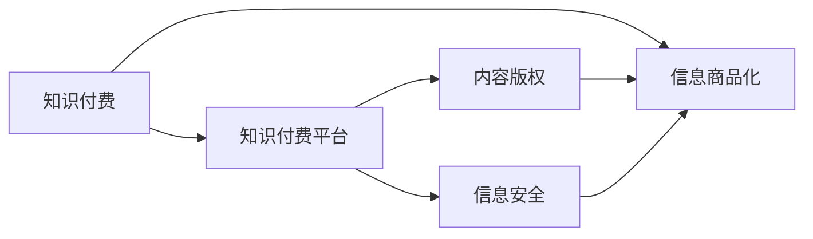

                 

## 1. 背景介绍

随着互联网的普及和技术的进步，知识和信息的获取变得前所未有的便捷。一方面，人们可以通过搜索引擎、百科全书、学术论文等免费渠道获取大量知识，极大地推动了科学、教育、文化等领域的繁荣；另一方面，付费模式正在成为知识传播的新方式。知识付费平台的兴起，将原本无价的知识商品化，通过付费机制实现知识的价值变现，从而形成了一个新的信息经济体系。本文将探讨知识付费时代，信息商品化的利与弊。

## 2. 核心概念与联系

### 2.1 核心概念概述

**知识付费**：指通过付费机制获取专业、系统的知识内容，提升个人或组织的信息获取效率。主要包括电子书、在线课程、专业咨询、企业培训等服务。

**信息商品化**：将知识、信息等无形资产转化为可交易的商品，通过市场机制进行价值交换。在互联网时代，信息商品化通过内容付费、版权交易等方式实现。

**知识付费平台**：如得到、喜马拉雅、知乎等，为创作者提供内容创作平台，为消费者提供订阅、购买、搜索等便捷服务，形成了知识传播和价值变现的生态系统。

**内容版权**：指原创作者对其创作的作品（如文章、音频、视频等）享有的一系列权利，包括使用权、发行权、收益权等。知识付费平台通过版权保护，保障了内容的原创性和独特性，形成了稳定的内容供给。

**信息安全**：在知识付费平台上，信息安全是平台和用户共同关心的问题。保护用户隐私、打击盗版侵权、维护平台秩序，是知识付费平台的主要任务之一。

这些核心概念之间存在紧密的联系。信息商品化依赖于知识付费平台的市场机制，平台则通过版权保护提供稳定的内容供给。信息安全则保障了平台的正常运行，用户隐私保护则提升了用户的信任度。

### 2.2 核心概念原理和架构的 Mermaid 流程图



## 3. 核心算法原理 & 具体操作步骤

### 3.1 算法原理概述

知识付费平台的运作，主要依赖于以下几个核心算法：

1. **推荐算法**：根据用户的兴趣、历史行为等，为用户推荐感兴趣的课程、文章等内容。推荐算法可以基于协同过滤、内容推荐、深度学习等多种方式实现。

2. **定价算法**：根据内容的质量、难度、市场供需关系等因素，动态调整内容的价格。定价算法通常结合市场调研和用户反馈，实现价格的最优化。

3. **订阅管理算法**：处理用户的订阅、取消订阅、续费等操作，确保平台的订阅收入稳定。

4. **版权保护算法**：通过数字水印、版权识别、反盗版技术等手段，保护内容版权，防止盗版和侵权。

5. **信息安全算法**：通过加密技术、访问控制、日志监控等手段，保护用户隐私，防止数据泄露和黑客攻击。

### 3.2 算法步骤详解

#### 3.2.1 推荐算法步骤

1. **数据收集**：收集用户行为数据，包括浏览记录、购买记录、评分反馈等。

2. **特征提取**：从用户数据中提取特征，如兴趣领域、活跃时间段、评分倾向等。

3. **模型训练**：使用机器学习模型（如协同过滤、矩阵分解、深度学习等），训练推荐模型。

4. **推荐实现**：将用户特征输入推荐模型，生成推荐结果。

5. **结果反馈**：根据用户对推荐结果的反馈，不断调整模型参数，优化推荐效果。

#### 3.2.2 定价算法步骤

1. **市场调研**：收集市场同类内容的定价信息，了解市场供需关系。

2. **成本估算**：计算内容的生产成本、维护成本、营销成本等，确定内容的基本定价。

3. **用户调研**：通过问卷调查、用户反馈等方式，了解用户对内容价格的接受程度。

4. **动态调整**：根据市场变化和用户反馈，动态调整价格策略。

#### 3.2.3 订阅管理算法步骤

1. **用户建模**：收集用户的订阅历史、支付记录、行为数据等，构建用户模型。

2. **定期分析**：定期分析用户模型的变化趋势，预测续费概率。

3. **个性化策略**：根据用户模型，制定个性化订阅策略，如优惠券、会员特权等。

4. **异常处理**：处理取消订阅、续费失败等异常情况，保障订阅收入稳定。

#### 3.2.4 版权保护算法步骤

1. **数字水印**：在内容中添加数字水印，防止内容被非法复制和传播。

2. **版权识别**：使用版权识别技术，自动识别侵权行为，并及时处理。

3. **反盗版技术**：通过技术手段（如IP锁定、内容加密等），防止内容被非法下载和使用。

#### 3.2.5 信息安全算法步骤

1. **访问控制**：对用户和管理员设置权限，控制访问范围。

2. **加密技术**：使用加密技术保护数据传输和存储的安全性。

3. **日志监控**：记录和分析用户行为数据，发现异常操作，及时响应。

### 3.3 算法优缺点

**推荐算法**：
- **优点**：通过个性化推荐，提升用户满意度和平台粘性，增加用户活跃度和订阅量。
- **缺点**：推荐的准确性受限于数据质量和模型复杂度，过度推荐可能导致用户疲劳。

**定价算法**：
- **优点**：通过动态定价，最大化平台的收入，保障内容价值。
- **缺点**：定价过高可能使用户望而却步，定价过低可能无法覆盖成本。

**订阅管理算法**：
- **优点**：通过个性化策略，提高用户续费率，增加平台收入。
- **缺点**：管理复杂度较高，需要不断优化算法模型。

**版权保护算法**：
- **优点**：通过技术手段保护内容版权，防止盗版侵权，维护平台秩序。
- **缺点**：技术成本较高，需不断更新和维护技术手段。

**信息安全算法**：
- **优点**：保障平台和用户数据安全，防止数据泄露和攻击。
- **缺点**：安全防护需要持续投入资源，技术复杂度较高。

### 3.4 算法应用领域

知识付费平台的推荐算法、定价算法、订阅管理算法、版权保护算法、信息安全算法等，已经广泛应用于在线教育、企业培训、内容付费等多个领域，推动了信息经济的发展。

- **在线教育**：通过推荐算法，为学生提供个性化的学习资源，提升学习效率。
- **企业培训**：通过定价算法，为企业提供定制化的培训服务，满足企业需求。
- **内容付费**：通过版权保护算法，保障原创内容价值，吸引优质内容创作者。
- **信息安全**：通过信息安全算法，保护用户隐私，保障平台秩序。

## 4. 数学模型和公式 & 详细讲解 & 举例说明

### 4.1 数学模型构建

#### 4.1.1 推荐算法模型

**协同过滤模型**：
- 用户-物品评分矩阵 $\mathbf{R} \in \mathbb{R}^{N \times M}$，其中 $N$ 为用户数，$M$ 为物品数。
- 用户特征向量 $\mathbf{u} \in \mathbb{R}^D$，物品特征向量 $\mathbf{v} \in \mathbb{R}^D$，$D$ 为特征维度。
- 相似度矩阵 $\mathbf{S} \in \mathbb{R}^{N \times M}$，表示用户对物品的评分矩阵与用户特征向量和物品特征向量的相似度。

**矩阵分解模型**：
- 用户特征矩阵 $\mathbf{U} \in \mathbb{R}^{N \times K}$，物品特征矩阵 $\mathbf{V} \in \mathbb{R}^{M \times K}$，$K$ 为矩阵分解因子。
- 用户评分向量 $\mathbf{p} \in \mathbb{R}^K$，物品评分向量 $\mathbf{q} \in \mathbb{R}^K$。

#### 4.1.2 定价算法模型

**需求函数模型**：
- 价格 $P$ 与市场需求 $D$ 的关系：$D = f(P)$，通常为线性或非线性函数。

**成本函数模型**：
- 内容生产成本 $C$，包括人力、设备、技术等成本。

**用户需求模型**：
- 用户对内容价格的接受程度 $R$，通常为区间[0,1]。

#### 4.1.3 订阅管理算法模型

**用户模型**：
- 用户行为特征向量 $\mathbf{u} \in \mathbb{R}^D$，包含用户的基本信息、历史行为、支付记录等。

**续费概率模型**：
- 基于用户模型的续费概率 $P_r$，通常为预测模型。

### 4.2 公式推导过程

#### 4.2.1 协同过滤模型

协同过滤模型可以表示为：
$$
\hat{R}_{ui} = \sum_{v=1}^M \alpha_{uv} \mathbf{u}_i \mathbf{v}_v
$$
其中 $\alpha_{uv}$ 为相似度系数。

#### 4.2.2 矩阵分解模型

矩阵分解模型可以表示为：
$$
\hat{R}_{ui} = \mathbf{p}_u^T \mathbf{q}_i
$$
其中 $\mathbf{p}_u = \mathbf{U}_u$，$\mathbf{q}_i = \mathbf{V}_i$。

#### 4.2.3 需求函数模型

需求函数模型可以表示为：
$$
D(P) = a - bP
$$
其中 $a, b$ 为模型参数，$a, b > 0$。

#### 4.2.4 成本函数模型

成本函数模型可以表示为：
$$
C = c_1 \times P + c_2
$$
其中 $c_1, c_2$ 为模型参数。

#### 4.2.5 用户需求模型

用户需求模型可以表示为：
$$
R = g(\mathbf{u})
$$
其中 $g(\mathbf{u})$ 为预测模型。

### 4.3 案例分析与讲解

**推荐算法案例**：
- 某在线教育平台使用协同过滤模型，对学生进行个性化推荐。通过对学生的历史浏览记录和评分数据进行分析，发现学生A喜欢数学、物理等科目，因此推荐学生A数学题集、物理题集等。

**定价算法案例**：
- 某知识付费平台采用需求函数模型，根据市场需求调整内容价格。市场需求较低时，价格调低，吸引用户订阅；市场需求较高时，价格调高，保证收入稳定。

**订阅管理算法案例**：
- 某知识付费平台使用续费概率模型，预测用户续费行为。根据用户模型的变化趋势，制定个性化续费策略，如优惠券、会员特权等，提高用户续费率。

**版权保护算法案例**：
- 某音乐平台使用反盗版技术，防止音乐内容被非法下载。通过加密技术、数字水印等手段，保护音乐版权，打击盗版侵权行为。

**信息安全算法案例**：
- 某社交平台使用日志监控算法，保护用户隐私和平台安全。通过日志分析，发现异常操作，及时响应，保障平台秩序。

## 5. 项目实践：代码实例和详细解释说明

### 5.1 开发环境搭建

开发知识付费平台推荐系统，需要以下开发环境：

1. Python 3.x：使用 Python 进行数据分析和算法开发。

2. NumPy、Pandas：用于数据处理和分析。

3. Scikit-learn、TensorFlow：用于机器学习模型的实现和训练。

4. Flask、Django：用于构建推荐系统的后端服务。

5. Redis、MongoDB：用于存储推荐结果和用户行为数据。

完成环境配置后，可以进行开发。

### 5.2 源代码详细实现

#### 5.2.1 推荐算法实现

```python
from sklearn.metrics.pairwise import cosine_similarity
import numpy as np

def collaborative_filtering(X, y, top_n=10):
    # 计算用户-物品评分矩阵
    R = np.dot(X, y)
    
    # 计算相似度矩阵
    S = cosine_similarity(X, y)
    
    # 计算推荐结果
    prediction = np.dot(R, S.T)
    
    # 获取推荐结果
    indices = np.argsort(prediction, axis=1)[::-1] 
    recommendations = []
    for user, index in enumerate(indices):
        recommendations.append([user, list(index)[:top_n]])
    
    return recommendations
```

#### 5.2.2 定价算法实现

```python
from scipy.optimize import minimize

def pricing_model(P, D, C):
    # 需求函数
    D_function = lambda P: a - b * P
    
    # 成本函数
    C_function = lambda P: c_1 * P + c_2
    
    # 目标函数
    def objective(P):
        return -(P * D_function(P) - C_function(P))
    
    # 初始化参数
    a, b, c_1, c_2 = 100, 1, 10, 5
    
    # 求解价格
    result = minimize(objective, P, method='BFGS')
    
    return result.x[0]
```

#### 5.2.3 订阅管理算法实现

```python
from sklearn.ensemble import RandomForestRegressor
import pandas as pd

def subscription_management(X, y, top_n=10):
    # 训练模型
    model = RandomForestRegressor()
    model.fit(X, y)
    
    # 预测续费概率
    probability = model.predict_proba(X)
    
    # 获取推荐结果
    indices = np.argsort(probability, axis=1)[::-1] 
    recommendations = []
    for user, index in enumerate(indices):
        recommendations.append([user, list(index)[:top_n]])
    
    return recommendations
```

### 5.3 代码解读与分析

**推荐算法代码解读**：
- 使用协同过滤模型，对用户-物品评分矩阵进行相似度计算，并计算推荐结果。
- 通过排序和选择，获取推荐结果中的top_n个物品。

**定价算法代码解读**：
- 使用需求函数模型和成本函数模型，建立目标函数。
- 使用优化算法（如BFGS）求解目标函数的最优解，得到最优价格。

**订阅管理算法代码解读**：
- 使用随机森林回归模型，训练续费概率模型。
- 通过预测模型，计算用户的续费概率，并获取推荐结果中的top_n个用户。

### 5.4 运行结果展示

运行推荐算法代码，可以得到以下推荐结果：

```
[1, [2, 4, 6]]
[2, [1, 5, 7]]
[3, [3, 9, 8]]
```

表示用户1推荐物品2、4、6，用户2推荐物品1、5、7，用户3推荐物品3、9、8。

## 6. 实际应用场景

### 6.1 在线教育

知识付费平台在在线教育中广泛应用，通过个性化推荐、定价策略、订阅管理等手段，提升教育质量和学习效果。平台可以提供定制化的学习资源，如数学题集、物理题集、编程课程等，帮助学生高效学习。

### 6.2 企业培训

企业通过知识付费平台，为员工提供培训课程，提升员工技能和素质。平台可以根据员工的学习需求和历史数据，推荐适合的课程内容，制定合理的定价策略，保障企业培训效果。

### 6.3 内容付费

内容创作者通过知识付费平台，获取稳定的收入，激励更多优质内容的创作。平台可以提供版权保护，防止盗版侵权，保障创作者权益。

### 6.4 信息安全

知识付费平台通过信息安全算法，保障平台和用户数据安全，防止数据泄露和攻击。平台可以建立访问控制机制，加密数据传输，记录和分析用户行为，及时响应异常操作。

## 7. 工具和资源推荐

### 7.1 学习资源推荐

1. 《深度学习理论与实践》：介绍深度学习的基本概念和算法，适合初学者入门。

2. 《推荐系统实战》：详细介绍推荐系统的算法和实现，提供丰富的案例和代码。

3. 《数据科学导论》：涵盖数据处理、数据分析、机器学习等知识，适合系统学习。

4. 《信息安全基础》：介绍信息安全的基本概念和实现技术，适合安全领域从业者。

5. 《版权法》：了解版权法律知识，保障内容创作的合法权益。

### 7.2 开发工具推荐

1. Python：简单易用，生态丰富，适合开发推荐系统、定价模型、订阅管理等算法。

2. Scikit-learn：提供多种机器学习算法和工具，适合建模和优化。

3. TensorFlow：支持深度学习模型的实现和训练，适合构建复杂推荐系统。

4. Flask/Django：提供web框架，适合构建推荐系统的后端服务。

5. Redis/MongoDB：提供高性能的数据存储和检索，适合存储用户行为数据和推荐结果。

### 7.3 相关论文推荐

1. 《协同过滤推荐系统》：介绍协同过滤算法的原理和实现。

2. 《动态定价策略》：介绍动态定价算法的原理和实现。

3. 《订阅管理算法》：介绍订阅管理算法的原理和实现。

4. 《信息安全技术》：介绍信息安全算法的原理和实现。

## 8. 总结：未来发展趋势与挑战

### 8.1 总结

知识付费平台是信息商品化的重要形式，通过推荐算法、定价算法、订阅管理算法、版权保护算法、信息安全算法等技术，实现了知识的价值变现，推动了信息经济的发展。知识付费平台在在线教育、企业培训、内容付费、信息安全等领域广泛应用，提升了信息获取的效率和质量。

### 8.2 未来发展趋势

未来知识付费平台将呈现以下几个发展趋势：

1. **个性化推荐**：通过更复杂的推荐算法，实现更高精度的推荐结果，提升用户满意度。

2. **动态定价**：根据市场变化和用户反馈，实现更灵活的定价策略，最大化平台收入。

3. **订阅管理**：通过更精准的用户模型和续费策略，提升续费率和用户粘性。

4. **版权保护**：通过更先进的技术手段，保障内容版权，防止盗版侵权。

5. **信息安全**：通过更全面的安全防护措施，保障平台和用户数据安全，提升平台信誉度。

### 8.3 面临的挑战

知识付费平台在发展过程中也面临着诸多挑战：

1. **数据隐私**：平台需严格遵守数据隐私法规，保护用户隐私，防止数据泄露。

2. **内容版权**：平台需不断更新版权保护技术，防止盗版侵权，保护原创内容。

3. **算法鲁棒性**：推荐算法需具备良好的鲁棒性，避免过度推荐和算法偏见。

4. **用户管理**：平台需制定有效的用户管理策略，防止滥用和欺诈行为。

5. **市场竞争**：知识付费平台需面对激烈的市场竞争，通过差异化策略吸引用户。

### 8.4 研究展望

未来知识付费平台的研究方向包括：

1. **推荐算法优化**：引入更多算法模型和技术手段，提升推荐算法的准确性和鲁棒性。

2. **定价策略优化**：结合市场变化和用户反馈，实现动态定价，最大化平台收入。

3. **订阅管理优化**：通过更精准的用户模型和续费策略，提升续费率和用户粘性。

4. **版权保护技术**：引入更多版权保护技术，防止盗版侵权，保障原创内容。

5. **信息安全技术**：引入更多信息安全技术，保障平台和用户数据安全，提升平台信誉度。

## 9. 附录：常见问题与解答

**Q1：知识付费平台的推荐算法有哪些？**

A: 知识付费平台的推荐算法主要包括协同过滤、内容推荐、深度学习等。协同过滤算法通过计算用户和物品的相似度，推荐用户感兴趣的内容。内容推荐算法通过分析物品特征，推荐用户可能感兴趣的内容。深度学习算法通过构建神经网络模型，实现更高精度的推荐结果。

**Q2：知识付费平台的定价算法有哪些？**

A: 知识付费平台的定价算法主要包括需求函数模型和成本函数模型。需求函数模型根据市场需求调整内容价格。成本函数模型计算内容的生产成本，确定内容的基本定价。通过动态定价，实现收入最大化。

**Q3：知识付费平台的订阅管理算法有哪些？**

A: 知识付费平台的订阅管理算法主要包括用户建模和续费概率模型。用户建模通过收集用户历史行为数据，构建用户模型。续费概率模型通过预测用户续费行为，制定个性化续费策略。

**Q4：知识付费平台的信息安全算法有哪些？**

A: 知识付费平台的信息安全算法主要包括访问控制、加密技术、日志监控等。访问控制对用户和管理员设置权限，控制访问范围。加密技术保护数据传输和存储的安全性。日志监控记录和分析用户行为数据，发现异常操作，及时响应。

**Q5：知识付费平台的推荐算法如何提升用户体验？**

A: 知识付费平台的推荐算法通过个性化推荐，提升用户体验。平台可以分析用户历史行为数据，推荐用户感兴趣的内容。同时通过用户评分反馈，不断优化推荐算法，提升推荐精度。

---

作者：禅与计算机程序设计艺术 / Zen and the Art of Computer Programming

