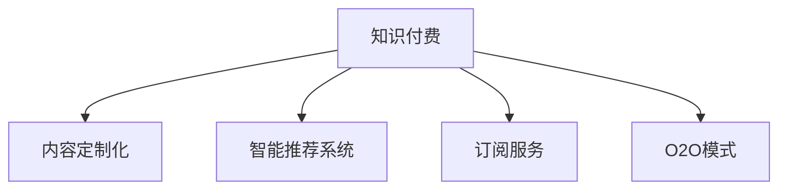

                 

# 知识付费要及时调整策略,满足用户需求

## 1. 背景介绍

### 1.1 问题由来
近年来，知识付费市场迅速崛起，成为互联网经济的一个重要分支。消费者愿意为获得优质内容付费，这反映了人们对高质量知识资源的需求。然而，传统知识付费的单一模式难以满足多样化的用户需求，面临着市场萎缩和用户流失的风险。为了应对这一挑战，知识付费平台需要及时调整策略，创新服务模式，以实现可持续发展。

### 1.2 问题核心关键点
知识付费市场主要面临以下问题：
- **内容同质化**：大量平台提供类似内容，用户难以找到有价值的差异化内容。
- **付费体验差**：部分平台的服务质量和服务体验不佳，导致用户流失。
- **用户需求变化**：用户需求日益多元化，知识付费平台需要更加注重用户定制化服务。
- **技术应用不足**：部分平台缺乏技术创新，难以提供智能化、个性化的知识服务。

这些问题亟需知识付费平台采取有效措施加以解决，以提升用户体验，增强平台竞争力。

## 2. 核心概念与联系

### 2.1 核心概念概述

为更好地理解知识付费策略调整的相关问题，本节将介绍几个核心概念：

- **知识付费**：指消费者为获得专业知识和信息而支付费用的服务模式。包括在线课程、电子书、咨询服务等多种形式。
- **内容定制化**：根据用户需求，提供个性化、差异化的内容服务，满足用户的个性化需求。
- **智能推荐系统**：利用人工智能技术，分析用户行为，推荐符合用户兴趣和需求的内容。
- **订阅服务**：用户支付固定费用，定期获取内容，包括单次付费和长期订阅两种形式。
- **O2O模式**：线上与线下相结合的服务模式，提供在线预约、线下课程或服务。

这些核心概念之间通过以下Mermaid流程图展示它们之间的联系：



## 3. 核心算法原理 & 具体操作步骤
### 3.1 算法原理概述

知识付费平台调整策略的核心在于优化用户体验，提供更符合用户需求的内容和服务。这可以通过以下算法原理实现：

- **用户画像构建**：利用用户行为数据，构建用户画像，分析用户的兴趣和需求。
- **内容推荐算法**：结合用户画像和内容特征，推荐用户感兴趣的内容。
- **个性化定价策略**：根据用户价值和需求，灵活调整定价策略，提供差异化服务。
- **互动式学习体验**：通过在线互动、虚拟现实等技术，提升学习体验。
- **反馈优化**：收集用户反馈，持续优化内容和推荐系统。

### 3.2 算法步骤详解

**Step 1: 数据收集与预处理**
- 收集用户注册、学习行为、支付记录等数据。
- 清洗数据，去除异常值和噪声，确保数据质量。

**Step 2: 用户画像构建**
- 使用聚类、分类等机器学习算法，对用户行为进行分析和建模。
- 提取用户兴趣、偏好、学习频率等关键特征，构建用户画像。

**Step 3: 内容推荐算法设计**
- 选择适合的内容推荐算法，如协同过滤、基于内容的推荐等。
- 利用用户画像和内容特征，进行内容匹配和推荐。
- 引入动态更新机制，实时调整推荐结果。

**Step 4: 定价策略制定**
- 根据用户价值、市场竞争等关键因素，制定差异化定价策略。
- 使用A/B测试等方法，评估定价策略的效果。

**Step 5: 技术平台搭建**
- 搭建智能推荐系统，集成自然语言处理、图像识别等技术。
- 部署O2O服务系统，连接线上与线下资源。
- 提供互动式学习平台，提升用户体验。

**Step 6: 运营与优化**
- 监控用户行为，收集反馈，持续优化推荐算法和定价策略。
- 定期更新课程内容，保持服务质量。
- 推出新功能和服务，提升用户粘性。

### 3.3 算法优缺点

智能推荐系统等算法在知识付费平台中具有以下优点：
- **提升用户体验**：个性化推荐满足用户多样化需求，提升用户满意度。
- **增加用户粘性**：持续优化推荐内容，增加用户停留时间和活跃度。
- **降低流失率**：精准推荐和个性化服务减少用户流失。

同时，这些算法也存在一定的局限性：
- **数据隐私问题**：用户数据的收集和使用可能引发隐私保护问题。
- **算法偏见**：推荐算法可能存在偏见，导致推荐结果不公正。
- **计算资源消耗**：推荐系统需要大量计算资源，可能影响系统性能。
- **用户认知障碍**：部分用户对智能推荐结果存在认知障碍，可能影响其决策。

### 3.4 算法应用领域

智能推荐系统等算法在知识付费平台中的应用主要包括以下几个领域：

- **在线课程推荐**：根据用户兴趣和行为，推荐相关课程。
- **电子书推荐**：分析用户阅读习惯，推荐感兴趣的电子书。
- **咨询服务推荐**：基于用户需求，推荐合适的专家和咨询方案。
- **线下活动推荐**：结合用户兴趣和地理位置，推荐线下活动和学习机会。
- **产品推荐**：推荐相关教育产品和学习资源，如学习工具、学习伙伴等。

## 4. 数学模型和公式 & 详细讲解 & 举例说明

### 4.1 数学模型构建

知识付费平台的智能推荐系统可以建模为一个图模型，其中节点为用户和内容，边表示用户对内容的兴趣度。设$G(V,E)$为图模型，其中$V$为节点集合，$E$为边集合，$A$为节点属性集合，$B$为边属性集合。

**用户画像构建**：
用户画像可以用向量表示，设$P$为用户画像向量，$C$为内容特征向量。用户画像构建的目标是最大化$P \times C$的内积。

**内容推荐算法**：
推荐算法可以表示为$Reco(P, A)$，其中$Reco$为推荐函数，$A$为推荐算法参数。推荐函数通过用户画像和算法参数，生成推荐内容列表。

**定价策略制定**：
定价策略可以表示为$Price(P, B)$，其中$B$为定价因素向量。定价策略的目标是根据用户画像和定价因素，计算用户的期望价格。

**互动式学习体验**：
互动式学习体验可以通过$Inter(P, U)$来表示，其中$U$为互动体验向量。互动体验的目标是根据用户画像，提供个性化的互动学习体验。

### 4.2 公式推导过程

以下我们以协同过滤算法为例，推导其推荐函数公式。

设用户画像向量为$P$，内容特征向量为$C$，协同过滤算法中的用户-内容关联矩阵为$M$，其中$M_{ij}$表示用户$i$对内容$j$的兴趣度。

协同过滤算法可以通过用户-内容关联矩阵$M$进行推荐，推荐函数公式为：

$$
Reco(P, A) = \max_{j}(P \times C_j \times M_{ij})
$$

其中$C_j$为内容$j$的特征向量，$i$为用户$i$，$j$为内容$j$。

**定价策略公式**：
假设用户的期望价格为$Price$，内容$j$的定价为$P_j$，用户的价值为$V$，则定价策略公式为：

$$
Price(P, B) = \min(V \times P_j \times B)
$$

**互动式学习体验公式**：
假设用户的期望互动体验值为$Inter$，用户$i$对内容$j$的互动体验为$U_{ij}$，则互动式学习体验公式为：

$$
Inter(P, U) = \max(P \times U_{ij})
$$

### 4.3 案例分析与讲解

**案例一：在线课程推荐**
某知识付费平台采用协同过滤算法，构建用户画像，通过分析用户学习行为和内容访问记录，生成个性化推荐列表。用户A对数据科学课程感兴趣，平台通过协同过滤算法推荐了多门相关课程，并根据用户A的交互行为进行动态更新，最终推荐了最符合用户需求的课程B，显著提高了用户A的学习效率和满意度。

**案例二：电子书推荐**
另一平台通过分析用户阅读偏好和评价数据，利用基于内容的推荐算法，推荐用户C感兴趣的电子书。用户C对心理类书籍特别感兴趣，平台通过算法推荐了《心理学的力量》一书，用户C阅读后非常满意，平台上也获得了良好的口碑，平台用户粘性进一步提升。

## 5. 项目实践：代码实例和详细解释说明

### 5.1 开发环境搭建

在进行智能推荐系统开发前，我们需要准备好开发环境。以下是使用Python进行TensorFlow开发的环境配置流程：

1. 安装Anaconda：从官网下载并安装Anaconda，用于创建独立的Python环境。

2. 创建并激活虚拟环境：
```bash
conda create -n tf-env python=3.7 
conda activate tf-env
```

3. 安装TensorFlow：根据CUDA版本，从官网获取对应的安装命令。例如：
```bash
conda install tensorflow==2.3 -c tf -c conda-forge
```

4. 安装Keras：用于高层次神经网络建模。
```bash
pip install keras
```

5. 安装Flask：用于搭建推荐系统API服务。
```bash
pip install flask
```

6. 安装Pandas和NumPy：用于数据处理和分析。
```bash
pip install pandas numpy
```

完成上述步骤后，即可在`tf-env`环境中开始智能推荐系统的开发。

### 5.2 源代码详细实现

这里我们以协同过滤算法为例，给出使用TensorFlow和Keras实现在线课程推荐系统的PyTorch代码实现。

首先，定义课程数据集：

```python
import pandas as pd
from sklearn.model_selection import train_test_split

# 加载课程数据集
df = pd.read_csv('courses.csv')

# 划分训练集和测试集
train_df, test_df = train_test_split(df, test_size=0.2, random_state=42)

# 数据预处理
train_df = train_df.dropna()
train_df = train_df.drop_duplicates()
train_df = train_df[['user_id', 'course_id', 'rating']]
train_df.columns = ['user_id', 'course_id', 'rating']

# 构建用户-内容关联矩阵
user_id = train_df['user_id'].astype('int')
course_id = train_df['course_id'].astype('int')
rating = train_df['rating'].astype('int')
user_content_matrix = pd.DataFrame({course_id: rating, user_id: 0})
user_content_matrix = user_content_matrix.groupby('user_id').apply(lambda x: x.groupby('course_id').rating.sum())
user_content_matrix = user_content_matrix.reset_index(drop=True)
user_content_matrix.to_csv('user_content_matrix.csv')
```

然后，定义模型和推荐函数：

```python
from tensorflow.keras.layers import Dense, Input
from tensorflow.keras.models import Model

# 定义用户画像模型
user_profile = Input(shape=(1,), name='user')
user_feature = Dense(64, activation='relu')(user_profile)
user_profile_model = Model(inputs=user_profile, outputs=user_feature)

# 定义内容特征模型
content_profile = Input(shape=(1,), name='content')
content_feature = Dense(64, activation='relu')(content_profile)
content_profile_model = Model(inputs=content_profile, outputs=content_feature)

# 定义推荐模型
user_content_matrix = pd.read_csv('user_content_matrix.csv', index_col='user_id', parse_dates=True)
user_content_matrix = user_content_matrix.as_matrix()
user_content_matrix = user_content_matrix.astype('float32') / np.max(user_content_matrix)

reco_matrix = user_content_matrix
reco_matrix = reco_matrix / np.max(reco_matrix)
reco_matrix = reco_matrix - 1
reco_matrix = reco_matrix / np.max(np.abs(reco_matrix))
reco_matrix = reco_matrix
reco_matrix = reco_matrix / np.max(np.abs(reco_matrix))
reco_matrix = reco_matrix

# 构建推荐函数
reco_model = Dense(1, activation='sigmoid')(reco_matrix)
reco_model = reco_model

def reco(user_profile, content_profile):
    user_feature = user_profile_model.predict(user_profile)
    content_feature = content_profile_model.predict(content_profile)
    user_content_matrix = np.dot(user_feature, content_feature.T)
    reco = reco_model.predict(user_content_matrix)
    return reco
```

最后，启动推荐系统API：

```python
from flask import Flask, request

app = Flask(__name__)

@app.route('/reco', methods=['POST'])
def reco_service():
    user_profile = request.json['user_profile']
    content_profile = request.json['content_profile']
    reco = reco(user_profile, content_profile)
    return {'reco': reco}

if __name__ == '__main__':
    app.run(debug=True)
```

以上就是使用TensorFlow和Keras实现在线课程推荐系统的完整代码实现。可以看到，TensorFlow配合Keras使得在线课程推荐系统的开发过程简洁高效。开发者可以将更多精力放在数据处理、模型改进等高层逻辑上，而不必过多关注底层的实现细节。

## 6. 实际应用场景
### 6.1 智能客服系统

基于智能推荐系统技术的智能客服系统，能够快速响应客户咨询，提供个性化的服务。在技术实现上，可以收集企业内部的历史客服对话记录，将问题和最佳答复构建成监督数据，在此基础上对智能推荐系统进行微调。微调后的系统能够自动理解用户意图，匹配最合适的答复，进一步提升客户满意度。

### 6.2 金融舆情监测

金融机构需要实时监测市场舆论动向，以便及时应对负面信息传播，规避金融风险。传统的人工监测方式成本高、效率低，难以应对网络时代海量信息爆发的挑战。基于智能推荐系统的文本分类和情感分析技术，为金融舆情监测提供了新的解决方案。

具体而言，可以收集金融领域相关的新闻、报道、评论等文本数据，并对其进行主题标注和情感标注。在此基础上对智能推荐系统进行微调，使其能够自动判断文本属于何种主题，情感倾向是正面、中性还是负面。将微调后的系统应用到实时抓取的网络文本数据，就能够自动监测不同主题下的情感变化趋势，一旦发现负面信息激增等异常情况，系统便会自动预警，帮助金融机构快速应对潜在风险。

### 6.3 个性化推荐系统

当前的推荐系统往往只依赖用户的历史行为数据进行物品推荐，无法深入理解用户的真实兴趣偏好。基于智能推荐系统的个性化推荐系统可以更好地挖掘用户行为背后的语义信息，从而提供更精准、多样的推荐内容。

在实践中，可以收集用户浏览、点击、评论、分享等行为数据，提取和用户交互的物品标题、描述、标签等文本内容。将文本内容作为模型输入，用户的后续行为（如是否点击、购买等）作为监督信号，在此基础上微调智能推荐系统。微调后的系统能够从文本内容中准确把握用户的兴趣点。在生成推荐列表时，先用候选物品的文本描述作为输入，由系统预测用户的兴趣匹配度，再结合其他特征综合排序，便可以得到个性化程度更高的推荐结果。

### 6.4 未来应用展望

随着智能推荐系统的不断发展，其在更多领域的应用前景将会更加广阔。

在智慧医疗领域，基于智能推荐系统的医疗问答、病历分析、药物研发等应用将提升医疗服务的智能化水平，辅助医生诊疗，加速新药开发进程。

在智能教育领域，智能推荐系统可应用于作业批改、学情分析、知识推荐等方面，因材施教，促进教育公平，提高教学质量。

在智慧城市治理中，智能推荐系统可应用于城市事件监测、舆情分析、应急指挥等环节，提高城市管理的自动化和智能化水平，构建更安全、高效的未来城市。

此外，在企业生产、社会治理、文娱传媒等众多领域，智能推荐系统也将不断涌现，为传统行业数字化转型升级提供新的技术路径。相信随着技术的日益成熟，智能推荐系统必将在构建人机协同的智能时代中扮演越来越重要的角色。

## 7. 工具和资源推荐
### 7.1 学习资源推荐

为了帮助开发者系统掌握智能推荐系统的理论基础和实践技巧，这里推荐一些优质的学习资源：

1. 《推荐系统实战》系列博文：由大模型技术专家撰写，深入浅出地介绍了推荐系统原理、技术实现和实际案例。

2. Coursera《推荐系统》课程：斯坦福大学开设的推荐系统课程，系统介绍推荐系统的基本概念和应用技术。

3. 《推荐系统算法》书籍：推荐系统领域的经典教材，涵盖推荐系统的各种算法和技术实现。

4. KDD Cup推荐系统竞赛：全球顶级推荐系统竞赛，每年吸引大量选手参与，可以获得实战经验的平台。

通过对这些资源的学习实践，相信你一定能够快速掌握智能推荐系统的精髓，并用于解决实际的推荐问题。
### 7.2 开发工具推荐

高效的开发离不开优秀的工具支持。以下是几款用于智能推荐系统开发的常用工具：

1. Python：Python拥有丰富的第三方库和框架，适合快速迭代研究。
2. TensorFlow：谷歌主导的深度学习框架，适合大规模工程应用。
3. Keras：高层次的神经网络库，简单易用，适合快速原型开发。
4. Scikit-learn：简单易用的机器学习库，适合数据分析和模型训练。
5. Flask：轻量级的Web框架，适合快速搭建API服务。

合理利用这些工具，可以显著提升智能推荐系统的开发效率，加快创新迭代的步伐。

### 7.3 相关论文推荐

智能推荐系统的研究源于学界的持续研究。以下是几篇奠基性的相关论文，推荐阅读：

1. Matrix Factorization Techniques for Recommender Systems（矩阵分解推荐系统）：经典推荐系统方法，基于用户-物品矩阵分解，揭示用户与物品之间的隐含关系。

2. A Deep Learning Approach for Recommender Systems（深度学习推荐系统）：利用深度学习模型进行推荐，提升推荐系统的性能和多样性。

3. Multi-Task Learning for Recommender Systems（多任务学习推荐系统）：通过多任务学习提升推荐系统的泛化能力和准确性。

4. Transfer Learning for Recommendation Systems（迁移学习推荐系统）：将预训练模型应用于推荐系统，提升推荐系统的跨领域迁移能力。

5. Attention-based Recommender Systems（基于注意力的推荐系统）：引入注意力机制，提升推荐系统对用户兴趣和需求变化的响应速度。

这些论文代表了大语言模型微调技术的发展脉络。通过学习这些前沿成果，可以帮助研究者把握学科前进方向，激发更多的创新灵感。

## 8. 总结：未来发展趋势与挑战
### 8.1 总结

本文对智能推荐系统调整策略进行了全面系统的介绍。首先阐述了智能推荐系统在知识付费平台中的重要作用，明确了优化用户体验、提供更符合用户需求的内容和服务的重要性。其次，从原理到实践，详细讲解了智能推荐系统的数学模型和算法流程，给出了完整的推荐系统代码实现。同时，本文还广泛探讨了智能推荐系统在多个行业领域的应用前景，展示了其巨大的潜力。最后，本文精选了智能推荐系统的各类学习资源，力求为读者提供全方位的技术指引。

通过本文的系统梳理，可以看到，智能推荐系统正在成为知识付费平台的重要范式，极大地拓展了知识付费平台的应用边界，催生了更多的落地场景。受益于大规模语料的预训练和深度学习的深度挖掘，智能推荐系统以更低的时间和标注成本，在小样本条件下也能取得不俗的效果，有力推动了知识付费平台的产业化进程。未来，伴随预训练语言模型和微调方法的持续演进，相信智能推荐系统必将在构建人机协同的智能时代中扮演越来越重要的角色。

### 8.2 未来发展趋势

展望未来，智能推荐系统的发展趋势主要包括以下几个方面：

1. **个性化推荐技术**：随着个性化推荐技术的发展，智能推荐系统将更加精准和智能化，用户满意度和粘性将进一步提升。

2. **多模态推荐**：未来的推荐系统将不仅限于文本推荐，还将涉及多模态数据，如图像、视频、音频等，实现更全面、更丰富的推荐服务。

3. **实时推荐**：推荐系统将具备实时更新的能力，能够根据用户即时行为和反馈进行动态调整，提高推荐效果。

4. **跨领域推荐**：智能推荐系统将实现跨领域推荐，结合不同领域的知识，提升推荐系统的多样性和丰富性。

5. **隐私保护**：推荐系统将更加注重隐私保护，采用隐私保护技术，如差分隐私、联邦学习等，确保用户数据安全。

6. **深度学习**：深度学习技术将进一步应用于推荐系统，提升推荐系统的性能和效果。

### 8.3 面临的挑战

尽管智能推荐系统已经取得了瞩目成就，但在迈向更加智能化、普适化应用的过程中，它仍面临着诸多挑战：

1. **数据隐私问题**：用户数据的收集和使用可能引发隐私保护问题，如何合理使用用户数据是智能推荐系统面临的一大挑战。

2. **算法偏见**：推荐算法可能存在偏见，导致推荐结果不公正，如何消除算法偏见是推荐系统需要解决的重要问题。

3. **计算资源消耗**：推荐系统需要大量计算资源，可能影响系统性能，如何优化算法和模型结构，提高系统效率是推荐系统发展的关键。

4. **用户认知障碍**：部分用户对推荐结果存在认知障碍，可能影响其决策，如何提升推荐系统的可解释性是推荐系统需要关注的另一个重要方面。

5. **系统稳定性**：推荐系统的稳定性对用户体验至关重要，如何确保系统稳定运行，避免崩溃和故障，是推荐系统发展的另一大挑战。

6. **用户粘性**：如何通过推荐系统提升用户粘性，保持用户长期活跃，是推荐系统面临的又一挑战。

### 8.4 研究展望

面对智能推荐系统面临的挑战，未来的研究需要在以下几个方面寻求新的突破：

1. **隐私保护技术**：研究更加安全和透明的隐私保护技术，确保用户数据的安全和隐私。

2. **公平性算法**：开发更加公平和公正的推荐算法，消除推荐系统中的算法偏见。

3. **深度学习优化**：优化深度学习模型，提高推荐系统的性能和效率，减少计算资源消耗。

4. **可解释性提升**：增强推荐系统的可解释性，提升用户的信任度和满意度。

5. **跨领域推荐技术**：研究跨领域推荐技术，提升推荐系统的多样性和丰富性。

6. **系统稳定性技术**：研究系统稳定性技术，确保推荐系统长期稳定运行。

这些研究方向将引领智能推荐系统走向更加成熟和可靠，为构建更加智能、普适的推荐系统奠定坚实基础。面向未来，智能推荐系统需要在数据、算法、工程、用户体验等多个维度进行全面优化，方能真正实现个性化推荐的目标。

## 9. 附录：常见问题与解答
### 附录

**Q1：智能推荐系统如何实现个性化推荐？**

A: 智能推荐系统通过收集用户行为数据，构建用户画像，结合用户画像和内容特征，进行推荐匹配。利用协同过滤、基于内容的推荐等算法，动态更新推荐结果，确保推荐内容符合用户兴趣和需求。

**Q2：智能推荐系统如何处理多模态数据？**

A: 智能推荐系统可以引入多模态数据，如图像、视频、音频等，结合自然语言处理技术，进行多模态推荐。利用深度学习模型，提取多模态数据的特征，进行多模态匹配，提升推荐效果。

**Q3：智能推荐系统如何优化模型结构？**

A: 智能推荐系统可以通过特征工程、模型压缩、模型并行等方法，优化模型结构，提升推荐系统性能和效率。特征工程可以提取更有意义的特征，提高推荐系统的准确性。模型压缩可以减小模型规模，降低计算资源消耗。模型并行可以加速模型训练，提升推荐系统响应速度。

**Q4：智能推荐系统如何保护用户隐私？**

A: 智能推荐系统可以通过差分隐私、联邦学习等隐私保护技术，保护用户隐私。差分隐私可以确保用户数据的安全和隐私，联邦学习可以在不共享用户数据的前提下，进行模型训练和更新。

**Q5：智能推荐系统如何提升用户粘性？**

A: 智能推荐系统可以通过提供个性化服务、定期更新推荐内容、引入互动功能等方式，提升用户粘性。个性化服务可以根据用户需求和兴趣，提供定制化内容。定期更新推荐内容可以保持用户的新鲜感，提升用户活跃度。引入互动功能可以增加用户参与度，提升用户满意度。

通过这些技术手段，智能推荐系统可以进一步优化用户体验，提高用户满意度和粘性，实现可持续发展。总之，智能推荐系统需要在数据、算法、工程、用户体验等多个维度进行全面优化，方能真正实现个性化推荐的目标。

---

作者：禅与计算机程序设计艺术 / Zen and the Art of Computer Programming

