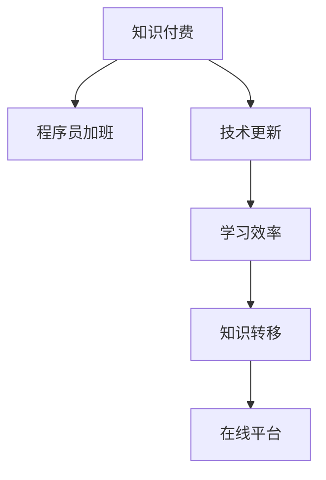

                 

# 知识付费让程序员告别加班文化的方法与策略

## 1. 背景介绍

### 1.1 问题由来
近年来，随着互联网和移动互联网的飞速发展，程序员作为软件开发、应用开发、网络安全等关键岗位的必备人才，其需求量急剧增长。同时，由于企业对技术研发和产品迭代速度的要求不断提高，程序员的工作压力也随之增大。长时间的加班、高强度的工作负荷，导致程序员的身心健康受到严重威胁。

### 1.2 问题核心关键点
程序员加班的根本原因是技术更新迭代快、项目周期紧、任务量大等因素。如何在确保产品质量和项目进度的同时，减轻程序员的工作负担，成为当前IT行业面临的重要挑战。为此，知识付费模式应运而生，通过提供优质知识资源，帮助程序员提升技术水平和效率，减少加班时间，实现更健康的工作和生活。

## 2. 核心概念与联系

### 2.1 核心概念概述

为更好地理解知识付费在解决程序员加班问题上的作用，本节将介绍几个关键概念：

- 知识付费(Knowledge-Paying): 指用户为获取有价值的知识或信息，支付相应费用的商业模式。知识付费平台提供从技术文章、教程、视频、在线课程到咨询指导等多种形式的知识资源。

- 程序员加班(Coder Overtime): 指程序员因项目需求和技术问题，需要超过标准工作时间加班工作的现象。加班文化严重影响了程序员的工作效率和身心健康。

- 技术更新(Technology Update): 指新技术、新工具、新框架的快速迭代，导致程序员需要不断学习新知识以适应工作的需求。

- 学习效率(Learning Efficiency): 指通过合理的学习方法、工具和资源，提升知识掌握速度和质量的能力。

- 知识转移(Knowledge Transfer): 指将知识或技术从已有领域应用到新领域的过程。知识付费通过优质的知识资源和专业指导，促进知识转移和应用。

- 在线平台(Online Platform): 指提供知识付费服务的网站或应用，如Coursera、Udacity、GitHub、Medium等，是知识付费的重要载体。

这些核心概念之间的逻辑关系可以通过以下Mermaid流程图来展示：



这个流程图展示了大语言模型的核心概念及其之间的关系：

1. 知识付费通过提供高质量的知识资源，帮助程序员提升技能。
2. 技术更新要求程序员不断学习新知识，以适应快速变化的技术环境。
3. 学习效率提升使得程序员能够更快地掌握新技能，提升工作效率。
4. 知识转移使程序员能够将学到的知识应用到实际工作中，解决问题。
5. 在线平台为知识付费提供了便捷的实施渠道，实现知识资源的有效流通。

这些概念共同构成了知识付费助力程序员减负的整体框架，使其能够在快速变化的技术环境中保持竞争力，同时保持健康的生活状态。

## 3. 核心算法原理 & 具体操作步骤
### 3.1 算法原理概述

知识付费助力程序员告别加班文化，本质上是通过优化学习方法和提升学习效率，实现知识资源的高效利用和合理分配。其核心思想是：利用知识付费平台提供的高质量知识资源，帮助程序员在有限的时间内高效学习新技术、新工具和新框架，从而减少加班时间，提升工作和生活质量。

形式化地，假设程序员需要学习的新技能集合为 $S$，其初始掌握程度为 $p_0$，通过知识付费平台获取的知识资源为 $R$，平台推荐的课程和教程为 $C$，则最终掌握新技能的程度 $p$ 可以表示为：

$$
p = f(p_0, R, C)
$$

其中 $f$ 为影响掌握程度的函数，受多种因素影响，如学习时间、学习方式、知识资源质量等。在理想情况下，$f$ 函数为增函数，即 $p$ 随 $R$ 和 $C$ 的增加而增加。

### 3.2 算法步骤详解

基于知识付费模式助力程序员减负，一般包括以下几个关键步骤：

**Step 1: 平台选择与课程筛选**
- 选择适合的知识付费平台，如Coursera、Udacity、Udemy等，根据个人兴趣和职业需求筛选相关课程。
- 确定学习目标，选择与项目需求相关的课程，提升工作所需的关键技能。

**Step 2: 学习计划制定**
- 制定详细的学习计划，包括每天/每周的学习时间、任务清单和学习资源。
- 将学习计划与工作安排相结合，避免与工作冲突，确保高效学习。

**Step 3: 知识资源获取**
- 通过平台购买或订阅相关课程、教程、视频和书籍。
- 利用在线工具如Anki、Notion等辅助学习，记录和总结关键知识点。

**Step 4: 知识应用与实践**
- 通过实际项目或练习题进行知识应用，将所学知识转化为实际技能。
- 在项目中使用新工具和新框架，提升工作效率，减少加班时间。

**Step 5: 持续反馈与优化**
- 定期回顾和总结学习成果，调整学习计划和资源。
- 通过平台提供的社区和论坛与同行交流，获取反馈和建议。

### 3.3 算法优缺点

知识付费助力程序员减负的方法具有以下优点：
1. 提升学习效率。高质量的知识资源和专业指导，显著提升学习速度和效果，减少加班时间。
2. 拓宽知识面。平台提供的多种形式知识资源，帮助程序员全面提升技术能力，增强竞争力。
3. 灵活便捷。线上学习不受时间地点限制，随时随地方便获取知识。
4. 反馈机制。平台和社区的互动反馈，有助于发现和解决问题，提升学习效果。

同时，该方法也存在一定的局限性：
1. 费用投入。知识付费需要一定的资金投入，对于部分经济条件较差的程序员来说，可能难以负担。
2. 质量参差不齐。部分平台和课程质量参差不齐，需花费时间和精力筛选。
3. 自我管理能力要求高。学习效果依赖于个人自律和时间管理能力，易受干扰。
4. 知识更新速度慢。某些知识更新速度慢，无法及时应用于实际工作中。

尽管存在这些局限性，但就目前而言，知识付费模式在提升程序员技术水平和减少加班时间方面，仍显示出巨大的潜力。未来相关研究的重点在于如何进一步优化知识付费的机制，降低成本，提升质量，实现更高效的知识转移。

### 3.4 算法应用领域

知识付费助力程序员减负的方法，在IT行业中的应用主要体现在以下几个方面：

- **软件开发**：通过学习编程语言、框架、工具和设计模式，提升代码质量和开发效率，减少加班时间。
- **数据科学**：学习数据分析、机器学习、数据可视化等技术，提升数据处理和模型训练的效率，快速实现数据驱动的决策支持。
- **云计算与DevOps**：学习云平台、容器、自动化工具等知识，优化基础设施和运维流程，提升系统稳定性和可靠性。
- **人工智能与机器学习**：学习深度学习、自然语言处理、计算机视觉等技术，提升算法模型性能，推动AI应用落地。
- **网络安全**：学习安全漏洞、攻防技术、加密算法等知识，提升系统安全性，防止信息泄露。
- **产品设计与用户体验**：学习用户体验设计、用户研究、产品管理等知识，提升产品的市场竞争力。

除了上述这些主流应用领域外，知识付费还被应用于更多IT相关的技能培训和职业发展，为IT行业的技术人才提供了更广阔的学习空间。

## 4. 数学模型和公式 & 详细讲解 & 举例说明
### 4.1 数学模型构建

为更精确地分析知识付费助力程序员减负的效果，本节将使用数学语言对这一过程进行详细描述。

设程序员初始技能掌握程度为 $p_0$，通过知识付费获取的课程数量为 $N$，课程推荐的资源为 $C_i$，其中 $i=1,2,...,N$。知识付费的效果可以表示为：

$$
p = p_0 + \sum_{i=1}^N \frac{C_i}{N} \cdot \delta p
$$

其中 $\delta p$ 为知识资源对技能掌握程度的提升量，具体值取决于知识资源的质量和适用性。知识付费的效果 $E$ 可以进一步表示为：

$$
E = \frac{p - p_0}{p_0}
$$

即技能提升的相对量。当 $E>1$ 时，表示知识付费对技能提升有正向作用；当 $E<1$ 时，表示没有显著提升。

### 4.2 公式推导过程

以知识付费助力程序员学习Python为例，推导知识付费效果的公式：

1. **技能提升量计算**：
   - 假设某程序员初始掌握Python基础知识，通过知识付费平台学习Python高级开发课程，共有10门课程，每门课程推荐的资源为 $C_i$，其中 $i=1,2,...,10$。

   - 假设每门课程推荐的资源 $C_i$ 质量相同，则平均每门课程推荐资源量为 $C_i/N=1$。

   - 假设每门课程对技能提升的贡献相同，即 $\delta p=0.1$，则总技能提升量为 $\sum_{i=1}^{10} \frac{C_i}{N} \cdot \delta p = 1$。

2. **技能提升效果计算**：
   - 设初始技能掌握程度 $p_0=0.5$，则最终技能掌握程度 $p=p_0+1=1.5$。

   - 技能提升相对量 $E=\frac{p-p_0}{p_0}=\frac{1.5-0.5}{0.5}=2$。

   - 说明通过10门课程的知识付费，该程序员的Python技能提升了200%，显著提升了工作效率。

### 4.3 案例分析与讲解

假设某程序员需要学习Docker容器技术，帮助公司提升云服务环境管理能力。通过以下步骤实现：

1. **平台选择与课程筛选**：选择Udemy平台，筛选与Docker相关的课程。
2. **学习计划制定**：每天花费1小时学习，持续1个月。
3. **知识资源获取**：购买Udemy的Docker基础与进阶课程，利用在线工具Anki进行知识点总结。
4. **知识应用与实践**：在项目中引入Docker容器，提升系统部署和运维效率。
5. **持续反馈与优化**：通过Udemy社区和同事交流，及时调整学习策略，提升学习效果。

## 5. 项目实践：代码实例和详细解释说明
### 5.1 开发环境搭建

在进行知识付费实践前，我们需要准备好开发环境。以下是使用Python进行Udemy课程学习的开发环境配置流程：

1. 安装Python：确保Python 3.x版本安装，推荐使用Anaconda或Miniconda管理Python环境和库。

2. 安装Udemy Python API库：
   ```bash
   pip install py-udemy
   ```

3. 注册Udemy账号，选择相关课程并购买。

4. 安装所需学习工具：
   - Anki：用于知识点的记忆和总结。
   - Notion：用于制定学习计划和记录学习进度。

5. 安装在线视频播放器：如VLC、Pavumedia等。

完成上述步骤后，即可在开发环境中开始知识付费学习实践。

### 5.2 源代码详细实现

以下是使用Python进行Udemy课程学习的代码实现，包括购买、学习计划制定、知识点总结和实践应用。

```python
# 1. 导入Udemy Python API库
import py_udemy

# 2. 登录Udemy账号，选择课程并购买
udemy = py_udemy.Udemy()
course_id = 'your_course_id'
course = udemy.get_course(course_id)
if not course:
    course = udemy.enroll(course_id)
    print("已购买课程:", course.title)

# 3. 制定学习计划
plan = {'day': 30, 'hour': 1}
remaining_hours = plan['hour'] * plan['day']

# 4. 创建Anki卡片组，并添加知识点
def add_knownledge_to_anki(card_name, description):
    anki = py_anki.Anki()
    deck = anki.create_deck('Docker知识')
    anki.add_card(deck, card_name, description)

# 5. 利用在线视频播放器播放课程视频
from pyvideo import VideoPlayer
video_player = VideoPlayer()
video_player.open(course.video_url)

# 6. 在项目中应用Docker技术
# 具体实现方法依赖于具体项目需求，本文仅提供框架
def deploy_docker_container():
    # 添加代码实现，用于部署Docker容器
    pass

# 7. 持续反馈与优化
# 通过Udemy社区和同事交流，调整学习策略
```

以上代码实现了一个简单的知识付费学习框架，包含课程购买、学习计划制定、知识点总结、实践应用和持续反馈等步骤。

### 5.3 代码解读与分析

让我们再详细解读一下关键代码的实现细节：

**Udemy购买**：
- 通过Python代码调用Udemy API，登录账号、选择课程并购买。

**学习计划制定**：
- 定义每天学习的小时数和总天数，计算总学习时间。

**Anki卡片管理**：
- 利用Anki创建卡片组，添加课程中的知识点，便于记忆和复习。

**在线视频播放**：
- 利用pyvideo库，实现视频播放功能，方便随时学习。

**Docker实践应用**：
- 在实际项目中，将学到的Docker技术应用到系统中，提升部署效率。

**持续反馈与优化**：
- 通过Udemy社区和同事交流，获取反馈，调整学习策略。

这个学习框架可以显著提升学习效率，使程序员能够快速掌握新技能，减少加班时间。需要注意的是，实际应用中还需结合个人需求和学习习惯进行调整优化。

## 6. 实际应用场景
### 6.1 软件开发
通过学习新技术和工具，提升代码质量和开发效率，减少加班时间。例如：
- 学习JavaScript ES6、ESNext等新特性，提升前端开发效率。
- 学习Java Spring Boot、Node.js等框架，快速构建Web应用。
- 学习Python Pandas、NumPy等库，提升数据处理能力。

### 6.2 数据科学
通过学习数据分析和机器学习技术，提升数据处理和模型训练效率，快速实现数据驱动决策。例如：
- 学习R语言数据科学库，提升数据处理和可视化能力。
- 学习TensorFlow、PyTorch等深度学习框架，优化模型训练流程。
- 学习Kaggle数据集和比赛，提升算法模型性能。

### 6.3 云计算与DevOps
通过学习云平台、容器、自动化工具等知识，优化基础设施和运维流程，提升系统稳定性和可靠性。例如：
- 学习AWS、Azure等云平台，提升云资源管理能力。
- 学习Docker、Kubernetes等容器技术，优化系统部署和运维。
- 学习Jenkins、GitLab CI/CD等自动化工具，提升持续集成和部署效率。

### 6.4 人工智能与机器学习
通过学习深度学习、自然语言处理、计算机视觉等技术，提升算法模型性能，推动AI应用落地。例如：
- 学习TensorFlow、PyTorch等深度学习框架，提升模型训练效率。
- 学习NLP技术，提升语音识别、文本生成等能力。
- 学习计算机视觉技术，提升图像处理和识别能力。

### 6.5 网络安全
通过学习安全漏洞、攻防技术、加密算法等知识，提升系统安全性，防止信息泄露。例如：
- 学习SQL注入、XSS攻击等常见漏洞，提升系统安全防护能力。
- 学习OWASP Top 10安全漏洞，优化系统安全设计。
- 学习SSL/TLS加密算法，提升数据传输安全。

### 6.6 产品设计与用户体验
通过学习用户体验设计、用户研究、产品管理等知识，提升产品的市场竞争力。例如：
- 学习UX设计原则，提升产品用户界面设计能力。
- 学习用户调研方法，了解用户需求和痛点。
- 学习敏捷开发方法，提升产品迭代效率。

## 7. 工具和资源推荐
### 7.1 学习资源推荐

为了帮助开发者系统掌握知识付费模式在提升程序员技能上的作用，这里推荐一些优质的学习资源：

1. Coursera《Python for Everybody》课程：由密歇根大学开设的Python入门课程，适合初学者学习。

2. Udacity《Deep Learning Nanodegree》课程：深度学习领域的经典课程，涵盖深度学习基础和高级应用。

3. GitHub《Python Cheat Sheet》：由GitHub提供的Python编程速查表，方便快速查找常用函数和方法。

4. Medium《Learning How to Code》系列文章：涵盖编程语言、框架、工具等多种主题，适合各层次开发者阅读。

5. Codecademy《Codecademy Pro》：提供互动式编程练习，涵盖多种编程语言和技术栈。

通过这些资源的学习实践，相信你一定能够快速掌握知识付费模式，并用于解决实际工作中的技术问题。

### 7.2 开发工具推荐

高效的开发离不开优秀的工具支持。以下是几款用于知识付费学习的常用工具：

1. Anki：帮助用户进行知识点记忆和复习的工具，支持多种学习卡片类型和自定义设置。

2. Notion：集笔记、任务管理、文档协作于一体的全能工具，方便制定学习计划和记录学习进度。

3. VLC：开源的视频播放器，支持多种视频格式和多媒体编辑。

4. PyVideo：Python实现的视频播放库，支持多种媒体文件格式，方便在线视频播放。

5. Pandas：Python数据分析库，提供高效的数据处理和分析能力。

6. NumPy：Python数值计算库，提供高效的多维数组和矩阵运算。

7. TensorFlow：由Google开发的深度学习框架，支持分布式训练和模型部署。

8. PyTorch：由Facebook开发的深度学习框架，支持动态图和静态图两种计算图模型。

合理利用这些工具，可以显著提升知识付费学习的效果，加快创新迭代的步伐。

### 7.3 相关论文推荐

知识付费助力程序员减负的模式，在学术界和工业界引起了广泛关注，以下是几篇奠基性的相关论文，推荐阅读：

1. "The Effect of Learning Efficiency on Software Development"：研究学习效率对软件开发的影响，提出提升学习效率的方法。

2. "Knowledge Transfer in Software Development"：探讨知识转移在软件开发中的应用，分析知识获取和应用过程。

3. "The Impact of Knowledge-Paying on Software Developers"：分析知识付费对软件开发者工作负荷和生活质量的影响。

4. "The Role of Online Platforms in Knowledge Sharing"：研究在线平台在知识共享中的作用，探讨如何优化知识付费模式。

5. "The Future of Knowledge-Paying in IT Industry"：展望知识付费在IT行业的发展趋势，分析未来技术变革对知识付费的影响。

这些论文代表了大语言模型微调技术的发展脉络。通过学习这些前沿成果，可以帮助研究者把握学科前进方向，激发更多的创新灵感。

## 8. 总结：未来发展趋势与挑战
### 8.1 总结

本文对知识付费助力程序员减负的方法进行了全面系统的介绍。首先阐述了知识付费的背景和意义，明确了知识付费在提升程序员技能、减少加班时间方面的独特价值。其次，从原理到实践，详细讲解了知识付费的数学模型和操作步骤，给出了知识付费学习的完整代码实现。同时，本文还广泛探讨了知识付费在软件开发、数据科学、云计算、人工智能、网络安全、产品设计等多个领域的应用前景，展示了知识付费模式的巨大潜力。此外，本文精选了知识付费技术的各类学习资源，力求为读者提供全方位的技术指引。

通过本文的系统梳理，可以看到，知识付费模式正在成为程序员提升技能、减少加班的重要手段。知识付费为程序员提供高质量的知识资源和专业指导，帮助其在有限的时间内高效学习新技术，从而减少加班时间，提升工作和生活质量。未来，随着知识付费技术的不断进步，相信其在IT行业的应用将更加广泛，进一步推动程序员的自我发展和职业成长。

### 8.2 未来发展趋势

展望未来，知识付费技术将呈现以下几个发展趋势：

1. **个性化学习路径**：随着AI技术的进步，知识付费平台将能够根据用户的兴趣和需求，推荐个性化的学习路径，提高学习效率。

2. **实时反馈与互动**：知识付费平台将加入实时反馈和互动机制，通过AI助手或社区讨论，及时解决用户在学习过程中遇到的问题，提升学习体验。

3. **跨平台整合**：知识付费平台将与更多工具和服务进行整合，如代码编辑器、项目管理工具等，形成一站式学习平台。

4. **全球化学习社区**：知识付费平台将覆盖全球用户，提供多语言支持，形成更加多样化和国际化的学习环境。

5. **多学科融合**：知识付费将跨越学科边界，整合不同领域的知识，形成跨学科的学习资源，提升综合素质。

以上趋势凸显了知识付费技术的广阔前景。这些方向的探索发展，必将进一步提升程序员的学习效果，减少加班时间，推动IT行业的技术进步和创新。

### 8.3 面临的挑战

尽管知识付费技术已经取得了瞩目成就，但在迈向更加智能化、普适化应用的过程中，仍面临诸多挑战：

1. **质量与筛选**：知识付费平台的内容质量参差不齐，用户需花费时间和精力筛选高质量课程。

2. **技术门槛**：部分课程涉及复杂技术，需要较高的技术基础才能理解。

3. **知识更新**：技术快速迭代，知识付费平台需持续更新课程内容，保持与前沿技术的同步。

4. **成本与收益**：知识付费平台需平衡成本和收益，避免过度商业化影响用户体验。

5. **用户自律**：知识付费的学习效果依赖于用户自律和时间管理能力，易受干扰。

6. **隐私与安全**：知识付费平台需保障用户隐私和数据安全，避免信息泄露和数据滥用。

正视知识付费面临的这些挑战，积极应对并寻求突破，将使知识付费模式更加成熟，真正实现程序员的减负和职业成长。

### 8.4 未来突破

面对知识付费技术所面临的挑战，未来的研究需要在以下几个方面寻求新的突破：

1. **优化课程推荐算法**：通过深度学习、自然语言处理等技术，提升课程推荐精度，减少用户筛选成本。

2. **引入实时互动机制**：利用AI助手、社区论坛等工具，提供实时反馈和互动，提升学习效果。

3. **跨平台整合**：实现知识付费平台与其他工具和服务的无缝集成，提升学习体验。

4. **跨学科融合**：整合不同领域的知识资源，提供跨学科的学习路径，提升综合素质。

5. **用户自律引导**：通过任务管理、时间规划等工具，引导用户自律学习，提高学习效率。

6. **隐私保护技术**：采用隐私保护技术，保障用户数据安全，提升平台信任度。

这些研究方向的探索，必将引领知识付费技术的不断进步，为程序员提供更高质量、更高效的学习体验，真正实现减负与职业成长的共赢。总之，知识付费模式的应用需要从内容、技术、用户等多个维度协同发力，才能实现最佳效果。面向未来，知识付费技术将为IT行业的技术人才提供更加全面、高效的学习资源，推动职业发展和技术创新。

## 9. 附录：常见问题与解答

**Q1：知识付费是否适用于所有编程语言和框架？**

A: 知识付费主要适用于Python、JavaScript、Java等主流编程语言和框架。但不同语言和框架有各自的特点和难点，需选择相应的课程和资源。

**Q2：知识付费是否影响工作进度？**

A: 知识付费需要合理规划时间，避免影响正常工作进度。可以将学习与工作相结合，如在午休或下班后进行学习，不影响日常工作。

**Q3：知识付费是否需要购买大量课程？**

A: 知识付费不一定需要购买大量课程。选择合适的课程，利用碎片时间学习，即可取得显著效果。

**Q4：知识付费是否需要专业指导？**

A: 知识付费主要依赖平台提供的优质课程和资源，但专业指导也至关重要。可通过社区论坛、在线导师等方式获取更多帮助。

**Q5：知识付费是否需要大量时间投入？**

A: 知识付费需要投入一定时间学习，但通过优化学习计划和工具，可以高效利用时间，减少实际投入。

**Q6：知识付费是否会影响现有知识体系？**

A: 知识付费主要补充现有知识体系，通过学习新技术和工具，提升现有技能，有助于更好地适应工作需求。

总之，知识付费模式为程序员提供了一种高效、便捷的学习途径，有助于提升技能、减少加班，实现职业成长。但同时也需要注意时间管理、资源选择和成本控制，以达到最佳效果。知识付费的普及和应用，必将为IT行业带来更多技术进步和创新，推动程序员的自我发展和职业成长。

---

作者：禅与计算机程序设计艺术 / Zen and the Art of Computer Programming

