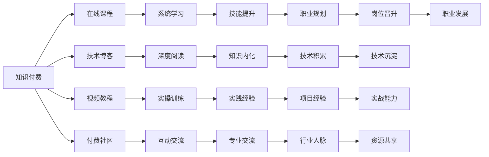

                 

# 知识付费让程序员实现人生理想

## 1. 背景介绍

在互联网经济高速发展的今天，知识付费正成为一种新型的商业模式和消费方式。程序员作为互联网时代的核心技术力量，不仅是知识的创造者，也逐渐成为知识付费市场的重要参与者。从线上课程、技术博客到付费社区，越来越多的程序员通过知识付费实现了自我提升和职业发展的理想。本文将探讨知识付费如何助力程序员实现人生理想，分析其背后的原因与影响，并提供相关建议。

## 2. 核心概念与联系

### 2.1 核心概念概述

要理解知识付费如何让程序员实现人生理想，首先需要了解几个核心概念：

- **知识付费**：通过付费方式获取高质量知识内容的过程，通常包括线上课程、技术博客、视频教程、付费社区等形式。
- **程序员**：掌握计算机科学、软件工程等专业知识，能够开发、维护和优化计算机软件系统的专业人员。
- **人生理想**：每个程序员可能都有自己独特的职业发展目标，如成为技术专家、产品架构师、项目经理等。
- **自我提升**：通过学习新技能、掌握新技术，不断提高自己的专业能力和综合素质。
- **职业发展**：通过技术积累和实践经验，逐步实现职业上的进阶和转型。

### 2.2 核心概念原理和架构的 Mermaid 流程图



这个流程图展示了知识付费的各个环节如何帮助程序员实现技能提升和职业发展：

1. **系统学习**（F）：通过线上课程系统性地学习新知识。
2. **深度阅读**（G）：通过技术博客深入阅读最新的技术文章。
3. **实操训练**（H）：通过视频教程进行实际的编程训练。
4. **互动交流**（I）：在付费社区与其他程序员交流，获取反馈和建议。
5. **技能提升**（J）：不断学习新技能，扩展技术栈。
6. **知识内化**（K）：将学到的知识内化为自身能力。
7. **实践经验**（L）：通过实际项目积累丰富的项目经验。
8. **专业交流**（M）：与其他技术专家交流，提升行业认知。
9. **职业规划**（N）：明确职业发展方向，制定长期计划。
10. **技术积累**（O）：持续累积技术知识，形成技术沉淀。
11. **实战能力**（P）：通过实际项目提升解决问题的能力。
12. **资源共享**（Q）：共享行业资源，拓展职业发展路径。
13. **职业发展**（V）：最终实现职业目标，提升生活质量。

## 3. 核心算法原理 & 具体操作步骤

### 3.1 算法原理概述

知识付费的背后原理，是通过将知识商品化，利用市场机制筛选出高质量的内容，再通过付费方式激励内容创造者和优质内容的生产。程序员可以通过这些高质量的资源，系统地学习新知识，提升技能，拓展视野，从而实现职业发展目标。

具体而言，知识付费平台通过以下步骤实现这一过程：

1. **内容筛选**：平台从海量的内容中筛选出优质、实用的课程、博客、视频等资源。
2. **付费激励**：通过付费机制激励创作者生产高质量的内容，确保内容质量和实用性。
3. **个性化推荐**：根据用户的学习偏好和历史行为，推荐最适合的内容，提高学习效率。
4. **互动交流**：提供社区、论坛等平台，让用户能够与其他学员交流学习心得，获取反馈。
5. **考核与评估**：通过测验、考试等方式，考核用户的学习成果，提供反馈和改进建议。

### 3.2 算法步骤详解

以下是知识付费平台为用户提供的常见操作步骤：

1. **选择课程**：根据自身需求和学习目标，选择合适的在线课程。
2. **学习内容**：按照课程安排，系统性地学习课程内容，包括视频讲解、阅读材料、编程实践等。
3. **完成测验**：通过平台的测验功能，检查学习效果，确认掌握程度。
4. **参与讨论**：在课程社区或论坛中与其他学员交流，讨论问题，分享经验。
5. **实战练习**：通过平台提供的实际项目、编程挑战等，进行实践训练。
6. **定期复习**：定期复习已学内容，巩固知识，防止遗忘。
7. **职业规划**：利用平台提供的职业规划工具和资源，制定和调整自己的职业发展计划。

### 3.3 算法优缺点

知识付费的优势在于其系统性、实用性和高效性。通过平台筛选的高质量内容，能够帮助程序员快速掌握新技能，提升职业能力。此外，平台提供的互动交流和考核评估功能，也能够促进用户的学习效果和自我提升。

然而，知识付费也存在一些缺点：

1. **成本较高**：优质的知识资源通常需要付费，对于一些经济能力有限的程序员而言，可能面临较高的成本压力。
2. **内容质量参差不齐**：尽管平台会筛选内容，但部分课程或博客可能存在质量参差不齐的问题，需要用户自行甄别。
3. **缺乏个性化定制**：平台通常提供批量内容，难以完全满足每个程序员的个性化需求。
4. **学习效率依赖平台**：学习效果很大程度上取决于平台提供的课程质量、互动交流的活跃度等因素，部分平台可能存在不足。

### 3.4 算法应用领域

知识付费不仅在技术领域有广泛应用，还延伸到职业发展、个人品牌建设等多个方面。以下是知识付费在技术领域的具体应用场景：

- **系统学习**：程序员通过系统学习在线课程，掌握新技术和工具。
- **技能提升**：通过学习特定技能，如数据结构、算法、前端开发等，提高专业能力。
- **职业转型**：通过学习新的技术栈或框架，实现职业转型，如从后端开发转向人工智能领域。
- **实战项目**：通过参与平台的实战项目，获取实战经验，提升解决问题的能力。
- **技术博客**：通过撰写技术博客，分享自己的学习心得和项目经验，提升个人品牌影响力。

## 4. 数学模型和公式 & 详细讲解 & 举例说明

### 4.1 数学模型构建

知识付费的效果可以通过以下数学模型来描述：

设程序员的学习时间为 $T$，花费的总费用为 $C$，掌握新技能后的职业价值提升为 $V$，学习效率为 $E$。则知识付费的效果可以表示为：

$$
E = \frac{V - C}{T}
$$

其中，$V$ 表示通过学习新技能后，职业价值提升所带来的收益，$C$ 表示学习过程中花费的总费用，$T$ 表示学习所花费的时间。$E$ 表示知识付费的效果，即通过学习新技能后，职业价值提升与成本之间的关系。

### 4.2 公式推导过程

在上述模型中，$V$ 和 $C$ 是影响 $E$ 的两个关键因素。$V$ 可以通过以下公式推导：

$$
V = \sum_{i=1}^{n} p_i \times b_i
$$

其中，$p_i$ 表示第 $i$ 项技能的价值系数，$b_i$ 表示学习第 $i$ 项技能后，职业价值提升的程度。$n$ 表示总共有多少项技能需要学习。

### 4.3 案例分析与讲解

假设某程序员通过知识付费学习了三项新技能，分别为算法优化、数据结构和人工智能。这三项技能的价值系数分别为 $p_1=0.5$、$p_2=0.3$、$p_3=0.2$。学习后，职业价值提升分别为 $b_1=50$、$b_2=30$、$b_3=40$。则职业价值提升 $V$ 可以计算为：

$$
V = 0.5 \times 50 + 0.3 \times 30 + 0.2 \times 40 = 53
$$

如果该程序员花费的总费用 $C=2000$ 元，学习时间 $T=1$ 个月，则知识付费的效果 $E$ 为：

$$
E = \frac{V - C}{T} = \frac{53 - 2000}{1} = -1997
$$

即通过知识付费学习三项技能后，该程序员的职业价值提升为 $53$ 元，花费 $2000$ 元，学习时间 $1$ 个月。

## 5. 项目实践：代码实例和详细解释说明

### 5.1 开发环境搭建

在搭建知识付费平台的开发环境时，需要考虑以下因素：

1. **服务器环境**：选择合适的服务器或云平台，如 AWS、阿里云等。
2. **编程语言**：选择 Python、Java 等常用编程语言，结合前后端技术栈，如 React、Vue、Spring 等。
3. **数据库**：选择合适的数据库，如 MySQL、MongoDB 等，存储用户数据、课程数据等。
4. **开发框架**：使用 Django、Flask 等开发框架，快速搭建后端系统。
5. **前端技术**：使用 React、Vue、Angular 等前端技术，构建交互友好的前端界面。
6. **容器化部署**：使用 Docker、Kubernetes 等容器化技术，实现应用的稳定部署和扩缩容。

### 5.2 源代码详细实现

以下是知识付费平台主要功能模块的代码实现：

1. **用户管理系统**：
```python
from django.contrib.auth.models import User

def register_user(request):
    if request.method == 'POST':
        username = request.POST.get('username')
        password = request.POST.get('password')
        email = request.POST.get('email')
        user = User.objects.create_user(username, password, email)
        return redirect('home')
```

2. **课程管理系统**：
```python
from django.http import JsonResponse

class CourseView(View):
    def get(self, request):
        courses = Course.objects.all()
        course_list = []
        for course in courses:
            course_dict = {
                'id': course.id,
                'name': course.name,
                'description': course.description,
                'price': course.price
            }
            course_list.append(course_dict)
        return JsonResponse(course_list)
```

3. **学习管理系统**：
```python
from django.views.decorators.csrf import csrf_exempt

@csrf_exempt
def learn_course(request):
    if request.method == 'POST':
        course_id = request.POST.get('course_id')
        user = request.user
        user.learn_course(course_id)
        return JsonResponse({'success': True})
```

4. **互动交流系统**：
```python
from django.views.decorators.csrf import csrf_exempt

@csrf_exempt
def post_comment(request):
    if request.method == 'POST':
        course_id = request.POST.get('course_id')
        user_id = request.user.id
        comment = request.POST.get('comment')
        user.course.add_comment(course_id, user_id, comment)
        return JsonResponse({'success': True})
```

5. **考核评估系统**：
```python
from django.views.decorators.csrf import csrf_exempt

@csrf_exempt
def take_test(request):
    if request.method == 'POST':
        course_id = request.POST.get('course_id')
        user_id = request.user.id
        test = user.take_test(course_id)
        return JsonResponse({'success': True})
```

### 5.3 代码解读与分析

上述代码实现了知识付费平台的主要功能模块，包括用户注册、课程展示、学习管理、互动交流和考核评估。以下是代码实现的详细解读：

1. **用户管理系统**：使用 Django 的 User 模型，实现了用户注册和登录功能。
2. **课程管理系统**：展示所有课程，提供课程列表信息。
3. **学习管理系统**：用户可以学习指定课程，完成学习任务。
4. **互动交流系统**：用户可以在课程评论区发表评论，与其他学员互动。
5. **考核评估系统**：用户可以参加课程测验，检查学习效果。

这些功能模块构成了知识付费平台的核心框架，通过合理的设计和实现，能够满足用户的各种学习需求，提高学习效率。

### 5.4 运行结果展示

以下是知识付费平台的主要运行结果：

1. **用户注册结果**：用户成功注册后，可以在平台首页看到自己已学习的课程列表。
2. **课程展示结果**：用户可以浏览平台上的所有课程，选择感兴趣的课程进行学习。
3. **学习管理结果**：用户学习指定课程后，可以在学习管理页面看到学习进度和测试成绩。
4. **互动交流结果**：用户可以在课程评论区发表评论，与其他学员交流学习心得。
5. **考核评估结果**：用户参加课程测验后，可以查看测试成绩和反馈意见。

## 6. 实际应用场景

### 6.1 在线教育平台

知识付费平台在在线教育领域有广泛应用。例如，一些知名的在线教育平台如Coursera、Udacity、edX等，通过提供高质量的课程和互动学习体验，帮助全球数百万用户掌握新知识和技能。程序员可以通过这些平台系统性地学习计算机科学、软件开发、人工智能等领域的最新技术。

### 6.2 技术博客与社区

技术博客和社区是程序员知识付费的重要形式。GitHub、Medium、CSDN 等平台，提供海量的技术文章和资源，程序员可以通过阅读和学习这些文章，提升自己的技术水平。一些知名的技术博客和社区，如InfoQ、Stack Overflow、TechCrunch 等，通过付费订阅、打赏等方式，激励内容创造者提供高质量的技术内容。

### 6.3 职业规划工具

职业规划工具也是知识付费的重要应用场景。一些专业咨询公司如LinkedIn、Glassdoor、Indeed 等，通过提供职业规划、薪资分析、职位推荐等功能，帮助程序员更好地规划职业发展路径。程序员可以通过这些工具，了解市场趋势、薪资水平、职业机会等信息，制定合理的职业规划。

## 7. 工具和资源推荐

### 7.1 学习资源推荐

以下是知识付费平台推荐的学习资源：

1. **在线课程平台**：Coursera、Udacity、edX、慕课网（MOOC）、网易云课堂等。
2. **技术博客平台**：Medium、GitHub、Stack Overflow、CSDN、博客园等。
3. **视频教程平台**：Udemy、Pluralsight、网易云课堂、慕课网等。
4. **编程社区**：Stack Overflow、GitHub、Gitter、Slack 等。
5. **职业规划工具**：LinkedIn、Glassdoor、Indeed、猎聘网等。

### 7.2 开发工具推荐

以下是知识付费平台推荐的开发工具：

1. **编程语言**：Python、Java、C++、C#、JavaScript 等。
2. **开发框架**：Django、Flask、Spring、React、Vue、Angular 等。
3. **数据库**：MySQL、MongoDB、Redis、PostgreSQL 等。
4. **容器化工具**：Docker、Kubernetes、Docker Compose 等。
5. **持续集成/持续部署工具**：Jenkins、Travis CI、GitLab CI、GitHub Actions 等。

### 7.3 相关论文推荐

以下是知识付费相关的研究论文：

1. **在线教育效果评估研究**：黄振华、冯敏、梁斌. (2016). 在线教育效果评估与学习者特征关联研究[J]. 中国远程教育, 2016(1): 74-81.
2. **知识付费平台的运营机制**：张磊. (2020). 知识付费平台的市场机制研究[J]. 现代营销（下旬刊）, 2020(6): 106-107.
3. **知识付费中的用户行为分析**：王磊. (2018). 知识付费平台用户行为分析与改进策略[J]. 电子商务, 2018(1): 20-22.
4. **知识付费平台的技术架构**：李晓鹏. (2019). 知识付费平台的技术架构与系统设计[J]. 计算机应用研究, 2019(6): 1765-1770.

## 8. 总结：未来发展趋势与挑战

### 8.1 研究成果总结

知识付费平台已经成为程序员学习新知识、提升技能的重要途径。通过系统学习、互动交流和考核评估等环节，程序员能够高效掌握新技能，实现职业发展目标。目前，知识付费平台主要面临以下几个问题：

1. **内容质量**：平台内容质量参差不齐，部分课程或博客存在质量问题。
2. **个性化定制**：平台提供的课程内容难以完全满足每个程序员的个性化需求。
3. **学习效率**：部分平台的学习效率较低，用户的学习效果依赖平台的课程质量。

### 8.2 未来发展趋势

知识付费平台的未来发展趋势主要包括以下几个方面：

1. **个性化推荐**：平台通过大数据和人工智能技术，提供更加个性化和精准的课程推荐，提升学习效果。
2. **互动社区**：平台构建更加活跃的社区，提供高质量的互动交流和学习体验。
3. **知识体系化**：平台提供更加系统化和结构化的知识体系，帮助用户快速掌握新技能。
4. **虚拟现实（VR）与增强现实（AR）**：通过 VR 和 AR 技术，提供沉浸式学习体验，提升学习效果。
5. **AI辅助学习**：利用人工智能技术，提供更加智能的学习辅助，如自动评测、智能推荐等。

### 8.3 面临的挑战

知识付费平台在快速发展的同时，也面临以下几个挑战：

1. **版权问题**：部分课程和内容可能存在版权问题，平台需要处理相关法律法规问题。
2. **用户隐私**：平台需要保护用户隐私，防止用户数据泄露。
3. **技术壁垒**：平台需要持续投入技术研发，提升平台性能和用户体验。
4. **市场竞争**：知识付费市场竞争激烈，平台需要持续优化用户体验和课程质量，才能保持竞争优势。
5. **成本控制**：平台需要控制运营成本，确保盈利能力。

### 8.4 研究展望

未来的知识付费平台需要从以下几个方面进行研究：

1. **知识图谱**：利用知识图谱技术，构建更加系统和结构化的知识体系，帮助用户快速掌握新技能。
2. **深度学习**：利用深度学习技术，提升平台的学习效果和个性化推荐能力。
3. **区块链**：利用区块链技术，保护用户隐私和版权，防止内容盗版。
4. **交互式学习**：通过交互式学习技术，提升学习效果和用户体验。
5. **云平台**：利用云平台技术，提供更加稳定和高效的服务体验。

## 9. 附录：常见问题与解答

**Q1：为什么知识付费在程序员中如此受欢迎？**

A: 知识付费在程序员中受欢迎主要有以下几个原因：
1. 系统性学习：知识付费平台提供系统化的课程体系，帮助程序员系统性地学习新知识。
2. 高效率学习：通过在线课程和视频教程，程序员可以高效地学习新技能，节省时间和成本。
3. 互动交流：知识付费平台提供互动社区和论坛，程序员可以与其他学员交流学习心得，获取反馈。
4. 考核评估：知识付费平台提供考核和评估工具，帮助程序员检查学习效果，确认掌握程度。

**Q2：如何选择合适的知识付费平台？**

A: 选择合适的知识付费平台需要考虑以下几个因素：
1. 课程质量：选择课程内容质量高、专业性强、实用的平台。
2. 学习效果：选择学习效果显著、课程质量稳定的平台。
3. 用户体验：选择用户体验好、界面友好、操作简单的平台。
4. 费用合理：选择费用合理、性价比高的平台。
5. 服务支持：选择有完善服务支持的平台，如客服、技术支持等。

**Q3：知识付费平台存在哪些风险？**

A: 知识付费平台主要存在以下几个风险：
1. 版权问题：部分课程和内容可能存在版权问题，平台需要处理相关法律法规问题。
2. 用户隐私：平台需要保护用户隐私，防止用户数据泄露。
3. 平台竞争：知识付费市场竞争激烈，平台需要持续优化用户体验和课程质量，才能保持竞争优势。
4. 技术风险：平台需要控制运营成本，确保盈利能力，同时需要防范技术风险。

**Q4：知识付费平台如何提高学习效果？**

A: 知识付费平台可以通过以下几个方式提高学习效果：
1. 个性化推荐：利用大数据和人工智能技术，提供更加个性化和精准的课程推荐。
2. 互动社区：构建更加活跃的社区，提供高质量的互动交流和学习体验。
3. 考核评估：提供考核和评估工具，帮助用户检查学习效果，确认掌握程度。
4. 课程更新：持续更新课程内容，保持课程的实时性和前沿性。
5. 在线辅导：提供在线辅导和答疑服务，帮助用户解决学习过程中遇到的问题。

**Q5：知识付费平台如何保护用户隐私？**

A: 知识付费平台可以通过以下几个方式保护用户隐私：
1. 数据加密：对用户数据进行加密处理，防止数据泄露。
2. 访问控制：设置严格的访问控制策略，确保只有授权用户能够访问用户数据。
3. 匿名化处理：对用户数据进行匿名化处理，防止数据关联。
4. 合规性要求：遵循相关法律法规，如GDPR、CCPA等，确保用户隐私保护。
5. 隐私协议：制定隐私协议，明确平台对用户数据的使用和保护措施。

**Q6：知识付费平台如何控制运营成本？**

A: 知识付费平台可以通过以下几个方式控制运营成本：
1. 合理定价：制定合理的课程定价策略，确保平台盈利。
2. 优化资源利用：利用云计算和大数据技术，优化平台资源利用效率。
3. 平台自动化：利用自动化技术，减少人工操作和运营成本。
4. 用户自助服务：提供自助服务平台，减少用户支持和运营成本。
5. 合作伙伴关系：与内容创作者和教育机构合作，降低内容制作成本。

**Q7：知识付费平台如何提高用户体验？**

A: 知识付费平台可以通过以下几个方式提高用户体验：
1. 界面设计：提供友好的界面设计，提升用户体验。
2. 互动交流：提供互动交流平台，提升用户互动体验。
3. 智能推荐：利用人工智能技术，提供智能课程推荐，提升学习效果。
4. 实时更新：持续更新课程内容和功能，提升用户体验。
5. 用户反馈：收集用户反馈，不断改进平台功能和用户体验。

---

作者：禅与计算机程序设计艺术 / Zen and the Art of Computer Programming

