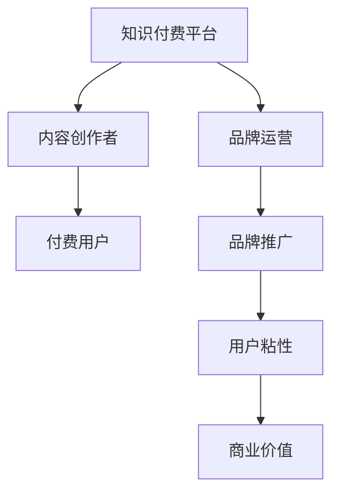
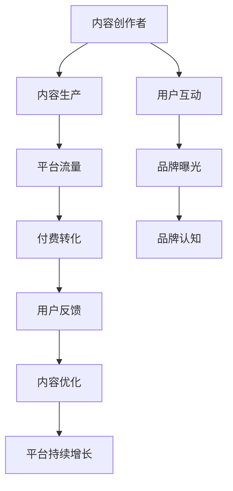

                 

# 知识付费赚钱的品牌品牌运营与品牌推广策略

## 1. 背景介绍

随着信息爆炸时代的到来，互联网用户对于高质量、高价值信息的需求日益增长。知识付费成为了互联网时代的一大热点，它不仅满足用户对于专业知识的渴望，也为内容创作者提供了新的收入途径。在知识付费领域，品牌运营与品牌推广策略显得尤为重要，它们直接影响着知识付费平台的盈利模式和用户增长。

## 2. 核心概念与联系

### 2.1 核心概念概述

为了更好地理解品牌运营与品牌推广策略，本节将介绍几个密切相关的核心概念：

- **知识付费平台**：基于互联网为用户提供知识、技能、经验等服务的平台。常见的平台如得到、喜马拉雅、知乎live等。
- **内容创作者**：在知识付费平台上提供专业内容的用户，他们可以是专家学者、行业从业者、经验丰富的人士等。
- **付费用户**：愿意为获取知识付费的用户群体，他们对于内容质量、时效性、适用性等方面有着较高要求。
- **品牌运营**：通过制定策略、执行计划，以提升品牌知名度、用户粘性和商业价值的过程。
- **品牌推广**：通过广告、活动、公关等手段，将品牌信息传达给目标用户，提升品牌知名度和美誉度的活动。

这些核心概念之间的逻辑关系可以通过以下Mermaid流程图来展示：



这个流程图展示了大语言模型的核心概念及其之间的关系：

1. 知识付费平台提供专业内容，内容创作者则是内容的提供者。
2. 付费用户是平台的收入来源，品牌运营和品牌推广则帮助平台提升用户粘性和商业价值。
3. 品牌运营和品牌推广互相依存，前者提供策略支持，后者执行具体的推广活动。

### 2.2 核心概念原理和架构的 Mermaid 流程图



该流程图展示了内容创作者在知识付费平台上的核心运营流程：

1. 内容创作者通过内容生产吸引用户互动。
2. 用户互动产生流量，通过付费转化生成收入。
3. 品牌曝光和品牌认知提升用户粘性。
4. 用户反馈和内容优化促进平台持续增长。

## 3. 核心算法原理 & 具体操作步骤

### 3.1 算法原理概述

知识付费平台的品牌运营与品牌推广策略，本质上是通过数据驱动的精准营销和用户管理来实现的。其核心思想是：

- **数据驱动**：通过收集和分析用户数据，了解用户需求和行为，从而制定有针对性的推广策略。
- **精准营销**：在推广活动和运营策略中，精准定位目标用户，提升推广效果和用户转化率。
- **用户管理**：通过优质内容和品牌运营，提升用户粘性和长期价值。

### 3.2 算法步骤详解

基于数据驱动的品牌运营与品牌推广策略一般包括以下几个关键步骤：

**Step 1: 数据收集与分析**
- 收集用户在平台上的行为数据，如浏览时长、互动频率、付费记录等。
- 分析用户数据，找出高价值用户群体和潜在增长点。

**Step 2: 用户细分与画像**
- 将用户按属性、行为、付费意愿等维度进行细分。
- 构建用户画像，描述用户特征和需求。

**Step 3: 内容定制与推广**
- 根据用户画像和行为数据，定制相关内容。
- 通过SEO、社交媒体、KOL合作等方式进行推广。

**Step 4: 活动策划与执行**
- 策划有吸引力的活动，如课程优惠券、主题沙龙等。
- 执行活动并跟踪效果，收集用户反馈。

**Step 5: 数据监控与优化**
- 实时监控推广活动效果，分析数据指标。
- 根据分析结果，优化推广策略和内容。

### 3.3 算法优缺点

基于数据驱动的品牌运营与品牌推广策略具有以下优点：

1. **效果显著**：通过精准定位和个性化推荐，提升推广效果和用户转化率。
2. **数据驱动**：依赖于平台上的大数据分析，提升决策的科学性和准确性。
3. **用户管理**：通过优质内容和互动提升用户粘性，实现长期价值。

同时，该方法也存在一定的局限性：

1. **依赖数据质量**：推广效果高度依赖于数据收集和分析的准确性，数据偏差可能影响推广结果。
2. **成本高**：数据收集和分析需要投入大量的人力和技术资源，推广活动也可能需要高额的预算。
3. **动态性不足**：用户行为和需求变化较快，策略调整和优化需要实时跟踪。

尽管存在这些局限性，但就目前而言，基于数据驱动的品牌运营与品牌推广策略仍是最主流的方法。未来相关研究的重点在于如何进一步提升数据质量、降低推广成本、提升策略的动态响应速度。

### 3.4 算法应用领域

基于数据驱动的品牌运营与品牌推广策略，在知识付费平台的应用领域广泛，包括但不限于：

- 课程推荐系统：根据用户兴趣和行为推荐相关课程。
- 活动策划与执行：策划和执行各类线上线下活动，提升用户参与度和品牌曝光。
- 用户留存与转化：通过优质内容和互动提升用户粘性和长期价值。
- 广告投放与优化：通过精准广告投放，提升平台流量和用户转化。

除了上述这些核心应用外，知识付费平台还在内容多样化、社区建设、品牌合作等方面，广泛应用品牌运营与品牌推广策略，进一步拓展平台的业务范围和用户群体。

## 4. 数学模型和公式 & 详细讲解

### 4.1 数学模型构建

基于数据驱动的品牌运营与品牌推广策略，可以通过以下几个数学模型来描述：

- **用户行为模型**：描述用户在不同内容上的行为，如浏览、互动、付费等。
- **内容推荐模型**：根据用户行为和内容属性，推荐相关内容。
- **广告投放模型**：根据用户特征和行为，投放精准广告，提升广告转化率。

### 4.2 公式推导过程

以下我们以用户行为模型为例，推导用户行为的概率分布函数：

假设用户行为 $X$ 可以表示为 $X=x_1,x_2,\dots,x_n$，其中 $x_i$ 表示用户在第 $i$ 个内容上的行为，如浏览时长、互动次数等。设 $P(x_i|u)$ 为给定用户 $u$ 时，内容 $x_i$ 被访问的概率。则用户行为的概率分布函数为：

$$
P(X|u) = \prod_{i=1}^n P(x_i|u)
$$

进一步地，我们可以利用用户行为数据，通过最大似然估计法求解 $P(x_i|u)$：

$$
P(x_i|u) = \frac{C_i}{\sum_{x_j \in X} C_j}
$$

其中 $C_i$ 为在内容 $x_i$ 上产生行为的用户数。

### 4.3 案例分析与讲解

以某知识付费平台的用户行为模型为例，假设平台上有以下内容：数学、编程、心理、金融。用户 $u$ 在数学内容上的浏览时长为20分钟，互动次数为5次，在编程内容上的浏览时长为10分钟，互动次数为3次，在心理内容上的浏览时长为15分钟，互动次数为2次，在金融内容上的浏览时长为5分钟，互动次数为0次。则用户 $u$ 在不同内容上的行为概率为：

- 数学：$P(x_1|u) = \frac{C_1}{C_1 + C_2 + C_3 + C_4} = \frac{20+5}{20+10+15+5} = 0.3$
- 编程：$P(x_2|u) = \frac{C_2}{C_1 + C_2 + C_3 + C_4} = \frac{10+3}{20+10+15+5} = 0.2$
- 心理：$P(x_3|u) = \frac{C_3}{C_1 + C_2 + C_3 + C_4} = \frac{15+2}{20+10+15+5} = 0.25$
- 金融：$P(x_4|u) = \frac{C_4}{C_1 + C_2 + C_3 + C_4} = \frac{5+0}{20+10+15+5} = 0.2$

通过上述概率分布，可以制定针对性的内容推荐策略，如将数学内容推荐给对该领域感兴趣的用户。

## 5. 项目实践：代码实例和详细解释说明

### 5.1 开发环境搭建

在进行品牌运营与品牌推广策略开发前，我们需要准备好开发环境。以下是使用Python进行数据分析和模型训练的环境配置流程：

1. 安装Anaconda：从官网下载并安装Anaconda，用于创建独立的Python环境。

2. 创建并激活虚拟环境：
```bash
conda create -n brand-env python=3.8 
conda activate brand-env
```

3. 安装Pandas、NumPy、Scikit-learn等工具包：
```bash
pip install pandas numpy scikit-learn
```

4. 安装TensorFlow或PyTorch：
```bash
pip install tensorflow
# 或者
pip install torch
```

完成上述步骤后，即可在`brand-env`环境中开始品牌运营与品牌推广策略的开发。

### 5.2 源代码详细实现

这里我们以用户行为模型为例，给出使用Pandas进行用户行为数据分析的PyTorch代码实现。

首先，定义用户行为数据集：

```python
import pandas as pd

data = {
    'user_id': [1, 1, 2, 2, 3, 3],
    'content': ['math', 'programming', 'psychology', 'math', 'programming', 'finance'],
    '浏览时长': [20, 10, 15, 5, 5, 10],
    '互动次数': [5, 3, 2, 0, 0, 0]
}

df = pd.DataFrame(data)
```

然后，统计用户在不同内容上的行为：

```python
user_id_counts = df.groupby('user_id')['内容'].value_counts().reset_index()
content_counts = df.groupby('内容')['内容'].value_counts().reset_index()
```

接着，计算用户行为概率分布：

```python
user_behavior = user_id_counts['内容'].apply(lambda x: x / sum(x)).to_frame().rename(columns={'内容': '概率'})
content_counts = content_counts['内容'].apply(lambda x: x / sum(x)).to_frame().rename(columns={'内容': '概率'})
```

最后，将用户行为概率分布与内容概率分布合并：

```python
merged = pd.merge(user_behavior, content_counts, on='内容', how='left')
merged = merged[merged['概率_x'] > 0]
merged = merged.merge(df, on=['user_id', '内容'])
```

### 5.3 代码解读与分析

让我们再详细解读一下关键代码的实现细节：

**用户行为数据集定义**：
- 定义用户ID、内容类型、浏览时长、互动次数等字段。

**用户行为统计**：
- 使用groupby函数统计用户在不同内容上的行为次数。

**行为概率分布计算**：
- 利用value_counts函数统计内容被访问次数，并计算概率。

**合并数据**：
- 将用户行为概率分布和内容概率分布合并，并根据内容访问次数筛选出非零内容。
- 最后将用户ID、内容类型、行为概率分布等字段合并，得到完整的用户行为数据。

可以看到，Pandas库的强大功能使得数据处理和分析变得更加简洁高效。开发者可以将更多精力放在策略模型和算法优化上，而不必过多关注底层的数据处理细节。

## 6. 实际应用场景

### 6.1 智能客服系统

智能客服系统可以广泛应用品牌运营与品牌推广策略，帮助企业提升客户体验和满意度。通过收集客户的历史互动数据，分析客户的常见问题、服务需求和偏好，系统可以自动化地推荐相关解决方案，并提供个性化服务。

在技术实现上，可以构建用户行为模型，对每个客户的历史互动行为进行分析，根据行为数据推荐相关内容。同时，利用品牌推广策略，通过线上线下活动提升客户粘性，增强客户品牌忠诚度。

### 6.2 金融投资平台

金融投资平台可以应用品牌运营与品牌推广策略，提升用户投资决策的精准性和信任度。通过分析用户的投资行为和偏好，推荐相关投资产品，提供实时市场资讯和投资策略。

在数据驱动的策略下，系统可以根据用户行为，动态调整投资产品推荐和市场资讯推送，提升用户的投资体验和信任度。同时，通过品牌推广策略，增强平台在金融领域的知名度和品牌影响力。

### 6.3 教育培训平台

教育培训平台可以应用品牌运营与品牌推广策略，提升用户的学习效果和满意度。通过分析用户的在线学习行为和反馈，推荐相关课程和教材，提供个性化学习方案。

在品牌推广策略的助力下，系统可以通过在线活动和社区建设，提升用户的学习粘性和平台品牌认知。同时，利用数据驱动的策略，不断优化课程推荐和内容推送，提高用户的满意度和学习效果。

### 6.4 未来应用展望

随着品牌运营与品牌推广策略的不断发展，未来将在更多领域得到应用，为传统行业带来变革性影响。

在智慧医疗领域，基于品牌运营与品牌推广策略的医疗推荐系统，可以为患者推荐适合的治疗方案，提升诊疗效果和满意度。

在智能教育领域，微调技术可应用于作业批改、学情分析、知识推荐等方面，因材施教，促进教育公平，提高教学质量。

在智慧城市治理中，品牌运营与品牌推广策略可以应用于城市事件监测、舆情分析、应急指挥等环节，提高城市管理的自动化和智能化水平，构建更安全、高效的未来城市。

此外，在企业生产、社会治理、文娱传媒等众多领域，品牌运营与品牌推广策略也将不断涌现，为经济社会发展注入新的动力。相信随着学界和产业界的共同努力，这些策略必将在构建人机协同的智能时代中扮演越来越重要的角色。

## 7. 工具和资源推荐

### 7.1 学习资源推荐

为了帮助开发者系统掌握品牌运营与品牌推广策略的理论基础和实践技巧，这里推荐一些优质的学习资源：

1. 《数字营销实战》系列博文：由数字营销专家撰写，深入浅出地介绍了数字营销的原理、策略和工具，是理解品牌运营与品牌推广策略的好资源。

2. Coursera《数字营销与内容营销》课程：由知名高校和机构开设，涵盖数字营销和内容营销的基本概念和经典案例，是入门和提升的好选择。

3. 《内容营销实战》书籍：介绍了内容营销的策略、工具和案例，适合各类企业和品牌运营人员。

4. 《品牌营销》系列文章：由品牌营销专家撰写，分享品牌建设和品牌推广的实战经验和方法，有助于提升品牌运营能力。

5. 《品牌定位》书籍：介绍了品牌定位的理论和实践方法，帮助品牌运营人员制定和执行品牌定位策略。

通过对这些资源的学习实践，相信你一定能够快速掌握品牌运营与品牌推广策略的精髓，并用于解决实际的品牌运营问题。

### 7.2 开发工具推荐

高效的开发离不开优秀的工具支持。以下是几款用于品牌运营与品牌推广策略开发的常用工具：

1. Google Analytics：用于数据分析和用户行为跟踪，帮助品牌运营人员了解用户行为和偏好。

2. SEMrush：用于搜索引擎优化（SEO）和搜索引擎营销（SEM），提升品牌曝光和流量。

3. HubSpot：提供全面的数字营销解决方案，包括内容管理、邮件营销、社交媒体管理等。

4. Hootsuite：用于社交媒体管理和品牌推广，支持多平台发布和监控。

5. Tableau：用于数据可视化和业务智能，帮助品牌运营人员更好地理解数据和进行决策。

合理利用这些工具，可以显著提升品牌运营与品牌推广策略的开发效率，加快创新迭代的步伐。

### 7.3 相关论文推荐

品牌运营与品牌推广策略的发展源于学界的持续研究。以下是几篇奠基性的相关论文，推荐阅读：

1. Brand Equity: The Role of Marketing Strategy and Marketing Organizations （《品牌权益：营销策略和营销组织的作用》）：详细探讨了品牌运营和品牌推广对品牌权益的影响。

2. Digital Brand Strategy: An Examination of Digital Branding and Digital Branding Strategies （《数字品牌策略：数字品牌建设和数字品牌推广策略的考察》）：深入分析了数字时代品牌建设和推广的新趋势。

3. The Role of Social Media in Brand Strategy （《社交媒体在品牌策略中的作用》）：研究了社交媒体对品牌建设和推广的影响和应用。

4. Measuring Brand Equity in an Omnichannel Context （《全渠道环境下的品牌权益测量》）：探讨了全渠道品牌建设和推广的策略和效果。

这些论文代表了大语言模型微调技术的发展脉络。通过学习这些前沿成果，可以帮助研究者把握学科前进方向，激发更多的创新灵感。

## 8. 总结：未来发展趋势与挑战

### 8.1 总结

本文对品牌运营与品牌推广策略进行了全面系统的介绍。首先阐述了品牌运营与品牌推广策略的研究背景和意义，明确了策略在提升品牌知名度、用户粘性和商业价值方面的独特价值。其次，从原理到实践，详细讲解了数据驱动的品牌运营与品牌推广策略的数学模型和操作步骤，给出了品牌运营与品牌推广策略开发的完整代码实例。同时，本文还广泛探讨了策略在智能客服、金融投资、教育培训等多个行业领域的应用前景，展示了品牌运营与品牌推广策略的巨大潜力。

通过本文的系统梳理，可以看到，品牌运营与品牌推广策略在大语言模型微调中的应用，极大地拓展了预训练语言模型的应用边界，催生了更多的落地场景。得益于大数据分析和机器学习的支持，品牌运营与品牌推广策略在提升用户体验和品牌价值方面，展示了强大的能力和潜力。未来，伴随数据驱动的持续演进和智能技术的不断进步，品牌运营与品牌推广策略必将在更广阔的领域大放异彩。

### 8.2 未来发展趋势

展望未来，品牌运营与品牌推广策略将呈现以下几个发展趋势：

1. **数据质量提升**：随着数据收集和处理技术的进步，品牌运营与品牌推广策略将获得更高质量的用户行为数据，从而提升决策的科学性和准确性。

2. **个性化推广**：利用深度学习和人工智能技术，根据用户行为和偏好进行个性化推广，提升推广效果和用户转化率。

3. **全渠道融合**：品牌运营与品牌推广策略将更加注重线上线下、多渠道的整合，提升品牌曝光和用户粘性。

4. **实时优化**：利用实时数据分析和机器学习技术，不断优化推广策略和内容推荐，实现动态调整和优化。

5. **情感分析**：通过情感分析技术，理解用户的情感和反馈，提升品牌互动和用户满意度。

6. **社交媒体整合**：利用社交媒体平台的算法和数据，提升品牌推广效果和用户互动。

以上趋势凸显了品牌运营与品牌推广策略的广阔前景。这些方向的探索发展，必将进一步提升品牌运营与品牌推广策略的效果，为构建人机协同的智能时代提供坚实的基础。

### 8.3 面临的挑战

尽管品牌运营与品牌推广策略已经取得了瞩目成就，但在迈向更加智能化、普适化应用的过程中，它仍面临着诸多挑战：

1. **数据隐私问题**：用户行为数据涉及用户隐私，如何保护用户数据安全和隐私，是一大挑战。

2. **用户行为变化**：用户行为和需求变化较快，品牌运营与品牌推广策略需要快速响应和调整。

3. **算法复杂性**：数据驱动的策略需要复杂的算法和模型支持，对技术和资源要求较高。

4. **多渠道整合**：不同渠道的用户数据格式和接口标准不一，如何实现多渠道数据整合和策略统一，是一大挑战。

5. **用户体验**：在推广策略中，如何平衡品牌曝光和用户体验，避免过度打扰和反感，是一大挑战。

6. **效果评估**：品牌运营与品牌推广策略的效果评估需要综合多方面数据，如何进行科学和合理的评估，是一大挑战。

正视品牌运营与品牌推广策略面临的这些挑战，积极应对并寻求突破，将是大语言模型微调走向成熟的必由之路。相信随着学界和产业界的共同努力，这些挑战终将一一被克服，品牌运营与品牌推广策略必将在构建安全、可靠、可解释、可控的智能系统铺平道路。

### 8.4 研究展望

面对品牌运营与品牌推广策略所面临的种种挑战，未来的研究需要在以下几个方面寻求新的突破：

1. **数据隐私保护**：引入差分隐私等技术，保护用户隐私，同时获取高质量的用户数据。

2. **动态策略调整**：利用强化学习等技术，动态调整推广策略和内容推荐，实时响应用户需求和行为变化。

3. **多渠道整合**：开发标准化的数据接口和算法框架，实现多渠道数据的整合和策略统一。

4. **用户行为预测**：利用机器学习技术，预测用户行为和需求变化，提前调整推广策略。

5. **用户体验优化**：在品牌推广中引入情感分析和用户反馈，平衡品牌曝光和用户体验。

6. **效果评估模型**：开发科学合理的效果评估模型，综合多方面数据，评估推广策略的效果。

这些研究方向的探索，必将引领品牌运营与品牌推广策略迈向更高的台阶，为构建安全、可靠、可解释、可控的智能系统铺平道路。

## 9. 附录：常见问题与解答

**Q1：品牌运营与品牌推广策略是否适用于所有行业？**

A: 品牌运营与品牌推广策略在各行各业都有广泛应用，如电商、金融、教育、医疗等。但不同行业的策略侧重点和应用场景可能有所不同，需要结合行业特点进行优化。

**Q2：如何选择合适的推广渠道？**

A: 选择合适的推广渠道需要考虑以下几个因素：
1. 目标用户在哪里活跃。
2. 推广渠道的覆盖范围和用户质量。
3. 推广成本和效果预估。
4. 平台的数据和算法支持。
5. 推广活动的整体策略。

通过综合考虑这些因素，可以选择合适的推广渠道，提升推广效果。

**Q3：品牌运营与品牌推广策略如何与其他营销手段结合？**

A: 品牌运营与品牌推广策略可以与SEO、社交媒体营销、内容营销等手段结合，形成多维度、多渠道的营销体系，提升整体效果和用户粘性。

**Q4：如何优化用户行为模型？**

A: 优化用户行为模型的方法包括：
1. 增加数据量和数据维度，提高模型的预测能力。
2. 引入新的特征和变量，提升模型的解释性和效果。
3. 调整模型算法和参数，优化模型的性能和效果。
4. 进行A/B测试和效果评估，不断迭代和优化模型。

**Q5：品牌运营与品牌推广策略的投入产出比如何计算？**

A: 品牌运营与品牌推广策略的投入产出比可以通过以下公式计算：
投入产出比 = 收益 / 投入
其中，收益可以是品牌曝光、用户转化、市场份额等指标，投入包括推广成本、人力资源、技术成本等。

通过对这些常见问题的解答，相信你能够更好地理解品牌运营与品牌推广策略的应用和优化方法。

---

作者：禅与计算机程序设计艺术 / Zen and the Art of Computer Programming

