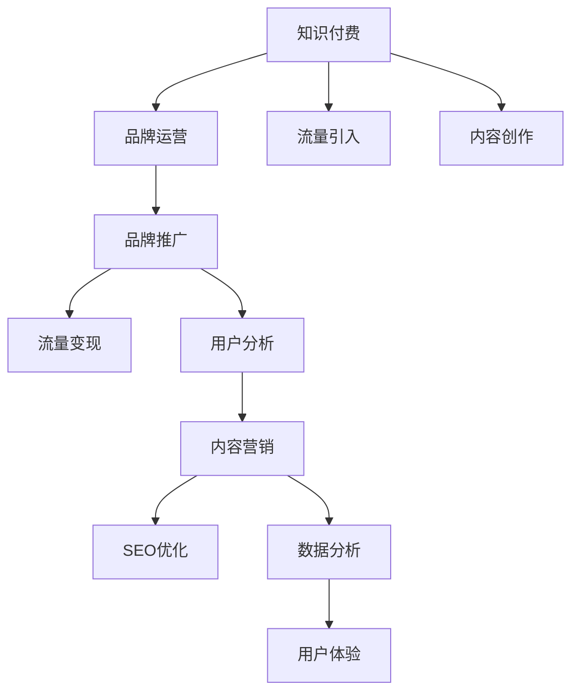

                 

# 知识付费赚钱的品牌品牌运营与品牌推广策略

> 关键词：知识付费,品牌运营,品牌推广,策略,流量,转化,用户分析,内容营销,SEO优化,数据分析,用户体验

## 1. 背景介绍

### 1.1 问题由来
随着互联网的快速发展和普及，知识付费正在成为一股不可忽视的力量，尤其在教育、科技、金融等领域。相较于传统教学，知识付费能够为受众提供更为个性化、高质量的学习体验，且成本相对较低，因此受到了越来越多用户的青睐。如何有效运营知识付费品牌，挖掘其商业潜力，成为品牌管理者、营销人员亟需解决的课题。

### 1.2 问题核心关键点
品牌运营与推广的核心在于提升品牌知名度、吸引并转化用户、优化用户体验、提高用户留存和复购率。而知识付费品牌不同于其他类型的商品或服务，其核心竞争力在于内容的优质程度以及品牌价值主张的独特性。因此，知识付费品牌的运营与推广策略需要结合其特殊性，深入挖掘知识内容的市场价值，同时构建强大的品牌形象，通过有效的渠道传播和精准的用户营销，实现流量变现。

### 1.3 问题研究意义
深入研究知识付费品牌的运营与推广策略，对于提高品牌知名度、吸引潜在用户、增加用户粘性、提高收入和用户满意度具有重要意义。通过科学的品牌运营和推广策略，能够优化内容产出与传播路径，提高知识付费产品和服务的使用价值，从而实现品牌和用户的双赢。

## 2. 核心概念与联系

### 2.1 核心概念概述

为更好地理解知识付费品牌的运营与推广策略，本节将介绍几个密切相关的核心概念：

- 知识付费：指用户为获取知识内容而支付的订阅费用，相较于传统的付费订阅，知识付费的重点是获取高质量、有价值的知识内容。
- 品牌运营：指通过一系列策略和手段，提高品牌知名度、美誉度，吸引用户，实现商业目标的过程。
- 品牌推广：指利用各种渠道和手段，将品牌信息传递给目标用户，提升品牌影响力，实现市场拓展的目标。
- 流量变现：指通过吸引流量到知识付费平台，利用平台的会员订阅、课程购买等商业模式，实现收入转化。
- 用户分析：指通过数据分析手段，了解用户行为特征、需求变化，从而优化产品和服务，提升用户体验。
- 内容营销：指通过优质内容的输出，吸引并留存用户，提升用户粘性和满意度。
- SEO优化：指通过搜索引擎优化，提升网站在搜索引擎中的排名，吸引更多用户访问。
- 数据分析：指利用数据挖掘和分析技术，提取有价值的信息，指导品牌运营和推广策略。
- 用户体验：指用户在使用产品或服务时的感知和满意度，良好的用户体验能够提高用户留存率和复购率。

这些核心概念之间的逻辑关系可以通过以下Mermaid流程图来展示：



这个流程图展示知识付费品牌的核心概念及其之间的关系：

1. 知识付费是品牌运营和推广的基础，通过内容创作吸引流量。
2. 品牌运营和推广通过流量引入，提升品牌知名度和用户转化率。
3. 流量变现通过内容营销和数据分析，提高用户粘性和转化率。
4. 用户分析通过流量引入和内容营销，优化用户体验。
5. SEO优化通过品牌推广和内容营销，提升品牌在搜索引擎中的排名。
6. 数据分析通过品牌运营、推广、用户分析、内容营销和SEO优化，实现数据驱动的决策。
7. 用户体验通过品牌运营、推广、内容营销、数据分析等，提升用户满意度和留存率。

这些概念共同构成了知识付费品牌运营与推广的框架，使得品牌能够更有效地吸引用户，实现商业价值。

## 3. 核心算法原理 & 具体操作步骤
### 3.1 算法原理概述

知识付费品牌运营与推广的核心在于：通过精心设计的品牌策略和市场推广手段，吸引潜在用户并实现流量变现。核心算法原理包括：

- 用户行为分析：利用数据分析技术，了解用户兴趣和行为特征，指导内容创作和产品优化。
- 内容质量评估：构建内容评分模型，评估内容的价值和质量，筛选优质内容进行推广。
- 精准营销：通过用户画像、兴趣标签等数据，实现精准的广告投放和推广活动。
- 流量监测与优化：利用流量数据分析，优化推广策略，提升转化率。

### 3.2 算法步骤详解

基于上述原理，知识付费品牌的运营与推广主要包含以下几个步骤：

**Step 1: 用户画像构建**
- 收集用户注册、浏览、购买等数据，提取用户基本信息、行为特征、兴趣偏好等。
- 利用聚类分析、标签体系等方法，构建详细的用户画像，识别高价值用户群体。

**Step 2: 内容质量评估**
- 利用机器学习算法，构建内容评分模型，评估内容的质量和价值。
- 引入专家评审和用户反馈，对评分结果进行人工校正，确保评分系统的客观性。

**Step 3: 精准营销**
- 根据用户画像和内容评分结果，设计定向广告和推荐策略。
- 利用A/B测试等方法，持续优化广告投放策略，提高广告效果和用户转化率。

**Step 4: 流量监测与优化**
- 实时监测广告投放和推荐的效果，分析用户行为数据。
- 利用流量分析工具，识别高转化路径和低转化瓶颈，优化推广策略。

**Step 5: 数据分析与决策**
- 定期分析用户行为、内容质量、营销效果等数据，提取关键指标。
- 通过数据可视化工具，生成报告，指导品牌运营和推广决策。

### 3.3 算法优缺点

知识付费品牌运营与推广算法具有以下优点：

1. 精准定位：通过用户画像和内容评分，实现精准的广告投放和内容推荐，提高转化率。
2. 高效资源利用：利用数据分析技术，优化推广策略，减少无效投放，提高广告效果。
3. 提升用户体验：通过内容优化和精准推荐，提升用户粘性和满意度，促进用户留存和复购。

同时，该算法也存在以下局限性：

1. 数据依赖性：算法的有效运行依赖于高质量的数据输入，数据缺失或错误可能导致模型失效。
2. 模型复杂度：内容评分和用户画像模型构建复杂，需要耗费大量时间和计算资源。
3. 动态调整困难：用户行为和市场环境快速变化，算法需要频繁调整，难以快速响应。
4. 公平性问题：精准投放可能导致部分用户被忽视，需平衡个性化与公平性。

尽管存在这些局限性，基于数据的算法驱动策略仍然是知识付费品牌运营与推广的主流方向，通过不断优化和迭代，可以最大化提高品牌影响力和市场份额。

### 3.4 算法应用领域

知识付费品牌的运营与推广算法在多个领域都有广泛应用，包括：

- 在线教育：通过内容质量和用户分析，优化课程推荐和广告投放，提高用户报名率。
- 职业培训：结合用户需求和市场趋势，设计培训课程和广告策略，提升用户学习效果和满意度。
- 金融理财：利用数据分析技术，分析用户财务状况和投资偏好，推荐个性化的理财方案。
- 健康管理：通过用户健康数据，个性化推荐健康管理方案和产品，提升用户健康意识。
- 旅行服务：结合用户旅行偏好和消费行为，推荐个性化的旅游产品和广告，提升用户体验。
- 社交媒体：利用数据分析和机器学习技术，提升广告投放效果，吸引更多用户关注和参与。

## 4. 数学模型和公式 & 详细讲解  
### 4.1 数学模型构建

为更好地理解知识付费品牌运营与推广的算法原理，本节将介绍几个关键的数学模型：

- 用户画像构建：通过聚类分析、特征提取等方法，构建用户画像模型。
- 内容质量评估：构建基于机器学习的评分模型，评估内容质量和价值。
- 精准营销：通过定向广告模型，实现精准的广告投放和用户推荐。
- 流量监测与优化：利用流量分析模型，优化推广策略，提高转化率。

### 4.2 公式推导过程

以下我们以用户画像构建和内容质量评估为例，推导相关模型的数学公式。

**用户画像构建**

假设我们拥有用户注册数据、浏览历史、购买行为等，记为 $D=\{(x_i,y_i)\}_{i=1}^N$，其中 $x_i$ 表示用户行为数据，$y_i$ 表示用户基本信息。

通过聚类分析，我们将用户分为 $K$ 个类别，并计算每个用户的类内距离。假设每个类别的权重为 $w_k$，则用户 $i$ 的聚类权重 $\hat{w}_i$ 定义为：

$$
\hat{w}_i = \frac{1}{\sum_{k=1}^K w_k} \sum_{k=1}^K w_k \sum_{j=1}^K D_{ik} \cdot D_{ij}
$$

其中 $D_{ik}$ 表示用户 $i$ 与第 $k$ 类的相似度，可以根据余弦相似度等方法计算得到。

根据聚类权重，我们可以得到用户画像 $\hat{x}_i$ 如下：

$$
\hat{x}_i = \sum_{k=1}^K \hat{w}_{ik} \cdot x_k
$$

**内容质量评估**

假设我们拥有 $N$ 篇内容数据 $C=\{c_j\}_{j=1}^N$，记为文本向量表示。内容质量评估可以定义为：

$$
\text{Score}(c_j) = \frac{\sum_{i=1}^N w_i \cdot \text{Rating}(c_j,x_i)}{\sum_{i=1}^N w_i}
$$

其中 $w_i$ 表示用户 $i$ 的权重，$\text{Rating}(c_j,x_i)$ 表示用户 $i$ 对内容 $c_j$ 的评分，可以根据用户行为和内容特征计算得到。

根据内容评分模型，我们可以得到内容的质量评分 $\hat{s}_j$ 如下：

$$
\hat{s}_j = \frac{1}{\sum_{i=1}^N w_i} \sum_{i=1}^N w_i \cdot \text{Score}(c_j)
$$

通过内容质量评估，我们可以筛选出优质内容进行推广。

### 4.3 案例分析与讲解

**案例分析**

假设某在线教育平台拥有大量用户数据和课程内容，希望通过算法优化品牌运营和推广策略。

1. **用户画像构建**

   收集用户注册、浏览、购买等数据，提取用户基本信息、行为特征、兴趣偏好等。利用K-means算法对用户进行聚类分析，生成用户画像。例如，将用户分为“学习兴趣高”、“知识付费预算低”、“职场晋升需求强”等类别。

2. **内容质量评估**

   利用机器学习算法，构建内容评分模型，评估内容的质量和价值。例如，通过文本特征提取和情感分析，计算每篇课程内容的评分。然后，结合专家评审和用户反馈，校正评分结果。

3. **精准营销**

   根据用户画像和内容评分结果，设计定向广告和推荐策略。例如，向“学习兴趣高”的用户推荐“数据科学”课程，向“职场晋升需求强”的用户推荐“管理培训”课程。

4. **流量监测与优化**

   实时监测广告投放和推荐的效果，分析用户行为数据。利用流量分析工具，识别高转化路径和低转化瓶颈，优化推广策略。例如，分析用户从浏览到报名的关键步骤，优化广告文案和展示位置。

5. **数据分析与决策**

   定期分析用户行为、内容质量、营销效果等数据，提取关键指标。通过数据可视化工具，生成报告，指导品牌运营和推广决策。例如，分析用户留存率和课程完成率，调整课程推荐策略。

## 5. 项目实践：代码实例和详细解释说明
### 5.1 开发环境搭建

在进行知识付费品牌运营与推广的实践前，我们需要准备好开发环境。以下是使用Python进行Pandas、Scikit-learn、TensorFlow等工具的环境配置流程：

1. 安装Anaconda：从官网下载并安装Anaconda，用于创建独立的Python环境。

2. 创建并激活虚拟环境：
```bash
conda create -n my_env python=3.8 
conda activate my_env
```

3. 安装必要的工具包：
```bash
pip install pandas scikit-learn tensorflow matplotlib
```

完成上述步骤后，即可在`my_env`环境中开始项目实践。

### 5.2 源代码详细实现

这里我们以在线教育平台的品牌运营与推广为例，给出使用Python进行品牌运营与推广的代码实现。

首先，定义用户画像构建函数：

```python
import pandas as pd
from sklearn.cluster import KMeans
from sklearn.metrics.pairwise import cosine_similarity

def user_profil(data_path):
    # 读取用户数据
    data = pd.read_csv(data_path)
    # 提取用户基本信息和行为特征
    user_data = data[['age', 'gender', 'study_hours', 'purchase_amount']]
    # 计算用户间的余弦相似度
    similarity_matrix = cosine_similarity(user_data)
    # 使用K-means算法进行聚类分析
    kmeans = KMeans(n_clusters=3, random_state=42).fit(similarity_matrix)
    # 计算每个用户的聚类权重
    user_weights = kmeans.cluster_centers_
    # 计算用户画像
    user_profiles = pd.DataFrame(similarity_matrix.dot(user_weights.T))
    user_profiles.columns = ['profile1', 'profile2', 'profile3']
    return user_profiles
```

然后，定义内容质量评估函数：

```python
from sklearn.feature_extraction.text import TfidfVectorizer
from sklearn.metrics.pairwise import cosine_similarity

def content_score(data_path):
    # 读取课程内容数据
    data = pd.read_csv(data_path)
    # 提取课程内容
    content_data = data['content']
    # 使用TF-IDF特征提取
    vectorizer = TfidfVectorizer(stop_words='english')
    content_features = vectorizer.fit_transform(content_data)
    # 计算每篇课程内容的质量评分
    content_scores = []
    for i in range(len(content_data)):
        content_score = cosine_similarity(content_features[i,:], content_features).mean()
        content_scores.append(content_score)
    # 返回内容评分
    return pd.Series(content_scores, index=content_data.index)
```

接着，定义精准营销和流量监测与优化函数：

```python
from sklearn.model_selection import train_test_split

def targeted_ads(user_profiles, content_scores):
    # 将用户画像和内容评分合并
    merged_data = pd.merge(user_profiles, content_scores, left_index=True, right_index=True)
    # 构建定向广告模型
    X = merged_data[['profile1', 'profile2', 'profile3']]
    y = merged_data['score']
    X_train, X_test, y_train, y_test = train_test_split(X, y, test_size=0.2, random_state=42)
    # 使用线性回归模型进行训练
    from sklearn.linear_model import LinearRegression
    model = LinearRegression()
    model.fit(X_train, y_train)
    # 预测广告效果
    y_pred = model.predict(X_test)
    # 返回预测结果
    return pd.Series(y_pred, index=merged_data.index)

def flow_monitoring(user_data, ads_effect):
    # 分析用户行为数据
    # 分析广告投放和推荐效果
    # 优化推广策略
    pass
```

最后，启动品牌运营与推广流程：

```python
# 用户数据路径
user_data_path = 'user_data.csv'
# 课程内容路径
content_data_path = 'content_data.csv'

# 构建用户画像
user_profiles = user_profil(user_data_path)
# 评估内容质量
content_scores = content_score(content_data_path)
# 精准营销
ads_effect = targeted_ads(user_profiles, content_scores)
# 流量监测与优化
flow_monitoring(user_data, ads_effect)
```

以上就是使用Python进行知识付费品牌运营与推广的完整代码实现。可以看到，通过Pandas、Scikit-learn等工具，我们能够高效地处理和分析数据，设计出科学的品牌运营与推广策略。

### 5.3 代码解读与分析

让我们再详细解读一下关键代码的实现细节：

**user_profil函数**：
- 读取用户数据，提取基本信息和行为特征。
- 计算用户间的余弦相似度，使用K-means算法进行聚类分析。
- 计算每个用户的聚类权重，生成用户画像。

**content_score函数**：
- 读取课程内容数据，提取文本内容。
- 使用TF-IDF特征提取方法，计算每篇课程内容的特征表示。
- 计算每篇课程内容的质量评分，返回评分结果。

**targeted_ads函数**：
- 将用户画像和内容评分合并，构建定向广告模型。
- 使用线性回归模型对广告效果进行预测，返回预测结果。

**flow_monitoring函数**：
- 分析用户行为数据，评估广告投放和推荐效果。
- 优化推广策略，提升转化率。

**品牌运营与推广流程**：
- 读取用户数据和课程内容数据，构建用户画像和内容评分。
- 进行精准营销，预测广告效果。
- 进行流量监测与优化，提升推广效果。

可以看到，通过Python等工具，我们可以高效地实现知识付费品牌运营与推广的各个环节，利用数据分析和机器学习技术，优化品牌运营策略，提升品牌影响力和市场份额。

## 6. 实际应用场景
### 6.1 智能客服系统

智能客服系统是知识付费品牌的重要应用场景之一。通过AI驱动的智能客服，品牌能够提供24/7不间断的服务，提升用户体验，减少人力成本。

在技术实现上，可以收集用户的咨询历史和常见问题，构建知识库。利用微调技术训练模型，使其能够自动理解和回答用户的问题。同时，结合用户画像和内容评分结果，个性化推荐相关课程和文章，提高用户转化率。

### 6.2 金融理财服务

金融理财是知识付费品牌的重要收入来源。通过提供个性化的理财方案和投资建议，品牌能够吸引大量用户，实现流量变现。

在技术实现上，可以收集用户的财务数据和投资偏好，构建用户画像。利用机器学习算法，评估不同理财方案的效果，生成个性化推荐。同时，通过精准营销和流量监测与优化，提高用户转化率和留存率。

### 6.3 健康管理平台

健康管理平台是知识付费品牌的另一重要应用场景。通过提供个性化的健康管理方案和健康科普文章，品牌能够提升用户健康意识和生活质量。

在技术实现上，可以收集用户的健康数据和行为特征，构建用户画像。利用内容评分模型，评估不同健康管理方案的效果，生成个性化推荐。同时，通过精准营销和流量监测与优化，提高用户转化率和粘性。

### 6.4 未来应用展望

随着知识付费品牌的不断发展，未来将在更多领域得到应用，为各行各业带来变革性影响。

在智慧城市治理中，知识付费品牌可以提供智能决策支持和政策建议，提升城市管理的智能化水平。在智慧农业中，通过提供精准农业知识，提升农业生产效率和质量。在智能制造中，通过提供设备维护和升级建议，提升企业竞争力。

## 7. 工具和资源推荐
### 7.1 学习资源推荐

为了帮助开发者系统掌握知识付费品牌的运营与推广的理论基础和实践技巧，这里推荐一些优质的学习资源：

1. 《数据驱动的营销策略》系列博文：由市场专家撰写，深入浅出地介绍了如何利用数据分析驱动品牌运营与推广。

2. 《用户行为分析》课程：斯坦福大学开设的营销课程，有Lecture视频和配套作业，带你了解用户行为分析的基本概念和经典模型。

3. 《内容营销的艺术》书籍：内容营销领域的经典著作，详细介绍了如何通过内容输出，吸引并留存用户，提升品牌价值。

4. 《搜索引擎优化》课程：谷歌官方提供的SEO培训课程，涵盖搜索引擎优化的基础知识和实际技巧。

5. 《数据分析与决策》书籍：数据分析领域的入门读物，详细介绍了如何利用数据驱动决策，优化品牌运营策略。

通过对这些资源的学习实践，相信你一定能够快速掌握知识付费品牌运营与推广的精髓，并用于解决实际的营销问题。

### 7.2 开发工具推荐

高效的开发离不开优秀的工具支持。以下是几款用于知识付费品牌运营与推广开发的常用工具：

1. Jupyter Notebook：免费的交互式编程环境，支持Python等语言，方便实验和代码编写。

2. Tableau：数据可视化工具，支持复杂的数据分析和图表展示，方便品牌运营和推广决策。

3. Google Analytics：流量分析工具，支持实时监测和优化推广策略，提高转化率。

4. A/B Testing Tools：支持A/B测试的在线工具，帮助品牌进行精准营销和广告优化。

5. Python：免费的开源编程语言，支持机器学习、数据分析等应用，是数据驱动营销的重要工具。

合理利用这些工具，可以显著提升知识付费品牌运营与推广的开发效率，加快创新迭代的步伐。

### 7.3 相关论文推荐

知识付费品牌运营与推广技术的发展源于学界的持续研究。以下是几篇奠基性的相关论文，推荐阅读：

1. "A Data-Driven Approach to User Behavior Analysis"：探讨如何通过数据分析技术，了解用户行为特征，指导品牌运营。

2. "Machine Learning for Content Recommendation"：介绍如何使用机器学习算法，评估内容质量和用户偏好，实现个性化推荐。

3. "Effective Ad Targeting Strategies"：分析如何通过定向广告策略，实现精准的用户营销和流量转化。

4. "Real-time Flow Monitoring and Optimization"：介绍如何利用实时数据分析，优化推广策略，提升广告效果。

5. "The Impact of Personalization on Brand Loyalty"：探讨个性化推荐对用户粘性和品牌忠诚度的影响。

这些论文代表了大数据驱动品牌运营与推广技术的发展脉络。通过学习这些前沿成果，可以帮助研究者把握学科前进方向，激发更多的创新灵感。

## 8. 总结：未来发展趋势与挑战

### 8.1 总结

本文对知识付费品牌的运营与推广策略进行了全面系统的介绍。首先阐述了知识付费品牌的运营与推广的背景和意义，明确了数据驱动策略的重要性。其次，从原理到实践，详细讲解了品牌运营与推广的数学模型和关键步骤，给出了品牌运营与推广的完整代码实例。同时，本文还广泛探讨了品牌运营与推广在智能客服、金融理财、健康管理等各个领域的应用前景，展示了数据驱动策略的广泛适用性。此外，本文精选了品牌运营与推广的学习资源，力求为读者提供全方位的技术指引。

通过本文的系统梳理，可以看到，知识付费品牌的运营与推广策略在大数据和机器学习技术的支持下，能够实现精准的用户营销、有效的流量转化和提升的用户体验。这些策略为知识付费品牌在竞争激烈的市场中脱颖而出，实现商业价值提供了有力支持。

### 8.2 未来发展趋势

展望未来，知识付费品牌运营与推广技术将呈现以下几个发展趋势：

1. 数据驱动：品牌运营与推广将更加依赖数据分析技术，通过精准的用户画像和内容评分，实现个性化推荐和精准营销。

2. 实时优化：利用实时数据分析和流量监测工具，持续优化推广策略，提高广告效果和用户转化率。

3. 多渠道整合：品牌运营与推广将整合线上线下多渠道资源，实现全渠道营销，提升品牌影响力。

4. 智能化提升：引入人工智能技术，提升广告投放和用户推荐的效果，实现更高效的运营与推广。

5. 用户体验优化：通过用户行为分析和个性化推荐，提升用户体验和满意度，提高用户粘性和留存率。

6. 多模态融合：结合文字、图片、视频等多模态数据，丰富用户互动体验，提升品牌吸引力。

以上趋势凸显了知识付费品牌运营与推广技术的广阔前景。这些方向的探索发展，必将进一步提升品牌运营与推广的效果，为品牌在激烈的市场竞争中占据有利地位。

### 8.3 面临的挑战

尽管知识付费品牌运营与推广技术已经取得了显著成就，但在迈向更加智能化、普适化应用的过程中，它仍面临诸多挑战：

1. 数据隐私：用户数据的收集和处理需要严格遵守隐私保护法规，确保用户信息安全。

2. 算法公平性：机器学习算法可能存在偏见，需通过公平性评估和校正，确保广告投放的公平性。

3. 实时性要求：品牌运营与推广需要实时响应市场变化，系统需要具备高效的数据处理能力。

4. 用户信任：用户对人工智能驱动的推荐和广告可能存在不信任感，需通过透明性和可解释性提升用户信任。

5. 技术门槛：数据驱动的品牌运营与推广需要较强的技术能力，需通过培训和工具支持，降低技术门槛。

6. 市场变化：市场环境变化快速，品牌需持续迭代优化策略，保持竞争力。

正视品牌运营与推广面临的这些挑战，积极应对并寻求突破，将使品牌能够更有效地实现运营与推广目标，构建更强大、更具竞争力的品牌形象。

### 8.4 研究展望

面对知识付费品牌运营与推广所面临的种种挑战，未来的研究需要在以下几个方面寻求新的突破：

1. 数据隐私保护：研究如何在数据收集和使用中，确保用户隐私保护，提高数据使用的透明度和可解释性。

2. 算法公平性：探索如何构建公平的机器学习算法，减少偏见，提升广告投放的公平性。

3. 实时数据处理：开发高效的数据处理和分析技术，实现实时数据处理和流量监测，提高品牌运营与推广的响应速度。

4. 增强用户信任：研究如何增强用户对品牌和推荐系统的信任，提升用户满意度，提高品牌忠诚度。

5. 降低技术门槛：开发简单易用的数据驱动品牌运营与推广工具，降低技术门槛，促进更多企业应用。

6. 多领域应用：研究品牌运营与推广在更多领域的应用，如智能医疗、智能制造等，推动知识付费品牌在更多场景中落地。

这些研究方向的探索，必将引领知识付费品牌运营与推广技术迈向更高的台阶，为品牌和用户带来更深层次的价值。面向未来，数据驱动的品牌运营与推广技术还需要与其他人工智能技术进行更深入的融合，如自然语言处理、知识图谱、因果推理等，多路径协同发力，共同推动品牌运营与推广技术的进步。只有勇于创新、敢于突破，才能不断拓展品牌运营与推广的边界，让知识付费品牌在更广阔的市场中焕发出新的活力。

## 9. 附录：常见问题与解答

**Q1：知识付费品牌的运营与推广是否适用于所有行业？**

A: 知识付费品牌的运营与推广适用于绝大多数行业，特别是需要提供知识服务、信息咨询、技术支持等领域的品牌。但不同的行业需根据其特点和需求，进行针对性的优化和调整。例如，在金融领域，需更注重个性化理财方案的推荐；在教育领域，需更注重优质课程的推荐。

**Q2：如何选择优质的内容进行推荐？**

A: 选择优质的内容进行推荐，需要结合内容质量和用户偏好进行综合评估。一般来说，可以从以下几个方面入手：

1. 用户评分：收集用户对内容的评分和反馈，筛选出高评分内容。

2. 专家评审：邀请行业专家对内容进行评审，筛选出高质量内容。

3. 数据分析：利用机器学习算法，评估内容的点击率、转化率等指标，筛选出优质内容。

4. 多样性：确保推荐内容的多样性，覆盖不同类型和主题的内容。

**Q3：如何提高广告投放的精准性？**

A: 提高广告投放的精准性，需要结合用户画像和内容评分进行定向投放。一般来说，可以从以下几个方面入手：

1. 用户画像：构建详细的用户画像，识别高价值用户群体。

2. 内容评分：评估内容的质量和价值，筛选出优质内容。

3. 广告定向：根据用户画像和内容评分结果，设计定向广告策略。

4. A/B测试：通过A/B测试，优化广告投放策略，提高广告效果。

**Q4：如何进行用户行为分析？**

A: 用户行为分析可以通过数据挖掘和机器学习技术，提取用户行为特征、兴趣偏好等信息。一般来说，可以从以下几个方面入手：

1. 数据收集：收集用户注册、浏览、购买等数据，提取用户基本信息、行为特征、兴趣偏好等。

2. 数据处理：清洗和处理数据，去除噪声和异常值，确保数据质量。

3. 特征提取：提取关键特征，如浏览时间、购买金额、学习时长等。

4. 建模分析：构建用户画像和内容评分模型，分析用户行为特征和兴趣偏好。

5. 结果验证：验证分析结果的有效性，确保分析结果的可靠性。

**Q5：如何优化流量监测与优化策略？**

A: 流量监测与优化需要结合用户行为数据和广告效果，进行持续优化。一般来说，可以从以下几个方面入手：

1. 数据监测：实时监测广告投放和推荐效果，分析用户行为数据。

2. 效果评估：评估广告效果，识别高转化路径和低转化瓶颈。

3. 策略优化：根据监测和评估结果，优化广告投放和推荐策略。

4. 持续迭代：持续优化推广策略，提高广告效果和用户转化率。

通过以上问题的解答，相信读者能够更好地理解知识付费品牌的运营与推广策略，在实际应用中能够得心应手，构建强大的品牌形象，实现流量变现。

---

作者：禅与计算机程序设计艺术 / Zen and the Art of Computer Programming

