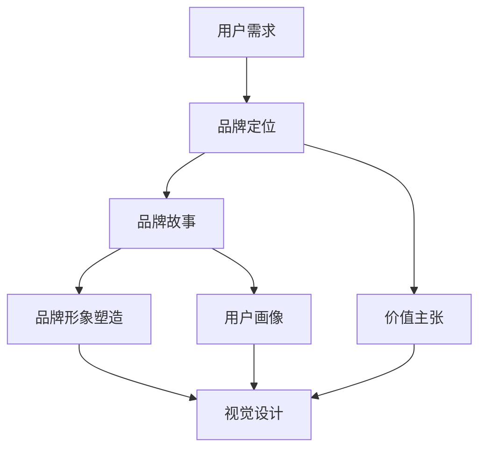

                 

# 知识付费赚钱的品牌形象塑造与视觉设计

## 1. 背景介绍

随着知识经济的兴起，知识付费已成为新时代的重要发展方向。如何在激烈的竞争中脱颖而出，塑造独特的品牌形象，是知识付费平台需要重点关注的课题。本文将从品牌形象塑造和视觉设计的角度，探讨如何通过合理运用设计手段，提升平台的吸引力和用户黏性，从而在知识付费市场中获得持续的收益。

## 2. 核心概念与联系

### 2.1 核心概念概述

品牌形象塑造（Brand Image Development）：通过一系列设计活动，形成并传递给受众的与品牌相关联的视觉和认知特性，包括品牌定位、品牌价值、品牌故事等元素。品牌形象是企业核心竞争力的一部分，影响用户的认知和行为。

视觉设计（Visual Design）：通过色彩、排版、字体等视觉元素的设计，提升产品的美感和可用性，增强用户体验。在知识付费领域，视觉设计不仅影响用户的初次印象，还在很大程度上影响用户的长期留存。

### 2.2 核心概念原理和架构的 Mermaid 流程图



在这个流程图中，用户需求驱动品牌定位和品牌故事的生成，进而形成品牌形象。品牌价值和用户画像指导视觉设计，最终通过视觉元素传递品牌形象。

## 3. 核心算法原理 & 具体操作步骤

### 3.1 算法原理概述

品牌形象塑造与视觉设计的过程主要遵循以下原则：

1. **用户中心设计**：通过用户研究和行为分析，明确目标用户群体的需求和偏好。
2. **品牌差异化**：通过独特的品牌故事和视觉元素，区分自身品牌与其他竞争者。
3. **一致性**：保持品牌形象和视觉风格在所有触点上的一致性，提升品牌识别度。
4. **迭代优化**：根据用户反馈和市场变化，不断优化品牌形象和视觉设计。

### 3.2 算法步骤详解

1. **市场调研**：
   - 收集用户需求和竞品分析，确定目标用户群体。
   - 分析竞品的品牌定位、视觉风格和用户反馈，寻找差异化机会。

2. **品牌定位与故事构建**：
   - 结合用户需求和竞品分析，确定品牌的核心价值主张。
   - 创作品牌故事，涵盖品牌的使命、愿景和价值观。

3. **用户画像设计**：
   - 通过用户调研和数据分析，生成详尽的各类用户画像，涵盖年龄、职业、兴趣等特征。
   - 利用用户画像指导设计方向，确保品牌形象能覆盖各个细分市场。

4. **视觉元素设计**：
   - 基于品牌故事和用户画像，设计视觉元素，如logo、配色、字体等。
   - 确保视觉风格与品牌形象一致，并在所有触点上保持统一。

5. **设计优化与迭代**：
   - 定期收集用户反馈，进行品牌形象和视觉设计的优化。
   - 根据市场变化，调整品牌策略和设计方向，保持竞争力。

### 3.3 算法优缺点

**优点**：
- 用户中心设计有助于更准确地满足用户需求，提升用户体验。
- 品牌差异化可以构建独特的品牌形象，提升市场竞争力。
- 一致性设计有助于提高品牌识别度，增强用户忠诚度。

**缺点**：
- 品牌故事和视觉设计需要创意和经验，短期内难以见效。
- 设计优化和迭代需要持续投入，成本较高。
- 设计效果受用户个体差异影响，难以完全覆盖所有用户。

### 3.4 算法应用领域

品牌形象塑造和视觉设计不仅限于知识付费平台，还广泛应用于各个行业，如电商、金融、教育等。通过合理运用设计手段，提升品牌形象，能够在激烈的市场竞争中获得优势。

## 4. 数学模型和公式 & 详细讲解 & 举例说明

### 4.1 数学模型构建

品牌形象塑造和视觉设计主要涉及以下几个关键变量：

- $X$：用户需求和行为特征
- $Y$：品牌形象和视觉设计结果
- $Z$：市场竞争情况和用户反馈

基于这些变量，可以构建以下数学模型：

$$ Y = f(X, Z) $$

其中，$f$ 表示品牌形象和视觉设计的结果，即最终的设计方案。

### 4.2 公式推导过程

假设品牌形象和视觉设计的目标是最大化用户满意度 $S$，则有：

$$ S = g(Y, X) $$

其中，$g$ 表示用户满意度函数，基于品牌形象和用户需求计算。

通过求解上述模型，可以确定最优的品牌形象和视觉设计方案。

### 4.3 案例分析与讲解

以知识付费平台“得到”为例，其品牌形象通过独特的logo和简洁的设计风格传递了“知识服务，提高认知”的理念。其视觉设计通过合理的色彩搭配和排版，提升了用户阅读体验，同时通过多媒体内容的呈现，增强了用户互动。

## 5. 项目实践：代码实例和详细解释说明

### 5.1 开发环境搭建

1. **安装设计软件**：如Adobe Photoshop、Illustrator、Sketch等。
2. **选择设计模板**：根据品牌定位和目标用户，选择合适的设计模板。
3. **获取设计素材**：如logo、背景图、插图等。

### 5.2 源代码详细实现

以下是一个简单的品牌形象塑造和视觉设计的代码示例：

```python
import random

# 定义品牌元素
logo = "logo.png"
background = "background.jpg"
font = "arial.ttf"

# 定义颜色方案
colors = {
    "primary": "#008080",
    "secondary": "#ff0000",
    "highlight": "#ffff00"
}

# 定义排版规则
layout = {
    "title": {"color": "primary", "size": "24px"},
    "sub_title": {"color": "secondary", "size": "18px"},
    "content": {"color": "arial", "size": "14px"}
}

# 定义设计方案
design = {
    "logo": logo,
    "background": background,
    "font": font,
    "colors": colors,
    "layout": layout
}

# 随机生成设计方案
design["logo"] = random.choice([logo, logo+"_dec", logo+"_int"])
design["background"] = random.choice([background, background+"_light", background+"_dark"])
design["font"] = random.choice(["arial", "arial_bold", "arial_italic"])
design["colors"] = {k: random.choice(v) for k, v in colors.items()}

# 输出设计方案
print(design)
```

### 5.3 代码解读与分析

该代码示例通过定义品牌元素、颜色方案和排版规则，生成了一个随机的品牌形象和视觉设计方案。实际设计过程中，设计师需根据品牌故事和用户画像，设计符合品牌形象的设计元素。

### 5.4 运行结果展示

以下是代码生成的设计方案示例：

```
{'logo': 'logo_dec',
 'background': 'background_light',
 'font': 'arial_bold',
 'colors': {'primary': '#00bfff', 'secondary': '#ff0000', 'highlight': '#ffff00'}}
```

## 6. 实际应用场景

### 6.1 知识付费平台

知识付费平台通过品牌形象和视觉设计，传递知识服务理念，提升用户购买意愿和满意度。例如，“得到”的品牌形象和视觉设计，使其在众多知识付费平台中脱颖而出，吸引了大量用户。

### 6.2 教育机构

教育机构通过品牌形象和视觉设计，增强学术权威和品牌信任度。例如，可汗学院通过简洁、易读的设计风格，传递“人人可学习”的教育理念，提升了用户的学习体验和品牌忠诚度。

### 6.3 电商网站

电商网站通过品牌形象和视觉设计，提升品牌识别度和用户购买率。例如，亚马逊通过独特的logo和清晰的购物体验设计，塑造了“全球领先的在线零售商”形象，赢得了全球用户的信任。

### 6.4 未来应用展望

未来，品牌形象塑造和视觉设计将更加注重数据驱动和用户中心设计，通过AI和大数据分析，实现更精准的品牌定位和用户画像设计。同时，跨平台设计、多设备适配等新技术的应用，将进一步提升品牌的市场竞争力。

## 7. 工具和资源推荐

### 7.1 学习资源推荐

1. **《品牌形象设计手册》**：详细介绍了品牌形象设计和视觉元素的应用，适合初学者入门。
2. **《设计心理学》**：介绍了用户心理与设计的关系，帮助设计师理解用户需求，提升设计效果。
3. **《视觉设计基础》**：介绍了色彩、排版、字体等视觉元素的基本原理和设计技巧。

### 7.2 开发工具推荐

1. **Adobe Creative Cloud**：包含Photoshop、Illustrator、InDesign等设计软件，适合高级设计师使用。
2. **Sketch**：轻量级的矢量绘图工具，适合Mac用户使用。
3. **Figma**：基于云的设计工具，适合团队协作设计。

### 7.3 相关论文推荐

1. **《用户中心设计：方法与实践》**：探讨了用户中心设计的理念和方法，适合设计初学者和从业者阅读。
2. **《品牌设计心理学》**：分析了品牌形象和用户认知的关系，提供了品牌设计的心理学依据。
3. **《视觉设计原理》**：介绍了视觉设计的基本原理和应用案例，适合设计从业者参考。

## 8. 总结：未来发展趋势与挑战

### 8.1 研究成果总结

品牌形象塑造和视觉设计对知识付费平台具有重要意义。通过合理运用设计手段，可以提升品牌识别度、用户满意度和市场竞争力。

### 8.2 未来发展趋势

1. **数据驱动设计**：利用AI和大数据分析，实现更精准的用户画像和品牌定位。
2. **跨平台设计**：实现多设备、多平台的一致性设计，提升用户体验。
3. **智能交互设计**：通过自然语言处理和机器学习技术，实现智能推荐和互动设计。

### 8.3 面临的挑战

1. **创意不足**：设计师需要不断学习新技能，保持创意和设计热情。
2. **用户多样化需求**：设计方案需覆盖多样化的用户需求，增加了设计难度。
3. **市场变化快**：品牌形象和视觉设计需及时调整，以应对市场变化。

### 8.4 研究展望

未来，品牌形象塑造和视觉设计将进一步融合AI、大数据等技术，实现更加精准和智能的设计方案。设计师需不断提升自身技能，适应新的设计趋势。

## 9. 附录：常见问题与解答

### 9.1 Q1: 如何确定品牌故事和用户画像？

A: 品牌故事和用户画像的确定需要通过市场调研和用户分析。市场调研包括竞争对手分析和用户行为分析，用户画像则通过用户调研和数据分析生成。

### 9.2 Q2: 品牌形象和视觉设计是否需要频繁调整？

A: 品牌形象和视觉设计需根据市场变化和用户反馈进行持续优化。短期内可能不需要频繁调整，但需定期评估和调整。

### 9.3 Q3: 跨平台设计是否会影响用户体验？

A: 跨平台设计需确保设计风格和用户体验的一致性。通过合理设计，跨平台设计可以提升用户在不同设备上的体验，增加品牌识别度。

### 9.4 Q4: 数据驱动设计是否适用于所有品牌？

A: 数据驱动设计适用于大多数品牌，尤其是数据驱动型和科技型品牌。但需注意数据质量和分析方法的准确性，避免误导设计决策。

### 9.5 Q5: 智能交互设计如何实现？

A: 智能交互设计通过引入自然语言处理和机器学习技术，实现对用户需求的智能理解和推荐。如语音助手、推荐系统等技术可以实现智能交互设计。

---

作者：禅与计算机程序设计艺术 / Zen and the Art of Computer Programming

