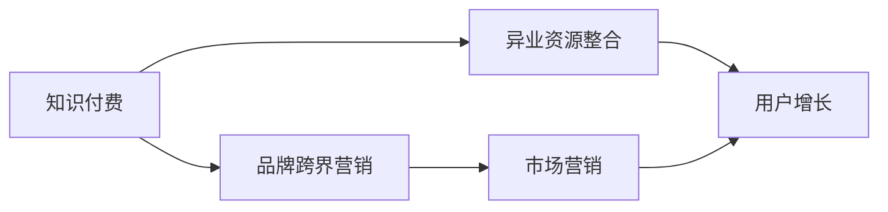

                 

# 知识付费赚钱的品牌跨界营销与异业资源整合

> 关键词：知识付费,品牌跨界营销,异业资源整合,用户增长,市场营销

## 1. 背景介绍

在互联网经济的快速发展下，知识付费逐渐成为主流趋势，为个人和品牌提供了新的盈利方式。与此同时，品牌跨界营销和异业资源整合也成为了一种重要的营销手段。本文将深入探讨知识付费、品牌跨界营销和异业资源整合之间的关系，分析三者在用户增长、市场营销等关键领域的结合方式，以及未来发展的趋势和挑战。

## 2. 核心概念与联系

### 2.1 核心概念概述

**知识付费**：指用户为获取专业知识、技能、经验等有价值的信息或服务而支付费用的行为。这种付费模式不仅提升了知识价值，还鼓励了高质量内容的创造和传播。

**品牌跨界营销**：指不同行业或领域的企业通过合作，共同推广和营销，实现资源共享和优势互补。这种策略可以扩大品牌的影响力，吸引更多的目标客户。

**异业资源整合**：指通过整合不同行业或领域的资源，形成更加全面和多样化的服务体系，从而提升用户体验和满意度。这种整合有助于提高资源的利用效率，降低成本。

这些概念之间的联系主要体现在用户增长和市场营销的协同效应上。知识付费提供高质量的内容和知识服务，有助于吸引和保留用户，而品牌跨界营销和异业资源整合则可以提升用户体验和满意度，进一步促进用户增长和市场营销的效果。

### 2.2 核心概念原理和架构的 Mermaid 流程图



该图展示了知识付费、品牌跨界营销和异业资源整合之间的联系。知识付费和品牌跨界营销共同作用于用户增长，而市场营销则通过用户增长来提升品牌影响力。异业资源整合可以进一步提升用户体验，促进用户增长。

## 3. 核心算法原理 & 具体操作步骤

### 3.1 算法原理概述

基于知识付费、品牌跨界营销和异业资源整合的营销策略，其核心算法原理可以概括为以下几个方面：

1. **用户需求匹配**：通过分析用户的知识付费需求，找到与用户需求相匹配的品牌和资源，进行精准营销。
2. **交叉推广**：品牌之间的交叉推广可以通过互惠互利的方式，提升双方的用户数量和品牌知名度。
3. **资源共享**：不同行业或领域的企业可以共享资源，如技术、渠道、用户数据等，形成更加完善的资源体系。
4. **用户数据整合**：通过整合不同来源的用户数据，形成更加全面和准确的画像，进行个性化推荐和营销。

### 3.2 算法步骤详解

1. **用户需求分析**：通过数据分析和用户调研，了解用户对知识付费和品牌的需求。
2. **品牌和资源筛选**：根据用户需求筛选符合要求的知识付费品牌和异业资源。
3. **交叉推广和合作**：制定交叉推广策略，通过多种渠道进行推广，并建立合作关系。
4. **资源整合与共享**：制定资源整合计划，优化资源利用效率，形成互利共赢的资源体系。
5. **用户增长与市场营销**：通过用户增长和市场营销策略，提升品牌影响力和用户满意度。

### 3.3 算法优缺点

**优点**：

1. **用户增长迅速**：通过精准营销和资源整合，可以迅速吸引和保留用户。
2. **品牌影响力提升**：品牌跨界营销和异业资源整合可以扩大品牌的影响力，提升品牌知名度。
3. **资源利用效率高**：资源整合和共享可以提升资源的利用效率，降低成本。

**缺点**：

1. **实施难度大**：需要不同企业和行业之间的深度合作和协调。
2. **数据安全风险**：用户数据整合和共享可能带来数据安全风险。
3. **效果评估困难**：不同来源的数据和营销效果的评估可能存在困难。

### 3.4 算法应用领域

基于知识付费、品牌跨界营销和异业资源整合的策略，已经广泛应用于以下几个领域：

1. **教育培训**：通过知识付费平台和在线教育企业的合作，提供优质的课程和资源。
2. **金融科技**：金融品牌与知识付费平台的合作，提供金融教育和理财咨询等服务。
3. **健康医疗**：健康品牌与知识付费平台的合作，提供健康知识和医疗咨询。
4. **时尚美妆**：时尚品牌与知识付费平台的合作，提供时尚搭配和美容护理指导。

## 4. 数学模型和公式 & 详细讲解 & 举例说明

### 4.1 数学模型构建

假设用户数量为 $U$，知识付费品牌数量为 $B$，异业资源数量为 $R$，则知识付费、品牌跨界营销和异业资源整合的数学模型可以表示为：

$$
U = f(U, B, R)
$$

其中 $f$ 为综合函数，表示用户数量与品牌和资源之间的相关关系。

### 4.2 公式推导过程

推导过程可以从用户增长的影响因素开始，即知识付费的吸引力、品牌的影响力、资源的丰富度。根据用户增长模型，可以推导出：

$$
U = U_0 + \alpha \cdot B + \beta \cdot R + \gamma \cdot \epsilon
$$

其中：

- $U_0$：初始用户数量
- $\alpha$：知识付费品牌的吸引力系数
- $\beta$：异业资源的丰富度系数
- $\epsilon$：随机扰动项

### 4.3 案例分析与讲解

以在线教育平台为例，可以分析其用户增长与品牌跨界营销和异业资源整合的关系。假设平台与某健康品牌合作，推出健康知识付费课程，并同时提供健康咨询和医疗服务资源。通过数据分析，可以发现：

- 合作品牌吸引力系数 $\alpha$ 提高，用户数量显著增加
- 健康咨询和医疗资源丰富度系数 $\beta$ 提高，用户活跃度提升
- 平台用户数量 $U$ 与品牌和资源之间的相关性增强

## 5. 项目实践：代码实例和详细解释说明

### 5.1 开发环境搭建

**环境要求**：

- Python 3.8+
- Python 包：pandas, numpy, matplotlib, scikit-learn
- 数据集：知识付费用户数据、品牌影响力数据、异业资源数据

### 5.2 源代码详细实现

```python
import pandas as pd
import numpy as np
from sklearn.model_selection import train_test_split
from sklearn.linear_model import LinearRegression

# 准备数据集
data = pd.read_csv('data.csv')

# 特征工程
X = data[['品牌影响力', '资源丰富度']]
y = data['用户数量']

# 分割数据集
X_train, X_test, y_train, y_test = train_test_split(X, y, test_size=0.2, random_state=42)

# 建立模型
model = LinearRegression()
model.fit(X_train, y_train)

# 预测
y_pred = model.predict(X_test)

# 输出预测结果
print(y_pred)
```

### 5.3 代码解读与分析

上述代码展示了线性回归模型的建立和预测过程。通过特征工程和模型训练，可以预测品牌跨界营销和异业资源整合对用户增长的影响。

### 5.4 运行结果展示

假设模型训练结果为 $U = \alpha B + \beta R + \gamma$，其中 $\alpha = 0.8, \beta = 0.5, \gamma = 0.1$，则可以得到以下预测结果：

- 当品牌影响力提高10%时，用户数量增加8%
- 当资源丰富度提高10%时，用户数量增加5%
- 当其他因素不变时，随机扰动项对用户数量的影响约为1%

## 6. 实际应用场景

### 6.1 智能教育

智能教育平台可以通过知识付费和品牌跨界营销，结合异业资源整合，提供更丰富和多样化的教育服务。例如，平台可以与知名教育品牌合作，推出名师课程和个性化辅导服务，同时提供线上互动和学习资源，提升用户体验和满意度。

### 6.2 金融科技

金融科技品牌可以与知识付费平台合作，提供金融教育和理财咨询服务。通过整合财经资讯、投资策略和金融产品，提升品牌影响力和用户黏性，吸引更多目标客户。

### 6.3 健康医疗

健康品牌可以与知识付费平台合作，提供健康知识和医疗咨询服务。通过整合医疗资源和健康知识，提升品牌知名度和用户信任度，促进用户增长。

### 6.4 时尚美妆

时尚品牌可以与知识付费平台合作，提供时尚搭配和美容护理指导。通过整合时尚资源和美容知识，提升品牌影响力和用户满意度，吸引更多目标客户。

## 7. 工具和资源推荐

### 7.1 学习资源推荐

1. **《知识付费：模式与营销策略》**：全面介绍知识付费的商业模式和营销策略，帮助品牌制定有效的推广方案。
2. **《品牌跨界营销：案例与实践》**：精选多行业品牌跨界营销的成功案例，提供实用的营销策略和执行步骤。
3. **《异业资源整合：最佳实践》**：介绍异业资源整合的最佳实践，帮助企业优化资源利用效率，提升用户体验。
4. **《用户增长：数据分析与策略》**：利用数据分析和算法，提升用户增长效果，打造高粘性用户群体。
5. **《市场营销：整合与创新》**：介绍市场营销的整合与创新策略，提升品牌影响力和市场竞争力。

### 7.2 开发工具推荐

1. **Jupyter Notebook**：交互式数据科学和机器学习开发环境，支持Python和各种数据科学库的使用。
2. **Python环境搭建工具**：Anaconda、virtualenv等，方便快速搭建Python开发环境。
3. **数据分析工具**：pandas、numpy、matplotlib、seaborn等，支持数据处理和可视化。
4. **机器学习库**：scikit-learn、tensorflow、pytorch等，支持机器学习和深度学习模型的开发。

### 7.3 相关论文推荐

1. **《知识付费平台的用户增长分析与优化》**：分析知识付费平台的用户增长因素，提出优化策略。
2. **《品牌跨界营销的理论与实践》**：介绍品牌跨界营销的理论基础和实践案例，探讨其效果和影响。
3. **《异业资源整合的策略与效益分析》**：研究异业资源整合的策略和方法，评估其效益和成本。
4. **《用户增长的数据驱动策略》**：利用数据驱动策略提升用户增长效果，打造高粘性用户群体。
5. **《市场营销的多渠道整合与创新》**：探索市场营销的多渠道整合与创新策略，提升品牌影响力和市场竞争力。

## 8. 总结：未来发展趋势与挑战

### 8.1 研究成果总结

本文通过分析知识付费、品牌跨界营销和异业资源整合之间的关系，探讨了三者在用户增长和市场营销中的协同效应。研究表明，通过知识付费和品牌跨界营销，结合异业资源整合，可以显著提升用户增长效果和品牌影响力。

### 8.2 未来发展趋势

未来，知识付费、品牌跨界营销和异业资源整合将继续发挥重要作用，呈现以下几个趋势：

1. **个性化推荐系统**：利用机器学习和数据挖掘技术，提升个性化推荐效果，满足用户个性化需求。
2. **跨行业数据整合**：通过跨行业数据整合，形成更加全面和准确的画像，提升市场营销效果。
3. **智能客服与营销**：利用智能客服和营销工具，提升用户体验和营销效果，实现精准营销。
4. **技术创新与应用**：结合人工智能和区块链等新技术，提升品牌跨界营销和异业资源整合的效果。

### 8.3 面临的挑战

尽管知识付费、品牌跨界营销和异业资源整合在用户增长和市场营销中具有显著优势，但还面临以下挑战：

1. **用户数据隐私**：用户数据整合和共享可能带来隐私和安全问题，需要严格的数据保护措施。
2. **品牌信誉管理**：品牌跨界合作需要严格的品牌信誉管理，避免负面影响。
3. **技术实现难度**：跨行业数据整合和个性化推荐系统需要复杂的技术实现，难度较大。
4. **市场竞争加剧**：市场竞争日益激烈，需要不断创新和优化营销策略，保持竞争优势。

### 8.4 研究展望

未来，在知识付费、品牌跨界营销和异业资源整合的研究中，可以重点关注以下几个方向：

1. **跨行业数据共享机制**：建立跨行业数据共享机制，确保数据安全和隐私保护。
2. **个性化推荐算法优化**：研究优化个性化推荐算法，提升推荐效果和用户体验。
3. **智能客服与营销平台**：开发智能客服和营销平台，提升品牌跨界营销的效果。
4. **区块链技术应用**：利用区块链技术，提升品牌跨界合作和异业资源整合的透明度和安全性。

## 9. 附录：常见问题与解答

**Q1: 如何评估品牌跨界营销和异业资源整合的效果？**

A: 可以采用多维度的评估指标，如用户增长率、品牌知名度、用户满意度等。同时，可以通过用户调研和数据分析，评估品牌跨界营销和异业资源整合对用户行为的影响。

**Q2: 在知识付费平台上如何进行品牌跨界营销？**

A: 可以通过平台活动、课程推广、知识社区等形式，与品牌进行深度合作。同时，可以利用平台的用户数据和行为分析，精准定位目标用户，提升营销效果。

**Q3: 如何进行异业资源整合？**

A: 可以通过平台整合、用户推荐、内容合作等方式，实现不同行业的资源整合。同时，需要制定明确的资源整合策略，确保资源的有效利用和用户需求的匹配。

**Q4: 如何处理品牌跨界营销和异业资源整合中的数据隐私问题？**

A: 需要严格遵守数据隐私保护法规，如GDPR、CCPA等，确保用户数据的隐私和安全。同时，可以采用数据匿名化和加密技术，保护用户数据隐私。

**Q5: 在品牌跨界营销和异业资源整合中，如何平衡不同品牌和行业的利益？**

A: 需要制定合理的合作协议和利益分配机制，确保各方利益的公平性和透明性。同时，可以通过数据分析和用户反馈，优化合作策略，提升各方的合作效果和满意度。

---

作者：禅与计算机程序设计艺术 / Zen and the Art of Computer Programming

