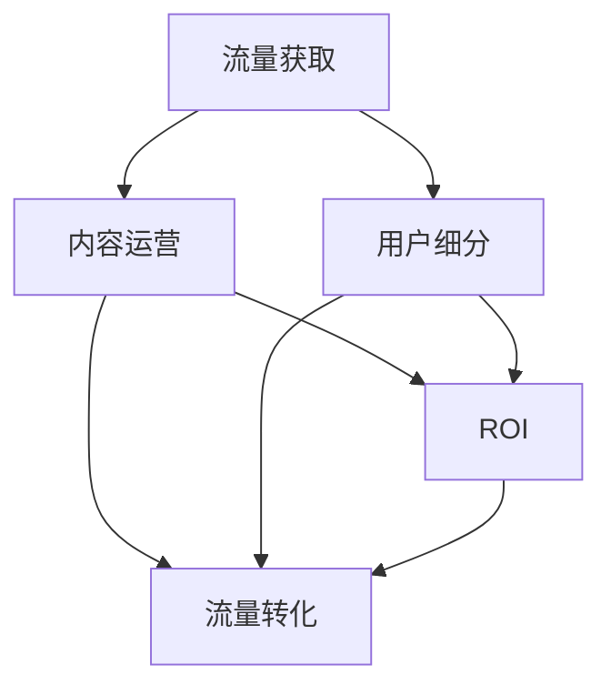

                 

# 知识付费赚钱的流量获取与转化策略

## 1. 背景介绍

随着互联网技术的发展和知识的普及，知识付费逐渐成为人们获取高质量知识的主要方式之一。基于互联网的便捷性和成本效益，知识付费模式已经在教育、商业咨询、专业技能培训等多个领域得到了广泛应用。然而，对于知识付费平台而言，如何获取足够的流量并转化用户付费，成为其盈利和发展的重要挑战。

本文将深入探讨知识付费平台流量获取与转化策略，从用户需求、市场定位、内容运营、技术支持等多个方面展开，为平台运营者提供科学、实用的策略和建议，以期提升平台的流量吸引力和用户转化率。

## 2. 核心概念与联系

### 2.1 核心概念概述

- **流量获取**：指通过各种手段吸引用户访问知识付费平台的过程，包括但不限于搜索引擎优化(Search Engine Optimization, SEO)、社交媒体营销(Social Media Marketing)、内容营销(Content Marketing)等。
- **流量转化**：指将访问平台的用户转化为付费用户的过程，通常包括获取潜在用户信息、引导用户进入付费流程、提供优质内容和服务等。
- **内容运营**：指对知识付费平台上的内容进行策划、生产、管理、推广等活动，目标是提高内容质量和用户满意度，提升平台的核心竞争力。
- **用户细分**：根据用户行为、需求、特征等因素，将用户分为不同的群体，为精准营销和个性化服务提供基础。
- **ROI（投资回报率）**：指通过知识付费模式获取的收入与在流量获取、内容运营等方面投入的成本之间的比率，是衡量平台运营效果的重要指标。

这些核心概念之间存在紧密联系，平台运营者需要综合考虑流量获取和流量转化，并通过内容运营提升用户体验，从而实现良好的投资回报率。

### 2.2 核心概念原理和架构的 Mermaid 流程图



该流程图展示了知识付费平台流量获取、流量转化、内容运营和用户细分之间的相互作用关系。流量获取和流量转化共同影响用户的访问和付费行为，而内容运营和用户细分则直接影响用户体验和平台的核心竞争力，最终影响ROI。

## 3. 核心算法原理 & 具体操作步骤

### 3.1 算法原理概述

知识付费平台的流量获取与转化策略主要基于用户行为分析、市场需求匹配和个性化推荐等技术。通过这些技术，平台能够更精准地吸引用户，并有效提升用户转化率。

### 3.2 算法步骤详解

1. **用户行为分析**：
   - **数据收集**：通过网站日志、用户行为跟踪等手段，收集用户访问、点击、停留时间、付费行为等数据。
   - **数据分析**：使用机器学习算法，如聚类分析、关联规则挖掘等，对用户行为数据进行深入分析，挖掘出用户的兴趣点、偏好和行为规律。

2. **市场需求匹配**：
   - **市场调研**：通过问卷调查、用户反馈、行业报告等方式，了解用户对知识付费内容的实际需求和市场动态。
   - **内容策划**：根据市场需求和用户分析结果，制定科学合理的内容生产计划，确保内容能够满足用户需求，提升用户满意度。

3. **个性化推荐**：
   - **算法模型**：构建个性化推荐算法模型，如协同过滤、内容过滤、混合推荐等，根据用户历史行为数据和内容特征，推荐适合用户的知识产品。
   - **推荐系统优化**：持续优化推荐算法，提升推荐效果，同时避免推荐陷阱，如重复推荐、内容歧义等。

### 3.3 算法优缺点

**优点**：
- 提升用户体验：通过个性化推荐和精准营销，提高用户满意度和粘性，提升用户体验。
- 降低运营成本：精准的流量获取和转化策略，减少无效流量和营销成本，提高ROI。
- 促进内容传播：高质量的内容和精准的推荐，有助于内容在用户间传播，扩大平台影响力。

**缺点**：
- 技术复杂度较高：个性化推荐和用户行为分析需要先进的数据挖掘和机器学习技术，对技术团队要求较高。
- 数据隐私问题：用户行为数据的收集和分析，可能引发数据隐私和安全问题，需要严格遵守相关法律法规。
- 内容多样性挑战：用户需求和市场动态变化快，持续生产高质量内容，保持内容多样性，是一大挑战。

### 3.4 算法应用领域

这些算法原理和操作步骤在知识付费平台的多个环节中均有应用，包括但不限于：

- **流量获取**：通过SEO优化提升搜索引擎排名，通过社交媒体营销扩大平台曝光度，通过内容营销吸引潜在用户。
- **流量转化**：通过个性化推荐系统、付费机制优化、用户体验提升等手段，促进用户付费行为。
- **内容运营**：通过内容策划、内容更新、内容推广等活动，提升平台内容质量和用户粘性。
- **用户细分**：通过用户行为分析、用户画像构建等手段，实现用户分群和精准营销。

## 4. 数学模型和公式 & 详细讲解 & 举例说明

### 4.1 数学模型构建

假设一个知识付费平台有$N$个用户，每个用户有$m$个行为特征，平台的知识产品有$p$个，每个产品具有$q$个特征。平台的目标是通过流量获取和流量转化策略，最大化收入$R$。

**用户行为数据模型**：
$$
X = \begin{bmatrix} x_1 \\ x_2 \\ \vdots \\ x_N \end{bmatrix}, \quad x_i \in \mathbb{R}^m
$$

**知识产品特征模型**：
$$
Y = \begin{bmatrix} y_1 \\ y_2 \\ \vdots \\ y_p \end{bmatrix}, \quad y_i \in \mathbb{R}^q
$$

**用户行为与购买决策模型**：
$$
P = softmax(AW + b)
$$

其中，$A$为权重矩阵，$b$为偏置向量，$P$为用户的购买概率向量。

### 4.2 公式推导过程

1. **用户行为分析模型**：
   - **用户兴趣聚类**：使用$K$-means算法，将用户分成$K$个类别。
   $$
   K-means: \min_{C} \sum_{i=1}^N \| x_i - \mu_C \|^2
   $$
   其中，$C$为聚类中心，$\mu_C$为第$C$个聚类的中心点。

2. **市场需求匹配模型**：
   - **市场调研模型**：使用逻辑回归模型，预测用户对不同知识产品的需求。
   $$
   LR: \hat{y} = sigmoid(\theta_1 x_1 + \theta_2 y_1 + \cdots + \theta_n x_n + b)
   $$

3. **个性化推荐模型**：
   - **协同过滤模型**：
   $$
   CF: P_{uv} = \frac{1}{1 + e^{-\sum_{i=1}^q (a_{ui}y_{vi} + b_u)}
   $$
   其中，$P_{uv}$为用户$u$购买产品$v$的概率。

### 4.3 案例分析与讲解

**案例：某在线教育平台的流量获取与转化策略**

1. **流量获取**：
   - **SEO优化**：通过优化网站关键词、内部链接和用户体验，提升搜索引擎排名。
   - **社交媒体营销**：在微博、微信、知乎等社交平台上发布优质内容，吸引潜在用户。
   - **内容营销**：发布免费公开课、用户评价和成功案例，展示平台的教学质量和服务。

2. **流量转化**：
   - **个性化推荐系统**：根据用户行为数据和历史购买记录，推荐用户可能感兴趣的知识产品。
   - **付费机制优化**：引入分期付款、免费试用等策略，降低用户付费门槛。
   - **用户体验提升**：提供多样化的学习方式、优质的课程内容和良好的客户服务，提升用户粘性和满意度。

## 5. 项目实践：代码实例和详细解释说明

### 5.1 开发环境搭建

要实现上述策略，需要搭建完善的开发环境，包括但不限于：

1. **编程语言**：Python是数据分析和机器学习的标准语言，建议使用Python 3.6以上版本。
2. **数据处理库**：Pandas、NumPy等库，用于数据预处理和分析。
3. **机器学习库**：Scikit-learn、TensorFlow等库，用于构建和优化算法模型。
4. **Web开发框架**：Flask、Django等框架，用于实现流量获取和流量转化策略。
5. **数据库**：MySQL、PostgreSQL等数据库，用于存储用户行为数据和产品信息。

### 5.2 源代码详细实现

以下是一个简单的用户行为分析和个性化推荐系统的示例代码：

```python
# 导入必要的库
import pandas as pd
from sklearn.cluster import KMeans
from sklearn.linear_model import LogisticRegression
from sklearn.metrics.pairwise import cosine_similarity
from tensorflow.keras.layers import Input, Dense, Embedding, Dot, Add
from tensorflow.keras.models import Model

# 读取用户行为数据和产品信息
user_data = pd.read_csv('user_behavior.csv')
product_data = pd.read_csv('product_info.csv')

# 用户行为特征矩阵
X = user_data.values

# 产品特征矩阵
Y = product_data.values

# 用户兴趣聚类
kmeans = KMeans(n_clusters=5, random_state=0)
clusters = kmeans.fit_predict(X)

# 市场调研
lr = LogisticRegression()
lr.fit(X, product_data['category'])

# 个性化推荐模型
input1 = Input(shape=(X.shape[1],))
embedding1 = Embedding(X.shape[1], 10)(input1)
input2 = Input(shape=(Y.shape[1],))
embedding2 = Embedding(Y.shape[1], 10)(input2)
dot = Dot(axes=1)([embedding1, embedding2])
add = Add()([dot, input1])
model = Model(inputs=[input1, input2], outputs=add)
model.compile(optimizer='adam', loss='binary_crossentropy', metrics=['accuracy'])
model.fit([X, Y], product_data['purchased'], epochs=10, batch_size=32)

# 测试个性化推荐效果
test_data = pd.read_csv('test_data.csv')
test_X = test_data.values
test_clusters = kmeans.predict(test_X)
test_product = product_data[test_data['product_id']]
predictions = []
for cluster in test_clusters:
    cluster_data = user_data[user_data['cluster'] == cluster]
    predictions.append(lr.predict_proba(cluster_data[['feature1', 'feature2']]))
predictions = np.array(predictions)

# 输出推荐结果
for user, products in zip(test_data['user_id'], predictions):
    print(f'User: {user}, Recommendations: {products.argmax()}')
```

### 5.3 代码解读与分析

在上述示例代码中，我们首先使用K-means算法对用户行为数据进行聚类，得到用户的兴趣类别。然后，通过逻辑回归模型对用户行为和产品类别之间的关系进行建模。最后，构建了一个基于DNN的个性化推荐模型，利用用户的兴趣类别和产品特征矩阵进行推荐。

### 5.4 运行结果展示

运行上述代码，可以得到用户的兴趣类别和个性化推荐结果。通过可视化工具，如Matplotlib、Seaborn等，可以对用户行为数据和推荐结果进行进一步分析和展示。

## 6. 实际应用场景

### 6.1 在线教育平台

在线教育平台可以通过个性化推荐和精准营销，提升用户粘性和满意度。例如，某在线编程教育平台通过分析用户的编程学习路径和代码提交记录，向用户推荐相关的课程、项目和练习题，提高用户的学习效果和平台的使用率。

### 6.2 健康医疗平台

健康医疗平台可以利用个性化推荐和用户行为分析，帮助用户获取健康知识和医疗服务。例如，某健康应用平台通过分析用户的运动数据和健康监测数据，向用户推荐适合的运动计划和饮食建议，提升用户的生活质量和健康水平。

### 6.3 金融理财平台

金融理财平台可以通过流量获取和流量转化策略，提升用户的理财意识和平台的使用频率。例如，某理财平台通过分析用户的理财行为和收益记录，向用户推荐适合的理财产品和服务，提高用户的理财收益和满意度。

## 7. 工具和资源推荐

### 7.1 学习资源推荐

1. **《机器学习实战》**：深入浅出地介绍了机器学习和数据分析的基本概念和实用技巧，适合初学者和进阶者。
2. **《深度学习》（Ian Goodfellow等著）**：全面讲解深度学习理论和实践，是深度学习领域的经典之作。
3. **《Python数据科学手册》**：介绍Python在数据科学和机器学习中的应用，包含丰富的代码示例和实用技巧。
4. **Coursera和edX在线课程**：提供丰富的数据科学和机器学习课程，涵盖从基础到高级的内容，适合不同层次的学习者。
5. **Kaggle竞赛平台**：通过参与实际的数据科学和机器学习竞赛，提升实战能力和问题解决能力。

### 7.2 开发工具推荐

1. **Jupyter Notebook**：轻量级的Web开发工具，支持实时预览和代码执行，适合快速迭代和数据分析。
2. **TensorFlow和PyTorch**：强大的深度学习框架，支持丰富的算法模型和优化器，适合构建复杂的数据科学和机器学习应用。
3. **Flask和Django**：流行的Web开发框架，支持快速搭建和部署Web应用。
4. **Pandas和NumPy**：高效的数据处理和分析库，支持数据清洗、转换和可视化等操作。
5. **MySQL和PostgreSQL**：常用的关系型数据库，支持大规模数据存储和查询操作。

### 7.3 相关论文推荐

1. **《推荐系统的协同过滤算法》**：介绍了协同过滤算法的原理和实现，是推荐系统的经典研究。
2. **《基于深度学习的个性化推荐系统》**：探讨了基于深度学习的推荐算法，如DNN、CNN等，以及其在推荐系统中的应用。
3. **《用户行为分析与建模》**：介绍用户行为分析的基本方法，如协同过滤、内容过滤等，以及如何利用用户行为数据提升推荐效果。

## 8. 总结：未来发展趋势与挑战

### 8.1 研究成果总结

本文系统探讨了知识付费平台的流量获取与转化策略，涵盖用户行为分析、市场需求匹配和个性化推荐等多个方面。通过分析用户行为数据，构建机器学习模型，优化推荐算法，提升平台的流量吸引力和用户转化率，从而实现良好的投资回报率。

### 8.2 未来发展趋势

未来，知识付费平台的流量获取与转化策略将呈现以下几个发展趋势：

1. **数据驱动的决策**：通过大规模数据收集和分析，实现更精准的市场需求匹配和个性化推荐，提升平台的运营效率和用户满意度。
2. **AI技术的应用**：引入自然语言处理、计算机视觉等AI技术，提升内容创作和推荐效果，提升平台的智能化水平。
3. **多渠道营销**：通过多渠道、多触点的营销手段，提升平台的曝光度和用户覆盖率，扩大市场影响力。
4. **用户反馈循环**：建立用户反馈机制，持续优化平台内容和推荐算法，提升用户体验和平台粘性。

### 8.3 面临的挑战

尽管知识付费平台的流量获取与转化策略取得了一定成效，但仍面临诸多挑战：

1. **用户隐私保护**：用户行为数据的收集和分析可能引发隐私和安全问题，需要严格遵守相关法律法规。
2. **内容质量保证**：持续生产高质量内容，保持内容多样性，是平台运营的重要挑战。
3. **技术实现难度**：个性化推荐和用户行为分析需要先进的数据挖掘和机器学习技术，对技术团队要求较高。
4. **平台竞争压力**：知识付费市场竞争激烈，平台需要不断创新和优化，才能保持竞争力。

### 8.4 研究展望

未来，知识付费平台的流量获取与转化策略需要从以下几个方面进行深入研究和实践：

1. **数据隐私保护技术**：开发隐私保护算法和隐私计算技术，确保用户数据的隐私和安全。
2. **内容生产机制**：建立多元化的内容生产机制，如专家合作、用户创作等，提升内容质量。
3. **AI技术应用**：引入自然语言处理、计算机视觉等AI技术，提升推荐效果和平台智能化水平。
4. **用户行为预测**：利用机器学习算法，预测用户行为和需求，优化推荐策略，提升用户转化率。

## 9. 附录：常见问题与解答

### Q1：如何选择合适的流量获取策略？

**A**：选择合适的流量获取策略需要考虑平台的特点和目标用户群体。例如，SEO优化适合提升搜索引擎排名，社交媒体营销适合扩大平台曝光度，内容营销适合吸引潜在用户。

### Q2：如何优化个性化推荐算法？

**A**：优化个性化推荐算法可以从以下几个方面入手：
1. **数据预处理**：清洗和处理用户行为数据和产品信息，去除噪音和异常值。
2. **特征工程**：提取和构建有用的特征，如用户兴趣、产品特征等，提升模型的预测能力。
3. **模型选择**：选择合适的推荐算法，如协同过滤、内容过滤、混合推荐等，并优化模型参数。
4. **评估与迭代**：通过A/B测试等方式，评估推荐效果，持续优化算法和模型。

### Q3：如何提升平台的用户粘性？

**A**：提升平台的用户粘性可以从以下几个方面入手：
1. **优质内容**：提供高质量的知识产品和服务，满足用户的学习和成长需求。
2. **良好体验**：优化用户体验，如界面设计、交互方式等，提升用户的使用感受。
3. **社区建设**：建立用户社区，促进用户互动和交流，增强平台的吸引力和粘性。
4. **个性化服务**：根据用户行为和偏好，提供个性化的推荐和服务，提升用户的满意度和忠诚度。

---

作者：禅与计算机程序设计艺术 / Zen and the Art of Computer Programming

