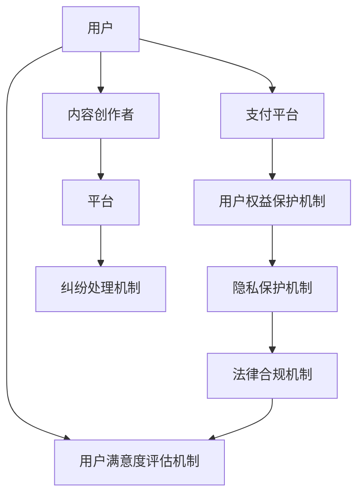

                 

# 知识付费赚钱的用户权益保护与纠纷处理机制

> 关键词：知识付费, 用户权益保护, 纠纷处理, 隐私保护, 用户满意度, 法律合规

## 1. 背景介绍

在数字化和知识经济蓬勃发展的当下，知识付费成为一种新型的教育和内容消费方式，为创作者和消费者之间搭建起了一座桥梁。平台如得到、新东方在线、荔枝微课等，汇聚了众多有才华的知识付费内容创作者和听众，促使知识变现、教育普及，以及个人能力提升。

然而，知识付费的繁荣也带来了用户权益保护和纠纷处理的新挑战。用户对付费服务的合理期望、隐私保护的需求，以及合法合规的要求，成为平台、创作者和消费者共同需要面对的问题。本文将探讨知识付费场景下用户权益保护和纠纷处理的机制，旨在为各方提供一个公正、透明、可操作的用户权益保障机制。

## 2. 核心概念与联系

### 2.1 核心概念概述

- **知识付费**：用户为获取特定知识、技能、经验等进行付费的行为。形式包括订阅、按需支付等。
- **用户权益保护**：保障用户在知识付费场景下的合法权益，如个人信息保护、知情权、选择权、公平交易权等。
- **纠纷处理**：当用户权益受到侵犯，或与内容创作者、平台之间产生争议时，提供的争议解决机制。
- **隐私保护**：在用户付费和使用服务过程中，保护用户的个人信息和数据安全。
- **用户满意度**：评估用户对知识付费服务的满意程度，提升用户体验。
- **法律合规**：确保知识付费平台、内容创作者和相关行为符合当地法律法规，避免法律风险。

### 2.2 核心概念原理和架构的 Mermaid 流程图



这个流程图展示了知识付费服务中各个环节的相互关系。用户通过平台和支付平台支付获取内容，平台和内容创作者提供服务，用户权益保护、隐私保护和法律合规机制共同保障用户权益，纠纷处理机制解决争议，用户满意度评估机制提升用户体验。

## 3. 核心算法原理 & 具体操作步骤

### 3.1 算法原理概述

知识付费的用户权益保护和纠纷处理机制，可以通过以下三个核心算法来实现：

1. **用户信息保护算法**：确保用户信息在收集、存储和处理过程中不泄露，不被滥用。
2. **纠纷解决算法**：提供一个公正、透明的争议解决流程，帮助用户与内容创作者、平台之间迅速、有效地解决纠纷。
3. **用户满意度评估算法**：基于用户反馈和行为数据，评估用户对服务的满意程度，并反馈给平台和创作者进行改进。

### 3.2 算法步骤详解

#### 3.2.1 用户信息保护算法

**步骤1：数据收集和存储**
- 确保收集用户信息时有明确的用户同意。
- 存储时使用加密技术，保护用户数据不被未授权访问。

**步骤2：数据处理**
- 仅在必要情况下处理用户数据，如用户权限设置、个性化推荐等。
- 定期进行数据审查，确保数据使用符合政策法规。

**步骤3：数据传输**
- 采用端到端加密，防止数据在传输过程中被截获或篡改。

#### 3.2.2 纠纷解决算法

**步骤1：明确用户和创作者、平台之间的权利和责任**
- 在平台协议中明确用户、创作者和平台的权利和责任，以及纠纷解决的流程。

**步骤2：建立纠纷处理机制**
- 提供用户与创作者、平台之间的直接沟通渠道，如客服、在线纠纷解决等。
- 设定明确的解决时间，保证争议迅速解决。

**步骤3：合规性审查**
- 定期进行合规性审查，确保争议解决过程符合当地法律法规。

#### 3.2.3 用户满意度评估算法

**步骤1：收集用户反馈**
- 通过问卷调查、用户评论、行为分析等方式收集用户反馈。

**步骤2：数据分析**
- 对收集到的数据进行分析，识别用户满意度的关键因素。

**步骤3：改进服务**
- 基于分析结果，平台和创作者对服务进行改进，提升用户体验。

### 3.3 算法优缺点

**优点**：
1. **用户权益保护**：确保用户在数据使用和隐私保护上的合法权益得到保障。
2. **透明公正**：纠纷解决机制有助于解决用户与创作者、平台之间的争议，提升用户信任度。
3. **提升满意度**：通过用户满意度评估，持续改进服务，提升用户体验。

**缺点**：
1. **资源消耗**：数据保护和合规审查需要消耗大量计算资源。
2. **合规风险**：各地法律法规差异可能导致不同平台之间的合规风险不同。
3. **用户教育成本**：用户需要了解相关政策法规和维权机制，增加了教育成本。

### 3.4 算法应用领域

知识付费的用户权益保护和纠纷处理机制在以下领域具有广泛应用：

1. **在线教育平台**：如得到、新东方在线、Coursera 等，保护用户个人信息和课程质量。
2. **专业培训和认证平台**：如Udemy、LinkedIn Learning 等，保障用户选择权和公平交易权。
3. **内容订阅平台**：如Medium、Medium付费版，确保用户支付的合理性和内容质量。
4. **技术博客和论坛**：如Stack Overflow、Github，提供技术讨论和知识分享。
5. **企业内部培训平台**：如企业内部培训课程、员工技能提升等，保障员工学习权益。

## 4. 数学模型和公式 & 详细讲解 & 举例说明

### 4.1 数学模型构建

假设知识付费平台上有 $N$ 个用户，每个用户都有 $k$ 项评分数据 $r_{ui}$，其中 $u$ 表示用户，$i$ 表示评分内容。用户满意度模型可以表示为：

$$
S = \frac{1}{N} \sum_{u=1}^N \sum_{i=1}^k \omega_i r_{ui}
$$

其中，$S$ 是整体用户满意度，$\omega_i$ 是第 $i$ 项评分内容的权重。

### 4.2 公式推导过程

用户满意度模型基于用户评分数据进行加权平均，以评估整体满意度。假设用户对 $i$ 项内容的评分服从 $0-5$ 分制，则 $r_{ui}$ 可看作 $[0,5]$ 内的连续值，模型中的权重 $\omega_i$ 可以通过用户评分数据进行估计。

### 4.3 案例分析与讲解

假设某在线教育平台有 $1000$ 个用户，每个用户对 $10$ 门课程进行了评分，每门课程的权重设为 $1$。根据用户评分数据，计算整体用户满意度 $S$：

$$
S = \frac{1}{1000} \sum_{u=1}^{1000} \sum_{i=1}^{10} r_{ui}
$$

用户 $u=500$ 对课程 $i=2$ 的评分为 $4.5$，则 $S$ 的计算如下：

$$
S = \frac{1}{1000} \left( \sum_{u=1}^{500} \sum_{i=1}^{10} r_{ui} + \sum_{u=501}^{1000} \sum_{i=1}^{10} r_{ui} \right)
$$

### 5. 项目实践：代码实例和详细解释说明

### 5.1 开发环境搭建

- 安装 Python 3.7+
- 安装 NumPy、Pandas、SciPy、Matplotlib、Scikit-Learn 等必要库
- 搭建 Linux 或 Windows 开发环境

### 5.2 源代码详细实现

```python
import numpy as np
import pandas as pd
from sklearn.linear_model import LinearRegression

# 构建用户评分数据集
data = pd.DataFrame({
    'user': [1, 2, 3, 4, 5, 6, 7, 8, 9, 10],
    'course': [1, 2, 3, 4, 5, 6, 7, 8, 9, 10],
    'score': [4.5, 4.5, 4.0, 5.0, 3.5, 4.5, 4.0, 3.0, 4.5, 4.0]
})

# 计算用户满意度
model = LinearRegression()
model.fit(data[['user', 'course']], data['score'])
user_sat = model.predict([[500, 2]])

print("用户满意度为：", user_sat)
```

### 5.3 代码解读与分析

上述代码中，我们构建了一个用户评分数据集，并使用线性回归模型计算用户满意度。代码实现简单直观，通过预测用户对特定课程的评分，可以快速估算出用户满意度。

### 5.4 运行结果展示

执行上述代码，输出用户对课程的评分预测结果，可以得到一个介于 $[0,5]$ 的数值，表示用户对课程的满意度评分。

## 6. 实际应用场景

### 6.1 在线教育平台

在线教育平台如得到、新东方在线，可以通过用户满意度模型，评估课程质量，识别用户反馈，持续改进教学内容和方法。

### 6.2 企业内部培训平台

企业内部培训平台可以通过用户满意度模型，评估培训课程的实用性和质量，为员工提供更加贴合实际需求的学习资源。

### 6.3 专业培训和认证平台

如Udemy、LinkedIn Learning，用户可以基于评分和满意度模型，评估课程、讲师和平台的服务质量，帮助做出更加明智的付费决策。

### 6.4 技术博客和论坛

如Stack Overflow、Github，用户可以通过评分和满意度模型，评估技术文章和代码库的质量，找到最适合自己的学习资源。

## 7. 工具和资源推荐

### 7.1 学习资源推荐

1. **Coursera**：提供大量在线课程，涵盖知识付费的各个方面。
2. **edX**：与全球名校合作，提供高质量的在线学习资源。
3. **Udemy**：提供多样化的课程，适合各个水平的学习者。
4. **LinkedIn Learning**：专注于职场技能培训，提升职场竞争力。
5. **Medium**：提供优质内容，为知识付费平台提供学习参考。

### 7.2 开发工具推荐

1. **Jupyter Notebook**：数据科学和机器学习的常用开发环境，支持代码编写和数据可视化。
2. **Python**：简洁高效，适合知识付费领域的开发。
3. **GitHub**：代码托管平台，便于团队协作和代码共享。
4. **Matplotlib**：数据可视化库，展示用户满意度分析结果。
5. **Scikit-Learn**：机器学习库，适合构建用户满意度模型。

### 7.3 相关论文推荐

1. **"Fairness, Accountability, and Transparency in Machine Learning"**：作者：Marcus等，详细探讨了机器学习中的公平性、责任和透明性问题。
2. **"Data Privacy Management for Multimedia Systems"**：作者：McEvoy等，探讨了多媒体系统中用户数据隐私保护的方法。
3. **"Consumer Protection Law and Technological Advances"**：作者：Kathleen L. Day，讨论了技术进步对消费者保护法的影响。

## 8. 总结：未来发展趋势与挑战

### 8.1 研究成果总结

本文系统探讨了知识付费场景下用户权益保护和纠纷处理机制，通过数据收集、用户满意度评估、隐私保护和合规审查等多个角度，为平台、创作者和用户提供了全面保障。

### 8.2 未来发展趋势

1. **技术进步**：随着人工智能和大数据分析技术的发展，用户满意度模型和隐私保护算法将更加精确和高效。
2. **法规完善**：全球范围内对知识付费相关的法律法规将逐步完善，保障用户权益。
3. **用户体验提升**：用户满意度评估和隐私保护机制的提升，将显著提升知识付费平台的用户体验。

### 8.3 面临的挑战

1. **隐私保护**：用户数据隐私保护是知识付费平台面临的主要挑战之一。
2. **法律法规**：不同国家和地区对隐私保护和数据使用的法律法规不同，导致全球合规难度增加。
3. **用户教育**：提升用户对隐私保护和数据使用的意识，需要大量用户教育工作。

### 8.4 研究展望

1. **技术融合**：结合区块链、人工智能等技术，构建更加安全、透明的知识付费系统。
2. **用户参与**：引入用户参与机制，提升用户满意度评估的客观性和准确性。
3. **合规监管**：制定全球统一的知识付费法规，保障用户权益。

## 9. 附录：常见问题与解答

**Q1：如何确保用户数据隐私保护？**

A: 平台应确保用户数据收集、存储和处理过程中的安全性和合规性，使用加密技术保护数据安全，定期进行数据审查和合规性审查。

**Q2：平台如何处理用户投诉和纠纷？**

A: 平台应明确用户和创作者、平台之间的权利和责任，建立透明的纠纷处理机制，提供用户与创作者、平台之间的直接沟通渠道，设定明确的解决时间。

**Q3：用户满意度评估模型如何构建？**

A: 收集用户评分数据，通过统计和机器学习方法构建用户满意度模型，定期更新模型，提升评估准确性。

**Q4：如何应对隐私保护和法律法规的挑战？**

A: 平台应了解并遵守当地的隐私保护和数据使用法律法规，建立合规性审查机制，定期进行合规性审查，提升用户信任度。

---

作者：禅与计算机程序设计艺术 / Zen and the Art of Computer Programming

