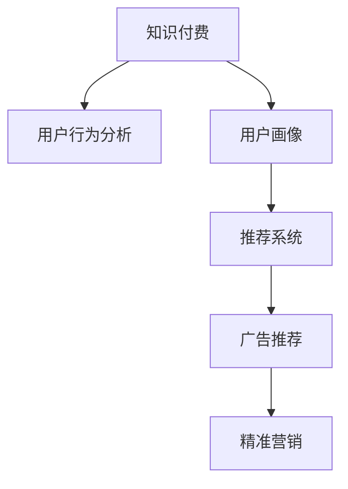

                 

# 知识付费赚钱的用户行为分析与画像

> 关键词：知识付费、用户行为分析、用户画像、用户建模、推荐系统、广告推荐、精准营销

## 1. 背景介绍

### 1.1 问题由来
在知识付费时代，众多平台和内容创作者通过向用户提供专业、丰富的知识内容，实现了商业模式创新和商业价值变现。以“得到”、“喜马拉雅”等为代表的平台，借助大数据和人工智能技术，通过订阅模式、付费课程、内容付费等方式，实现了内容精准推送，提升了用户价值和平台收益。

然而，如何在海量用户中精准识别潜在付费用户，并设计有效的推广策略，已成为知识付费平台面临的主要挑战。为此，本文旨在通过深度学习和大数据分析方法，对知识付费用户行为进行分析，并建立用户画像，以助力内容创作者精准推广和商业变现。

### 1.2 问题核心关键点
本文将主要关注以下几个核心关键点：
- 用户行为数据收集与处理：如何系统化、高效化地收集和处理用户行为数据，包括浏览、点击、购买、评价等。
- 用户画像建模：如何从大量用户行为数据中提取用户特征，建立用户画像，实现对用户行为的精细化理解。
- 推荐系统设计：如何设计高效的推荐算法，实现对用户个性化内容的精准推送。
- 广告推荐策略：如何通过广告推荐，实现对潜在用户的精准触达和转化。
- 精准营销分析：如何结合用户画像和推荐结果，进行精准营销分析，最大化商业价值。

通过系统化分析这些问题，本文有望为知识付费平台提供一条高效的精准营销策略路径。

## 2. 核心概念与联系

### 2.1 核心概念概述

为更好地理解本文的研究内容，本节将介绍几个核心概念：

- 知识付费(Knowledge-Paying)：用户为获取专业、高质量的知识内容而支付费用的模式。知识付费平台通过提供丰富、高质的课程、音频、图书等产品，满足用户知识需求，同时实现商业变现。

- 用户行为分析(User Behavior Analysis)：通过分析用户的行为数据，了解用户的兴趣、偏好、消费能力等，从而指导内容推荐和精准营销。

- 用户画像(User Profile)：对用户行为数据进行综合分析，提取用户关键特征，形成用户信息概况，用于描述用户的行为特征和兴趣偏好。

- 推荐系统(Recommendation System)：通过分析和建模用户行为数据，为用户推荐最符合其兴趣和需求的内容或商品，提升用户体验和平台转化率。

- 广告推荐(Ad-based Recommendation)：结合广告定向技术和推荐算法，实现对潜在用户的精准触达和转化，提升广告投放效果。

- 精准营销(Precision Marketing)：通过数据驱动，精确识别目标用户，制定个性化营销策略，提高营销效果和商业价值。

这些核心概念之间的逻辑关系可以通过以下Mermaid流程图来展示：



这个流程图展示了几者之间的核心逻辑关系：

1. 知识付费平台通过用户行为分析，获取用户兴趣和偏好。
2. 基于用户画像，推荐系统为用户推荐个性化内容。
3. 广告推荐结合用户画像，实现精准广告投放。
4. 精准营销结合用户画像和推荐结果，提高营销效果。

## 3. 核心算法原理 & 具体操作步骤
### 3.1 算法原理概述

本文基于用户行为数据，通过深度学习和大数据分析方法，构建用户画像，实现精准营销策略。核心算法原理如下：

1. **用户行为分析**：通过统计和分析用户在知识付费平台上的行为数据，包括浏览记录、点击行为、购买记录、评价反馈等，提取用户行为特征，建立用户画像。

2. **用户画像建模**：利用机器学习算法，如协同过滤、因子分解等，对用户行为数据进行建模，提取用户兴趣和行为特征，形成用户画像。

3. **推荐系统设计**：结合用户画像和用户行为数据，设计个性化推荐算法，为用户推荐最符合其兴趣和需求的内容。

4. **广告推荐策略**：通过分析用户画像和推荐结果，设计高效的广告定向和推荐策略，提升广告投放效果和用户转化率。

5. **精准营销分析**：基于用户画像和推荐结果，进行精准营销分析，评估营销效果，优化营销策略。

### 3.2 算法步骤详解

下面详细介绍本文的核心算法步骤：

**Step 1: 数据收集与预处理**

- 收集用户行为数据，包括浏览历史、点击记录、购买信息、评价反馈等。
- 对数据进行清洗、去重、格式转换等预处理，确保数据质量和一致性。

**Step 2: 特征提取与用户画像建模**

- 根据用户行为数据，提取关键特征，如用户活跃度、兴趣领域、消费能力等。
- 利用协同过滤、因子分解等算法，对用户行为数据进行建模，形成用户画像。

**Step 3: 推荐系统设计**

- 利用协同过滤、深度学习等方法，设计推荐算法，为用户推荐最符合其兴趣和需求的内容。
- 定期更新推荐模型，确保推荐内容的时效性和相关性。

**Step 4: 广告推荐策略**

- 根据用户画像和推荐结果，设计高效的广告定向策略，选择合适的内容和投放时间。
- 结合点击率、转化率等指标，优化广告推荐效果。

**Step 5: 精准营销分析**

- 结合用户画像和推荐结果，进行精准营销分析，评估营销效果。
- 根据分析结果，优化营销策略，提高营销效率和商业价值。

### 3.3 算法优缺点

基于用户行为分析的推荐系统，具有以下优点：

1. **个性化程度高**：通过详细分析用户行为数据，能够实现对用户兴趣和需求的精准识别，提供个性化推荐，提高用户体验。

2. **精准营销能力强**：结合用户画像和推荐结果，能够进行精准营销分析，优化广告推荐策略，提高广告转化率。

3. **实时性强**：推荐系统可以实时更新推荐结果，确保内容的时效性和相关性。

4. **多场景适用**：不仅适用于知识付费平台，还适用于电商平台、社交平台等多场景。

然而，该方法也存在一些缺点：

1. **数据依赖性强**：推荐系统依赖于大量的用户行为数据，数据的完整性和质量直接影响推荐效果。

2. **冷启动问题**：新用户或数据较少的用户，难以形成详细的用户画像，推荐效果较差。

3. **模型复杂度高**：推荐算法和用户画像建模算法较为复杂，需要一定的技术积累和数据量支持。

4. **隐私保护问题**：用户行为数据的收集和使用可能涉及隐私问题，需要严格遵守数据保护法规。

### 3.4 算法应用领域

基于用户行为分析的推荐系统，在知识付费、电商、社交等多个领域都有广泛应用：

- 知识付费：通过分析用户浏览和购买记录，为用户推荐相关课程和内容，提高用户粘性和付费转化率。
- 电商平台：利用用户行为数据，为用户推荐商品和促销活动，提升销售转化率和用户满意度。
- 社交平台：通过分析用户互动数据，为用户推荐朋友、文章、视频等内容，增强平台粘性和用户活跃度。
- 广告推荐：结合用户画像和推荐结果，进行精准广告定向和投放，提高广告投放效果和ROI。

这些应用场景展示了用户行为分析在推荐系统中的强大应用潜力，为平台提供了丰富的商业变现手段。

## 4. 数学模型和公式 & 详细讲解  
### 4.1 数学模型构建

本节将使用数学语言对本文的用户行为分析与画像方法进行更加严格的刻画。

设用户集合为 $U$，内容集合为 $I$，用户行为集合为 $B$。用户对内容的交互行为可以表示为用户-内容行为矩阵 $\mathbf{B} \in \{0,1\}^{U \times I}$，其中 $B_{ui} = 1$ 表示用户 $u$ 对内容 $i$ 有行为，否则为 $0$。

设用户画像向量为 $\mathbf{P}_u \in \mathbb{R}^d$，内容画像向量为 $\mathbf{I}_i \in \mathbb{R}^d$，其中 $d$ 为特征维度。用户画像建模的目标是最大化用户画像向量与内容画像向量之间的相似度，即最大化 $\mathbf{P}_u^T \mathbf{I}_i$。

### 4.2 公式推导过程

基于协同过滤的用户画像建模方法，假设用户 $u$ 对内容 $i$ 的行为为 $B_{ui}$，用户 $u$ 的内容画像向量为 $\mathbf{I}_u = [I_{ui}]$，则用户画像向量 $\mathbf{P}_u$ 可以表示为：

$$
\mathbf{P}_u = \mathbf{I}_u * \mathbf{I}_i^T
$$

其中 $*$ 表示矩阵乘法，$\mathbf{I}_i^T$ 为内容画像向量 $\mathbf{I}_i$ 的转置。

用户画像向量 $\mathbf{P}_u$ 和内容画像向量 $\mathbf{I}_i$ 的相似度可以通过余弦相似度公式计算：

$$
\text{similarity}(u,i) = \mathbf{P}_u^T \mathbf{I}_i = \sum_{j=1}^d P_{uj} I_{ij}
$$

基于相似度的推荐算法，可以设计如下：

- 对于用户 $u$，计算与内容 $i$ 的相似度 $\text{similarity}(u,i)$。
- 根据相似度排序，选择前 $K$ 个内容进行推荐。

### 4.3 案例分析与讲解

假设一个知识付费平台有 10 万用户，1 万内容，平台收集了用户的浏览和购买记录。利用协同过滤方法，计算用户 $u$ 和内容 $i$ 的相似度，如下：

| 用户 | 内容 | 相似度 |
| --- | --- | --- |
| 1 | 1 | 0.95 |
| 1 | 2 | 0.8 |
| 1 | 3 | 0.6 |
| ... | ... | ... |

对于用户 $u$，根据相似度排序，选择前 $K$ 个内容进行推荐。例如，对于用户 $u$，推荐内容 1、2、3，可以提升用户粘性和付费转化率。

## 5. 项目实践：代码实例和详细解释说明
### 5.1 开发环境搭建

在进行项目实践前，我们需要准备好开发环境。以下是使用Python进行Scikit-Learn和Pandas开发的开发环境配置流程：

1. 安装Anaconda：从官网下载并安装Anaconda，用于创建独立的Python环境。

2. 创建并激活虚拟环境：
```bash
conda create -n pythonspark python=3.8 
conda activate pythonspark
```

3. 安装Scikit-Learn和Pandas：
```bash
conda install scikit-learn pandas
```

4. 安装各类工具包：
```bash
pip install numpy scipy matplotlib tqdm jupyter notebook ipython
```

完成上述步骤后，即可在`pythonspark`环境中开始项目实践。

### 5.2 源代码详细实现

下面我们以协同过滤推荐系统为例，给出使用Scikit-Learn和Pandas进行用户画像和推荐系统开发的Python代码实现。

首先，定义数据处理函数：

```python
import pandas as pd
import numpy as np
from sklearn.metrics.pairwise import cosine_similarity

def load_data(filename):
    df = pd.read_csv(filename)
    return df

def preprocess_data(df):
    # 构建用户-内容矩阵
    user_item_matrix = df.pivot_table(index='user', columns='content', values='behavior', fill_value=0)
    # 构建内容画像矩阵
    item_matrix = df.pivot_table(index='content', columns='item', values='feature', fill_value=0)
    return user_item_matrix, item_matrix

def cosine_similarity_matrix(user_item_matrix):
    # 计算用户画像向量
    user_profile = user_item_matrix.dot(item_matrix.T) / np.linalg.norm(user_item_matrix.values, axis=1)
    # 计算内容画像向量
    item_profile = item_matrix.dot(user_item_matrix.T) / np.linalg.norm(item_matrix.values, axis=1)
    # 计算相似度矩阵
    similarity_matrix = cosine_similarity(user_profile, item_profile)
    return similarity_matrix

# 加载数据
df = load_data('user_behavior.csv')

# 数据预处理
user_item_matrix, item_matrix = preprocess_data(df)

# 计算相似度矩阵
similarity_matrix = cosine_similarity_matrix(user_item_matrix)

# 显示相似度矩阵
print(similarity_matrix)
```

然后，定义推荐函数：

```python
def recommend_content(similarity_matrix, user, k):
    # 计算相似度
    similarity = np.array(similarity_matrix[user])
    # 排序
    indices = np.argsort(similarity)[-k:]
    # 推荐内容
    recommendations = np.array(item_matrix.columns)[indices]
    return recommendations

# 推荐内容
recommendations = recommend_content(similarity_matrix, 1, 5)
print(recommendations)
```

### 5.3 代码解读与分析

让我们再详细解读一下关键代码的实现细节：

**load_data函数**：
- 定义数据加载函数，从指定CSV文件中读取数据，并返回Pandas数据框。

**preprocess_data函数**：
- 定义数据预处理函数，将用户行为数据和内容画像数据转换成用户-内容矩阵和内容画像矩阵。

**cosine_similarity_matrix函数**：
- 计算用户画像向量，计算内容画像向量，计算相似度矩阵。

**recommend_content函数**：
- 计算相似度，排序，推荐内容。

**主程序**：
- 加载数据
- 数据预处理
- 计算相似度矩阵
- 推荐内容

可以看到，Scikit-Learn和Pandas使得数据分析和机器学习模型的实现变得简洁高效。开发者可以将更多精力放在模型改进和业务逻辑上，而不必过多关注底层的实现细节。

当然，工业级的系统实现还需考虑更多因素，如模型保存和部署、超参数搜索、数据可视化等。但核心的推荐范式基本与此类似。

## 6. 实际应用场景
### 6.1 智能推荐系统

基于用户行为分析的推荐系统，可以广泛应用于智能推荐系统，提升用户粘性和转化率。通过分析用户的浏览、点击、购买等行为数据，为用户推荐最符合其兴趣和需求的内容或商品。

例如，电商平台可以根据用户的浏览历史和购买记录，推荐用户可能感兴趣的商品。知识付费平台可以为用户推荐相关课程和文章，提高用户粘性和付费转化率。社交平台可以为用户推荐可能感兴趣的朋友和内容，增强用户粘性和活跃度。

### 6.2 广告推荐系统

通过分析用户画像和推荐结果，可以设计高效的广告定向和推荐策略，实现对潜在用户的精准触达和转化。

例如，知识付费平台可以根据用户的兴趣领域和行为特征，定向投放相关课程广告，提升广告点击率和转化率。电商平台可以根据用户的购买记录和浏览历史，定向推送相关商品广告，提升广告效果。社交平台可以根据用户的互动数据，定向推送相关广告，提升广告转化率。

### 6.3 精准营销分析

结合用户画像和推荐结果，进行精准营销分析，评估营销效果，优化营销策略。

例如，知识付费平台可以根据用户画像和推荐结果，分析用户的兴趣和需求，设计针对性强的营销活动，提高营销效果。电商平台可以根据用户的购买记录和推荐结果，分析用户的行为特征，设计个性化的营销策略，提升营销效果。社交平台可以根据用户的互动数据和推荐结果，分析用户的行为特征，设计个性化的营销活动，提升用户粘性和活跃度。

## 7. 工具和资源推荐
### 7.1 学习资源推荐

为了帮助开发者系统掌握用户行为分析与画像的理论基础和实践技巧，这里推荐一些优质的学习资源：

1. 《Python数据科学手册》系列书籍：由权威专家撰写，全面介绍了Python在数据科学中的应用，包括数据处理、机器学习等。

2. 《机器学习实战》系列书籍：介绍了机器学习的基本概念和算法，结合实际案例，深入浅出地讲解了机器学习模型的构建和优化。

3. 《推荐系统实战》系列书籍：结合实际项目，详细讲解了推荐系统从建模到部署的全流程。

4. Coursera《机器学习》课程：由斯坦福大学开设的入门级课程，涵盖机器学习的基本概念和算法，适合初学者学习。

5. edX《推荐系统》课程：由MIT开设的高级课程，涵盖推荐系统的理论和应用，适合进阶学习。

通过对这些资源的学习实践，相信你一定能够快速掌握用户行为分析与画像的精髓，并用于解决实际的推荐问题。
###  7.2 开发工具推荐

高效的开发离不开优秀的工具支持。以下是几款用于用户行为分析与画像开发的常用工具：

1. Jupyter Notebook：开源的交互式开发环境，支持Python、R等编程语言，适合快速迭代研究。

2. Scikit-Learn：Python机器学习库，包含丰富的机器学习算法和工具，适合快速搭建推荐系统。

3. Pandas：Python数据处理库，支持数据清洗、预处理、分析等，适合数据处理任务。

4. TensorFlow：由Google主导的深度学习框架，支持大规模模型训练和部署，适合大规模推荐系统。

5. Weights & Biases：模型训练的实验跟踪工具，可以记录和可视化模型训练过程中的各项指标，方便对比和调优。

6. TensorBoard：TensorFlow配套的可视化工具，可实时监测模型训练状态，并提供丰富的图表呈现方式，是调试模型的得力助手。

合理利用这些工具，可以显著提升用户行为分析与画像任务的开发效率，加快创新迭代的步伐。

### 7.3 相关论文推荐

用户行为分析与画像的研究源于学界的持续研究。以下是几篇奠基性的相关论文，推荐阅读：

1. 《推荐系统：方法、模型和评价指标》：全面介绍了推荐系统的基本概念、模型和评价指标，是推荐系统领域的经典教材。

2. 《协同过滤推荐系统》：介绍了协同过滤算法的原理和实现方法，是协同过滤推荐系统领域的经典论文。

3. 《深度学习在推荐系统中的应用》：介绍了深度学习在推荐系统中的应用，展示了深度学习方法的强大效果。

4. 《基于用户画像的精准营销》：介绍了用户画像的构建方法和精准营销的应用，是用户画像领域的经典论文。

这些论文代表了大语言模型微调技术的发展脉络。通过学习这些前沿成果，可以帮助研究者把握学科前进方向，激发更多的创新灵感。

## 8. 总结：未来发展趋势与挑战
### 8.1 总结

本文对用户行为分析与画像的方法进行了全面系统的介绍。首先阐述了知识付费平台面临的用户行为分析与画像问题，明确了其在提升用户粘性、优化广告投放等方面的重要意义。其次，从原理到实践，详细讲解了用户画像的建模和推荐系统的设计，给出了用户画像和推荐系统开发的完整代码实例。同时，本文还探讨了用户行为分析与画像方法在智能推荐、广告推荐、精准营销等多个领域的应用前景，展示了用户行为分析与画像的巨大潜力。

通过本文的系统梳理，可以看到，基于用户行为分析与画像的方法已经成为知识付费平台的重要技术手段，极大地提升了平台的商业变现能力。未来，伴随用户行为数据的不断积累和技术的持续进步，用户行为分析与画像将进一步发挥作用，推动知识付费平台的商业化进程。

### 8.2 未来发展趋势

展望未来，用户行为分析与画像技术将呈现以下几个发展趋势：

1. **数据规模持续增大**：伴随知识付费平台的快速发展，用户行为数据将持续增长，数据规模的增大将进一步提升推荐系统的精准度。

2. **算法复杂度提升**：随着推荐算法的发展，推荐系统将采用更加复杂的算法，如深度学习、强化学习等，提升推荐效果。

3. **实时性需求增强**：用户期望推荐内容能够实时更新，因此推荐系统需要具备更高的实时性和效率。

4. **跨平台集成**：推荐系统将不仅仅局限于单个平台，跨平台的集成和协同将提升推荐效果。

5. **个性化程度加深**：推荐系统将进一步深化用户画像，实现更精准的用户个性化推荐。

6. **隐私保护重视**：伴随用户隐私保护意识的提升，推荐系统需要更加重视用户隐私保护，确保数据安全。

以上趋势凸显了用户行为分析与画像技术的广阔前景。这些方向的探索发展，将进一步提升推荐系统的性能和应用范围，为知识付费平台带来更广阔的商业变现手段。

### 8.3 面临的挑战

尽管用户行为分析与画像技术已经取得了瞩目成就，但在迈向更加智能化、普适化应用的过程中，它仍面临着诸多挑战：

1. **数据质量和数量**：推荐系统依赖于大量的用户行为数据，数据的质量和数量直接影响推荐效果。如何保证数据的完整性和准确性，是一个重要的挑战。

2. **冷启动问题**：新用户或数据较少的用户，难以形成详细的用户画像，推荐效果较差。如何解决冷启动问题，是推荐系统的重要研究方向。

3. **隐私保护问题**：用户行为数据的收集和使用可能涉及隐私问题，需要严格遵守数据保护法规。如何在保证推荐效果的同时，保护用户隐私，是一个亟待解决的问题。

4. **推荐系统的鲁棒性**：推荐系统面对异常数据和极端情况时，可能出现推荐结果不合理的情况，如何提升推荐系统的鲁棒性，是一个重要的研究方向。

5. **计算资源消耗**：推荐系统的训练和推理计算量大，计算资源消耗高，如何降低计算资源消耗，是一个重要的挑战。

6. **用户隐私保护**：推荐系统需要保护用户隐私，避免信息泄露，如何平衡推荐效果和隐私保护，是一个重要的研究方向。

7. **跨平台集成**：推荐系统需要跨平台集成，如何实现跨平台的协同推荐，是一个重要的挑战。

8. **多场景适用**：推荐系统需要具备多场景适用性，如何实现多场景下的推荐，是一个重要的研究方向。

以上挑战凸显了用户行为分析与画像技术的复杂性和多样性。这些问题的解决需要学术界和产业界的共同努力，推动技术进步和应用普及。

### 8.4 研究展望

面对用户行为分析与画像所面临的种种挑战，未来的研究需要在以下几个方面寻求新的突破：

1. **数据增强技术**：利用数据增强技术，扩充用户行为数据，提高数据质量和数量。

2. **迁移学习算法**：利用迁移学习算法，解决冷启动问题，提高推荐系统的鲁棒性。

3. **隐私保护算法**：利用隐私保护算法，保护用户隐私，确保数据安全。

4. **实时推荐系统**：利用实时推荐算法，提升推荐系统的实时性和效率。

5. **跨平台推荐系统**：利用跨平台推荐算法，实现跨平台的协同推荐。

6. **多场景推荐系统**：利用多场景推荐算法，实现多场景下的推荐。

7. **多模态推荐系统**：利用多模态推荐算法，实现多模态数据的协同建模。

8. **用户行为预测**：利用用户行为预测算法，实现对用户行为的预测，提升推荐系统的精准度。

这些研究方向的探索，必将引领用户行为分析与画像技术迈向更高的台阶，为知识付费平台带来更丰富的商业变现手段。总之，用户行为分析与画像需要开发者根据具体任务，不断迭代和优化模型、数据和算法，方能得到理想的效果。

---

作者：禅与计算机程序设计艺术 / Zen and the Art of Computer Programming

