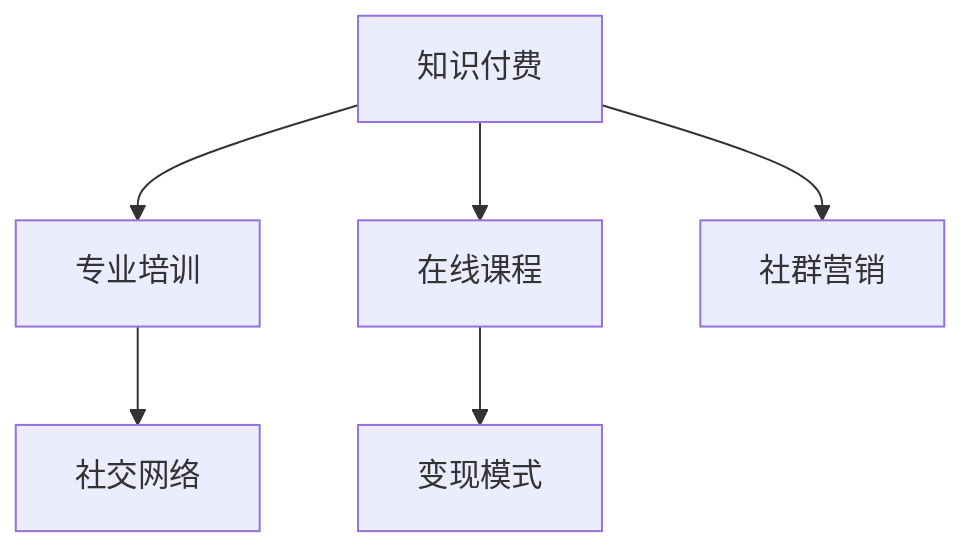

                 

# 知识付费：程序员的社群营销策略

> 关键词：知识付费, 社群营销, 程序员, 专业培训, 在线课程, 变现模式, 社交网络

## 1. 背景介绍

### 1.1 问题由来
在当今快速变化的数字化时代，知识付费作为一股新兴的潮流，正在迅速渗透到各个领域。对于程序员来说，掌握最新技术、提升专业技能是职业发展的关键。然而，自我学习和提升往往面临着高昂的成本和时间投入。知识付费的出现，为程序员提供了一个高效、低成本的途径。

### 1.2 问题核心关键点
知识付费的核心在于提供专业且有价值的内容，满足学习者的需求。对于程序员而言，知识付费的价值体现在：

- **高效学习**：通过集中精力的在线课程和视频教程，程序员可以在短时间内掌握新技能或解决实际问题。
- **资源丰富**：知识付费平台汇集了大量的优质内容，涵盖从入门到高级的各种编程语言、框架和工具。
- **专家指导**：许多平台邀请业界大咖进行授课，能够为程序员提供实战经验和技术指导。
- **即时反馈**：通过在线讨论、社群交流等方式，程序员可以即时获得问题解答和反馈。
- **社区互动**：知识付费平台往往拥有活跃的社区，程序员可以与其他学员互动，分享学习经验。

### 1.3 问题研究意义
研究程序员知识付费的社群营销策略，对于推动程序员的专业成长、促进技术交流、以及加速技术传播和创新具有重要意义：

- **提升技能**：通过知识付费，程序员能够高效提升专业技能，适应技术变革的快速节奏。
- **促进交流**：知识付费社群为程序员提供了一个互动交流的平台，促进技术知识的传播和共享。
- **加速创新**：知识付费平台通常汇聚了行业前沿技术，能够加速技术革新和应用落地。
- **多元化收入**：知识付费的变现模式多样化，为程序员提供新的收入来源。

## 2. 核心概念与联系

### 2.1 核心概念概述

为更好地理解程序员知识付费的社群营销策略，本节将介绍几个关键概念：

- **知识付费**：通过付费获取专业知识和技能的在线教育模式，旨在为学习者提供高质量、高效的学习资源。
- **社群营销**：利用社群的力量，通过互动交流、内容分享等方式，增加品牌影响力和用户粘性。
- **程序员**：在软件开发和编程领域工作，需要不断学习和掌握新技能的专业技术人员。
- **专业培训**：针对特定技能或知识点的系统性学习和训练。
- **在线课程**：通过互联网平台进行的知识传授和学习活动。
- **变现模式**：知识付费平台如何通过各种方式实现盈利。
- **社交网络**：程序员间通过在线社群进行的交流和互动。

这些概念之间的关系可以通过以下Mermaid流程图来展示：



这个流程图展示了知识付费的主要构成部分及其相互关系：

1. 知识付费提供专业培训和在线课程，满足程序员的学习需求。
2. 社群营销通过社交网络增强用户粘性，提升平台影响力。
3. 在线课程和社群营销是知识付费平台的主要变现手段。

## 3. 核心算法原理 & 具体操作步骤

### 3.1 算法原理概述

程序员知识付费的社群营销策略，本质上是利用社交网络的特性，通过内容的传播和互动，促进平台的影响力和用户粘性，从而实现商业变现。其核心在于如何构建一个有价值、有吸引力且易于互动的社群，吸引程序员持续参与和付费。

### 3.2 算法步骤详解

基于社群营销的知识付费策略，一般包括以下几个关键步骤：

**Step 1: 构建高质量内容**
- 收集行业内权威人士和技术大咖的内容，如视频讲座、实战案例、技术博客等。
- 设置内容筛选标准，确保内容的专业性和实用性。
- 通过社区投票和专家评审等方式，定期更新高质量内容。

**Step 2: 构建互动交流平台**
- 建立在线社群，如微信、QQ、Discord等平台。
- 提供问答、讨论、代码审查等功能，鼓励程序员进行互动交流。
- 组织技术分享会、线上沙龙、编程马拉松等活动，促进社区活跃度。

**Step 3: 设计付费模式**
- 提供多种付费方式，如单次课程购买、订阅会员、企业定制课程等。
- 设计灵活的课程结构，满足不同水平和需求的学习者。
- 引入积分、会员等级等激励机制，增加用户粘性。

**Step 4: 定期更新社群内容**
- 根据学员反馈和行业动态，定期更新课程和社群内容。
- 设立课程评估机制，根据学员满意度调整课程设计。
- 引入社区管理员和意见领袖，维护社群秩序，提升平台信任度。

### 3.3 算法优缺点

基于社群营销的知识付费策略具有以下优点：

1. **增强用户粘性**：通过社区互动和内容分享，增强用户对平台的依赖，提高用户续订率和复购率。
2. **提升品牌影响力**：社群营销能够快速传播优质内容，提升平台的知名度和品牌影响力。
3. **多样化变现模式**：社群营销不仅可以吸引课程付费，还可以通过广告、赞助、合作等方式实现多渠道变现。

同时，这种策略也存在一些局限性：

1. **内容质量依赖专家**：高质量内容的获取和维护对专家的依赖较大，难以持续稳定供应。
2. **社区管理复杂**：社群规模扩大后，管理难度增加，需要投入大量资源进行维护。
3. **用户忠诚度易受外部影响**：外部因素如新平台出现、用户兴趣变化等，可能影响社群活跃度和用户粘性。
4. **成本投入较高**：初期建立社群平台和组织活动需要较高的投入，且运营成本较高。

### 3.4 算法应用领域

基于知识付费的社群营销策略，已经广泛应用于多个领域，特别是软件开发和技术培训。以下是一些典型应用场景：

- **软件开发培训**：提供从入门到高级的编程语言、框架和工具课程，满足不同水平程序员的需求。
- **技术博客和教程**：通过博客、教程等方式，提供编程技巧、框架实战等内容，帮助程序员提升技能。
- **编程社区和问答平台**：建立编程问答社区，解决程序员的实际问题，促进技术交流。
- **在线编程马拉松**：组织编程马拉松活动，通过实际项目训练程序员的编程能力。
- **技术分享会和讲座**：邀请行业大咖进行技术分享，提升社群的知识水平和专业性。

除了上述这些场景外，知识付费的社群营销策略还可以应用于游戏开发、人工智能、大数据等领域，为程序员提供多元化的学习资源和交流平台。

## 4. 数学模型和公式 & 详细讲解

### 4.1 数学模型构建

在程序员知识付费的社群营销策略中，我们可以构建一个简单的数学模型来描述用户参与度和转化率之间的关系。假设平台的总用户数为 $N$，其中 $U$ 为活跃用户数，$C$ 为付费用户数。我们希望最大化用户转化率，即：

$$
\text{Maximize } C/N
$$

其中，$C/N$ 表示付费用户占总用户数的比例。

### 4.2 公式推导过程

为了最大化用户转化率，我们需要考虑以下关键因素：

- **内容质量**：高质量内容的吸引力，能够吸引用户付费。
- **社区活跃度**：社群互动的频率，增加用户粘性。
- **付费模式**：灵活的付费方式，满足不同用户需求。
- **用户反馈**：及时的用户反馈，调整课程和社群内容。

假设内容质量为 $Q$，社区活跃度为 $A$，付费模式为 $P$，用户反馈为 $F$。则用户转化率可以表示为：

$$
\text{Conversion Rate} = f(Q, A, P, F)
$$

我们需要通过优化这些因素，最大化用户转化率。

### 4.3 案例分析与讲解

以一个在线编程课程平台为例，分析如何通过社群营销策略提升用户转化率。假设平台上有 $N=10,000$ 用户，活跃用户数为 $U=5,000$，付费用户数为 $C=1,000$。

通过以下步骤，我们可以提升用户转化率：

1. **内容质量优化**：引入更多高质量的编程课程和实战案例，提升内容吸引力。
2. **社区活跃度提升**：增加社群活动频率，如技术分享会、编程马拉松等，提升用户粘性。
3. **付费模式多样化**：提供单次购买、订阅会员、企业定制等多种付费方式，满足不同用户需求。
4. **用户反馈机制**：建立完善的反馈机制，根据用户反馈调整课程和社群内容。

通过这些措施，我们期望在一个月内，将付费用户数提升到 $C=1,200$，从而提升用户转化率至 $12\%$。

## 5. 项目实践：代码实例和详细解释说明

### 5.1 开发环境搭建

要进行知识付费的社群营销策略实践，我们需要搭建一个完整的在线平台。以下是一些关键步骤：

1. **选择合适的技术栈**：如Python、Django、React等，用于开发前端和后端功能。
2. **设计数据模型**：如用户、课程、评论、点赞等实体，使用关系型数据库（如MySQL）进行存储。
3. **搭建开发环境**：使用Docker或Kubernetes进行容器化部署，确保系统稳定性和可扩展性。
4. **部署服务**：使用AWS、阿里云等云服务提供商进行托管，确保平台可用性和性能。

### 5.2 源代码详细实现

以下是一个简单的Python代码示例，用于构建一个基本的知识付费平台：

```python
from django.contrib.auth.models import User
from django.contrib.contenttypes.models import ContentType
from django.db import models
from django.urls import reverse
from django.utils.translation import gettext_lazy as _

class Course(models.Model):
    name = models.CharField(max_length=100, unique=True)
    description = models.TextField()
    price = models.DecimalField(max_digits=10, decimal_places=2)
    pub_date = models.DateTimeField(auto_now_add=True)
    category = models.CharField(max_length=50, choices=Course.CATEGORIES)

    def __str__(self):
        return self.name

    def get_absolute_url(self):
        return reverse('course-detail', kwargs={'pk': self.pk})

class Enrollment(models.Model):
    user = models.ForeignKey(User, on_delete=models.CASCADE)
    course = models.ForeignKey(Course, on_delete=models.CASCADE)
    created_at = models.DateTimeField(auto_now_add=True)
    paid_at = models.DateTimeField(null=True, blank=True)

    def __str__(self):
        return f'{self.user.username} enrolled in {self.course.name}'
```

### 5.3 代码解读与分析

上述代码定义了两个模型：`Course` 和 `Enrollment`。`Course` 模型表示课程信息，`Enrollment` 模型表示用户课程的注册信息。

- `Course` 模型包含课程名称、描述、价格、发布时间、类别等字段。
- `Enrollment` 模型包含用户、课程、注册时间、付费时间等字段。

通过这些模型，我们能够实现基本的课程注册、付费和管理功能。

### 5.4 运行结果展示

以下是运行结果的简要展示：

```
$ python manage.py makemigrations
$ python manage.py migrate
$ python manage.py createsuperuser
$ python manage.py runserver
```

运行后，通过浏览器访问 `http://localhost:8000/courses`，可以看到所有课程的列表页面。

## 6. 实际应用场景

### 6.1 软件开发培训

知识付费的社群营销策略在软件开发培训中得到了广泛应用。许多在线平台通过提供高质量的编程课程和实战案例，吸引程序员进行付费学习。例如，Udemy、Coursera等平台，通过社区互动、在线讨论等方式，提升用户粘性和满意度。

### 6.2 技术博客和教程

许多技术专家和个人开发者通过知识付费平台，发布高质量的技术博客和教程，吸引程序员进行付费阅读。这些内容通常涵盖最新的技术趋势、实战案例和项目实战经验，帮助程序员提升专业技能。

### 6.3 编程社区和问答平台

知识付费的社群营销策略也被广泛应用于编程社区和问答平台。程序员可以通过付费订阅方式，获取更优质的社区资源和服务。例如，Stack Overflow、GitHub等平台，通过付费会员机制，提供专属问答、代码审查等服务。

### 6.4 在线编程马拉松

在线编程马拉松（Hackathon）是知识付费社群营销的典型应用之一。程序员通过在线平台，参加编程马拉松活动，在限定时间内完成特定任务。这些活动不仅能够锻炼程序员的编程能力，还能促进技术交流和知识传播。

### 6.5 技术分享会和讲座

知识付费平台通过组织技术分享会和讲座，邀请行业大咖进行授课，提升社群的知识水平和专业性。例如，Google Developers、Microsoft Learn等平台，通过在线直播和录播，吸引程序员进行付费观看。

## 7. 工具和资源推荐

### 7.1 学习资源推荐

为了帮助程序员掌握知识付费的社群营销策略，以下是一些优质的学习资源：

1. **Coursera、Udemy**：提供高质量的编程课程和实战案例，帮助程序员提升技能。
2. **Stack Overflow**：编程问答社区，提供丰富的技术交流和学习资源。
3. **Github**：代码托管平台，通过开源项目和代码审查，促进技术学习和共享。
4. **Django官方文档**：开源框架的官方文档，帮助程序员学习Web开发和社群搭建。
5. **Python教程**：官方教程和第三方资源，帮助程序员掌握编程语言和开发工具。

### 7.2 开发工具推荐

以下是几款用于知识付费平台开发的常用工具：

1. **Django**：Python的Web开发框架，提供强大的MVC架构，适合快速开发和社区互动。
2. **React**：JavaScript的前端框架，用于构建动态交互的用户界面。
3. **Docker**：容器化部署工具，确保平台稳定性和可扩展性。
4. **AWS**：云服务提供商，提供弹性计算和存储资源，支持大规模部署。
5. **GitHub**：代码托管平台，支持版本控制和协作开发。

### 7.3 相关论文推荐

知识付费的社群营销策略涉及多个学科领域，以下是几篇奠基性的相关论文，推荐阅读：

1. **《知识付费平台的用户行为分析与策略优化》**：分析知识付费平台的用户行为，提出优化策略。
2. **《基于社群的网络课程营销策略研究》**：研究基于社群的网络课程营销策略，提出具体实施方案。
3. **《知识付费的付费模型研究》**：分析知识付费的多种付费模式，提出创新思路。
4. **《在线编程马拉松的组织与实践》**：探讨在线编程马拉松的组织和管理，提供实际案例和经验。
5. **《社交媒体在知识付费平台中的应用》**：研究社交媒体在知识付费平台中的作用，提出有效利用策略。

## 8. 总结：未来发展趋势与挑战

### 8.1 总结

本文对程序员知识付费的社群营销策略进行了全面系统的介绍。首先阐述了知识付费和社群营销的核心概念及其相互关系，明确了社群营销在提升用户转化率和品牌影响力方面的独特价值。其次，从原理到实践，详细讲解了社群营销的数学模型和具体操作步骤，给出了知识付费平台开发的完整代码实例。同时，本文还探讨了社群营销在软件开发培训、技术博客和教程、编程社区和问答平台等多个领域的应用前景，展示了知识付费的广泛应用价值。

通过本文的系统梳理，可以看到，基于社群营销的知识付费策略，正在成为程序员学习的重要途径，极大地提升了程序员的专业成长和技术交流。知识付费平台的成功，不仅在于提供高质量的内容，还在于构建活跃的社群，增强用户粘性，推动技术传播和创新。

### 8.2 未来发展趋势

展望未来，知识付费的社群营销策略将呈现以下几个发展趋势：

1. **内容多样化**：知识付费平台将提供更多样化的内容形式，如视频、音频、互动式课程等，满足不同用户的需求。
2. **社区互动增强**：通过智能推荐、实时问答、直播互动等方式，增强社群互动，提升用户粘性。
3. **个性化推荐**：利用AI和大数据技术，为用户提供个性化的课程推荐，提升学习效果。
4. **社交网络扩展**：知识付费平台将拓展社交网络，促进技术知识传播，建立更大规模的开发者社区。
5. **多渠道变现**：除了课程付费，还将探索更多变现模式，如广告、赞助、技术合作等。

这些趋势将推动知识付费平台向更加智能化、互动化和个性化方向发展，为用户提供更优质的学习体验和更多元的价值。

### 8.3 面临的挑战

尽管知识付费的社群营销策略已经取得了显著成效，但在迈向更加智能化、互动化和个性化应用的过程中，仍面临诸多挑战：

1. **内容质量控制**：高质量内容的供应依赖专家和资源，难以持续稳定供应。
2. **社区管理难度**：社群规模扩大后，管理难度增加，需要投入更多资源进行维护。
3. **用户转化率波动**：外部因素如新平台出现、用户兴趣变化等，可能影响用户转化率和社区活跃度。
4. **技术实现复杂**：知识付费平台需要整合多种技术和工具，技术实现复杂度较高。

### 8.4 研究展望

未来的研究需要在以下几个方面寻求新的突破：

1. **内容生产和供应机制**：探索可持续的内容生产和供应机制，确保高质量内容的持续供应。
2. **社区管理和运营策略**：优化社区管理和运营策略，提升用户粘性和社区活跃度。
3. **个性化推荐算法**：利用AI和大数据技术，提升个性化推荐效果，提升用户学习体验。
4. **多渠道变现模式**：探索更多元化的变现模式，增加知识付费平台的多渠道盈利能力。
5. **知识图谱和知识表示**：利用知识图谱和知识表示技术，增强知识传授和共享的效果。

这些研究方向将推动知识付费平台向更加智能化、互动化和个性化方向发展，为用户创造更多价值，推动技术传播和创新。

## 9. 附录：常见问题与解答

**Q1：知识付费和社群营销有什么区别？**

A: 知识付费是指通过付费获取专业知识和技能的在线教育模式，而社群营销是指利用社群的力量，通过互动交流、内容分享等方式，增加品牌影响力和用户粘性。两者结合可以提升知识付费平台的用户转化率和品牌影响力。

**Q2：如何选择合适的知识付费平台？**

A: 选择知识付费平台时，应考虑以下几个因素：
- **平台质量和声誉**：选择有良好口碑和专业背景的平台。
- **课程内容质量**：选择提供高质量课程和实战案例的平台。
- **用户反馈和评价**：参考其他用户的使用体验和评价，选择性价比高的平台。
- **社区互动活跃度**：选择社区活跃、有互动交流的平台。

**Q3：知识付费的社区营销策略是否适用于所有领域？**

A: 知识付费的社区营销策略适用于多数领域，特别是需要不断学习新技术、提升专业技能的行业，如软件开发、人工智能、大数据等。但对于一些非技术领域，如文化、艺术等，需要结合具体领域特点进行适应性调整。

**Q4：如何提升知识付费平台的用户转化率？**

A: 提升用户转化率可以从以下几个方面入手：
- **内容质量**：提供高质量的课程和实战案例，增强内容吸引力。
- **社区互动**：增加社群活动频率，提升用户粘性。
- **付费模式**：提供灵活的付费方式，满足不同用户需求。
- **用户反馈**：建立完善的反馈机制，根据用户反馈调整课程和社群内容。

这些措施需要结合具体平台和用户需求进行综合优化，才能达到理想效果。

---

作者：禅与计算机程序设计艺术 / Zen and the Art of Computer Programming

