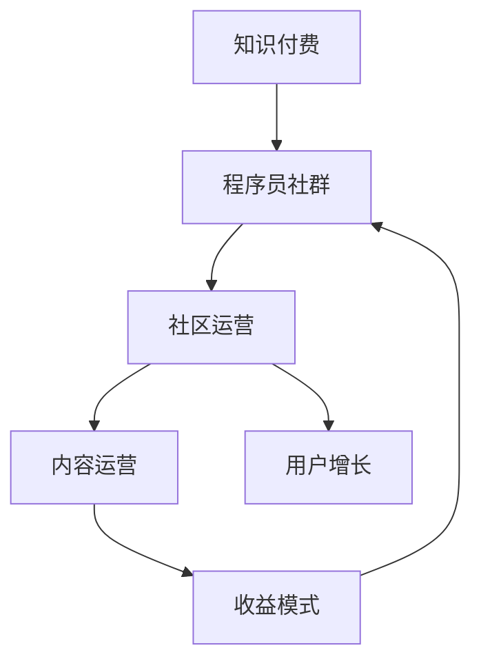

                 

# 知识付费：程序员的社群运营思维

> 关键词：知识付费、程序员社群、运营思维、社区管理、增长策略

## 1. 背景介绍

随着互联网的迅猛发展，知识付费已经成为了一个热门话题。特别是在技术领域，大量的优质内容和专业人士不断涌现，程序员社区的兴起也带起了知识付费的浪潮。在这种背景下，如何有效地运营程序员社群，进行知识付费业务，成为业内关注的重点。

### 1.1 问题由来
在互联网技术高速发展的今天，越来越多的技术社区涌现，如Stack Overflow、GitHub、CSDN、知乎等，其中不少平台通过知识付费的模式实现了商业化。同时，大量优秀的技术爱好者也创建了自己的社区，进行知识分享和付费项目，例如GitHub上的开源项目及问题解答、知乎上的技术问答等。然而，如何通过知识付费模式实现社区的可持续运营，并获取稳定的收入，是社区管理者和技术爱好者需要解决的问题。

### 1.2 问题核心关键点
知识付费的本质是通过高质量的输出内容吸引用户付费，提升社区的活跃度和稳定性。对于程序员社群来说，其核心关键点主要包括以下几个方面：

1. 内容质量：社区必须提供有价值、有深度的技术内容，如高质量的文章、视频、课程等。
2. 社区氛围：创建积极、开放、友好的社区文化，增强用户粘性。
3. 用户增长：如何吸引和留住新用户，扩大社区规模。
4. 收益模式：通过订阅、打赏、广告等多样化的收益模式，实现社区的盈利。

## 2. 核心概念与联系

### 2.1 核心概念概述

为更好地理解程序员社群的知识付费运营方法，本节将介绍几个密切相关的核心概念：

- 知识付费：指通过知识产品或服务的使用，实现用户对知识和技术的付费行为。
- 程序员社群：由技术爱好者和专业人士组成的线上线下交流平台，通过分享和讨论技术问题，进行知识交流和技能提升。
- 社区运营：指对社群进行日常管理和维护，提升用户参与度和社区活跃度的过程。
- 内容运营：以高质量的技术内容为核心，吸引和留住用户的过程。
- 用户增长：通过多种手段吸引新用户，实现社区规模的扩大。
- 收益模式：基于不同业务模型，实现社区盈利的途径。

这些核心概念之间的逻辑关系可以通过以下Mermaid流程图来展示：



这个流程图展示了的核心概念及其之间的关系：

1. 知识付费是程序员社群的核心动力，通过高质量的内容吸引用户付费。
2. 社区运营和内容运营共同构成社群的生命力，维持用户的活跃和参与。
3. 用户增长为社群带来更多的用户和流量，为社区运营提供支持。
4. 收益模式则是社区能够可持续运营的保障，通过商业化实现盈利。

## 3. 核心算法原理 & 具体操作步骤

### 3.1 算法原理概述

知识付费的核心在于优质内容的供给。程序员社群的知识付费运营，实质上是一个内容供给和需求匹配的过程。其主要算法原理包括以下几个步骤：

1. **内容收集与筛选**：收集社区内技术专家、知名博主等提供的优质内容，进行筛选和整理，形成规范化、高质量的知识库。
2. **个性化推荐**：利用推荐算法，对用户进行精准的内容推荐，提升用户满意度和粘性。
3. **用户画像构建**：通过对用户行为和偏好的分析，建立用户画像，实现内容的个性化推荐和定制化服务。
4. **动态定价**：根据内容的受欢迎程度和市场反馈，动态调整内容价格，实现收益最大化。

### 3.2 算法步骤详解

针对程序员社群的知识付费运营，我们将其主要分为以下四个步骤：

**Step 1: 内容收集与筛选**

- 建立内容采集机制，从各类技术博客、论坛、社交媒体等渠道收集优质内容，如技术文章、视频教程、在线课程等。
- 对收集的内容进行初步筛选，剔除低质量、过时的内容，确保内容的专业性和实用性。
- 将筛选好的内容整理成标准化的格式，如Markdown、HTML等，便于发布和管理。

**Step 2: 个性化推荐**

- 利用协同过滤、内容推荐算法等技术，对用户进行个性化内容推荐，增加用户粘性。
- 引入深度学习等先进技术，实现用户行为和偏好的动态分析和预测，提升推荐精度。
- 建立反馈机制，根据用户反馈不断优化推荐算法，提升用户体验。

**Step 3: 用户画像构建**

- 收集用户行为数据，如浏览历史、点赞数、评论内容等，构建用户画像。
- 利用机器学习算法，对用户画像进行分析，识别出用户的兴趣和需求。
- 根据用户画像，推送符合用户兴趣的内容，实现内容的精准匹配。

**Step 4: 动态定价**

- 根据内容的受欢迎程度和市场反馈，调整内容的定价策略。
- 引入动态定价算法，如竞价拍卖、用户定价等，实现价格的灵活调整。
- 建立价格监控机制，防止价格过高或过低，保持合理的盈利水平。

### 3.3 算法优缺点

知识付费的算法具有以下优点：

1. **提高用户满意度**：通过个性化推荐，提供高质量的内容，提升用户满意度和粘性。
2. **增加用户留存**：动态定价和用户画像分析，使得用户更愿意长期留在社区内。
3. **优化收益**：个性化推荐和动态定价策略，使得内容收益最大化。

同时，该算法也存在一定的局限性：

1. **技术门槛高**：个性化推荐和动态定价需要高级算法和数据处理能力，对技术团队的要求较高。
2. **内容质量依赖**：个性化推荐的精度高度依赖于内容的丰富性和质量，低质量内容会影响用户体验。
3. **数据隐私问题**：用户画像和行为数据的收集和分析，可能涉及用户隐私，需要严格的数据保护措施。
4. **价格敏感性**：用户对价格的敏感度较高，定价策略需要不断调整，以适应市场变化。

尽管存在这些局限性，但知识付费算法在大规模的程序员社群运营中已经得到了广泛的应用，成为提升社区价值和用户粘性的重要手段。

### 3.4 算法应用领域

知识付费算法不仅应用于程序员社群，还广泛地应用于各类知识型平台，如在线教育、技术博客、论坛社区等。以下是一些典型的应用场景：

- **在线教育平台**：通过个性化推荐和动态定价，实现高质量课程的精准推送，提升用户满意度和留存率。
- **技术博客和论坛**：通过内容筛选和个性化推荐，吸引更多用户阅读、评论、分享，提升社区活跃度。
- **社交媒体**：通过内容推荐和用户画像分析，增加用户粘性，提高平台影响力。

## 4. 数学模型和公式 & 详细讲解

### 4.1 数学模型构建

在知识付费算法中，我们主要使用了协同过滤、深度学习等算法模型。以下是其中的核心模型构建：

- **协同过滤模型**：基于用户-物品评分矩阵，推荐相似用户喜欢的物品。模型形式如下：

$$
R_{ui} = \sum_{v \in \mathcal{V}} p_{uv} p_{vi}
$$

其中 $R_{ui}$ 为用户 $u$ 对物品 $i$ 的评分，$p_{uv}$ 和 $p_{vi}$ 分别为用户 $u$ 和物品 $i$ 的向量表示。

- **深度学习推荐模型**：利用神经网络对用户行为进行建模，预测用户对物品的评分。模型形式如下：

$$
\hat{y} = W^1 [z_1; z_2; \cdots; z_n] \sigma(W^2 \hat{x} + b^2)
$$

其中 $W^1$ 和 $W^2$ 为网络参数，$z_i$ 为网络中间层节点输出，$x$ 为输入，$\hat{x}$ 为网络输入经过线性变换后的向量，$b^2$ 为偏置项，$\sigma$ 为激活函数。

### 4.2 公式推导过程

下面我们以协同过滤模型为例，推导其基本的评分预测公式：

设用户集合为 $U=\{u_1, u_2, \cdots, u_m\}$，物品集合为 $V=\{v_1, v_2, \cdots, v_n\}$，用户 $u_i$ 对物品 $v_j$ 的评分 $R_{ij}$ 构成用户-物品评分矩阵 $R$。协同过滤算法通过计算物品 $v_j$ 的向量表示 $p_{v_j}$，并使用向量相似度来预测用户 $u_i$ 对物品 $v_j$ 的评分，公式如下：

$$
\hat{R}_{ui} = \sum_{v \in \mathcal{V}} p_{uv} p_{vi}
$$

其中 $p_{uv}$ 为物品 $v$ 的向量表示，$p_{vi}$ 为用户 $u$ 对物品 $v$ 的评分。

在实际应用中，为了提升推荐精度，可以引入用户特征 $z_i$，通过用户特征向量 $p_u$ 来进一步优化评分预测：

$$
\hat{R}_{ui} = \sum_{v \in \mathcal{V}} p_{uv} p_{vi} + \alpha z_i^T p_u
$$

其中 $\alpha$ 为调节系数，用于控制特征对评分的贡献。

### 4.3 案例分析与讲解

以下以一个简单的协同过滤推荐系统为例，进行案例分析：

**场景：** 某程序员社群平台，用户甲希望寻找高质量的编程书籍。

**数据准备：** 平台收集了100位程序员的阅读记录，每本书籍的评分数据如下：

| 用户 | 书籍 | 评分 |
| --- | --- | --- |
| 甲 | 《Java核心技术》 | 4.5 |
| 甲 | 《Python编程：从入门到实践》 | 4.0 |
| 乙 | 《C++ Primer》 | 4.2 |
| 乙 | 《算法导论》 | 3.8 |
| 丙 | 《数据结构与算法》 | 3.5 |

**用户-物品评分矩阵：**

$$
R = \begin{bmatrix}
4.5 & 4.0 & 0 & 0 \\
0 & 0 & 4.2 & 3.8 \\
0 & 0 & 0 & 0
\end{bmatrix}
$$

**物品向量表示：**

$$
p_{Java核心技术} = [0.6, 0.4] \\
p_{Python编程：从实践到入门} = [0.7, 0.3] \\
p_{C++ Primer} = [0.5, 0.5] \\
p_{算法导论} = [0.3, 0.7]
$$

**用户向量表示：**

$$
p_{甲} = [0.8, 0.2] \\
p_{乙} = [0.2, 0.8] \\
p_{丙} = [0.5, 0.5]
$$

**评分预测：** 利用协同过滤算法，对用户甲推荐书籍。

首先，计算物品向量之间的相似度：

$$
sim(p_{Java核心技术}, p_{Python编程：从实践到入门}) = 0.8 \\
sim(p_{Java核心技术}, p_{C++ Primer}) = 0.6 \\
sim(p_{Java核心技术}, p_{算法导论}) = 0.5 \\
sim(p_{Python编程：从实践到入门}, p_{C++ Primer}) = 0.4 \\
sim(p_{Python编程：从实践到入门}, p_{算法导论}) = 0.4 \\
sim(p_{C++ Primer}, p_{算法导论}) = 0.6
$$

然后，根据相似度计算用户甲对物品 $v_j$ 的评分预测：

$$
\hat{R}_{甲Java核心技术} = 0.8 \times 4.5 + 0.4 \times 4.0 = 5.4 \\
\hat{R}_{甲Python编程：从实践到入门} = 0.8 \times 4.0 + 0.2 \times 4.2 = 4.12 \\
\hat{R}_{甲C++ Primer} = 0.8 \times 4.2 + 0.2 \times 3.8 = 4.24 \\
\hat{R}_{甲算法导论} = 0.8 \times 3.8 + 0.2 \times 3.5 = 3.76
$$

最后，根据评分预测结果，向用户甲推荐评分较高的书籍：

$$
推荐书籍：《Java核心技术》(评分预测5.4) > 《Python编程：从实践到入门》(评分预测4.12) > 《C++ Primer》(评分预测4.24) > 《算法导论》(评分预测3.76)
$$

以上案例展示了协同过滤算法的基本原理和计算过程，以及如何根据用户行为和物品特征进行个性化推荐。

## 5. 项目实践：代码实例和详细解释说明

### 5.1 开发环境搭建

在进行知识付费项目开发前，我们需要准备好开发环境。以下是使用Python进行PyTorch开发的环境配置流程：

1. 安装Anaconda：从官网下载并安装Anaconda，用于创建独立的Python环境。

2. 创建并激活虚拟环境：
```bash
conda create -n pytorch-env python=3.8 
conda activate pytorch-env
```

3. 安装PyTorch：根据CUDA版本，从官网获取对应的安装命令。例如：
```bash
conda install pytorch torchvision torchaudio cudatoolkit=11.1 -c pytorch -c conda-forge
```

4. 安装各类工具包：
```bash
pip install numpy pandas scikit-learn matplotlib tqdm jupyter notebook ipython
```

完成上述步骤后，即可在`pytorch-env`环境中开始项目实践。

### 5.2 源代码详细实现

这里我们以协同过滤推荐系统为例，给出使用PyTorch实现的代码：

```python
import numpy as np
from sklearn.metrics.pairwise import cosine_similarity

# 构建用户-物品评分矩阵
R = np.array([
    [4.5, 4.0, 0, 0],
    [0, 0, 4.2, 3.8],
    [0, 0, 0, 0]
])

# 定义物品向量表示
p = {
    'Java核心技术': np.array([0.6, 0.4]),
    'Python编程：从实践到入门': np.array([0.7, 0.3]),
    'C++ Primer': np.array([0.5, 0.5]),
    '算法导论': np.array([0.3, 0.7])
}

# 定义用户向量表示
u = {
    '甲': np.array([0.8, 0.2]),
    '乙': np.array([0.2, 0.8]),
    '丙': np.array([0.5, 0.5])
}

# 计算相似度
def calc_similarity(p1, p2):
    return np.dot(p1, p2) / (np.linalg.norm(p1) * np.linalg.norm(p2))

# 计算评分预测
def predict_score(u, p, R):
    scores = []
    for item in p:
        scores.append(np.dot(u, p[item]) + R[np.where(u.keys().tolist()][0]][np.where(p.keys().tolist())[0]][np.where(item.keys().tolist())[0]])
    return scores

# 计算相似度矩阵
similarity_matrix = []
for i, user in enumerate(u):
    row = []
    for j, item in enumerate(p):
        row.append(calc_similarity(u[user], p[item]))
    similarity_matrix.append(row)

# 计算评分预测结果
scores = predict_score(u['甲'], p, R)

# 推荐书籍
books = []
for i, score in enumerate(scores):
    if score != 0:
        books.append(p[i])

print('推荐书籍：', books)
```

### 5.3 代码解读与分析

让我们再详细解读一下关键代码的实现细节：

**R和p变量定义：** 构造用户-物品评分矩阵和物品向量表示，根据示例数据进行初始化。

**calc_similarity函数：** 定义相似度计算函数，通过向量点积计算两个向量之间的相似度。

**predict_score函数：** 定义评分预测函数，根据用户向量表示和物品评分矩阵计算用户对物品的评分预测。

**similarity_matrix变量定义：** 计算用户-物品评分矩阵中每行和每列的相似度，构建相似度矩阵。

**scores变量定义：** 调用predict_score函数，计算用户甲对每个物品的评分预测。

**推荐书籍：** 根据评分预测结果，推荐评分较高的书籍。

可以看到，PyTorch提供了高效的计算图机制，方便开发者进行矩阵计算和向量操作，加速协同过滤推荐系统的实现。通过合理组织代码结构，能够更好地理解协同过滤算法的原理和实现细节。

当然，实际项目中还需要考虑更多因素，如动态更新用户行为、优化推荐精度、实现缓存和异步处理等。这些因素共同构成了知识付费项目开发的复杂性，需要开发者具备全面的技术能力和业务理解。

## 6. 实际应用场景

### 6.1 知识付费社区

知识付费社区已经成为了程序员社群的重要组成部分，例如Stack Overflow、GitHub、CSDN等。这些平台通过提供高质量的技术文章、视频教程、在线课程等，吸引用户订阅、付费，从而实现商业化。

在知识付费社区中，可以通过协同过滤算法对用户进行个性化推荐，提升用户的粘性和满意度。同时，也可以引入订阅模式，让用户按月或按年付费，享受社区内所有优质内容。此外，还可以通过广告模式，为社区内的技术服务和产品提供展示机会，进一步增加收益。

### 6.2 在线教育平台

在线教育平台是知识付费业务的另一重要形式，如Coursera、Udacity等。通过将优质的技术课程和内容聚合到平台上，用户可以按需订阅、付费，进行学习。

在线教育平台可以结合协同过滤算法和深度学习推荐模型，对用户进行精准的内容推荐，提升学习体验和用户留存率。同时，也可以引入动态定价和课程优化，根据市场需求进行灵活调整，实现收益最大化。

### 6.3 技术博客和论坛

技术博客和论坛是程序员社群中常见的知识分享平台，例如CSDN、知乎、Medium等。这些平台通过吸引技术爱好者和专业人士发布高质量的技术文章，形成活跃的社区氛围。

技术博客和论坛可以结合协同过滤算法和个性化推荐，对用户进行精准的内容推送，提升社区活跃度和用户粘性。同时，也可以引入广告和付费阅读模式，增加平台的盈利能力。

## 7. 工具和资源推荐

### 7.1 学习资源推荐

为了帮助开发者系统掌握知识付费的运营方法，这里推荐一些优质的学习资源：

1. 《知识付费变现指南》系列博文：由知识付费领域的专家撰写，系统介绍了知识付费的商业模型、运营策略、案例分析等。

2. Coursera《在线教育与远程学习》课程：由Coursera开设的在线教育专业课程，涵盖在线教育的各个方面，包括内容创作、用户管理、商业化等。

3. 《知识付费的商业逻辑》书籍：全面介绍了知识付费的商业模式、用户行为、增长策略等，是知识付费运营的必备书籍。

4. GitHub开源项目：如社区推荐系统、知识图谱、用户画像等项目，可以帮助开发者了解先进的技术实现和算法设计。

5. 知乎知识付费专栏：汇集了众多技术专家和社区领袖，分享了丰富的知识付费运营经验，提供实战案例和策略。

通过对这些资源的学习实践，相信你一定能够快速掌握知识付费的运营方法，并用于解决实际的社区运营问题。

### 7.2 开发工具推荐

高效的开发离不开优秀的工具支持。以下是几款用于知识付费项目开发的常用工具：

1. PyTorch：基于Python的开源深度学习框架，灵活的计算图机制，适合进行高效的协同过滤推荐系统开发。

2. TensorFlow：由Google主导开发的开源深度学习框架，支持分布式计算，适合大规模项目开发。

3. Scikit-learn：Python数据科学库，提供丰富的机器学习算法和数据处理工具，适合协同过滤和深度学习推荐模型实现。

4. Apache Spark：分布式计算框架，支持大数据处理和分析，适合大规模推荐系统的开发。

5. Elasticsearch：开源搜索引擎，支持高效的文本搜索和推荐，适合知识付费平台的内容搜索和推荐。

合理利用这些工具，可以显著提升知识付费项目开发的效率，加速产品迭代和市场验证。

### 7.3 相关论文推荐

知识付费的本质在于优质内容的供给和用户需求的匹配。以下是几篇奠基性的相关论文，推荐阅读：

1. A Feature-based Scalable Recommendation System（PRS系统）：提出基于特征的推荐系统，使用协同过滤算法实现高效推荐。

2. A Survey of Recommendation Algorithms（推荐算法综述）：系统介绍了各类推荐算法的基本原理和实现方法，适合了解推荐系统的整体框架。

3. Mining Massive Heterogeneous Information Networks for Recommender Systems（Mashup推荐系统）：提出基于异构信息网络的推荐算法，解决推荐系统中的数据稀疏问题。

4. Incorporating Users' Preferences into the Prediction Framework of Recommendation System（用户偏好引入推荐算法）：讨论如何通过用户行为和偏好信息，提升推荐算法的准确性。

5. Dynamic Pricing in Online Hotels（动态定价在在线酒店应用）：讨论了动态定价模型在在线酒店中的应用，适合了解收益模式的多样化实现。

这些论文代表了大规模知识付费推荐的理论和技术基础，通过学习这些前沿成果，可以帮助开发者更好地理解和应用知识付费运营方法。

## 8. 总结：未来发展趋势与挑战

### 8.1 总结

本文对程序员社群的知识付费运营方法进行了全面系统的介绍。首先阐述了知识付费在技术社群中的重要性和核心关键点，明确了微调在提升社区价值和用户粘性方面的独特价值。其次，从原理到实践，详细讲解了协同过滤推荐算法的数学原理和关键步骤，给出了推荐系统开发的完整代码实例。同时，本文还广泛探讨了知识付费算法在社区运营中的实际应用场景，展示了微调范式的巨大潜力。最后，本文精选了知识付费技术的各类学习资源，力求为读者提供全方位的技术指引。

通过本文的系统梳理，可以看到，知识付费算法在程序员社群中的应用前景广阔，通过高质量内容的供给和精准的推荐，可以提升用户满意度和社区活跃度，实现可持续的运营。未来，随着技术的不断演进和数据的日益丰富，知识付费算法必将在更多领域得到应用，为技术社群和在线教育带来新的突破。

### 8.2 未来发展趋势

展望未来，知识付费技术将呈现以下几个发展趋势：

1. **推荐算法的智能化**：结合深度学习和自然语言处理等技术，提升推荐算法的准确性和个性化程度。
2. **内容生产的规模化**：通过内容订阅和用户定制化，实现内容生产的规模化和多样化。
3. **用户画像的精细化**：通过对用户行为和偏好的深入分析，实现用户画像的精细化和动态更新。
4. **收益模式的创新**：结合订阅、打赏、广告等多种收益模式，实现收益的最大化。
5. **多模态推荐**：结合视觉、音频等多模态数据，提升推荐系统的综合性能。

这些趋势将推动知识付费技术的不断进步，使得推荐系统能够更好地满足用户需求，提升社区的价值和用户的满意度。

### 8.3 面临的挑战

尽管知识付费技术已经取得了瞩目成就，但在迈向更加智能化、个性化应用的过程中，它仍面临诸多挑战：

1. **技术复杂性**：协同过滤、深度学习等算法需要较高的技术门槛，对开发者和团队提出了更高的要求。
2. **数据隐私问题**：用户行为和偏好的收集和分析，可能涉及用户隐私，需要严格的数据保护措施。
3. **算法鲁棒性**：推荐算法的鲁棒性不足，可能受到数据稀疏和噪声干扰，影响推荐精度。
4. **内容质量问题**：推荐算法的精度高度依赖于内容的丰富性和质量，低质量内容会降低用户满意度。
5. **市场竞争激烈**：在线教育、知识社区等平台竞争激烈，需要不断创新和优化，保持竞争力。

尽管面临这些挑战，但知识付费算法在大规模的程序员社群运营中已经得到了广泛的应用，成为提升社区价值和用户粘性的重要手段。相信随着技术的不断进步和数据的持续积累，知识付费算法必将迎来更多的创新和突破，为技术社群和在线教育带来新的发展机遇。

### 8.4 研究展望

面对知识付费技术所面临的挑战，未来的研究需要在以下几个方面寻求新的突破：

1. **算法优化和创新**：结合深度学习、自然语言处理等技术，开发更加高效、智能的推荐算法。
2. **数据治理和保护**：建立数据治理机制，保障用户隐私和数据安全，增强用户信任。
3. **内容优化和管理**：通过内容审核和质量控制，提高内容的质量和多样性，提升用户体验。
4. **平台生态建设**：构建平台生态系统，促进内容创作者和用户之间的互动和协作，形成良性循环。
5. **商业模型创新**：探索新的商业模型，如订阅、打赏、内容合作等，实现社区的可持续发展。

这些研究方向的探索，必将引领知识付费技术的进一步演进，推动技术社群和在线教育的繁荣发展。面向未来，知识付费技术还需要与其他人工智能技术进行更深入的融合，如自然语言理解、因果推理、强化学习等，共同推动技术社群和在线教育的进步。只有勇于创新、敢于突破，才能不断拓展知识付费技术的边界，让智能技术更好地造福人类社会。

## 9. 附录：常见问题与解答

**Q1：知识付费在程序员社群中如何实现？**

A: 知识付费在程序员社群中的实现，主要通过以下步骤：

1. 收集社区内技术专家、知名博主等提供的优质内容，进行筛选和整理。
2. 利用推荐算法，对用户进行个性化内容推荐，增加用户粘性。
3. 引入动态定价策略，根据内容的受欢迎程度和市场反馈，调整内容价格，实现收益最大化。

通过这些步骤，可以有效地实现程序员社群的知识付费业务，提升社区的活跃度和稳定性。

**Q2：协同过滤推荐算法有哪些优点和缺点？**

A: 协同过滤推荐算法具有以下优点：

1. 简单易懂，易于实现。
2. 基于用户之间的相似度进行推荐，避免了内容特征工程的复杂性。
3. 可以处理大量用户行为数据，适合大规模推荐系统。

同时，该算法也存在一定的局限性：

1. 数据稀疏性问题，需要大量用户行为数据才能保证推荐精度。
2. 推荐结果的冷启动问题，新用户和老用户之间难以形成推荐关系。
3. 数据隐私问题，用户行为数据可能涉及用户隐私，需要严格的数据保护措施。

尽管存在这些局限性，但协同过滤推荐算法在程序员社群的知识付费运营中已经得到了广泛应用，成为提升社区价值和用户粘性的重要手段。

**Q3：知识付费社区如何提高用户留存率？**

A: 知识付费社区提高用户留存率主要通过以下方式：

1. 提供高质量的优质内容，满足用户的学习需求。
2. 利用推荐算法，对用户进行个性化推荐，增加用户粘性。
3. 引入动态定价策略，根据用户的付费行为和反馈，调整内容价格，实现收益最大化。
4. 建立活跃的社区文化，鼓励用户互动和分享，增加社区的粘性。
5. 提供优质的售后服务和用户支持，解决用户的问题和困惑，提升用户体验。

通过这些方法，可以有效地提高知识付费社区的用户留存率，实现社区的可持续发展。

---

作者：禅与计算机程序设计艺术 / Zen and the Art of Computer Programming

