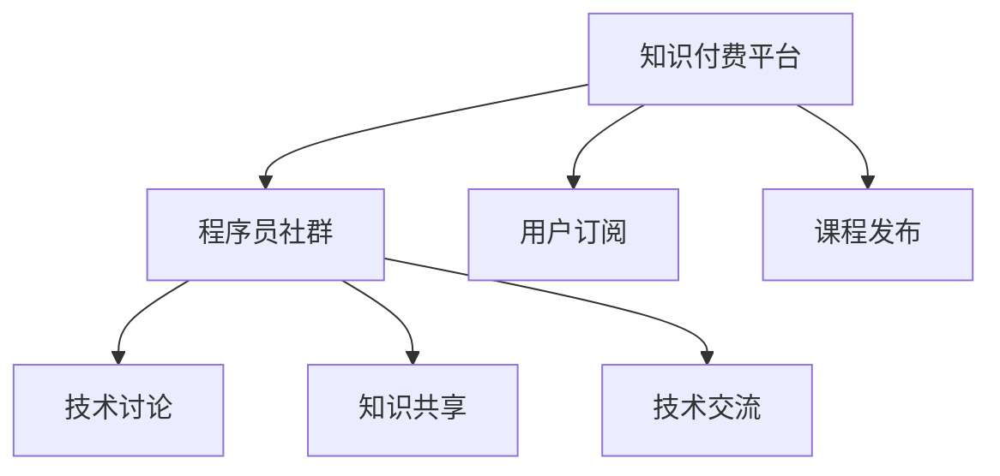

                 

## 1. 背景介绍

在当今信息爆炸的时代，知识付费已成为互联网经济的重要组成部分。特别是在技术领域，随着编程语言、框架、工具等的不断更新迭代，程序员面临着持续学习的压力。然而，如何有效地获取知识和经验，往往成为困扰许多程序员的问题。知识付费的出现，为程序员提供了一种便捷、高效的解决方案。

在知识付费平台上，程序员可以通过订阅专栏、购买课程、参与在线讨论等方式，快速获取最新技术动态、深入理解复杂问题、学习最佳实践，从而提高编程技能和效率。知识付费不仅帮助程序员提升自身竞争力，也促成了技术社区的发展和壮大。

本文将深入探讨程序员在知识付费平台上的社群运营方法，从策略制定到运营执行，详细介绍如何构建高效的知识分享和交流平台，帮助程序员快速成长，同时也为知识付费平台的运营者提供有价值的参考。

## 2. 核心概念与联系

### 2.1 核心概念概述

为了更好地理解知识付费平台上的程序员社群运营方法，我们需要明确几个核心概念及其相互联系：

- **知识付费平台**：指以知识为核心内容，通过订阅、付费等形式，为学习者提供高质量教育资源的平台，如Coursera、Udemy、GitHub等。
- **程序员社群**：指围绕特定编程语言、框架、工具等主题，由程序员组成的在线交流社区，如Stack Overflow、GitHub、技术博客等。
- **社群运营**：指在知识付费平台上，通过组织线上线下活动、发布高质量内容、构建互动平台等方式，促进社群成员之间的知识分享和交流，提升社群活跃度和价值。

这些核心概念之间的关系可以通过以下Mermaid流程图来展示：



这个流程图展示了知识付费平台如何通过课程发布、用户订阅等手段，连接程序员社群，构建起一个以知识分享和交流为核心的生态系统。

## 3. 核心算法原理 & 具体操作步骤

### 3.1 算法原理概述

知识付费平台上的程序员社群运营，本质上是一种基于内容推荐和社交网络的运营策略。其核心思想是通过算法推荐高质量的内容，并促进社群成员之间的互动交流，形成一个良性循环的知识分享生态。

具体而言，包括以下几个关键步骤：

1. **内容推荐**：通过算法模型，根据用户的历史行为、兴趣偏好等信息，推荐符合其需求的高质量内容。
2. **内容生产**：鼓励程序员分享技术文章、项目案例、代码片段等，构建社群的知识宝库。
3. **互动交流**：提供讨论区、问题解答、代码评论等功能，促进社群成员之间的互动和知识传播。
4. **社群管理**：通过设定规则、监督机制、激励措施等方式，维护社群的秩序和活跃度。

### 3.2 算法步骤详解

以下是知识付费平台上程序员社群运营的具体操作步骤：

**Step 1: 内容推荐策略**
- **用户画像构建**：通过收集用户的行为数据（如阅读历史、订阅课程、参与讨论等），构建用户画像，分析其兴趣和偏好。
- **内容相似性计算**：使用文本相似度算法（如TF-IDF、余弦相似度）计算内容之间的相似性，为内容推荐提供依据。
- **推荐算法应用**：根据用户画像和内容相似性，应用协同过滤、矩阵分解等推荐算法，实现个性化推荐。

**Step 2: 内容生产激励**
- **内容分享机制**：设计激励机制，如文章质量评分、阅读量奖励、参与度积分等，鼓励程序员分享有价值的内容。
- **专业认证体系**：建立认证体系，对高质量内容进行审核和认证，提升内容权威性。
- **技术社区入驻**：邀请知名技术专家入驻平台，参与内容生产和社群互动，提升平台影响力。

**Step 3: 互动交流机制**
- **讨论区建立**：创建讨论区，支持程序员围绕特定技术话题进行讨论和交流。
- **问题解答平台**：提供问题解答功能，鼓励社区成员互相帮助，解决编程难题。
- **代码评论系统**：实现代码评论功能，促进代码共享和改进。

**Step 4: 社群管理规范**
- **规则制定**：明确社群行为规范，如发言准则、内容版权、反垃圾信息等。
- **监督机制**：建立举报系统，及时处理违规行为，保持社群的良好氛围。
- **激励措施**：通过积分、徽章、排行榜等方式，激励积极参与的社群成员。

### 3.3 算法优缺点

知识付费平台上的程序员社群运营方法，具有以下优点：

1. **高效知识传播**：通过内容推荐和互动交流机制，将高质量内容迅速传播给有需求的学习者，提升知识获取效率。
2. **社群互动活跃**：互动交流机制促进了社群成员之间的知识分享和合作，提升了社群的活跃度和粘性。
3. **质量控制**：通过内容审核和认证体系，保证了社群中内容的高质量和权威性，避免低质量内容的泛滥。

然而，该方法也存在一些局限性：

1. **依赖平台算法**：内容推荐的效果很大程度上取决于算法的精准度和用户数据的完整性，数据质量不足可能导致推荐偏差。
2. **用户参与度不一**：部分程序员可能对内容推荐或互动交流不感兴趣，导致平台活跃度不高。
3. **管理成本高**：社群管理规范和监督机制的维护需要大量人工和资源投入，成本较高。

### 3.4 算法应用领域

知识付费平台上的程序员社群运营方法，适用于各种知识共享和技术交流的平台，如在线课程平台、开源社区、技术博客等。

具体应用领域包括：

- **在线课程平台**：通过个性化推荐和互动交流，提升课程的学习效果和用户满意度。
- **开源社区**：鼓励社区成员分享代码、项目案例，构建丰富的知识库，促进开源协作。
- **技术博客**：通过文章推荐和评论互动，促进高质量技术文章的传播和讨论。

## 4. 数学模型和公式 & 详细讲解 & 举例说明

### 4.1 数学模型构建

为了更好地理解知识付费平台上的程序员社群运营算法，这里将构建一个简单的推荐模型。假设平台上有N个用户U和M个内容C，每个用户与内容的互动关系可以表示为一个用户-内容互动矩阵R。

我们希望构建一个推荐系统，使得每个用户Ui能够得到对其最感兴趣的内容Ci的推荐。推荐系统的目标是最小化用户对推荐内容的不满意度，即最大化用户满意度S。

### 4.2 公式推导过程

根据用户满意度S的定义，我们可以写出目标函数：

$$
\minimize_{R} \sum_{i=1}^{N}\sum_{j=1}^{M} w_{ij}(r_{ij}-\hat{r}_{ij})^2
$$

其中，$r_{ij}$表示用户Ui对内容Cj的真实满意度，$\hat{r}_{ij}$表示系统推荐给用户Ui的内容Cj的预期满意度，$w_{ij}$为权重，用于平衡用户满意度的不同影响因素。

通过求解上述优化问题，可以得到推荐矩阵R。具体的推荐算法可以采用协同过滤、矩阵分解、深度学习等方法。

### 4.3 案例分析与讲解

假设某程序员社区包含100个用户和1000个技术文章。根据用户的历史行为数据，我们构建了一个用户-内容互动矩阵R，并使用协同过滤算法进行内容推荐。具体步骤如下：

1. 计算用户之间的相似度矩阵P，使用余弦相似度计算每个用户与其他用户之间的相似度。
2. 计算内容之间的相似度矩阵Q，使用TF-IDF算法计算每个内容与其他内容之间的相似度。
3. 计算推荐矩阵R，将用户之间的相似度和内容之间的相似度进行矩阵乘法。
4. 根据推荐矩阵R，为每个用户推荐最相关的内容，并展示在用户主页。

通过这种方法，我们能够将高质量的技术文章快速推荐给有需求的用户，促进社区的知识共享和交流。

## 5. 项目实践：代码实例和详细解释说明

### 5.1 开发环境搭建

在进行知识付费平台上的程序员社群运营开发前，我们需要准备好开发环境。以下是使用Python进行PyTorch开发的环境配置流程：

1. 安装Anaconda：从官网下载并安装Anaconda，用于创建独立的Python环境。

2. 创建并激活虚拟环境：
```bash
conda create -n pytorch-env python=3.8 
conda activate pytorch-env
```

3. 安装PyTorch：根据CUDA版本，从官网获取对应的安装命令。例如：
```bash
conda install pytorch torchvision torchaudio cudatoolkit=11.1 -c pytorch -c conda-forge
```

4. 安装Transformers库：
```bash
pip install transformers
```

5. 安装各类工具包：
```bash
pip install numpy pandas scikit-learn matplotlib tqdm jupyter notebook ipython
```

完成上述步骤后，即可在`pytorch-env`环境中开始开发。

### 5.2 源代码详细实现

这里我们以在线课程平台为例，给出使用PyTorch进行知识付费平台开发的PyTorch代码实现。

首先，定义课程推荐系统所需的数据处理函数：

```python
from transformers import BertTokenizer
from torch.utils.data import Dataset
import torch

class CourseDataset(Dataset):
    def __init__(self, courses, user_behavours, tokenizer, max_len=128):
        self.courses = courses
        self.user_behavours = user_behavours
        self.tokenizer = tokenizer
        self.max_len = max_len
        
    def __len__(self):
        return len(self.courses)
    
    def __getitem__(self, item):
        course = self.courses[item]
        behavours = self.user_behavours[item]
        
        encoding = self.tokenizer(course, return_tensors='pt', max_length=self.max_len, padding='max_length', truncation=True)
        input_ids = encoding['input_ids'][0]
        attention_mask = encoding['attention_mask'][0]
        
        # 对行为数据进行编码
        encoded_behavours = [behavour2id[behavour] for behavour in behavours] 
        encoded_behavours.extend([behavour2id['O']] * (self.max_len - len(encoded_behavours)))
        labels = torch.tensor(encoded_behavours, dtype=torch.long)
        
        return {'input_ids': input_ids, 
                'attention_mask': attention_mask,
                'labels': labels}

# 行为与id的映射
behavour2id = {'O': 0, 'bought': 1, 'viewed': 2, 'commented': 3, 'interested': 4}
id2behavour = {v: k for k, v in behavour2id.items()}

# 创建dataset
tokenizer = BertTokenizer.from_pretrained('bert-base-cased')

train_dataset = CourseDataset(train_courses, train_user_behavours, tokenizer)
dev_dataset = CourseDataset(dev_courses, dev_user_behavours, tokenizer)
test_dataset = CourseDataset(test_courses, test_user_behavours, tokenizer)
```

然后，定义模型和优化器：

```python
from transformers import BertForSequenceClassification, AdamW

model = BertForSequenceClassification.from_pretrained('bert-base-cased', num_labels=len(behavour2id))

optimizer = AdamW(model.parameters(), lr=2e-5)
```

接着，定义训练和评估函数：

```python
from torch.utils.data import DataLoader
from tqdm import tqdm
from sklearn.metrics import classification_report

device = torch.device('cuda') if torch.cuda.is_available() else torch.device('cpu')
model.to(device)

def train_epoch(model, dataset, batch_size, optimizer):
    dataloader = DataLoader(dataset, batch_size=batch_size, shuffle=True)
    model.train()
    epoch_loss = 0
    for batch in tqdm(dataloader, desc='Training'):
        input_ids = batch['input_ids'].to(device)
        attention_mask = batch['attention_mask'].to(device)
        labels = batch['labels'].to(device)
        model.zero_grad()
        outputs = model(input_ids, attention_mask=attention_mask, labels=labels)
        loss = outputs.loss
        epoch_loss += loss.item()
        loss.backward()
        optimizer.step()
    return epoch_loss / len(dataloader)

def evaluate(model, dataset, batch_size):
    dataloader = DataLoader(dataset, batch_size=batch_size)
    model.eval()
    preds, labels = [], []
    with torch.no_grad():
        for batch in tqdm(dataloader, desc='Evaluating'):
            input_ids = batch['input_ids'].to(device)
            attention_mask = batch['attention_mask'].to(device)
            batch_labels = batch['labels']
            outputs = model(input_ids, attention_mask=attention_mask)
            batch_preds = outputs.logits.argmax(dim=2).to('cpu').tolist()
            batch_labels = batch_labels.to('cpu').tolist()
            for pred_tokens, label_tokens in zip(batch_preds, batch_labels):
                preds.append(pred_tokens[:len(label_tokens)])
                labels.append(label_tokens)
                
    print(classification_report(labels, preds))
```

最后，启动训练流程并在测试集上评估：

```python
epochs = 5
batch_size = 16

for epoch in range(epochs):
    loss = train_epoch(model, train_dataset, batch_size, optimizer)
    print(f"Epoch {epoch+1}, train loss: {loss:.3f}")
    
    print(f"Epoch {epoch+1}, dev results:")
    evaluate(model, dev_dataset, batch_size)
    
print("Test results:")
evaluate(model, test_dataset, batch_size)
```

以上就是使用PyTorch对在线课程平台进行开发的完整代码实现。可以看到，通过PyTorch和Transformers库，我们可以相对简洁地构建课程推荐系统，实现个性化推荐和用户行为分析。

### 5.3 代码解读与分析

让我们再详细解读一下关键代码的实现细节：

**CourseDataset类**：
- `__init__`方法：初始化课程、用户行为数据、分词器等组件，以及设置最大长度。
- `__len__`方法：返回数据集的样本数量。
- `__getitem__`方法：对单个样本进行处理，将课程和行为数据输入编码为token ids，将行为数据编码为数字标签，并对其进行定长padding，最终返回模型所需的输入。

**behavour2id和id2behavour字典**：
- 定义了行为与数字id之间的映射关系，用于将token-wise的预测结果解码回实际行为。

**训练和评估函数**：
- 使用PyTorch的DataLoader对数据集进行批次化加载，供模型训练和推理使用。
- 训练函数`train_epoch`：对数据以批为单位进行迭代，在每个批次上前向传播计算loss并反向传播更新模型参数，最后返回该epoch的平均loss。
- 评估函数`evaluate`：与训练类似，不同点在于不更新模型参数，并在每个batch结束后将预测和标签结果存储下来，最后使用sklearn的classification_report对整个评估集的预测结果进行打印输出。

**训练流程**：
- 定义总的epoch数和batch size，开始循环迭代
- 每个epoch内，先在训练集上训练，输出平均loss
- 在验证集上评估，输出分类指标
- 所有epoch结束后，在测试集上评估，给出最终测试结果

可以看到，PyTorch配合Transformers库使得在线课程平台的开发变得简洁高效。开发者可以将更多精力放在数据处理、模型改进等高层逻辑上，而不必过多关注底层的实现细节。

当然，工业级的系统实现还需考虑更多因素，如模型的保存和部署、超参数的自动搜索、更灵活的任务适配层等。但核心的推荐范式基本与此类似。

## 6. 实际应用场景

### 6.1 智能教育平台

在线课程平台的知识付费模式，已经被广泛应用于智能教育中。智能教育平台通过个性化的课程推荐，帮助学生更快、更精准地找到适合自己的学习资源。这种模式不仅提高了学生的学习效率，也为教育机构提供了新的收入来源。

在技术实现上，可以收集学生的历史学习数据、学习行为、成绩等信息，将这些数据作为监督信号，对预训练的课程推荐模型进行微调。微调后的模型能够更准确地预测学生对课程的兴趣和满意度，从而生成个性化的课程推荐列表。

### 6.2 企业培训平台

企业培训平台通过在线课程的订阅和付费，帮助员工提升技能，推动企业的人才培养和知识管理。大型的企业机构通常拥有丰富的培训资源，但如何高效地将资源转化为员工的学习动力，是一个重要的挑战。

在线课程平台可以通过企业内部的学习管理系统（LMS）接入，提供企业培训课程的个性化推荐，并通过积分、奖励等机制激励员工的学习行为。同时，平台还可以提供课程评价、反馈等功能，帮助企业了解员工的学习效果，持续优化培训内容。

### 6.3 创业孵化器

创业孵化器通过在线课程平台，为初创企业提供丰富的创业资源和专业指导，帮助他们快速成长。创业孵化器通常具有丰富的行业资源和经验，但如何将这些资源转化为有价值的学习内容，是一个难题。

在线课程平台可以通过合作模式，邀请行业专家和企业领袖参与课程制作，提供实战案例和经验分享。同时，平台还可以提供创业项目评估、资源对接等服务，为初创企业提供全方位的支持。

### 6.4 未来应用展望

随着知识付费平台的发展，未来的在线课程推荐系统将呈现以下几个趋势：

1. **个性化推荐算法**：通过深度学习、强化学习等技术，进一步提升推荐算法的精准度，实现更个性化的课程推荐。
2. **多模态数据融合**：结合视频、音频、文本等多模态数据，构建更全面、立体的学习体验。
3. **自适应学习路径**：根据用户的学习进度和兴趣，动态调整课程内容和难度，实现自适应学习。
4. **社区化学习**：通过社群互动、协作学习等方式，构建社区化学习模式，提升学习效果。
5. **智能化评估**：通过自动评估、同伴评审等方式，实时反馈学习效果，指导学习方向。

这些趋势将使知识付费平台不仅仅是课程推荐工具，更将成为连接知识、技术、人力的智能学习平台。随着技术的不断进步，知识付费平台将进一步推动在线教育的发展，为个人、企业、行业带来更多的价值。

## 7. 工具和资源推荐

### 7.1 学习资源推荐

为了帮助开发者系统掌握知识付费平台上的程序员社群运营的理论基础和实践技巧，这里推荐一些优质的学习资源：

1. 《Transformer from Principles to Practice》系列博文：由大模型技术专家撰写，深入浅出地介绍了Transformer原理、BERT模型、推荐技术等前沿话题。

2. Coursera《Deep Learning》课程：由Andrew Ng教授主讲，涵盖深度学习的基础理论和实践应用，适合入门学习。

3. Udacity《Machine Learning》课程：提供从数据预处理到模型评估的完整流程，适合进阶学习。

4. 《Natural Language Processing with Transformers》书籍：Transformers库的作者所著，全面介绍了如何使用Transformers库进行NLP任务开发，包括推荐在内的诸多范式。

5. Weights & Biases：模型训练的实验跟踪工具，可以记录和可视化模型训练过程中的各项指标，方便对比和调优。

6. Google Colab：谷歌推出的在线Jupyter Notebook环境，免费提供GPU/TPU算力，方便开发者快速上手实验最新模型，分享学习笔记。

通过对这些资源的学习实践，相信你一定能够快速掌握知识付费平台上的程序员社群运营的精髓，并用于解决实际的NLP问题。

### 7.2 开发工具推荐

高效的开发离不开优秀的工具支持。以下是几款用于知识付费平台开发的常用工具：

1. PyTorch：基于Python的开源深度学习框架，灵活动态的计算图，适合快速迭代研究。大部分预训练语言模型都有PyTorch版本的实现。

2. TensorFlow：由Google主导开发的开源深度学习框架，生产部署方便，适合大规模工程应用。同样有丰富的预训练语言模型资源。

3. Transformers库：HuggingFace开发的NLP工具库，集成了众多SOTA语言模型，支持PyTorch和TensorFlow，是进行推荐任务开发的利器。

4. Weights & Biases：模型训练的实验跟踪工具，可以记录和可视化模型训练过程中的各项指标，方便对比和调优。

5. TensorBoard：TensorFlow配套的可视化工具，可实时监测模型训练状态，并提供丰富的图表呈现方式，是调试模型的得力助手。

6. Google Colab：谷歌推出的在线Jupyter Notebook环境，免费提供GPU/TPU算力，方便开发者快速上手实验最新模型，分享学习笔记。

合理利用这些工具，可以显著提升知识付费平台开发的效率，加快创新迭代的步伐。

### 7.3 相关论文推荐

知识付费平台上的程序员社群运营技术的发展源于学界的持续研究。以下是几篇奠基性的相关论文，推荐阅读：

1. Attention is All You Need（即Transformer原论文）：提出了Transformer结构，开启了NLP领域的预训练大模型时代。

2. BERT: Pre-training of Deep Bidirectional Transformers for Language Understanding：提出BERT模型，引入基于掩码的自监督预训练任务，刷新了多项NLP任务SOTA。

3. Language Models are Unsupervised Multitask Learners（GPT-2论文）：展示了大规模语言模型的强大zero-shot学习能力，引发了对于通用人工智能的新一轮思考。

4. Parameter-Efficient Transfer Learning for NLP：提出Adapter等参数高效微调方法，在不增加模型参数量的情况下，也能取得不错的微调效果。

5. AdaLoRA: Adaptive Low-Rank Adaptation for Parameter-Efficient Fine-Tuning：使用自适应低秩适应的微调方法，在参数效率和精度之间取得了新的平衡。

这些论文代表了大语言模型微调技术的发展脉络。通过学习这些前沿成果，可以帮助研究者把握学科前进方向，激发更多的创新灵感。

## 8. 总结：未来发展趋势与挑战

### 8.1 总结

本文对知识付费平台上的程序员社群运营方法进行了全面系统的介绍。首先阐述了知识付费平台的发展背景和程序员社群运营的意义，明确了社群运营在知识付费平台中的重要地位。其次，从原理到实践，详细讲解了推荐算法的构建和实现，提供了完整代码实例。同时，本文还广泛探讨了社群运营在智能教育、企业培训、创业孵化等不同场景下的应用前景，展示了知识付费平台的多样化应用场景。此外，本文精选了社群运营的学习资源，力求为读者提供全方位的技术指引。

通过本文的系统梳理，可以看到，知识付费平台上的程序员社群运营方法，正在成为智能教育、企业培训等领域的重要范式，极大地提升了用户的学习效果和平台的用户粘性。未来，随着知识付费平台的不断发展，社群运营技术将迎来更多的创新和突破，进一步推动技术社区的繁荣和知识传播的普及。

### 8.2 未来发展趋势

展望未来，知识付费平台上的程序员社群运营技术将呈现以下几个发展趋势：

1. **算法创新**：推荐算法的精度和效率将不断提升，结合深度学习、强化学习等新技术，实现更加个性化的推荐。
2. **多模态融合**：结合视频、音频、文本等多模态数据，构建更全面、立体的学习体验。
3. **自适应学习**：根据用户的学习进度和兴趣，动态调整课程内容和难度，实现自适应学习。
4. **社区化学习**：通过社群互动、协作学习等方式，构建社区化学习模式，提升学习效果。
5. **智能化评估**：通过自动评估、同伴评审等方式，实时反馈学习效果，指导学习方向。

这些趋势将使知识付费平台不仅是一个课程推荐工具，更将成为连接知识、技术、人力的智能学习平台。

### 8.3 面临的挑战

尽管知识付费平台上的程序员社群运营技术已经取得了瞩目成就，但在迈向更加智能化、普适化应用的过程中，它仍面临着诸多挑战：

1. **数据质量问题**：推荐算法的精准度很大程度上依赖于数据的质量，数据缺失、噪声等问题会影响推荐效果。
2. **算法透明性不足**：推荐算法的黑盒特性，使得用户难以理解其内部机制，导致信任度降低。
3. **用户隐私保护**：平台需要处理大量用户数据，如何确保用户隐私安全是一个重要挑战。
4. **技术门槛较高**：推荐系统需要复杂的算法和模型训练，对技术要求较高，增加了平台开发的难度。

### 8.4 研究展望

面对知识付费平台上的程序员社群运营所面临的挑战，未来的研究需要在以下几个方面寻求新的突破：

1. **数据增强**：通过数据清洗、补全等技术，提升数据质量，增强推荐算法的准确性。
2. **模型透明性**：通过可解释性技术，增强推荐算法的透明性，提升用户信任度。
3. **隐私保护**：通过差分隐私、联邦学习等技术，确保用户数据的安全性和隐私性。
4. **易用性提升**：通过简化技术接口、降低使用门槛等方式，提升知识付费平台的易用性。

这些研究方向将使知识付费平台上的程序员社群运营技术更加成熟和普及，进一步推动技术社区的发展和知识传播的普及。总之，知识付费平台的社群运营技术，将在构建智能学习社区、推动知识共享与传播方面发挥越来越重要的作用。

## 9. 附录：常见问题与解答

**Q1：知识付费平台如何吸引更多用户参与？**

A: 知识付费平台可以通过以下几种方式吸引更多用户参与：
1. 提供高质量课程：邀请知名专家和行业领袖制作高质量课程，提升平台的吸引力和竞争力。
2. 设置用户激励机制：通过积分、奖励、排行榜等方式，激励用户积极参与学习、分享和讨论。
3. 提升用户体验：优化课程界面、提升互动体验、提供个性化推荐等，提升用户的使用满意度。

**Q2：知识付费平台如何保持用户粘性？**

A: 知识付费平台可以通过以下几种方式保持用户粘性：
1. 定期更新课程内容：保持课程内容的更新和多样性，吸引用户持续关注和学习。
2. 构建社区生态：通过社群讨论、问题解答、代码评论等功能，构建社区生态，增强用户粘性。
3. 提供多样化学习路径：根据用户的学习进度和兴趣，提供多样化的学习路径，满足不同用户的需求。

**Q3：知识付费平台如何确保推荐算法的精准度？**

A: 推荐算法的精准度很大程度上依赖于数据的质量和算法的优化。具体方法包括：
1. 数据清洗和增强：通过数据清洗、补全、增强等技术，提升数据质量。
2. 算法优化：结合深度学习、强化学习等新技术，不断优化推荐算法，提升精准度。
3. 模型评估和迭代：通过A/B测试等手段，不断评估和优化推荐模型，提升用户体验。

**Q4：知识付费平台如何进行用户画像构建？**

A: 用户画像构建可以通过以下几种方式进行：
1. 收集用户行为数据：收集用户在平台上的学习行为、课程评价、互动数据等，构建用户行为记录。
2. 特征提取：对行为数据进行特征提取，如课程完成度、评分、互动频率等，构建用户画像。
3. 数据建模：结合机器学习、深度学习等技术，构建用户画像模型，实现用户行为的预测和推荐。

**Q5：知识付费平台如何进行内容审核和认证？**

A: 知识付费平台可以通过以下几种方式进行内容审核和认证：
1. 建立专家评审机制：邀请行业专家对课程内容进行评审，确保课程的专业性和权威性。
2. 设置内容审核标准：制定内容审核标准，对课程内容进行审核和认证，确保内容的真实性和准确性。
3. 使用自动化工具：结合自然语言处理技术，使用自动化工具进行内容审核，提升审核效率。

**Q6：知识付费平台如何进行隐私保护？**

A: 知识付费平台可以通过以下几种方式进行隐私保护：
1. 数据加密：对用户数据进行加密存储和传输，确保数据安全。
2. 差分隐私：采用差分隐私技术，保护用户隐私，避免数据泄露。
3. 用户权限管理：通过用户权限管理，控制数据的访问和使用权限，确保用户隐私安全。

通过这些方法，知识付费平台可以更好地保护用户隐私，提升用户信任度和平台的用户粘性。

---

作者：禅与计算机程序设计艺术 / Zen and the Art of Computer Programming

